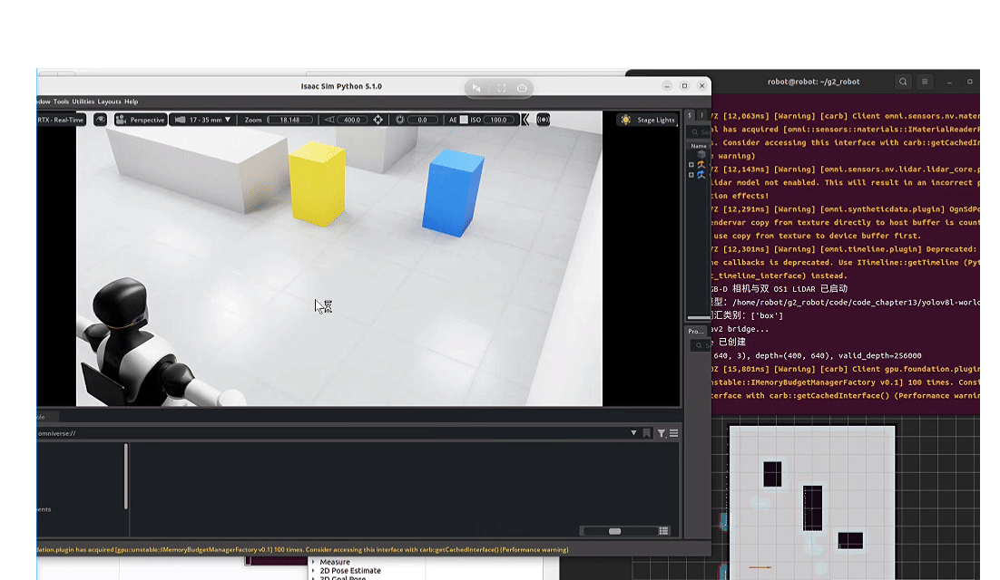
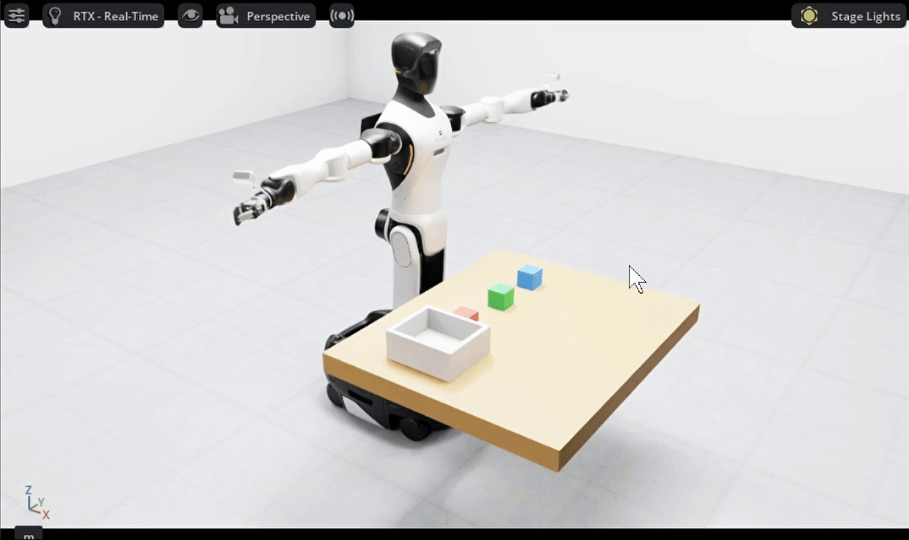

<h1 align="center"> Hello-Robotics </h1>

<table align="center">
  <tr>
    <td colspan="2" valign="top" align="center">
      
       
      <strong>给大家比个心，希望大家能够喜欢我们的教程</strong>
    </td>
  </tr>
</table>

## 🎯 项目介绍

> &emsp;&emsp;*Hello-Robotics 是一个面向机器人开发与具身智能的开源实践教程项目。项目以仿真为起点，围绕感知、建图、规划、控制与智能决策，逐步构建适用于不同机器人本体的系统化学习与开发体系。*

&emsp;&emsp;当前机器人仿真与具身智能领域仍缺乏贯通环境搭建、感知建图、导航操作、运动控制与大模型决策的一体化、可复现、循序渐进的实践教程，现有资料较为零散、学习门槛较高，难以帮助学习者建立完整的工程体系。Hello-Robotics 通过 Isaac Sim、ROS 2 等工具，打通从传感器数据输入到机器人动作执行的完整链路，将经典机器人技术与 VLM、VLA、WM等具身智能前沿方法相结合，为教学实践、算法验证和系统开发提供统一基础。

&emsp;&emsp;项目不局限于单一机器人，而是面向人形机器人、四足机器人、无人机、轮式机器人和机械臂等多种平台持续扩展。视觉感知、点云处理、环境建图和大模型接入等通用能力将沉淀为可复用的方法与模块。运动学、控制方式、规划策略和任务执行等本体相关内容，则根据不同机器人的结构特点和应用场景分别设计，避免将同一套方案简单套用到所有平台。通过这种通用能力复用、本体能力专项适配的方式，项目既能降低机器人开发的入门成本，也可为前沿具身智能算法提供可扩展的验证底座。

&emsp;&emsp;随着智能制造、服务机器人、低空经济和具身智能的发展，行业对人才的要求正在从掌握单个算法转向能够完成机器人系统集成与任务闭环。本项目以可运行的代码和完整实践任务为核心，帮助学习者建立从算法理解到工程落地的能力，可用于机器人入门学习、科研验证、项目开发以及相关岗位能力提升。

#### 项目内容均由我们自主编写与整理，难免存在疏漏或不足，无论你是新手小白还是行业资深大佬，都欢迎大家通过Datawhale、 Issue 或 Pull Request 提出意见与改进建议，你们每一个人的建议都对我们课程有着很大的帮助。我们将悉心听取大家的意见，持续修改完善教程，努力为每一位学习者提供更加准确、清晰、友好的学习体验。

## ✨ 教程亮点

- 📖 **Datawhale 开源免费** 完全免费学习本项目所有内容，与社区共同成长
- 🤖 **面向多种机器人本体**：以具体机器人为实践载体，逐步覆盖轮式机器人、人形机器人、四足机器人、无人机等不同平台，全部采用例如智元G2，宇树G1\GO2等业内比较成熟先进的机器人进行教程讲解，学完可以直接迁移到行业应用中。
- 🧩 **通用能力沉淀复用**：视觉感知、点云处理、建图定位和智能模型接入等内容形成可复用模块，整体代码自主编写，代码简洁易懂，功能独立，没有复杂的代码结构，减少重复学习与开发成本。
- ⚙️ **本体能力专项适配**：针对不同机器人的结构、运动约束和应用场景，分别讲解其运动学、控制、规划与任务实现，而不是机械复用同一套代码。
- 🔄 **强调完整任务闭环**：贯通环境感知—状态理解—任务决策—运动规划—动作执行，避免知识停留在孤立算法和演示效果上。
- 🧠 **连接传统机器人与具身智能**：在经典感知、建图、规划和控制技术的基础上，引入 VLM、VLA、WM等前沿模型，持续跟踪前沿动向，探索大模型在机器人任务中的实际应用。
- 🛠️ **突出工程实践能力**：重视坐标系、数据接口、配置管理、模型部署、系统联调和问题排查，培养机器人岗位真正需要的系统集成能力。
- 🚀 **兼顾学习、科研与就业**：既适合机器人初学者建立完整知识体系，也可作为科研算法验证、工程项目开发和岗位技能训练的实践基础。
- 🌱 **开源共建、持续演进**：随着机器人平台和具身智能技术的发展，持续增加新的本体适配、算法模块、实验场景与综合任务。

## 🔍 效果展示

<table align="center">
  <tr>
    <td width="50%" valign="top" align="center">
      
       
      <strong>g2双雷达模块搭建</strong>
       
      原有g2没有激光雷达发布，因此在g2上加载了两个激光雷达
    </td>
    <td width="50%" valign="top" align="center">
      
       
      <strong>视觉目标检测</strong>
       
      g2采用yolo26对环境中的物体进行目标检测
    </td>
  </tr>
  <tr>
    <td width="50%" valign="top" align="center">
      
       
      <strong>纯手搓双雷达3d建图算法</strong>
       
      教程编写简单易懂的3d建图算法帮助大家入门3d建图
    </td>
    <td width="50%" valign="top" align="center">
      
       
      <strong>纯手搓双雷达2d建图算法</strong>
       
      教程采用3d建图的双3d激光雷达点云编写2d建图算法
    </td>
  </tr>
  <tr>
    <td width="50%" valign="top" align="center">
      
       
      <strong>底盘导航规划算法</strong>
       
      g2全局导航与自主避障
    </td>
    <td width="50%" valign="top" align="center">
      
       
      <strong>机械臂规划算法</strong>
       
      g2机械臂定点抓取与自主避障
    </td>
  </tr>
  <tr>
    <td width="50%" valign="top" align="center">
      
       
      <strong>vlm算法实践</strong>
       
      g2本地部署qwen3vl进行语义理解和环境感知
    </td>
    <td width="50%" valign="top" align="center">
      
       
      <strong>vla算法实践</strong>
       
      通过数据采集微调pi0.5模型，完成g2的物块抓取
    </td>
  </tr>

</table>

## 📖 内容导航

| 章节                                                                                        | 关键内容                                      | 状态 |
| ------------------------------------------------------------------------------------------- | --------------------------------------------- | ---- |
| <strong>第一部分 构建虚拟世界：IsaacSim快速入门</strong>                                       |                                               |      |
| [第一章 Isaacsim环境配置与安装](./docs/chapter1/第一章%20Isaacsim环境配置与安装.md)                        |                   | ✅    |
| [第二章 Isaacsim基本使用](./docs/chapter2/第二章%20Isaacsim基本使用.md)                            |              | ✅    |
| [第三章 Isaacsim综合实践](./docs/chapter3/第三章%20Isaacsim综合实践.md)                         |           | 🚧    |
| <strong>第二部分 掌控机械躯体：机器人运动控制实战</strong>                                     |                                               |      |
| [第四章 移动底盘运动学与控制](./docs/chapter4/第四章%20移动底盘运动学与控制.md)                | 底盘拆解与线速度角速度控制  | ✅  |
| [第五章 机械臂运动学与关节控制](./docs/chapter5/第五章%20机械臂运动学与关节控制.md)                | 机械臂关节控制、正逆运动学（FK/IK）求解   | ✅    |
| 第六章 运动控制综合实践：移动与抓取                    | 结合底盘与机械臂，完成简单轨迹规划与定点抓取演练 | 🚧    |
| <strong>第三部分 接入多维感官：视觉感知与环境理解</strong>                                      |                                               |      |
| [第七章 视觉感知算法](./docs/chapter7/第七章%20视觉感知算法.md)                                | CV基础，YOLO检测分割算法讲解，实现仿真环境下的物体识别与语义分割  | ✅    |
| [第八章 雷达点云建图](./docs/chapter8/第八章%20雷达点云建图.md)                             | 点云与建图                         | ✅    |
| 第九章 感知控制综合实践：视觉感知控制                      | 结合视觉感知与机械臂控制，完成基于视觉引导的动态抓取任务              | 🚧    |
| <strong>第四部分 穿梭复杂场景：SLAM建图与自主导航</strong>                                    |                                               |      |
| [第十章 移动底盘规划基础与Nav2框架](./docs/chapter10/第十章%20移动底盘规划基础与Nav2框架.md)               | 全局路径规划与局部避障算法部署       | ✅    |
| [第十一章 机械臂规划基础与MoveIt2框架](./docs/chapter11/第十一章%20机械臂规划基础与MoveIt2框架.md)                   | 机械臂规划与控制              | ✅    |
| 第十二章 导航综合实践：全场景自主巡航                  | 结合建图与导航算法，实现复杂动态环境下的多点巡航与避障              | 🚧    |
| <strong>第五部分 注入智能灵魂：任务规划与具身决策</strong>                                   |                                               |      |
| [第十三章 VLM接入与Prompt工程](./docs/chapter13/第十三章%20VLM接入与Prompt工程.md)        | 调用Qwen3-vl，设计适用于机器人任务的系统提示词与交互逻辑                  | ✅    |
| [第十四章 视觉语言动作模型部署](./docs/chapter14/第十四章%20视觉语言动作模型部署.md)       | 采用vla模型，通过pi0.5模型微调实现从视觉输入到机械臂动作的直接输出          | ✅    |
| [第十五章 经验驱动的VLA强化学习微调](./docs/chapter14/第十四章%20视觉语言动作模型部署.md)       | 采用π0.6（recap），通过真实机器人经验与人工纠正进行强化学习微调      | 🚧    |
| [第十六章 潜在动作世界模型](./docs/chapter14/第十四章%20视觉语言动作模型部署.md)       | 讲解Motus世界模型，统一视觉理解、未来预测与机器人动作生成   | 🚧    |
| 第十七章 决策闭环综合实践：听指令做任务                    | 打通感知、大模型决策与底层控制，实现感知理解并执行的完整闭环                 | 🚧    |
| <strong>第六部分 走向前沿落地：前沿具身算法部署实践</strong>                                   |                                               |      |
| [第十八章 Acot-vla模型部署](./docs/chapter16/第十六章%20Acot-vla模型部署.md)               | ACoT-VLA 是一种将推理过程从视觉感知转向动作生成、以动作语言进行思考的vla模型，旨在弥合语义理解与机器人运动控制之间的差距。                 | 🚧    |
| 第十九章 前沿算法部署2                    |                  | 🚧    |

## 🗺️ 已完成内容与下一步规划

### ✅ 已完成内容

- ✅ **完成 G2 系统化基础教程**：围绕智元 G2，已经完成 Isaac Sim 环境搭建、机器人运动控制、视觉感知、点云建图、自主导航、机械臂规划以及大模型接入等核心内容的理论讲解与实验验证。
- ✅ **打通机器人核心技术链路**：教程覆盖从传感器数据输入、环境感知与建图，到任务理解、路径规划、运动控制和动作执行的完整流程，帮助学习者建立机器人系统级开发思维。
- ✅ **完成经典算法与具身智能的衔接**：在 ROS 2、Nav2、MoveIt 2 等传统机器人技术基础上，进一步引入 Qwen3-VL、π0.5 等 VLM、VLA 模型，探索大模型在机器人任务理解与动作生成中的部署方法。
- ✅ **形成可复用的通用能力模块**：视觉感知、点云处理、环境建图、定位导航和大模型接入等内容已经形成相对独立的教学模块，可继续复用于不同机器人平台。
- ✅ **建立可复现的仿真实践基础**：项目以 Isaac Sim 和可运行代码为核心，为机器人算法学习、科研验证、系统集成和前沿模型部署提供统一的实验环境。

### 🚀 下一步规划

- 🚀 **补充完整的综合实践任务**：现有教程每一章都包含实验案例，已经是一个完整的教学内容，后续将继续完善g2中的综合案例部分。
- 🚀 **扩展更多机器人平台**：在 G2 教程基础上，后续将增加宇树 GO2 四足机器人和 G1 人形机器人的专项教学，并逐步拓展到更多机械臂、无人机及其他机器人本体。GO2、G1 等新平台将复用g2中的视觉感知、点云处理、环境建图和大模型接入方法，这些是机器人通用的不在重新讲解；运动学、控制、规划和任务执行部分则根据不同本体的结构与运动特点重新设计。
- 🚀 **持续部署机器人前沿算法**：项目将以 G2 为主要实验平台之一，持续跟进并部署适用于轮式人形机器人的前沿算法，内容覆盖自主导航、机械臂操作、视觉语言模型、视觉语言动作模型、世界模型以及具身决策等方向。
- 🚀 **建设多机器人算法验证平台**：逐步形成以 G2、GO2 和 G1 为代表的多机器人教学与验证体系，让同一类算法能够在不同机器人结构、传感器配置和任务场景中进行对比与迁移。
- 🚀 **推动社区共建与算法复现**：欢迎大家基于 G2，以及后续加入的 GO2、G1 等机器人平台，复现和部署自己关注的前沿算法，并通过 Issue、Pull Request 或实践案例共同完善项目。

## 🤝 如何贡献

我们是一个开放的开源社区，欢迎任何形式的贡献！

- 🐛 <strong>报告 Bug</strong> - 发现内容或代码问题，请提交 Issue
- 💡 <strong>提出建议</strong> - 对项目有好想法，欢迎发起讨论
- 📝 <strong>完善内容</strong> - 帮助改进教程，提交你的 Pull Request
- ✍️ <strong>分享实践</strong> - 在"社区贡献精选"中分享你的学习笔记和项目

## 🙏 致谢

| 姓名 | 职责 | 简介 | 贡献内容 |
| :----| :---- | :---- | :---- |
| 李昀迪 | 项目负责人 | 北京科技大学 | 全文编写校对，总体算法及框架构建 |
| 陈可为 | 联合发起者 | 中国科学院大学 | 第五章 内容贡献 |
| 张天一 | 联合发起者 | 北京工业大学 | 第十八章 内容贡献 |

## 参与贡献

- 如果你发现了一些问题，可以提Issue进行反馈，如果提完没有人回复你可以联系[保姆团队](https://github.com/datawhalechina/DOPMC/blob/main/OP.md)的同学进行反馈跟进~
- 如果你想参与贡献本项目，可以提Pull Request，如果提完没有人回复你可以联系[保姆团队](https://github.com/datawhalechina/DOPMC/blob/main/OP.md)的同学进行反馈跟进~
- 如果你对 Datawhale 很感兴趣并想要发起一个新的项目，请按照[Datawhale开源项目指南](https://github.com/datawhalechina/DOPMC/blob/main/GUIDE.md)进行操作即可~

## 关注我们

扫描下方二维码关注公众号：Datawhale

## LICENSE

 本作品采用<a rel="license" href="http://creativecommons.org/licenses/by-nc-sa/4.0/">知识共享署名-非商业性使用-相同方式共享 4.0 国际许可协议</a>进行许可。
*注：默认使用CC 4.0协议，也可根据自身项目情况选用其他协议*
