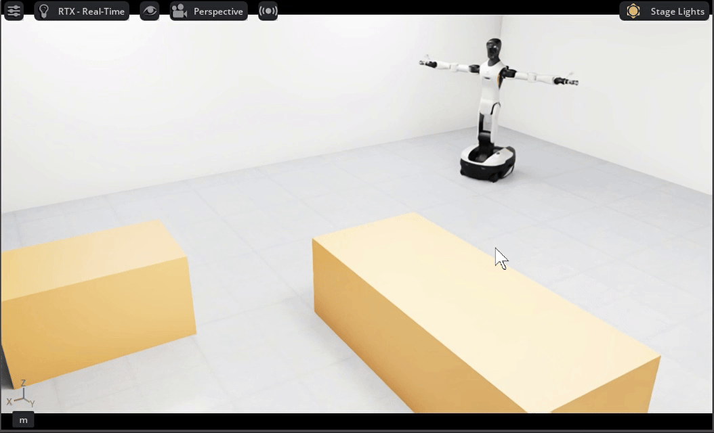
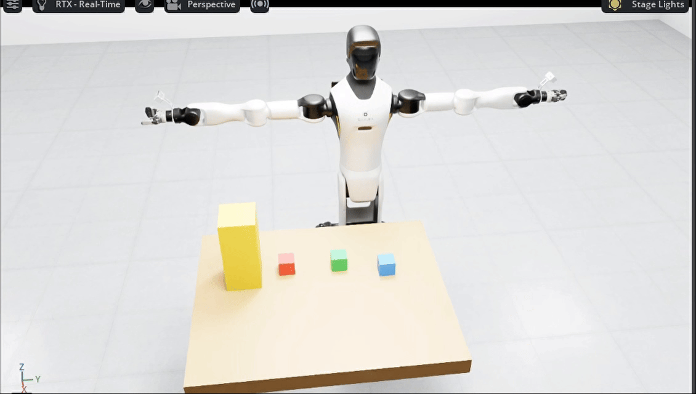

<h1 align="center"> Hello-Robotics </h1>

## 🎯 项目介绍

> &emsp;&emsp;*Hello-Robotics 是一个面向机器人开发与具身智能的开源实践教程项目。项目以仿真为起点，围绕感知、建图、规划、控制与智能决策，逐步构建适用于不同机器人本体的系统化学习与开发体系。*

&emsp;&emsp;当前机器人仿真与具身智能领域仍缺乏贯通环境搭建、感知建图、导航操作、运动控制与大模型决策的一体化、可复现、循序渐进的实践教程，现有资料较为零散、学习门槛较高，难以帮助学习者建立完整的工程体系。Hello-Robotics 通过 Isaac Sim、ROS 2 等工具，打通从传感器数据输入到机器人动作执行的完整链路，将经典机器人技术与 VLM、VLA 等具身智能方法相结合，为教学实践、算法验证和系统开发提供统一基础。

&emsp;&emsp;项目不局限于单一机器人，而是面向人形机器人、四足机器人、无人机、轮式机器人和机械臂等多种平台持续扩展。视觉感知、点云处理、环境建图和大模型接入等通用能力将沉淀为可复用的方法与模块。运动学、控制方式、规划策略和任务执行等本体相关内容，则根据不同机器人的结构特点和应用场景分别设计，避免将同一套方案简单套用到所有平台。通过这种通用能力复用、本体能力专项适配的方式，项目既能降低机器人开发的入门成本，也可为前沿具身智能算法提供可扩展的验证底座。

&emsp;&emsp;随着智能制造、服务机器人、低空经济和具身智能的发展，行业对人才的要求正在从掌握单个算法转向能够完成机器人系统集成与任务闭环。本项目以可运行的代码和完整实践任务为核心，帮助学习者建立从算法理解到工程落地的能力，可用于机器人入门学习、科研验证、项目开发以及相关岗位能力提升。

### ✨ 教程亮点

- 📖 <strong>Datawhale 开源免费</strong> 完全免费学习本项目所有内容，与社区共同成长
- 🤖 **面向多种机器人本体**：以具体机器人为实践载体，逐步覆盖轮式机器人、人形机器人、四足机器人、无人机等不同平台。
- 🧩 **通用能力沉淀复用**：视觉感知、点云处理、建图定位和智能模型接入等内容形成可复用模块，代码简洁易懂，没有复杂的代码结构，减少重复学习与开发成本。
- ⚙️ **本体能力专项适配**：针对不同机器人的结构、运动约束和应用场景，分别讲解其运动学、控制、规划与任务实现，而不是机械复用同一套代码。
- 🔄 **强调完整任务闭环**：贯通环境感知—状态理解—任务决策—运动规划—动作执行，避免知识停留在孤立算法和演示效果上。
- 🧠 **连接传统机器人与具身智能**：在经典感知、建图、规划和控制技术的基础上，引入 VLM、VLA、WM等前沿模型，持续跟踪前沿动向，探索大模型在机器人任务中的实际应用。
- 🛠️ **突出工程实践能力**：重视坐标系、数据接口、配置管理、模型部署、系统联调和问题排查，培养机器人岗位真正需要的系统集成能力。
- 🧪 **降低学习与实验门槛**：通过仿真完成可重复、可观察、低风险的算法实验，为后续部署到真实机器人提供基础。
- 🚀 **兼顾学习、科研与就业**：既适合机器人初学者建立完整知识体系，也可作为科研算法验证、工程项目开发和岗位技能训练的实践基础。
- 🌱 **开源共建、持续演进**：随着机器人平台和具身智能技术的发展，持续增加新的本体适配、算法模块、实验场景与综合任务。

## 🔍 效果展示

<table align="center">
  <tr>
    <td colspan="2" valign="top" align="center">
      
       
      <strong>底盘机械臂基础控制</strong>
       
      <strong>给大家比个心，希望大家能够喜欢我们的教程</strong>
    </td>
  </tr>
  <tr>
    <td width="50%" valign="top" align="center">
      
       
      <strong>g2双雷达模块搭建</strong>
       
      原有g2没有激光雷达发布，因此在g2上加载了两个激光雷达
    </td>
    <td width="50%" valign="top" align="center">
      
       
      <strong>视觉目标检测</strong>
       
      g2采用yolo26对环境中的物体进行目标检测
    </td>
  </tr>
  <tr>
    <td width="50%" valign="top" align="center">
      
       
      <strong>纯手搓双雷达3d建图算法</strong>
       
      教程编写简单易懂的3d建图算法帮助大家入门3d建图
    </td>
    <td width="50%" valign="top" align="center">
      
       
      <strong>纯手搓双雷达2d建图算法</strong>
       
      教程采用3d建图的双3d激光雷达点云编写2d建图算法
    </td>
  </tr>
  <tr>
    <td width="50%" valign="top" align="center">
      
       
      <strong>底盘导航规划算法</strong>
       
      g2全局导航与自主避障
    </td>
    <td width="50%" valign="top" align="center">
      
       
      <strong>机械臂规划算法</strong>
       
      g2机械臂定点抓取与自主避障
    </td>
  </tr>

</table>

## 📖 内容导航

| 章节                                                                                        | 关键内容                                      | 状态 |
| ------------------------------------------------------------------------------------------- | --------------------------------------------- | ---- |
| <strong>第一部分 构建虚拟世界：IsaacSim快速入门</strong>                                       |                                               |      |
| [第一章 Isaacsim环境配置与安装](./docs/chapter1/第一章%20Isaacsim环境配置与安装.md)                        |                   | ✅    |
| [第二章 Isaacsim基本使用](./docs/chapter2/第二章%20Isaacsim基本使用.md)                            |              | ✅    |
| [第三章 Isaacsim综合实践](./docs/chapter3/第三章%20Isaacsim综合实践.md)                         |           | 🚧    |
| <strong>第二部分 掌控机械躯体：机器人运动控制实战</strong>                                     |                                               |      |
[第四章 移动底盘运动学与控制](./docs/chapter4/第四章%20移动底盘运动学与控制.md)                | 底盘拆解与线速度角速度控制  | ✅  |
| [第五章 机械臂运动学与关节控制](./docs/chapter5/第五章%20机械臂运动学与关节控制.md)                | 机械臂关节控制、正逆运动学（FK/IK）求解   | ✅    |
| 第六章 运动控制综合实践：移动与抓取                    | 结合底盘与机械臂，完成简单轨迹规划与定点抓取演练 | 🚧    |
| <strong>第三部分 接入多维感官：视觉感知与环境理解</strong>                                      |                                               |      |
| [第七章 视觉感知算法](./docs/chapter7/第七章%20视觉感知算法.md)                                | CV基础，YOLO检测分割算法讲解，实现仿真环境下的物体识别与语义分割  | ✅    |
| [第八章 雷达点云建图](./docs/chapter8/第八章%20雷达点云建图.md)                             | 点云与建图                         | ✅    |
| 第九章 感知控制综合实践：视觉感知控制                      | 结合视觉感知与机械臂控制，完成基于视觉引导的动态抓取任务              | 🚧    |
| <strong>第四部分 穿梭复杂场景：SLAM建图与自主导航</strong>                                    |                                               |      |
| [第十章 移动底盘规划基础与Nav2框架](./docs/chapter10/第十章%20移动底盘规划基础与Nav2框架.md)               | 全局路径规划与局部避障算法部署       | ✅    |
| [第十一章 机械臂规划基础与MoveIt2框架](./docs/chapter11/第十一章%20机械臂规划基础与MoveIt2框架.md)                   | 机械臂规划与控制              | ✅    |
| 第十二章 导航综合实践：全场景自主巡航                  | 结合建图与导航算法，实现复杂动态环境下的多点巡航与避障              | 🚧    |
| <strong>第五部分 注入智能灵魂：任务规划与具身决策</strong>                                   |                                               |      |
| 第十三章 VLM接入与Prompt工程                     | 调用Qwen3-vl，设计适用于机器人任务的系统提示词与交互逻辑                  | 🚧    |
| 第十四章 视觉语言动作模型部署                    | 采用vla模型，主要通过pi0.5模型实现从视觉输入到机械臂动作的直接输出                | 🚧    |
| 第十五章 决策闭环综合实践：听指令做任务                      | 打通感知、大模型决策与底层控制，实现感知理解并执行的完整闭环                 | 🚧    |
| <strong>第六部分 走向前沿落地：前沿具身算法部署实践</strong>                                   |                                               |      |
| 第十六章 前沿算法部署1                    |                  | 🚧    |
| 第十七章 前沿算法部署2                    |                  | 🚧    |

## 贡献者名单

| 姓名 | 职责 | 简介 |
| :----| :---- | :---- |
| 李昀迪 | 项目负责人 | 北京科技大学 |
| 陈可为 | 联合项目负责人 | 中国科学院大学 |
| 张天一 | 联合项目负责人 | 北京工业大学 |

## 参与贡献

- 如果你发现了一些问题，可以提Issue进行反馈，如果提完没有人回复你可以联系[保姆团队](https://github.com/datawhalechina/DOPMC/blob/main/OP.md)的同学进行反馈跟进~
- 如果你想参与贡献本项目，可以提Pull Request，如果提完没有人回复你可以联系[保姆团队](https://github.com/datawhalechina/DOPMC/blob/main/OP.md)的同学进行反馈跟进~
- 如果你对 Datawhale 很感兴趣并想要发起一个新的项目，请按照[Datawhale开源项目指南](https://github.com/datawhalechina/DOPMC/blob/main/GUIDE.md)进行操作即可~

## 关注我们

扫描下方二维码关注公众号：Datawhale

## LICENSE

 本作品采用<a rel="license" href="http://creativecommons.org/licenses/by-nc-sa/4.0/">知识共享署名-非商业性使用-相同方式共享 4.0 国际许可协议</a>进行许可。
*注：默认使用CC 4.0协议，也可根据自身项目情况选用其他协议*
