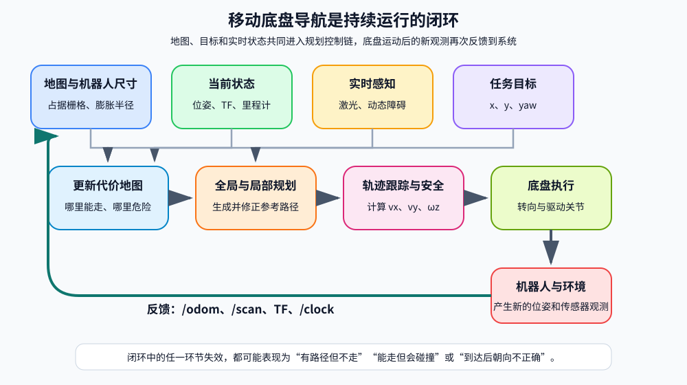
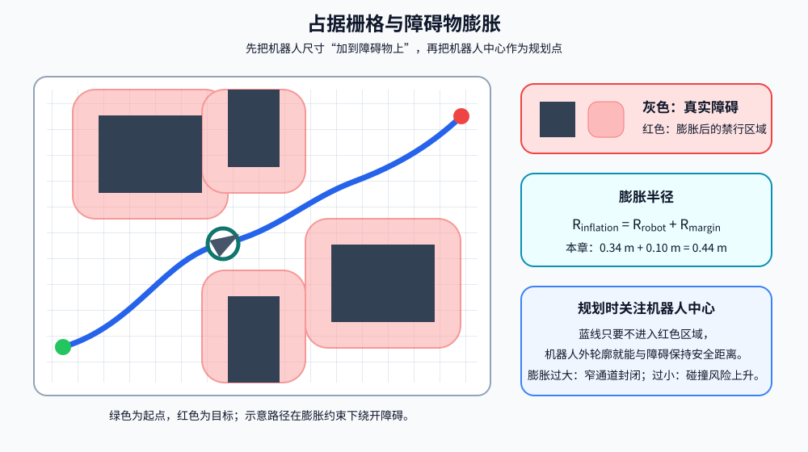
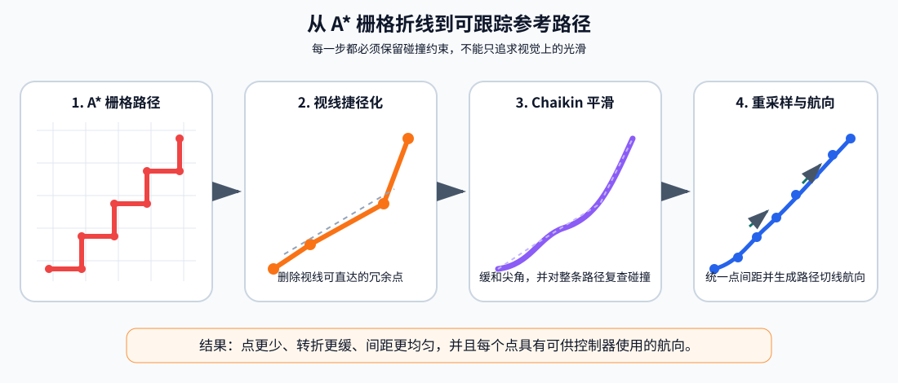
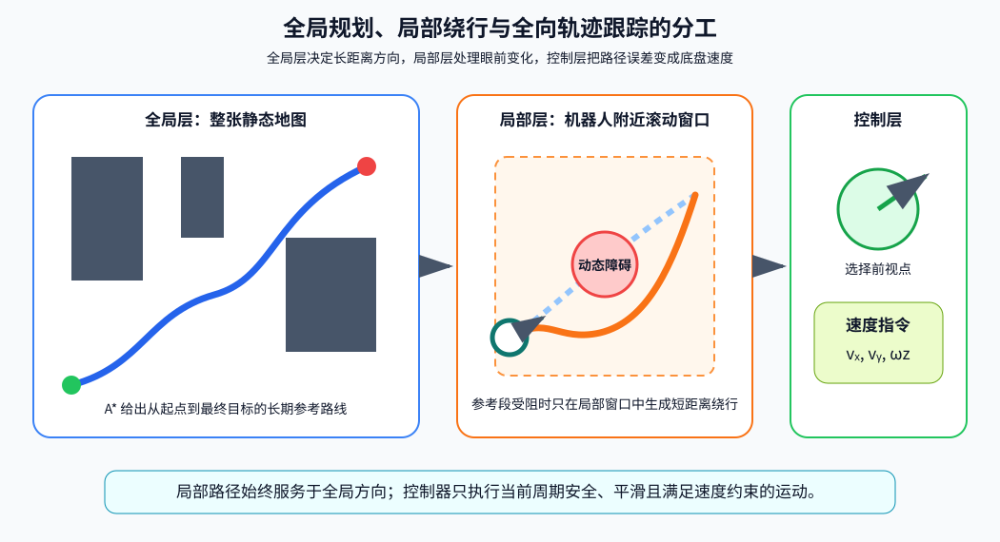
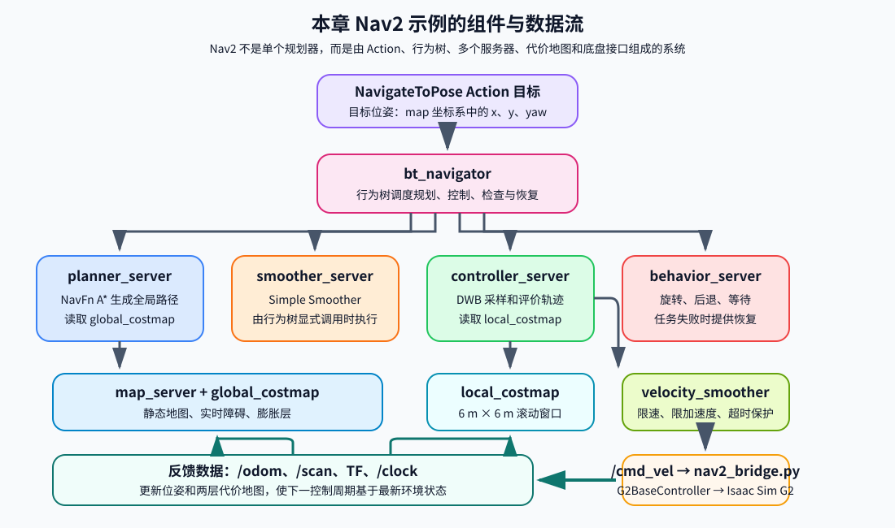

# 第十章 移动底盘规划基础与Nav2框架

本章围绕移动底盘规划基础与 Nav2 框架展开，从位姿与坐标系、占据栅格和代价地图开始，依次讲解全局路径规划、路径与轨迹优化、局部路径规划、轨迹跟踪、安全监控和恢复机制，最后把这些基础模块映射到 ROS 2 Nav2 的标准工程框架中。

本章包含两套相互衔接的代码：

- `code/code_chapter10_1`：不调用 Nav2，从零实现一条便于学习的完整导航链路；
- `code/code_chapter10_2`：不再重复实现规划算法，而是使用标准 Nav2 节点完成地图管理、全局规划、局部控制、恢复和任务调度，并配置可由行为树调用的路径平滑服务器。

本章代码继续复用第四章的 G2 四轮独立转向底盘控制器，机器人模型为 `assets/robot/G2_omnipicker/robot.usda`，仿真环境为 `assets/background/room/room_1/background.usda`。

为了让初学者先建立完整概念，再阅读实现，全文只分为六个部分。前四部分集中讲解移动底盘规划原理和 Nav2 框架，不穿插源代码；第五部分统一介绍代码组织与关键实现；第六部分给出构建、运行、观察、调参和故障排查方法。

需要提前说明的是，`code_chapter10_1` 的实际处理顺序不是简单的“全局规划、局部规划、优化、跟踪”，而是：

```text
静态地图与机器人尺寸
        ↓
障碍物膨胀
        ↓
A* 全局路径规划
        ↓
全局路径捷径化、平滑与重采样
        ↓
动态障碍融合与局部路径规划
        ↓
局部绕行路径再次优化
        ↓
全向底盘轨迹跟踪
        ↓
碰撞监控、进度检查和恢复重规划
        ↓
第四章 G2BaseController
        ↓
Isaac Sim 中的四轮转向与驱动关节
```

也就是说，轨迹优化既作用于全局路径，也会作用于局部 A* 生成的绕行路径。这样既符合代码实现，也能完整体现“规划—优化—控制”的层次关系。

---

## 第一部分 移动底盘规划基础与完整数据链

### 1.1 移动底盘导航不是一条路径，而是一个闭环系统

很多初学者会把移动底盘导航理解为“从起点画一条线到终点”。路径规划确实重要，但仅有一条路径并不能让机器人可靠到达目标。

一个完整的移动机器人导航系统至少要持续回答下面几个问题：

1. **机器人在哪里？**
   
   系统需要获得机器人当前位姿，包括位置和朝向。

2. **环境中哪里可以通过？**
   
   系统需要地图、障碍物信息和机器人自身尺寸，不能把机器人当成没有体积的点。

3. **从当前位置到目标的大方向怎么走？**
   
   全局规划器需要在较大范围内找到一条连通、代价较低的路线。

4. **眼前突然出现障碍物时怎么办？**
   
   局部规划器需要结合实时传感器数据，对短距离路径或速度进行调整。

5. **怎样把路径变成底盘速度？**
   
   跟踪控制器要根据机器人当前误差输出 $(v_x,v_y,\omega_z)$，再交给底盘控制器执行。

6. **机器人被卡住或路径失效时怎么办？**
   
   导航器需要停止、重新规划、执行恢复行为，必要时报告失败。

因此，移动底盘导航是一个不断重复的闭环：

```text
读取位姿与传感器
        ↓
更新地图和障碍物
        ↓
计算或更新路径
        ↓
计算速度指令
        ↓
底盘执行运动
        ↓
再次读取新的位姿与传感器
```

本章的两套代码都遵循这一基本闭环。区别在于，`code_chapter10_1` 把关键算法直接写在 Python 模块中，便于观察每一步；`code_chapter10_2` 则把相同职责交给 Nav2 的标准服务器和插件。



*图示说明：地图、位姿、实时感知和任务目标共同进入规划控制链。底盘执行后产生的新里程计、激光和 TF 又反馈给系统，因此导航不是一次性的路径计算，而是持续更新的闭环。*

### 1.2 位姿、目标、路径和轨迹

平面导航中的机器人位姿写成：

$$
\mathbf{p}=[x,\ y,\ \psi]^{T}
$$

其中：

- $x$、$y$ 是机器人在平面中的位置，单位为米；
- $\psi$ 是航向角 `yaw`，单位为弧度；
- 本章统一采用右手坐标系，逆时针旋转为正方向。

导航目标同样是一个二维位姿：

$$
\mathbf{p}_{g}=[x_g,\ y_g,\ \psi_g]^{T}
$$

这意味着“到达目标”通常包含两层要求：

- 机器人位置接近 $(x_g,y_g)$；
- 机器人最终朝向接近 $\psi_g$。

路径和轨迹容易混淆，可以先用一个直观区分：

- **路径**主要回答“经过哪些位置”；
- **轨迹**还关心“以什么方向、速度和时间规律经过这些位置”。

本章教学代码中的 `Pose2D` 路径点包含 $(x,y,yaw)$，路径优化器会为各点补充航向，但没有为每个点预先规定绝对到达时间。因此它更接近一条带航向的几何参考轨迹。真正的速度随时间变化由轨迹跟踪器在线计算。

导航链路中各层的输入输出可以概括为：

| 层级 | 主要输入 | 主要输出 | 作用范围 |
|---|---|---|---|
| 地图与代价地图 | 静态障碍、传感器、机器人尺寸 | 可通行区域和碰撞代价 | 全局或局部 |
| 全局规划 | 当前位姿、目标位姿、全局代价地图 | 从起点到终点的全局路径 | 整张地图 |
| 路径优化 | 栅格折线路径、碰撞约束 | 更短、更平滑、间距更均匀的路径 | 整条路径或局部绕行段 |
| 局部规划 | 当前位姿、全局参考线、动态障碍 | 当前附近的一小段安全路径 | 滚动窗口 |
| 轨迹跟踪 | 当前位姿、局部路径、最终目标 | $(v_x,v_y,\omega_z)$ | 当前控制周期 |
| 底盘控制 | 底盘速度指令 | 各转向关节与驱动关节目标 | 机器人关节 |

### 1.3 坐标系与 TF 树

导航系统中的位姿、地图、激光和速度不能随意混用，必须明确它们所在的坐标系。

本章两套示例使用相同的 TF 主链：

```text
map -> odom -> base_link -> base_scan
```

各坐标系含义如下：

| 坐标系 | 含义 | 是否随机器人运动 |
|---|---|---|
| `map` | 全局地图坐标系，目标点和全局路径所在坐标系 | 否 |
| `odom` | 里程计坐标系，用于表达连续的短期运动 | 否 |
| `base_link` | 机器人底盘坐标系 | 是 |
| `base_scan` | 激光雷达坐标系 | 是 |

在真实机器人中，轮式里程计会累积漂移，因此 `map -> odom` 通常由 SLAM 或 AMCL 定位系统动态估计；`odom -> base_link` 由轮式里程计、视觉里程计或状态估计器发布。

本章为了把重点放在规划与控制上，直接使用 Isaac Sim 仿真真值作为里程计，并发布恒等的 `map -> odom`。因此在当前示例中，`map` 和 `odom` 的原点与方向重合。这是一种教学简化，不能直接等同于真实机器人定位方案。

`base_link -> base_scan` 是固定外参，表示雷达相对底盘的安装位置。代码中雷达位于底盘上方约 `0.30 m`。

速度指令 $(v_x,v_y,\omega_z)$ 使用机器人自身的 `base_link` 坐标系：

- $v_x>0$：沿机器人前方移动；
- $v_y>0$：沿机器人左侧横移；
- $\omega_z>0$：逆时针旋转。

这与第四章 G2 全向底盘控制接口一致。

### 1.4 占据栅格、地图分辨率与障碍物膨胀

本章使用二维占据栅格表达环境。每个栅格保存一个离散状态：

- `0`：空闲；
- `100`：占用；
- `-1`：未知。

地图分辨率为 `0.05 m`，表示每个栅格边长为 `5 cm`。地图范围为：

```text
x: [-4.75, 4.75]
y: [-4.75, 4.75]
```

因此地图宽、高都约为：

$$
N=\frac{4.75-(-4.75)}{0.05}=190
$$

即一张约 `190 × 190` 的栅格地图。

世界坐标 $(x,y)$ 转为栅格行列时，使用：

$$
\mathrm{column}=\left\lfloor\frac{x-x_0}{r}\right\rfloor
$$

$$
\mathrm{row}=\left\lfloor\frac{y-y_0}{r}\right\rfloor
$$

其中 $(x_0,y_0)$ 是地图原点，$r$ 是分辨率。

规划时不能只判断机器人中心是否碰到障碍。G2 底盘具有实际宽度，如果把它当成一个没有体积的点，路径可能从距离墙面只有几厘米的位置经过，机器人真实外轮廓仍会碰撞。

常见处理方法是把障碍物向外膨胀，再把机器人中心当作规划点。教学代码使用圆形近似：

$$
R_{\mathrm{inflation}}=R_{\mathrm{robot}}+R_{\mathrm{margin}}
$$

当前参数为：

$$
R_{\mathrm{inflation}}=0.34+0.10=0.44\ \mathrm{m}
$$

其中：

- `robot_radius = 0.34 m`：机器人外接圆半径；
- `safety_margin = 0.10 m`：额外安全距离；
- `inflation_radius = 0.44 m`：规划使用的总膨胀半径。

膨胀半径越大，路径离障碍越远，但狭窄通道可能被完全封闭；膨胀半径越小，可通行区域增多，但碰撞风险上升。因此机器人尺寸必须来自真实模型或可靠测量，不能只凭视觉随意设置。

教学代码还区分了两张地图：

- **规划地图**按 `0.44 m` 膨胀，用于生成具有安全余量的路径；
- **短时碰撞检查地图**按 `0.34 m` 膨胀，用于判断机器人外轮廓是否即将碰到静态障碍。

这种设计让规划器主动远离墙面，同时避免最后一道急停保护过于敏感。



*图示说明：灰色区域表示真实障碍，红色区域表示按机器人半径和安全余量膨胀后的禁行区域。规划器只需约束机器人中心不进入红色区域，就能为真实底盘外轮廓保留安全距离。*

---

## 第二部分 全局路径规划与轨迹优化

### 2.1 全局规划解决什么问题

全局规划器面向整张地图工作。它接收机器人当前位姿和最终目标，在静态地图或全局代价地图上寻找一条连通路径。

全局规划负责决定“从障碍物左边走还是右边走”“通过哪一条走廊到达目标”等大尺度问题，但通常不负责直接输出车轮控制量，也不会在每个物理仿真步都重新搜索整张地图。

本章教学代码使用 A* 算法。A* 可以理解为同时考虑两类代价：

- 已经走过的累计代价 $g(n)$；
- 从当前节点到目标的估计代价 $h(n)$。

节点优先级为：

$$
f(n)=g(n)+w_h h(n)
$$

其中 $w_h$ 是启发函数权重，本章默认 `heuristic_weight = 1.0`。

当 $w_h=1$ 且启发函数不高估真实代价时，A* 能在离散图上找到最优路径。增大权重通常会让搜索更偏向目标、扩展节点更少，但可能牺牲最优性。

### 2.2 八邻域 A* 与防止斜向穿墙

栅格地图上最简单的移动方式是四邻域：

- 上；
- 下；
- 左；
- 右。

四邻域每一步代价为 `1`。为了让路径能够斜向移动，本章默认启用八邻域，再加入四个对角方向，对角移动代价为 $\sqrt{2}$。

八邻域适合使用 Octile Distance 作为启发函数：

$$
h(n)=\max(\Delta x,\Delta y)+(\sqrt{2}-1)\min(\Delta x,\Delta y)
$$

它可以看成：先尽量沿对角线同时缩小横纵距离，剩余部分再沿直线移动。

但八邻域存在一个常见错误：机器人可能从两个相邻障碍栅格的角点之间斜穿过去。数学上两个栅格中心之间有一条对角线，真实机器人却没有足够空间通过。

因此教学代码规定：当候选移动同时改变行和列时，对角线两侧的两个正交栅格也必须为空闲。只有三个相关位置都可通行，才允许对角移动。这一步通常称为防止 `corner cutting`。

A* 搜索中还维护三类关键数据：

| 数据 | 作用 |
|---|---|
| 开放列表 | 保存已经发现、但尚未正式扩展的候选节点 |
| 关闭集合 | 保存已经扩展过的节点，避免重复处理 |
| 父节点表 | 记录每个节点从哪里到达，用于终点回溯 |

当目标节点从开放列表中取出后，算法沿父节点不断回溯到起点，再把顺序反转，得到起点到终点的栅格路径。

如果用户给出的起点或终点恰好落在占用栅格中，教学代码会在周围搜索最近的自由栅格，最大搜索半径为 `20` 个栅格。以 `0.05 m` 分辨率计算，对应最大约 `1.0 m` 的搜索范围。如果附近仍没有自由位置，则规划失败并给出明确错误。

### 2.3 为什么 A* 路径不能直接跟踪

A* 输出的是离散栅格中心序列。即使允许八邻域，它仍可能出现以下问题：

- 路径点数量很多；
- 相邻线段方向频繁变化；
- 拐角不连续；
- 路径点间距由地图分辨率决定；
- 控制器容易在折点附近左右摆动；
- 路径航向没有按照运动方向统一生成。

因此，规划结束并不代表可以立刻把路径交给底盘。还需要在保持无碰撞的前提下，把“栅格折线”转换为更适合跟踪的参考路径。

本章的轨迹优化包含四个步骤：

```text
A* 栅格路径
    ↓
视线捷径化
    ↓
Chaikin 平滑
    ↓
等距重采样
    ↓
航向生成
```



*图示说明：A* 的密集折线先删除可直达的冗余点，再缓和尖角，最后按统一间距采样并补充切线航向。每一步都要重新进行碰撞检查，不能为了平滑而进入障碍区域。*

### 2.4 视线捷径化、平滑、重采样与航向生成

**第一步：视线捷径化。**

从当前锚点开始，算法尽量寻找路径后方最远、且与锚点之间直线无碰撞的点。如果可以直接连接，就跳过中间多余栅格点。

例如，原路径可能沿连续对角栅格包含几十个点，但如果起点到某个远处节点之间整段都处于自由空间，就可以用一条直线代替中间节点。教学代码默认执行 `2` 轮捷径化。

直线是否安全不是只检查两个端点，而是沿线段按小于栅格分辨率的间隔采样。只要任一采样点落入占用区域，该捷径就被拒绝。

**第二步：Chaikin 平滑。**

对相邻两个路径点 $P_i$ 和 $P_{i+1}$，构造两个新点：

$$
Q_i=0.75P_i+0.25P_{i+1}
$$

$$
R_i=0.25P_i+0.75P_{i+1}
$$

重复处理后，尖锐折角会变成更平滑的折线。本章默认迭代 `2` 次。

平滑会改变路径位置，因此不能只追求曲线好看。教学代码先检查新点是否处于自由空间，生成整条平滑路径后还会再次检查所有线段是否无碰撞。只有整条平滑路径安全时才接受，否则继续使用捷径化后的结果。

**第三步：等距重采样。**

控制器希望路径点分布相对均匀。如果有些点相距几厘米，有些点相距一米，前视点选择和速度控制都会不稳定。

教学代码按 `path_spacing = 0.12 m` 重新采样，使相邻参考点间距接近 `12 cm`。这样路径密度不再直接受地图 `5 cm` 分辨率限制。

**第四步：航向生成。**

除最后一个点外，每个路径点的航向由它指向下一个点的切线方向确定：

$$
\psi_i=\mathrm{atan2}(y_{i+1}-y_i,\ x_{i+1}-x_i)
$$

最后一个点使用用户目标中指定的最终朝向 $\psi_g$。于是机器人在途中可以沿路径切线平稳运动，到达目标位置附近后再精确调整最终朝向。

路径优化不能突破碰撞约束。它的目标不是把路径变成任意光滑曲线，而是在安全区域内减少冗余点、缓和折角、统一点间距并补充航向。

## 第三部分 局部路径规划、轨迹跟踪与安全闭环

### 3.1 全局路径与局部路径的分工

全局路径提供从起点到终点的大方向，但它主要依据静态地图。机器人实际运动时可能遇到地图中没有的新障碍，例如移动的人、临时摆放的箱子或正在穿过通道的其他机器人。

如果每次发现动态障碍都在整张地图上重新做全局搜索，计算量会增大，路径也可能频繁发生大幅变化。因此导航系统通常采用全局与局部两层规划：

- 全局规划器在整张地图上生成长期参考路线；
- 局部规划器只关注机器人附近的滚动窗口；
- 局部规划器尽量沿全局路线前进，必要时产生短距离绕行；
- 绕过障碍后再逐渐回到全局参考线。

本章教学局部规划器的处理步骤为：

```text
当前位姿
    ↓
寻找全局路径最近点
    ↓
沿全局路径向前选择局部目标
    ↓
复制静态规划地图并写入动态障碍
    ↓
检查原全局参考段是否安全
    ├─ 安全：直接复用参考段
    └─ 被阻塞：在局部窗口内运行 A*
                    ↓
              优化局部绕行路径
```

当前参数中：

- 局部目标前视距离为 `2.4 m`；
- 局部窗口半径为 `3.0 m`；
- 局部重规划周期为 `0.40 s`；
- 动态障碍物写入局部地图时使用 `0.44 m` 的额外膨胀；
- 已有绕行路径仍然安全时优先复用。

局部目标并不是最终导航目标。它是沿全局路径向前截取的一个短期目标，使局部搜索始终服务于全局方向，而不是在机器人附近任意游走。



*图示说明：全局规划器在整张地图上确定长期方向；局部规划器只在机器人附近处理动态障碍；轨迹跟踪器选择前视点并输出全向底盘速度 $(v_x,v_y,\omega_z)$。三层职责不同，但共同服务于同一个最终目标。*

### 3.2 动态障碍融合与稳定绕行

教学场景包含一个周期移动的圆形障碍物。它在固定的 $x$ 位置上沿 $y$ 方向做正弦运动：

$$
y(t)=y_c+A\sin\left(\frac{2\pi t}{T}\right)
$$

当前参数为：

- 固定位置 `x = 1.20 m`；
- 中心位置 `center_y = 1.05 m`；
- 运动幅值 `travel = 1.15 m`；
- 周期 `period = 8.0 s`；
- 障碍物半径 `radius = 0.34 m`。

局部地图把动态障碍圆写入静态规划地图的副本，而不会永久修改全局静态地图。这样每个局部规划周期都能根据障碍物的新位置重新构建短时环境。

如果障碍物挡住全局参考段，局部规划器会限制 A* 搜索范围，只在以机器人为中心、半径约 `3 m` 的窗口内寻找通向局部目标的绕行路径。搜索成功后，绕行路径同样经过捷径化、平滑、重采样和航向生成。

动态避障中一个常见问题是“左右振荡”：

1. 第一次规划从障碍物左侧绕行；
2. 障碍物稍微移动后，右侧路径代价略低；
3. 下一周期又切到右侧；
4. 再下一周期重新切回左侧；
5. 机器人在两种决策之间摆动，无法稳定通过。

本章采用了简单但直观的路径保持策略：

- 如果上一条绕行路径剩余部分仍然安全，就继续使用；
- 即使全局参考线已经恢复畅通，也连续确认若干周期；
- 默认确认 `3` 个局部规划周期后，才切回全局路径；
- 已走过的旧路径点会被裁掉，只保留机器人前方的剩余部分；
- 当剩余路径长度过短时，不再继续复用。

这种方法相当于给路径切换加入“滞回”，避免系统对很小的环境变化过度敏感。

### 3.3 全向底盘前视轨迹跟踪

局部规划器输出一段安全参考路径，但机器人仍然需要把路径误差转换为速度指令。

本章使用“前视点 + 比例反馈”的全向轨迹跟踪方法。它不是只追逐离机器人最近的路径点，而是在路径前方选择一个距离约为 `0.70 m` 的目标点。

选择前视点有两个作用：

- 避免机器人在密集路径点之间频繁调整；
- 让控制器提前看向弯道前方，运动更平滑。

前视点不能越过障碍物。如果机器人当前位置到某个候选前视点之间的直线被障碍阻挡，控制器会停止继续向前寻找，避免为了追逐远处路径点而“切弯”穿过障碍。

路径点和机器人位姿位于世界坐标系，而第四章底盘控制器接收 `base_link` 坐标系中的速度。因此先计算世界坐标误差：

$$
\Delta x_w=x_t-x
$$

$$
\Delta y_w=y_t-y
$$

再根据当前航向 $\psi$ 转换到底盘坐标系：

$$
\Delta x_b=\cos\psi\,\Delta x_w+\sin\psi\,\Delta y_w
$$

$$
\Delta y_b=-\sin\psi\,\Delta x_w+\cos\psi\,\Delta y_w
$$

全向底盘可以同时前后和横向移动，因此直接采用比例控制：

$$
v_x=k_p\Delta x_b
$$

$$
v_y=k_p\Delta y_b
$$

当前 `position_gain = 1.0`。随后按照二维合速度进行统一缩放：

$$
v=\sqrt{v_x^2+v_y^2}
$$

最大线速度为 `0.48 m/s`。处于局部绕行状态时，再把线速度限制为 `0.34 m/s`，减少绕障过程中的冲击和超调。

机器人接近目标时会逐渐减速。当前减速距离为 `0.90 m`。在目标位置容差外，速度上限随剩余距离减小，但保留一定的最低比例，避免过早变得极慢。

角速度采用航向误差比例控制：

$$
e_{\psi}=\mathrm{wrap}(\psi_d-\psi)
$$

$$
\omega_z=\mathrm{clip}(k_{\psi}e_{\psi},-\omega_{\max},\omega_{\max})
$$

当前参数为：

- `yaw_gain = 1.5`；
- `max_angular_speed = 0.80 rad/s`。

行进过程中，期望航向取前视路径点的切线航向；进入目标位置容差后，线速度变为零，再对齐最终目标朝向。

目标判定使用：

- 位置容差 `0.12 m`；
- 航向容差 `0.12 rad`，约为 `6.9°`。

只有位置误差和航向误差同时满足要求，状态才会变为 `SUCCEEDED`。

### 3.4 状态机、碰撞监控与恢复机制

规划器和控制器需要由更高一层的导航状态机组织。本章教学导航器包含六种状态：

| 状态 | 含义 |
|---|---|
| `IDLE` | 等待目标，没有输出运动指令 |
| `PLANNING` | 正在进行全局规划与路径优化 |
| `CONTROLLING` | 正在局部规划并跟踪路径 |
| `RECOVERY` | 当前导航异常，准备清除局部历史并重规划 |
| `SUCCEEDED` | 位置和朝向都已到达目标容差 |
| `FAILED` | 无法规划或超过最大恢复次数 |

收到新目标后，导航器会清空旧的全局路径、局部路径和绕行历史，再进入 `PLANNING`。全局规划成功后进入 `CONTROLLING`。

控制期间，系统按照 `0.40 s` 的周期更新局部路径，但速度跟踪以 `20 Hz` 运行。这样可以避免在每个物理步都做局部 A*，同时保持速度控制足够连续。

除规划器外，系统还设置了两类安全检查。

**短时域碰撞监控。**

碰撞监控器根据当前速度指令向前模拟一小段时间，预测机器人中心是否会进入按机器人半径膨胀后的静态障碍区域。

当前参数为：

- 预测时域 `collision_horizon = 0.12 s`；
- 积分步长 `collision_step = 0.05 s`。

若预测碰撞，速度立即变为零，并请求恢复。这里的最后一道监控主要针对静态地图；动态障碍的主要处理仍由局部地图和局部规划器完成。

**进度检查。**

机器人可能持续收到非零速度，但由于碰撞、控制异常或物理约束而没有实际前进。进度检查器会记录一个锚点：

- 如果机器人移动距离达到 `0.12 m`，更新锚点和时间；
- 如果连续 `7.0 s` 没有达到最小进度，认为机器人可能被卡住。

进入恢复状态后，教学代码会：

1. 输出零速度；
2. 清除局部规划器保存的旧绕行路径；
3. 重置局部规划计时；
4. 回到全局规划状态；
5. 从当前位置重新生成全局路径。

允许的恢复次数为 `3`。如果问题持续存在，下一次恢复请求会让导航状态进入 `FAILED`，避免机器人无限循环。

此外，主程序还监控机器人倾斜角。倾斜超过 `0.35 rad`，约 `20°` 时立即停止并抛出异常。这项检查不属于路径规划算法，但属于真实机器人系统中不可缺少的执行安全边界。

---

## 第四部分 Nav2 整体框架、参数与数据流

### 4.1 从教学模块映射到 Nav2 标准组件

`code_chapter10_1` 的目标是让读者看清每一步做了什么；`code_chapter10_2` 的目标是展示工程中如何使用 Nav2 组织同类功能。

两者的职责对应关系如下：

| 教学版模块 | Nav2 组件 | 主要职责 |
|---|---|---|
| `OccupancyGrid2D` 与地图发布 | `map_server`、Costmap 2D | 发布静态地图并构建全局、局部代价地图 |
| `AStarPlanner` | `planner_server` + NavFn | 生成全局路径 |
| `TrajectoryOptimizer` | `smoother_server` + Simple Smoother | 提供全局路径平滑能力；是否执行取决于行为树是否调用 `SmoothPath` |
| `LocalPlanner` | `controller_server` 中的 DWB | 根据局部代价地图采样并评价短时轨迹 |
| `HolonomicPathTracker` | DWB 控制器 | 选择可行速度并跟踪全局路径 |
| `CollisionMonitor`、`ProgressChecker` | Costmap、DWB、Progress Checker | 碰撞约束和卡住检测 |
| `TeachingNavigator` 状态机 | `bt_navigator` 行为树 | 调度规划、控制、恢复和任务结果 |
| 教学恢复重规划 | `behavior_server` | 旋转、后退、等待等恢复动作 |
| 底盘限速 | `velocity_smoother` + 第四章底盘控制器 | 平滑速度、限制加速度并驱动关节 |

Nav2 不是一个单独进程，而是一组通过 ROS 2 话题、服务、Action 和 TF 协作的服务器。导航目标通过 `NavigateToPose` Action 发送给 `bt_navigator`，行为树再按任务状态调用规划器、控制器和恢复行为。

本章 Nav2 示例的数据流为：

```text
目标位姿 /navigate_to_pose
        ↓
bt_navigator 行为树
        ↓
planner_server 生成 /plan
        ↓
可选：行为树调用 smoother_server 平滑路径
        ↓
controller_server + local_costmap
        ↓
DWB 采样、前向模拟和评分
        ↓
velocity_smoother
        ↓
/cmd_vel
        ↓
nav2_bridge.py
        ↓
第四章 G2BaseController
        ↓
Isaac Sim G2 底盘
        ↓
/odom、/scan、TF、/clock
        └──────────────反馈到 Nav2
```



*图示说明：`NavigateToPose` 目标先进入 `bt_navigator`，行为树再调度规划、平滑、控制和恢复服务器。两层代价地图提供环境约束，速度经 `velocity_smoother` 和 bridge 传给 G2 底盘，新的 `/odom`、`/scan`、TF 与 `/clock` 持续反馈到 Nav2。*

### 4.2 地图服务器、两层代价地图与定位简化

`map_server` 读取 `chapter10_2_map.yaml`，再加载对应的 PGM 图像。地图参数为：

| 参数 | 当前值 | 含义 |
|---|---:|---|
| `resolution` | `0.05` | 每个像素代表 `5 cm` |
| `origin` | `[-4.75, -4.75, 0.0]` | 地图左下角在 `map` 坐标系中的位置 |
| `mode` | `trinary` | 将像素解释为空闲、占用或未知三类 |
| `occupied_thresh` | `0.65` | 高于阈值判为占用 |
| `free_thresh` | `0.25` | 低于阈值判为空闲 |

Nav2 同时维护全局代价地图和局部代价地图。

**全局代价地图**使用 `map` 坐标系，包含：

- `static_layer`：静态地图障碍；
- `obstacle_layer`：由 `/scan` 标记和清除的实时障碍；
- `inflation_layer`：障碍膨胀代价。

它的更新和发布频率都是 `2 Hz`，主要服务于全局规划。

**局部代价地图**使用 `odom` 坐标系，是一个跟随机器人移动的滚动窗口：

- 宽 `6 m`；
- 高 `6 m`；
- 分辨率 `0.05 m`；
- 更新频率 `10 Hz`；
- 发布频率 `5 Hz`。

它只包含实时障碍层和膨胀层，主要服务于 DWB 局部控制。

两张代价地图都使用：

- `robot_radius = 0.34 m`；
- `inflation_radius = 0.44 m`；
- `cost_scaling_factor = 4.0`。

`inflation_radius` 决定障碍影响范围，`cost_scaling_factor` 决定代价随距离衰减的速度。衰减越快，机器人越可能靠近障碍；衰减越慢，较远位置也会具有较高代价，路径更保守。

激光观测源配置为 `/scan`，消息类型为 `LaserScan`，同时启用：

- `marking: true`：检测到障碍时写入代价地图；
- `clearing: true`：射线穿过的自由空间用于清除旧障碍。

障碍有效范围到 `7.5 m`，射线清除范围到 `8.0 m`，与 bridge 发布的模拟激光量程一致。

当前示例没有启动 AMCL。`nav2_bridge.py` 直接发布恒等 `map -> odom` 和仿真真值 `odom -> base_link`。因此读者不需要先解决定位问题就能学习 Nav2，但将代码迁移到真实机器人时必须替换这一部分。

### 4.3 全局规划、路径平滑与 DWB 局部控制

全局规划服务器注册名为 `GridBased` 的 NavFn 插件。关键参数为：

| 参数 | 当前值 | 含义 |
|---|---:|---|
| `expected_planner_frequency` | `5.0 Hz` | 期望规划器工作频率 |
| `use_astar` | `true` | 使用 A*，而不是默认 Dijkstra 方式 |
| `tolerance` | `0.15 m` | 目标附近允许寻找可达替代点的容差 |
| `allow_unknown` | `false` | 不允许规划进入未知区域 |

参数文件配置并启动了 `nav2_smoother::SimpleSmoother` 平滑服务器：

| 参数 | 当前值 | 含义 |
|---|---:|---|
| `tolerance` | `1.0e-10` | 优化停止容差 |
| `max_its` | `1000` | 最大迭代次数 |
| `do_refinement` | `true` | 对结果继续细化 |

Nav2 中的局部规划与轨迹跟踪由 DWB 控制器统一完成。DWB 的基本思想不是先输出一条固定局部路径，再单独用另一个跟踪器追踪，而是在速度空间中采样候选速度：

$$
(v_x,v_y,\omega_z)
$$

然后对每个候选速度进行短时间前向模拟，得到一条候选轨迹，再使用多个评价器进行评分。得分较低且无碰撞的轨迹对应下一周期速度指令。

本章为 G2 全向底盘同时开放 $v_x$ 和 $v_y$：

| 参数 | 当前值 |
|---|---:|
| `min_vel_x / max_vel_x` | `-0.55 / 0.55 m/s` |
| `min_vel_y / max_vel_y` | `-0.55 / 0.55 m/s` |
| `max_vel_theta` | `1.0 rad/s` |
| `max_speed_xy` | `0.55 m/s` |
| `vx_samples` | `12` |
| `vy_samples` | `12` |
| `vtheta_samples` | `16` |
| `sim_time` | `1.5 s` |

如果不考虑约束过滤，三个维度可形成最多 `12 × 12 × 16 = 2304` 组离散速度组合。DWB 会对候选轨迹进行碰撞检查和代价评价，而不是把这些速度全部发送给机器人。

当前使用的评价器包括：

| Critic | 作用 |
|---|---|
| `BaseObstacle` | 惩罚靠近或碰到障碍的轨迹 |
| `PathAlign` | 让机器人运动方向与全局路径方向一致 |
| `GoalAlign` | 让机器人朝向有利于接近目标 |
| `PathDist` | 惩罚偏离全局路径 |
| `GoalDist` | 惩罚距离目标过远 |
| `RotateToGoal` | 接近目标时完成最终朝向调整 |
| `Oscillation` | 抑制前后、左右或旋转方向反复切换 |

这些评价器共同决定“安全、贴近路径、朝向合理、能够接近目标”的综合效果。调参时不能只看某一个权重；某个权重过大可能压制其他目标，导致机器人虽然贴近路径，却无法有效绕障或调整朝向。

### 4.4 控制频率、容差、恢复行为与速度平滑

控制服务器以 `20 Hz` 运行。进度检查与目标检查参数为：

| 参数 | 当前值 | 含义 |
|---|---:|---|
| `required_movement_radius` | `0.12 m` | 判定有效进度所需移动距离 |
| `movement_time_allowance` | `8.0 s` | 允许无明显进度的最长时间 |
| `xy_goal_tolerance` | `0.12 m` | 目标位置容差 |
| `yaw_goal_tolerance` | `0.12 rad` | 目标航向容差 |
| `stateful` | `true` | 到达位置后保持目标检查状态，继续完成朝向 |

DWB 内部速度约束为：

| 参数 | 线速度 $x/y$ | 角速度 |
|---|---:|---:|
| 最大速度 | `0.55 m/s` | `1.0 rad/s` |
| 最大加速度 | `0.8 m/s²` | `1.8 rad/s²` |
| 最大减速度绝对值 | `0.8 m/s²` | `1.8 rad/s²` |

`behavior_server` 提供：

- `spin`：原地旋转；
- `backup`：后退；
- `drive_on_heading`：沿指定方向移动；
- `wait`：等待环境变化。

这些行为由 `bt_navigator` 的行为树按任务状态调度。本章面向 ROS 2 Humble，参数文件没有指定自定义行为树 XML，因此使用 Humble 默认 NavigateToPose 行为树。需要特别区分“平滑服务器已经配置并激活”和“每次导航一定执行平滑”：默认流程主要调用 `ComputePathToPose` 与 `FollowPath`，不会仅因为 `smoother_server` 已启动就自动执行 `SmoothPath`。如果课程要求保证每次全局路径都经过 Simple Smoother，应提供包含 `SmoothPath` 节点的自定义 BT XML，并通过 `default_nav_to_pose_bt_xml` 参数显式指定。

最后，`velocity_smoother` 以 `20 Hz` 对速度进行平滑，并限制速度、加速度、减速度。其关键参数为：

| 参数 | 当前值 |
|---|---|
| `max_velocity` | `[0.55, 0.55, 1.0]` |
| `min_velocity` | `[-0.55, -0.55, -1.0]` |
| `max_accel` | `[0.8, 0.8, 1.8]` |
| `max_decel` | `[-0.8, -0.8, -1.8]` |
| `feedback` | `OPEN_LOOP` |
| `velocity_timeout` | `0.5 s` |

Nav2 的最终速度通过 `/cmd_vel` 发送给 `nav2_bridge.py`。bridge 自身也设置 `0.5 s` 指令超时：如果长时间没有收到新速度，就向第四章底盘控制器发送零速度。

这种双层约束体现了工程控制中的重要原则：规划器给出的速度仍然要经过平滑和超时保护，底盘执行端也不应无限保持最后一条旧指令。

---

## 第五部分 代码实现

前四部分讲清楚了导航原理和 Nav2 组件。本部分只阅读代码，并把两套工程**完全分开**：

| 代码目录 | 谁完成规划与控制 | 目标怎样进入系统 | 最终速度怎样进入底盘 |
|---|---|---|---|
| `code/code_chapter10_1` | 本章自己实现的 A*、轨迹优化、局部规划、跟踪器和状态机 | `demo_navigation.py` 默认目标或 `/goal_pose` | 主循环直接调用第四章 `G2BaseController` |
| `code/code_chapter10_2` | 标准 Nav2 节点和插件 | `/navigate_to_pose` Action 或 RViz 的 Nav2 Goal | Nav2 发布 `/cmd_vel`，`nav2_bridge.py` 转交给 `G2BaseController` |

这两套代码不是上下游关系。`code_chapter10_2` **不会调用** `code_chapter10_1` 中的 `AStarPlanner`、`TrajectoryOptimizer`、`LocalPlanner`、`HolonomicPathTracker` 或 `TeachingNavigator`。前者用于拆开算法观察内部过程，后者用于学习真实 ROS 2/Nav2 工程怎样通过节点、Action、话题、TF 和参数插件完成同类功能。

### 5.1 `code_chapter10_1`：自研教学导航的文件边界与调用顺序

教学导航代码位于：

```text
code/code_chapter10_1/
├── config.py                 # 教学版统一参数
├── geometry.py               # 二维位姿、速度和坐标变换
├── costmap.py                # 占据栅格、膨胀和碰撞查询
├── build_map.py              # 构造静态地图
├── global_planner.py         # 八邻域 A*
├── trajectory.py             # 捷径化、平滑、重采样和航向生成
├── local_planner.py          # 局部目标、动态障碍和局部 A*
├── path_tracker.py           # 全向底盘前视轨迹跟踪
├── navigator.py              # 状态机、安全检查与恢复
├── simulation.py             # Isaac Sim 场景和动态障碍
├── ros2_interface.py         # 教学路径、状态和传感器可视化
├── demo_navigation.py        # 教学版装配入口与主循环
└── tests/                    # 不依赖 Isaac Sim 的算法测试
```

推荐按“数据结构 → 地图 → 全局规划 → 路径优化 → 局部规划 → 跟踪 → 状态机 → 主循环”的顺序阅读：

```text
geometry.py
    ↓
costmap.py → global_planner.py → trajectory.py
                                      ↓
                              local_planner.py
                                      ↓
                               path_tracker.py
                                      ↓
                                 navigator.py
                                      ↓
                           demo_navigation.py
```

教学版的一次控制周期是：

1. `simulation.py` 读取机器人当前位姿和动态障碍；
2. `TeachingNavigator.update()` 决定是否重新规划全局或局部路径；
3. `HolonomicPathTracker.compute()` 计算底盘坐标系速度 `(vx, vy, wz)`；
4. `CollisionMonitor.safe_command()` 对短时预测轨迹做最后安全检查；
5. `demo_navigation.py` 将速度直接交给 `G2BaseController`；
6. `ros2_interface.py` 只把地图、路径、状态和速度副本发布到 RViz 观察。

因此，下面 5.2～5.4 只讲 `code_chapter10_1`；从 5.5 开始才进入独立的 Nav2 工程。

### 5.2 `code_chapter10_1`：参数、地图与全局规划实现

`code_chapter10_1/config.py` 用数据类集中管理参数。地图膨胀半径由机器人半径和安全距离自动计算：

```python
@dataclass(frozen=True)
class MapConfig:
    resolution: float = 0.05
    min_x: float = -4.75
    min_y: float = -4.75
    max_x: float = 4.75
    max_y: float = 4.75
    robot_radius: float = 0.34
    safety_margin: float = 0.10

    @property
    def inflation_radius(self) -> float:
        return self.robot_radius + self.safety_margin
```

规划、跟踪和安全参数分别保存：

```python
@dataclass(frozen=True)
class PlannerConfig:
    allow_diagonal: bool = True
    heuristic_weight: float = 1.0
    shortcut_passes: int = 2
    path_spacing: float = 0.12
    local_lookahead_distance: float = 2.4
    local_window_radius: float = 3.0
    local_replan_period: float = 0.40
    detour_hold_cycles: int = 3

@dataclass(frozen=True)
class TrackerConfig:
    lookahead_distance: float = 0.70
    position_gain: float = 1.0
    yaw_gain: float = 1.5
    max_linear_speed: float = 0.48
    max_angular_speed: float = 0.80
    detour_speed_limit: float = 0.34
    slow_down_distance: float = 0.90
    position_tolerance: float = 0.12
    yaw_tolerance: float = 0.12

@dataclass(frozen=True)
class SafetyConfig:
    max_tilt_angle: float = 0.35
    collision_horizon: float = 0.12
    collision_step: float = 0.05
    progress_timeout: float = 7.0
    minimum_progress: float = 0.12
    max_recovery_attempts: int = 3
```

需要注意当前代码中的两个参数连接细节：

- `PlannerConfig.shortcut_passes` 已在配置类中定义，但 `demo_navigation.py` 当前没有把它显式传给 `TrajectoryOptimizer.optimize()`；实际运行使用该函数默认值 `2`。如果要通过配置修改轮数，需要在调用 `optimize()` 时继续传递该字段；
- `MapConfig.unknown_is_occupied` 也没有从主程序显式传入查询函数；当前地图查询函数自身默认把未知栅格视为占用，因此默认行为与配置值 `True` 一致。若要允许未知区域，需要同时修改参数传递链，而不是只改配置字段。

`build_map.py` 根据地图边界、墙体和三块矩形障碍生成原始占据栅格。`demo_navigation.py` 再生成两张不同用途的膨胀地图：

```python
raw_map = build_navigation_map(map_config)
planning_map = raw_map.inflated(map_config.inflation_radius)
```

其中 `planning_map` 传给全局规划器、局部规划器和轨迹跟踪器，按 `0.44 m` 膨胀。碰撞监控器则接收只按机器人半径膨胀的地图：

```python
safety_costmap=raw_map.inflated(map_config.robot_radius)
```

A* 规划器先把起点和终点转换为栅格。如果请求位置被占用，则寻找附近自由点：

```python
start_cell = self._nearest_free(
    self.costmap.world_to_grid(start.x, start.y), bounds
)
goal_cell = self._nearest_free(
    self.costmap.world_to_grid(goal.x, goal.y), bounds
)
```

开放列表使用最小堆。更新邻居时计算累计代价和启发代价：

```python
tentative = g_cost[current] + step_cost
if tentative >= g_cost.get(neighbor, math.inf):
    continue

came_from[neighbor] = current
g_cost[neighbor] = tentative
priority = tentative + self.heuristic_weight * self._heuristic(
    neighbor, goal_cell
)
heapq.heappush(open_heap, (priority, counter, neighbor))
```

对角移动时同时检查两个正交方向：

```python
if dr and dc:
    if self.costmap.is_occupied_cell(row + dr, column):
        continue
    if self.costmap.is_occupied_cell(row, column + dc):
        continue
```

到达目标后，通过 `came_from` 回溯路径，并把首尾点恢复为用户给出的精确起点和目标位姿。

### 5.3 `code_chapter10_1`：路径优化、局部规划与轨迹跟踪实现

`TrajectoryOptimizer.optimize()` 把优化步骤固定为统一流水线：

```python
def optimize(self, path, shortcut_passes=2):
    if len(path) < 2:
        return list(path)

    result = list(path)
    for _ in range(max(1, shortcut_passes)):
        result = self.shortcut(result)

    smoothed = self.chaikin(result, iterations=2)
    if self.costmap.path_is_free(smoothed):
        result = smoothed

    result = self.resample(result, self.spacing)
    return self.assign_yaws(result, final_yaw=path[-1].yaw)
```

捷径化从当前锚点向路径末端反向搜索，选择最远的可直达节点：

```python
candidate = len(path) - 1
while candidate > anchor + 1:
    if self.costmap.line_is_free(path[anchor], path[candidate]):
        break
    candidate -= 1
```

局部规划器先找到机器人在全局路径上的最近位置，再沿路径向前选取局部目标：

```python
nearest = nearest_path_index(
    global_path, current, max(0, self._last_global_index - 5)
)
target_index = self._target_index(global_path, nearest)
target = global_path[target_index]
```

然后复制静态规划地图并加入动态障碍：

```python
local_map = self.static_costmap.copy()
local_map.add_circles(dynamic_obstacles, padding=self.dynamic_padding)
```

如果全局参考段仍然安全，就直接使用；如果被阻塞，则限制局部搜索边界并再次运行 A*：

```python
bounds = (
    current.x - self.window_radius,
    current.y - self.window_radius,
    current.x + self.window_radius,
    current.y + self.window_radius,
)
raw = AStarPlanner(local_map).plan(current, target, bounds=bounds).path
optimized = TrajectoryOptimizer(
    local_map, self.path_spacing
).optimize(raw)
```

轨迹跟踪器先选择前视点，再把世界坐标误差转换到底盘坐标系：

```python
dx_body, dy_body = world_to_body(
    target.x - current.x,
    target.y - current.y,
    current.yaw,
)
vx = self.position_gain * dx_body
vy = self.position_gain * dy_body
```

线速度按合速度统一缩放：

```python
speed = math.hypot(vx, vy)
speed_limit = self.max_linear_speed * min(
    1.0,
    max(0.18, goal_distance / self.slow_down_distance),
)
if speed > speed_limit and speed > 1e-12:
    scale = speed_limit / speed
    vx *= scale
    vy *= scale
```

进入目标位置容差后停止平移，只调整最终朝向：

```python
desired_yaw = (
    goal.yaw
    if goal_distance <= self.position_tolerance
    else target.yaw
)
yaw_error = normalize_angle(desired_yaw - current.yaw)
wz = max(
    -self.max_angular_speed,
    min(self.max_angular_speed, self.yaw_gain * yaw_error),
)
if goal_distance <= self.position_tolerance:
    vx = vy = 0.0
```

### 5.4 `code_chapter10_1`：状态机、ROS 2 可视化与主程序组装

`TeachingNavigator` 把模块组织为明确状态：

```python
class NavigationState(str, Enum):
    IDLE = "IDLE"
    PLANNING = "PLANNING"
    CONTROLLING = "CONTROLLING"
    RECOVERY = "RECOVERY"
    SUCCEEDED = "SUCCEEDED"
    FAILED = "FAILED"
```

收到目标时清空旧路径和旧状态：

```python
def set_goal(self, goal, current, now=None):
    self.goal = Pose2D(goal.x, goal.y, goal.yaw)
    self.global_path = []
    self.local_path = []
    self.local_planner.reset()
    self.recovery_attempts = 0
    self.state = NavigationState.PLANNING
    self.progress_checker.reset(current, now)
```

处于全局规划状态时，先规划再优化：

```python
raw = self.planner.plan(current, self.goal)
self.global_path = self.optimizer.optimize(raw.path)
self.local_planner.reset()
self.state = NavigationState.CONTROLLING
```

控制状态中按周期更新局部路径，然后计算跟踪速度：

```python
if now - self._last_local_plan_time >= self.local_replan_period \
        or not self.local_path:
    local_result = self.local_planner.plan(
        current, self.global_path, dynamic_obstacles
    )
    self.local_path = local_result.path

tracking = self.tracker.compute(
    current, self.local_path, self.goal
)
```

如果正在绕行，导航器会进一步降低线速度；随后再通过短时碰撞监控：

```python
if self._using_detour:
    desired_command = self._limit_linear_speed(
        desired_command,
        self.tracker.detour_speed_limit,
    )
command = self.collision_monitor.safe_command(
    current, desired_command
)
```

`demo_navigation.py` 是所有模块的装配入口。核心创建顺序为：

```python
raw_map = build_navigation_map(map_config)
planning_map = raw_map.inflated(map_config.inflation_radius)

planner = AStarPlanner(planning_map, ...)
optimizer = TrajectoryOptimizer(planning_map, ...)
local_planner = LocalPlanner(planning_map, ...)
tracker = HolonomicPathTracker(..., costmap=planning_map)
navigator = TeachingNavigator(
    planning_map,
    planner,
    optimizer,
    local_planner,
    tracker,
    ...
)
```

随后复用第四章底盘模块：

```python
geometry = RobotGeometry()
kinematics = SwerveKinematics(
    geometry.wheel_positions,
    geometry.wheel_radius,
)
base = G2BaseController(
    simulation.robot,
    kinematics,
    navigation_limits,
)
```

导航使用的底盘加速度限制比第四章单独速度演示更保守：

```python
navigation_limits = ControlLimits(
    max_linear_speed=tracker_config.max_linear_speed,
    max_angular_speed=tracker_config.max_angular_speed,
    max_linear_acceleration=0.40,
    max_angular_acceleration=0.90,
)
```

主循环中，导航控制以 `20 Hz` 更新，底层控制器仍按 `120 Hz` 物理频率执行。非控制周期保持上一条速度指令，使关节速度和加速度变化连续。

`code_chapter10_1/ros2_interface.py` 只承担教学版的可视化和目标输入，不参与 Nav2。它发布的主要话题如下：

| 话题 | 含义 |
|---|---|
| `/map` | 教学版占据栅格地图 |
| `/plan/global` | 自研 A* 与优化器得到的全局路径 |
| `/plan/local` | 局部规划器当前采用的局部路径 |
| `/plan/executed` | 机器人已经走过的轨迹 |
| `/odom` | Isaac Sim 中的机器人位姿与速度 |
| `/scan` | 教学版模拟激光雷达 |
| `/teaching_cmd_vel` | 自研轨迹跟踪器输出的速度，仅用于观察 |
| `/navigation/markers` | 目标点、前视点和动态障碍物标记 |
| `/navigation/status` | 教学状态机状态与文字说明 |
| `/clock` | 仿真时间 |

它还订阅 `/goal_pose`，所以可以在 RViz 中使用 **2D Goal Pose** 修改教学版目标。需要特别注意：`/teaching_cmd_vel` 不是 Nav2 的 `/cmd_vel`，教学版速度由主程序直接交给第四章 `G2BaseController`，不会经过 Nav2 服务器。


### 5.5 `code_chapter10_2`：Nav2 工程边界与进程分工

Nav2 工程位于：

```text
code/code_chapter10_2/
├── config.py
├── map_utils.py
├── build_map.py
├── simulation.py
├── nav2_bridge.py
├── config/
│   ├── nav2_params.yaml
│   └── chapter10_2_navigation.rviz
├── launch/
│   └── nav2_navigation.launch.py
├── maps/
│   ├── chapter10_2_map.yaml
│   └── chapter10_2_map.pgm
├── g2_chapter10_2_nav/       # 标准 ament_python ROS 2 包
│   ├── package.xml
│   ├── setup.py
│   ├── launch/
│   ├── config/
│   ├── maps/
│   └── g2_chapter10_2_nav/
│       └── send_goal.py
├── build_nav2.sh
├── run_nav2_bridge.sh
├── run_nav2.sh
├── run_rviz.sh
├── send_goal.sh
└── check_nav2.sh
```

这里最容易产生的误解是：**Nav2 不是在 `nav2_bridge.py` 中被 `import` 后调用的一个 Python 类。** 实际运行时至少有三组独立进程，它们通过 ROS 2 通信：

| 进程 | 启动入口 | 职责 | 与其他进程的接口 |
|---|---|---|---|
| Isaac Sim 与 bridge | `run_nav2_bridge.sh` | 仿真、里程计、激光、TF、仿真时钟和底盘执行 | 发布 `/clock`、`/odom`、`/scan`、TF；订阅 `/cmd_vel` |
| Nav2 服务器组 | `run_nav2.sh` | 地图、代价地图、全局规划、局部控制、行为树、恢复和速度平滑 | 提供 `/navigate_to_pose` 等 Action；消费地图、TF、里程计和激光；输出速度 |
| 目标客户端 | `send_goal.sh` 或 RViz | 构造目标位姿并等待结果 | 调用 `/navigate_to_pose` Action |

从调用关系看，一次目标请求经过下面的数据链：

```text
send_goal.py 或 RViz
        │  NavigateToPose Action: /navigate_to_pose
        ▼
bt_navigator
        │
        ├── ComputePathToPose ──> planner_server
        │                           ├── global_costmap
        │                           └── NavfnPlanner(A*)
        │
        ├── FollowPath ─────────> controller_server
        │                           ├── local_costmap
        │                           └── DWBLocalPlanner
        │
        └── 失败时调用恢复行为 ─> behavior_server
                                    ├── Spin
                                    ├── BackUp
                                    ├── DriveOnHeading
                                    └── Wait

controller_server 的原始速度
        │ /cmd_vel_nav
        ▼
velocity_smoother
        │ /cmd_vel
        ▼
nav2_bridge.py
        ▼
G2BaseController
        ▼
Isaac Sim 中的四轮独立转向底盘
```

与此同时，环境信息沿反方向进入 Nav2：

```text
静态 PGM/YAML ──> map_server ──> /map ──> global_costmap
Isaac Sim 位姿 ─> /odom + TF ───────────> Nav2
模拟激光 ──────> /scan ────────────────> local/global obstacle_layer
仿真时间 ──────> /clock ───────────────> 所有 use_sim_time 节点
```

因此，“调用 Nav2”实际包含三件事：先提供 Nav2 所需的数据接口，再启动并激活各服务器，最后通过 Action 发送目标。缺少其中任何一项，都不会形成完整导航闭环。

### 5.6 `code_chapter10_2`：Isaac Sim—Nav2 bridge 的具体实现

`nav2_bridge.py` 的职责非常克制：它不做规划，只把仿真世界转换成 Nav2 能理解的 ROS 2 数据，并把 Nav2 速度转换为第四章底盘控制命令。

**1. 创建 ROS 2 接口。**

`Nav2IsaacBridge.__init__()` 创建三个发布器、两个 TF 广播器和一个速度订阅器：

```python
self.odom_pub = self.node.create_publisher(Odometry, "/odom", 30)
self.scan_pub = self.node.create_publisher(LaserScan, "/scan", 10)
self.clock_pub = self.node.create_publisher(Clock, "/clock", 20)
self.tf_pub = TransformBroadcaster(self.node)
self.static_tf_pub = StaticTransformBroadcaster(self.node)
self.node.create_subscription(Twist, "/cmd_vel", self._command_callback, 10)
```

它们的消息契约如下：

| 接口 | 消息/变换 | 关键坐标系 | 用途 |
|---|---|---|---|
| `/clock` | `rosgraph_msgs/Clock` | 无 | 让所有 `use_sim_time: true` 节点使用同一个仿真时间 |
| `/odom` | `nav_msgs/Odometry` | `odom -> base_link` | 提供机器人位姿和 `(vx, vy,wz)` |
| `/scan` | `sensor_msgs/LaserScan` | `base_scan` | 给代价地图障碍层标记和清除障碍 |
| TF | `map -> odom -> base_link -> base_scan` | 四层坐标树 | 让地图、机器人和激光数据能够互相转换 |
| `/cmd_vel` | `geometry_msgs/Twist` | `base_link` 语义 | 接收 Nav2 最终平滑后的底盘速度 |

**2. 接收 Nav2 速度并设置超时保护。**

回调只保存最新速度，不直接操作关节：

```python
def _command_callback(self, message) -> None:
    self.command = Velocity2D(
        message.linear.x,
        message.linear.y,
        message.angular.z,
    )
    self.last_command_time = self.sim_time
```

主循环调用 `spin_once()` 执行一次 ROS 2 回调。如果超过 `0.5 s` 没收到新命令，就返回零速度：

```python
def spin_once(self, sim_time: float) -> Velocity2D:
    self.sim_time = sim_time
    self.rclpy.spin_once(self.node, timeout_sec=0.0)
    if sim_time - self.last_command_time > 0.5:
        return Velocity2D()
    return self.command
```

这样做可以避免 Nav2 异常退出或通信中断后，底盘继续执行最后一条非零指令。

**3. 发布里程计、激光和 TF。**

`publish()` 使用同一个仿真时间戳发布 `/clock`、`odom -> base_link`、`/odom` 和 `/scan`。其中激光参数与模拟射线保持一致：360 条射线、最小距离 `0.12 m`、最大距离 `8.0 m`、扫描周期 `0.1 s`。

当前 TF 的含义是：

```text
map -> odom            静态恒等变换
odom -> base_link      Isaac Sim 真值位姿
base_link -> base_scan 雷达相对底盘的静态外参，z = 0.30 m
```

这里的 `map -> odom` 恒等变换只是为了把课程重点放在 Nav2 规划与控制上。它等价于假设机器人在地图中的位姿完全已知，**不是** AMCL、SLAM 或真实机器人定位方案。接入真实机器人时，应由定位系统持续估计 `map -> odom`，里程计系统发布 `odom -> base_link`。

**4. 在仿真主循环中完成闭环。**

`main()` 创建场景、第四章运动学和底盘控制器，然后循环执行：

```python
command = bridge.spin_once(simulation.sim_time)
base.set_velocity(command.vx, command.vy, command.wz)
base.update(sim_config.physics_dt)
pose = simulation.get_pose2d()
bridge.publish(simulation.sim_time, pose, command, ranges, -math.pi, math.pi)
simulation.step()
```

实际代码将底盘控制和物理仿真按物理频率执行，将 ROS 2 状态约按 `20 Hz` 发布，并约按 `10 Hz` 更新激光。数据闭环因此是：Nav2 根据上一周期的位姿与激光计算速度，bridge 执行速度，Isaac Sim 产生新位姿和新激光，再反馈给 Nav2。

### 5.7 `code_chapter10_2`：Launch 如何启动 Nav2，YAML 参数如何装载插件

`run_nav2.sh` 不是直接执行某个规划器，而是先加载 ROS 2 环境和本章安装空间，再调用 Launch：

```text
run_nav2.sh
  ├── source /opt/ros/humble/setup.bash
  ├── source code/code_chapter10_2/ros2_install/setup.bash
  └── ros2 launch g2_chapter10_2_nav nav2_navigation.launch.py
```

`nav2_navigation.launch.py` 又完成三层启动。

**第一层：单独启动静态地图服务器。**

```python
map_server = Node(
    package="nav2_map_server",
    executable="map_server",
    name="map_server",
    parameters=[params, {"yaml_filename": map_yaml, "use_sim_time": True}],
)
```

地图文件不在 `nav2_params.yaml` 中写死，而由 Launch 参数 `map` 覆盖 `yaml_filename`。因此可以在命令行替换地图：

```bash
ros2 launch g2_chapter10_2_nav nav2_navigation.launch.py \
  map:=/absolute/path/to/another_map.yaml
```

**第二层：让地图服务器进入 active。**

Nav2 大多数服务器是 Lifecycle 节点。进程已经出现不代表它已经提供服务，必须依次经过 `unconfigured -> inactive -> active`。本章创建 `lifecycle_manager_map`，设置 `autostart: true`，并管理 `map_server`，所以无需手动执行 configure 和 activate。

**第三层：包含 Nav2 官方导航 Launch。**

```python
navigation = IncludeLaunchDescription(
    PythonLaunchDescriptionSource(
        os.path.join(nav2_dir, "launch", "navigation_launch.py")
    ),
    launch_arguments={
        "use_sim_time": "true",
        "autostart": "true",
        "params_file": params,
        "use_composition": "False",
    }.items(),
)
```

这一步启动并激活 `controller_server`、`planner_server`、`smoother_server`、`behavior_server`、`bt_navigator`、`waypoint_follower`、`velocity_smoother` 和导航 Lifecycle Manager。`use_composition: False` 表示这些组件以便于学习和排查的独立进程运行。

参数文件按“节点名 → `ros__parameters` → 插件列表 → 插件实例参数”组织。例如：

```yaml
planner_server:
  ros__parameters:
    planner_plugins: [GridBased]
    GridBased:
      plugin: nav2_navfn_planner/NavfnPlanner
      use_astar: true
```

装载过程可以理解为：

1. `planner_server` 读取 `planner_plugins: [GridBased]`；
2. 它寻找名为 `GridBased` 的参数组；
3. `GridBased.plugin` 指定真正实例化的 C++ 插件类型；
4. `use_astar`、`tolerance`、`allow_unknown` 传给这个插件实例；
5. BT 以规划器 ID `GridBased` 请求路径时，`planner_server` 调用该实例。

`controller_server` 的写法与之对应：

```yaml
controller_server:
  ros__parameters:
    controller_frequency: 20.0
    controller_plugins: [FollowPath]
    progress_checker_plugin: progress_checker
    goal_checker_plugins: [goal_checker]

    FollowPath:
      plugin: dwb_core::DWBLocalPlanner
      min_vel_x: -0.55
      max_vel_x: 0.55
      min_vel_y: -0.55
      max_vel_y: 0.55
      vx_samples: 12
      vy_samples: 12
      vtheta_samples: 16
      sim_time: 1.5
```

这里有三类不同 ID：

- `FollowPath` 是控制器插件实例 ID，行为树把全局路径交给它；
- `progress_checker` 判断机器人是否在规定时间内产生了足够位移；
- `goal_checker` 判断位置和朝向是否进入目标容差。

代价地图参数采用两层节点命名。例如 `local_costmap.local_costmap.ros__parameters` 中，`plugins` 决定加载哪些层，每个同名参数组再指定插件类型和数据源：

```yaml
local_costmap:
  local_costmap:
    ros__parameters:
      global_frame: odom
      robot_base_frame: base_link
      rolling_window: true
      width: 6
      height: 6
      plugins: [obstacle_layer, inflation_layer]
      obstacle_layer:
        plugin: nav2_costmap_2d::ObstacleLayer
        observation_sources: scan
        scan:
          topic: /scan
          data_type: LaserScan
          marking: true
          clearing: true
      inflation_layer:
        plugin: nav2_costmap_2d::InflationLayer
        inflation_radius: 0.44
```

`bt_navigator` 自身不实现 A* 或 DWB，它保存任务级坐标和行为树调度参数：`global_frame: map`、`robot_base_frame: base_link`、`odom_topic: /odom`。`velocity_smoother` 也不是规划插件，它读取数组形式的三轴速度、加速度和减速度限制，三个位置依次对应 `vx`、`vy`、`wz`。

其他服务器采用相同模式：

| 服务器 | 插件 ID | 插件类型 | 本章中的作用 |
|---|---|---|---|
| `planner_server` | `GridBased` | `nav2_navfn_planner/NavfnPlanner` | 在全局代价地图上使用 A* 生成全局路径 |
| `controller_server` | `FollowPath` | `dwb_core::DWBLocalPlanner` | 采样全向速度、前向模拟轨迹并评分，完成局部避障和路径跟踪 |
| `smoother_server` | `simple_smoother` | `nav2_smoother::SimpleSmoother` | 在被行为树调用时平滑全局路径 |
| `behavior_server` | `spin`、`backup`、`drive_on_heading`、`wait` | Nav2 Behaviors | 规划或控制失败后的恢复动作 |
| `local_costmap` | `obstacle_layer`、`inflation_layer` | Costmap Layers | 融合 `/scan`，维护机器人周围 `6 m × 6 m` 滚动窗口 |
| `global_costmap` | `static_layer`、`obstacle_layer`、`inflation_layer` | Costmap Layers | 融合静态地图和激光障碍，供全局规划使用 |

DWB 的 `FollowPath` 参数不是直接给机器人一个固定速度，而是规定“怎样搜索速度”。每个控制周期中，它在 `vx`、`vy`、`vtheta` 范围内按 `12 × 12 × 16` 组进行采样，对每组速度向前模拟 `1.5 s`，剔除碰撞轨迹，再用 critics 评分：

| critic | 主要倾向 |
|---|---|
| `BaseObstacle` | 远离局部代价地图中的障碍 |
| `PathAlign` | 速度方向尽量与全局路径一致 |
| `PathDist` | 轨迹不要偏离全局路径太远 |
| `GoalAlign` | 接近目标时朝向目标方向 |
| `GoalDist` | 让模拟轨迹末端更接近目标 |
| `RotateToGoal` | 到达目标附近后完成朝向调整 |
| `Oscillation` | 抑制前后、左右或旋转方向频繁翻转 |

由于 G2 是全向底盘，本章把 `min_vel_y` 和 `max_vel_y` 分别设为 `-0.55` 与 `0.55`。如果把两者都设为零，DWB 就不会采样横向速度，机器人会退化为不能横移的底盘模型。

控制器产生的速度还要经过 `velocity_smoother`。ROS 2 Humble 的标准导航 Launch 将控制器原始速度放到 `/cmd_vel_nav`，平滑器按 `20 Hz`、最大速度和加减速度约束处理后输出 `/cmd_vel`，正好与 bridge 的订阅一致。于是参数链为：

```text
FollowPath.max_vel_* / acc_lim_*
        ↓ 决定 DWB 可采样范围
controller_server: /cmd_vel_nav
        ↓
velocity_smoother.max_velocity / max_accel / max_decel
        ↓ 再做输出限幅和平滑
/cmd_vel
        ↓
nav2_bridge.py 的 0.5 s 超时保护
        ↓
G2BaseController
```

需要特别说明 `smoother_server`：本仓库配置并启动了 `SimpleSmoother`，但 Launch 没有指定自定义 `default_nav_to_pose_bt_xml`。ROS 2 Humble 的默认 NavigateToPose 行为树主要执行 `ComputePathToPose` 和 `FollowPath`，并不会因为服务器已经启动就自动插入 `SmoothPath`。因此，**当前代码能够启动 smoother server，但默认导航任务不保证实际调用路径平滑 Action**。若要让 Nav2 路径明确经过平滑器，需要新增包含 `SmoothPath` 节点的行为树 XML，并在 `bt_navigator.ros__parameters.default_nav_to_pose_bt_xml` 中指定它。不要只修改 `simple_smoother` 参数后就假定路径已经被优化。

### 5.8 `code_chapter10_2`：NavigateToPose 的具体调用与一次完整执行过程

命令行目标不是向 `/goal_pose` 发布一条普通消息，而是调用 Nav2 的 `/navigate_to_pose` Action。Action 适合长时间任务，因为它同时包含：

- Goal：目标位姿；
- Feedback：剩余距离、恢复次数等中间状态；
- Result：最终成功、失败或取消状态；
- Cancel：任务执行过程中取消目标的能力。

本章从 Shell 到 Python 的调用链如下：

```text
send_goal.sh
  ├── source /opt/ros/humble/setup.bash
  ├── source ros2_install/setup.bash
  └── ros2 run g2_chapter10_2_nav send_goal --x ... --y ... --yaw ...
          ↓ setup.py 中的 console_scripts
     g2_chapter10_2_nav.send_goal:main
          ↓
     GoalClient.send()
          ↓
     ActionClient(..., "navigate_to_pose")
```

`setup.py` 注册入口：

```python
entry_points={
    "console_scripts": [
        "send_goal = g2_chapter10_2_nav.send_goal:main"
    ]
}
```

因此 `ros2 run` 并不是按文件路径运行脚本，而是在已经构建并 `source` 的 ROS 2 安装空间中查找这个入口。

**1. 创建 Action Client。**

```python
self.client = ActionClient(
    self,
    NavigateToPose,
    "navigate_to_pose",
)
```

在根命名空间运行时，相对名称 `navigate_to_pose` 解析为 `/navigate_to_pose`，它由 `bt_navigator` 提供。

**2. 把平面目标转换为 `PoseStamped`。**

```python
goal.pose.header.frame_id = "map"
goal.pose.header.stamp = self.get_clock().now().to_msg()
goal.pose.pose.position.x = x
goal.pose.pose.position.y = y
goal.pose.pose.orientation.z = math.sin(yaw / 2.0)
goal.pose.pose.orientation.w = math.cos(yaw / 2.0)
```

`x`、`y` 的单位是米，`yaw` 的单位是弧度，而且目标必须使用 `map` 坐标系。二维航向只需设置四元数的 `z` 和 `w` 分量。

**3. 等待服务器和 Lifecycle 激活。**

```python
if not self.client.wait_for_server(timeout_sec=startup_timeout):
    return False
```

Action 名称已经出现在 `ros2 action list` 中，仍不一定意味着 `bt_navigator` 已经进入 `active`。本章客户端发送后如果暂时被拒绝，会每隔 `1 s` 重试，直到目标被接受或超过 `startup_timeout`。

**4. 异步发送目标并注册反馈回调。**

```python
future = self.client.send_goal_async(
    self._make_goal(x, y, yaw),
    feedback_callback=self._feedback,
)
rclpy.spin_until_future_complete(self, future)
handle = future.result()
```

目标被接受后，`bt_navigator` 开始 tick 行为树。反馈回调每 `0.5 s` 最多打印一次剩余距离和恢复次数，避免终端被高频日志刷满。

**5. 等待最终 Result。**

```python
result_future = handle.get_result_async()
rclpy.spin_until_future_complete(self, result_future)
result = result_future.result()
return result.status == GoalStatus.STATUS_SUCCEEDED
```

只有 Action 状态为 `STATUS_SUCCEEDED` 才算完成。全局路径已经生成、机器人开始运动或 `/cmd_vel` 出现非零值，都只是中间状态。

把内部过程展开后，一次目标的实际执行顺序如下：

1. `send_goal.py` 向 `/navigate_to_pose` 发送 `map` 坐标系目标；
2. `bt_navigator` 接受目标并启动默认 NavigateToPose 行为树；
3. 行为树请求 `planner_server` 计算路径；
4. `planner_server` 从 TF 获取当前机器人位姿，并读取 `global_costmap`；
5. `GridBased` 对应的 NavFn A* 插件生成全局路径；
6. 行为树把路径交给 `controller_server` 的 `FollowPath`；
7. `controller_server` 每秒执行约 20 个控制周期；
8. DWB 从 `/odom` 获取当前速度，从 TF 获取当前位姿，从 `local_costmap` 获取障碍；
9. DWB 对全向速度样本做前向模拟和 critic 评分，选出当前周期最优速度；
10. 原始速度经 `/cmd_vel_nav` 进入 `velocity_smoother`；
11. 平滑后的 `/cmd_vel` 被 `nav2_bridge.py` 接收；
12. bridge 调用第四章 `G2BaseController`，底盘在 Isaac Sim 中运动；
13. 新 `/odom`、`/scan` 和 TF 返回 Nav2，下一控制周期重新计算；
14. 若规划或控制失败，行为树调用清除代价地图或 `behavior_server` 恢复动作，再重试；
15. 进入 `0.12 m` 位置容差和 `0.12 rad` 朝向容差后，Action 返回成功。

在 RViz 中使用 **Nav2 Goal** 工具时，入口界面不同，但最终同样向 Nav2 的 NavigateToPose 接口提交 `map` 坐标系目标，后续规划、控制与 bridge 执行链不变。

### 5.9 `code_chapter10_2`：参数修改怎样真正生效

本章保留了两份配置：顶层 `config/launch/maps` 便于阅读，包内同名目录用于 ROS 2 构建。`build_nav2.sh` 会先生成地图，再把顶层文件复制到 `g2_chapter10_2_nav` 包内，最后执行 `colcon build`：

```text
顶层 config/nav2_params.yaml
          │ build_nav2.sh 复制
          ▼
g2_chapter10_2_nav/config/nav2_params.yaml
          │ colcon --symlink-install
          ▼
ros2_install/share/g2_chapter10_2_nav/config/nav2_params.yaml
          │ run_nav2.sh / ros2 launch
          ▼
各 Nav2 节点参数
```

因此推荐的修改步骤是：

1. 修改 `code/code_chapter10_2/config/nav2_params.yaml`；
2. 重新运行 `bash code/code_chapter10_2/build_nav2.sh`，把顶层配置同步到 ROS 2 包；
3. 结束旧的 Nav2 进程；
4. 重新运行 `run_nav2.sh`；
5. 用 `ros2 param get` 检查运行节点实际收到的参数。

例如：

```bash
ros2 param get /planner_server GridBased.use_astar
ros2 param get /controller_server FollowPath.max_vel_x
ros2 param get /controller_server FollowPath.max_vel_y
ros2 param get /local_costmap/local_costmap robot_radius
ros2 param get /velocity_smoother max_velocity
```

不同参数影响不同层，不应混在一起盲调：

| 想改变的现象 | 首先修改的参数 | 不应首先修改什么 |
|---|---|---|
| 全局路径选路不合理 | `GridBased.use_astar`、`tolerance`、全局代价地图 | DWB 速度采样数 |
| 机器人离障碍太近 | `robot_radius`、`inflation_radius`、`cost_scaling_factor` | 目标容差 |
| 局部避障不灵活 | `vx_samples`、`vy_samples`、`vtheta_samples`、`sim_time`、critics 权重 | 地图 YAML 原点 |
| 运动抖动或急停 | DWB 加速度限制与 `velocity_smoother` 加减速度 | 全局规划频率 |
| 到点后不结束 | `xy_goal_tolerance`、`yaw_goal_tolerance`、`RotateToGoal` | 激光最大距离 |
| 经常报告无进展 | `required_movement_radius`、`movement_time_allowance` | 地图分辨率 |

修改参数后只看 YAML 文件还不够，必须确认“配置文件被同步、节点重新启动、运行参数值正确、对应插件确实被行为树调用”。这四步共同成立，参数才真正进入 Nav2 执行链。

---

## 第六部分 运行、结果观察与实验分析

本章命令面向仓库在 Ubuntu 环境中的路径：

```text
/home/robot/g2_robot
```

运行前应具备：

- Isaac Sim；
- ROS 2 Humble；
- Nav2；
- 本仓库完整代码与模型资产；
- 第四章 `code/code_chapter4` 底盘控制代码。

教学版可以只运行算法单元测试，不需要 Isaac Sim。完整仿真和 Nav2 联调则需要对应运行环境。

导航场景展示：


### 6.1 运行不使用 Nav2 的教学导航

打开终端 1：

```bash
cd /home/robot/g2_robot
bash code/code_chapter10_1/run_teaching_navigation.sh
```

程序会自动加载：

- `room_1` 场景；
- G2 机器人；
- 三个静态矩形障碍；
- 一个周期移动障碍；
- 默认起点 `(-3.6, -3.3, 0.0)`；
- 默认目标 `(3.6, 3.2, 1.57)`。

常用运行参数如下：

```bash
# 无 Isaac Sim 图形窗口运行，但保留 ROS 2 和 RViz 数据
bash code/code_chapter10_1/run_teaching_navigation.sh --headless

# 关闭移动障碍，只观察全局规划和基础跟踪
bash code/code_chapter10_1/run_teaching_navigation.sh \
  --no-dynamic-obstacle

# 指定目标 x、y、yaw
bash code/code_chapter10_1/run_teaching_navigation.sh \
  --goal 3.2 2.8 1.57

# 完全关闭 ROS 2 可视化接口
bash code/code_chapter10_1/run_teaching_navigation.sh --no-rviz

# 修改最大允许仿真时间
bash code/code_chapter10_1/run_teaching_navigation.sh \
  --timeout 120
```

如果需要 RViz，在终端 2 运行：

```bash
cd /home/robot/g2_robot
bash code/code_chapter10_1/run_rviz.sh
```

正常启动后，控制台会显示类似的状态变化：

```text
=== 第十章教学版：不使用 Nav2 的完整导航 ===
起点：(-3.60, -3.30)
目标：(3.60, 3.20, 1.57)
算法链：A* → 路径优化 → 局部重规划 → 全向前视跟踪 → 碰撞监控
[CONTROLLING] 局部路径畅通，正在跟踪全局路径
[CONTROLLING] 检测到障碍，正在稳定绕行
[SUCCEEDED] 目标已到达
[完成] 到达目标，最终位姿：(..., ..., ...)
```

实际日志是否出现绕行状态，取决于移动障碍与机器人到达交叉区域的时间关系。

在 RViz 中重点观察：

| 显示内容 | 话题 | 应观察的现象 |
|---|---|---|
| 静态地图 | `/map` | 墙体和三个静态障碍与场景对应 |
| 全局路径 | `/plan/global` | 从起点绕开静态障碍到达目标 |
| 局部路径 | `/plan/local` | 无动态阻挡时贴近全局路径，阻挡时产生局部绕行 |
| 执行轨迹 | `/plan/executed` | 机器人真实走过的轨迹逐渐增长 |
| 模拟雷达 | `/scan` | 扫描线随机器人和移动障碍变化 |
| 导航标记 | `/navigation/markers` | 目标、前视点和动态障碍位置 |
| 里程计与 TF | `/odom`、TF | `map -> odom -> base_link -> base_scan` 连通 |

可以在 RViz 中使用 **2D Goal Pose** 工具发送新目标。新目标会发布到 `/goal_pose`，教学导航器将清除当前路径并从机器人实时位置重新规划。

动态避障演示：


导航终点演示：


### 6.2 运行纯算法测试

不启动 Isaac Sim 时，可运行：

```bash
cd /home/robot/g2_robot
python3 -m unittest discover \
  -s code/code_chapter10_1/tests -v
```

测试覆盖：

- 地图坐标转换；
- 地图保存、加载和膨胀；
- A* 全局规划；
- 防斜向穿墙；
- 路径捷径化与平滑；
- 局部动态绕障；
- 前视轨迹跟踪；
- 碰撞监控与进度检查；
- 完整导航状态机；
- ROS 2 接口中的非运行时数学逻辑。

单元测试通过只说明这些 Python 模块在测试输入下符合预期，不等于 Isaac Sim、ROS 2、Nav2 和真实机器人已经完成端到端验证。

### 6.3 构建并运行 Nav2 示例

Nav2 示例首次运行前需要构建 ROS 2 包：

```bash
cd /home/robot/g2_robot
bash code/code_chapter10_2/build_nav2.sh
```

构建脚本会依次完成：

1. 运行 `build_map.py` 生成 PGM/YAML 地图；
2. 把顶层地图同步到 `g2_chapter10_2_nav/maps`；
3. 把 Nav2 参数和 RViz 配置同步到包内 `config`；
4. 把 Launch 文件同步到包内 `launch`；
5. `source /opt/ros/humble/setup.bash`；
6. 使用 `colcon` 构建包；
7. 安装到 `code/code_chapter10_2/ros2_install`。

构建完成后，推荐使用三个终端。

**终端 1：启动 Isaac Sim 与 Nav2 bridge。**

```bash
cd /home/robot/g2_robot
bash code/code_chapter10_2/run_nav2_bridge.sh
```

无窗口运行：

```bash
bash code/code_chapter10_2/run_nav2_bridge.sh --headless
```

关闭移动障碍：

```bash
bash code/code_chapter10_2/run_nav2_bridge.sh \
  --no-dynamic-obstacle
```

bridge 正常启动后会提示它正在订阅 `/cmd_vel`，并发布 `/odom`、`/scan`、`/clock` 和 TF。

**终端 2：启动地图服务器、Nav2 和 RViz。**

```bash
cd /home/robot/g2_robot
bash code/code_chapter10_2/run_nav2.sh
```

如果在无图形界面的服务器运行：

```bash
bash code/code_chapter10_2/run_nav2.sh use_rviz:=false
```

随后可在另一个带图形环境的终端单独启动 RViz：

```bash
bash code/code_chapter10_2/run_rviz.sh
```

**终端 3：发送 NavigateToPose 目标。**

```bash
cd /home/robot/g2_robot
bash code/code_chapter10_2/send_goal.sh \
  --x 3.6 --y 3.2 --yaw 1.57
```

也可以在 RViz 中使用 **Nav2 Goal** 工具发送目标。具体操作为：

1. 确认 RViz 的 Fixed Frame 为 `map`；
2. 等待 `/map`、机器人模型或坐标轴、`/scan`、global/local costmap 正常显示；
3. 单击工具栏中的 **Nav2 Goal**；
4. 在地图自由区域按下鼠标，拖动箭头指定目标朝向后松开；
5. 观察 `/plan` 出现全局路径、`/local_plan` 出现 DWB 当前局部轨迹，随后机器人开始运动；
6. 到达后查看 Nav2 终端或 Action 客户端的最终状态，而不是只根据路径是否显示判断成功。

目标必须位于地图自由区域，并且机器人到目标之间存在可行通路。如果 Nav2 启动较慢，可以提高客户端等待时间：

```bash
bash code/code_chapter10_2/send_goal.sh   --x 3.6 --y 3.2 --yaw 1.57 --startup-timeout 60
```

目标客户端正常工作时会显示：

```text
等待 Nav2 navigate_to_pose action...
目标已接受
剩余距离：... m，恢复次数：...
导航结束，action 状态码：...
```

只有 Action 状态为 `SUCCEEDED` 才表示 Nav2 任务成功结束。看到全局路径、局部轨迹或 `/cmd_vel` 都不能单独证明机器人最终到达目标。

实验中动态避障效果演示：


### 6.4 Nav2 运行检查与故障排查

可以先运行快速检查脚本：

```bash
bash code/code_chapter10_2/check_nav2.sh
```

它会检查：

- `/clock`；
- `/cmd_vel`；
- `/map`；
- `/odom`；
- `/scan`；
- `/plan`；
- `/local_plan`；
- `/navigate_to_pose` Action；
- `map -> base_link` TF。

也可以分别执行：

```bash
ros2 topic echo /clock --once
ros2 topic echo /scan --once
ros2 topic echo /odom --once
ros2 topic echo /cmd_vel --once
ros2 action list | grep navigate_to_pose
ros2 lifecycle get /planner_server
ros2 lifecycle get /controller_server
ros2 run tf2_ros tf2_echo map base_link
```

常见问题可以按下面顺序排查。

**问题一：RViz 中没有地图。**

检查：

```bash
ros2 topic echo /map --once
ros2 lifecycle get /map_server
```

如果 `map_server` 没有进入 `active`，检查地图 YAML 路径、PGM 文件是否存在，以及 `lifecycle_manager_map` 是否启动。

**问题二：地图存在，但机器人或激光不显示。**

检查 TF 链：

```bash
ros2 run tf2_ros tf2_echo map base_link
ros2 run tf2_ros tf2_echo base_link base_scan
```

再检查 `/odom` 和 `/scan` 的 `header.frame_id`、时间戳以及所有节点的 `use_sim_time`。

**问题三：Nav2 能规划，但机器人不运动。**

依次检查：

1. `/cmd_vel` 是否有非零速度；
2. `nav2_bridge.py` 是否正在订阅 `/cmd_vel`；
3. bridge 是否因 `0.5 s` 超时返回零速度；
4. 第四章 `G2BaseController` 是否正确找到转向和驱动关节；
5. Isaac Sim 物理时间是否正常推进；
6. 底盘是否触发了速度、加速度或倾斜保护。

**问题四：机器人反复左右摆动。**

教学版优先检查：

- `lookahead_distance` 是否太短；
- `position_gain` 是否过大；
- `local_replan_period` 是否太短；
- `detour_hold_cycles` 是否太少；
- 路径点间距是否过密。

Nav2 版优先检查：

- `Oscillation` critic 是否启用；
- `PathAlign`、`PathDist` 和 `GoalDist` 权重是否失衡；
- `sim_time` 是否太短；
- `vx_samples`、`vy_samples`、`vtheta_samples` 是否过少；
- 局部代价地图是否因传感器噪声频繁改变。

**问题五：机器人离障碍太近或无法通过通道。**

重点调整：

- `robot_radius`；
- `inflation_radius`；
- `cost_scaling_factor`；
- 地图中障碍物的实际尺寸；
- 激光标记和清除范围。

调参前先确认机器人几何尺寸正确。用错误的 `robot_radius` 调其他控制器参数，通常只能暂时掩盖问题。

**问题六：目标刚发送就被拒绝。**

Nav2 的服务器进程已经出现，不一定表示所有 Lifecycle 节点都已激活。检查：

```bash
ros2 lifecycle get /bt_navigator
ros2 lifecycle get /planner_server
ros2 lifecycle get /controller_server
```

本章目标客户端会在启动超时内自动重试，但如果节点持续不是 `active`，仍需查看 Nav2 终端日志。

**问题七：Python ABI 或 `rclpy` 导入失败。**

ROS 2 Humble 的系统 `rclpy` 通常对应 Python 3.10，而当前 Isaac Sim 使用自己的 Python 3.11 环境。不要在已经 `source /opt/ros/humble/setup.bash` 的终端中直接执行 Isaac Sim Python 脚本。

本章脚本已经分离两类进程：

- `run_nav2_bridge.sh` 使用 Isaac Sim 的 `python.sh` 和 Isaac ROS 2 Bridge 库；
- `run_nav2.sh`、`send_goal.sh` 使用系统 ROS 2 Humble 环境。

应优先使用这些脚本，不要把两套 Python 环境手动混在同一个终端中。

### 6.5 参数实验建议

建议先关闭移动障碍，确保静态导航稳定，再逐步加入局部避障。每次只修改一类参数，并记录路径长度、完成时间、最小障碍距离、最大横向误差和恢复次数。

**实验一：地图膨胀半径。**

教学版修改：

```text
MapConfig.safety_margin
```

Nav2 版修改：

```text
local_costmap.inflation_layer.inflation_radius
global_costmap.inflation_layer.inflation_radius
```

观察：

- 路径与墙面的距离；
- 狭窄通道是否仍可通行；
- 局部规划失败次数。

**实验二：四邻域与八邻域 A*。**

教学版把：

```text
PlannerConfig.allow_diagonal = False
```

比较路径长度、折点数量和扩展节点数。关闭对角移动后，路径通常更接近水平和竖直折线。

**实验三：路径点间距与前视距离。**

依次调整：

```text
PlannerConfig.path_spacing
TrackerConfig.lookahead_distance
```

一般规律为：

- 点间距太小：路径点密集，计算与可视化数据增加；
- 点间距太大：弯道表达粗糙；
- 前视距离太小：跟踪精细但容易摆动；
- 前视距离太大：运动平滑但可能切弯，窄通道风险增加。

**实验四：局部重规划稳定性。**

修改：

```text
PlannerConfig.local_replan_period
PlannerConfig.detour_hold_cycles
TrackerConfig.detour_speed_limit
```

观察移动障碍附近是否出现左右换边、急转或路径跳变。

**实验五：DWB 速度采样。**

修改：

```text
vx_samples
vy_samples
vtheta_samples
sim_time
```

采样数量增加通常能提供更多候选运动，但计算量也会增加。`sim_time` 增大可让控制器看得更远，但也可能使机器人在狭窄环境中过于保守。

**实验六：DWB Critic 权重。**

建议按以下顺序调整：

1. 先确保 `BaseObstacle` 能阻止碰撞；
2. 再平衡 `PathDist` 和 `GoalDist`；
3. 调整 `PathAlign` 和 `GoalAlign`；
4. 最后处理 `RotateToGoal` 与振荡问题。

不要一次同时修改所有权重，否则难以判断行为变化来自哪个参数。

### 6.6 两套代码的边界与本章总结

两套示例的区别可以总结为：

| 对比项 | `code_chapter10_1` | `code_chapter10_2` |
|---|---|---|
| 主要目的 | 学习导航算法内部流程 | 学习标准 Nav2 工程集成 |
| 全局规划 | 自编八邻域 A* | NavFn A* 插件 |
| 路径优化 | 自编捷径化、Chaikin、重采样 | 已配置 Simple Smoother；实际调用由行为树决定 |
| 局部规划 | 局部窗口 A* | DWB 速度空间采样 |
| 路径跟踪 | 全向前视比例控制 | DWB 轨迹评分与控制 |
| 任务调度 | Python 状态机 | Behavior Tree Navigator |
| 恢复机制 | 清除局部历史并重新规划 | Behavior Server + 行为树 |
| 接口 | 教学专用路径与标记话题 | 标准 Nav2 话题、Lifecycle 和 Action |
| 定位 | 仿真真值 | 仿真真值，未启用 AMCL |
| 适用场景 | 理解原理、修改算法 | 接近实际 ROS 2 工程使用方式 |

教学版的价值在于把导航拆成可阅读、可测试的模块，让读者理解每一层的输入、输出和边界。Nav2 版的价值在于展示实际工程如何通过插件、参数文件、Lifecycle、行为树和 ROS 2 Action 组织这些功能。

本章最终建立了两条完整链路。

第一条是算法学习链：

```text
占据栅格
    ↓
障碍膨胀
    ↓
A* 全局路径
    ↓
路径优化
    ↓
局部动态绕行
    ↓
全向轨迹跟踪
    ↓
安全监控与恢复
```

第二条是 Nav2 工程链：

```text
NavigateToPose 目标
    ↓
Behavior Tree Navigator
    ↓
Planner Server
    ↓
可选的 Smoother Server
    ↓
Global/Local Costmap
    ↓
Controller Server + DWB
    ↓
Velocity Smoother
    ↓
/cmd_vel
    ↓
G2BaseController
    ↓
Isaac Sim G2
```

在此基础上，后续可以继续接入 SLAM、AMCL、真实激光雷达、真实底盘里程计和更复杂的恢复行为，逐步从教学仿真导航扩展到真实机器人自主导航系统。


