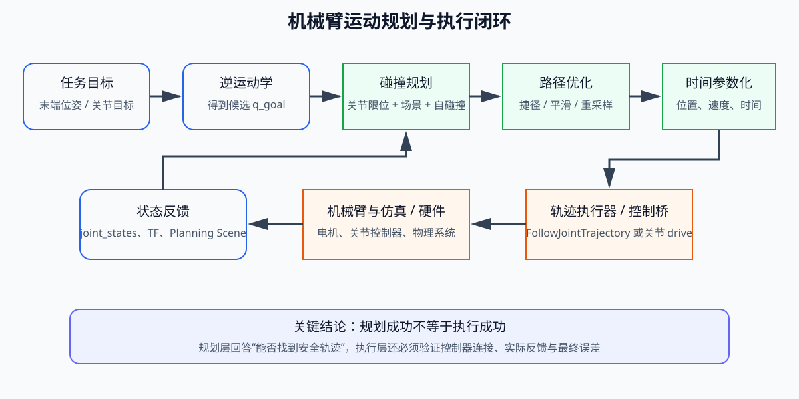
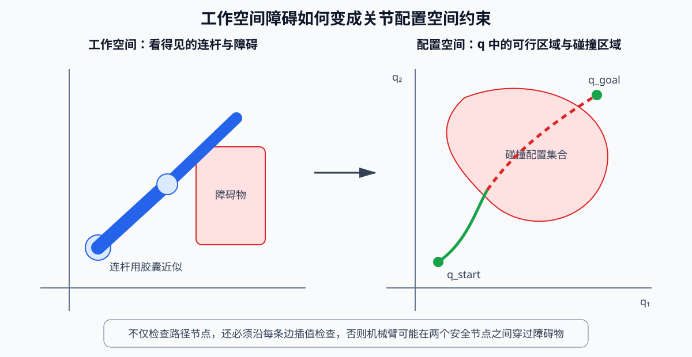
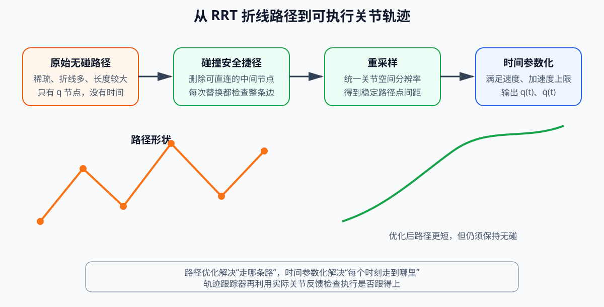
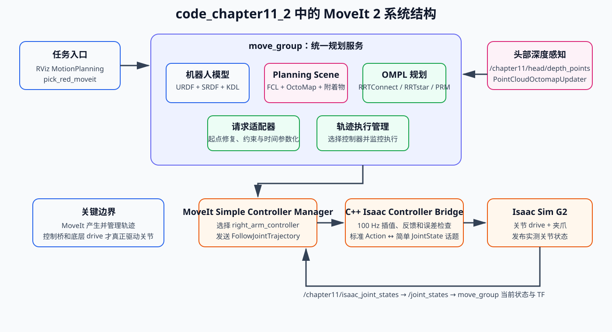

# 第十一章 机械臂规划基础与 MoveIt 2 框架

第五章已经解决了“给定关节角，末端在哪里”和“给定末端目标，关节应该转到哪里”的问题。本章继续向前一步：即使起点和终点都能通过逆运动学求出，机械臂也不能简单地从起点直线插值到终点，因为中间过程可能撞到桌面、障碍物、机器人躯干或自身连杆，也可能产生过快、过急、底层控制器无法稳定跟踪的运动。

因此，机械臂规划真正要解决的是一条完整链路：从当前关节状态和任务目标出发，建立机器人与环境的碰撞模型，在高维关节空间中搜索无碰路径，对路径进行优化和时间参数化，再通过控制器执行轨迹，并利用真实关节反馈判断执行是否成功。

本章围绕 G2 机器人右侧七自由度机械臂展开，使用同一个桌面抓取案例讲解两套实现：

- `code/code_chapter11_1`：不使用 MoveIt 2，从零实现碰撞检测、RRT-Connect、局部路径修复、轨迹优化和关节轨迹跟踪，用于看清机械臂规划内部每一步；
- `code/code_chapter11_2`：使用 ROS 2 Humble 与 MoveIt 2，把机器人模型、Planning Scene、KDL、OMPL、轨迹执行、RViz 和 Isaac Sim 控制桥组织成标准工程。

两套代码都执行相同任务：G2 位于桌前，桌上放置红、绿、蓝三色物体，右机械臂需要绕开黄色阻挡物，到达红色物体的预抓取位置，再接近、夹持并抬升目标。红色物体在 `arm_base_link` 下的位置已知，本章不使用右夹爪相机定位目标，也不实现末端视觉伺服；头部深度相机只负责生成环境障碍点云。

为了保持与第四章、第五章一致的学习节奏，全文只分为六个部分。前四部分集中讲机械臂规划、局部避障、轨迹优化、轨迹跟踪和 MoveIt 2 框架，不穿插源代码；第五部分再把原理集中映射到两套代码；第六部分介绍构建、运行、观察方法和故障排查。

---

## 第一部分 机械臂规划基础与完整流程

### 1.1 从逆运动学到运动规划

逆运动学回答的是“机械臂最终应该处于什么关节状态”。设右机械臂当前关节状态为：

$$
\mathbf{q}_{s}=[q_{s1},q_{s2},\ldots,q_{s7}]^{T}
$$

末端目标位置为：

$$
\mathbf{p}_{d}=[x_d,y_d,z_d]^{T}
$$

通过第五章介绍的逆运动学，可以得到一个目标关节状态：

$$
\mathbf{q}_{g}=\mathrm{IK}(\mathbf{p}_{d})
$$

但 `q_g` 只说明终点，不说明中间怎样运动。若直接在起点和终点之间做线性插值：

$$
\mathbf{q}(s)=(1-s)\mathbf{q}_{s}+s\mathbf{q}_{g},\qquad s\in[0,1]
$$

机械臂的每个关节会同时变化。末端轨迹通常不是工作空间中的直线，而且任意一段连杆都可能在中途穿过障碍物。因此，IK 成功并不等于运动规划成功。

完整的运动规划问题需要同时满足以下条件：

1. 起点来自当前真实关节反馈，而不是程序中已经过时的旧状态；
2. 终点满足任务目标，并且不违反关节限位；
3. 路径上的每一个关节状态都无碰撞；
4. 相邻路径点之间的连续运动也无碰撞；
5. 路径经过优化后仍然安全；
6. 加入时间后，速度和加速度不超过限制；
7. 底层控制器能够跟踪轨迹，最终误差满足要求。



*图 11-1：机械臂规划不是一次 IK，而是目标生成、碰撞规划、轨迹优化、执行和状态反馈组成的闭环。*

图中最重要的边界是“规划”和“执行”的区别。规划成功只表示算法找到了理论上可行的轨迹；只有控制器收到轨迹、机器人实际运动、关节反馈持续更新并且最终误差满足阈值，才能认为执行成功。

### 1.2 路径、轨迹与控制指令

机械臂规划中经常出现“路径”和“轨迹”两个词，它们不能混用。

路径只描述机械臂经过哪些关节位置，可以写成：

$$
\mathcal{P}=\{\mathbf{q}_0,\mathbf{q}_1,\ldots,\mathbf{q}_N\}
$$

路径中没有时间信息。它只能回答“从哪里经过”，不能回答“什么时候到达”和“运动多快”。RRT-Connect 输出的首先就是这样一条离散路径。

轨迹在路径上加入时间、速度，必要时还包含加速度：

$$
\mathcal{T}=\{t_k,\mathbf{q}_k,\dot{\mathbf{q}}_k,\ddot{\mathbf{q}}_k\}_{k=0}^{M}
$$

轨迹可以交给控制器执行。控制器再按照时间读取期望关节位置，并根据实际反馈驱动机器人。

为了理解三者的关系，可以把完整过程概括为：

| 层级 | 主要输入 | 主要输出 | 解决的问题 |
|---|---|---|---|
| 任务与 IK | 末端目标 | 目标关节状态 | 最终要到哪里 |
| 路径规划 | 起点、终点、碰撞场景 | 无碰关节路径 | 从哪里绕过去 |
| 轨迹生成 | 路径、速度/加速度限制 | 带时间的轨迹 | 以多快的速度运动 |
| 轨迹跟踪 | 期望轨迹、实际反馈 | 关节驱动命令 | 机器人是否真正跟上 |

### 1.3 工作空间、配置空间和坐标系

工作空间是机械臂真实存在的三维空间。桌面、黄色阻挡物、红色目标和机械臂连杆都在工作空间中描述。配置空间则由所有关节变量构成。G2 右臂有 7 个旋转关节，因此配置空间是七维空间：

$$
\mathcal{C}\subset\mathbb{R}^{7}
$$

配置空间中的一个点代表一组完整关节角。某个关节状态如果会让连杆与桌面碰撞，那么这个点就属于碰撞区域。机械臂规划的目标，是在七维空间中从 `q_s` 找到一条通向 `q_g`、且始终位于无碰区域的曲线。



*图 11-2：工作空间中的障碍物会映射为配置空间中的碰撞区域，规划器在关节空间中绕过这些区域。*

本章两套代码的规划坐标系统一为 `arm_base_link`。G2 模型在该坐标系中的方向约定为：

- `x` 轴指向机器人前方；
- `y` 轴指向下方；
- `z` 轴指向机器人左方；
- 右机械臂工作区通常满足 `z < 0`。

RViz 更习惯使用 `x` 向前、`y` 向左、`z` 向上的坐标系。自编版本在发布 Marker 时直接完成坐标转换；MoveIt 2 版本通过 `world -> arm_base_link` 静态 TF 完成显示坐标转换。该转换只影响 RViz 中怎样显示，不会改变 MoveIt 在 `arm_base_link` 中进行的规划和碰撞检测。

案例中红色物体中心为：

$$
\mathbf{p}_{red}=[0.56,\ 0.535,\ -0.43]^{T}\ \mathrm{m}
$$

物体尺寸为 `0.075 m × 0.075 m × 0.075 m`。自编版本根据该位置定义三个任务点：

| 任务点 | 相对红色物体的偏移 | 作用 |
|---|---|---|
| 预抓取点 | `[0, -0.19, 0] m` | 先绕开阻挡物，到达目标上方安全位置 |
| 抓取点 | `[0, -0.065, 0] m` | 沿接近方向进入夹持区域 |
| 抬升点 | `[-0.02, -0.27, 0] m` | 夹持后将物体向上并略向后抬起 |

这里 `y` 轴向下，因此减小 `y` 表示向上运动。理解这一点非常重要，否则会把“抬升”误写成向桌面下方运动。

### 1.4 一次抓取任务的完整状态链

本章案例不是一次从 HOME 到目标的单段运动，而是由多个规划—执行阶段组成：

1. 读取当前关节状态并张开夹爪；
2. 根据已知预抓取位置求解 IK；
3. 在桌面、阻挡物、非目标物体和机器人自身约束下规划到预抓取状态；
4. 根据最新反馈重新设置起点；
5. 允许夹爪进入目标区域，规划到抓取状态；
6. 闭合夹爪，并在规划场景中把红色物体改成附着物体；
7. 从当前反馈状态规划到抬升状态；
8. 执行轨迹并检查最终关节误差。

每一个阶段都应使用上一个阶段结束后的真实关节状态作为新起点。若程序一直使用理想终点作为下一阶段起点，而实际机械臂存在跟踪误差，规划器看到的状态就会逐渐偏离机器人真实状态，最终可能出现轨迹起点不匹配、Planning Scene 状态过期或执行被控制器拒绝等问题。

---

## 第二部分 碰撞检测、全局规划与局部避障

### 2.1 状态碰撞与边碰撞

碰撞检测至少要覆盖三类约束。

第一类是关节限位。每个关节必须满足：

$$
q_i^{min}\le q_i\le q_i^{max}
$$

第二类是机械臂与环境碰撞，例如连杆撞到桌面、黄色阻挡物、绿色物体或蓝色物体。

第三类是机械臂自碰撞，例如前臂绕回后与上臂或夹爪相撞。相邻连杆本来就在关节处连接，不能把这种正常接触误判为自碰撞，因此通常只检查具有一定拓扑间隔的非相邻连杆。

`code_chapter11_1` 为了让算法易于阅读，采用简化几何模型：

- 每段连杆用带半径的线段，也就是胶囊体近似；
- 桌面、物体和躯干使用轴对齐包围盒 AABB；
- 检测连杆与障碍物时，把 AABB 按连杆半径和安全距离向外扩展，再检测连杆中心线是否与盒体相交；
- 检测自碰撞时，计算非相邻连杆中心线之间的最短距离。

这种模型比三角网格碰撞更简单、更快，也更适合教学，但会丢失夹爪细节和复杂曲面。MoveIt 2 版本则使用 URDF 中的碰撞几何、Planning Scene 和默认 FCL 碰撞检测框架，工程组织更标准。

仅检查离散路径节点是不够的。设两个相邻节点 `q_a` 和 `q_b` 都无碰撞，机械臂在两点之间连续运动时仍可能穿过障碍物。因此还要沿边插值：

$$
\mathbf{q}(\alpha)=(1-\alpha)\mathbf{q}_{a}+\alpha\mathbf{q}_{b},\qquad \alpha\in[0,1]
$$

并对插值状态逐个检查。`code_chapter11_1` 使用 `edge_resolution=0.045 rad` 控制边检查分辨率；MoveIt 2 配置使用 `longest_valid_segment_fraction=0.008` 控制 OMPL 状态空间中的最长有效检查段。分辨率过大容易漏碰撞，过小则会显著增加规划时间。

### 2.2 双向 RRT-Connect 全局规划

七自由度机械臂的配置空间维数较高，规则栅格搜索会产生维数灾难。本章自编规划器和 MoveIt 2 默认规划器都优先使用 RRT-Connect。

RRT-Connect 的核心思想是从起点和终点同时生长两棵随机树：

- 起点树从 `q_s` 出发；
- 终点树从 `q_g` 出发；
- 每次在关节限位内随机采样一个状态；
- 找到树中距离采样点最近的节点；
- 按固定步长向采样点扩展；
- 如果新边无碰撞，则把新节点加入树；
- 再让另一棵树尽可能连续地向新节点连接；
- 两棵树连接后，回溯父节点并拼接为完整路径。

关节空间中两个状态的距离使用欧氏距离：

$$
d(\mathbf{q}_a,\mathbf{q}_b)=\lVert\mathbf{q}_a-\mathbf{q}_b\rVert_2
$$

这意味着七个关节的角度变化被共同计入距离。该度量简单直观，但没有区分不同关节对末端位移和碰撞风险的影响，因此属于基础实现。

`code_chapter11_1` 的默认全局规划参数为：

| 参数 | 默认值 | 含义 |
|---|---:|---|
| `step_size` | `0.22 rad` | 树每次扩展的最大关节空间距离 |
| `edge_resolution` | `0.045 rad` | 相邻状态之间的碰撞检查分辨率 |
| `goal_bias` | `0.18` | 直接向另一棵树根节点采样的概率 |
| `max_iterations` | `5000` | 最大采样迭代次数 |
| `random_seed` | `11` | 随机种子，便于复现实验 |
| `link_radius` | `0.055 m` | 连杆胶囊半径 |
| `safety_margin` | `0.0 m` | 对环境障碍物增加的额外安全边界 |
| `self_collision_distance` | `0.085 m` | 简化自碰撞距离阈值 |

规划器首先检查起点和终点是否合法；如果起终点之间可以直接无碰连接，就直接返回两点路径；只有直连失败时才启动随机树搜索。这个顺序可以避免在简单场景中进行不必要的随机采样。

### 2.3 机械臂局部避障的含义

移动底盘常把局部规划理解为高频速度采样和短时域避障。机械臂的局部避障形式更多，本章两套实现采用的是“碰撞监测 + 从当前状态重新规划”，而不是连续的反应式速度控制。

`code_chapter11_1` 的局部修复流程是：

1. 从路径起点开始检查每一条边；
2. 找到第一条失效边；
3. 在失效边前后各保留一个小窗口；
4. 保留仍然安全的路径前段和后段；
5. 只对窗口两端之间重新运行 RRT-Connect；
6. 拼接新旧路径后，再检查整条路径是否有效。

默认窗口大小为 4 个路径节点。局部规划最多迭代 2200 次，目标偏置提高到 0.28。这样做比完全丢弃整条路径更节省搜索时间，尤其适合障碍物只影响路径局部区域的情况。

`code_chapter11_2` 没有实现持续运行的机械臂局部控制器，而是采用任务级低频重规划：

- 每次规划前调用 `setStartStateToCurrentState()`；
- 优先使用 RRTConnect；
- 快速规划失败后依次尝试 RRTstar 和 PRM；
- 执行失败后重新读取当前关节反馈并再次规划；
- Planning Scene 更新后，下一次规划自动使用最新障碍物。

因此，本章中的“局部避障”应理解为场景更新后的在线重规划和局部路径修复。对于人员快速进入工作区、障碍物高速运动等场景，仅靠低频重规划通常不够，还需要 MoveIt Servo、Hybrid Planning、距离场速度缩放、独立安全控制器或急停系统。

### 2.4 抓取目标、环境障碍与附着物体

抓取任务中的目标物体具有特殊碰撞语义。机械臂在远距离运动时应该避开目标，最后接近时夹爪又必须进入目标区域；抓住以后，目标还要随机械臂一起参与后续碰撞检查。

本章两套代码采用略有不同但目的相同的处理方式。

在自编版本中，红色物体在统一场景中用于显示和感知过滤，但其 `collision` 标志为关闭，因此规划器不会把红色目标当成普通外部障碍。桌面、黄色阻挡物、绿色物体、蓝色物体和机器人躯干仍然参与碰撞检测。闭合夹爪后，Isaac Sim 让红色可视物体跟随末端移动。

在 MoveIt 2 版本中，红色物体最初作为普通 `CollisionObject` 加入 Planning Scene。到达预抓取位姿后，程序暂时把它从世界碰撞物体中移除，使夹爪可以进入抓取区域；夹爪闭合后，再把同样尺寸的盒体作为 `AttachedCollisionObject` 附着到 `gripper_r_center_link`。抬升规划由此把“机械臂 + 已抓物体”作为一个整体检查碰撞。

这一区别也说明了规划场景和物理仿真的边界：Planning Scene 中的附着物体用于规划碰撞语义；Isaac Sim 中的目标跟随用于画面和任务演示。当前案例没有模拟真实接触、摩擦、质量、夹紧力和物体滑落，不能把“附着成功”理解为完成了真实物理抓取验证。

---
## 第三部分 轨迹优化、时间参数化与轨迹跟踪

### 3.1 为什么无碰路径不能直接执行

RRT-Connect 的目标是尽快找到一条可行路径，而不是直接生成最短、最平滑或最好跟踪的路径。随机树找到的路径通常具有以下特点：

- 路径节点数量不固定；
- 相邻线段方向变化较大；
- 关节空间总长度可能明显大于必要长度；
- 路径点间距不均匀；
- 只有几何位置，没有速度和时间。

如果直接把这些路径点按固定频率发送给机械臂，不同路径段的实际速度会忽快忽慢，拐点处还可能出现速度突变。轨迹优化的作用，就是在保持无碰的前提下改善路径几何形状，再把路径转换为满足运动学限制的时间轨迹。



*图 11-3：随机规划得到无碰路径后，还需要捷径化、重采样、时间参数化和反馈跟踪。*

### 3.2 碰撞安全捷径与路径重采样

`code_chapter11_1` 首先执行随机捷径优化。每次随机选择路径中的两个非相邻节点 `q_i` 和 `q_j`，如果两点之间可以直接无碰连接，就删除中间节点：

$$
\{\mathbf{q}_i,\mathbf{q}_{i+1},\ldots,\mathbf{q}_j\}
\quad\Rightarrow\quad
\{\mathbf{q}_i,\mathbf{q}_j\}
$$

是否允许替换不能只比较距离，还必须对新边进行完整碰撞检查。默认最多尝试 180 次。捷径优化不会保证得到全局最短路径，但实现简单，通常能够明显减少随机树产生的折线和冗余节点。

捷径化以后，程序按照 `path_resolution=0.08 rad` 对每段路径重新采样，使相邻点在七维关节空间中的距离较均匀。重采样不是为了改变路径形状，而是为了让后续时间参数化和轨迹执行使用稳定的离散分辨率。

路径长度使用关节空间线段长度之和衡量：

$$
L=\sum_{k=0}^{N-1}\lVert\mathbf{q}_{k+1}-\mathbf{q}_{k}\rVert_2
$$

该指标适合比较同一任务中优化前后的关节运动量，但它不是末端在三维空间中的路径长度，也没有直接表示能耗、时间或最小障碍距离。

### 3.3 五次时间参数化

自编版本对每个相邻路径段使用五次 smoothstep 插值。设某段起点和终点分别为 `q_0`、`q_1`，归一化时间为：

$$
\tau=\frac{t}{T},\qquad \tau\in[0,1]
$$

位置缩放函数为：

$$
h(\tau)=10\tau^3-15\tau^4+6\tau^5
$$

该段关节位置为：

$$
\mathbf{q}(t)=\mathbf{q}_0+h(\tau)(\mathbf{q}_1-\mathbf{q}_0)
$$

速度缩放函数为：

$$
\dot h(\tau)=\frac{30\tau^2-60\tau^3+30\tau^4}{T}
$$

因此：

$$
\dot{\mathbf{q}}(t)=\dot h(\tau)(\mathbf{q}_1-\mathbf{q}_0)
$$

五次曲线在每段起点和终点的速度为零，加速度也连续回到零，适合教学中演示从几何路径到时间轨迹的转换。代码根据关节速度和加速度限制分别估算最短持续时间：

$$
T_v=\max_i\frac{1.875|\Delta q_i|}{v_{i,max}}
$$

$$
T_a=\max_i\sqrt{\frac{5.8|\Delta q_i|}{a_{i,max}}}
$$

最终使用：

$$
T=\max(0.12,T_v,T_a)
$$

默认关节速度上限为 `1.25 rad/s`，加速度上限为 `2.2 rad/s²`，自编轨迹生成时再乘以 `speed_scale=0.55`。轨迹按照 `1/120 s` 采样，与 Isaac Sim 的 120 Hz 物理步长对应。

MoveIt 2 版本不使用这段自编五次曲线，而是在 OMPL 规划请求适配器中启用 `AddTimeOptimalParameterization`。它根据路径和关节限制自动为轨迹分配时间。任务程序又调用速度缩放 0.55、加速度缩放 0.45，使实际使用的限制更加保守。

需要注意，“Time Optimal”表示在给定路径和限制下进行时间参数化，不表示它同时求得了全局最短路径。路径几何质量主要仍由 OMPL 规划和路径简化决定。

### 3.4 轨迹跟踪与误差保护

轨迹生成后，规划层得到的是期望值。实际机械臂是否准确到达，还取决于关节 drive、控制频率、物理参数、通信延迟和反馈质量。

自编版本的跟踪器在每个物理周期执行以下过程：

1. 读取右臂 7 个关节的实际位置；
2. 计算当前轨迹点与实际位置之间的最大绝对误差；
3. 误差不超过 `0.10 rad` 时，继续发送下一个期望点；
4. 误差大于 `0.10 rad` 时，暂时保持当前目标一帧，让底层 drive 追赶；
5. 误差超过 `0.38 rad` 时，立即中止执行；
6. 轨迹结束后继续保持最终目标 30 个物理周期。

最大关节误差定义为：

$$
e_{max}=\max_i |q_{d,i}-q_i|
$$

MoveIt 2 版本通过标准 `FollowJointTrajectory` Action 执行轨迹。C++ 控制桥以 100 Hz 在相邻轨迹点之间线性插值，把期望关节位置发布给 Isaac Sim；同时把 Isaac 反馈转发为标准 `/joint_states`，并通过 Action feedback 返回期望值、实际值和误差。轨迹时间结束后，控制桥继续保持最终目标；如果最大误差在 8 秒内降到 `0.10 rad` 以下，则返回成功，否则返回 `GOAL_TOLERANCE_VIOLATED`。

因此，以下三个“成功”必须分别判断：

| 层级 | 成功条件 |
|---|---|
| IK 成功 | 目标位置或位姿误差满足求解阈值 |
| 规划成功 | 找到满足关节限位和碰撞约束的路径/轨迹 |
| 执行成功 | 控制器连接正常，机器人完成运动，最终反馈误差满足阈值 |

---

## 第四部分 MoveIt 2 整体框架、算法与参数

### 4.1 MoveIt 2 在系统中的位置

MoveIt 2 不是一个单独的路径规划算法，而是一套机械臂运动规划与操作框架。它把机器人模型、运动学插件、碰撞场景、规划算法、轨迹处理、控制器接口和可视化工具组织在一起，并通过 `move_group` 为用户程序提供统一入口。

本章工程中的完整数据链为：

```text
任务程序或 RViz
→ MoveGroupInterface / MoveGroup Action
→ move_group
→ 当前状态 + URDF/SRDF + Planning Scene
→ KDL 运动学与 OMPL 规划流水线
→ 路径简化与时间参数化
→ Trajectory Execution Manager
→ MoveIt Simple Controller Manager
→ /right_arm_controller/follow_joint_trajectory
→ C++ Isaac Controller Bridge
→ /chapter11/isaac_joint_command
→ Isaac Sim G2 关节 drive
→ /chapter11/isaac_joint_states
→ /joint_states、TF 与 move_group 当前状态
```



*图 11-4：本章 MoveIt 2 工程中，move_group 负责规划组织，标准控制器接口负责轨迹执行，Isaac Sim 提供关节驱动和反馈。*

图中可以看到，MoveIt 2 不直接操作 Isaac Sim articulation。它把轨迹发送到标准 `FollowJointTrajectory` Action；C++ 控制桥负责把标准轨迹转换为 Isaac 能接收的简单关节命令话题。这一分层与真实机器人中的“MoveIt → ros2_control 控制器 → 厂商驱动/硬件”相似。

### 4.2 URDF、SRDF、KDL 与 Planning Scene

MoveIt 2 首先需要知道“机器人是什么”。本章使用四类信息共同构建规划模型。

**URDF/Xacro** 描述机器人运动学树和基础物理属性。本章文件 `g2_right_arm.urdf.xacro` 包含：

- `arm_base_link` 到 `gripper_r_center_link` 的七个旋转关节；
- 每个关节的父子链接、原点、旋转轴和位置限位；
- 连杆的简化圆柱、球体或盒体碰撞几何；
- 夹爪中心的固定连接。

URDF 中的视觉几何用于显示，碰撞几何用于碰撞检测。为了提高规划速度，碰撞几何通常应比精细渲染网格简单，但又不能简单到明显漏掉真实机械臂体积。

**SRDF** 描述运动规划语义。本章 `g2_right_arm.srdf` 定义：

- 名为 `right_arm` 的规划组；
- 从 `arm_base_link` 到 `gripper_r_center_link` 的链；
- 名为 `home` 的命名状态；
- 相邻连杆和部分确定不会碰撞的连杆对。

URDF 回答“有哪些关节和连杆”，SRDF 回答“哪些连杆组成规划组、哪些碰撞对可以忽略、有哪些语义状态”。两者职责不同，不能只配置其中一个。

**KDL 运动学插件**负责 MoveIt 中的 FK/IK。`kinematics.yaml` 为 `right_arm` 配置：

| 参数 | 数值 | 含义 |
|---|---:|---|
| `kinematics_solver` | `KDLKinematicsPlugin` | 使用 KDL 数值运动学插件 |
| `kinematics_solver_search_resolution` | `0.005` | 冗余变量搜索分辨率 |
| `kinematics_solver_timeout` | `0.08 s` | 单次求解超时 |
| `kinematics_solver_attempts` | `5` | 求解尝试次数 |

本案例的 C++ 抓取程序直接使用预先离线求得的四组关节目标，把重点放在 MoveIt 的规划和执行链路上；但 RViz 或其他程序给出末端位姿目标时，MoveIt 仍会通过 KDL 插件执行 IK。

**Planning Scene** 把机器人当前状态与环境碰撞信息组合起来。其信息来源包括：

- `/joint_states` 提供当前关节位置；
- URDF/SRDF 提供机器人碰撞模型和允许碰撞关系；
- `CollisionObject` 提供已知场景物体；
- `AttachedCollisionObject` 提供随末端运动的抓取物体；
- 头部深度点云通过 OctoMap 更新三维占用环境。

Planning Scene 中看到障碍物，规划器才会避开它。只在 RViz 中画一个普通 Marker，并不会自动把它变成碰撞物体。

### 4.3 OMPL 规划流水线与本章使用的算法

本章只启用名为 `ompl` 的规划流水线，规划插件为 `ompl_interface/OMPLPlanner`。配置了三个采样规划器。

#### RRTConnect

RRTConnect 从起点和终点同时扩展两棵树，强调快速找到可行路径。本章把它作为首选规划器，配置 `range=0.20`。它通常适合高维机械臂的单次查询，但不保证路径最优。

#### RRTstar

RRTstar 在随机树生长过程中不断选择和重连父节点，理论上具有渐近最优性质。本章配置 `range=0.18`、`goal_bias=0.08`。它通常比 RRTConnect 慢，因此只在首选规划器失败后作为回退。

#### PRM

PRM 先在自由空间采样并构建路线图，再在图上连接起点和终点。它适合同一环境中的多次查询。本章把 PRM 作为第三个回退选项，没有额外覆盖默认参数。

任务代码的规划器回退顺序为：

| 顺序 | 规划器 | 单次规划时间 |
|---:|---|---:|
| 1 | `RRTConnectkConfigDefault` | `4.0 s` |
| 2 | `RRTstarkConfigDefault` | `7.0 s` |
| 3 | `PRMkConfigDefault` | `7.0 s` |

每次尝试前都会读取当前实测状态并重新设置目标。若规划成功但执行失败，程序不会返回旧起点，而是继续从最新反馈状态重新规划。

OMPL 输出几何路径后，请求适配器继续处理规划请求和结果。本章启用的适配器包括：

| 请求适配器 | 作用 |
|---|---|
| `AddTimeOptimalParameterization` | 为几何路径增加时间、速度和加速度信息 |
| `ResolveConstraintFrames` | 解析约束使用的参考坐标系 |
| `FixWorkspaceBounds` | 修正规划工作空间边界 |
| `FixStartStateBounds` | 修正轻微超出关节边界的起点 |
| `FixStartStateCollision` | 尝试处理起点碰撞问题 |
| `FixStartStatePathConstraints` | 处理起点与路径约束不一致的问题 |

这些适配器可以修复一定范围内的输入问题，但不能替代正确的模型和场景。如果真实起点位于严重碰撞中、关节名称错误或目标完全不可达，增加规划时间和尝试次数也无法从根本上解决问题。

### 4.4 三维感知、OctoMap 与碰撞场景更新

本章 MoveIt 2 工程使用 `PointCloudOctomapUpdater` 把头部深度点云转换为 OctoMap。关键数据链为：

```text
Isaac 头部深度图
→ rgbd_geometry.py 标定反投影
→ 工作区裁剪、已知目标过滤、机器人自滤波
→ /chapter11/head/depth_points
→ PointCloudOctomapUpdater
→ MoveIt OccupancyMapMonitor
→ Planning Scene 中的 OctoMap
```

主要参数为：

| 参数 | 数值 | 说明 |
|---|---:|---|
| 点云话题 | `/chapter11/head/depth_points` | Isaac 端发布的障碍点云 |
| `octomap_frame` | `arm_base_link` | OctoMap 参考坐标系 |
| `octomap_resolution` | `0.04 m` | 体素分辨率 |
| `max_range` | `3.0 m` | 最大点云距离 |
| `max_update_rate` | `1.0 Hz` | OctoMap 最大更新频率 |
| `padding_offset` | `0.0` | 不对环境体素增加固定膨胀 |
| `padding_scale` | `1.0` | 不按比例膨胀环境体素 |

红色目标位姿已知，因此点云处理会按红色物体真实 AABB 删除目标点，防止目标本身形成 OctoMap 障碍并阻挡最终接近。头部相机也会看见右臂和夹爪，所以 `robot_self_filter.py` 使用 G2 USD 的实际 OBB 和教学 FK 模型删除机器人自身点云。机器人运动较快时，程序暂缓发布该帧点云，机械臂静止后再恢复，以减少相机帧和关节反馈错位造成的夹爪残影。

这里要区分三个概念：目标过滤用于允许夹爪接近已知目标；机器人自滤波用于避免把机械臂自身写入环境地图；障碍物膨胀用于增加环境安全距离。本章前两项已实现，而 `padding_offset=0.0`、`padding_scale=1.0` 表示没有额外膨胀环境障碍物。

### 4.5 轨迹执行、控制器参数与 ROS 接口

MoveIt 2 通过 `MoveItSimpleControllerManager` 查找控制器。本章配置一个 `right_arm_controller`：

- 类型为 `FollowJointTrajectory`；
- Action 命名空间为 `follow_joint_trajectory`；
- 完整 Action 为 `/right_arm_controller/follow_joint_trajectory`；
- 关节顺序严格为 `idx61_arm_r_joint1` 到 `idx67_arm_r_joint7`；
- 该控制器被设为默认控制器。

MoveIt 的控制器配置描述的是“怎样找到控制器、轨迹中包含哪些关节”。它并不会自动创建底层控制器。本章由 `isaac_controller_bridge.cpp` 实际提供 Action server。在真实机器人项目中，这个角色通常由 `ros2_control` 的 `joint_trajectory_controller` 和硬件接口承担。

轨迹执行相关参数为：

| 参数 | 数值 | 含义 |
|---|---:|---|
| `allowed_execution_duration_scaling` | `2.5` | 允许实际执行时间相对规划时间放大的倍数 |
| `allowed_goal_duration_margin` | `4.0 s` | 目标完成时间的额外裕量 |
| `allowed_start_tolerance` | `0.08 rad` | 当前状态与轨迹起点允许的误差 |
| `record_trajectory_state_frequency` | `10 Hz` | 执行状态记录频率 |

C++ 控制桥还执行自己的接口检查：

- 拒绝关节名称、顺序或数量不匹配的轨迹；
- 同一时间只允许执行一条轨迹；
- 最多等待 5 秒接收 Isaac 关节反馈；
- 以 100 Hz 插值并发送关节位置命令；
- 最终误差小于 `0.10 rad` 才返回 Action 成功；
- 8 秒内不能收敛则返回目标容差违反。

从 MoveIt 到 Isaac 的关键 ROS 接口如下：

| 接口 | 类型 | 方向 | 作用 |
|---|---|---|---|
| `/move_action` | MoveGroup Action | 任务/RViz → move_group | 提交规划与执行请求 |
| `/right_arm_controller/follow_joint_trajectory` | FollowJointTrajectory Action | MoveIt → C++ 控制桥 | 执行标准关节轨迹 |
| `/chapter11/isaac_joint_command` | `sensor_msgs/JointState` | C++ 控制桥 → Isaac | 发送 7 关节期望位置 |
| `/chapter11/isaac_joint_states` | `sensor_msgs/JointState` | Isaac → C++ 控制桥 | 返回 7 关节实际位置和速度 |
| `/joint_states` | `sensor_msgs/JointState` | C++ 控制桥 → MoveIt/TF | 提供标准机器人状态 |
| `/chapter11/gripper_open` | `std_msgs/Bool` | 抓取程序 → Isaac | 控制右夹爪开合 |
| `/chapter11/attach_red` | `std_msgs/Bool` | 抓取程序 → Isaac | 控制教学目标跟随末端 |
| `/monitored_planning_scene` | PlanningScene | move_group → 外部 | 发布规划场景更新 |

---
## 第五部分 代码实现

前四部分已经集中讲完原理。本部分只讨论代码结构、关键接口和调用顺序。两套实现必须分开阅读：`code_chapter11_1` 是用于拆解算法的自编教学链路，`code_chapter11_2` 是使用 MoveIt 2 的标准工程链路，二者不能混成同一套运行环境。

### 5.1 两套代码的目录边界

第十一章相关目录如下：

```text
code/
├── code_chapter11_1/                 # 不使用 MoveIt 2
│   ├── config.py                     # 统一参数、场景与任务点
│   ├── arm_model.py                  # 复用第五章 FK/IK，提供连杆端点
│   ├── collision.py                  # 胶囊、AABB、关节限位、自碰撞
│   ├── motion_planner.py             # 双向 RRT-Connect
│   ├── local_avoidance.py            # 失效边检测与局部窗口修复
│   ├── trajectory_optimizer.py       # 捷径、重采样、五次时间参数化
│   ├── trajectory_tracker.py         # Isaac 关节轨迹跟踪与误差保护
│   ├── perception.py                 # 头部深度障碍点云
│   ├── rgbd_geometry.py              # 深度反投影
│   ├── gripper.py                    # 右夹爪开合
│   ├── simulation.py                 # G2 与桌面场景
│   ├── rviz_visualizer.py            # 场景、路径和机械臂 Marker
│   ├── demo_pick_red.py              # 完整抓取主程序
│   ├── run_rviz.sh
│   ├── run_teaching_arm.sh
│   └── tests/
│
└── code_chapter11_2/                 # ROS 2 Humble + MoveIt 2
    ├── config.py                     # Isaac 端场景和话题桥参数
    ├── simulation.py                 # Isaac G2 场景
    ├── perception.py                 # 头部深度点云处理
    ├── robot_self_filter.py          # 机器人自身点云过滤
    ├── trajectory_action_server.py   # Isaac 端 JointState 话题桥
    ├── isaac_moveit_bridge.py        # Isaac 主循环
    ├── build_moveit.sh
    ├── run_moveit_bridge.sh
    ├── run_moveit.sh
    ├── run_pick.sh
    ├── check_moveit.sh
    └── g2_chapter11_moveit/
        ├── CMakeLists.txt
        ├── package.xml
        ├── urdf/g2_right_arm.urdf.xacro
        ├── srdf/g2_right_arm.srdf
        ├── config/
        │   ├── kinematics.yaml
        │   ├── ompl_planning.yaml
        │   ├── joint_limits.yaml
        │   ├── moveit_controllers.yaml
        │   ├── move_group.yaml
        │   └── sensors_3d.yaml
        ├── launch/
        │   ├── move_group.launch.py
        │   └── pick_red.launch.py
        ├── src/
        │   ├── planning_scene.cpp
        │   ├── local_replanner.cpp
        │   ├── pick_red.cpp
        │   └── isaac_controller_bridge.cpp
        └── rviz/chapter11_moveit.rviz
```

`code_chapter11_2` 中的 `ros2_build`、`ros2_install`、`ros2_log` 和 `ros2_runtime_log` 是构建或运行生成目录，不是主要教学源代码。修改顶层源码或 YAML 后，应重新执行 `build_moveit.sh`，再重启 MoveIt 相关进程，不能直接把生成目录中的副本当成长期维护入口。

推荐阅读顺序为：

```text
自编版本：
config → arm_model → collision → motion_planner
→ local_avoidance → trajectory_optimizer
→ trajectory_tracker → demo_pick_red

MoveIt 2 版本：
URDF → SRDF → kinematics.yaml → ompl_planning.yaml
→ planning_scene.cpp → local_replanner.cpp
→ isaac_controller_bridge.cpp → pick_red.cpp → launch
```

### 5.2 `code_chapter11_1`：统一配置与几何模型

自编版本首先在 `config.py` 中统一关节、场景、规划和轨迹参数。核心任务点与参数定义如下：

```python
HOME_JOINT_POSITIONS = np.array(
    [0.0, -0.35, 0.0, -1.10, 0.0, 0.35, 0.0], dtype=np.float64
)

RED_OBJECT_POSITION = np.array([0.56, 0.535, -0.43], dtype=np.float64)
RED_OBJECT_SIZE = np.array([0.075, 0.075, 0.075], dtype=np.float64)
PRE_GRASP_POSITION = RED_OBJECT_POSITION + np.array([0.0, -0.19, 0.0])
GRASP_POSITION = RED_OBJECT_POSITION + np.array([0.0, -0.065, 0.0])
LIFT_POSITION = RED_OBJECT_POSITION + np.array([-0.02, -0.27, 0.0])
```

规划器和轨迹参数集中在两个数据类中：

```python
@dataclass(frozen=True)
class PlannerConfig:
    step_size: float = 0.22
    edge_resolution: float = 0.045
    goal_bias: float = 0.18
    max_iterations: int = 5000
    random_seed: int = 11
    link_radius: float = 0.055
    safety_margin: float = 0.0
    self_collision_distance: float = 0.085


@dataclass(frozen=True)
class TrajectoryConfig:
    sample_dt: float = 1.0 / 120.0
    shortcut_attempts: int = 180
    path_resolution: float = 0.08
    speed_scale: float = 0.55
    tracking_tolerance: float = 0.10
    abort_tolerance: float = 0.38
```

`arm_model.py` 不重复编写一套运动学，而是复用第五章的 `G2ArmKinematics`：

```python
from code_chapter5.kinematics import G2ArmKinematics, IKResult, Pose, axis_rotation


class G2PlanningModel:
    def __init__(self) -> None:
        self.kinematics = G2ArmKinematics("right")

    def forward(self, joint_positions):
        return self.kinematics.forward(joint_positions)

    def inverse(self, target_position, initial_positions=None):
        return self.kinematics.inverse(
            target_position=target_position,
            target_rotation=None,
            initial_positions=initial_positions,
        )
```

这里使用位置式 IK，只约束末端位置，不约束夹爪朝向。这样可以利用七自由度机械臂的冗余空间寻找关节解。`link_points()` 则沿第五章运动学链逐段累乘变换，返回肩部、七个关节点和夹爪中心共 9 个点，供胶囊碰撞检测和 RViz 连杆显示使用。

### 5.3 `code_chapter11_1`：碰撞检测、RRT 与局部修复

`collision.py` 的 `state_report()` 按顺序检查非法状态、关节限位、环境碰撞和简化自碰撞。环境碰撞的核心是对每段连杆和每个 AABB 执行相交测试：

```python
points = self.model.link_points(q)
inflation = self.config.link_radius + self.config.safety_margin

for link_index, (start, end) in enumerate(
    zip(points[1:-1], points[2:]), start=1
):
    for obstacle in self.obstacles:
        if obstacle.name == "robot_body" and link_index <= 3:
            continue
        if segment_intersects_box(start, end, obstacle, inflation):
            return CollisionReport(
                True, f"link_{link_index} 与 {obstacle.name} 碰撞"
            )
```

相邻状态之间使用插值检查整条边：

```python
def edge_is_valid(self, start, goal) -> bool:
    q0 = np.asarray(start, dtype=np.float64)
    q1 = np.asarray(goal, dtype=np.float64)
    distance = float(np.linalg.norm(q1 - q0))
    samples = max(1, int(np.ceil(
        distance / self.config.edge_resolution
    )))
    for ratio in np.linspace(0.0, 1.0, samples + 1):
        if not self.state_is_valid(q0 + ratio * (q1 - q0)):
            return False
    return True
```

RRT-Connect 的单步扩展先找最近节点，再按 `step_size` 向采样点前进一步：

```python
def _steer(self, start: np.ndarray, target: np.ndarray) -> np.ndarray:
    delta = target - start
    distance = float(np.linalg.norm(delta))
    if distance <= self.config.step_size:
        return target.copy()
    return start + delta * (self.config.step_size / distance)


def _extend(self, tree, sample):
    nearest_index = self._nearest(tree, sample)
    candidate = self._steer(tree[nearest_index].q, sample)
    if not self.checker.edge_is_valid(tree[nearest_index].q, candidate):
        return None, False
    tree.append(_Node(candidate, nearest_index))
    reached = float(np.linalg.norm(candidate - sample)) < 1e-8
    return len(tree) - 1, reached
```

主循环在两棵树之间交替扩展，并使用目标偏置提高相互连接概率：

```python
for iteration in range(1, self.config.max_iterations + 1):
    if self.rng.random() < self.config.goal_bias:
        sample = tree_b[0].q.copy()
    else:
        sample = self.rng.uniform(
            self.checker.model.lower_limits,
            self.checker.model.upper_limits,
        )

    new_index, _ = self._extend(tree_a, sample)
    if new_index is not None:
        connect_index, connected = self._connect(
            tree_b, tree_a[new_index].q
        )
        if connected:
            # 回溯两棵树并拼接路径
            ...

    tree_a, tree_b = tree_b, tree_a
```

`local_avoidance.py` 找到第一条失效边后，只对局部窗口重新规划：

```python
invalid = self.first_invalid_edge(copied)
if invalid is None:
    return copied

left = max(0, invalid - self.window + 1)
right = min(len(copied) - 1, invalid + self.window)

local_config = replace(
    self.checker.config,
    max_iterations=min(2200, self.checker.config.max_iterations),
    goal_bias=0.28,
    random_seed=self.checker.config.random_seed + invalid + 101,
)
result = RRTConnectPlanner(self.checker, local_config).plan(
    copied[left], copied[right]
)
```

修复完成后还会重新检查整条拼接路径，避免局部新路径与保留的前后段产生新的无效连接。

### 5.4 `code_chapter11_1`：轨迹优化、跟踪与主程序组装

随机捷径优化只在新边无碰时删除中间节点：

```python
def shortcut(self, path):
    result = [np.asarray(q, dtype=np.float64).copy() for q in path]
    for _ in range(self.config.shortcut_attempts):
        if len(result) <= 2:
            break
        i, j = sorted(self.rng.integers(0, len(result), size=2).tolist())
        if j <= i + 1:
            continue
        if self.checker.edge_is_valid(result[i], result[j]):
            result = result[: i + 1] + result[j:]
    return result
```

五次曲线时间参数化的核心实现为：

```python
duration_v = float(np.max(
    1.875 * delta / np.maximum(velocity_limits, 1e-6)
))
duration_a = float(np.max(np.sqrt(
    5.8 * delta / np.maximum(acceleration_limits, 1e-6)
)))
duration = max(0.12, duration_v, duration_a)

for step in range(1, steps + 1):
    tau = step / steps
    scale = 10 * tau**3 - 15 * tau**4 + 6 * tau**5
    scale_dot = (
        30 * tau**2 - 60 * tau**3 + 30 * tau**4
    ) / duration
    trajectory.append(
        TrajectoryPoint(
            t,
            q0 + scale * (q1 - q0),
            scale_dot * (q1 - q0),
        )
    )
```

轨迹跟踪器每个物理周期读取实际关节位置，并根据误差决定继续、等待或终止：

```python
actual = self.get_positions()
error = float(np.max(np.abs(point.positions - actual)))
maximum_error = max(maximum_error, error)

if error > self.config.abort_tolerance:
    raise RuntimeError(f"轨迹跟踪误差过大：{error:.3f} rad")

if error <= self.config.tracking_tolerance:
    self.command(point.positions)

step_callback()
```

`demo_pick_red.py` 中的 `plan_and_execute()` 把一段运动固定组织为四个步骤：

```python
result = planner.plan(start, goal)
repaired = repair.repair(result.path)
optimized = optimizer.optimize(repaired)
trajectory = optimizer.time_parameterize(optimized)
max_error = tracker.execute(
    trajectory, sim.step, rviz.publish_arm
)
```

主程序先在纯 NumPy 层求解预抓取、抓取和抬升三个 IK 目标，再启动大型仿真。仿真启动后，头部深度感知生成障碍体素，碰撞检测器通过 `set_obstacles()` 更新环境，然后依次执行：

```text
张开夹爪并回到当前稳定状态
→ 头部深度地图避障到预抓取位姿
→ 按已知红色物块位置运动到抓取点
→ 闭合夹爪并建立教学用附着
→ 抓取后抬升
```

这种组织方式把每一段运动都变成同一个“规划—修复—优化—跟踪”模板，便于后续把目标来源替换为视觉、任务规划器或用户交互，而不需要重写底层运动规划流程。

### 5.5 `code_chapter11_2`：MoveIt 2 配置文件怎样协同工作

MoveIt 2 版本首先由 Launch 读取所有模型和配置：

```python
moveit_config = (
    MoveItConfigsBuilder(
        "g2_right_arm",
        package_name="g2_chapter11_moveit",
    )
    .robot_description(file_path="urdf/g2_right_arm.urdf.xacro")
    .robot_description_semantic(file_path="srdf/g2_right_arm.srdf")
    .robot_description_kinematics(file_path="config/kinematics.yaml")
    .joint_limits(file_path="config/joint_limits.yaml")
    .trajectory_execution(file_path="config/moveit_controllers.yaml")
    .planning_pipelines(
        default_planning_pipeline="ompl",
        pipelines=["ompl"],
        load_all=False,
    )
    .sensors_3d(file_path="config/sensors_3d.yaml")
    .to_moveit_configs()
)
```

同一个 `move_group.launch.py` 启动五类节点：

```text
static_transform_publisher
robot_state_publisher
isaac_controller_bridge
move_group
rviz2（可选）
```

OMPL 规划器和请求适配器定义在 `ompl_planning.yaml`：

```yaml
planning_plugin: ompl_interface/OMPLPlanner
request_adapters: >-
  default_planner_request_adapters/AddTimeOptimalParameterization
  default_planner_request_adapters/ResolveConstraintFrames
  default_planner_request_adapters/FixWorkspaceBounds
  default_planner_request_adapters/FixStartStateBounds
  default_planner_request_adapters/FixStartStateCollision
  default_planner_request_adapters/FixStartStatePathConstraints

planner_configs:
  RRTConnectkConfigDefault:
    type: geometric::RRTConnect
    range: 0.20
  RRTstarkConfigDefault:
    type: geometric::RRTstar
    range: 0.18
    goal_bias: 0.08
  PRMkConfigDefault:
    type: geometric::PRM

right_arm:
  planner_configs:
    - RRTConnectkConfigDefault
    - RRTstarkConfigDefault
    - PRMkConfigDefault
  longest_valid_segment_fraction: 0.008
```

控制器名称、Action 命名空间和关节顺序定义在 `moveit_controllers.yaml`：

```yaml
moveit_controller_manager: moveit_simple_controller_manager/MoveItSimpleControllerManager

moveit_simple_controller_manager:
  controller_names:
    - right_arm_controller
  right_arm_controller:
    type: FollowJointTrajectory
    action_ns: follow_joint_trajectory
    default: true
    joints:
      - idx61_arm_r_joint1
      - idx62_arm_r_joint2
      - idx63_arm_r_joint3
      - idx64_arm_r_joint4
      - idx65_arm_r_joint5
      - idx66_arm_r_joint6
      - idx67_arm_r_joint7
```

这三处信息必须严格一致：MoveIt 配置中的控制器名称、C++ Action server 的完整名称、轨迹中的关节名称和顺序。任意一处不一致，都可能出现“规划成功但控制器不可用”或“轨迹被 Action server 拒绝”。

### 5.6 `code_chapter11_2`：规划场景、重规划与抓取任务

`planning_scene.cpp` 首先把红色目标加入场景：

```cpp
void addTeachingScene(
  moveit::planning_interface::PlanningSceneInterface& scene)
{
  scene.applyCollisionObject(
    makeBox(
      "red_object",
      {0.56, 0.535, -0.43},
      {0.075, 0.075, 0.075}));
}
```

进入最后接近阶段前，程序移除世界中的红色碰撞体；夹持后再把它附着到末端：

```cpp
attached.link_name = "gripper_r_center_link";
attached.touch_links = {"gripper_r_center_link"};
attached.object = makeBox(
  "red_object",
  {0.0, 0.0, 0.0},
  {0.075, 0.075, 0.075},
  "gripper_r_center_link");
scene.applyAttachedCollisionObject(attached);
```

`local_replanner.cpp` 明确实现三个规划器的回退：

```cpp
const std::vector<std::string> planners = {
  "RRTConnectkConfigDefault",
  "RRTstarkConfigDefault",
  "PRMkConfigDefault"};

for (std::size_t attempt = 0; attempt < planners.size(); ++attempt) {
  move_group.setStartStateToCurrentState();
  move_group.setJointValueTarget(joint_target);
  move_group.setPlannerId(planners[attempt]);
  move_group.setPlanningTime(attempt == 0 ? 4.0 : 7.0);

  MoveGroupInterface::Plan plan;
  const bool planned =
    move_group.plan(plan) == moveit::core::MoveItErrorCode::SUCCESS;

  if (planned &&
      move_group.execute(plan) == moveit::core::MoveItErrorCode::SUCCESS) {
    return true;
  }
}
```

`pick_red.cpp` 配置保守的速度、加速度和重规划参数：

```cpp
move_group.setMaxVelocityScalingFactor(0.55);
move_group.setMaxAccelerationScalingFactor(0.45);
move_group.setNumPlanningAttempts(4);
move_group.allowReplanning(true);
move_group.setReplanAttempts(4);
move_group.setReplanDelay(0.15);
```

随后按照 HOME、预抓取、抓取和抬升四个关节目标执行任务。每个关节目标都与本章已知红色物体场景对应，是离线 IK 的结果。教学时应把它们理解为“任务层给出的目标状态”，而不是 MoveIt 2 必须固定使用的写法。实际项目可以把这些目标替换为在线 IK、视觉定位结果、抓取姿态生成器或 MoveIt Task Constructor 的阶段输出。

### 5.7 `code_chapter11_2`：标准轨迹怎样进入 Isaac Sim

由于 ROS 2 Humble 的系统 Python 与 Isaac Sim Python 版本不同，本章没有在 Isaac Python 中直接实现 `control_msgs` Action，而是使用 C++ 控制桥。

C++ 节点创建标准 Action server：

```cpp
action_server_ = rclcpp_action::create_server<Follow>(
  this,
  "/right_arm_controller/follow_joint_trajectory",
  ...);
```

接收轨迹后，它以 100 Hz 在相邻轨迹点之间线性插值，并把期望关节位置发布到：

```text
/chapter11/isaac_joint_command
```

Isaac 端 `trajectory_action_server.py` 订阅该话题，把 7 个关节目标转换为 `ArticulationAction`：

```python
self.articulation.apply_action(
    ArticulationAction(
        joint_positions=np.asarray(positions, dtype=np.float64),
        joint_indices=self.arm_indices,
    )
)
```

Isaac 再以 30 Hz 发布实际关节位置和速度到：

```text
/chapter11/isaac_joint_states
```

C++ 控制桥严格过滤名称和顺序后，把该反馈转发为标准 `/joint_states`。`robot_state_publisher` 根据 `/joint_states` 发布机械臂 TF，`move_group` 也用它建立当前机器人状态。

这一链路清楚地区分了四层：

```text
MoveIt 规划层
→ 标准 FollowJointTrajectory 控制器接口
→ Isaac/硬件适配层
→ articulation 或真实关节驱动
```

如果以后接入真实机械臂，应优先保留上层 MoveIt 模型、Planning Scene 和任务代码，只把本章 C++ Isaac 控制桥替换为经过验证的 `ros2_control` 控制器、厂商驱动和硬件安全链。

---
## 第六部分 构建、运行与实验分析

### 6.1 运行前检查

本章脚本默认项目位于：

```text
/home/robot/g2_robot
```

Isaac Sim 默认位于：

```text
/home/robot/isaac-sim
```

如果 Isaac Sim 安装在其他位置，可以在终端中设置 `ISAAC_SIM_ROOT`。运行前还应确认：

- G2 模型存在于 `assets/robot/G2_omnipicker/robot.usda`；
- 房间场景存在于 `assets/background/room/room_1/background.usda`；
- ROS 2 Humble 与 MoveIt 2 已安装；
- 需要显示 RViz 时具有可用图形环境；
- 多个终端使用相同的 `ROS_DOMAIN_ID` 和兼容的 DDS 实现；
- 不要在同一个终端混合 Isaac Python 环境、Conda 环境和系统 ROS 2 Python 环境。

两套示例使用相同场景和关节名称，但启动的 ROS 节点可能互相影响。学习时建议先完整关闭一套，再启动另一套，避免重复 `/joint_states`、TF 或同名话题造成状态混乱。

### 6.2 运行不使用 MoveIt 2 的教学规划器

终端 1 启动 RViz：

```bash
cd /home/robot/g2_robot
bash code/code_chapter11_1/run_rviz.sh
```

终端 2 启动 Isaac Sim 与完整规划抓取案例：

```bash
cd /home/robot/g2_robot
bash code/code_chapter11_1/run_teaching_arm.sh
```

无 Isaac 图形窗口运行，但保留 RViz 发布：

```bash
bash code/code_chapter11_1/run_teaching_arm.sh --headless
```

完全关闭 RViz/ROS 2 可视化发布：

```bash
bash code/code_chapter11_1/run_teaching_arm.sh --headless --no-rviz
```

修改随机种子以比较不同 RRT 路径：

```bash
bash code/code_chapter11_1/run_teaching_arm.sh --seed 23
```

正常运行时，终端日志会按每段任务输出四个阶段：

```text
1/4 RRT-Connect 全局规划
2/4 局部碰撞监测与路径修复
3/4 碰撞安全捷径优化与时间参数化
4/4 关节位置闭环轨迹跟踪
```

还应看到：

- 预抓取、抓取和抬升 IK 是否收敛；
- 原始路径点数和 RRT 迭代次数；
- 优化前后的关节空间路径长度；
- 轨迹总时长；
- 每段运动的最大关节跟踪误差；
- 最终“红色物体已被夹起”的完成提示。

RViz 中可以观察：

- 桌面、黄色阻挡物和三色物体；
- 头部深度相机生成的占用体素；
- 原始末端路径与优化后末端路径；
- 指令机械臂与实际机械臂的差异。

需要注意，RViz 中的线条是把关节路径通过 FK 转换为末端位置后绘制的。它便于理解路径形状，但真正的规划仍发生在七维关节空间中。

不使用moveit2的机械臂运行效果如下图所示，实际运行的过程中会发现，这个运行的很慢：


### 6.3 运行纯算法测试

以下测试不需要 Isaac Sim、GPU 或 ROS 2：

```bash
cd /home/robot/g2_robot
PYTHONPATH="$PWD/code" python3 -m unittest discover \
  -s code/code_chapter11_1/tests -v
```

测试覆盖：

- 预抓取、抓取和抬升目标的 IK 可达性；
- RRT-Connect 是否返回有效路径；
- 路径上的节点和边是否无碰；
- 随机捷径优化后路径是否仍然有效；
- 时间参数化结果是否包含递增时间；
- 已知红色目标 AABB 是否按真实边界从点云中删除。

纯算法测试通过只能证明 Python 算法层在当前依赖环境下工作，不能证明 Isaac Sim 场景、RViz、ROS 2 通信或真实机械臂执行成功。

### 6.4 构建并运行 MoveIt 2 版本

首次运行或修改 C++、Launch、URDF、SRDF、YAML 后，先构建 MoveIt 2 包：

```bash
cd /home/robot/g2_robot
bash code/code_chapter11_2/build_moveit.sh
```

脚本只执行构建，不会启动 Isaac Sim。它会生成：

```text
code/code_chapter11_2/ros2_build
code/code_chapter11_2/ros2_install
code/code_chapter11_2/ros2_log
```

建议为三个运行终端设置相同的独立 ROS 域：

```bash
export ROS_DOMAIN_ID=111
```

终端 1 启动 Isaac Sim、G2、头部深度感知和 Isaac 话题桥：

```bash
cd /home/robot/g2_robot
export ROS_DOMAIN_ID=111
bash code/code_chapter11_2/run_moveit_bridge.sh
```

无 Isaac 图形窗口运行：

```bash
bash code/code_chapter11_2/run_moveit_bridge.sh --headless
```

终端 2 启动静态 TF、`robot_state_publisher`、C++ 控制桥、`move_group` 和 RViz：

```bash
cd /home/robot/g2_robot
export ROS_DOMAIN_ID=111
bash code/code_chapter11_2/run_moveit.sh
```

服务器无 RViz 运行：

```bash
bash code/code_chapter11_2/run_moveit.sh use_rviz:=false
```

终端 3 启动红色物体抓取任务：

```bash
cd /home/robot/g2_robot
export ROS_DOMAIN_ID=111
bash code/code_chapter11_2/run_pick.sh
```

正常任务日志应依次包含：

```text
回到 HOME
绕过阻挡物到预抓取位姿
按已知物块位姿运动到抓取点
夹持后抬升
红色物体抓取完成
```

这里必须等待终端 1 已经持续发布 Isaac 关节反馈、终端 2 的 Action server 与 `move_group` 已完全启动，再运行终端 3。否则 MoveIt 可能没有当前状态，或者抓取程序找不到轨迹控制器。

使用moveit2的机械臂规划结果如下所示：


### 6.5 ROS 2 接口检查与故障排查

三套程序都启动后，可以运行统一检查脚本：

```bash
bash code/code_chapter11_2/check_moveit.sh
```

也可以逐项检查。

确认 Isaac 原始反馈：

```bash
ros2 topic echo /chapter11/isaac_joint_states --once
```

确认 MoveIt 使用的标准关节状态：

```bash
ros2 topic echo /joint_states --once
ros2 topic hz /joint_states
```

确认 MoveGroup 和控制器 Action：

```bash
ros2 action list -t | grep -E 'move_action|follow_joint_trajectory'
```

期望至少包含：

```text
/move_action
/right_arm_controller/follow_joint_trajectory
```

确认 TF：

```bash
ros2 run tf2_ros tf2_echo world arm_base_link
ros2 run tf2_ros tf2_echo arm_base_link gripper_r_center_link
```

确认规划场景：

```bash
ros2 topic echo /monitored_planning_scene --once --field is_diff
```

常见问题及处理方法如下。

#### MoveIt 显示规划成功，但机械臂不动

规划成功不等于控制器执行成功。依次检查：

1. `/right_arm_controller/follow_joint_trajectory` 是否存在；
2. `right_arm_controller` 名称是否与 YAML 一致；
3. 七个关节名称和顺序是否完全一致；
4. `/chapter11/isaac_joint_command` 是否有数据；
5. `/chapter11/isaac_joint_states` 和 `/joint_states` 是否持续更新；
6. Action 结果是成功、超时还是目标容差违反。

#### MoveGroup 没有当前状态

检查所有终端的 `ROS_DOMAIN_ID`、`RMW_IMPLEMENTATION` 和 ROS 2 环境是否一致。还要确认没有其他节点发布另一套 `/joint_states`，否则 MoveIt 可能收到名称或顺序不匹配的数据。

#### 轨迹起点偏差过大

先等待 G2 反馈稳定，再发送任务。检查 `allowed_start_tolerance=0.08 rad` 是否与仿真控制精度匹配。不要简单地无限增大该容差，因为过大的起点容差会掩盖机器人状态与计划起点不一致的问题。

#### 起点或终点碰撞

自编版本可以调用 `state_report(q).reason` 查看具体连杆和障碍物。MoveIt 2 版本应在 RViz MotionPlanning 面板和 Planning Scene 中检查机器人是否已经位于桌面、OctoMap 或目标物体内部。

#### 预抓取成功，但抓取点规划失败

检查红色目标是否已从 world collision objects 中移除，并观察抓取点附近是否残留旧 OctoMap。若日志出现 `'<octomap>' and 'gripper_r_center_link'`，通常表示头部点云把运动中的夹爪或残影写入了 OctoMap。应确认运行的是最新机器人自滤波和运动帧抑制代码，并在机械臂静止后等待地图更新。

#### RViz 不显示机器人

确认 Fixed Frame 为 `world`，`world -> arm_base_link` 静态 TF 存在，`robot_state_publisher` 已启动，并且 `/joint_states` 中包含完整七关节名称。

#### 构建或启动受到 Conda 环境影响

使用仓库提供的脚本。`build_moveit.sh`、`run_moveit.sh` 和 `run_pick.sh` 会清理关键 Python 环境变量并 source ROS 2 Humble。不要在同一终端中先进入 Isaac Python，再直接运行系统 ROS 2 MoveIt 命令。

#### 修改 YAML 后参数没有变化

编辑的是顶层源码：

```text
code/code_chapter11_2/g2_chapter11_moveit/config/
```

修改后重新运行 `build_moveit.sh`，关闭旧 `move_group` 和 RViz 进程，再启动 `run_moveit.sh`。不要只修改 `ros2_install` 中的生成副本，也不要在旧进程仍运行时判断参数是否已生效。

### 6.6 建议实验与本章总结

完成默认案例后，可以进行以下实验。

**实验一：比较不同 RRT 随机种子。** 修改自编版本的 `--seed`，记录规划迭代次数、原始路径长度和优化后路径长度。观察随机规划器为什么每次可能得到不同路径。

**实验二：改变扩展步长。** 分别减小和增大 `step_size`。较小步长通常更容易穿过狭窄区域，但树节点更多；较大步长搜索更快，但可能难以在障碍附近精细转弯。

**实验三：改变碰撞检查分辨率。** 调整 `edge_resolution` 或 MoveIt 的 `longest_valid_segment_fraction`，理解安全性和计算量之间的关系。该实验只能在可视化和碰撞检查充分验证后进行，不能为了提高速度而盲目降低检查密度。

**实验四：关闭路径捷径。** 比较原始 RRT 路径和优化后路径的长度、轨迹总时间和机械臂动作流畅程度。

**实验五：改变速度和加速度缩放。** 降低 `speed_scale`，或调整 MoveIt 的速度/加速度缩放，观察轨迹时间和最大跟踪误差怎样变化。

**实验六：模拟场景更新。** 在规划完成后加入或移动一个障碍物。自编版本调用局部路径修复，MoveIt 2 版本更新 Planning Scene 并从当前状态重新规划，比较两种局部避障思路。

**实验七：从已知关节目标升级为在线任务目标。** 用视觉输出的目标位姿调用 IK，或在 MoveIt 中设置 Pose 目标。此时必须明确相机坐标系到 `arm_base_link` 的 TF，并保留目标置信度、可达性和碰撞检查。

本章建立了从机械臂运动学到工程规划框架的完整连接：

```text
当前关节反馈
→ 目标生成与 IK
→ 关节限位和碰撞检测
→ RRT-Connect 或 OMPL 搜索
→ 局部修复或当前状态重规划
→ 路径简化与时间参数化
→ FollowJointTrajectory 或关节 drive
→ 实际关节反馈和执行结果
```

`code_chapter11_1` 的价值是把碰撞检测、随机规划、局部修复、轨迹优化和跟踪保护逐步展开，让初学者知道 MoveIt 2 内部需要解决哪些问题；`code_chapter11_2` 的价值是展示标准机器人模型、Planning Scene、OMPL、控制器 Action、RViz 和 Isaac Sim 适配层怎样组合为可复用系统。

学习完成后，应能够明确回答三个问题：机械臂为什么不能只做 IK；一条无碰路径怎样变成可执行轨迹；MoveIt 2 规划成功后，轨迹具体经过哪些 ROS 2 接口才真正驱动机器人。只有把这三条链路同时打通，才能从“机械臂能到达目标”进一步走向“机械臂能够安全、平滑并可验证地执行任务”。

