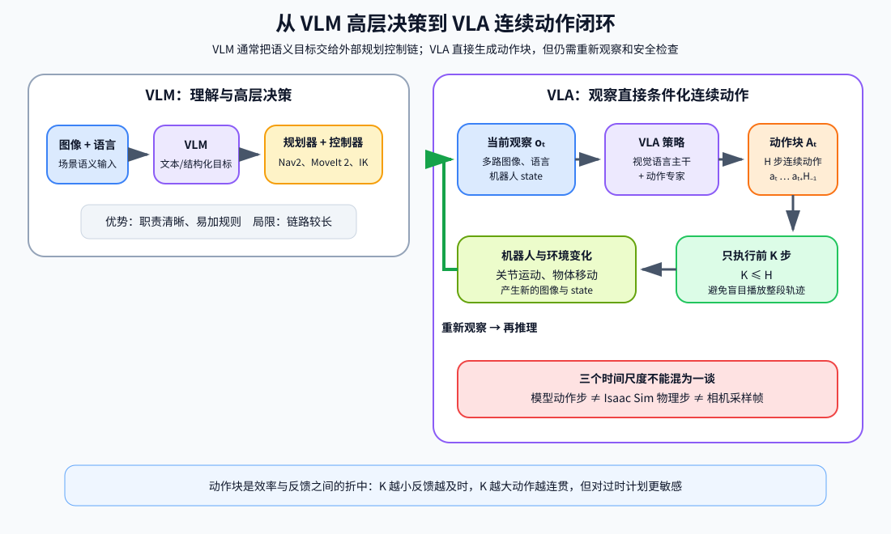
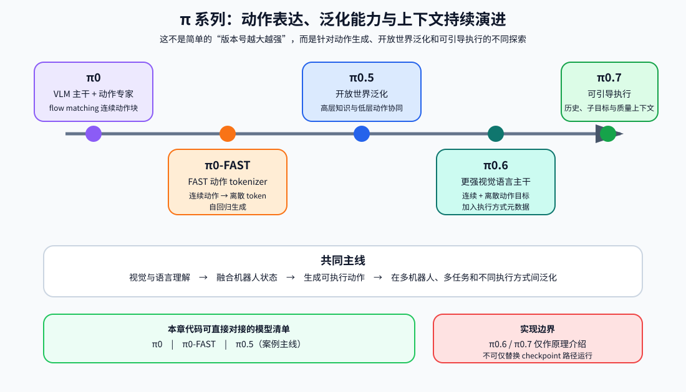
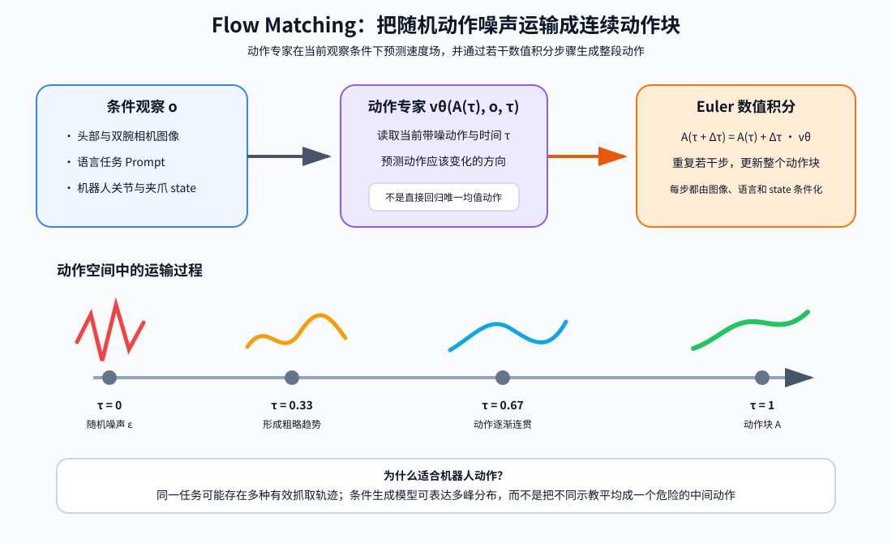
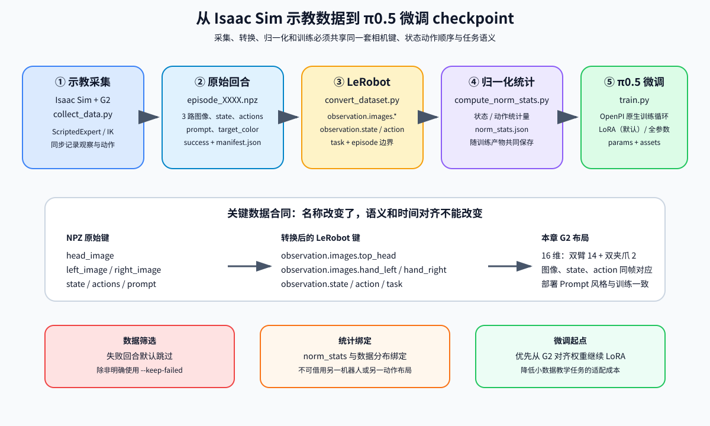
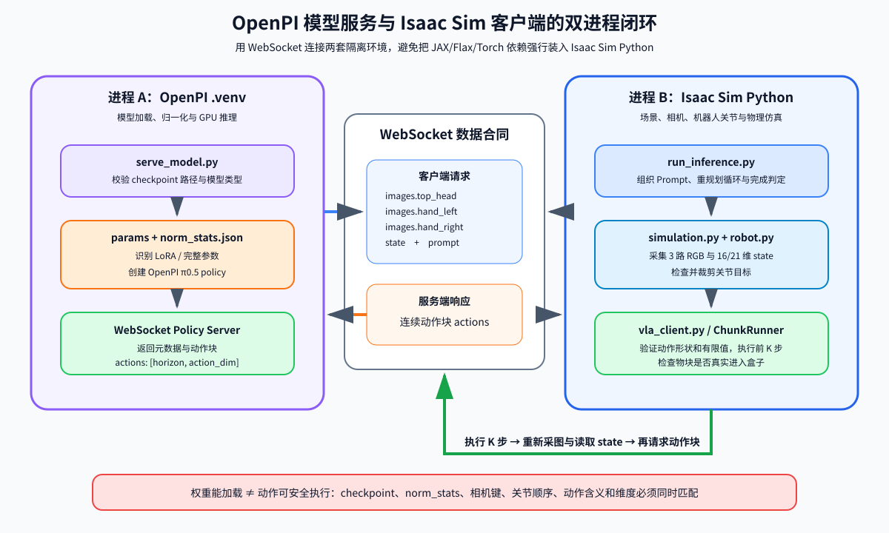

# 第十四章 视觉语言动作模型部署

第十三章中的 VLM 负责理解图像和语言，再把语义目标交给 Nav2、运动规划器或确定性控制器。本章进一步讨论 VLA（Vision-Language-Action，视觉—语言—动作模型）：模型不再只回答“看到了什么、应该做什么”，而是直接预测一段连续机器人动作。

本章以 Physical Intelligence 的 π 系列和本仓库内的 π0.5 教学实现为主线，在 Isaac Sim 中完成 G2 双臂机器人的“三色物块入盒”任务。对应代码位于 `code/code_chapter14`。教程先讲 VLA、π0 至 π0.7 和 π0/π0.5 的核心原理，再集中说明数据采集、LeRobot 数据格式、微调流程、代码结构、依赖安装、权重下载和案例运行。

需要先明确三个边界：

1. **研究模型不等于开源仓库支持范围。** 当前本章内嵌 OpenPI 直接支持 π0、π0-FAST 和 π0.5，其中 π0.5 的训练与推理使用 flow matching 动作头；π0.6 和 π0.7 在本章只用于理解技术演进，不能直接替换成本章案例模型。
2. **现成 checkpoint 不保证适配任意机器人。** 相机名称、状态维度、关节顺序、动作含义和归一化统计必须同时匹配。权重能够加载，不代表动作能够安全执行。
3. **当前仓库没有预置完整权重和共享 USD 资源目录。** `code/code_chapter14/checkpoints` 需要运行下载脚本后才会出现；代码还约定从 `code/assets` 读取 G2 与房间 USD，但当前工作区快照没有该目录。实际运行前应从完整项目资源包恢复共享资源，或同步修改 `config.py` 中的资源路径。模型服务器、Isaac Sim 客户端和训练环境也必须按本章方法分开配置。

---

## 第一部分 从视觉语言理解到连续机器人动作

### 1.1 VLA 学习的是什么

一个机器人控制时刻可以写成：

$$
o_t=(I_t^1,I_t^2,\ldots,I_t^N,\ell,q_t)
$$

其中：

- $I_t^1,\ldots,I_t^N$ 是头部、腕部或环境相机图像；
- $\ell$ 是语言任务，例如“拿起红色物块并放进空盒”；
- $q_t$ 是机器人本体状态，例如关节位置、夹爪开合量和腰部关节；
- $o_t$ 是模型在时刻 $t$ 能观察到的全部条件。

VLA 策略学习从观察到动作的条件分布：

$$
\pi_\theta(a_t\mid o_t)
$$

如果一次预测未来 $H$ 步，则输出动作块：

$$
A_t=(a_t,a_{t+1},\ldots,a_{t+H-1})
$$

与只输出文字的 VLM 相比，VLA 多了三个困难：

- **动作是连续且精确的。** 文字里“向左一点”可以模糊，机械臂关节目标却必须有明确数值和单位。
- **错误会改变下一帧输入。** 一次抓偏会让物体位置、相机画面和关节状态全部改变，之后的预测不能继续假设先前动作成功。
- **数据依赖机器人实体。** 同一句“张开夹爪”，在不同机械臂上的关节数量、符号、量程和控制频率都可能不同。

因此，VLA 不是把语言模型最后一层简单改成关节数，而是需要视觉语言表征、机器人状态适配、连续动作生成、时序训练和闭环执行共同组成一套系统。

### 1.2 行为克隆：从示教中学习动作

本章采用的基本训练范式是行为克隆。数据集由专家示教组成：

$$
\mathcal{D}=\{(o_t,a_t)\}
$$

模型尽量复现专家在相似观察下的动作。最简单的回归损失可以写成：

$$
\mathcal{L}_{\mathrm{BC}}
=\mathbb{E}_{(o_t,a_t)\sim\mathcal{D}}
\left[\lVert \hat a_t-a_t\rVert_2^2\right]
$$

这种写法便于理解，但真实机器人动作往往具有多解：从杯子左侧抓和从右侧抓都可能成功。若直接用均方误差平均两种策略，结果可能变成“两边都不像”的中间动作。因此 π0 使用 flow matching 表达条件动作分布，而不是只回归一个均值。

行为克隆还存在“分布偏移”：训练数据大多来自专家轨迹，部署时模型一旦偏离轨迹，就会看到训练集中较少出现的状态。缓解方法包括：

- 采集带位置、光照和初始姿态变化的数据；
- 保留一定数量的恢复动作与不完美轨迹，但必须正确标注其质量和结果；
- 每执行一小段动作重新观察和规划；
- 加入关节限位、碰撞检测和急停等独立安全约束；
- 在真实机器人上采用逐级放权，而不是首次运行就执行完整高速动作块。

### 1.3 动作块与闭环重规划

若模型每次只预测一步，高频推理会增加网络和 GPU 延迟；若一次预测很长的轨迹，后半段又容易因环境变化而失效。动作块是在两者之间折中：模型一次输出 $H$ 步，控制端执行其中 $K$ 步，然后重新采集观察。

$$
K\leq H
$$

这就是 receding horizon（滚动时域）思想。$K$ 越小，闭环反馈越及时，但推理频率和通信开销越大；$K$ 越大，动作更连贯，但更容易盲目执行过时计划。

本章代码中：

- `instruction_and_robust_pi05` 的动作块长度为 50；
- `manipulation_pi05` 的动作块长度为 30；
- `--execute-chunk 0` 表示执行完整动作块；
- 可以用 `--execute-chunk 10` 只执行前 10 步后重新观察。

每个模型动作在 Isaac Sim 中维持 4 个物理步。这里必须区分“模型动作步”“物理仿真步”和“相机采样帧”，不能把它们当成同一个频率。



<p align="center"><b>图 14-1</b> VLM 高层决策链与 VLA 动作块闭环的区别</p>

### 1.4 VLA 的能力边界

VLA 可以把感知和动作学习放进统一模型，但“端到端”并不表示系统可以取消工程约束。至少还应独立检查：

- 输入图像是否来自正确相机，色彩、尺寸和通道顺序是否一致；
- 状态和动作是否采用同一关节顺序、单位和坐标约定；
- 输出是否包含 NaN、无穷大、越界关节和突变；
- 夹爪正负号、开合范围和 mimic 关节是否正确；
- 任务是否真的完成，而不是模型或日志“自报成功”；
- 通信断开、推理超时和视觉遮挡时机器人是否进入安全状态。

本章仿真任务的完成判定来自动态物块是否真实进入盒子，而不是模型输出一段成功文本。物块具有质量、碰撞和摩擦，搬运过程中也不会通过 `set_world_pose()` 被代码强制吸附到夹爪上。

---

## 第二部分 π0 到 π0.7 的架构演进

### 2.1 π0：VLM 主干与动作专家

π0 的核心思想是把预训练视觉语言模型与一个专门生成连续动作的 action expert（动作专家）结合起来。其主要组成可以概括为：

```text
多路图像 ──> 视觉编码器 ─┐
语言指令 ──> 文本 token ─┼─> 预训练 VLM 主干 ─┐
机器人状态 ──────────────┘                   │ 条件信息
                                              ↓
随机动作噪声 ───────────────────────> action expert
                                              ↓
                                   flow matching 动作块
```

原始 π0 以 PaliGemma 作为 VLM 基础，视觉和语言部分继承了互联网规模预训练知识；机器人状态和带噪动作交给动作专家处理。动作专家约 3 亿参数，小于 VLM 主干，这样在多步去噪时不必反复运行同等规模的完整模型。

π0 的价值不只是模型结构，还包括训练配方：先用大规模、多机器人、多任务数据获得通用能力，再用更小但质量更高的数据做后训练，使动作更稳定、流畅并符合具体任务要求。多而杂的数据有利于覆盖变化和恢复状态，高质量数据有利于形成一致策略，两者不能简单互相替代。

### 2.2 π0-FAST：把连续动作变成 token

π0-FAST 走的是另一条路线：先用 FAST 动作分词器把连续动作序列压缩为离散 token，再像语言模型生成文字一样自回归生成动作 token，最后解码回连续动作。

两种路线的直观区别是：

| 路线 | 动作表示 | 优点 | 代价 |
|---|---|---|---|
| π0 flow matching | 连续动作分布 | 适合平滑、高频和多峰连续控制 | 推理要进行若干流积分步骤 |
| π0-FAST | 离散动作 token | 可复用成熟的自回归序列建模方法 | 依赖动作分词质量，量化会引入信息损失 |

它们不是简单的“新模型一定优于旧模型”。任务频率、机器人数据量、动作维度、实时性和语言服从能力都会影响选择。本章本地案例采用 π0.5 的 flow matching 动作头，不运行 π0-FAST。

### 2.3 π0.5：面向开放世界泛化

π0.5 在 π0 基础上更强调开放世界泛化：机器人要在未见过的家庭、物体摆放和长时任务中工作，而不是只在训练桌面复现固定动作。其关键变化包括：

1. **异构协同训练。** 同时使用多种机器人数据、高层子任务预测、语言指令、目标检测等多模态任务和网页视觉语言数据。
2. **高层与低层统一。** 高层推断“下一步做什么”，例如“拿起盘子”；低层动作专家再预测如何移动机械臂。
3. **知识隔离。** 让连续动作学习尽量不要破坏 VLM 已有的语义知识，同时又允许视觉语言知识为动作生成提供条件。
4. **更长任务。** 通过逐步预测子任务，把“整理厨房”分解成若干可执行技能，而不是一次生成一条极长的开环动作序列。

需要注意，研究论文中的 π0.5 高层—低层统一能力，不等于本章已经完整复现。当前内嵌 OpenPI 对 π0.5 直接支持的是 flow matching 动作头；本章的 `task_intent.py` 用确定性的 red → green → blue 顺序把长任务拆成三个清晰指令，它借鉴“高层动作意图”的思想，但不是论文中训练得到的高层推理器，也不是 ACoT-VLA。

### 2.4 π0.6 与 π0.7：更强主干和更丰富上下文

π0.6 延续 π0.5 的高层子任务与低层动作设计，将视觉语言主干升级到 Gemma 3 4B，动作专家约 8.6 亿参数，并结合连续 flow matching 与离散动作预测。它还允许把执行方式相关的元数据加入 Prompt，例如期望的速度或策略。这里的重点不只是“参数更多”，而是让模型同时利用更强视觉语言主干、动作数据和执行上下文。

π0.7 进一步强调 steerable（可引导）：Prompt 不再只有一句任务描述，还可以包含：

- 更详细的语言步骤；
- 子目标图像；
- 历史视觉帧；
- 回合质量、速度、错误等元数据；
- 来自不同机器人实体和不同质量等级的数据。

这种设计试图回答“做什么”以外的“以什么方式做”。它也说明 VLA 的发展并不是一直扩大动作头，而是在数据组织、上下文表达、跨机器人迁移和训练目标上共同演进。

截至本章代码快照，`code/code_chapter14/openpi` 的模型清单只直接列出 π0、π0-FAST 和 π0.5。π0.6/π0.7 的输入协议、模型规模和 checkpoint 与本章 G2 适配层都不同，因此不能把权重目录名称换一下就运行。



<p align="center"><b>图 14-2</b> π0 到 π0.7 在动作表达、泛化与上下文方面的演进及本章实现边界</p>

---

## 第三部分 π0 与 π0.5 的连续动作生成原理

### 3.1 从随机噪声到动作轨迹

设真实动作块为 $A$，随机高斯噪声为：

$$
\epsilon\sim\mathcal{N}(0,I)
$$

π0 使用一条从噪声到真实动作的线性概率路径：

$$
A^\tau=\tau A+(1-\tau)\epsilon,\qquad \tau\in[0,1]
$$

当 $\tau=0$ 时，$A^0$ 接近随机噪声；当 $\tau=1$ 时，$A^1$ 就是真实动作。模型学习向量场 $v_\theta$，预测在当前观察 $o$ 的条件下，动作应该朝哪个方向变化：

$$
\mathcal{L}_{\mathrm{flow}}
=\mathbb{E}\left[
\left\|v_\theta(A^\tau,o,\tau)-(A-\epsilon)\right\|_2^2
\right]
$$

训练时可以直接构造任意 $\tau$ 对应的带噪动作和目标方向。推理时从随机动作噪声开始，用若干积分步骤沿模型给出的方向前进，例如前向 Euler 更新：

$$
A^{\tau+\Delta\tau}
=A^\tau+\Delta\tau\,v_\theta(A^\tau,o,\tau)
$$

最终得到与当前图像、语言和机器人状态相匹配的动作块。与逐点均方误差相比，这种方法更适合表示“多种抓法都可能成立”的动作分布。



<p align="center"><b>图 14-3</b> 动作专家通过条件速度场和数值积分将随机噪声运输成连续动作块</p>

### 3.2 观察前缀与动作后缀

π0 可以从 Transformer 的角度理解成两个相互交互的专家：

- **VLM 前缀**处理图像和语言，提取“目标是什么、物体在哪里、场景是什么”的条件表示；
- **动作后缀**处理机器人状态、带噪动作和流时间 $\tau$，输出动作向量场。

图像与语言在一次动作块生成期间保持不变，因此推理实现可以缓存观察前缀的注意力键和值；每次流积分主要更新动作后缀。这也是单独使用较小动作专家的计算意义。

本章 π0.5 配置中的主要结构参数为：

```text
VLM variant:          gemma_2b
Action expert:        gemma_300m
Model action_dim:     32
Instruction horizon:  50
Manipulation horizon: 30
```

LoRA 微调时对应切换为 `gemma_2b_lora` 和 `gemma_300m_lora`。这里的 32 是 OpenPI 模型内部统一动作维度，不代表 G2 实际有 32 个受控关节；本章适配层会把 G2 的 16 或 21 维数据补零到 32 维，并在输出时裁剪回来。

### 3.3 绝对动作、增量动作与关节顺序

动作数值本身没有脱离数据约定的意义。常见表示包括：

- 绝对关节目标：$a_t=q_{t+1}^{\mathrm{target}}$；
- 增量关节动作：$a_t=q_{t+1}^{\mathrm{target}}-q_t$；
- 末端位姿增量：位置和旋转变化，再由控制器或 IK 转成关节动作；
- 力、速度或混合控制量。

本章原始数据保存的是 **16 维绝对关节目标**：

```text
左臂7 + 右臂7 + 左夹爪1 + 右夹爪1
```

但 OpenPI 的 `G2DataConfig` 在模型训练前执行约定转换：前 14 个机械臂关节改成 delta，最后两个夹爪保持 absolute；模型输出后再恢复为执行端需要的绝对动作。对于 21 维 manipulation 布局，额外包含腰部 5 维。

这说明“数据文件里是绝对动作”和“模型内部训练使用部分增量动作”可以同时成立。若跳过适配层或重复做一次 delta 转换，动作就会严重错误。

### 3.4 归一化为何必须与 checkpoint 配套

不同关节的数值范围差异很大。若直接训练，变化较大的维度会主导损失。OpenPI 统计每个状态和动作维度的均值、标准差以及 1%/99% 分位数，并写入 `norm_stats.json`。策略创建时先归一化输入，模型输出后再反归一化。

概念上，标准化可以写成：

$$
\tilde x=\frac{x-\mu}{\sigma+\varepsilon}
$$

分位数归一化则利用 $q_{0.01}$ 和 $q_{0.99}$ 降低少量极端值的影响。无论使用哪一种，统计量都隐含了：

- 机器人实体；
- 关节顺序；
- 状态和动作维度；
- 数据采集范围；
- absolute/delta 约定。

因此不能把 A checkpoint 的参数与 B 数据集的 `norm_stats.json` 随意组合。`serve_model.py` 会在 checkpoint 的 `assets` 下查找唯一一份统计文件，避免静默使用错误统计量。

### 3.5 闭环执行不是简单播放动作

本章推理链路为：

```text
三路 RGB 图像 + G2 状态 + Prompt
                ↓ WebSocket
         π0.5 policy server
                ↓
       action chunk: [H, D]
                ↓
  形状/有限值检查、裁剪、夹爪转换
                ↓
        Isaac Sim 执行 K 步
                ↓
  重新采图、读状态、判断物块是否入盒
```

模型返回的是一段候选动作，不是已经验证的轨迹。客户端仍会检查二维形状、动作维度和有限值；`robot.py` 再进行关节限位裁剪。夹爪模型空间中打开约为 `-0.785`，闭合约为 `0.0`，转换到 OmniPicker 物理 outer joint 时会取反；inner joint 是 PhysX mimic 关节，不独立下发目标。

---

## 第四部分 数据采集、LeRobot 格式与微调

### 4.1 示教数据如何采集

VLA 数据最重要的不是“文件很多”，而是每一帧的观察、状态、动作和任务语义时间对齐。本章使用脚本专家生成可重复的仿真示教：

1. G2 先回到公开数据使用的 home 姿态；
2. 红、绿、蓝按回合编号轮换；
3. 左臂保持不动，右臂用数值 IK 依次到达预抓取、抓取、抬起、盒子上方和放置位姿；
4. 夹爪真实闭合，依靠碰撞、摩擦和关节驱动夹住物块；
5. 以 10 Hz 记录三路图像、当前 16 维状态和本步实际下发的 16 维绝对目标；
6. 根据物块是否进入盒子记录 `success`。

脚本专家的意义是建立一个可控的教学数据源，不代表 VLA 部署时仍通过 IK 规划动作。采集用 `expert.py`，VLA 推理用 `run_inference.py`，两条路径是分开的。

每个回合只示教一种颜色：

```text
Pick up the red block and place it into the empty box.
```

这样少量数据更容易学到单一技能。部署时再由 `TaskIntent` 把三色长任务拆成三次单物块任务，比用几十个回合直接学习超长任务更稳定。

### 4.2 原始 NPZ 回合格式

`dataset.py` 将每个回合保存为 `episode_XXXX.npz`。主要字段为：

| 字段 | 含义 | 典型形状或类型 |
|---|---|---|
| `head_image` | 头部 RGB 图像序列 | `[T,H,W,3]`, `uint8` |
| `left_image` | 左腕 RGB 图像序列 | `[T,H,W,3]`, `uint8` |
| `right_image` | 右腕 RGB 图像序列 | `[T,H,W,3]`, `uint8` |
| `state` | 当前 G2 状态 | `[T,16]`, `float32` |
| `actions` | 本帧对应的绝对动作目标 | `[T,16]`, `float32` |
| `prompt` | 本回合语言指令 | 字符串 |
| `target_color` | 目标颜色 | 字符串 |
| `success` | 物块是否真实进入盒子 | 布尔值 |

目录中还会生成 `manifest.json`，记录每个回合的文件名、帧数、颜色、成功标志和 Prompt。转换脚本默认跳过失败回合；若研究失败恢复，可以显式保留失败回合，但必须重新设计标签和训练目的，不能把失败动作当作成功专家动作直接监督。

### 4.3 转换成 LeRobot 数据集

OpenPI 使用 LeRobot 数据接口。本章的 `convert_dataset.py` 将 NPZ 转换为以下键：

```text
observation.images.top_head
observation.images.hand_left
observation.images.hand_right
observation.state
action
task
```

其中 `task` 保存语言指令。训练配置设置 `prompt_from_task=True`，加载时会把它变成策略所需的 Prompt。

16 维名称与顺序固定为：

```text
left_arm_1 ... left_arm_7,
right_arm_1 ... right_arm_7,
left_gripper, right_gripper
```

转换后的数据位于：

```text
code/code_chapter14/data/lerobot/chapter14/g2_color_blocks
```

LeRobot 会组织元数据、帧索引和视频文件，便于按回合读取。更换相机名、状态名或关节顺序时，必须同步修改转换器、`G2DataConfig`、运行时输入和统计文件，不能只改数据表头。

### 4.4 数据质量与随机化

建议先采集固定位置数据，确认抓取、放置和时间对齐都正确，再逐渐增加 `--position-noise 0.01` 或 `0.02`。随机化太早可能让 IK 失败、抓取碰撞和视觉遮挡混在一起，难以判断模型问题还是数据源问题。

高质量数据至少应检查：

- 相机没有黑帧、冻结帧或 RGBA/RGB 混用；
- 图像、state 和 action 的帧数完全一致；
- 夹爪闭合发生在到达抓取位之后；
- 关节目标没有持续越界或突跳；
- 成功回合确实完成任务，失败回合没有误标；
- 数据包含部署时会遇到的物体位置和视角变化；
- Prompt 语言风格与部署指令一致。

“增加数据量”不能替代这些检查。大量错误时间对齐数据会让模型稳定地学到错误因果关系。

### 4.5 LoRA 与全参数微调

全参数微调会更新 VLM 主干和动作专家中的大量参数，适应能力强，但显存和优化器状态开销很大，也更容易破坏预训练语义能力。LoRA 将权重更新近似为低秩矩阵：

$$
W'=W+BA
$$

其中秩 $r$ 远小于原矩阵维度，只训练 $A$ 和 $B$ 等少量参数。它的优点是显存需求更低、checkpoint 更小、适合教学和小数据；代价是容量有限，遇到机器人实体差异很大或任务分布变化很大时，未必足够。

本章推荐从已经做过 G2 对齐的 `instruction_and_robust_pi05` 继续 LoRA 微调，而不是直接从通用 `pi05_base` 开始。原因是前者已经学习了 G2 相机、关节和动作布局，本章数据只需进一步适配三色物块入盒任务。

内嵌 OpenPI 给出的单卡资源估计为：推理大于 8 GB、LoRA 微调大于 22.5 GB、全参数微调大于 70 GB；实际占用还会受 batch size、图像、JAX 预分配和驱动版本影响。本章默认采用单卡 LoRA。当前本地交接记录中的双卡 JAX/XLA 路径曾出现 CUDA 非法内存访问，因此不能把 `--fsdp-devices 2` 当作已经验证的默认方案。



<p align="center"><b>图 14-4</b> NPZ 回合、LeRobot 数据、归一化统计与微调 checkpoint 之间的对应关系</p>

---

## 第五部分 `code_chapter14` 代码结构与数据接口

### 5.1 文件组织

本章正式代码的结构如下。这里不包含测试目录和测试脚本。

```text
code/code_chapter14/
├── config.py                 # 路径、场景、关节、checkpoint 和训练配置常量
├── simulation.py             # Isaac Sim 场景、桌面、物块、盒子和相机
├── robot.py                  # G2 状态读取、动作下发、夹爪转换和相机封装
├── kinematics.py             # 采集示教所用右臂 FK/IK
├── expert.py                 # 单物块入盒脚本专家
├── dataset.py                # NPZ 回合记录器和 manifest
├── collect_data.py           # 启动仿真并批量采集示教
├── convert_dataset.py        # NPZ 转 LeRobot
├── compute_norm_stats.py     # 计算状态/动作归一化统计
├── g2_policy.py              # G2 与 OpenPI π0.5 的输入输出适配
├── openpi_runtime.py         # 固定本章 OpenPI、数据和 norm_stats 路径
├── train.py                  # 构造配置并调用 OpenPI 原生训练循环
├── serve_model.py            # 启动 instruction/manipulation/微调模型服务
├── vla_client.py             # WebSocket 客户端与动作块执行器
├── task_intent.py            # 把三色长任务拆成单色动作意图
├── run_inference.py          # Isaac Sim 视觉闭环推理入口
├── download_checkpoint.sh    # 从 ModelScope 下载 G2 π0.5 权重
├── README.md                 # 代码快速使用说明
└── openpi/                   # 本章内嵌的 OpenPI 源码和虚拟环境位置
```

`config.py` 把 OpenPI、权重、数据和训练产物都限制在本章目录，避免静默加载系统里另一套 OpenPI。机器人和房间 USD 则约定复用 `code/assets` 中的公共资源；当前工作区缺少该目录，因此这是运行前必须补齐的外部项目资源，而不是已经通过存在性检查的本章文件。

### 5.2 仿真与机器人层

`simulation.py` 创建 G2、房间、桌面、三个动态物块和空盒，并初始化：

```text
head_front_Camera
Left_Camera
Right_Camera
```

默认物理频率为 120 Hz，相机图像为 320×240 RGB。代码要求 NVIDIA 渲染 GPU，因为 Isaac Sim 的机载相机不是普通无图形依赖的数组生成器。

`robot.py` 定义两种状态布局：

- 16 维：双臂 14 + 双夹爪 2；
- 21 维：16 维基础上增加腰部 5。

动作执行前会检查长度和有限值，机械臂关节按上下限裁剪。默认只执行前 16 维；只有 `manipulation` 模型并显式添加 `--control-waist` 时，才执行腰部输出。

### 5.3 数据与训练适配层

`collect_data.py` 属于 Isaac Sim 环境，负责产生 NPZ；`convert_dataset.py`、`compute_norm_stats.py` 和 `train.py` 属于 OpenPI 环境，分别负责数据标准化、统计和训练。

`g2_policy.py` 是最关键的适配文件：

1. 将 LeRobot 的三个图像键重组为 OpenPI 图像字典；
2. 把 16/21 维状态和动作补齐到模型内部 32 维；
3. 将前 14 个手臂关节转换为 delta，夹爪保持 absolute；
4. 为不同 checkpoint 设置 horizon、token 长度和输入输出维度；
5. 推理输出只保留 G2 真正需要的维度。

模型规格为：

| 模型类型 | 输入/输出有效维度 | 动作块 | 最大 token 长度 | 用途 |
|---|---:|---:|---:|---|
| `instruction` | 16 | 50 | 200 | 颜色、形状和指令理解 baseline |
| `manipulation` | 21 | 30 | 220 | 包含腰部布局，更接近入盒任务 |
| `finetuned` | 16 | 50 | 200 | 本章数据微调结果 |

`manipulation` checkpoint 的 21 维顺序为双臂 14、双夹爪 2、腰部 5。若不加 `--control-waist`，客户端仍向模型提供 21 维状态，但执行端只采用前 16 维。

### 5.4 模型服务与 Isaac 客户端

OpenPI 的 JAX、Flax、Torch 和 Transformers 依赖不适合强行装进 Isaac Sim 自带 Python，因此本章采用两个进程：

```text
OpenPI .venv                         Isaac Sim Python
serve_model.py  <---- WebSocket ---> run_inference.py
GPU 模型推理                         场景、相机、关节和物理
```

`serve_model.py`：

- 只允许读取 `code_chapter14/checkpoints` 内的权重；
- 加载配套 `norm_stats.json`；
- 自动检测 Orbax checkpoint 是否包含 LoRA 层；
- 通过 WebSocket 暴露策略和元数据。

`vla_client.py` 发送的数据合同为：

```text
images.top_head
images.hand_left
images.hand_right
state
prompt
```

服务返回：

```text
actions: [action_horizon, action_dim]
```

客户端检查动作形状和数值，再由 `ChunkRunner` 执行。`run_inference.py` 每次执行后读取仿真任务状态；当目标颜色物块真实进入盒子时才结束。



<p align="center"><b>图 14-5</b> 模型服务、WebSocket 数据合同与 Isaac Sim 动作执行闭环</p>

### 5.5 三种模型入口不能混用

`serve_model.py` 显式区分：

- `--model instruction`：读取 `checkpoints/instruction_and_robust_pi05`；
- `--model manipulation`：读取 `checkpoints/manipulation_pi05`；
- `--model finetuned --checkpoint .../<step>`：读取本章训练结果。

三者的 horizon、维度、token 长度和统计文件可能不同。不要把某个 checkpoint 路径传给不匹配的 `--model` 类型，也不要手工复制另一模型的 `norm_stats.json` 来绕过错误。

---

## 第六部分 安装、下载、训练与案例运行

### 6.1 硬件、系统与环境分层

建议环境：

- Ubuntu 22.04；
- 可运行项目 USD 资源的 Isaac Sim；
- NVIDIA 驱动和 CUDA 12 兼容 GPU；
- Python 3.11 或更高版本用于本章 OpenPI 环境；
- 推理建议至少 8 GB 显存，LoRA 训练建议至少约 24 GB；
- 足够磁盘空间保存模型、LeRobot 视频数据和 Orbax checkpoint。

进入代码目录：

```bash
cd /home/robot/g2_robot/code/code_chapter14
```

路径 `/home/robot/g2_robot` 是示例。如果仓库位于其他位置，只替换仓库根目录，后续命令应始终在 `code/code_chapter14` 中执行。

本章使用两套 Python：

| 环境 | 负责内容 | 主要包 |
|---|---|---|
| `openpi/.venv` | 模型、数据转换、统计和训练 | JAX、Flax、OpenPI、LeRobot、Orbax、Torch、Transformers |
| Isaac Sim Python | 仿真、三路相机和关节执行 | Isaac Sim API、NumPy、msgpack、websockets |

不要直接用系统 `pip install openpi` 替代本章内嵌源码。`openpi_runtime.py` 会拒绝已经导入的外部同名包。

### 6.2 安装 OpenPI 依赖

先安装 `uv`，例如使用官方安装器：

```bash
curl -LsSf https://astral.sh/uv/install.sh | sh
source "$HOME/.local/bin/env"
uv --version
```

然后创建本章 OpenPI 环境：

```bash
cd /home/robot/g2_robot/code/code_chapter14/openpi
GIT_LFS_SKIP_SMUDGE=1 uv sync
GIT_LFS_SKIP_SMUDGE=1 uv pip install -e .
cd ..
```

`GIT_LFS_SKIP_SMUDGE=1` 用于避免 LeRobot 依赖安装阶段意外拉取不需要的大文件。本地 `pyproject.toml` 固定了关键版本，包括：

```text
jax[cuda12] == 0.5.3
flax == 0.10.2
orbax-checkpoint == 0.11.13
torch == 2.7.1
transformers == 4.53.2
numpy >= 1.22.4, < 2.0.0
lerobot: 固定 Git commit
openpi-client: 本地 workspace 包
```

其余依赖还包括图像处理、数组类型、配置、日志和训练工具。应优先让 `uv sync` 按锁定关系安装，不要逐个升级包，否则 JAX、Flax、Orbax 和 Transformers 的兼容关系可能被破坏。

Isaac Sim 侧如缺少 WebSocket 依赖，可执行：

```bash
/home/robot/isaac-sim/python.sh -m pip install msgpack websockets
```

这两个包只负责客户端通信，不能让 Isaac Python 获得完整 OpenPI 训练能力。

### 6.3 下载 G2 π0.5 权重

下载脚本使用 ModelScope CLI，从 `agibot_world/GenieSim3.0-Dataset` 的 checkpoint 子目录复制权重。先将 ModelScope 安装到 OpenPI 环境：

```bash
cd /home/robot/g2_robot/code/code_chapter14
uv pip install --python openpi/.venv/bin/python modelscope
```

为了让 Bash 找到虚拟环境中的 `modelscope` 命令，可以临时加入 PATH：

```bash
export PATH="$PWD/openpi/.venv/bin:$PATH"
```

下载 instruction 权重：

```bash
bash download_checkpoint.sh instruction_and_robust_pi05
```

下载更接近本章入盒任务的 manipulation 权重：

```bash
bash download_checkpoint.sh manipulation_pi05
```

下载完成后应出现：

```text
checkpoints/instruction_and_robust_pi05/params
checkpoints/instruction_and_robust_pi05/assets/.../norm_stats.json
checkpoints/manipulation_pi05/params
checkpoints/manipulation_pi05/assets/.../norm_stats.json
```

脚本不会自动执行，也不会在模型启动时静默联网。这样可以明确知道当前使用的是哪份权重，并避免运行过程中突然下载大文件。

OpenPI 官方还提供 `pi05_base` 等基础权重，但本章 `download_checkpoint.sh` 下载的是针对公开 G2 数据布局准备的 baseline。若要从原始 `pi05_base` 微调，需要自行把完整 checkpoint 放入 `checkpoints/pi05_base`，并确保其中包含 `params` 和配套资产。

### 6.4 先运行现成模型

建议先运行 `manipulation` baseline，因为它的训练任务更接近 `place_block_into_box`。

终端 1 启动策略服务：

```bash
cd /home/robot/g2_robot/code/code_chapter14
CUDA_VISIBLE_DEVICES=0 openpi/.venv/bin/python serve_model.py \
  --model manipulation --port 8000
```

终端 2 用 Isaac Sim Python 启动单个红色物块任务。第一次建议不驱动机器人，只检查数据链路和动作输出：

```bash
cd /home/robot/g2_robot/code/code_chapter14
/home/robot/isaac-sim/python.sh run_inference.py \
  --host 127.0.0.1 --port 8000 \
  --target-color red --dry-run --debug-actions --max-replans 5
```

确认服务元数据、状态维度、动作形状和夹爪输出合理后，再去掉 `--dry-run`：

```bash
/home/robot/isaac-sim/python.sh run_inference.py \
  --host 127.0.0.1 --port 8000 \
  --target-color red --debug-actions
```

注意：如果你使用的是现成的manipulation_pi05，可能会出现他在很远的地方空抓的情况，其实在右机械臂的视角下，他认为他已经到达红色物体旁边了，可以参考下面的两幅图：


**如果想要解决这个问题，可以用下面的微调模型，项目中也提供了完整的数据采集，数据格式转换，以及微调部署的完整流程，大家可以自己试一下，微调时间非常短，大家可以尽情的调试。**

如果完整动作块过于开环，可以缩短每次执行长度：

```bash
/home/robot/isaac-sim/python.sh run_inference.py \
  --host 127.0.0.1 --port 8000 \
  --target-color red --execute-chunk 10
```

不传 `--target-color` 时，程序依次执行红、绿、蓝三个物块。`--single-prompt` 会一次给出完整三物块指令；默认模式使用 `TaskIntent` 每次只下发一个清晰子任务。

instruction 模型服务命令为：

```bash
CUDA_VISIBLE_DEVICES=0 openpi/.venv/bin/python serve_model.py \
  --model instruction --port 8000
```

现成模型即使输出数值正常，也可能因场景外观、相机位姿、物体尺度和动力学差异而失败。这不应被解释成“VLA 原理无效”，也不能被解释成“多运行几次就一定成功”；应通过数据合同检查和本场景微调来定位。

### 6.5 采集、转换和归一化

采集 60 个固定位置回合：

```bash
cd /home/robot/g2_robot/code/code_chapter14
/home/robot/isaac-sim/python.sh collect_data.py \
  --episodes 60 --headless
```

固定位置成功率稳定后，再加入少量水平随机化：

```bash
/home/robot/isaac-sim/python.sh collect_data.py \
  --episodes 60 --headless --position-noise 0.01
```

原始文件保存在：

```text
data/raw
```

转换为 LeRobot：

```bash
openpi/.venv/bin/python convert_dataset.py --overwrite
```

`--overwrite` 会重建转换后的 LeRobot 目录，不会删除原始 NPZ。默认只转换 `success=True` 的回合。

计算归一化统计：

```bash
openpi/.venv/bin/python compute_norm_stats.py
```

默认输出位置为：

```text
assets/pi05_g2_color_blocks/chapter14/g2_color_blocks/norm_stats.json
```

数据、统计和训练配置必须使用同一个 `REPO_ID=chapter14/g2_color_blocks`。若手工移动 LeRobot 目录，应同时正确设置 `HF_LEROBOT_HOME`，不要通过复制一个旧统计文件来跳过计算。

### 6.6 LoRA 微调和加载

推荐的单卡 LoRA 命令：

```bash
cd /home/robot/g2_robot/code/code_chapter14
CUDA_VISIBLE_DEVICES=0 XLA_PYTHON_CLIENT_MEM_FRACTION=0.90 \
openpi/.venv/bin/python train.py \
  --init instruction \
  --exp-name color_blocks_lora_v1 \
  --steps 10000 \
  --batch-size 2 \
  --fsdp-devices 1 \
  --lora
```

参数含义：

- `--init instruction`：从 G2 instruction checkpoint 初始化；
- `--exp-name`：决定训练输出目录名；
- `--steps`：优化步数，不等于数据回合数；
- `--batch-size`：每步训练批量，显存不足时首先减小；
- `--fsdp-devices 1`：当前默认单卡；
- `--lora`：冻结大部分基础参数，只训练低秩适配参数；
- `XLA_PYTHON_CLIENT_MEM_FRACTION=0.90`：允许 JAX 使用较高比例显存。

若同名实验已有有效 checkpoint 并希望继续：

```bash
CUDA_VISIBLE_DEVICES=0 XLA_PYTHON_CLIENT_MEM_FRACTION=0.90 \
openpi/.venv/bin/python train.py \
  --init instruction \
  --exp-name color_blocks_lora_v1 \
  --steps 15000 \
  --batch-size 2 \
  --fsdp-devices 1 \
  --lora --resume
```

`--resume` 和 `--overwrite` 不能同时使用。全参数微调可以不加 `--lora`，但会创建完整优化器和 EMA 状态，对显存要求显著更高，不建议作为本章首次运行方案。

训练 10000 步时，最后保存目录通常是 `9999`，因为步号从 0 开始。启动微调模型：

```bash
CUDA_VISIBLE_DEVICES=0 openpi/.venv/bin/python serve_model.py \
  --model finetuned \
  --checkpoint checkpoints/pi05_g2_color_blocks/color_blocks_lora_v1/9999 \
  --port 8000
```

服务端会从 Orbax 参数元数据判断是否为 LoRA 结构，一般不需要手动添加 `--lora`。然后在第二个终端运行与前面相同的 `run_inference.py`。

```bash
/home/robot/isaac-sim/python.sh run_inference.py \
  --host 127.0.0.1 --port 8000 \
  --target-color red --debug-actions
```

最终效果如下所示，大家运行的过程中可能会出现抓空的情况，是因为当前物块明显大于机械爪的抓取半径，所以会有一半是抓的斜边，并且训练数据中是固定位置，并不是随机位置的数据集采集，但是我也为大家提供了随机微动位置的数据采集方案，大家可以自己试试，微调时间非常短，大家可以尽情的调试，整体来说，相比没有微调的模型，微调过后的模型效果已经非常好了：


### 6.7 常见问题与定位顺序

**找不到 checkpoint。** 检查目标目录下是否真的有 `params`，而不是只有空目录或下载缓存；再检查 `assets` 下是否存在且仅存在一份 `norm_stats.json`。

**检测到外部 OpenPI。** 不要同时 `pip install` 另一套 `openpi`。退出已经导入外部包的 Python 进程，使用 `openpi/.venv/bin/python` 重新启动。

**WebSocket 无法连接。** 先确认服务端已经打印监听端口；检查 host、port 和防火墙；若客户端报缺少 `msgpack` 或 `websockets`，安装到 Isaac Sim Python，而不是只安装到 OpenPI 环境。

**动作维度错误。** instruction 应为 16 维，manipulation 应为 21 维；模型内部补到 32 维是适配层行为。不要让客户端直接执行补零后的 32 维数组。

**夹爪方向相反。** 模型空间打开约为 `-0.785`、闭合约为 `0.0`；`robot.py` 会取反映射到 outer joint。不要同时在数据转换和机器人执行端各取反一次。

**机器人快速跳动。** 依次检查 checkpoint 类型、关节顺序、absolute/delta 转换、`norm_stats.json`、相机键和状态维度。不要先用滤波器掩盖数据合同错误。

**显存不足。** 关闭其他 GPU 进程，减小 batch size，确认启用了 LoRA，并设置 `XLA_PYTHON_CLIENT_MEM_FRACTION=0.90`。多卡 FSDP 不是当前机器上已经稳定验证的默认解法。

**现成模型抓取失败。** 先用单色、`--dry-run --debug-actions` 和较小 `--execute-chunk` 检查；再确认相机中物块可见、桌面尺度与数据相近、夹爪输出确实发生开合。接口正确但任务分布不同，应采集本场景成功示教并微调。

### 6.8 本章总结与参考资料

本章从行为克隆、动作块和 flow matching 出发，解释了 π0 的 VLM 主干与动作专家、π0.5 的开放世界泛化和高低层协同，以及 π0.6/π0.7 在更强主干和丰富上下文方面的演进。工程上，最关键的不是只把模型“跑起来”，而是保持图像、状态、动作、关节顺序、delta/absolute 转换和归一化统计的一致，并通过服务端与 Isaac Sim 客户端隔离环境。

参考资料：

- π0 论文：`https://arxiv.org/abs/2410.24164`
- π0.5 论文：`https://arxiv.org/abs/2504.16054`
- OpenPI 官方仓库：`https://github.com/Physical-Intelligence/openpi`
- LeRobot 官方仓库：`https://github.com/huggingface/lerobot`
- 本章代码说明：`code/code_chapter14/README.md`
- 本章内嵌 OpenPI 说明：`code/code_chapter14/openpi/README.md`

---

> 本章的验证边界：教程中的文件结构、维度、关节顺序、数据键、命令和模型配置来自当前仓库代码；本文完成的是文档与代码接口层面的结构核对。Isaac Sim 视觉渲染、GPU 模型推理、长时间训练、仿真抓取成功率和真实机器人安全性仍需在目标 Ubuntu/GPU 环境中分别验证。仿真成功也不能直接证明真实 G2 可以无保护运行同一动作。


