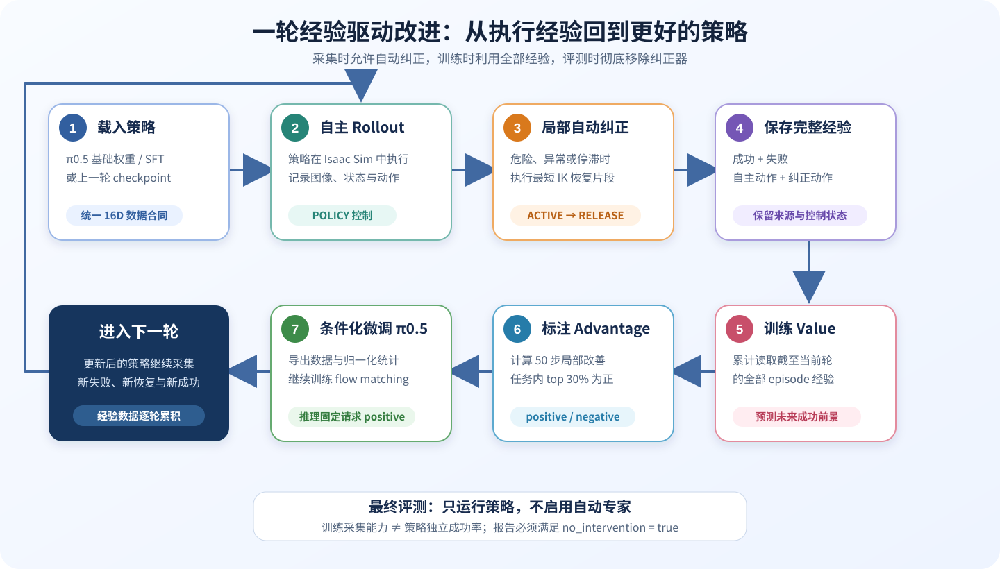
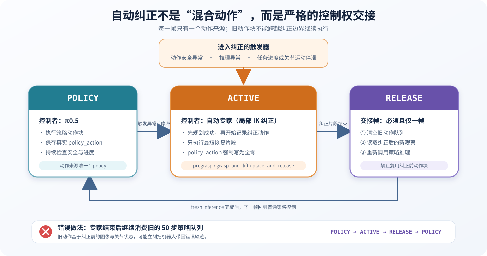
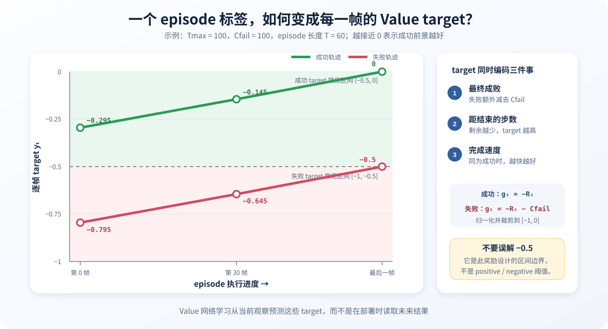
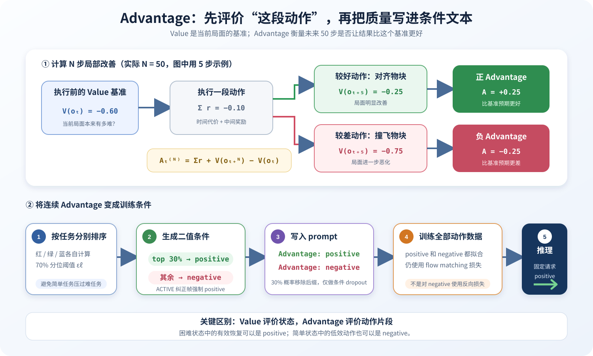

# 第十五章 经验驱动的 VLA 强化学习微调

第十四章完成了从视觉、语言和机器人状态到连续动作块的 π0.5 部署与微调。本章继续解决一个更接近真实机器人落地的问题：**模型已经会做任务，但做得不够稳定，怎样让它利用自己的执行经验继续进步？**

截止到教程当前发布时间，由于pi0.6没有发布权重，且初始RL预训练较困难，因此本章的经验学习主线基于 **Evo-RL**进行整理和复现。该项目给出了从策略 rollout、人类干预数据、Value 训练、Value 推理、优势条件策略训练到下一轮闭环采集的可运行流程。同时也做了一些改进，本章没有原样照搬其机器人平台和人工接管接口，而是结合 G2 Omnipicker、Isaac Sim 与第十四章的 π0.5/OpenPI 数据合同重新实现，并进一步加入自动触发、分段 IK 纠正、严格的三态控制权和单帧 `RELEASE` 交接。也就是说，Value、Advantage 条件训练与多轮经验聚合构成基础主线，自动纠正和仿真安全交接则是本章在此基础上的重点改进。

传统行为克隆主要学习成功示教，能够让机器人获得初始技能，却很难充分利用部署过程中产生的失败轨迹、恢复过程和速度差异。直接在大型 VLA 上应用 PPO 一类在线策略梯度算法又会遇到动作似然难算、真实采样昂贵、训练不稳定和安全风险高等问题。为此，本章实现了一套面向连续动作 VLA 的迭代改进流程：先让策略在 Isaac Sim 中自主执行任务，再用自动纠正模块处理危险动作与停滞状态；随后训练 Value 模型估计每一帧距离成功还有多远，计算动作优势并生成正、负条件标签，最后用条件化监督学习继续微调 π0.5。

对应代码位于 `code/code_chapter15`。案例仍使用 G2 Omnipicker 完成红、绿、蓝三色物块入盒任务，但学习重点已经从“如何让模型输出动作”转向“如何形成经验采集、价值评估、优势标注、策略更新与独立评测的闭环”。本章正文只讲算法和工程流程，所有可执行代码、脚本参数与命令集中放在后半部分，避免原理讲解与代码片段相互打断。

需要先明确四个边界：

1. **本章实现采用 π0.5，而不是直接部署 π0.6。** 标准 π0.6 升级了模型主干、动作专家、预训练数据和离散动作预测机制；在此基础上加入优势条件的经验学习版本通常记作 π0.6*。截至本章代码整理与验证时，没有公开可直接接入当前 OpenPI/G2 工程链路的 π0.6/π0.6* 训练实现和 checkpoint；当前内嵌 OpenPI 明确提供并支持的是 π0、π0-FAST 与 π0.5。因此，本章选择公开可获得、且已在第十四章完成适配的 π0.5 作为策略基座，在代码层实现经验学习闭环，而不是把论文中的 π0.6 名称当作一个可替换的权重目录。
2. **这里的“强化学习微调”不是在线 PPO。** 策略先采集经验，Value 再离线估计优势，最后通过优势条件化的监督目标更新策略。它利用奖励与失败经验改进策略，但不要求显式计算 flow matching 策略的精确对数概率。
3. **自动纠正只用于训练数据采集。** 最终评测禁止脚本专家、恢复动作和人工接管，否则测到的是“策略加纠正器”的系统成功率，而不是策略本身的能力。
4. **仿真纠正不等于真实机器人安全认证。** 真实设备还需要独立的碰撞检测、力矩限制、速度限制、急停和分级放权机制。

---

## 第一部分 从行为克隆到经验驱动改进

### 1.1 为什么只学习成功示教还不够

行为克隆把专家数据写成观察与动作对：

$$
\mathcal{D}_{\mathrm{demo}}=\{(o_t,a_t)\}
$$

并训练策略复现专家动作：

$$
\min_\theta
\mathbb{E}_{(o_t,a_t)\sim\mathcal{D}_{\mathrm{demo}}}
\left[\mathcal{L}_{\mathrm{VLA}}(\pi_\theta(o_t),a_t)\right]
$$

其中 $o_t$ 包含三路相机图像、任务语言和 16 维机器人状态，$a_t$ 是 16 维绝对关节与夹爪目标。对 π0.5 而言，$\mathcal{L}_{\mathrm{VLA}}$ 的主要连续动作部分仍是 flow matching 损失。

这种方法适合“教会机器人做什么”，但部署后常出现三类数据分布变化：

- 机械臂偏离示教轨迹后，看到了训练集里很少出现的恢复状态；
- 相机视角、物块位置和执行误差让同一任务产生不同难度；
- 一条轨迹虽然最终成功，但中间可能绕路、停滞或做出危险的大幅动作。

如果只保留成功轨迹，模型不知道哪些动作导致了失败；如果把自主采集的所有轨迹当作普通示教直接训练，又会把坏动作一并模仿。因此，本章不再只问“这个动作是否来自专家”，而是进一步估计：

> 在当前观察下执行这一步以后，任务成功的前景是变好还是变差？

这个问题由 Value 和 Advantage 两个量回答。

### 1.2 Value 与 Advantage 的直观含义

理解 Value 前，必须先区分三个容易混淆的量：

1. **奖励 $r_t$**：人为规定的计分规则，例如普通步骤为 $-1$、成功终止为 $0$、失败终止受到额外惩罚；
2. **回报 target $y_t$**：一个 episode 结束后，根据最终成败和剩余步数为该轨迹的第 $t$ 帧计算出的监督标签；
3. **Value 预测 $\hat V(o_t,\ell)$**：模型只看当前观察与任务，对未来平均回报作出的估计。

前两个量在一条已经完成的轨迹上可以按公式确定，第三个量却不是全数据共用的固定数字。Value 函数 $V(o_t,\ell)$ 表示：在任务 $\ell$ 下，从当前观察 $o_t$ 继续按照参考策略执行，未来预期能获得多大回报。本章把回报设计成“越快成功越好，失败受到额外惩罚”，所以 Value 被归一化到 $[-1,0]$：

- 越接近 $0$，表示越接近成功；
- 越接近 $-1$，表示距离成功较远，或者当前状态更可能通向失败；
- 若机械臂抓稳物块并向盒子移动，Value 应总体上升；
- 若物块掉落、动作停滞或轨迹偏离，Value 通常下降。

可以把 Value 想成老师在学生做题过程中给出的“当前局面预期分”。老师只看到目前写到哪一步，并不知道学生接下来一定会怎样操作。奖励与最终成败负责告诉老师过去的练习结果，Value 训练则让老师学会看到新局面时也能估计后续前景。

Advantage 比较“执行当前动作片段后的实际局部结果”与“执行前 Value 的预期”：

$$
A_t^{(N)}=
\sum_{k=0}^{N-1}r_{t+k}
+V(o_{t+N},\ell)-V(o_t,\ell)
$$

本章固定 $N=50$ 且 $\gamma=1$。较高的 Advantage 表示这一动作片段让任务进展好于当前 Value 的预期，较低的 Advantage 表示动作没有带来足够进展，甚至使任务变差。后文的 positive/negative 是相对任务内分位数得到的类别名，并不要求 Advantage 严格大于或小于 $0$。

需要注意，Advantage 不是“成功帧为正、失败帧为负”的简单标签。一条失败轨迹中也可能包含正确的接近、抓取和搬运动作；一条成功轨迹中也可能包含碰撞、绕路和停滞。Value 提供当前状态的基准，Advantage 才负责判断局部动作相对这个基准做得更好还是更差。

### 1.3 为什么使用优势条件化，而不是直接做 PPO

π0.5 的连续动作由 flow matching 动作专家生成。传统 PPO 通常需要计算新旧策略对同一动作的概率比，但 flow matching 策略并没有像普通高斯策略那样方便、稳定的显式动作似然。若为了策略梯度再额外估计似然、噪声轨迹或重要性权重，系统会变得复杂，而且真实机器人数据量通常远小于仿真游戏中的采样量。

本章采用更适合大型 VLA 的方式：把 Advantage 离散成一个条件变量 $I_t$，再让策略学习

$$
\pi_\theta(a_t\mid o_t,\ell,I_t)
$$

其中 $I_t=1$ 表示 positive，$I_t=0$ 表示 negative。训练时成功示教、自主动作、失败轨迹和纠正动作都可以保留，只是在任务文本后附加不同的优势条件。推理时固定请求 positive 条件，相当于告诉策略：“请从训练数据中选择更有利于完成任务的动作模式。”

这种做法有三个工程优势：

1. 不需要给 flow matching 动作计算精确的 PPO 概率比；
2. 不丢弃失败数据，而是把失败经验作为反例条件保留下来；
3. 策略更新仍沿用 π0.5 已有的数据管线和监督式训练基础设施。

因此，本章的本质是**由 Value 提供学习信号、由 Advantage 区分动作质量、由条件化行为克隆完成策略提取**。

---

## 第二部分 完整算法闭环与自动纠正

### 2.1 一轮迭代包含哪些阶段

本章的一轮改进按照下面的顺序进行：

完整的一轮包括七步：①载入初始 π0.5 或上一轮策略；②进行自主 rollout；③在异常或停滞时执行局部自动纠正，并从纠正后的观察重新推理；④保存成功、失败、自主动作和纠正动作；⑤使用累计经验训练 Value；⑥计算 50 步 Advantage，并按任务生成正、负标签；⑦导出 LeRobot 数据、计算归一化统计并微调 π0.5。完成后可进入下一轮采集，所有轮次结束后再进行无纠正评测。



<p align="center"><em>图 15-1　经验采集、价值评估、优势标注与策略更新构成逐轮累积的闭环</em></p>

初始策略有两条来源：一条是先用成功示教进行普通 SFT，再进入经验改进；另一条是从已经适配 G2 数据合同的 π0.5 checkpoint 直接开始。若使用通用基础权重，但没有匹配 G2 的相机键、16 维状态动作顺序和归一化统计，即使模型能加载，也不能认为它能够可靠控制当前机器人。

每一轮 Value 都读取当前轮及之前所有可用经验，而不是只训练最新 rollout。这样可以避免模型只记住最近一批状态，同时让示教、旧策略经验、新策略经验和纠正片段共同构成行为分布。下一轮策略则以前一轮 checkpoint 为初始化，从更新后的优势标签中继续学习。

### 2.2 三态控制权管理

自动纠正不能简单地把专家动作与策略动作混在一起，否则很难判断数据是谁产生的，也容易在专家结束后继续执行策略队列中的旧动作。本章为每一帧记录三种状态：

| 状态 | 含义 | 执行动作 | 数据要求 |
|---|---|---|---|
| `POLICY` | 策略正常控制 | π0.5 输出 | 保存实际策略动作 |
| `ACTIVE` | 自动专家正在纠正 | IK 与脚本轨迹 | `policy_action` 必须为全零 |
| `RELEASE` | 纠正结束后的交接帧 | 从纠正后的新观察重新推理 | 必须且只能持续一帧 |

状态转换严格遵循：

$$
\text{POLICY}\rightarrow\text{ACTIVE}\rightarrow
\text{RELEASE}\rightarrow\text{POLICY}
$$

`RELEASE` 是本章自动纠正设计中非常关键的一步。π0.5 一次会预测 50 步动作，并由客户端队列逐步执行。如果专家纠正完以后继续使用旧队列，旧动作仍然基于纠正前的图像与关节状态，可能立即把机器人带回错误轨迹。因此交接时必须清空动作队列，使用纠正后的三路图像与当前状态进行一次 fresh inference，记录一帧后再回到普通策略控制。



<p align="center"><em>图 15-2　三态状态机保证动作来源唯一，并用单帧 RELEASE 隔离纠正前后的动作队列</em></p>

### 2.3 自动纠正如何触发

原始的人机协同流程通常由人观察机器人、按键接管、遥操作纠正并在合适时机释放。本章把这些环节改写为仿真中可重复的自动机制，触发条件分为三类：

- **动作安全异常**：策略输出出现 NaN、Inf、形状错误，或机械臂单步关节跳变量过大；
- **推理异常**：模型服务超时、通信错误或没有返回可执行动作；
- **任务停滞**：一段时间内物块到盒子的平面距离没有明显下降，或右臂关节长期几乎不动。

任务进度与关节运动分别计时。这样可以识别“机械臂一直在动，但物块完全没有接近目标”的无效循环，也可以识别“策略卡死不动”的停滞。默认进度耐心为 80 个记录帧，运动耐心为 35 个记录帧；位置进步阈值和关节运动阈值分别独立设置。

自动触发并不表示专家立即播放完整抓取示教。系统先判断当前处于哪一阶段，再选择最短的恢复片段：

- `pregrasp`：末端离预抓取位置较远，只移动到安全预抓取位；
- `grasp_and_lift`：已经接近物块，完成下降、闭爪和抬升；
- `place_and_release`：物块已经被抓起，或已接近盒内，完成移动、放置和开爪。

这种分段设计保留了策略在纠正前后的自主行为，不会每次触发都让专家代替策略完成整个任务。对于 Value 来说，它也能看到“错误状态—恢复动作—恢复后的策略动作”这一完整因果链。

### 2.4 自动专家的可靠性设计

自动专家根据物块位置、夹爪闭合度、物块高度、末端是否接近预抓取点和物块是否进入盒子来选择片段。右臂目标点通过数值 IK 求解，并依次尝试当前关节、home 姿态、当前与 home 的中点以及关节范围中心等多个初值。

更重要的是，纠正片段会在真正进入 `ACTIVE` 动作记录前完成所需路径点规划。如果所有初值都不能得到满足误差阈值的 IK 解，本次纠正被安全中止，episode 作为失败经验保存，而不是伪造一段无效专家动作或错误的 `RELEASE` 帧。采集任务也不会因为单个 episode 的 IK 失败而丢失前面已经获得的数据。

自动成功判断同样由仿真几何条件完成：目标物块必须位于盒子内部，并在夹爪松开后仍保持在盒内。这样可以避免仅凭“末端到达盒子上方”就把尚未放稳的轨迹标成成功。

### 2.5 本章对经验采集流程的改进

本章不是把人工接管简单替换为一个完整脚本，而是加入了几项针对教学复现和批量采集的改进：

1. **自动触发而非等待人工按键。** 危险动作、推理错误、任务无进展和关节停滞都能进入统一恢复流程。
2. **局部纠正而非整段接管。** 专家根据任务状态选择最短恢复片段，尽快把控制权还给策略。
3. **交接时强制重新推理。** 清空旧动作块，只允许一帧 `RELEASE`，消除纠正前动作队列的污染。
4. **IK 先规划后执行。** 纠正失败不会产生半段专家轨迹，也不会破坏状态机语义。
5. **失败经验完整保留。** 自动纠正后仍可能失败，所有成功与失败 episode 都进入 Value 数据，而不是只保存漂亮结果。
6. **训练与评测彻底隔离。** 纠正器仅为采集提供恢复和探索能力，最终结果必须由无干预评测给出。

这些改进让整个训练过程可以在 Isaac Sim 中重复运行，也让每一帧的来源、动作和控制权都有明确含义。

---

## 第三部分 Value、Advantage 与策略更新

### 3.1 从成功标签构造逐帧 Value target

每个 episode 只需要一个最终成功或失败标签，就能构造逐帧监督目标。对应的稀疏奖励规则可以写成：

$$
r_t=
\begin{cases}
0, & t=T\text{ 且 episode 成功}\\
-C_{\mathrm{fail}}, & t=T\text{ 且 episode 失败}\\
-1, & \text{其他时刻}
\end{cases}
$$

这条规则表达了两个偏好：失败要受到明显惩罚；在都成功的情况下，使用更少步骤完成更好。设某个任务在累计数据中的最大 episode 长度为 $T_{\max}$，当前 episode 长度为 $T$，当前帧为 $t$，剩余步数为

$$
R_t=T-t-1
$$

失败惩罚设为

$$
C_{\mathrm{fail}}=T_{\max}
$$

把后续奖励累加起来，当前帧的未归一化回报为

$$
g_t=
\begin{cases}
-R_t, & \text{episode 成功}\\
-R_t-C_{\mathrm{fail}}, & \text{episode 失败}
\end{cases}
$$

最终 target 为

$$
y_t=\mathrm{clip}
\left(
\frac{g_t}{T_{\max}+C_{\mathrm{fail}}},-1,0
\right)
$$

这里固定的是**奖励规则和已完成轨迹的监督 target**，不是 Value 网络对所有状态输出同一个值。同一条轨迹中，$R_t$ 会随时间减少，因此每一帧的 target 也会变化。

例如取

$$
T_{\max}=100,\qquad C_{\mathrm{fail}}=100
$$

某条 episode 一共有 60 帧，则第 0 帧剩余 59 步，第 30 帧剩余 29 步。成功与失败轨迹的 target 如下：

| 当前位置 | 剩余步数 | 成功轨迹 $y_t$ | 失败轨迹 $y_t$ |
|---|---:|---:|---:|
| 第 0 帧 | 59 | $-59/200=-0.295$ | $-(59+100)/200=-0.795$ |
| 第 30 帧 | 29 | $-29/200=-0.145$ | $-(29+100)/200=-0.645$ |
| 最后一帧 | 0 | $0$ | $-100/200=-0.5$ |

当 $C_{\mathrm{fail}}=T_{\max}$ 时，成功 target 大体位于 $(-0.5,0]$，失败 target 位于 $[-1,-0.5]$。严格来说，失败 episode 的最后一帧恰好可能等于 $-0.5$，因此不能把“失败恒小于 $-0.5$”理解成严格不等式。

这一构造让 Value target 同时包含三层信息：

- 最终成功还是失败；
- 当前距离 episode 结束还有多少步；
- 同样成功时，哪条轨迹完成得更快。

按每个任务自己的最大长度归一化，可以降低不同任务时长差异对 Value 的影响。但 $-0.5$ 只是在当前奖励设计下形成的成功/失败区间边界，后面的 positive/negative 并不是用 $V>-0.5$ 直接划分，而是由 50 步 Advantage 的任务内排序得到。



<p align="center"><em>图 15-3　逐帧 target 同时编码最终成败、剩余步数与完成速度</em></p>

### 3.2 Value 到底训练什么，以及为什么使用分布式回归

一条 episode 结束后，程序已经知道它成功还是失败，也能直接计算这一条轨迹每一帧的 $y_t$。但真正部署时，机器人站在当前时刻并不知道未来：它不知道接下来会不会抓空、物块会不会掉落，也不知道当前姿态最终是否容易成功。因此还需要训练 Value 网络，把离线计算出的轨迹 target 变成可以从当前观察预测的函数：

$$
\hat V_\phi(o_t,\ell)
\approx
\mathbb E[G_t\mid o_t,\ell,\pi_{\mathrm{ref}}]
$$

Value 的输入只有当前三路图像、当前机器人状态和任务文本，不读取 episode 最终成败、未来动作、剩余长度或 episode 编号。它要学习的是：在当前状态下继续按照参考策略执行，平均来看能够获得多大回报。因而，训练数据中每一帧的 target 虽然已经确定，训练完成后的 Value 却仍是随观察变化的函数，而不是一个全局固定值。

在红色物块入盒任务中，一个合理的 Value 变化可能是：

| 当前观察 | 可能的 Value 预测 |
|---|---:|
| 夹爪离物块很远且方向错误 | $-0.72$ |
| 夹爪已经移动到物块上方 | $-0.38$ |
| 物块被稳定抓起 | $-0.20$ |
| 物块移动到盒子上方 | $-0.08$ |
| 物块已经放入盒内并释放 | 接近 $0$ |

无论是在大规模离线机器人数据上预训练 Value，还是在目标任务的新 rollout 上重新训练或微调 Value，它的核心作用都相同：把稀疏的 episode 成败信号转成可以作用于中间状态的进度估计。前者提供更通用的任务进度先验，后者让 Value 适应当前策略、当前机器人和新出现的失败模式。本章代码采用后一种工程路径：每一轮读取截至当前的累计经验，独立训练 Value，再固定该轮 Value 为所有帧生成预测与 Advantage 标签；下一轮获得新经验后重新训练，而不是永久使用同一个评价器。

本章 Value 不直接用一个标量做 MSE 回归，而是把 $[-1,0]$ 均匀划分为 201 个 bin。真实 target 通常落在相邻两个 bin 之间，因此使用 two-hot 权重把监督分配给左右两个 bin，再以交叉熵训练。推理时对 softmax 概率和 bin 中心求期望，得到连续 Value：

$$
\hat V(o_t,\ell)=
\sum_{b=1}^{201}p_\phi(b\mid o_t,\ell)c_b
$$

分布式表示能够保留一定的不确定性。例如相似的预抓取画面在数据中可能有时成功、有时失败，输出分布可以同时在多个 Value 区域保留概率，而不仅是强迫一个标量回归头立即给出唯一答案。最终用于 Advantage 的仍是这个分布的期望值。

当前 Value 模型使用三路图像和语言—状态提示：

- 视觉编码器为 SigLIP SO400M；
- 语言编码器为本地 Gemma 3 270M；
- 三路图像特征先分别编码，再进行相机维度平均；
- 视觉与语言特征投影到 512 维后拼接；
- 输出 201 维 Value logits。

16 维机器人状态先根据训练集的 1% 和 99% 分位数映射到 $[-1,1]$，再量化为 256 个离散区间，并补到 32 个状态 token。这样 Value 既能利用图像中的物块和夹爪关系，也能读取关节与夹爪数值。

### 3.3 稠密奖励与 50 步 Advantage

有了逐帧 target，可以通过相邻 target 的差构造稠密奖励。对于同一 episode 中连续的两帧：

$$
r_t=y_t-y_{t+1}
$$

最后一帧没有下一帧可用时，直接使用该帧 target 作为终止奖励。随后先把未来 $N$ 步的奖励和尾部 Value 合在一起，得到动作片段后的局部结果估计：

$$
\hat Q_t^{(N)}=
\sum_{k=0}^{N-1}r_{t+k}
+\mathbf 1_{t+N\ \mathrm{存在}}\hat V(o_{t+N},\ell)
$$

再减去动作执行前的预期 Value：

$$
A_t^{(N)}=\hat Q_t^{(N)}-\hat V(o_t,\ell)
$$

本章固定 $N=50$，所以实际计算为：

$$
A_t^{(50)}=
\sum_{k=0}^{49}r_{t+k}
+\mathbf{1}_{t+50\ \mathrm{存在}}\hat V(o_{t+50},\ell)
-\hat V(o_t,\ell)
$$

实现中只有在帧号严格连续、仍属于同一个 episode 且第 50 步确实存在时才进行 bootstrap，绝不会跨 episode 或跨缺失帧。若轨迹在 50 步内结束，尾部 Value 按 0 处理。

为了直观理解，先把 50 步缩短成 5 步进行手算。假设机器人准备抓取红色物块，当前 Value 为

$$
\hat V(o_t)=-0.60
$$

未来 5 步累计时间代价为 $-0.10$。

- **较好动作**：夹爪先移动到物块正上方并完成对齐，5 步后 Value 提升到 $-0.25$：

$$
A_t^{(5)}=-0.10+(-0.25)-(-0.60)=+0.25
$$

- **较差动作**：夹爪从侧面横向扫动并撞飞物块，5 步后 Value 降到 $-0.75$：

$$
A_t^{(5)}=-0.10+(-0.75)-(-0.60)=-0.25
$$

这个例子说明：Value 判断当前局面好不好，Advantage 判断刚才这一段动作有没有让局面变得比预期更好。实际代码仍使用 50 步，5 步只用于说明计算方向。

减去当前 Value 还有一个重要作用：让动作质量相对于状态难度进行比较。假设一个非常容易的状态原本为 $V=-0.05$，动作后局部结果为 $Q=-0.08$，虽然绝对分数仍高，但 $A=-0.03$，说明它低于这个简单状态本应达到的水平。另一个困难状态原本为 $V=-0.80$，恢复后达到 $Q=-0.55$，绝对分数仍不高，但 $A=+0.25$，说明这是一段有效恢复。没有 Value 基准时，困难状态中的好动作很容易被绝对回报掩盖。

这里还有一个必须理解的数学边界。由于

$$
\sum_{k=0}^{N-1}(y_{t+k}-y_{t+k+1})=y_t-y_{t+N}
$$

如果 Value 把每一条训练轨迹逐帧死记住，达到 $\hat V(o_t)=y_t$，那么

$$
A_t^{(N)}
=y_t-y_{t+N}+y_{t+N}-y_t
=0
$$

所有 Advantage 都会塌缩到 0 附近。因此 Value 的目标不是成为“按 episode 编号查询 target 的表”，而是学习当前观察下的条件期望。同一个或相似的预抓取状态，在数据中可能因为后续动作不同而成功、失败或被纠正；Value 应学习这些结果的平均基准，具体动作片段的实际结果才能相对基准形成正负 Advantage。

这也意味着 Value 过拟合是实际风险。数据太少、网络容量过大或训练过久时，即使 Value loss 很低，Advantage 也可能只剩数值噪声。训练后除了检查 loss，还应检查：Value 是否随真实任务进度总体上升，失败和掉落附近是否下降，自动纠正后是否回升，以及 Advantage 的均值、标准差和直方图是否已经集中到接近 0 的极窄范围。

### 3.4 从连续 Advantage 到正负条件

不同颜色任务分别计算自己的优势阈值。默认取每个 `task_index` 的 70% 分位点，使大约前 30% 的帧标为 positive：

$$
\epsilon_\ell=
Q_{0.70}\left(\{A_t\mid \text{task}=\ell\}\right)
$$

$$
I_t=\mathbf{1}\left[A_t\geq\epsilon_\ell\right]
$$

这里不能把 $-0.5$ 当作正负条件的分界线。$-0.5$ 来自 Value target 的成功/失败惩罚设计，而 positive/negative 评价的是**动作相对于当前状态预期的改善程度**。一个 Value 很高的简单状态也可能执行出负 Advantage 动作；一个 Value 很低的困难状态也可能通过恢复动作得到高 Advantage。

实际标注也不会简单使用 $A>0$ 判 positive、$A<0$ 判 negative，而是对同一任务的 Advantage 排序。这样即使某个任务整体较难、Advantage 普遍偏低，也能选出其中相对更好的动作；如果所有 Advantage 都非常接近 0，则应先排查 Value 是否过拟合，而不能因为分位数仍能机械地选出 top 30% 就认为标签一定有效。

按任务分别取阈值很重要，因为红、绿、蓝物块的初始位置、IK 难度和轨迹长度可能不同。如果把所有任务混在一起取一个全局阈值，较容易任务的普通动作可能压过较难任务中的优质动作。

所有 `ACTIVE` 纠正帧会强制标为 positive。这里的假设是自动专家提供的动作是当前状态下的可靠恢复动作，应该被策略作为可取行为学习。与此同时，纠正前导致停滞的自主动作仍按 Value 和 Advantage 正常得到 positive 或 negative 标签，并不会因为同一 episode 最终成功而全部变成正样本。

### 3.5 优势条件如何进入 π0.5

策略训练前，原始任务文本会附加精确的条件文本：

> 优势条件仅使用两个固定文本：`Advantage: positive` 与 `Advantage: negative`。

这段文本在 tokenization 之前写入 prompt。训练时以 0.3 的概率移除优势标签，仅保留原始任务文本。这个 dropout 不会删除样本，也不会把正标签翻成负标签；它让同一个模型同时学会有条件和无条件的动作分布，并减少模型对固定后缀的机械依赖。

策略训练仍使用全部动作数据与 π0.5 的 flow matching 目标。区别只是观察条件中增加了 $I_t$：

$$
\min_\theta
\mathbb{E}_{(o_t,a_t,I_t)\sim\mathcal D}
\left[
\mathcal L_{\mathrm{flow}}
\big(\pi_\theta(o_t,\ell,I_t),a_t\big)
\right]
$$

因此，第七步的“强化学习微调”在参数优化形式上与 SFT 很接近：两者使用相同的 π0.5、flow matching 损失、AdamW 和数据适配基础设施。强化学习信号主要发生在训练之前——成功、失败和完成速度先训练 Value，Value 再产生 Advantage 和二值条件，最后由监督式 flow matching 把条件行为写入策略。

两者的差异集中在数据语义：

| 对比项 | 成功示教 SFT | 优势条件策略更新 |
|---|---|---|
| 主要数据 | 经过筛选的成功示教 | 累计示教、成功/失败 rollout、自主动作与纠正动作 |
| 是否使用 Value | 否 | Value 已在训练前生成 Advantage 标签 |
| prompt | 原始任务文本 | 原始任务文本加 positive/negative，或因 dropout 暂时无条件 |
| 动作损失 | flow matching | flow matching |
| 常用初始化 | π0.5 基础权重 | SFT checkpoint 或上一轮策略 |
| 推理方式 | 普通任务文本 | 固定请求 positive 条件 |

negative 样本不是通过一个“反向损失”直接从模型中减掉。模型仍然在 negative 条件下拟合这些动作，只是把较好和较差行为放进不同条件分支。推理时始终使用 positive 条件，相当于要求模型从训练数据中选择高质量行为分支。本章服务端使用 10 个 flow sampling steps，不启用 classifier-free guidance，策略选择主要由训练时的任务内优势标签完成。



<p align="center"><em>图 15-4　Value 提供状态基准，Advantage 评价动作片段，条件文本将质量信息写入策略</em></p>

### 3.6 累计数据为何重要

第 $k$ 轮训练的数据集合可以写成：

$$
\mathcal D_k=
\mathcal D_{\mathrm{demo}}
\cup\mathcal D_{\mathrm{rollout}}^{(1)}
\cup\cdots\cup
\mathcal D_{\mathrm{rollout}}^{(k)}
$$

其中包含：

- 成功脚本示教；
- 当前策略和旧策略的自主动作；
- 自动纠正动作；
- 纠正后成功的 episode；
- 纠正后仍失败或因 IK、超时停止的 episode。

Value 在累计数据上重新训练，优势标签也根据更新后的 Value 重新计算。这样模型不仅学习“专家怎么做”，还会逐轮看到自己常见的失败模式以及如何恢复。与此同时，数据必须保留 `collector_policy_id`、`source`、episode 成功标记和控制状态，以便诊断某一轮是否被过多纠正帧或某一种失败模式主导。

---

## 第四部分 本章代码、π0.6 与新增机制的具体差异

### 4.1 为什么本章不直接使用 π0.6

需要先区分两个名称：**标准 π0.6** 是 π0.5 的模型架构与数据升级版本；**π0.6*** 则是在该模型上加入二值 Advantage 条件、分布式 Value 学习和多轮经验迭代的策略版本。本章要复现的是后者所展示的经验学习方法，但不能直接把 π0.6/π0.6* 当作现成基座使用。

当前OpenPI 的模型定义、训练配置和公开 checkpoint 表只直接支持 π0、π0-FAST 与 π0.5，没有可以直接接入本章 G2 链路的 π0.6/π0.6* 模型配置、训练实现和 checkpoint。更重要的是，π0.6 不只是“比 π0.5 多训练了几步”：它更换了 VLM 主干和动作专家，增加 FAST 离散动作与中间子任务预测，输入 token、参数树和训练目标都发生了变化。因此，即使得到一个名称为 π0.6 的权重目录，也不能通过修改 `--checkpoint` 路径让当前 `pi05_adapter.py` 正确加载。

本章选择 π0.5 有三个工程原因：第一，π0.5 的基础权重和 OpenPI 训练、推理代码可获得；第二，第十四章已经完成 G2 三相机、16 维状态动作和 WebSocket 服务适配；第三，使用可运行的基座后，可以把教学重点放在经验采集、Value、Advantage、条件策略训练和自动纠正，而不是把大量篇幅消耗在复现一个尚无公开工程入口的新模型上。

模型层面的差异如下：

| 对比项 | 标准 π0.6 / π0.6* | 本章自行实现的代码 |
|---|---|---|
| VLA 基座 | Gemma 3 4B VLM | π0.5，Gemma 2B VLM |
| 动作专家 | 约 860M 参数 | Gemma 300M 动作专家 |
| 连续动作 | flow matching | flow matching |
| 离散动作 | 同时预测 FAST 离散动作 token | 不训练 FAST 离散动作分支 |
| 高层推理 | 先预测中间子任务，再生成低层动作 | 直接使用给定任务文本生成动作 |
| 预训练数据 | 更大规模、多机器人、多模态混合 | 复用公开 π0.5 checkpoint，再用 G2 任务数据后训练 |
| 优势条件 | 标准 π0.6 不含；π0.6* 将二值条件放入动作生成上下文 | 在 tokenization 前把条件写成任务 prompt 后缀 |
| 动作平台 | 面向多种真实机器人 | G2 Omnipicker Isaac Sim 仿真 |
| 动作合同 | 随机器人平台定义 | 固定 16D 全绝对动作，模型内部补到 32D |

这意味着本章复现的是**经验驱动的训练闭环和优势条件策略提取方法**，不是 π0.6 全部预训练、架构与权重的同构复刻。

### 4.2 经验学习流程与策略更新的具体差异

两套方法都遵循“采集经验—训练 Value—估计 Advantage—条件化更新策略—再次采集”的主循环，但具体实现并不相同。下面的对比按照本章代码实际行为展开：

| 流程环节 | π0.6* 的论文实现 | 本章自行实现的代码 |
|---|---|---|
| 初始策略 | 经过大规模多机器人预训练的 π0.6 | OpenPI π0.5，经 G2 可选 SFT 后作为初始策略 |
| 在线数据 | 自主 rollout，并可由人类操作者在线纠正 | Isaac Sim 自主 rollout，由停滞与安全规则自动触发纠正 |
| 纠正动作 | 人类遥操作干预，主要处理明显错误与探索困难 | 分段脚本专家，根据当前状态选择预抓取、抓取抬升或放置释放 |
| 控制权记录 | 区分自主动作与干预动作 | 每帧保存 `POLICY / ACTIVE / RELEASE`，并强制单帧交接 |
| 奖励来源 | episode 成功/失败与完成时间 | episode 成功/失败与完成时间，归一化到 $[-1,0]$ |
| Value target | 剩余完成步数；失败叠加较大惩罚 | `value_targets()` 按任务最大长度计算同类 target |
| Value 模型 | 与 VLA 设计接近、使用较小 Gemma 3 多模态主干，并混入额外多模态数据 | 独立 PyTorch 模型，SigLIP SO400M + Gemma 3 270M + 201-bin 融合头，只读取本章累计机器人数据 |
| Advantage | 使用 Value 的多步估计产生二值最优性条件 | 固定 50-step；严格检查 episode 与 frame 连续性后 bootstrap |
| 正样本阈值 | 按任务设置阈值，不同任务可使用不同正样本比例 | 每个 `task_index` 取 70% 分位点，默认 top 30% 为 positive |
| 纠正标签 | 干预动作强制作为高优势样本 | 所有 `ACTIVE` 自动纠正帧强制 positive |
| 条件注入 | 在高层子任务之后、动作生成之前加入二值条件 | 在 tokenization 前追加 `Advantage: positive/negative` |
| 条件 dropout | 随机移除条件，以同时学习有条件与无条件策略 | `ACPTransform` 以 0.3 概率只移除后缀，不删除样本、不翻转标签 |
| 策略目标 | 优势条件化的 VLA 监督训练，可结合条件/无条件分支进行引导 | 保持 π0.5 flow matching 损失；推理只请求 positive 分支，CFG 关闭 |
| 数据聚合 | 新旧轮次经验持续加入训练集 | `raw_dirs(round_id)` 累计示教与截至当前轮的全部 rollout |
| 最终评测 | 无人工干预地评价更新后策略 | `evaluate.py` 完全不加载自动专家，异常与不安全动作直接判失败 |

从训练目标看，本章没有实现 PPO、REINFORCE 或显式 KL 正则化，也没有计算 flow matching 策略的精确动作对数概率。它先把连续 Advantage 压缩为可解释的二值条件，再继续使用 π0.5 原有的监督式 flow matching 目标。换句话说，Value 负责“评价哪些动作更值得模仿”，策略训练仍负责“在给定条件下生成这些动作”。这种拆分降低了训练复杂度，但其能力上限也受到 π0.5 基座、Value 精度和二值标签信息量的限制。

### 4.3 Value、数据合同与推理方式的差异

本章的 Value 与策略完全解耦。Value 不是从 π0.5 参数树中增加一个 head，而是由 `value_model.py` 独立构建：三路图像由 SigLIP 编码，任务和离散状态由 Gemma 3 270M 编码，视觉与语言投影后输出 201 个 Value bin。这样做便于在单独的 PyTorch 环境中训练和检查，但不会获得 π0.6* 中 Value 与通用 VLA 预训练数据、表征结构更接近所带来的潜在优势。

本章还采用 G2 专用的数据合同：

- 状态与动作都是 16 维；
- 顺序为左臂 7、右臂 7、左夹爪 1、右夹爪 1；
- 所有动作均为绝对目标；
- 归一化统计在原生 16 维上计算；
- 归一化之后才补零到模型的 32 维动作空间；
- 输出只截取前 16 维，不做额外 delta 恢复；
- 数据记录为 10 Hz，物理仿真为 120 Hz；
- 动作 horizon 为 50，服务端采用 10 个 flow sampling steps。

这与第十四章中“机械臂关节转 delta、夹爪保持 absolute”的适配方式不同。若把两个章节的动作变换混用，会造成重复差分、错误反归一化或大幅关节跳变。它也与 π0.6/π0.6* 的模型输入、离散动作分支和高层子任务上下文不同，不能互换 tokenizer、模型配置或 checkpoint。

### 4.4 本章新增的自动纠正闭环

论文流程中的在线纠正通常依赖人类操作者发现错误并遥操作恢复。本章将其改造成适合 Isaac Sim 批量采集的自动系统，这部分是当前代码相对于原始流程最主要的工程扩展：

- 双计时停滞检测，同时监控任务进展与关节运动；
- 对 NaN、Inf、动作维度和单步关节跳变进行自动安全检查；
- 根据“预抓取、抓取抬升、放置释放”选择最短局部纠正片段；
- 使用多个 IK 初值，并在进入 `ACTIVE` 前完成所需路径点规划；
- 用 `POLICY / ACTIVE / RELEASE` 明确记录每帧控制权；
- `RELEASE` 只持续一帧，清空旧动作队列并强制 fresh inference；
- IK 失败时安全中止纠正，保存此前经验，不伪造交接帧；
- 使用仿真几何条件自动判断物块是否真正放入盒内；
- 支持中断续采，并为每一轮写入独立 `collector_policy_id`；
- 最终执行单色和连续三色无干预评测。

自动纠正的目的不是让脚本专家替模型完成任务，而是把策略带回可恢复区域，并生成“错误状态—局部恢复—重新自主执行”的训练片段。随着策略变好，纠正次数和纠正帧占比都应逐轮下降；如果成功率提高但纠正率没有下降，就不能证明策略本身已经学会恢复。

---

## 第五部分 代码结构、运行流程与结果检查

### 5.1 代码模块如何对应算法

`code/code_chapter15` 按照“仿真执行—经验记录—价值学习—策略更新—独立评测”拆分：

| 模块 | 作用 |
|---|---|
| `config.py`、`simulation.py`、`robot.py` | 统一任务参数，构建 Isaac Sim 场景，提供 G2 的 16D 状态与绝对动作接口 |
| `kinematics.py`、`auto_expert.py` | 右臂数值 IK、自动示教和分段纠正 |
| `hil.py`、`rollout_core.py` | 停滞检测、三态控制权、统一动作记录和 `RELEASE` 交接 |
| `collect_demos.py`、`collect_rollouts.py` | 采集可选成功示教和带自动纠正的策略经验 |
| `dataset.py`、`export_dataset.py` | 保存可检查的 NPZ episode，并导出 LeRobot 数据集 |
| `value_math.py`、`value_model.py`、`train_value.py` | 构造 Value target、训练分布式 Value |
| `label_advantages.py`、`acp.py` | 计算逐帧 Advantage，生成优势条件和训练 dropout |
| `compute_norm_stats.py`、`pi05_adapter.py` | 计算原生 16D 统计量，完成 G2 与 π0.5 的唯一适配 |
| `train_policy.py`、`serve_policy.py`、`policy_client.py` | 训练、服务和调用 π0.5 策略 |
| `evaluate.py`、`run_pipeline.py` | 无纠正最终评测与流水线组织 |

原始数据默认写入 `data/raw`，优势标注写入 `data/labeled`，LeRobot 数据写入 `data/lerobot`，策略与 Value 权重写入 `checkpoints`，最终报告写入 `reports`。所有路径都可以通过 `CHAPTER15_OUTPUT_ROOT` 切换到其他磁盘。

### 5.2 关键数据合同

每个 NPZ episode 的逐帧字段包括：

`head_image`、`left_image`、`right_image`、`state[16]`、`action[16]`、`policy_action[16]`、`intervention_state`、`is_intervention`、`episode_index`、`frame_index`、`task_index`、`collector_policy_id` 和 `source`。

episode 级元数据还包括任务文本、目标颜色、成功标记、停止原因、纠正片段列表，以及是否进入 SFT 和 Value 训练。

必须保持以下约束：

1. `ACTIVE` 帧由自动专家产生，`policy_action` 必须全零；
2. `RELEASE` 必须恰好一帧，并使用纠正后的观察重新推理；
3. `state` 与 `action` 固定为 16 维，动作是全绝对目标；
4. `norm_stats.json` 必须来自原生 16 维数据，而不是补零后的 32 维；
5. 优势阈值按 `task_index` 分别计算；
6. 自动纠正帧强制为 positive；
7. 条件 dropout 只删除文本后缀，不删除样本、不翻转标签；
8. 最终评测不允许调用自动专家。

当前代码的关键默认参数如下：

| 类别 | 默认设置 |
|---|---|
| 仿真与数据 | 物理 120 Hz，数据 10 Hz，物块位置扰动 0.01 |
| π0.5 输入 | 三相机，统一缩放到 224×224，最大 token 长度 200 |
| π0.5 动作 | 原生 16D 全绝对动作，内部 32D，horizon 50，执行 50 步，10 个 flow steps |
| 策略训练 | 30,000 steps，batch 32，AdamW，峰值学习率 2.5e-5，warmup 1,000，最终学习率 2.5e-6，梯度裁剪 1.0 |
| Value 训练 | 201 bins，范围 $[-1,0]$，8,000 steps，batch 64，学习率 5e-5，梯度裁剪 10 |
| 优势标注 | 50-step，按任务 top 30% 为 positive，纠正帧强制 positive，条件 dropout 0.3 |

### 5.3 算法原理在代码中的完整对应

前文讲到的经验采集、自动纠正、Value 学习、Advantage 标注和条件策略更新，在工程上不是由一个大脚本一次完成，而是通过若干具有明确输入输出合同的模块串联。阅读代码时，建议始终沿着“配置约束 → 在线采集 → 原始 episode → Value → 标签 → LeRobot 数据 → π0.5 更新 → 无干预评测”这条数据流向下看，而不要只从某个训练入口开始。

**1. `config.py`：把论文超参数变成全工程唯一配置。**

`config.py` 是本章的数据合同和训练合同来源。`STATE_DIM` 与 `ACTION_DIM` 固定 G2 原生状态、动作为 16 维，`PI05_PAD_DIM` 指定模型内部使用 32 维，`PI05_HORIZON` 与 `PI05_ACTION_STEPS` 把动作块长度和默认执行长度都设为 50，`PI05_FLOW_STEPS` 则规定推理时进行 10 次 flow 积分。Value 一侧的 201 个离散 bin、$[-1,0]$ 范围、50 步 Advantage、任务内前 30% positive 和 0.3 条件 dropout 也都在这里统一定义。

这样设计的意义是避免不同脚本各自复制常量。例如，如果标注脚本按 50 步计算 Advantage，而策略数据适配层只导出 10 步动作块，训练语义就会悄悄错位；如果归一化脚本认为动作是 16 维，而模型服务直接按 32 维统计量反归一化，机器人会收到错误关节目标。`PolicyTrainPreset`、`ValueTrainPreset` 和路径辅助函数还统一了训练步数、学习率、数据轮次与 checkpoint 目录，因此修改实验配置时应先检查这里，而不是分别修改各入口文件。

**2. `collect_rollouts.py`、`hil.py` 与 `auto_expert.py`：实现策略执行和自动纠正。**

`collect_rollouts.py` 是一轮在线经验采集的总入口。主循环每帧先检查任务是否成功，再根据 `trigger` 决定继续调用策略还是进入 `run_automatic_correction()`。策略推理异常、动作安全检查失败，以及 `ProgressDetector.observe()` 判断任务或关节停滞，都会把 `trigger` 置为真。无论 episode 最终成功、超时还是纠正失败，已经记录的轨迹都会由 `EpisodeRecorder.save()` 保存，以保证 Value 同时看到成功和失败经验。

`hil.py` 把控制权显式写成 `POLICY=0`、`ACTIVE=1`、`RELEASE=2` 三种状态。`HILController.start()` 只允许从策略态进入纠正态，`finish()` 只允许从纠正态进入交接态，`after_frame()` 再把交接态恢复为策略态。状态机不是为了界面显示，而是为了让每一帧都能回答“这一动作究竟由谁产生”。`ProgressDetector` 同时维护两个互不重置的计时器：物块到目标的距离长期没有改善时触发任务停滞；右臂关节长期几乎不变化时触发运动停滞。这样可以区分“机械臂一直乱动但任务没进展”和“机械臂完全卡住”两种失败。

`policy_client.py` 中的 `RemotePolicy` 维护一个 50 步动作队列。队列为空时才请求新的动作块，正常情况下逐帧弹出动作；`reset()` 会丢弃尚未执行的旧动作。`unsafe_action()` 对动作维度、NaN、Inf 和最大手臂关节跳变进行检查，当前阈值为 0.65 rad。推理 observation 通过 `policy_observation()` 组织三路图像、16 维状态和任务文本，并固定请求 positive 分支。

真正的自动恢复由 `auto_expert.py` 完成。`CorrectionState` 根据物块是否抬起、夹爪是否闭合、物块是否已在盒内和末端是否靠近预抓取点概括当前阶段，`choose_segment()` 据此只选择 `pregrasp`、`grasp_and_lift` 或 `place_and_release` 中最短的必要片段。`AutoExpert._ik_seeds()` 为同一目标依次准备当前关节、home 姿态、二者中点和关节范围中心等初值，`solve()` 选择误差最小的结果；全部初值都失败才抛出 `IKError`。`correct()` 会先求解所需路径点，再开始记录 `ACTIVE` 帧，因而不会出现“纠正动作执行一半后才发现后续 IK 不可达”的伪数据。

**3. `rollout_core.py`：保证策略与纠正器安全交接。**

`execute_recorded_action()` 统一完成四件事：采集观察、应用绝对动作、写入一帧数据、再把目标保持一个 10 Hz 数据周期。策略帧和纠正帧都经过同一个记录入口，因此图像、状态、实际应用动作和控制状态在时间上保持一致。

纠正结束后，`execute_release_frame()` 先调用 `runtime.reset()` 清空旧动作块，再从纠正后的新图像与新关节状态请求一次 fresh inference，并把该动作记录为唯一一帧 `RELEASE`。随后 `HILController.after_frame()` 立即返回 `POLICY`。这一实现对应前文的“单帧交接”原则：`RELEASE` 不是一段模糊的过渡时间，而是可测试、可验证的一帧；它既防止旧动作队列把机器人拉回纠正前的错误轨迹，也保留了策略恢复控制权的第一个真实动作。

**4. `dataset.py`、`export_dataset.py` 与 `compute_norm_stats.py`：把控制语义保存成训练数据。**

`EpisodeRecorder.add()` 负责逐帧写入三路图像、16 维观察状态、实际执行动作、策略原始动作、控制状态、数据来源和策略版本。`ACTIVE` 期间策略没有产生可用动作，因此 `policy_action` 必须为全零；普通策略帧和 `RELEASE` 帧则保存真实策略输出。`save()` 再加入成功标记、停止原因、纠正片段、episode 类型和训练用途。`load_episode()` 不只是读取 NPZ，还会检查帧数、状态与动作形状、干预标记一致性以及 `ACTIVE policy_action` 是否为零，使损坏的数据在进入训练前尽早失败。

`export_dataset.py` 将 NPZ 转换为 OpenPI 使用的 LeRobot 数据集。它保留三路相机、16 维状态和动作，同时把 `acp_indicator`、`is_intervention` 与 `policy_action` 放入辅助信息字段。SFT 阶段只选择允许用于 SFT 的成功示教；优势条件训练阶段则要求每帧已经具有合法的 0/1 `acp_indicator`。因此“是否成功”“是否纠正”“是否为高优势”是三个不同概念，不会被压成一个标签。

`compute_norm_stats.py` 在原生 16 维状态和动作上计算统计量。补到 32 维发生在归一化之后的模型变换中，而不是发生在统计阶段。这个顺序很关键：若先补 16 个恒为零的维度再统计，额外维度会产生退化分布，并使 checkpoint 的统计合同与实际机器人接口混在一起。

**5. `value_math.py`、`value_model.py` 与 `train_value.py`：把 episode 结果变成逐帧 Value。**

`value_math.value_targets()` 是第 3.1 节公式的直接实现。它按任务读取最大 episode 长度，计算当前帧的剩余步数，并为失败 episode 叠加 `C_fail`，最后裁剪到 $[-1,0]$。`bin_centers()` 产生 201 个均匀 bin，`two_hot()` 把连续 target 分配给相邻两个 bin，`expected_value()` 或模型侧的 `expected_from_logits()` 再把概率分布还原为连续期望值。这几项函数共同对应“分布式 Value 回归”，而不是普通标量 MSE。

这里必须把 `value_target` 和 `value_prediction` 分开理解。`value_targets()` 根据一条已经完成的轨迹构造逐帧 Monte Carlo 监督目标 $y_t$，它相当于训练阶段由完整结果给出的“参考答案”；`Pistar06Value` 产生的则是 $\hat V_t$，相当于模型只看当前信息后对未来结果作出的“现场估计”。同一帧的 target 在该数据集生成后是固定的，但不同观察、不同任务和不同训练轮次的 Value 预测并不是一个固定常数。随着累计经验增加，网络参数会重新训练，同一类状态的预测也可能被修正。

`value_model.Pistar06Value` 实现独立的多模态 Value 网络。三路图像先展平到批次维，经过视觉编码器后再按相机维平均；任务文本与离散状态 token 经过语言模型，并使用 attention mask 做有效 token 平均。视觉和语言特征分别投影到 512 维，拼接后经 LayerNorm 与 MLP 输出 201 个 logits。`two_hot_cross_entropy()` 对 two-hot 目标计算交叉熵，`save()` 和 `load()` 同时保存模型配置与本轮状态分位数，避免推理阶段使用另一套离散化尺度。

从输入合同看，Value 网络只接收当前三路图像、当前机器人状态和任务文本；它不会把 episode 的最终成功标签、未来动作、剩余轨迹长度或 episode 编号作为推理输入。成功与失败结果只用于离线生成监督 target。最终，`expected_from_logits()` 对 201 个 bin 的概率求期望，得到后续 Advantage 计算使用的 $\hat V(o_t,\ell)$。这正对应第 3.2 节所说的条件期望：模型需要从当前观察中学习“现在大概有多接近完成”，而不是在推理时偷看轨迹结局。

`train_value.py` 中的 `Frames` 会读取示教和截至当前轮的所有原始 episode，而不是只训练最新一轮。它先用全部状态计算 1% 与 99% 分位数，将每个 16 维状态缩放到 $[-1,1]$、量化成 256 档并补到 32 个离散 token，再和任务文本组成 Value prompt。训练循环使用 two-hot 交叉熵、AdamW、带 warmup 的余弦学习率和梯度裁剪。最终 checkpoint 保存 `state_q01`、`state_q99`、任务最大长度和轮次信息，供后续全量推理复用。

**6. `label_advantages.py` 与 `value_math.py`：从 Value 预测得到动作优劣标签。**

`label_advantages.py` 首先加载训练好的 Value，对每个 episode 的所有帧批量预测 $\hat V_t$；随后重新调用 `value_targets()` 得到监督 target，用 `dense_rewards()` 计算相邻 target 差，再通过 `n_step_advantage()` 计算 50 步 Advantage。`n_step_advantage()` 会检查 episode 编号和 frame 编号连续性，只有完整存在第 50 步时才使用 bootstrap Value，因而不会跨 episode 借用下一条轨迹的预测。

把第 3.3 节的公式对应到实际数组后，一帧数据会依次经历下面四步：

1. `value_targets()` 根据 episode 长度和成败生成 $y_t$。例如成功轨迹越接近终点，target 越接近 0；失败轨迹还会承担 $C_{fail}$ 惩罚。
2. `dense_rewards()` 计算 $r_t=y_t-y_{t+1}$。这样原本只在整条轨迹末端可知的结果被改写成逐步的时间代价与终局代价，同时保持累计回报一致。
3. `n_step_advantage()` 计算 $\sum_{k=0}^{49}r_{t+k}+\hat V_{t+50}-\hat V_t$。前半部分描述接下来 50 步实际取得的局部结果，最后减去当前 Value 基线，回答“这段动作是否比原先预期更好”。不足 50 步或已经到达 episode 末端时不再从别的轨迹 bootstrap。
4. `acp_labels()` 不用固定的 0 或 $-0.5$ 判断正负，而是在每个任务内部取 Advantage 前 30% 为 positive，其余为 negative；自动纠正产生的 `ACTIVE` 帧再被强制设为 positive。

因此，前文“五步示例”中的“当前估计 $-0.60$、执行后局部结果折算为 $-0.35$、Advantage 为 $+0.25$”，在代码中分别对应 `values[i]`、`total + bootstrap` 和输出数组 `advantage[i]`。代码默认只是把五步换成 50 步，判断逻辑完全相同。

所有 episode 的 Advantage 会先暂存在内存中，之后才由 `acp_labels()` 按 `task_index` 统一计算分位数阈值。这样同一任务的阈值来自整轮累计数据，而不是每个小 batch 或每条 episode 各算一次。默认阈值对应任务内 top 30%，并把 `is_intervention` 为真的帧强制设为 positive。最后脚本把 `value_target`、`value_prediction`、`advantage` 和 `acp_indicator` 写入新的 `data/labeled/round_xxx` 副本，不会原地修改原始 rollout。这一“原始数据只读、派生标签另存”的约束便于重新训练 Value 或改变 positive 比例后重复标注。

训练后不能只看 Value loss，还应把 `value_target` 与 `value_prediction` 放在同一条时间轴上检查：正常推进时预测是否总体上升，掉落、碰撞或停滞附近是否下降，自动纠正后是否恢复。还应统计 Advantage 的均值、标准差和直方图，并抽取 positive、negative 帧查看动作是否符合直觉。如果大多数 Advantage 都挤在 0 附近，top 30% 仍然会机械地选出一批 positive，但它们可能只是数值噪声；这通常提示 Value 过拟合逐帧 target、泛化不足或输入信息不够，而不是策略真的已经没有可区分的好坏动作。

**7. `acp.py`、`pi05_adapter.py` 与策略训练服务：把标签变成可执行策略。**

`acp.py` 只定义三件事：`clean_task()` 删除已有优势后缀，`tagged_task()` 添加精确的 positive 或 negative 文本，`ACPPrompt` 以给定概率只删除条件。它不会删除样本，也不会把标签随机翻转。因此 0.3 dropout 学到的是“有条件分支与无条件分支共享一个模型”，而不是制造带噪声的监督标签。

`pi05_adapter.py` 是 G2 数据与 π0.5 之间唯一允许存在的适配层。`Inputs` 把 LeRobot 字段重组为三相机、16 维状态、动作和 prompt；`ACPTransform` 必须在 tokenization 之前读取 0/1 indicator，先清理旧标签，再决定附加条件还是执行 dropout；`G2Data.create()` 随后依次完成图像缩放、归一化后的状态动作补零和 prompt tokenization。`Outputs` 只截取模型 32 维输出中的前 16 维。`model_config()` 明确选择 π0.5、Gemma 2B、Gemma 300M 动作专家和 50 步 horizon，`train_config()` 则绑定 AdamW、余弦退火、LoRA/全参数模式和 checkpoint 元数据。

`train_policy.py` 通过 `--stage sft` 与 `--stage acp` 区分初始行为克隆和优势条件更新，并由 `resolve_initial()` 确认本轮从哪个 checkpoint 开始。训练结束写出的 `chapter15_policy.json` 记录基础模型、数据合同、动作变换、初始权重和 LoRA/FSDP 信息。`serve_policy.py` 在启动时检查合同必须为 `g2_pi05_v1`、动作必须为 `all_absolute`、归一化统计必须为原生 16 维；随后固定 `num_steps=10`，不启用 CFG。`policy_client.policy_observation()` 在部署时始终附加 positive 条件，这对应“从同一个条件策略中选择高优势行为分支”。

最后，`evaluate.py` 不导入也不调用 `AutoExpert`。不安全动作、服务异常和超时都会直接计为失败，报告中明确写入 `no_intervention: true`，并分别统计单色任务和随机顺序连续三色任务。`run_pipeline.py` 只负责按正确依赖顺序打印或执行上述阶段，同时区分 Isaac Sim Python 与 OpenPI 训练环境；它不把策略服务的生命周期隐藏在训练脚本里，因此每一轮究竟使用哪个 checkpoint 采集数据仍然可追踪。

通过以上对应关系可以看出，本章所谓“强化学习微调”并不是某个单独损失函数，而是一组必须共同成立的工程语义：采集脚本决定经验来自哪里，状态机决定动作由谁执行，Value 决定如何评价进度，标注脚本决定哪些动作进入 positive 分支，适配层决定条件如何进入 π0.5，评测脚本则负责证明性能提升不是自动纠正器代做出来的。

### 5.4 环境安装与权重准备

**后续所有的代码都可进行终端恢复**

恢复时将--overwrite参数替换为--resume：
- 使用 --resume；
- 不要同时使用 --overwrite。

本章为了方便训练采用了--headless，如果想要看类似于14章的效果，去掉这个参数即可，本章不对可视化部分做过多说明。

进入本章代码目录并建立独立环境：

将openpi项目git到third_party文件夹中，目录为third_party\openpi

openpi地址：https://github.com/Physical-Intelligence/openpi

```bash
cd /home/robot/g2_robot/code/code_chapter15
./setup_env.sh
```

**以下两个为运行参考，不用运行**

1、非 Isaac Sim 脚本统一通过本章环境运行：

```bash
./run.sh some_script.py [arguments...]
```

2、采集和评测需要 Isaac Sim 自带 Python：

```bash
/home/robot/isaac-sim/python.sh some_isaac_script.py [arguments...]
```

下载或准备 π0.5 基础权重：

```bash
./download_checkpoint.sh
```

默认目录为：

```text
checkpoints/pi05_base/
├── params/
└── assets/
```

下载或准备 gemma-3-270m 基础权重：
```bash
cd /home/robot/g2_robot/code/code_chapter15

modelscope download \
  --model google/gemma-3-270m \
  --local_dir /home/robot/g2_robot/code/code_chapter15/checkpoints/gemma-3-270m
```

没有modelscope的使用:
```bash
pip install modelscope
```

常用环境变量如下：

```bash
export CHAPTER15_OPENPI_ROOT=/home/robot/g2_robot/code/code_chapter15/third_party/openpi
export CHAPTER15_ISAAC_PYTHON=/home/robot/isaac-sim/python.sh
export CHAPTER15_PI05_BASE=/home/robot/g2_robot/code/code_chapter15/checkpoints/pi05_base
export CHAPTER15_OUTPUT_ROOT=/home/robot/g2_robot/code/code_chapter15
```

服务端会校验 `chapter15_policy.json` 和唯一的 `norm_stats.json`。未经本章适配的通用权重即使包含 `params`，也可能没有 G2 的 16 维统计量和全绝对动作合同，不能直接用于 rollout。

### 5.5 可选：先进行成功示教 SFT

采集每种颜色 20 条自动示教：

```bash
cd /home/robot/g2_robot/code/code_chapter15

/home/robot/isaac-sim/python.sh collect_demos.py \
  --episodes-per-color 20 \
  --position-noise 0.01 \
  --seed 1000 \
  --headless \
  --overwrite
```

只有最终成功的示教会进入 SFT，但成功和失败示教都可保留给 Value 调试。随后导出 LeRobot 数据并计算统计量：

```bash
./run.sh export_dataset.py --stage sft --overwrite
./run.sh compute_norm_stats.py --stage sft
```

推荐使用单卡 LoRA 微调：

```bash
cd /home/robot/g2_robot/code/code_chapter15

CUDA_VISIBLE_DEVICES=1 ./run.sh train_policy.py \
  --stage sft \
  --initial checkpoints/pi05_base \
  --steps 8000 \
  --batch-size 32 \
  --lora \
  --fsdp-devices 1 \
  --overwrite
```

训练完成后应直接查找实际最大的数字 step，不要假定最后目录一定为 `7999`：

```bash
ls -1 checkpoints/g2_pi05_sft_000/sft_round_000
```

如果跳过 SFT，应直接使用已经完成 G2 数据适配的 π0.5 checkpoint 启动 rollout。该 checkpoint 必须包含本章的 `chapter15_policy.json`、唯一的 16D `norm_stats.json`，并声明 `g2_pi05_v1` 与 `all_absolute` 合同；通用 π0.5 base 缺少这些内容时不能直接可靠执行。

### 5.6 采集一轮带自动纠正的经验

终端 A 启动当前策略服务：

```bash
cd /home/robot/g2_robot/code/code_chapter15

CUDA_VISIBLE_DEVICES=1 \
./run.sh serve_policy.py \
  --checkpoint /path/to/current/checkpoint
```
保持终端 A 不关闭。

终端 B 启动第一轮经验采集：

```bash
cd /home/robot/g2_robot/code/code_chapter15

/home/robot/isaac-sim/python.sh collect_rollouts.py \
  --round 1 \
  --episodes-per-color 20 \
  --max-frames 300 \
  --position-noise 0.01 \
  --progress-patience 80 \
  --motion-patience 35 \
  --host 127.0.0.1 \
  --port 8000 \
  --seed 1000 \
  --headless \
  --overwrite
```

采集时应关注每条 episode 打印的 `success`、`frames`、`corrections` 和 `stop_reason`。纠正片段可能使最终 episode 长度略超过开始下一次操作前检查的帧预算，这是为了保证一段 `ACTIVE` 纠正和唯一一帧 `RELEASE` 原子完成，而不是在专家动作中间强制截断。

若采集中断，应使用相同的 episode 数和随机种子，并把 `--overwrite` 改为 `--resume`。续采会校验已有文件并只补齐缺失 episode。

### 5.7 训练 Value 并生成 Advantage 标签

训练第一轮 Value：

```bash
./run.sh train_value.py --round 1 --overwrite
```

显存不足时可以减小 batch 并使用梯度累积：

```bash
cd /home/robot/g2_robot/code/code_chapter15

CUDA_VISIBLE_DEVICES=1 \
./run.sh train_value.py \
  --round 1 \
  --language-model checkpoints/gemma-3-270m \
  --steps 8000 \
  --batch-size 8 \
  --grad-accumulation 8 \
  --dtype bfloat16 \
  --overwrite
```

然后进行 Value 推理、50 步 Advantage 计算和任务内分位数标注：

```bash
cd /home/robot/g2_robot/code/code_chapter15

CUDA_VISIBLE_DEVICES=1 ./run.sh label_advantages.py \
  --round 1 \
  --value-checkpoint checkpoints/value_round_001 \
  --batch-size 16 \
  --n-step 50 \
  --positive-ratio 0.30 \
  --overwrite
```

标注结果写入 `data/labeled/round_001`，原始 episode 不会被原地修改。每帧新增：

`value_target`、`value_prediction`、`advantage` 和 `acp_indicator`。

建议在进入策略训练前抽查：成功轨迹末端的 Value 是否接近 0、失败轨迹是否整体偏低、掉落或停滞附近是否出现 Value 下跌、纠正动作是否被强制标为 positive，以及每个任务的实际 positive 比例是否接近设定值。

需要特别注意，Value 训练 loss 很低并不等于标签一定可靠。如果 `value_prediction` 近似逐帧记住 `value_target`，由 $r_t=y_t-y_{t+1}$ 计算出的 Advantage 可能几乎全部抵消到 0。此时即使分位数代码仍能划出 30% positive，也不应直接进入策略微调；应先检查 Advantage 标准差和直方图、可视化若干正负样本，并从数据多样性、Value 容量、正则化和验证集泛化等方面排查塌缩。

### 5.8 导出数据并更新 π0.5

导出优势条件数据并计算当前轮统计量：

```bash
./run.sh export_dataset.py --stage acp --round 1 --overwrite
./run.sh compute_norm_stats.py --stage acp --round 1
```

以当前策略为初始化进行优势条件微调：

```bash
cd /home/robot/g2_robot/code/code_chapter15

CUDA_VISIBLE_DEVICES=1 \
XLA_PYTHON_CLIENT_MEM_FRACTION=0.95 \
./run.sh train_policy.py \
  --stage acp \
  --round 1 \
  --initial checkpoints/g2_pi05_sft_000/sft_round_000/7999 \
  --steps 30000 \
  --batch-size 32 \
  --lora \
  --fsdp-devices 1 \
  --overwrite
```

下一轮把 `--round` 改为 2，并使用第一轮最终 checkpoint 启动服务与初始化训练。Value 会自动读取示教和截至当前轮的累计原始数据。

全参数 π0.5 训练需要远高于普通单卡的显存。当前代码在常见 32 GB GPU 上推荐 LoRA；减小 batch size 只能减少激活显存，不能消除完整模型与 AdamW 状态的常驻开销。

### 5.9 最终无纠正评测

### （1）评估 ACP/RL Round 1 模型

终端 A：启动 ACP

```bash
cd /home/robot/g2_robot/code/code_chapter15

CUDA_VISIBLE_DEVICES=1 \
./run.sh serve_policy.py \
  --checkpoint checkpoints/g2_pi05_acp_001/acp_round_001/29999 \
  --host 0.0.0.0 \
  --port 8000
```

终端 B：ACP 各 50 次测试

```bash
cd /home/robot/g2_robot/code/code_chapter15

/home/robot/isaac-sim/python.sh evaluate.py \
  --episodes-per-color 50 \
  --sequential-episodes 50 \
  --max-frames 300 \
  --position-noise 0.01 \
  --host 127.0.0.1 \
  --port 8000 \
  --connect-timeout 60 \
  --inference-timeout 300 \
  --progress-every 50 \
  --seed 11000 \
  --headless \
  --output reports/evaluation_rl_round1_50.json
```

结果文件：
reports/evaluation_rl_round1_50.json
每个模型的测试规模为：
red：50
green：50
blue：50
单颜色合计：150
三物块顺序 episode：50

### （2）评估 SFT 模型

终端 A：启动 SFT

```bash
cd /home/robot/g2_robot/code/code_chapter15

CUDA_VISIBLE_DEVICES=1 \
./run.sh serve_policy.py \
  --checkpoint checkpoints/g2_pi05_sft_000/sft_round_000/7999 \
  --host 0.0.0.0 \
  --port 8000
```

终端 B：SFT 各 50 次测试

```bash
cd /home/robot/g2_robot/code/code_chapter15

/home/robot/isaac-sim/python.sh evaluate.py \
  --episodes-per-color 50 \
  --sequential-episodes 50 \
  --max-frames 300 \
  --position-noise 0.01 \
  --host 127.0.0.1 \
  --port 8000 \
  --connect-timeout 60 \
  --inference-timeout 300 \
  --progress-every 50 \
  --seed 11000 \
  --headless \
  --output reports/evaluation_sft_50.json
```

结果文件：
reports/evaluation_sft_50.json

### 5.10 代码运行结果

SFT的结果：

```bash
  "complete": true,
  "no_intervention": true,
  "completed_single_episodes": 150,
  "completed_sequential_episodes": 50,
  "single_color_success": {
    "red": 0.98,
    "green": 0.96,
    "blue": 0.74
  },
  "sequential_three_color_success": 0.54,
```

强化学习微调后的结果：

```bash
  "complete": true,
  "no_intervention": true,
  "completed_single_episodes": 150,
  "completed_sequential_episodes": 50,
  "single_color_success": {
    "red": 0.98,
    "green": 1.0,
    "blue": 0.76
  },
  "sequential_three_color_success": 0.62,
```

| 指标 | SFT | RL Round 1 | 绝对提升 |
|---|---:|---:|---:|
| 红色单物块 | 49/50 = 98% | **49/50 = 98%** | **0 个百分点** |
| 绿色单物块 | 48/50 = 96% | **50/50 = 100%** | **+4 个百分点** |
| 蓝色单物块 | 37/50 = 74% | **38/50 = 76%** | **+2 个百分点** |
| 单物块总计 | 134/150 = 89.3% | **137/150 = 91.3%** | **+2 个百分点** |
| 连续完成三个物块 | 27/50 = 54% | **31/50 = 62%** | **+8 个百分点** |

可以看出，rl确实效果有所提升，但是蓝色物块的整体成功率依然不高，训练集中并没有包含连续完成三个物块的结果，但是pi0.5和改进后的rl结果都能够泛化到连续完成三个物块的长程任务，其实pi0.5对于这种简单任务，性能已经足够好了，所以rl的提升不大，可能对于更复杂的任务更大的数据集，rl的提升效果会更好，此处仅做教程学习使用，为了方便大家理解，采用统一的教程案例。

但是rl的进步一定程度上依赖于sft的结果，大家可以尝试一下不采用sft，纯rl的微调，看看效果如何，同时，因为采集的时候，考虑到没有实物的人工示教和训练时间问题，为了方便大家学习，采用了前面章节的自动示教，同时每个物块仅自动采集了20条轨迹数据，没有人工示教那样的高准确性，同时可能采集轨迹不够，因此提升有限，但是大家应该能够从中学习到了具体的算法流程，如果想要进一步的改进，可以自行尝试，谢谢大家~

### 5.11 路线 B：完全跳过 SFT

如果不使用 SFT，则跳过：
- collect_demos.py
- SFT 数据导出；
- SFT norm stats；
- SFT policy training。

但 checkpoints/pi05_base 必须已经包含：
- 本任务适用的 16D G2 normalization statistics；
- chapter15_policy.json；
- 正确的 all_absolute action contract。


1） 启动 base 策略采集 Round 1

终端 A：
```bash
cd /home/robot/g2_robot/code/code_chapter15

CUDA_VISIBLE_DEVICES=1 ./run.sh serve_policy.py \
  --checkpoint checkpoints/pi05_base \
  --host 0.0.0.0 \
  --port 8000
```

终端 B：
```bash
cd /home/robot/g2_robot/code/code_chapter15

CUDA_VISIBLE_DEVICES=0 /home/robot/isaac-sim/python.sh collect_rollouts.py \
  --round 1 \
  --episodes-per-color 10 \
  --max-frames 300 \
  --position-noise 0.01 \
  --progress-patience 80 \
  --motion-patience 35 \
  --host 127.0.0.1 \
  --port 8000 \
  --headless \
  --overwrite
```

采集结束后停止服务器，然后依次执行：
```bash
cd /home/robot/g2_robot/code/code_chapter15

CUDA_VISIBLE_DEVICES=1 ./run.sh train_value.py \
  --round 1 \
  --steps 8000 \
  --batch-size 64 \
  --dtype float32 \
  --overwrite
```

```bash
CUDA_VISIBLE_DEVICES=1 ./run.sh label_advantages.py \
  --round 1 \
  --value-checkpoint checkpoints/value_round_001 \
  --batch-size 16 \
  --n-step 50 \
  --positive-ratio 0.30 \
  --overwrite
```

```bash
./run.sh export_dataset.py \
  --stage acp \
  --round 1 \
  --overwrite
```

```bash
./run.sh compute_norm_stats.py \
  --stage acp \
  --round 1
```

```bash
CUDA_VISIBLE_DEVICES=1 ./run.sh train_policy.py \
  --stage acp \
  --round 1 \
  --initial checkpoints/pi05_base \
  --steps 30000 \
  --batch-size 32 \
  --lora \
  --fsdp-devices 1 \
  --overwrite
```


### 5.12 流程检查与常见问题

只打印计划、不执行：

```bash
./run.sh run_pipeline.py --with-sft --round 1
./run.sh run_pipeline.py --no-sft --round 1 --init /path/to/g2_init
```

不启动 Isaac Sim 的测试与静态检查：

```bash
PYTEST_DISABLE_PLUGIN_AUTOLOAD=1 ./run.sh -m pytest -q tests
./run.sh -m compileall -q .
./run.sh -m ruff check . --exclude third_party
```

常见问题可以按以下顺序定位：

**策略动作突然大幅跳变。** 先检查 checkpoint 合同、16 维关节顺序、全绝对动作约定、归一化统计和输出裁剪。不要先用滤波掩盖数据接口错误。

**纠正结束后立即再次失败。** 检查是否真的清空动作队列、`RELEASE` 是否恰好一帧，以及该帧是否从纠正后的新观察重新推理。

**Value 只预测一个常数。** 检查成功与失败 episode 是否同时存在、target 分布是否覆盖足够范围、状态分位数是否退化，以及视觉或语言编码器是否被错误冻结或加载失败。

**positive 标签几乎全来自纠正帧。** 说明自主策略过弱或纠正占比过高。应先改进初始 SFT、减小场景难度，或检查停滞阈值是否过于敏感。

**成功率提高但动作变慢。** Value target 奖励较快成功，但任务内 30% 阈值和数据组成仍会影响速度偏好。应同时比较完成帧数，而不是只看二元成功率。

**找不到 checkpoint 元数据。** 检查目标数字 step 目录内是否有 `chapter15_policy.json`，并确认 `assets` 下恰好有一份匹配当前数据集的 `norm_stats.json`。

**最终评测结果异常地高。** 确认运行的是 `evaluate.py`，报告中 `no_intervention` 为 true，并且没有从训练采集脚本复用自动专家。

## 第六部分 本章总结

本章建立了一条从部署经验到策略改进的完整链路：π0.5 在仿真中自主执行，自动系统发现危险与停滞后进行局部纠正，成功、失败和恢复过程全部进入累计数据；分布式 Value 把 episode 级成功信号转成逐帧进度估计，50 步 Advantage 再把动作划分为更优和较差两类；最后通过优势条件化 prompt 和 flow matching 监督训练更新策略，并在无纠正条件下独立评测。

与直接部署标准 π0.6 或 π0.6* 相比，本章保留 π0.5 的 Gemma 2B 与 300M 动作专家，不包含 Gemma 3 4B 主干、860M 动作专家、FAST 离散动作和中间子任务预测；Value 也采用独立的 SigLIP 与 Gemma 3 270M 融合实现。但经验收集、Value 学习、Advantage 标注、条件化策略提取和迭代数据聚合构成了完整且可运行的教学闭环。

本章最重要的工程经验不是“把失败数据重新训练一遍”，而是保证失败为什么发生、纠正由谁执行、控制权何时交还、Value 如何定义、标签如何按任务产生，以及最终评测是否真正无干预。只有这些数据语义和控制边界都清楚，经验驱动的 VLA 微调才可能带来可解释、可复现的性能提升。

参考资料：

- π0 论文：`https://arxiv.org/abs/2410.24164`
- π0.5 论文：`https://arxiv.org/abs/2504.16054`
- π0.6 论文：`2511.14759v2.pdf`
- Evo-RL：`https://github.com/MINT-SJTU/Evo-RL`
- OpenPI 源码快照：`code/code_chapter15/third_party/openpi`

---

> 本章的验证边界：文中的文件结构、状态机、数据字段、Value target、50 步 Advantage、任务内 30% 标签、0.3 条件 dropout、16D 全绝对动作合同、训练命令和评测隔离均来自当前 `code/code_chapter15` 代码。长时间 GPU 训练后的成功率、不同硬件上的显存占用和真实机器人运行安全性仍需在目标环境中单独验证。自动纠正改善的是数据采集能力，不应被计入最终策略成功率。
