# 第十六章 潜在动作世界模型

第十四章让机器人能够根据图像、语言和自身状态输出动作，第十五章进一步利用执行经验改进策略。本章换一个角度思考：**机器人在决定怎样运动时，能不能同时预测运动之后会看到什么？**

假设任务仍然是“把红色物块放进盒子”。普通动作策略需要回答“下一段关节目标是什么”；世界模型还要回答“如果这样运动，夹爪、物块和周围环境会发生怎样的变化”。前者关注行动，后者关注行动的后果。将两者结合，模型就有机会在同一个表示空间中联系任务语义、环境变化和机器人控制，而不只是从一张图直接回归一组关节数值。

本章介绍的 **Motus（A Unified Latent Action World Model，统一潜在动作世界模型）**，通过理解、视频生成和动作三个专家，将视觉语言理解、未来视频预测与动作生成放进一个联合模型；同时借助从视频运动中学习的潜在动作，把缺少机器人关节标签的视频也纳入动作预训练。

对应实践代码位于 `code/code_chapter16`。案例沿用 G2 Omnipicker 与 Isaac Sim 的三色物块入盒任务，依次完成示教采集、数据转换、Stage 3 LoRA 微调、未来视频生成和仿真闭环执行。

开始之前，先明确五个边界：

1. **世界模型与 VLA 不是互相排斥的两类产品。** 世界模型强调环境演化，VLA 强调视觉、语言到动作的策略映射。一个统一模型可以同时具有这两类能力。
2. **本章复用 Stage 2 权重，实际训练的是 G2 的 Stage 3。** 光流潜在动作学习和大规模视频预训练属于完整 Motus 算法，但本章脚本不会从零重复这些阶段。
3. **本章默认推理是视频—动作联合预测。** 离线案例和在线服务均调用同一个联合推理入口；在线服务只是没有把生成的视频传回仿真端，并非切换成了独立的纯 VLA 推理模式。
4. **预测未来不等于已经实现搜索式规划。** 当前代码没有候选动作采样、世界模型打分、价值排序或树搜索。它直接生成一段动作，执行后再观察。
5. **仿真成功不等于真实机器人安全认证。** 本章的关节限位和执行插值不能替代真实设备上的独立安全系统。

---

## 第一部分 从“输出动作”到“理解行动后果”

### 1.1 VLA 与世界模型分别解决什么问题

先统一几个符号。记当前视觉观察为 $o_t$，机器人实测状态为 $s_t$，任务语言为 $\ell$；未来一段动作为 $A_t$，未来一段视觉观察为 $O_t^+$。观察可以包含多路相机，状态可以包含关节角和夹爪位置，动作可以是关节目标、末端位姿或其他控制量。

一个典型 VLA 策略学习：

$$
\pi_\theta(A_t\mid o_t,s_t,\ell)
$$

它回答的是：**“看到当前场景、知道任务和身体姿态之后，我应该怎么做？”**

例如，机器人看到红色物块在桌面右侧、夹爪尚未闭合，模型输出靠近、闭合、抬升和搬运的一段动作。训练时，通常使用示教动作或经过整理的执行经验来监督它。

动作条件世界模型则学习：

$$
p_\theta(O_t^+\mid o_t,s_t,A_t,\ell)
$$

这里语言可以是额外条件，并非所有世界模型都必须使用语言。它回答的是：**“如果从当前状态执行这段动作，之后的世界可能变成什么样？”**

例如，把“夹爪继续向下移动”作为条件，模型应预测夹爪接近物块的过程；把“夹爪闭合并上抬”作为条件，模型则需要预测物块是否随之离开桌面。真正困难的地方不是画出一只运动的机械臂，而是让运动、接触和物体变化之间保持合理联系。

为了避免概念混淆，可以把三种能力放在一起看：

| 比较项 | 典型 VLA 策略 | 动作条件世界模型 | 视频—动作联合模型 |
|---|---|---|---|
| 核心问题 | 应该采取什么动作 | 给定动作会产生什么结果 | 怎样行动，以及相应未来可能是什么 |
| 主要未知量 | 未来动作 | 未来观察或隐状态 | 未来动作与未来观察 |
| 动作的角色 | 输出 | 输入条件 | 与未来观察共同生成的输出 |
| 常见监督 | 专家动作、执行经验 | 状态或观察的时序变化 | 对齐的视频与动作序列 |
| 能否直接驱动机器人 | 接口适配后可以 | 通常还需要策略或动作搜索器 | 可以使用其中的动作输出 |
| 是否必然输出视频 | 不必 | 不必，也可以只预测隐状态 | 本章 Motus 会输出未来视频 |
| 是否天然就是规划器 | 不是 | 不是 | 不是 |

这个分类依据的是**学习目标和条件关系**，而不是“是否使用 Transformer”“是否采用扩散或流匹配”。VLA 同样可以使用流匹配；世界模型也不必生成可观看的视频。Motus 的特别之处，是用一个网络组织多种条件分布，而不是给普通 VLA 换一个名字。

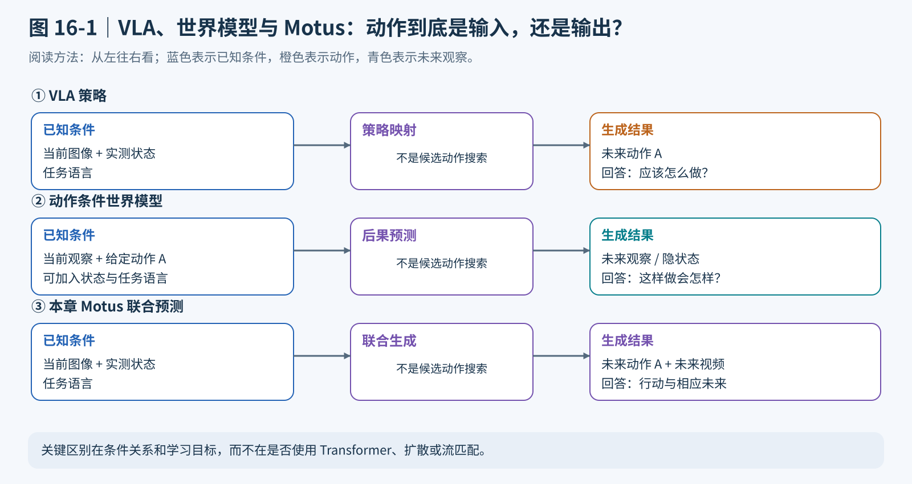

*图 16-1 从动作的角色区分三种能力：VLA 生成动作，动作条件世界模型接收给定动作，Motus 联合预测同时生成动作与未来视频。图为概念示意，不代表所有模型都只能采用图中的条件组合。*

### 1.2 为什么机器人需要预测未来，但不能只相信未来视频

从动作策略的角度看，视频预测多了一项任务，似乎只会增加开销。它的价值主要体现在三个方面。

**第一，让动作学习与场景变化建立联系。** 如果模型一边预测“夹爪已经闭合并抬起”，另一边却生成“物块仍然留在桌面”的视频，两种输出就存在不协调。联合建模为动作与视觉后果提供了相互利用的表示通道。不过，这是一种学习上的约束与归纳偏置，不是严格的物理一致性证明。

**第二，让没有关节标签的视频也发挥作用。** 人类拿杯子、机器人搬物体的视频包含大量接近、抓取、搬运、释放等运动信息，但往往没有对应的机器人动作。若能从画面变化中提取统一运动表示，就可以把这类数据用于动作专家的预训练。

**第三，让模型的内部预测更容易观察。** 单看一个 $16\times16$ 的动作矩阵，很难直接判断模型误解了颜色，还是没有学会抓取。观察未来视频，可以辅助检查目标选择、运动方向和抓取阶段；再结合实际轨迹，能够缩小排查范围。

但要特别注意：**一段看起来成功的视频，只证明模型生成了成功的画面，不能证明输出动作真的会成功。** 视频可能出现物体凭空移动、夹爪穿模、视角不一致或接触关系错误；动作也可能受到关节跟踪误差、执行延迟和观测偏移影响。

因此，本章同时安排两类实践：一类检查模型“想象了什么”，另一类检查机器人“实际做成了什么”。二者需要对照，不能互相替代。

### 1.3 Motus 如何把五种能力统一到一个模型中

为了理解 Motus，可以先把它看作一个学习联合关系的生成模型：

$$
p_\theta(O_t^+,A_t\mid o_t,s_t,\ell)
$$

如果知道其中一部分变量，就把它们当成条件；如果不知道，就让模型生成。论文借助类似 UniDiffuser 的独立噪声时间设计，在一个网络中组织以下五种模式。

| 模式 | 已知条件的关键部分 | 需要生成什么 | 直观例子 |
|---|---|---|---|
| 视频生成 VGM | 当前画面、任务 | 未来画面 | 想象“把红块放入盒子”的后续视频 |
| 世界模型 WM | 当前画面、给定动作 | 未来画面 | 执行指定关节目标后，物块会怎样移动 |
| 逆动力学 IDM | 当前与未来画面 | 动作 | 已知夹爪从桌边到达物块上方，反推如何运动 |
| VLA | 当前画面、任务及可用状态 | 动作 | 直接生成完成任务的控制序列 |
| 视频—动作联合预测 | 当前画面、任务及可用状态 | 未来画面与动作 | 同时生成搬运视频和对应关节目标 |

这里的“逆动力学”要和第五章的逆运动学区分开。逆运动学通常根据期望末端位姿求关节配置；这里的逆动力学模型根据一段视觉变化推断动作，输入并不是一个精确给定的末端位姿，两者不能混为一谈。

同样，视频生成模式和世界模型模式也不能混淆。仅凭当前画面和任务生成未来，未必回答了“这段指定动作会造成什么后果”。后者需要把动作作为明确条件。

本章实际使用第五种模式：**视频和动作从噪声开始，一起生成。** 虽然论文解释了五种模式，但 `code_chapter16` 并未提供五套可以通过命令行直接切换的部署入口。特别是，`infer_future.py` 虽然以未来视频为展示重点，内部仍会生成动作。

### 1.4 世界模型、闭环控制与强化学习之间是什么关系

一个常见误解是：只要模型能预测未来，就已经具备了基于模型的强化学习或模型预测控制。

实际上，要用世界模型做候选动作规划，还需要一条额外链路：提出多组候选动作，分别预测后果，用任务奖励或价值函数打分，选择较好的动作方案并交给控制器执行。预测器、候选生成器和评价器是不同的角色。

本章没有这套搜索过程。当前流程是：

**观察场景 → 联合生成视频和动作 → 完整执行 16 个动作目标 → 重新观察 → 再生成。**

这种“完整执行后再观察”的方式形成了反馈闭环：下一轮预测会利用机器人和物体的实际新状态，而不是一直沿用最初的观察。不过，当前模型没有对多组候选动作进行后果评分与优化，因此不能把这个闭环直接等同于带候选优化的 MPC。

与第十五章相比，两章的重点也不同：第十五章围绕执行经验、价值与优势标注更新策略；本章围绕视频运动先验、跨模态联合生成和目标机器人适配展开。当前 Stage 3 使用视频与动作的监督损失，没有奖励函数训练、Value 网络、优势标签或在线策略梯度更新。不能因为标题里出现“世界模型”，就把本章训练称为世界模型强化学习。

---

## 第二部分 Motus 的具体结构：三个专家如何共同工作

### 2.1 先看清整个模型，而不是把它理解成三个串联工具

Motus 的主体由视频生成专家、动作专家和理解专家组成。其中，理解专家接收预训练视觉语言模型的特征，视频专家继承预训练视频模型的生成能力。三个专家不是先后调用的独立服务，而是在每一层通过联合注意力交换信息。

可以用一条文字结构图把信息流串起来：

**当前三视图与任务 → Qwen3-VL → 理解特征；当前图像与未来视频噪声 → Wan 视频分支；当前机器人状态与动作噪声 → 动作分支；三路 token 经过 30 层联合注意力和各自前馈网络 → 视频速度场与动作速度场 → 迭代更新 → 未来视频与关节目标。**

另外，任务文字还经过 UMT5 编码，作为 Wan 视频分支的文本条件。这条路径和 Qwen 的视觉语言理解路径并存，不是二选一。

本章配置选用的主要组成如下：

| 组成 | 基础模型或实现 | 本章需要记住的作用 |
|---|---|---|
| 视频生成主干 | Wan2.2-TI2V-5B | 在视频潜空间中预测运动与场景变化 |
| 视频编解码器 | Wan VAE | 把图像序列压缩为视频潜变量，再还原成可观看的视频 |
| 视觉语言骨干 | Qwen3-VL-2B-Instruct | 从当前画面和任务中提取语义与空间特征，参数冻结 |
| 理解专家 | 512 维隐藏状态的 Transformer 分支 | 将 Qwen 特征接入联合生成过程 |
| 动作专家 | 1024 维隐藏状态的 Transformer 分支 | 将状态和带噪动作编码为 token，输出动作速度场 |
| 文本编码路径 | Wan 配套 UMT5 | 为视频分支提供预编码的文本条件 |

官方 README 将主要组件粗略统计为约 8B 参数，其中 Wan 约 5B，Qwen 约 2.13B，动作专家约 641.5M，理解专家约 253.5M。这是官方主要组件的量级说明，不代表某次 Python 进程只会占用“参数数量乘两字节”的显存。VAE、文本编码器是否同时驻留、激活、注意力中间量和训练状态都会影响实际资源需求。

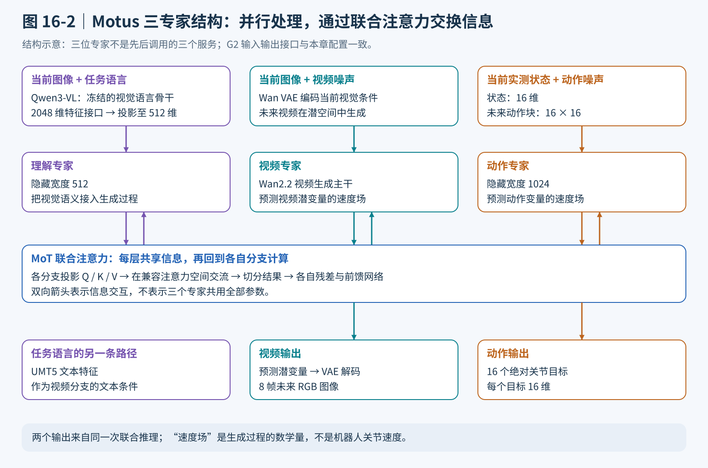

*图 16-2 先沿竖向阅读每个专家的输入输出，再看中间的双向信息交互。UMT5 是视频专家的另一条文本条件路径；图中省略了重复层、归一化和时间调制等细节。*

### 2.2 理解、视频和动作各自怎样变成 token

**理解分支：把“看懂任务”变成可供动作使用的特征。**

当前合成图像和完整任务文字经过 Qwen 的输入处理器，得到视觉与文本输入。这里需要的不是让 Qwen 先生成一句中文或英文解释，而是让视觉语言特征参与后续的视频与动作生成。

本章在配置中将视觉语言特征接口宽度设为 2048，并指定 `mlp3x_silu` 投影器，将其接入隐藏维度为 512 的理解专家。Qwen 骨干保持冻结，后续专家的可训练范围由 LoRA 配置决定。因此，“冻结 VLM”不等于“语义特征不能参与 G2 适配”。这些数值可以直接在本章的配置文件和模型构建参数中核对，特征提取实现则位于本章附带的 `Motus` 模型目录。

**视频分支：不是在原始像素上反复去噪。**

当前帧与未来帧先从 $[0,1]$ 转到 $[-1,1]$，再经过冻结的 Wan VAE 编码。VAE 负责压缩图像的空间与时间信息；后续视频 Transformer 在压缩后的潜空间中工作，最后才通过 VAE 解码回 RGB。

本章输入一帧条件图像，预测八帧未来图像，一共九帧。视频编码器将这段序列压缩为潜变量，再转成视频 token；当前帧提供已知的视觉锚点，未来部分是生成对象。本章代码负责给出帧数、图像大小与 VAE 权重路径，不自行实现视频编解码器。

要区分**八帧未来图像**和**八个视频 token**：一帧图像会对应多个空间 token，因此视频序列的 token 数远大于帧数。只知道帧数，不能直接推断注意力开销。

**动作分支：把当前状态与未来动作分别编码。**

当前状态告诉模型“机器人现在在哪里”，未来动作则是需要生成的控制目标，两者不能混为同一个输入。G2 的当前状态是一个 16 维向量，未来动作块包含 16 个 16 维目标。经过不同的编码器后，它们成为动作专家可以处理的内部特征，再与视频、理解分支交换信息。

本章可以直接核对的接口是：状态宽度为 16、动作宽度为 16、动作块长度为 16、动作专家隐藏维度为 1024。模型内部用于信息交换的辅助 token 不代表额外的关节或控制步；部署时只接收形状为 $16\times16$ 的动作数组。

这里还有一个容易混淆的地方：**动作 token 的 1024 维是网络内部特征宽度；输出动作的 16 维是机器人控制接口宽度。** 增加隐藏维度并不意味着机器人增加了关节。

### 2.3 三模态联合注意力：先交换信息，再各自处理

三个专家不要求使用相同的隐藏宽度：本章动作专家配置为 1024，理解专家配置为 512，视频专家沿用 Wan 的结构。不同宽度的隐藏向量不能直接沿序列维拼接，因此需要先构造查询、键和值，将它们投影到兼容的注意力空间。

设视频、动作、理解三个分支分别记为 $v,a,u$。在一个联合注意力层中，可以用下式概括跨分支交互：

$$
Q=[Q_v;Q_a;Q_u],\qquad
K=[K_v;K_a;K_u],\qquad
V=[V_v;V_a;V_u]
$$

$$
Y=\mathrm{softmax}\left(\frac{QK^\top}{\sqrt{d_h}}\right)V
$$

其中分号表示沿 token 序列拼接，$d_h$ 表示每个注意力头的维度。该式省略了位置编码、归一化等实现细节，用来表达“不同模态可以访问彼此的信息”。

联合注意力计算后，再按照每个分支的 token 数切分结果，并映射回各自的隐藏空间。也就是说，三位专家共享的是信息交流过程，而不是必须共用全部网络参数。本章 `lora.py` 对动作与理解分支的专用 QKV 参数也注入低秩增量，使 G2 适配能够调整跨模态信息交换，而不仅仅修改最终动作输出。

随后，各专家继续使用自己的前馈网络。视频分支还会对 UMT5 文本特征进行交叉注意力。因此一层网络可以概括为：

**归一化及时间调制 → 三分支联合注意力 → 分支残差更新 → 视频文本交叉注意力 → 各分支独立前馈网络。**

可以把它想象为三位各有专长的工程师：每轮先共享信息，然后分别完成自己的专业计算。动作专家不必替代视频专家去学习全部图像细节，视频专家也不必用自己的输出头直接表达 G2 的 16 维关节目标。

这种结构称为 **Mixture-of-Transformers，MoT**。它不是常见的“一个路由器为每个 token 只挑选少数专家”的稀疏 MoE：联合生成中三个分支共同参与计算，关键在于**独立参数与联合注意力相结合**。

时间信息也不是可有可无的。模型必须知道当前输入是“几乎全是噪声”，还是“已经接近最终结果”，才能预测正确的更新方向。视频与动作分支通过时间嵌入和自适应调制感知噪声程度，使同一网络能够在不同生成阶段预测更新方向。

### 2.4 为什么还需要 UMT5，以及为什么动作比视频更密

Qwen 已经处理了任务文字，为什么视频分支还要 UMT5？因为两者承接的是不同的预训练接口。

Qwen 的作用是联合理解当前画面与任务，输出可用于跨模态交互的特征。UMT5 则保持 Wan 原有的文本条件输入方式，让视频专家继续使用其预训练时熟悉的条件分布。直接删除其中一条路径，不只是减少一次编码，而是改变了原有模型结构。

本章任务文字只有三种主要变化，因此把 UMT5 编码结果提前缓存到磁盘，不必在每次请求中重新加载并运行大型文本编码器。**预编码 UMT5 不代表跳过 Qwen 的当前图像理解**：图像会变化，Qwen 仍需处理当前请求。

另外，Motus 使用“动作密、视频稀”的预测方式。机器人需要较密集的控制目标，但没有必要为每个目标都生成一张完整图像。视频 token 过多还会增加开销，使联合注意力中的模态比例更加失衡。论文给出了更稀疏的视频采样示例；本章采用本地 RoboTwin 风格配置，实际比例是两个动作对应一帧未来视频，而不是把论文示例中的比例照搬过来。

本章的时间关系是：

$$
30\ \mathrm{Hz\ 原始记录}
\xrightarrow{\text{每隔 3 帧取动作}}
10\ \mathrm{Hz\ 动作目标}
\xrightarrow{\text{每 2 个动作取视频帧}}
5\ \mathrm{Hz\ 未来视频}
$$

一次预测 16 个动作与八帧未来图像，覆盖约 1.6 秒的原始数据时间。动作时序和视频时序虽然稀疏程度不同，但必须落在同一条时间轴上。具体索引将在第四部分与数据处理流程一起解释。

---

## 第三部分 完整 Motus 算法：潜在动作、分阶段训练与联合生成

### 3.1 潜在动作如何把“视频里的运动”变成预训练信号

想用人类或多机器人视频训练动作专家，会遇到一个根本问题：视频里能看到运动，但未必知道运动者每个关节的目标，更不可能直接把人的动作数值当作 G2 的关节角。

Motus 引入潜在动作，目标不是从一帧图像精确恢复全部真实控制量，而是学习一个**能够表达视觉变化、又具有较低维度的运动表示**。

论文中的处理链路可以概括为：

**相邻视频帧 → DPFlow 光流估计 → 光流 RGB 表示 → DC-AE 压缩特征 → 低维潜在动作。**

光流描述像素在相邻帧之间的位移。例如，夹爪向右运动，会在相关像素区域产生一定方向的位移；物块被抬起后，也会出现随之变化的运动区域。与直接编码两帧外观相比，光流更突出“哪里发生了怎样的移动”。

论文使用 DC-AE 将光流表示压缩为四个 512 维 token，再由轻量编码器把拼接后的 $4\times512$ 维特征映射成一个 14 维潜在动作向量。这个 14 维是论文潜在动作表示的设计，不等于本章 G2 必须使用 14 维控制接口。

还需要强调两点。

**潜在动作不是光流本身。** 光流仍是高维的像素运动场；潜在动作是经过压缩和训练约束后的低维表示。

**潜在动作不是可直接执行的关节指令。** 相同的画面运动可以由不同身体结构和控制方式产生，光流还可能包含相机运动、遮挡和非刚体变化。低维向量与真实动作维数相似，只提供了对齐的便利，不保证每个维度具有固定的关节含义。

为使这种表示不只学会压缩画面，论文还使用少量带真实动作的数据进行弱监督，并引入类似 AnyPos 的任务无关采样数据：利用 cuRobo 在目标机器人动作空间中采样运动，收集图像—动作对应关系，为潜在空间提供控制约束。

论文给出的潜在动作学习目标为：

$$
\mathcal{L}_{\mathrm{latent}}=\mathcal{L}_{\mathrm{recon}}+\lambda_{a}\lVert a_{\mathrm{real}}-a_{\mathrm{pred}}\rVert_{2}^{2}+\beta\mathcal{L}_{\mathrm{KL}}
$$

其中，重建项要求潜在表示保留光流运动信息；动作对齐项只在有真实动作标签的样本上提供监督；KL 项正则化潜在分布，避免表示过于零散。论文在该学习环节混合约 90% 无动作标签数据与 10% 有标签轨迹。

这个 90%/10% 比例与本章按 episode 划分训练集和验证集的比例**没有关系**：一个是潜在动作训练中的标签组成，另一个是 G2 数据的评估划分。

最后再区分两种“潜在”：Wan VAE 压缩的是**视频内容**；潜在动作编码器压缩的是**运动信息**。虽然两者都使用潜空间，但不是同一个编码器，也不承担同一个任务。本章 G2 推理直接输出真实动作目标，不会在部署时先提取光流再把 14 维潜在动作逐项翻译为 16 维关节指令。

### 3.2 六层数据金字塔与三阶段训练为什么要放在一起理解

大型具身模型面临的数据矛盾是：容易获得的数据通常离目标机器人较远，最贴近目标任务的数据却最昂贵。Motus 用六层数据金字塔组织不同来源，并让训练阶段与数据作用对应起来。

| 数据层级 | 数据来源 | 主要贡献 |
|---|---|---|
| Level 1 | 网络文字、图像与视频等基础数据 | 通用语义、视觉和生成先验，主要通过已有基础模型继承 |
| Level 2 | 第一人称人类视频 | 人类操作的时序结构与运动变化 |
| Level 3 | 合成数据 | 可扩展的视觉与交互样本 |
| Level 4 | 任务无关机器人运动数据 | 动作空间覆盖与图像—控制对应 |
| Level 5 | 多机器人任务轨迹 | 不同身体上的操作和交互经验 |
| Level 6 | 目标机器人任务轨迹 | 具体平台的动作接口、动力学与任务习惯 |

这是一种数据组织框架，并不是本章目录中必须出现六个文件夹。金字塔越靠近目标机器人，数据通常越有针对性，但规模也更受成本限制。

**Stage 1：先让视频专家适应机器人交互。**

从已有视频生成模型出发，利用人类视频、合成数据和多机器人轨迹等训练视频专家，让它更熟悉操作场景中的运动，而不只是生成一般互联网视频。主要任务是根据初始图像和语言生成后续视频。

**Stage 2：利用潜在动作进行统一预训练。**

把视频、语言和从运动中提取的潜在动作组织成联合训练样本，训练三个专家之间的配合，Qwen 骨干保持冻结。这一阶段让动作专家即使面对没有真实关节标签的视频，也能学习操作过程中的运动结构。

这里要把潜在动作表示学习与 Stage 2 的联合训练区分开：前者提供“从视频得到动作式标签”的途径，后者利用这些标签训练完整 Motus。它们相互衔接，但不是同一个损失函数。

**Stage 3：用目标机器人的真实动作做监督微调。**

在目标平台上采集图像、实测状态和实际发送的动作目标，用这些数据适配完整模型的控制接口与任务分布。本章就在这一阶段开展实践：初始化为公开 Stage 2 Motus，动作与状态改为 G2 的 16 维接口，使用 G2 三色抓取放置数据做 LoRA 微调。

为什么不直接加载 RoboTwin 的成品策略？因为本地 `Motus_robotwin2` 面向的是 14 维机器人接口，G2 则使用 16 维接口。即使视觉场景相似，关节顺序、夹爪约定、运动学与控制目标也不相同。Stage 3 的职责就是把通用先验落到具体身体上，而不是修改一个输出维度后假设策略自动可用。

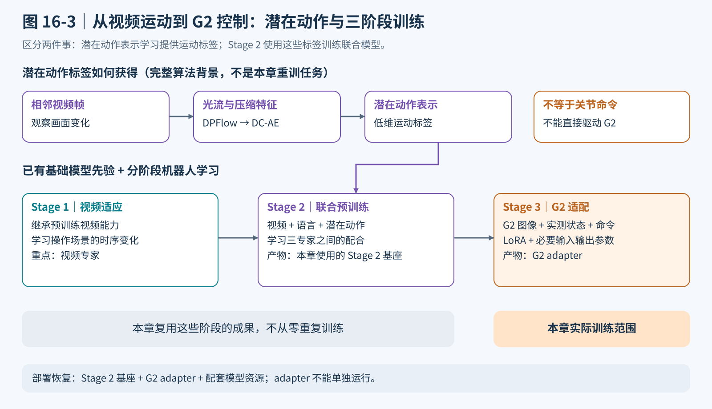

*图 16-3 上方是从视频获取运动标签的途径，下方是使用这些数据训练模型的阶段。橙色区域是本章实际开展的 G2 Stage 3 适配，不要把它与潜在动作编码器训练混为一谈。*

### 3.3 联合流匹配怎样训练视频与动作

潜在动作解决了预训练数据从哪里来的问题；联合流匹配解决的是模型怎样学习生成视频与动作。

设一条训练样本中，真实未来视频经过 Wan VAE 编码得到 $Z$，真实未来动作为 $A$。分别采样高斯噪声 $\epsilon_v$、$\epsilon_a$，再分别选择噪声强度 $\sigma_v$、$\sigma_a$，构造：

$$
Z_{\sigma_v}=(1-\sigma_v)Z+\sigma_v\epsilon_v
$$

$$
A_{\sigma_a}=(1-\sigma_a)A+\sigma_a\epsilon_a
$$

当 $\sigma=0$ 时，输入是干净数据；当 $\sigma=1$ 时，输入是纯噪声。模型看到的是“已经混入一定噪声的视频与动作”，需要预测它们沿这条直线路径变化的速度。

对上述路径求导，得到监督目标：

$$
u_{v}^{\ast}=\epsilon_v-Z,\qquad u_{a}^{\ast}=\epsilon_a-A
$$

模型预测 $v_{v}^{\theta}$ 与 $v_{a}^{\theta}$，通过均方误差训练：

$$
\mathcal{L}_{\mathrm{video}}
=\mathrm{MSE}\left(v_{v}^{\theta},u_{v}^{\ast}\right)
$$

$$
\mathcal{L}_{\mathrm{action}}
=\mathrm{MSE}\left(v_{a}^{\theta},u_{a}^{\ast}\right)
$$

$$
\mathcal{L}
=\lambda_v\mathcal{L}_{\mathrm{video}}
+\lambda_a\mathcal{L}_{\mathrm{action}}
$$

本章两项权重均为 1。这里的“速度”是**生成过程中的数学速度场**，不是机器人关节速度；最终得到的 G2 动作仍然是绝对关节目标。

当前帧是已知条件，不应该被模型重新发明。理解训练目标时，应把它看作固定的观察锚点，让模型学习从这个锚点向未来演化。本章训练入口将条件帧和完整视频分别传给模型，具体加噪、条件约束和损失计算由本章附带的 Motus 模型接口完成；G2 训练入口不另写一份视频损失。

动作分支在 Stage 3 中接收当前实测状态，监督对象是未来动作序列。理解分支没有另加一个“生成任务解释文本”的损失，它通过联合注意力参与视频与动作任务，并从联合目标获得训练信号；Qwen 骨干本身不更新。

**独立噪声时间是统一模型的关键。** 如果视频和动作永远拥有相同的噪声强度，模型主要看到“一起清晰、一起模糊”的组合。分别采样时间，可以让它接触“动作较清晰、视频较模糊”以及相反的组合，为条件模式切换提供基础。

需要区分“算法上的独立噪声时间”和“某个依赖版本采用的具体采样器”。本章 YAML 保留了时间分布配置，但 `train_stage3.py` 本身不实现噪声采样；不能仅凭配置字段就断言所附 Motus 模型的实际采样方式。复现实验应保存配置与所附 Motus 的版本信息，本节公式用于理解监督目标，不代替依赖版本的实现约定。

还要区分本节损失与上一节潜在动作 VAE 的损失：**当前 G2 Stage 3 不计算光流重建、潜在动作 KL 或潜在动作对齐项**。它使用的是视频速度场 MSE 加真实动作速度场 MSE。

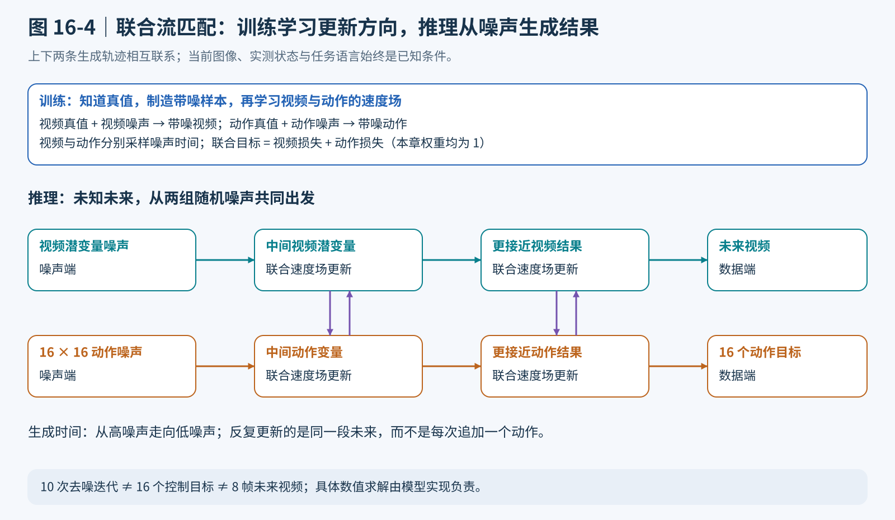

*图 16-4 横向表示生成过程从噪声走向结果，竖向双箭头表示视频与动作通过三专家交换信息。它不是机器人任务的物理时间轴；图中的中间状态数量也不代表实际去噪次数。*

### 3.4 推理怎样从噪声得到视频与动作，以及怎样切换模式

训练时知道正确答案，可以制造带噪样本；推理时不知道未来，需要从噪声出发逐步生成。

本章实际推理按以下顺序进行：

1. 读取当前三视图、16 维实测状态与任务文字。
2. 将合成图像编码成条件帧潜变量，取得 UMT5 文本缓存与 Qwen 理解特征。
3. 初始化随机视频潜变量和形状为 $16\times16$ 的动作噪声，固定视频中的条件帧位置。
4. 让三个专家共同预测视频与动作的速度场。
5. 沿时间从 1 到 0 更新视频潜变量和动作，并再次恢复条件帧位置。
6. 重复若干次后，将视频潜变量解码为八帧未来图像，把动作结果作为 16 个绝对控制目标。

为了理解“从噪声逐步变成视频和动作”，可以用一阶 **Euler 积分**写出示意更新：

$$
X_{i+1}=X_i+\Delta\sigma_i\,v_\theta(X_i,\sigma_i),
\qquad \Delta\sigma_i<0
$$

其中 $X$ 分别代表视频潜变量和动作变量。负的时间步长很重要：训练目标定义的是由干净数据走向噪声的方向，生成时则从噪声沿相反时间方向走回数据。

本章默认十次去噪迭代。**十次迭代、16 个动作和八帧视频是三个不同概念**：十次是生成求解步数；16 是动作块长度；八是未来视频帧数。增加去噪迭代并不会自动生成更多动作或更长视频。

这条公式解释的是生成方向和步长含义，对应 Motus 模型内部的生成求解过程。本章 `MotusPolicy.predict_composite` 将 `inference_steps` 传给模型的联合推理接口，然后接收视频和动作；具体求解器由本章附带的 Motus 实现负责，当前教学入口不提供求解器切换参数。

论文五种模式的差别，可以进一步用噪声状态解释。下面的 0 表示干净、1 表示纯噪声，均针对**未来变量**；当前条件帧始终已知。

| 模式 | 未来视频的噪声状态 | 未来动作的噪声状态 |
|---|---|---|
| VGM | 从 1 逐步到 0 | 固定在纯噪声，不提供已知动作条件 |
| 世界模型 | 从 1 逐步到 0 | 固定为给定的干净动作，时间为 0 |
| IDM | 固定为给定的干净未来视频，时间为 0 | 从 1 逐步到 0 |
| VLA | 固定在纯噪声，不提供已知未来视频条件 | 从 1 逐步到 0 |
| 联合预测 | 从 1 逐步到 0 | 同时从 1 逐步到 0 |

因此，“不用未来视频作为条件”不等于把视频变量填成全零，而是按对应模式保留在纯噪声状态。类似地，世界模型模式需要把真实给定动作固定住，不能仍然让动作分支自由生成。

本章只把最后一行接入运行脚本。若要扩展其他模式，需要明确修改条件变量、分支时间与更新逻辑，再单独验证，而不是给现有命令追加一个不存在的模式参数。

---

## 第四部分 把算法落到 G2：数据、微调与控制必须是一条链

### 4.1 从示教记录到训练样本：状态和动作不能混在一起

本章继续使用三色物块入盒场景，语言负责选择红、绿、蓝中的目标颜色。采集阶段由本地自动专家完成接近、抓取、抬升、搬运和释放；模型评测阶段不调用这个专家。

一条原始轨迹记录三路图像、实测状态、发送给机器人的绝对目标、任务文字与成功标志。最重要的数据合同是：

- **状态回答“机器人当前实际处于哪里”。** 原始字段为 `qpos`。
- **动作回答“控制器要求机器人接下来到哪里”。** 原始字段为 `command`。

即使两者都是 16 维，它们也不应混为一谈。比如某关节当前实测为 0.30 rad，专家给出的目标为 0.45 rad，此时状态和动作相差 0.15 rad；若把状态复制成动作标签，就会把“要求继续运动”错误改成“维持当前测量位置”。在带跟踪滞后的系统里，这种错误会系统性地改变学习任务。

本章统一的 16 维排列为：

$$
[\underbrace{q_{L,1},\ldots,q_{L,7}}_{0\text{ 至 }6},
\underbrace{q_{R,1},\ldots,q_{R,7}}_{7\text{ 至 }13},
\underbrace{g_L,g_R}_{14,15}]
$$

前 14 维是左右臂关节角，后两维是左右夹爪的模型表示。夹爪约定为 **−0.785 表示打开，0 表示闭合**，并非通常想象的“0 打开、1 闭合”。底层接口会把这种模型表示转换为机器人实际夹爪关节目标。

当前案例主要操作右臂，但仍保存完整双臂与双夹爪接口。未主动运动的部分也需要被明确表达，不能训练时忽略左臂，部署时再临时补零。

采集默认按三种颜色均衡分配：clean 总计 150 条成功轨迹，每色 50 条；randomized 总计 1500 条，每色 500 条。randomized 在场景水平平面内对物块位置施加 ±0.01 m 随机扰动。这里的 clean 与 randomized 是**采集条件**，不是 train 与 validation。

失败尝试可以保留在原始 NPZ 中，但转换器会跳过显式标记失败的轨迹，所以原始文件总数可以大于最终成功配额。脚本支持检查已有成功数量并继续补采，不需要为了补充数据而删除原始轨迹。

数据转换时，每条成功轨迹被拆成五类文件：实测状态、绝对动作目标、合成视频、文本和 UMT5 编码。`g2_dataset_adapter.py` 只改写官方 RoboTwin 数据类中与 G2 有关的扫描及状态—动作读取逻辑，保留官方的视频采样、视觉语言处理和训练样本组织方式。

这层适配的意义不是“换一种文件后缀”，而是让模型接收正确的语义：**条件状态来自实测，监督动作来自命令。** 旧版若已把实测状态当动作训练成 checkpoint，仅仅补齐 `commands` 文件不能修复已有模型；本章主线从 Stage 2 重新开始正确监督下的微调。

### 4.2 图像、文本与时间对齐：让训练和部署看到同一件事

**三路相机必须使用相同的合成布局。**

本章把头部相机放在上方，左腕和右腕相机并排放在下方，形成 T 布局。磁盘 MP4 的高×宽是 $360\times320$；加载后通过保持比例的缩放和黑边补齐，变成模型使用的 $384\times320$。

这里的高宽顺序很容易写反：数组通常用高、宽、通道描述形状，而 PIL 的尺寸参数采用宽、高。本章三视图最终作为**一张合成图**进入模型，而不是三次独立推理。

离线转换与在线推理共用这些图像工具，以避免训练时看到一种相机排列，部署时却变成另一种排列。若只换掉相机顺序、改变腕部视图占比或使用不同的裁剪方式，模型输入分布就已经发生变化，即使分辨率仍然相同也不例外。

**任务文字必须保持一个规范版本。**

原始任务可以很短，例如要求抓取红色物块并放进空盒子；模型实际接收的文字还会附带固定场景前缀，描述工业场景、头部相机、左右腕部相机和 G2 机器人。

`stage3_prompt` 负责构造这个规范文本，并避免重复添加前缀。转换后的 metadata、UMT5 缓存和 Qwen 输入都应使用同一版本。缓存文件名根据完整文本的 SHA-256 摘要生成，因此多一个空格、修改场景前缀或换一种任务表达，都可能对应不同缓存。

当前服务没有为任意新指令在线运行 UMT5 的后备逻辑。缺少缓存时会明确报错，而不是自动泛化成“任何自然语言都可立即使用”。本章最稳妥的主线是沿用三种标准任务指令；要扩展指令，需要同步准备新文本缓存并评估语言泛化。

**一条训练样本怎样在时间轴上取帧。**

设条件帧位于原始轨迹索引 $c$，条件图像和条件状态都取自该位置。16 个动作标签的位置为：

$$
c+3,\ c+6,\ c+9,\ \ldots,\ c+48
$$

八帧未来图像的位置为：

$$
c+6,\ c+12,\ c+18,\ \ldots,\ c+48
$$

如果从第 0 帧开始，那么第一个动作来自第 3 帧命令，第一个未来画面来自第 6 帧，第 16 个动作和第八个未来画面都落在第 48 帧。原始轨迹至少要有第 0 至第 48 帧，因此转换器要求不少于 49 帧。

这一约定并不是“把当前命令也放进未来动作块”，也不是“每个动作都配一张未来图像”。它将较密的控制序列与较稀疏的视觉序列放进同一个 1.6 秒窗口。

因此，不能只把一份旧数据的 FPS 字段改成 30 就当作新数据使用。真实采样节奏、图像与状态对应、命令记录时刻都必须匹配。对于已经正确记录两路数值且采样频率一致的本章数据，则可以直接重做转换，不必重新采集。

当前 G2 适配器读取的是原始量纲的绝对目标，没有额外执行 OpenPI 风格的动作分位数归一化或部署端反归一化。不要把第十四章的归一化文件直接套到这条链路上。

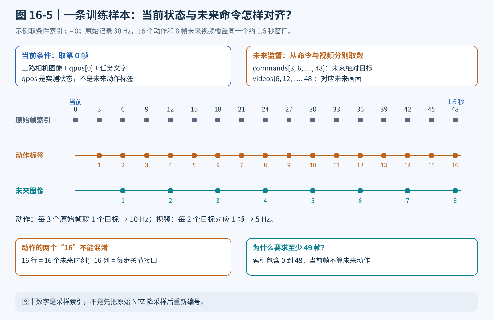

*图 16-5 顶行标原始帧索引，下两行分别标动作与未来视频的序号。任取条件索引 c 时，将顶行索引整体加 c 即可；条件状态来自 qpos，动作监督来自 commands。*

### 4.3 Stage 3 LoRA 实际更新什么，为什么适配器不能单独使用

本章不是训练一个新的小模型，而是保留大型 Motus 的主体权重，只更新低秩增量和少量与 G2 适配相关的参数。

对一个线性映射，LoRA 可以简写为：

$$
y=Wx+\frac{\alpha}{r}BAx
$$

其中 $W$ 是冻结的原始权重，$A$ 和 $B$ 是可训练的低秩矩阵，$r$ 是秩，$\alpha$ 是缩放系数。本章正式配置使用 $r=16$、$\alpha=32$，线性 LoRA 路径还使用 0.05 的 dropout。

直观地说，原始模型保留通用知识，新增的小矩阵学习“在 G2 场景中怎样调整这些知识”。这会减少需要保存和优化的参数，但不会使冻结模型在推理时消失。

本章的 LoRA 不只装在动作输出层，而是覆盖三个专家中配置允许的线性层。同时，动作和理解分支的联合注意力 QKV 并非普通线性模块，而是四维参数张量；`LoRAWeightDelta` 为这些张量加入专门的低秩参数化，否则只扫描线性层会漏掉重要的跨模态交互参数。

另外，目标机器人接口需要重新学习，因此本章允许动作输入编码器和动作解码器进行完整参数更新，并开放选定的归一化、调制和寄存器参数。由此可见，保存文件虽然叫 adapter，却不只是两组低秩矩阵，而是**LoRA 加上显式放开的 G2 专用参数**。

Stage 2 初始化时，会跳过动作输入编码器和解码器的权重。原因不只是维度可能不同，还包括这两端需要匹配目标机器人的状态与动作含义；主体跨模态能力则从预训练中继承。LoRA 的加载器还会重映射 QKV 参数键名，以适应参数化之后的结构。

因此，推理恢复的正确逻辑是：

**按 G2 的 16 维结构建立模型 → 注入相同 LoRA 结构 → 加载 Stage 2 主体 → 加载 G2 adapter 与可训练接口参数 → 切换评估模式。**

不能只拿一个约百 MiB 的 adapter 文件就删除所有基础权重。运行时仍需要对应的 Stage 2 基座、Wan 配置与 VAE、Qwen 配置及处理器，以及任务文本缓存。更换 Stage 2 基座也会改变适配器所依赖的模型，不能把“文件能够读入”当作模型兼容性证明。

正式配置采用两卡、每卡 micro batch 为 1、梯度累积 4 次，因此有效 batch 为：

$$
B_{\mathrm{effective}}=1\times2\times4=8
$$

当前正式配置的 6000 步指 **6000 次真正的 optimizer update**，不是 6000 次小批次前向。训练封装在梯度累积边界才推进全局更新计数，日志与保存间隔也以该计数为依据。

BF16 与 DeepSpeed ZeRO-1 用于控制训练资源，LoRA 用于减少可训练参数与优化器开销。但是，ZeRO-1 不会把整个冻结主干自动均匀拆到两张卡；“两张 32 GB GPU”不等于每个进程拥有一个 64 GB 显存池。实际能否运行还取决于注意力后端、激活、同时驻留的模型和其他进程。

默认 checkpoint 只保存 adapter 和配置，不保存完整优化器与调度器状态。它适合部署，也允许重新加载权重继续训练，但这种续训会重启优化器和调度器，**不等于训练过程的精确断点恢复**。需要精确恢复时，要使用完整状态保存路径，并承担显著更高的存储开销。

### 4.4 怎样划分验证数据，以及应该怎样理解训练结果

本章在允许的三个任务中，按完整 episode 做稳定的训练—验证划分。划分依据由随机种子、采集组、任务名和 episode 标识组成，再通过哈希映射决定归属。同一条轨迹不会因为本次进程启动顺序改变，就从训练集跑到验证集。

划分比例约为 90% 与 10%，但它不是严格的逐组定额抽样，因此实际验证集未必恰好等于总数的十分之一。相邻帧不会被拆到两个集合，降低了“验证样本其实是训练轨迹的下一帧”这种直接泄漏。

不过，episode 分离只解决轨迹重叠，不自动提供分布外验证。特别是 clean 条件下的重复示教可能非常相似；若想检验泛化，还需要额外使用未见位置、不同扰动或新的任务条件。

正式 LoRA 配置将验证间隔设为 100000，而总训练步数为 6000，因而本轮不会触发周期性在线验证。这样做是当前双卡训练规避验证同步问题的工程选择，不应写成“训练期间已经持续验证并确认收敛”。冒烟配置的验证间隔为 2，行为与正式配置不同，出现同步问题时需要单独排查。

还要防止把不同训练规模混为一谈。当前 G2 默认是 1650 条成功轨迹、单个抓取放置任务族、6000 次更新的 LoRA 配方；官方多任务设置和旧版参考 YAML 的数据量、步数与训练范围并不相同。`stage3_g2.yaml`、`stage3_g2_public_1m.yaml` 等文件保留了不同规模的参考配置，而当前训练入口明确要求 `train_scope` 为 `lora`。因此，本章可执行主线应选择两份带 `lora` 的配置，不能把参考文件都当成当前入口支持的训练命令。

结果检查至少要分三层：

1. **数据层**：图像、状态、命令是否对齐，颜色是否均衡，夹爪符号是否正确。
2. **模型层**：视频和动作 loss 是否有限，生成动作是否有异常跳变，未来视频是否识别正确目标。
3. **执行层**：机器人是否真正抓取并放入盒子，失败时是否存在关节范围裁剪、等待延迟或夹爪提前释放。

三层都检查，才有可能区分“模型不会做”和“数据、接口或执行方式错误”。仅凭总 loss 下降，不能断言抓取成功率提高。

### 4.5 同一个模型怎样用于未来展示与闭环执行

离线和在线案例都通过 `MotusPolicy` 加载模型、拼接图像、读取文本缓存并调用联合推理，因此它们共享同一套观察与动作接口。

离线案例从 NPZ 中取得某一帧的三视图、状态和任务，输出条件图、未来视频、GIF、九宫格以及动作数组。使用 NPZ 的优点是图像、状态与文字天然来自同一条记录。若改用单张图片输入，代码在没有状态文件时会使用全零状态；这只能用于观察接口行为，不能当作真实机器人当前姿态，更不宜据此评价控制能力。

在线案例将两个环境分开：Motus 在训练/推理 Python 环境中运行，Isaac Sim 使用自己的 Python 启动。两进程通过轻量 TCP 协议传递三路图像、状态与文字，服务端仅返回 $16\times16$ 的动作块。协议传递的是 NumPy 数组，不要求仿真端安装完整的大模型训练依赖。

服务端仍然执行视频分支并解码未来帧，只是在网络响应中不发送视频。因而“只收到动作”不能说明视频生成计算已被优化掉。

本章统一采用 `official` 完整动作块协议。一次预测不是只提供下一个关节目标，而是提供接下来连续执行的 16 个目标；执行器按顺序完成整个动作块，然后才开始下一轮观察与预测。

| 项目 | `official` 完整动作块协议 |
|---|---|
| 每轮执行长度 | 16 个动作目标全部执行 |
| 重新观察时机 | 完整动作块执行结束之后 |
| 目标范围处理 | 只裁剪到关节物理范围，不施加逐步动作变化限制 |
| 底层执行方式 | 从当前实测状态到目标做平滑插值 |
| 成功检查时机 | 完整动作块结束后检查，不在块内提前结束 |
| 实验含义 | 对齐 Motus 完整动作块约定的 G2 适配 |

`official` 只是本章对完整动作块执行约定的命名，不意味着换成 G2 场景后就与官方 RoboTwin 基准完全等价。相机、机器人动力学、成功判据、插值控制和等待方式都需要分别说明。

每个目标默认执行 0.1 秒，底层在当前实测状态与目标之间做平滑插值，并按 120 Hz 物理步进推进。因此十赫兹是目标更新节奏，不是物理仿真步频；16 个目标约对应 1.6 秒执行时间，不包括模型推理等待。

默认等待推理时，RPC 在后台线程运行，仿真主线程保持请求时姿态并持续刷新画面。这样窗口不会看起来卡死，但物理世界仍在前进，物体可能继续落下或滑动。它不是“机器人一边执行上一段动作，一边提前预测下一段”的流水线，旧观察与新动作之间也可能出现时间偏差。使用暂停等待选项可以冻结推理等待期的仿真，但那又不等价于真实系统中的实时执行。

因此，完整动作块内部的目标序列不会因新画面而重新生成，但底层仍会读取实测关节状态进行插值执行。块结束后的新观察才用于修正下一轮预测。评估这个闭环时，应同时记录模型推理等待与任务总时长，不能只用约 1.6 秒的动作块时长推算实际任务速度。

当前成功判据由仿真任务模块负责：物块进入带容差的盒内区域，并在夹爪足够打开时被记为完成，最终还需仍位于盒内。它不是“夹爪曾经碰到物块”，也没有额外要求在盒中稳定静置数秒；如要进行更严格的工程评测，应另加稳定性检查并明确更改了指标。

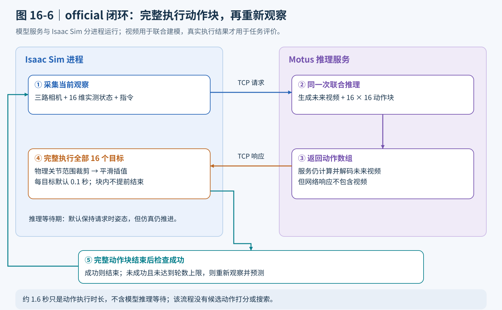

*图 16-6 闭环反馈来自实际环境的新观察，不是把生成视频当成下一次的真实观察。动作块结束后才检查是否继续；在线服务不传视频，但当前联合推理仍计算视频。*

---

## 第五部分 代码结构、运行流程与结果检查

从这一部分开始集中给出命令和可运行的检查片段。前文介绍的算法不再拆成零散代码重写，而是直接对应现有工程。以下命令以工作区根目录为 `/home/robot/g2_robot` 为例；其他机器应替换工程路径、Isaac Sim 路径和环境名称。每个新开的数据处理或模型终端都应重新激活所选环境，并将 `MOTUS_ROOT` 指向本章目录中的 `Motus` 子目录；这些终端直接使用 `python3`。Isaac Sim 终端则始终使用其自带的 `/home/robot/isaac-sim/python.sh`。

### 友情提醒！

### 由于本章数据采集，转换数据以及训练时间过长，推荐直接下载以下数据和权重，前往5.6直接测试，

data以及权重数据下载：
https://huggingface.co/Datawhale/hello-robotics-chapter16/tree/main

同时需要将assets文件放入code_chapter16中的两个位置处：https://huggingface.co/datasets/Datawhale/g2_assets

目录关系如下：

```text
code/
├── chapter16/
│   └── 第十六章 潜在动作世界模型.md
└── code_chapter16/
    ├── assets/                    # G2 场景
    ├── Motus/                     # 随本章附带的模型源码与训练设施
    ├── configs/                   # 本章训练配置
    ├── task_runtime/    
    │   └── assets/                # 按完整提示词缓存的 UMT5 特征
    ├── tests/                     # 数据、LoRA、RPC 与接口测试
    ├── data/
    │   ├── raw/                   # 原始轨迹 NPZ
    │   ├── processed/             # Motus Stage 3 数据布局
    │   └── cache/t5/              # 按完整提示词缓存的 UMT5 特征
    ├── weights/                   # Stage 2 基座与配套模型资源
    ├── checkpoints/              # G2 Stage 3 adapter
    ├── logs/
    └── outputs/
```

### 5.1 先按数据流阅读代码，而不是从头逐行翻目录

建议按照“配置 → 数据 → 模型训练 → 模型推理 → 仿真执行”的顺序阅读。

| 环节 | 文件与关键入口 | 阅读时应确认的问题 |
|---|---|---|
| 全局合同 | `settings.py`、`stage3_prompt` | 16 维顺序、帧率、图像大小、文本前缀是否统一 |
| 场景接口 | `environment.py`、`task_runtime/robot.py`、`simulation.py` | 状态怎样测量，动作怎样施加，成功怎样定义 |
| 示教采集 | `collect_data.py`、`RawRecorder`、`collect_group` | 当前状态与实际发送的目标是否分别保存 |
| 图像与索引 | `data_utils.py`、`stitch_views`、`stage3_indices` | 三视图布局、动作与视频时间轴是否一致 |
| 数据转换 | `prepare_data.py`、`convert_episode`、`encode_instructions` | 五类文件是否完整，UMT5 是否使用完整提示词 |
| G2 数据适配 | `g2_dataset_adapter.py`、`load_state_action` | 条件来自实测，监督来自命令，episode 是否分离 |
| 数据审计 | `inspect_data.py` | 成功轨迹数、训练验证划分和状态命令差异是否合理 |
| 兼容层 | `motus_compat.py` | 是否找到本章附带的 `Motus` 目录，实际注意力后端是什么 |
| 参数高效微调 | `lora.py`、`apply_lora`、`save_lora_adapter` | 哪些参数被冻结，哪些增量与接口参数被保存 |
| 训练启动 | `train.sh`、`train_stage3.py` | 预检查、真梯度累积和 adapter 保存是否生效 |
| 共用推理 | `motus_runtime.py`、`build_model`、`MotusPolicy` | Stage 2 与 adapter 如何恢复，输出形状是否正确 |
| 未来展示 | `infer_future.py` | 条件帧、未来视频与动作怎样落盘 |
| 跨进程推理 | `serve_policy.py`、`policy_rpc.py` | 请求包含什么，服务失败如何返回 |
| 动作执行 | `evaluate.py`、`execute_target`、`control.py` | official 完整动作块如何执行，关节范围裁剪与平滑插值分别负责什么 |

**本章将 Motus 模型源码放在 `code_chapter16/Motus` 中，与 G2 适配代码一起组织。** 顶层脚本负责示教数据、16 维机器人接口、LoRA 训练封装和仿真执行；`Motus` 子目录提供模型主体、数据加载与训练设施。两部分共同组成运行工程，不能只保留顶层脚本和模型权重。

前文解释模型算法，5.3 节按输入输出逐项对应 G2 适配代码与 Motus 的调用关系。这里要特别区分：`Motus/` 是模型源码，`weights/Motus/` 是 Stage 2 预训练参数，`checkpoints/` 保存本章训练得到的 adapter，三者用途不同。


### 5.2 环境安装与权重准备

代码 README 使用名为 `openpi` 的已有环境；它只是环境名称，本章模型训练本身走 PyTorch/Motus，而非 OpenPI/JAX。若已有兼容环境，可以直接激活；若没有，建议建立独立环境，避免修改前面章节的依赖。

二选一准备环境：

```bash
# 方案 A：已有可用的 openpi 环境时复用。
conda activate openpi
```

```bash
# 方案 B：没有可用环境时，新建独立 Motus 环境。
conda create -n motus python=3.10 -y
conda activate motus
```

随后进入代码目录，检查当前环境的解释器：

```bash
cd /home/robot/g2_robot/code/code_chapter16
mkdir -p logs outputs

python3 -c 'import sys; print(sys.executable)'
nvidia-smi
```

若环境还没有合适的 PyTorch，可以参考本地安装脚本保留的 CUDA 12.8 组合；已配置好的机器不必重复安装。驱动与 GPU 支持仍需在自己的机器上核对：

```bash
python3 -m pip install torch==2.7.1 torchvision==0.22.1 \
  --index-url https://download.pytorch.org/whl/cu128

bash setup_env.sh

python3 -c \
  'import torch; print(torch.__version__, torch.version.cuda, torch.cuda.is_available())'
```

`setup_env.sh` 检查 PyTorch 版本并安装本章依赖；`requirements.txt` 固定了 `transformers==5.0.0rc0`，同时还有若干仅约束最低版本的依赖。因此它不是完整锁定环境，不宜把任意最新依赖组合都视为已经验证兼容。环境跑通后，应保留自己的版本清单：

```bash
python3 -m pip freeze > logs/motus_environment.txt
```

注意力后端可以使用 FlashAttention，也可以使用本章兼容层提供的 PyTorch SDPA。后文命令显式选择 SDPA，便于与本地 README 的运行方式保持一致；若切换后端，需要重新检查显存和耗时。

下载或复用权重，也可以采用modelscope下载：

```bash
bash download_weights.sh
```

脚本依赖 `huggingface-cli`。若当前 Hugging Face 工具只提供 `hf` 命令，可以使用同一来源手动下载到脚本约定的目录，而不是改变代码中的权重位置：

```bash
hf download motus-robotics/Motus \
  --local-dir weights/Motus

hf download Wan-AI/Wan2.2-TI2V-5B \
  --local-dir weights/Wan2.2-TI2V-5B

hf download Qwen/Qwen3-VL-2B-Instruct \
  --local-dir weights/Qwen3-VL-2B-Instruct
```

所需资源与用途如下：

| 目录 | 用途 |
|---|---|
| `weights/Motus` | Stage 2 联合预训练权重，正式 G2 微调的初始化来源 |
| `weights/Wan2.2-TI2V-5B` | Wan 配置、VAE、UMT5 权重与 tokenizer 等 |
| `weights/Qwen3-VL-2B-Instruct` | Qwen 配置、处理器与模型资源 |
| `weights/Motus_robotwin2` | 可选的官方 14 维 RoboTwin 成品模型，不是本章 G2 部署权重 |

下载脚本可能以硬链接复用旧目录中的文件，避免重复占据磁盘空间。硬链接并非互相独立的副本，不应原地编辑这些权重文件。脚本用标志文件检查是否跳过下载，也不等于验证全部分片完整；若加载时报缺文件，应核查整个对应模型目录。

**使用本章附带的 Motus 源码，不再单独克隆到工程外。** 目录应为 `/home/robot/g2_robot/code/code_chapter16/Motus`，其中包含 `models`、`train`、`data`、`utils` 与 `bak` 等子目录。

当前 `settings.py` 的默认路径仍指向上一级目录中的 Motus。为使本节命令在尚未修改代码时也明确使用新的内置目录，需要先设置环境变量；本节不假设默认路径已经修改。

```bash
cd /home/robot/g2_robot/code/code_chapter16
export MOTUS_ROOT=/home/robot/g2_robot/code/code_chapter16/Motus

# 检查实际路径、导入和模型接口，不加载大模型权重。
python3 - <<'PY_DEP'
import inspect
from pathlib import Path
from motus_compat import install_motus_imports
from settings import MOTUS_ROOT

expected = Path("/home/robot/g2_robot/code/code_chapter16/Motus").resolve()
assert MOTUS_ROOT == expected, f"模型目录不正确：{MOTUS_ROOT}"
install_motus_imports()
from models.motus import Motus, MotusConfig

model_file = Path(inspect.getfile(Motus)).resolve()
assert MOTUS_ROOT in model_file.parents, f"实际导入了其他副本：{model_file}"
print("Motus source:", MOTUS_ROOT)
print("Loaded model:", model_file)
print("Config:", MotusConfig.__name__)
print("Training API:", inspect.signature(Motus.training_step))
print("Inference API:", inspect.signature(Motus.inference_step))
PY_DEP
```

这里同时检查配置路径与实际导入位置，避免机器上保留多个 Motus 副本时误用旧目录。导入检查不能代替数据加载、权重恢复、冒烟训练和单次推理验证；发布时应保持所附源码、训练配置与 adapter 配套，并记录源码来源和版本。复制来的源码目录不一定包含 Git 元数据，因此这里不要求在该目录执行 Git 提交查询。

以后每次打开数据处理、训练或推理终端，在激活环境后执行：

```bash
export MOTUS_ROOT=/home/robot/g2_robot/code/code_chapter16/Motus
```

注意，`MOTUS_ROOT` 指向**模型实现目录**，`weights/Motus` 存放**预训练参数**，二者不能互相替代。`train.sh` 默认通过当前环境的 `python3 -m torch.distributed.run` 启动训练，下面直接调用该脚本即可。

### 5.3 算法原理在代码中的完整对应

前文介绍了 Motus 的三专家结构、潜在动作预训练、联合流匹配和 G2 Stage 3 适配。落到本章工程，这些工作并不是由一个文件从头实现。阅读时应沿着 **“配置约束 → 示教记录 → 训练样本 → LoRA 与联合损失 → adapter 恢复 → 视频动作联合预测 → official 完整动作块执行”** 的数据流逐步追踪。

下面沿着 `code_chapter16` 顶层适配脚本与所附 `Motus` 的调用关系讲解，重点说明本章传入什么、取得什么、如何使用结果。特别要记住：**光流潜在动作学习和 Stage 1、Stage 2 已经体现在预训练基座中，本章没有重新训练这些模块。** “完整对应”指把完整算法链中的复用部分与本章实际实现部分区分清楚，而不是宣称本章文件重新实现了整套 Motus。

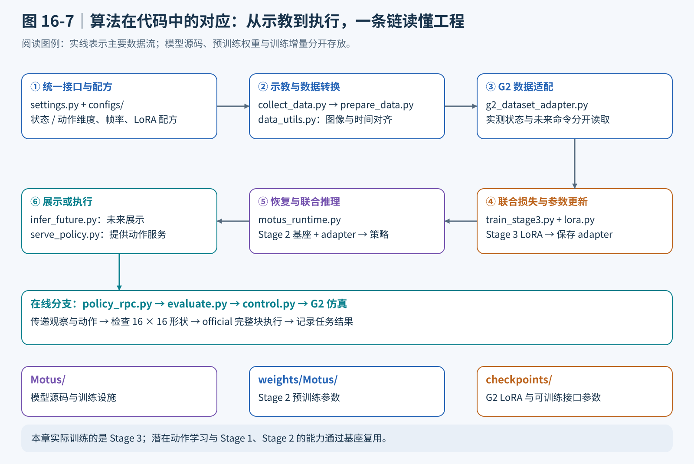

*图 16-7 按上排从左到右、下排从右到左阅读，再接到在线执行分支。底部三个目录分别存源码、基座权重和训练增量，不能互相替代。*

**1. `settings.py` 与 `configs/stage3_g2_lora.yaml`：把模型接口和训练配方统一起来。**

`settings.py` 首先确定机器人接口：`STATE_DIM` 和 `ACTION_DIM` 都是 16，分别对应实测关节状态和未来绝对关节目标。两个值相等不代表两组数据可以互换。`RAW_FPS=30` 与 `GLOBAL_DOWNSAMPLE_RATE=3` 共同确定动作监督的十赫兹节奏，`NUM_VIDEO_FRAMES=8` 与 `VIDEO_ACTION_FREQ_RATIO=2` 则决定一个样本包含八帧未来视频和 16 个动作。

这几个常量共同描述同一段约 1.6 秒的未来，而不是四组彼此独立的超参数。如果仅把动作块改成更长，却不检查视频帧数、采样间隔和数据长度，模型接收的“未来画面”和“未来动作”就可能不再覆盖同一个时间范围。`stage3_prompt()` 还统一场景描述和任务文字，保证数据转换、UMT5 缓存与在线请求使用相同文本。

YAML 将这些约束传入训练过程，同时明确三专家的配置、视频和动作损失权重、LoRA 范围，以及学习率、梯度累积和保存周期。`motus_runtime.build_model()` 在推理时也显式填写模型构建参数，因此修改接口时要同时检查训练 YAML 和这个构建函数，不能认为改一份配置会自动影响所有入口。本章默认两边均采用 16 维接口、1024 维动作专家和 512 维理解专家。

**2. `collect_data.py` 与 `environment.py`：把专家演示变成“观察—状态—命令”记录。**

`collect_data.py` 的 `collect_group()` 按颜色和场景类型组织采集，调用本章仿真环境与自动专家完成抓取放置。`balanced_quotas()` 将配额分配给各颜色，`successful_episodes()` 统计已有成功轨迹；失败记录可以保留用于排查，但不会抵扣成功示教的采集数量。这些轨迹是 Stage 3 的监督示教，不是第十五章带 Value 或 Advantage 标签的强化学习经验。

真正重要的接口是 `RawRecorder.add()`：它接收同一次记录中的三路图像、实测状态和专家命令，分别追加到图像列表、`qpos` 列表和 `command` 列表。`save()` 再把它们写进同一个 NPZ，附带任务文字、颜色、场景类型、成功标记和原始帧率。这样，后续转换器不必猜测“这一帧动作到底是传感器读数，还是专家要求机器人到达的目标”。

例如，专家要求某关节转到 0.5 rad 时，实测位置可能暂时只有 0.3 rad。记录必须同时保留这两个值：0.3 描述当前条件，0.5 描述控制意图。若用前者覆盖后者，模型学习到的动作可能表现为滞后或不动。`environment.py` 负责把本章的记录节奏与 G2 仿真接口连接起来；自动专家只用于示教，后面的策略评测不会借用它完成任务。

**3. `data_utils.py` 与 `prepare_data.py`：让图像布局、文本条件和未来时间轴对齐。**

`concatenate_views()` 把头部、左腕和右腕相机组合成固定布局。转换器保存的是高 360、宽 320 的三视图视频；在线 `stitch_views()` 再通过 `resize_with_padding()` 得到高 384、宽 320 的模型输入，`image_tensor()` 将 RGB 转成模型需要的通道优先张量。这里的目标不是任意把三张图拼到一起，而是让训练和推理始终在相同位置看到相同相机。

`stage3_indices()` 可以直接用于检查前文的时间关系：以条件帧索引为起点，动作落在后续第 3、6、……、48 帧，未来视频落在第 6、12、……、48 帧。它是本章提供的时间对齐检查函数，并不是一份重新实现的 Motus 视频数据加载器。理解这一边界后，才能既用本章文件验证采样约定，又不误认为训练的全部采样过程都发生在这个函数里。

`prepare_data.convert_episode()` 检查成功标记、状态与命令的形状，以及轨迹是否达到最小长度，再分别保存实测 `qpos`、目标 `commands`、三视图 `videos` 和完整任务 `metas`。它不会把三十赫兹原始轨迹预先压缩成只有 16 步的短文件；训练阶段还需要从完整轨迹中选择条件时刻和对应未来片段。

`encode_instructions()` 为规范化文字生成 UMT5 特征，`cache_name()` 根据完整提示词生成缓存名称，同一条任务文字可以复用编码结果。因此，文本缓存也属于数据合同：改了场景描述却沿用旧缓存，等于让两条文本条件路径看见不同任务。转换完成后，`inspect_data.py` 会统计原始成功数、处理后轨迹数、训练验证划分和状态—命令差异，为训练前审计提供依据。

**4. `g2_dataset_adapter.py`：让联合监督真正使用未来命令，并避免轨迹泄漏。**

`load_state_action()` 是状态与动作语义的最终检查点。它从 `qpos` 文件加载实测序列，从同名 `commands` 文件加载命令序列，检查二者均为宽度 16、长度一致的二维张量。随后按条件索引取一个实测状态，按未来动作索引取出一组命令目标，分别返回给模型。

这样得到的两项输入分别对应前文公式中的当前状态与未来动作真值。函数对空动作索引、越界索引和不匹配的流长度报错，避免把坏数据默默送入训练。注意，`load_state_action()` 负责依据已有索引取数，并不自行决定视频采样策略。

`is_validation_episode()` 则使用场景类型、任务名、轨迹名和固定种子生成稳定的哈希分配结果。同一条 episode 的所有片段会进入同一个集合，不会因为每次选择不同条件帧而同时出现在训练集和验证集。10% 是划分概率，不是保证每个小任务组恰好有十分之一的轨迹进入验证集。

`install_g2_dataset_adapter()` 将这些规则接入数据加载流程，同时筛掉本章三个颜色任务之外的数据，并检查五类配套文件是否齐全。这里适配的是机器人数据语义与集合划分，不是光流编码器，也不是另一套损失函数。

**5. `lora.py`：让三专家学习 G2，同时保留预训练能力。**

`apply_lora()` 先冻结模型参数，再根据配置选择视频、动作和理解分支中的线性层。`LoRALinear` 保留原线性映射，在其输出上增加由两个低秩矩阵计算的增量，对应前文的低秩更新公式。训练主要改变小增量，而不是把大模型所有权重都重新优化一遍。

但不能只搜索普通线性层。跨模态信息交换还用到动作与理解分支的专用 QKV 参数，它们以参数张量形式保存。`LoRAWeightDelta` 配合参数化机制为这些张量增加低秩更新。这个实现细节对应 MoT 的核心：G2 适配不仅要学会“怎样输出关节数值”，也要调整“动作分支怎样从视觉和语义中取得有用信息”。

G2 状态编码器、动作编码器和动作解码器承担 16 维机器人接口适配，`apply_lora()` 会按配置允许这些输入输出层完整训练，而不是仅添加一个小的低秩增量。归一化、调制参数及可学习寄存器也可以被设为可训练；Qwen 骨干和不在目标范围内的参数仍保持冻结。因此，本章准确的说法是“LoRA 加小规模接口参数微调”，而不是“模型里只有两个低秩矩阵能够更新”。

`remap_stage2_state_dict()` 与 `_install_stage2_loader()` 处理参数化后发生变化的权重键名，避免 Stage 2 中已有的 QKV 权重因名字变化而没有正确装入。理解这一步，就能明白为什么加载顺序和权重键名都属于算法落地的一部分，而不是可忽略的文件操作。

**6. `train_stage3.py`：把联合流匹配损失接入真正的参数更新。**

`preflight()` 在启动大模型前检查训练模式、16 维接口、Stage 2 权重与完整数据是否存在，并要求训练范围为 LoRA。这是一次成本较低的入口检查，目的是在占用大量显存之前发现“权重选错、动作文件缺失、配置不匹配”等问题。

训练入口随后安装依赖接口、选择注意力后端、注入 LoRA，并接入 G2 数据适配。`motus_compat.install_motus_imports()` 负责把本章 `Motus` 子目录及必要的配套路径加入导入搜索范围，`configure_attention()` 负责选择可用的注意力后端；这两个函数没有实现新的 Motus 算法。`configure_lora()` 确保训练器构建模型时就使用指定的可训练结构。

在每个微批次内，`_move_batch()` 把数据字段整理成模型调用参数。对应关系如下：

| 本章 batch 字段 | 传入模型的参数 | 对应的算法角色 |
|---|---|---|
| `first_frame` | `first_frame` | 当前视觉条件，不是待猜测的未来 |
| `video_frames` | `video_frames` | 含当前条件的训练视频序列，为未来视频学习提供真值 |
| `initial_state` | `state` | 条件时刻的实测机器人状态 |
| `action_sequence` | `actions` | 从命令流取出的未来绝对动作监督 |
| `language_embedding` | `language_embeddings` | UMT5 文本条件 |
| `vlm_inputs` | `vlm_inputs` | 当前图像与任务文字的视觉语言输入 |

`install_accumulating_loop()` 中的 `train_micro_step()` 调用模型训练接口取得 `video_loss`、`action_loss` 与 `total_loss`。前文讲解的加噪、速度场预测和两项 MSE 在该接口内部完成；本章负责提供对齐后的输入、对总损失反向传播，并分别记录两项损失。这里没有奖励打分、Value 网络或 Advantage 条件更新。

真正的优化次数由 `accelerator.accumulate()` 和 `sync_gradients` 控制。默认双卡、每卡微批量 1、累计 4 次，有效批量是 8；只有达到同步更新边界，外层循环才增加 `global_step`，并以这个步数控制日志和 checkpoint。每个微批次的优化器调用由 Accelerate/DeepSpeed 包装器管理，不能看到一次 `step()` 调用就把它当作一次独立更新。

因此，正式配置的 6000 步是 **6000 次优化更新**，不是 6000 个原始帧，也不是 6000 个微批次。验证集合已经独立划出，但默认 `val_interval=100000` 大于总训练步数，本次训练不会自动触发周期验证；“有验证数据”与“已经做了验证”仍需分开报告。

**7. `lora.py` 与 `motus_runtime.build_model()`：把训练增量恢复成可推理的完整策略。**

`adapter_state_dict()` 只收集可训练参数，`save_lora_adapter()` 保存这些参数及 LoRA 配置。训练入口中的 `save_checkpoint_once()` 再保存训练配置和步数信息，并用保存标记避免同一步重复写入。因而 adapter 中不仅有低秩矩阵，还包括被允许更新的 G2 接口等参数；冻结的 Stage 2 主体不在这份小文件里。

推理时，`build_model()` 先按 G2 的 16 维接口构建模型，读取 adapter 配置并注入相同 LoRA 结构，再加载 Stage 2 基座，最后用 `load_lora_adapter()` 补入训练增量，进入评估模式。这条顺序对应前文的“预训练先验加机器人适配”，也说明只复制 `adapter_model.pt`、却不保留基座和配置，无法恢复完整策略。

`load_lora_adapter()` 会检查预期可训练张量是否齐全。如果缺少接口参数或低秩矩阵，它会明确报错，而不是把缺项作为正常现象忽略。另一个容易混淆的问题是续训：默认 adapter 保存不包含完整优化器和调度器状态，`load_checkpoint_with_adapter()` 可以恢复参数与步数，但不等于逐比特精确断点续训。

**8. `MotusPolicy` 与 `infer_future.py`：一次调用同时生成未来视频和动作。**

`MotusPolicy` 将离线展示与在线控制共用的推理逻辑集中起来。初始化时加载模型、视觉语言输入处理器和随机种子；`language_embedding()` 对任务做相同的文本规范化，找到 UMT5 缓存并放到推理设备。缓存不存在时直接报错，避免把缺少条件误判为模型效果不好。

`predict()` 先把三路图像交给 `stitch_views()`，再调用 `predict_composite()`。后者将条件图转换为张量，将实测状态整理为批量大小 1、宽度 16 的输入，组织视觉语言条件，并把生成迭代次数传给模型联合推理接口。返回值包含视频和动作两部分，而不是先生成视频，再把视频交给另一套策略模型。

`to_frame_array()` 将模型视频结果统一整理为可保存的 RGB 数组；动作结果去掉批量维，成为一个 $16\times16$ 的控制目标块。两者被装入 `Prediction`。这就是本章“统一未来预测与动作生成”最直接的代码对应：同一次模型调用，产生两个相关但用途不同的结果。

`infer_future.load_condition()` 可以从同一个 NPZ 时刻取得图像、状态和文字，再用这套共用策略生成视频、GIF、九宫格和动作数组。十次生成迭代是求解参数，八帧视频和 16 个动作是输出长度；调整迭代次数不等于调整任务预测时域。离线结果适合检查未来是否合理、动作是否可解释，但它没有执行物理抓取，不能直接当成成功率。

**9. `policy_rpc.py`、`serve_policy.py` 与 `evaluate.py`：把联合策略接到 official 完整动作块执行。**

`RemotePolicy.predict()` 将头部、左右腕相机图像、实测状态和任务文字打包为请求。`pack()` 使用压缩 NumPy 格式，`send()` 与 `receive()` 使用长度头传递完整消息，`unpack()` 禁用 pickle 读取。这样，仿真环境只需处理图像和数组，不必在 Isaac Sim 的 Python 中安装整套训练依赖。

`serve_policy.py` 启动时只构建一次 `MotusPolicy`。每个请求调用共用的联合预测流程，但响应仅包含动作数组和错误信息，不返回生成视频。也就是说，网络传输省略视频不代表模型跳过了视频生成。服务端异常会传回客户端，使本次 episode 能明确记录失败原因，而不是继续使用错误动作。

`evaluate.py` 在一次请求前取得三视图和状态快照，收到结果后检查形状必须为 $16\times16$。本章统一使用 `official`：依次执行全部 16 个目标，整个动作块结束后检查成功，再决定是否根据新观察进行下一轮预测。动作块内部不重新生成剩余目标，也不因中途满足成功判据而提前结束。

每个目标先通过 `control.clip_joint_limits()` 裁剪到物理关节范围，再由 `execute_target()` 读取当前状态并进行平滑插值。默认每个目标执行 0.1 秒，120 Hz 的仿真步进意味着一个目标通常对应 12 个物理步。这层插值负责把离散目标变成连续执行过程，不会把绝对关节目标改成模型输出的关节速度，也不施加逐步动作变化限制。

`wait_for_prediction()` 在等待后台推理时保持请求时姿态并推进仿真；因此等待不是没有物理后果的空白时间。任务成功由 `task_runtime/simulation.py` 的任务接口判断，结果和执行统计写入 JSON。评测最终考察的是“模型动作经由约定执行流程是否完成任务”，不是“生成视频是否看起来已经完成任务”。

**10. 把代码链串回算法：哪些已实现，哪些只是复用了能力。**

| 前文算法概念 | 本章中的落点 | 应当怎样理解边界 |
|---|---|---|
| 潜在动作与大规模预训练 | Stage 2 权重及其加载配置 | 复用已有先验，本章不训练光流编码器或重复 Stage 1、Stage 2 |
| 三专家联合生成 | YAML、`build_model()`、训练与推理调用接口 | 本章配置、调用和适配三专家，不另写网络内部前向 |
| 视频—动作联合监督 | 数据转换、`load_state_action()`、训练入口 | 保证真值对齐，接收并反传两项联合损失 |
| 目标机器人适配 | `lora.py`、16 维接口与训练配置 | 学习低秩增量及必要接口参数 |
| 未来预测可视化 | `MotusPolicy`、`infer_future.py` | 联合推理结果的离线展示，不是执行验证 |
| official 控制闭环 | RPC、`evaluate.py` 与 G2 仿真接口 | 完整执行 16 个目标后重新观察，以真实环境结果评价 |

建议读者最后尝试口头追踪一条红色物块示教：当前状态为什么进入 `qpos`，未来命令为什么进入 `commands`，完整文字如何找到缓存，训练如何得到两项损失，adapter 如何与 Stage 2 基座合并恢复，以及动作块为何要全部执行后才再预测。能把这条链解释清楚，比单独记住某个模型类的内部行号更有助于迁移到自己的机器人。

接下来按运行顺序完成采集、转换、冒烟训练、未来展示和闭环评测。以下命令使用前面已经激活的 Python 环境与已设置的 `MOTUS_ROOT`；仿真入口仍使用 Isaac Sim 自带 Python。

### 5.4 采集示教、转换数据并完成基本检查

如果已有本章正确记录的原始 NPZ，包含实测 `qpos`、命令 `command` 和 30 Hz 同步图像，可跳过采集，直接转换。首次从零采集时，先看配额计划，不启动仿真：

```bash
cd /home/robot/g2_robot/code/code_chapter16
python3 collect_data.py --plan-only
```

正式采集必须使用 Isaac Sim 的 Python：

```bash
PYTHONUNBUFFERED=1 /home/robot/isaac-sim/python.sh collect_data.py \
  --clean-total 150 \
  --randomized-total 1500 \
  --randomized-noise 0.01 \
  --colors red green blue \
  --headless \
  2>&1 | tee logs/collect_pickplace.log
```

配额表示最终应达到的成功轨迹数，不是盲目新生成多少文件。脚本会逐组读取已有成功数量继续补采；失败轨迹不会抵扣成功配额。三种颜色总计 1650 条是当前教学配方，不是 Motus 所有任务的统一数据门槛。

转换原始轨迹，并准备 UMT5 缓存：

```bash
python3 prepare_data.py \
  --encode-t5 \
  --device cuda:0 \
  2>&1 | tee logs/prepare_state_command.log

python3 inspect_data.py | tee outputs/data_inspection.json
```

不加 `--overwrite` 时，已有视频和已保存的数值文件会被复用，缺少的 `commands` 会补建，过期的裸任务文本会刷新成完整前缀文本。若原始文件内容已经改变，旧的数值文件和视频不会自动全部重建，需要在确认备份与输出目录后显式使用覆盖选项。

处理后的单任务目录应为：

```text
data/processed/clean/pick_red_block/
├── qpos/episode_000000.pt          # [T,16]，实测状态
├── commands/episode_000000.pt      # [T,16]，绝对命令目标
├── videos/episode_000000.mp4       # 30 Hz，360×320 三视图视频
├── metas/episode_000000.txt        # 统一的完整提示词
└── umt5_wan/episode_000000.pt      # 相同提示词的 UMT5 特征
```

检查报告时重点看：

- 若按完整默认配额采集并全部成功转换，`processed.episodes` 应为 1650；小规模练习则按实际配额判断。
- `held_out_split.train` 与 `validation` 都应有数据，完整三任务数据的两者之和应对应有效 episode 总数。
- `mean_abs_command_minus_measured` 不应被当作越小越好的训练指标。它帮助发现状态与命令是否被误复制，具体大小受轨迹和跟踪动态影响。
- 五类文件必须使用相同 episode 名称；只生成 MP4 和状态文件还不能训练。
- 检查器是结构审计，不会证明视频每一帧都正确对齐，仍应抽看若干轨迹，尤其是闭合、抬升和释放时刻。

先运行不依赖完整仿真和大模型训练的单元测试：

```bash
PYTEST_DISABLE_PLUGIN_AUTOLOAD=1 python3 -m pytest -q
```

当前源码有一个需要单独注意的静态不一致：`tests/test_config.py` 的正式 LoRA 配置测试仍断言 8000 步，而 `stage3_g2_lora.yaml` 已改为 6000 步。若失败正好来自这项比较，应先确认使用哪一版训练配方，再同步配置与测试预期；不要为了消除一个旧断言，就无意间改变本章正式训练方案。其他测试失败仍需要逐项排查，不能一概归因于这个已知不一致。

### 5.5 先冒烟，再运行正式 Stage 3 LoRA

冒烟训练的目标只是验证模型加载、数据输入、反向传播、保存与加载路径，不是训练出能抓取的策略。先使用两卡、两次更新配置：

```bash
cd /home/robot/g2_robot/code/code_chapter16

export CUDA_VISIBLE_DEVICES=0,1
export MOTUS_ATTN_BACKEND=sdpa
export PYTORCH_ALLOC_CONF=expandable_segments:True
export MASTER_PORT=29516

bash train.sh 2 configs/stage3_g2_lora_smoke.yaml
```

预期输出目录为：

```text
checkpoints/stage3_g2_lora_smoke/
└── g2_pickplace_lora_smoke_v2/
    └── checkpoint_step_2/
        ├── adapter_model.pt
        ├── lora_config.json
        ├── train_config.yaml
        └── trainer_state.json
```

这里的“预期”指配置约定的输出，不表示本章文字已经替读者在其机器上运行成功。需要检查日志中确实完成两次 optimizer update，并确认 adapter 文件能够被推理入口读回。

冒烟配置使用梯度累积 1 次，与正式配置的 4 次不同；它还会在第 2 步触发验证。若双卡在验证阶段停住，应查看各 rank 日志与同步路径，不能把训练前向已经成功等同于整条冒烟链路通过。正式配置关闭本轮周期验证，也不构成对冒烟同步问题的自动修复。

正式训练使用：

```bash
bash train.sh 2 configs/stage3_g2_lora.yaml
```

`train.sh` 内部已经用 `tee` 保存带时间戳的日志，无需再套一层相同日志重定向。当前正式配置的核心参数为：

| 参数 | 当前取值 | 教学含义 |
|---|---|---|
| 每卡 batch | 1 | 控制单卡激活显存 |
| GPU 数量 | 命令中为 2 | 两个分布式训练进程 |
| 梯度累积 | 4 | 四次 micro-step 才完成一次有效更新 |
| 有效 batch | 8 | $1\times2\times4$ |
| 最大更新次数 | 6000 | 真实 optimizer update 数 |
| 学习率 | $5\times10^{-5}$ | 当前微调配方 |
| 预热 | 200 步 | 按更新步数进行学习率预热 |
| 梯度裁剪 | 0.5 | 在同步更新边界限制梯度范数 |
| LoRA | rank 16、alpha 32、dropout 0.05 | 低秩增量配置 |
| 保存间隔 | 2000 步 | 中间与最终 adapter 保存节奏 |
| 验证间隔 | 100000 步 | 当前 6000 步训练不会触发周期验证 |
| 保存完整状态 | false | 默认只保存可训练增量和元数据 |

预期最终目录：

```text
checkpoints/stage3_g2_lora/
└── g2_pickplace_lora_r16_v2/
    └── checkpoint_step_6000/
        ├── adapter_model.pt
        ├── lora_config.json
        ├── train_config.yaml
        └── trainer_state.json
```

训练完成后，至少检查两类信息。第一类是数值健康：`video_loss`、`action_loss` 和总损失应为有限值；第二类是训练语义：保存步数应等于真正的更新次数，adapter 配置应与训练配置一致。

如需 adapter 续训，可在单独的配置副本中将 `resume.checkpoint_path` 指向已有 adapter 目录，再使用该配置启动。此时权重继续，但优化器和调度器会重启。恢复时全局步数还会参考目录名中的 `step_数字`，因此不要任意重命名 checkpoint 后期待进度自动完全恢复。

不要把只训练两步的冒烟 adapter 当成性能测试对象，也不要把历史 `checkpoint_step_8000` 自动当作当前 6000 步配方的结果。比较模型时应读取各自保存的 `train_config.yaml`，核对数据语义、训练步数和基座来源。

### 5.6 案例一：给定当前观察，生成未来视频与动作

正式 checkpoint 存在后，从一条原始轨迹的第 0 帧构造输入：

```bash
cd /home/robot/g2_robot/code/code_chapter16

python3 infer_future.py \
  --checkpoint checkpoints/stage3_g2_lora/g2_pickplace_lora_r16_v2/checkpoint_step_6000 \
  --episode data/raw/clean/pick_red_block/episode_000000.npz \
  --frame 0 \
  --steps 10 \
  --seed 42 \
  --output outputs/future_red_v2
```

示例路径需要替换为实际存在、想要观察的轨迹；编号最小的轨迹不保证一定是成功示教。若用于检查模型泛化，应选择没有参与训练的 held-out episode，而不仅仅挑选训练中最熟悉的一条。


给定的初始图像：


生成的图像：


gif动图：


输出包括：

| 文件 | 用途 |
|---|---|
| `condition.png` | 确认当前三视图排列、颜色与裁剪 |
| `future.mp4` | 以 5 FPS 展示八帧预测未来 |
| `future.gif` | 便于直接预览未来序列 |
| `future_grid.png` | 一张条件帧加八张未来帧的九宫格 |
| `predicted_actions.npy` | $16\times16$ 的绝对动作目标 |

可以运行一个简单的动作检查：

```bash
python3 - <<'PY'
import numpy as np

path = "outputs/future_red_v2/predicted_actions.npy"
actions = np.load(path)
assert actions.shape == (16, 16), actions.shape
assert np.isfinite(actions).all(), "动作包含 NaN 或 Inf"
print("shape:", actions.shape)
print("right gripper min/max:", actions[:, 15].min(), actions[:, 15].max())
print("max adjacent arm change:", np.abs(np.diff(actions[:, :14], axis=0)).max())
PY
```

这个片段只检查数据结构和相邻预测间的跳变；它没有比较第一个目标与当前实测状态的差异，也没有验证目标是否可执行。真正的执行诊断仍应看仿真评测报告。

看视频时建议依次问四个问题：目标颜色是否正确；夹爪运动方向是否合理；物块是否在夹爪闭合之后才随动；未来图像与动作中夹爪开合阶段是否对应。不要要求任意初始帧的 1.6 秒预测都包含完整放置过程，完整任务通常需要多次生成与执行。

如果只给外部图片，必须另外注意：该图片应已具有训练时的三视图语义，随意输入一张普通场景照片并不等价；若没有提供真实状态，默认零状态也不能用于评价机器人动作准确性。

### 5.7 案例二：启动推理服务，在 Isaac Sim 中闭环抓取

终端 A 运行 Motus 服务。激活前面实际使用的环境，若选择了独立环境则用 `motus`；若复用了现有环境则替换为 `openpi`。

```bash
conda activate motus
cd /home/robot/g2_robot/code/code_chapter16

export MOTUS_ROOT=/home/robot/g2_robot/code/code_chapter16/Motus
export MOTUS_ATTN_BACKEND=sdpa
export PYTORCH_ALLOC_CONF=expandable_segments:True

python3 serve_policy.py \
  --checkpoint checkpoints/stage3_g2_lora/g2_pickplace_lora_r16_v2/checkpoint_step_6000 \
  --device cuda:0 \
  --inference-steps 10 \
  --seed 42 \
  --host 127.0.0.1 \
  --port 8616
```

服务默认仅监听本机。该轻量协议没有认证与加密机制，教程不需要将它暴露到公网。服务会在启动时设置一次随机种子，后续请求继续推进随机状态；不要默认每次请求使用完全相同的噪声。

终端 B 使用 Isaac Sim 自带 Python，先进行少量轨迹检查，再扩大评测规模。下面是红色十次的完整动作块评测：

```bash
cd /home/robot/g2_robot/code/code_chapter16

/home/robot/isaac-sim/python.sh evaluate.py \
  --host 127.0.0.1 \
  --port 8616 \
  --colors red \
  --episodes-per-color 10 \
  --execution-mode official \
  --position-noise 0.01 \
  --max-replans 20 \
  --seed 42 \
  --headless \
  --output outputs/eval_pickplace_6k.json
```

服务端和仿真端的种子含义不同：前者控制模型采样，后者控制场景随机化。比较多个 checkpoint 时，应保持两端设置、颜色顺序、episode 数和执行协议一致，最好在每轮比较前重启服务，以避免前一轮请求消耗的随机状态影响后续对照。

`official` 模式每轮必须完整执行 16 个动作目标，动作块内部不因成功判据满足而提前结束。每条 episode 最多进行 20 次重新预测，默认每个动作目标执行 0.1 秒；理论最大动作执行时间约为 32 秒，但实际墙钟时间还包括每次模型推理和等待，可能明显更长；报告的 `seconds` 从该 episode 重置后的准备结束时开始计时。

执行效果：

<div style="display: flex; justify-content: center; gap: 16px;">
  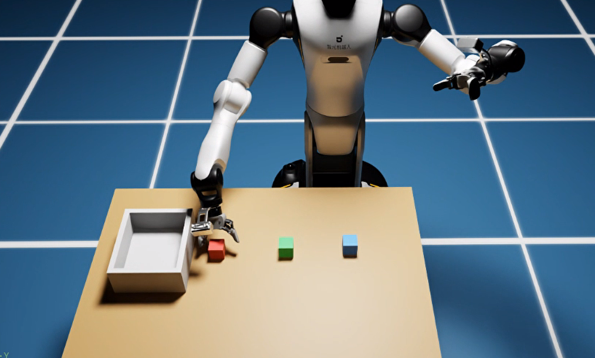
  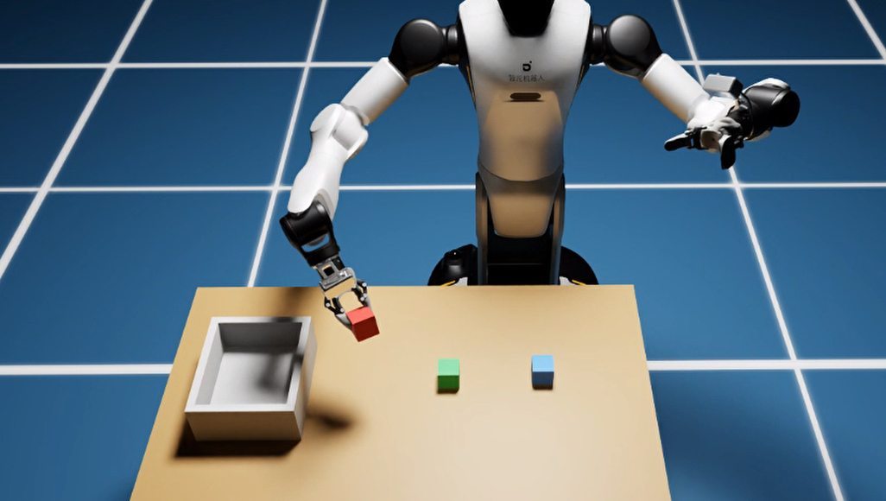
</div>

<div style="display: flex; justify-content: center; gap: 16px;">
  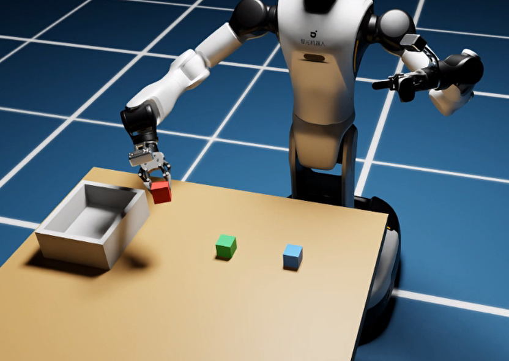
  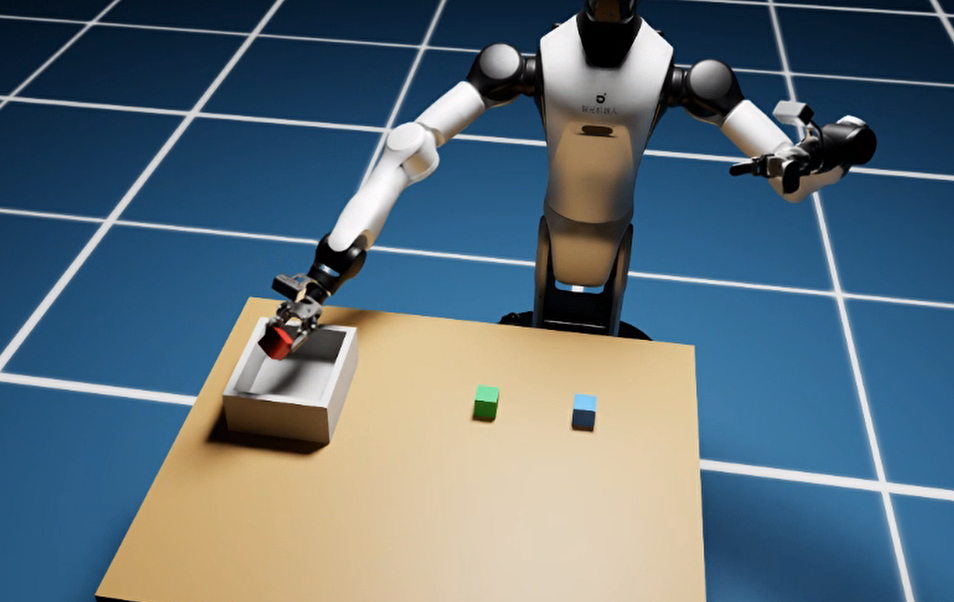
</div>

红色的物块10次大概能成功4-6次左右，但是有的也是抓边成功的，蓝色和绿色物块的抓取效果并不好，可能是因为采集的数据本来就是全自动采集，并不像人工采集那样的精准，同时，世界模型的未来帧生成也会存在误差，绿色和蓝色的物块本来就不在右机械臂方便夹取的位置，需要斜向抓取，所以大大降低了成功率。

初步考虑是lora微调并不能够完全解决跨机器人泛化存在的问题，因为motus模型本身并没有基于g2机器人进行训练微调，机器人的动作维度也不同，所以可能会存在一定的问题，有条件的可以考虑采用全量微调尝试一下。

通过微调，已经证明了世界模型学习机器人操作的可行性，本章主要是让大家对世界模型的具体实现和应用有一个具象的理解，方便大家进行后续更加深入的科研学习～

默认等待推理时仿真继续刷新。若要冻结等待期，需显式增加：

```text
--pause-during-inference
```

是否冻结需要写入实验记录。当前输出 JSON 并没有自动保存服务端 checkpoint、全部随机种子、全部等待参数和依赖版本，因此还应保留启动命令、服务日志及模型配置；仅保留成功率 JSON 不足以完整复现实验。

推理模型与 Isaac Sim 都可能使用 GPU。即使训练能在两张卡上运行，也不能保证把推理、仿真与其他程序放在同一张卡上仍有足够显存。应先结束不再需要的训练进程，并根据设备资源分别配置进程使用的 GPU。

### 5.8 official 评测结果判读与失败定位

评测沿用上一节的 `official` 命令。比较不同 checkpoint 或不同训练配方时，应保持完整动作块协议、场景分布、等待方式及随机种子设置一致，避免把执行设置变化误认为模型能力提升。

评测输出是逐条 episode 的 JSON 列表，可以汇总每种颜色的成功次数与成功率：

```bash
python3 - <<'PY'
import json
from pathlib import Path

path = Path("outputs/eval_pickplace_v2.json")
rows = json.loads(path.read_text(encoding="utf-8"))
if not rows:
    raise SystemExit("没有可统计的评测记录")

for color in sorted({row["color"] for row in rows}):
    group = [row for row in rows if row["color"] == color]
    success = sum(bool(row["success"]) for row in group)
    print(f"{color}: {success}/{len(group)} = {success / len(group):.1%}")

total_success = sum(bool(row["success"]) for row in rows)
print(f"overall: {total_success}/{len(rows)} = {total_success / len(rows):.1%}")
print("protocols:", sorted({row.get("protocol", "unknown") for row in rows}))
print("errors:", sum(str(row.get("reason", "")).startswith("error:") for row in rows))
PY
```

统计之前先确认 episode 数是否达到预期。脚本在每条 episode 后写入结果，因此被中断的评测文件也可能是合法 JSON，但不代表全部试验完成。服务连接或推理错误同样需要单独报告，不能悄悄从分母中删除后仍声称是完整测试。

单条报告中的主要诊断字段如下：

| 字段 | 解释 |
|---|---|
| `success`、`reason` | 是否成功，失败或异常的原因 |
| `protocol`、`execution_mode` | 应分别为 `motus_official_full_chunk` 与 `official`，确认采用完整动作块协议 |
| `execute_steps`、`replans`、`executed_actions` | 每轮执行长度应为 16；其余两项记录实际预测轮数与已执行动作数量 |
| `limited_fraction` | 因关节物理范围裁剪而被修改的动作比例 |
| `max_raw_arm_delta` | 原始目标相对当前实测状态的最大臂关节变化 |
| `max_raw_gripper_delta` | 原始夹爪目标相对当前状态的最大变化 |
| `right_gripper_target_range` | 最终应用的右夹爪目标范围 |
| `inside_box`、`final_block_position` | 最终物块位置与盒内判定 |
| `seconds` | 整条任务的墙钟耗时，不是纯模型推理延迟 |

在 `official` 模式中，`limited_fraction` 只反映关节物理范围裁剪，不表示施加了逐步动作变化限制。平滑插值负责把当前实测状态连接到目标，物理范围裁剪负责把目标限制在允许区间，两者不是同一件事。

推荐按以下顺序定位失败：

1. **目标选错**：先看文本规范、颜色数据和条件图，再看未来预测是否也选择错误物块。
2. **机械臂几乎不动或动作滞后**：核对命令监督是否被实测状态替代，以及时间采样是否匹配。
3. **目标跳变大、频繁触发关节范围裁剪**：检查绝对目标与增量目标是否混用、动作维度与顺序是否正确。
4. **碰到物块但抓不住**：检查夹爪符号、闭合时机、状态—命令差异与接触轨迹。
5. **抓起后立即掉落**：对照预测动作中是否提前打开夹爪，区分模型动作问题与物理接触问题。
6. **视频很好看但控制失败**：不要把生成画面当作真实动力学证据，应对照实际动作与环境响应。
7. **任务执行耗时较长**：统计完整动作块的预测轮数与墙钟耗时，区分动作执行时间和模型推理等待，检查耗时是否主要来自大模型推理。

本章不把历史日志中的某次成功、官方 RoboTwin 的公开指标或不同数据语义下的旧 checkpoint，当成当前 G2 配方的效果保证。最终结果应来自读者实际完成、设置明确且可重复的评测。

### 5.9 常见问题与复现检查清单

| 现象 | 应优先检查什么 |
|---|---|
| 找不到 `models`、`wan` 或 `sample` | 本章 `Motus` 子目录是否完整，当前终端的 `MOTUS_ROOT` 是否指向该目录，是否误用了上一级旧副本 |
| 找不到 `pytest` 或深度学习依赖 | 是否已激活安装依赖的环境，`python3 -c 'import sys; print(sys.executable)'` 是否输出预期解释器 |
| Qwen 相关接口报错 | 是否随意升级了 Transformers，是否遵循本章固定接口版本 |
| 缺少 T5 cache | 是否执行 `--encode-t5`，指令及场景前缀是否与缓存完全一致 |
| 找不到 `commands/*.pt` | 是否仍使用旧处理结果，应从含 `command` 的 raw NPZ 重新转换 |
| 原始轨迹没有 `command` | 不能从实测状态无损恢复专家命令，应重新采集或取得原始命令流 |
| checkpoint 形状不匹配 | 是否误用 14 维 RoboTwin 模型，是否按 G2 16 维结构和正确 adapter 恢复 |
| adapter 提示可训练张量缺失 | 文件是否保存完整，LoRA 配置和接口参数是否与训练时一致 |
| 训练入口拒绝配置 | 当前入口只接受 LoRA 主线，不应直接使用保留的非 LoRA 参考 YAML |
| 测试只在 8000 与 6000 比较处失败 | 当前正式 YAML 与旧测试预期未同步，应明确配方后再处理 |
| 双卡验证阶段停住 | 检查 rank 执行差异、验证调用和分布式同步，而不是反复更换 seed |
| 推理 OOM | 检查基础模型、VAE、注意力、其他进程与仿真共卡占用；小 adapter 不等于小运行内存 |
| 仿真等待时物块位置变化 | 默认物理世界仍在前进，可对照暂停等待，但要记录实验差异 |
| 相同输入多次请求动作不同 | 默认随机状态持续推进；逐请求重新设种子仅用于明确标注的消融 |
| adapter 续训曲线不连续 | 默认未恢复优化器与调度器状态，不能视为精确断点续训 |

进入长时间训练或批量评测前，建议完成以下检查：

- [ ] 当前条件图像、实测状态和任务文本来自同一时刻、同一任务。
- [ ] 动作标签来自命令流，而非实测状态的副本。
- [ ] 16 维顺序、绝对目标含义与夹爪符号在采集、训练、推理和执行中一致。
- [ ] 30 Hz 原始记录、每三帧取动作、每两个动作取视频帧的关系正确。
- [ ] 三视图布局、图像预处理、文本前缀与 UMT5 缓存一致。
- [ ] 训练与验证按 episode 分离，理解了当前验证触发行为。
- [ ] 确认模型主体、Stage 2 基座、adapter 和环境版本均可追溯。
- [ ] 先验证小规模训练与推理加载，再运行正式训练。
- [ ] 将视频生成质量、动作合理性与真实任务成功分开评价。
- [ ] 保存评测命令，确认采用 `official` 且每轮完整执行 16 个动作目标，记录等待方式与随机种子。

---

## 第六部分 本章总结

本章从 VLA 与世界模型的区别出发，解释了 Motus 如何把任务理解、未来预测和动作生成放到同一套模型中。

最重要的不是记住几个模型名称，而是掌握下面这条逻辑：

**通用基础模型提供语义和生成先验 → 视频运动经过潜在动作表示变成可利用的预训练信号 → 三个专家通过联合注意力学习视频与动作的关系 → Stage 3 使用目标机器人的真实状态和命令完成适配 → 在部署中联合生成未来视频与动作，再通过实际观察形成控制闭环。**

世界模型回答行动后果，VLA 回答应当采取的行动；两者可以在统一模型中协同工作。潜在动作让没有关节标签的视频进入动作预训练，但不意味着视频运动天然就是可执行控制。流匹配让视频和动作沿噪声路径联合生成，但其数学速度场也不等于机器人关节速度。

落到工程上，决定教程能否真正复现的往往是容易忽略的细节：状态与命令是否分离、图像和动作是否对齐、动作维度和夹爪符号是否一致、加载的是 Stage 2 基座还是其他平台的成品策略，以及评测是否始终遵循 official 完整动作块协议、等待方式与随机种子是否记录清楚。

完成本章后，读者应能够沿着现有代码解释一条数据怎样变成训练样本，一次联合前向怎样产生两个速度场，一个 G2 adapter 怎样恢复成完整策略，以及预测出的动作怎样在仿真中执行。同时也应知道当前系统尚未完成什么：它没有候选动作搜索，没有基于预测未来的奖励优化，也没有因为生成了视频就获得精确物理仿真能力。

这为后续决策闭环实践提供了清晰基础：可以进一步研究如何利用未来预测进行失败检测、候选动作评价或任务级决策，但这些能力需要额外设计、实现与验证，不能仅凭“世界模型”这个名称推定已经具备。

**资料来源与版本说明**

本文以 `code/code_chapter16` 中的 G2 适配脚本及其 `Motus` 子目录组织工程说明；Motus 整体算法依据论文与官方公开资料解释。模型源码随本章目录提供，不再假设存在工程外的独立安装。涉及配置、调用接口和模型行为时，应以本章实际提供并验证的版本为准。主要资料如下：

- **Motus 论文**：*Motus: A Unified Latent Action World Model*，arXiv:2512.13030，本文核对 v1 的 §3、§4.1—§4.3 与附录 §7.1。主要用于世界模型/VLA 条件关系、MoT、光流潜在动作、数据金字塔、三阶段训练与五模式调度说明。
- **官方项目介绍**：公开项目 `thu-ml/Motus`。本章源码位于 `code/code_chapter16/Motus`。用于基础组件与公开训练、部署背景，不将官方基准成绩视为本章 G2 成绩。
- **本章 G2 实现**：`code/code_chapter16` 中的配置、数据转换、LoRA、推理、控制与测试文件。对应 16 维合同、命令监督、当前 6000 步正式配置、adapter 保存和本地评测行为。

本文中的训练与评测命令是复现步骤，不代表已在读者设备上完成训练，也不提供未经验证的成功率、收敛结论或显存保证。
