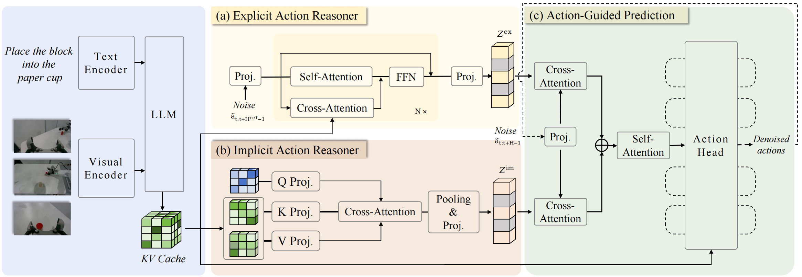

# 第十八章 ACoT-VLA 视觉语言动作模型部署

本章介绍 ACoT-VLA 的模型原理，并在 G2 Omnipicker“三色物块入盒”任务上完成数据采集、LeRobot 转换、模型微调、模型服务和 Isaac Sim 闭环评测。对应代码位于 `code/code_chapter18`。

---

## 第一部分 ACoT-VLA 模型原理

### 1.1 为什么直接从语义预测动作仍然困难

视觉语言动作模型接收图像、语言指令和机器人状态，并预测一段连续动作：

$$
A_{t:t+H-1}=\pi_\theta(o_t,\ell)
$$

其中 $o_t$ 表示当前视觉与机器人状态，$\ell$ 表示任务指令，$H$ 是动作时域。对于“将红色物块放入盒子”这类任务，模型不仅要识别红色物块和盒子，还要连续完成接近、下降、闭爪、抬升、搬运和释放。

语言指令能够说明“要做什么”，图像能够说明“环境是什么样”，低层控制却还需要回答“机械臂下一步具体怎样运动”。高层语义与连续关节动作之间并不存在唯一映射：同一条指令可能对应多条可行轨迹，相似图像也可能因为夹爪是否已经闭合、物块是否抓稳而需要完全不同的动作。这种高层输入与低层可执行运动之间的差距，通常称为**语义—运动学鸿沟**。

传统 VLA 直接让动作专家解决整个映射。ACoT-VLA 则在最终动作前加入动作空间引导：先形成较长时域的运动趋势，再据此生成当前需要执行的精细动作。

### 1.2 什么是 Action Chain-of-Thought

为了减小直接动作预测的歧义，一些方法会先生成中间结果，再用中间结果引导动作。不同方法的区别主要在于“思考”发生在哪个空间：

| 推理形式 | 中间表示 | 能提供的信息 | 对精确控制的局限 |
|---|---|---|---|
| Language CoT | 子任务或文本计划 | 任务阶段和语义关系 | 不直接包含连续运动参数 |
| Vision CoT | 目标图像或未来画面 | 空间布局和视觉目标 | 仍需从图像转换为机器人动作 |
| Action CoT | 粗粒度动作序列 | 运动方向、时序和动作趋势 | 需要额外的动作推理模块 |

ACoT-VLA 将中间引导记为 $g_{\mathrm{action}}$，并进一步分成显式和隐式两种形式：

$$
g_{\mathrm{action}}
=\left\{g_{\mathrm{action}}^{\mathrm{ex}},
g_{\mathrm{action}}^{\mathrm{im}}\right\}
$$

其中，$g_{\mathrm{action}}^{\mathrm{ex}}$ 是可以直接解释为参考轨迹的显式动作，$g_{\mathrm{action}}^{\mathrm{im}}$ 是从视觉语言特征中提取的隐式动作先验。最终策略在两类引导条件下预测动作：

$$
\pi_\theta(A,g_{\mathrm{action}}\mid o_t,\ell)
=\pi_\theta(A\mid o_t,\ell,g_{\mathrm{action}})
\pi_\theta(g_{\mathrm{action}}\mid o_t,\ell)
$$

这里的 Action Chain-of-Thought 不是一段自然语言解释，也不是“接近、抓取、放置”几个离散阶段标签。它仍然位于机器人动作空间中，只是用较粗的时间分辨率表达更长范围的运动意图。

### 1.3 ACoT-VLA 整体框架



<p align="center"><em>图 1　ACoT-VLA 由显式动作推理器、隐式动作推理器和动作引导预测组成（图片来源：<a href="https://github.com/AgibotTech/ACoT-VLA/blob/cb9d1953b82aa454a28f330cd421f988334b86dd/docs/framework.png">ACoT-VLA 官方仓库</a>）</em></p>

ACoT-VLA 以 VLM 为共享主干，并在动作侧加入三个组成部分：

| 模块 | 全称 | 作用 |
|---|---|---|
| EAR | Explicit Action Reasoner | 生成覆盖较长时间范围的粗粒度参考动作 |
| IAR | Implicit Action Reasoner | 从 VLM 内部表示中提取隐式动作先验 |
| AGP | Action-Guided Prediction | 融合显式与隐式引导，生成最终精细动作 |

完整数据流为：

```text
图像 + 语言指令 + 机器人状态
                ↓
             VLM 主干
                ├── 多模态条件与 KV cache
                │
                ├── EAR ──→ 显式粗动作 Z_ex
                │
                └── IAR ──→ 隐式动作先验 Z_im
                                  ↓
                      AGP + 精细动作专家
                                  ↓
                         可执行 fine action
```

以三色物块任务为例，EAR 负责提供“从当前位置接近物块、抓起并移向盒子”的整体运动趋势，IAR 补充物块可供性、空间关系和当前抓取状态等隐式信息，AGP 再生成当前闭环真正需要执行的精细关节动作。

### 1.4 EAR：生成显式粗动作参考

显式动作推理器 EAR 是一个轻量 Transformer 动作专家。VLM 首先对当前观测和指令进行编码，并产生多层 key-value cache：

$$
\left(K_{1:N}^{\mathrm{VLM}},V_{1:N}^{\mathrm{VLM}}\right)
=\operatorname{VLM}(o_t,\ell)
$$

EAR 输入一段带噪参考动作。其 self-attention 建模动作序列内部的时间关系，cross-attention 则从相应的 VLM 层读取多模态条件：

$$
\widetilde{h}_i^{\mathrm{ref}}
=\operatorname{SelfAttn}(h_{i-1}^{\mathrm{ref}})
+\operatorname{CrossAttn}
\left(h_{i-1}^{\mathrm{ref}},K_i^{\mathrm{VLM}},V_i^{\mathrm{VLM}}\right)
$$

这样得到的 coarse action 仍是连续动作向量，只是采样更稀、覆盖时间更长。对物块入盒任务，可以将它直观理解为一条粗略路线图，但它不是预先编写的“接近—抓取—放置”状态机。

EAR 通过 flow matching 学习参考动作分布。设真实粗动作序列为 $A_t^{\mathrm{ref}}$，高斯噪声为 $\epsilon^{\mathrm{ref}}$，流匹配时间为 $\tau\in(0,1)$：

$$
X_\tau^{\mathrm{ref}}
=\tau\epsilon^{\mathrm{ref}}+(1-\tau)A_t^{\mathrm{ref}}
$$

$$
U_\tau^{\mathrm{ref}}
=\epsilon^{\mathrm{ref}}-A_t^{\mathrm{ref}}
$$

EAR 学习预测速度场 $v_\theta^{\mathrm{ref}}$：

$$
\mathcal{L}_{\mathrm{coarse}}
=\mathbb{E}\left[
\left\|
v_\theta^{\mathrm{ref}}(X_\tau^{\mathrm{ref}},o_t,\ell,\tau)
-U_\tau^{\mathrm{ref}}
\right\|_2^2
\right]
$$

推理时，EAR 从随机噪声出发迭代积分速度场，得到参考动作 $A_t^{\mathrm{ref}}$，再投影成显式动作表示 $Z^{\mathrm{ex}}$。代码中的 `coarse_action_expert`、`coarse_action_in_proj` 和 `coarse_action_out_proj` 对应这条分支。

### 1.5 IAR：从 VLM 中提取隐式动作先验

显式轨迹能够给出大致运动方向，但并不能完整表达 VLM 已经理解的所有信息。例如，图像中的可抓取区域、物块与夹爪的空间关系，以及“抓起”一词隐含的闭爪倾向，都可能存在于 VLM 的内部特征中，却没有直接表现为一条参考轨迹。

隐式动作推理器 IAR 直接读取 VLM 各层的 KV cache。它先将 learnable query、key 和 value 投影到较低维空间，再通过 cross-attention 提取动作相关信息：

$$
z_i^{\mathrm{im}}
=\operatorname{MLP}\left(
\operatorname{Pool}\left(
\operatorname{CrossAttn}(Q_i',K_i',V_i')
\right)\right)
$$

不同 VLM 层产生的表示被聚合为 $Z^{\mathrm{im}}$，作为隐式动作引导。IAR 不会再输出一套供机器人执行的关节轨迹，也没有单独的“隐式动作标签”；它通过最终精细动作损失与整个网络一起学习。

EAR 与 IAR 的关系可以概括为：

- EAR 像一条明确的粗略路线，提供运动学上可解释的参考；
- IAR 像模型从图像和语言中提炼出的动作经验，补充路线本身没有表达的信息。

本章采用 `DownsampleExtractor`，通过降维后的多层 KV cache 构造隐式动作表示。

### 1.6 AGP：生成最终精细动作

得到 $Z^{\mathrm{ex}}$ 和 $Z^{\mathrm{im}}$ 后，ACoT-VLA 使用 Action-Guided Prediction 生成最终动作。带噪的 fine action 先被编码为 action query $Q_{\mathrm{action}}$，再分别与显式、隐式引导交互：

$$
S^{\mathrm{ex}}
=\operatorname{CrossAttn}
(Q_{\mathrm{action}},Z^{\mathrm{ex}},Z^{\mathrm{ex}})
$$

$$
S^{\mathrm{im}}
=\operatorname{CrossAttn}
(Q_{\mathrm{action}},Z^{\mathrm{im}},Z^{\mathrm{im}})
$$

两类结果拼接后通过 self-attention 融合：

$$
\overline{h}
=\operatorname{SelfAttn}\left([S^{\mathrm{ex}};S^{\mathrm{im}}]\right)
$$

精细动作专家根据融合特征预测 fine action 的去噪速度场，最终得到可执行动作序列。显式与隐式信息强调的内容不同：前者提供运动轨迹约束，后者提供上下文相关的动作倾向；AGP 的作用不是简单相加，而是让当前 fine action 主动查询两类引导。

需要特别注意：**机器人只执行 fine action。** coarse action 是模型内部的推理结果，不会在执行 fine action 前单独播放一遍。

### 1.7 训练与推理为什么不同

ACoT-VLA 同时训练 coarse 和 fine 两个 flow matching 目标：

$$
\mathcal{L}_{\mathrm{total}}
=\lambda_1\mathcal{L}_{\mathrm{coarse}}
+\lambda_2\mathcal{L}_{\mathrm{fine}}
$$

论文使用两项等权组合。本章同样计算
`coarse_loss + fine_loss`，两者的相对权重为 $1:1$。

训练初期 EAR 生成的 coarse action 还不稳定。若立即把错误粗轨迹交给 fine 分支，两个分支会相互干扰。ACoT-VLA 因此使用 teacher forcing：

| 阶段 | coarse action 来源 | fine action 的条件 |
|---|---|---|
| 训练 | 数据集中的真实 coarse action | 真实 coarse action + IAR |
| 推理 | EAR 从噪声生成 | EAR 预测 coarse action + IAR |

对应流程可以简化为：

```text
训练：真实 coarse ──→ EAR ──→ coarse loss
      真实 coarse + IAR + 带噪 fine ──→ fine branch ──→ fine loss

推理：coarse 噪声 ──→ EAR ──→ predicted coarse
      predicted coarse + IAR + fine 噪声 ──→ fine branch ──→ fine action ──→ 执行
```

训练时 fine 分支使用真实 coarse 标签，推理时改用 EAR 预测的 coarse action；机器人始终只执行 fine action。

teacher forcing 能稳定训练，但也意味着训练时 fine 分支看到的 coarse action 比推理时更准确。因此不能只根据训练 loss 判断模型是否可用，必须进一步进行真实的两阶段离线推理和 Isaac Sim 闭环评测。

### 1.8 与 π0.5 的关系

ACoT-VLA 沿用 π0.5 的视觉语言主干、状态条件和连续动作 flow matching 基础，在动作侧增加 coarse action expert、IAR 和动作引导融合：

| 项目 | π0.5 | ACoT-VLA |
|---|---|---|
| 视觉语言主干 | PaliGemma | 沿用 PaliGemma |
| 动作专家 | 一个 fine action expert | coarse + fine 两个 action expert |
| 中间动作推理 | 无 | EAR + IAR |
| 训练监督 | fine action | coarse action + fine action |
| 推理过程 | 一阶段动作去噪 | 先 coarse、后 fine 的两阶段去噪 |
| 实际执行 | fine action | 仍然只执行 fine action |

因此，ACoT-VLA 不是简单把 π0.5 的模型名称替换掉。数据管线必须同时提供 coarse/fine 监督，checkpoint 必须包含新增模块，服务端也必须按照训练时的两个 horizon 构造模型。

### 1.9 ACoT-VLA 在代码中如何运行

ACoT-VLA 的核心实现位于官方仓库的 `acotvla/src/openpi/models/acot_vla.py`。本章主要使用其中的模型初始化、训练和推理逻辑。

首先，`training/g2_policy.py` 中的 `make_model_config()` 打开 EAR、IAR，并设置两级动作长度：

```python
return acot_vla.ACOTConfig(
    action_dim=32,
    coarse_action_horizon=50,
    action_horizon=30,
    adopt_explicit_action_reasoner=True,
    adopt_implicit_action_reasoner=True,
    downsample_based_implicit_extractor=True,
)
```

EAR 生成 50 步 coarse action，fine action expert 生成 30 步精细动作；IAR 使用降采样提取器读取视觉语言特征。

模型初始化时，`ACOT_VLA.__init__()` 创建双动作专家和推理模块。下面省略了维度等构造参数：

```python
llm = _gemma.Module(
    configs=[paligemma_config, coarse_action_expert_config, action_expert_config]
)
self.explicit_action_reasoner = UnifiedAttentionModule(...)
self.implicit_action_reasoner = DownsampleExtractor(...)
self.action_reasoning_fusion = UnifiedAttentionModule(...)
```

三个 Gemma 配置分别对应 VLM、coarse action expert 和 fine action expert。coarse action expert 与 `explicit_action_reasoner` 共同形成显式粗动作分支；`implicit_action_reasoner` 从 VLM 的 KV cache 中提取动作先验；`action_reasoning_fusion` 将两类信息融合后交给 fine action expert。

训练时，`G2ACOTInputs` 先从同一条专家轨迹中构造两份标签：

```python
for key, horizon, stride in (
    ("coarse_actions", 50, 2),
    ("actions", 30, 1),
):
    required = (horizon - 1) * stride + 1
    sampled = raw_actions[:required:stride]
    result[key] = transforms.pad_to_dim(sampled, 32)
```

因此，`coarse_actions` 是间隔为 2 的 50 步序列，`actions` 是连续的 30 步序列。两者补齐到 32 维后传给 `compute_loss()`。

`compute_loss()` 先从 VLM 的 KV cache 中提取 IAR 特征。训练阶段不使用 EAR 尚不稳定的预测结果，而是把真实 coarse action 交给 fine 分支：

```python
implicit_action_reason = self.implicit_action_reasoner(
    K_rearranged, V_rearranged
)

# teacher forcing
explicit_action_reason = coarse_actions

suffix_expert_tokens = self.embed_suffix(
    observation,
    x_expert_t,
    time,
    explicit_action_reason=explicit_action_reason,
    implicit_action_reason=implicit_action_reason,
    suf_type="expert",
)[0]
```

EAR 和 fine action expert 分别预测各自的 flow matching 速度场，函数最后返回两项损失之和：

```python
action_diff_ref = u_ref_t - v_ref_t
action_diff_expert = u_expert_t - v_expert_t
return (
    jnp.mean(jnp.square(action_diff_ref))
    + jnp.mean(jnp.square(action_diff_expert))
)
```

推理入口 `sample_actions()` 没有真实 coarse action，因此先运行 EAR 的去噪循环，再运行 fine action expert 的去噪循环：

```python
explicit_action_reason, _, _ = jax.lax.while_loop(
    cond_explicit_action_reasoner,
    step_explicit_action_reasoner,
    (ref_action_noise, 1.0, 1),
)

x_0_expert, _, _ = jax.lax.while_loop(
    cond_expert,
    step_expert,
    (expert_action_noise, 1.0, 1),
)
```

第一个循环的 `explicit_action_reason` 就是预测的 coarse action。第二个循环始终使用它和 IAR 特征作为条件。模型虽然同时返回两级动作，但机器人只执行 fine action：

```python
return {
    "actions": x_0_expert,
    "coarse_actions": explicit_action_reason,
}
```

最后，`G2ACOTOutputs` 将 fine action 从 32 维裁回 G2 的 16 维关节顺序。coarse action 留作模型内部引导和调试，不会直接发送给机器人。

---

## 第二部分 G2 任务与代码设计

### 2.1 任务定义

任务场景包含 G2 Omnipicker、桌面、空盒和红、绿、蓝三个边长 50 mm 的物块。单个 episode 只要求抓取指定颜色物块并放入空盒。三种指令为：

```text
Pick up the red block and place it into the empty box.
Pick up the green block and place it into the empty box.
Pick up the blue block and place it into the empty box.
```

三种颜色使用同一套模型和同一个 LeRobot 数据集，由指令区分目标物体。训练集每种颜色各 20 条成功轨迹，共 60 条。

场景的关键几何配置集中在 `config.py`：

| 参数 | 数值 | 含义 |
|---|---:|---|
| `block_size` | `0.050` | 物块边长 50 mm |
| `position_noise` | `0.01` | 标称位置附近 ±10 mm 随机化 |
| `pregrasp_clearance` | `0.18` | 预抓取点位于物块上方 18 cm |
| `grasp_clearances` | `(0.010, 0.000, 0.000)` | RGB 三个抓取高度补偿 |
| `place_clearance` | `0.13` | 放置阶段的盒体上方余量 |

这些数值与末端执行器坐标、夹爪几何形状和物块可达性相关。若更换机器人 USD、夹爪或物块尺寸，必须重新验证抓取点，不应直接沿用补偿量。

### 2.2 代码目录

```text
code_chapter18/
├── acotvla/                       # 从官方仓库克隆的 ACoT-VLA 源码
├── assets/                        # 训练生成的归一化统计
├── checkpoints/                   # 初始化权重与训练输出
├── data/
│   ├── raw/                       # NPZ 专家轨迹
│   └── lerobot/                   # LeRobot 数据集
├── results/                       # 评测 JSON
├── training/
│   ├── convert_dataset.py         # NPZ -> LeRobot
│   ├── compute_norm_stats.py      # 归一化统计
│   ├── g2_policy.py               # G2/ACoT 数据与模型适配
│   ├── train.py                   # 微调入口
│   └── serve_model.py             # 模型服务
├── collect_demos.py               # 专家采集
├── smoke_collect.py               # 小规模采集与动作回放验收
├── config.py                      # 场景与控制合同
├── dataset.py                     # NPZ 记录器
├── expert.py                      # 脚本专家与 IK 路径
├── robot.py                       # G2 状态与关节命令
├── simulation.py                  # Isaac Sim 场景
├── vla_client.py                  # 客户端与动作块执行
├── run_inference.py               # 有窗口交互推理
└── evaluate_acot_policy.py        # RGB 独立任务评测
```

### 2.3 数据与控制合同

| 类别 | 设置 |
|---|---|
| 物理频率 | 120 Hz |
| 数据与模型动作频率 | 30 Hz |
| 低层执行 | 每个 30 Hz 关节目标保持 4 个 120 Hz 物理步 |
| 图像 | 头部、左腕、右腕三路 RGB，`240×320×3` |
| 原始状态 | 16 维绝对值 |
| 原始动作 | 16 维绝对关节目标 |
| 关节顺序 | 左臂 7 + 右臂 7 + 左夹爪 1 + 右夹爪 1 |
| 模型内部维度 | 32 |
| 训练动作语义 | 双臂 14 维 delta，双夹爪 absolute |
| 推理对外语义 | 16 维绝对关节目标 |

“原始动作是 absolute”和“训练使用 delta”并不矛盾。NPZ 与 LeRobot 保存专家真正下发的关节目标；训练 transform 将双臂动作减去当前状态。模型输出后使用逆变换恢复 absolute 目标，Isaac Sim 不会直接执行 delta。

### 2.4 同一轨迹如何形成 coarse/fine 监督

本章不需要额外采集一批“粗轨迹”。对每个当前观测 $o_t$，数据加载器从同一条 30 Hz 专家轨迹中构造两个未来动作序列：

$$
A_t^{\mathrm{coarse}}
=\{a_t,a_{t+2},a_{t+4},\ldots,a_{t+98}\}
$$

$$
A_t^{\mathrm{fine}}
=\{a_t,a_{t+1},a_{t+2},\ldots,a_{t+29}\}
$$

- coarse horizon = 50，stride = 2，覆盖约 $(50-1)\times2/30=3.27$ s；
- fine horizon = 30，stride = 1，覆盖约 $(30-1)/30=0.97$ s。

可以将它理解为：**coarse 看得更远但时间采样更稀，fine 看得更近并保留每个 30 Hz 动作。**

官方代码默认时域与本章 G2 设置不同。`50/30` 不是论文对所有机器人的通用推荐，而是结合本任务 30 Hz 数据频率和约 8.5 s 轨迹所做的适配。更换数据频率时，应先比较真实时间覆盖，不要只照搬 horizon 数字。

| 配置 | coarse horizon | fine horizon | stride |
|---|---:|---:|---:|
| ACoT-VLA 论文默认设置 | 15 | 10 | `(2,1)` |
| 本章 G2 适配 | 50 | 30 | `(2,1)` |

这张表只比较序列索引，不能脱离各数据集的控制频率直接判断谁“更长”。本章的 coarse 分支提供约 3.27 s 的动作参考，fine 分支保留接近 1 s 的连续局部动作；机器人通过持续重规划完成整条任务。

### 2.5 16 维物理接口与 32 维模型接口

ACoT-VLA 的 `action_dim` 为 32，G2 本任务只使用 16 个状态和动作维度。`G2ACOTInputs` 将后 16 维补零，同时构造 coarse/fine 两套 32 维序列。归一化统计必须在变换后空间计算，因此得到三组 32 维统计：

```text
state
coarse_actions
actions
```

`G2ACOTOutputs` 在模型输出经过去归一化和 absolute 逆变换后，只取前 16 维交给 G2。补零仅是模型适配，不会让仿真机器人多出 16 个关节。

### 2.6 完整数据流

```text
脚本专家
  └── NPZ: 三路图像 + state16 + action16 + prompt
        └── LeRobot 30 Hz
              ├── coarse: 50 步, stride 2
              └── fine:   30 步, stride 1
                    └── pad 16 -> 32
                          └── arm delta + gripper absolute
                                └── coarse/fine flow matching

Isaac Sim 当前观测
  └── 三路图像 + state16 + prompt
        └── 归一化 -> ACoT-VLA -> fine(30, 32)
              └── 去归一化 + absolute 逆变换
                    └── 前 16 维 + execute_chunk=8
                          └── 每个目标执行 4 个物理步
```

---

## 第三部分 环境配置与数据处理

### 3.1 基础环境

本章沿用第一、二章配置的 Isaac Sim 环境，只新增 ACoT-VLA 官方训练环境。G2 机器人资产复用[第四章的仿真资源](../chapter4/第四章%20移动底盘运动学与控制.md)：已完成资源配置的读者无需重复下载；尚未配置时，按第四章开头的下载说明，将完整的 `assets` 文件夹放到项目的 `code/` 目录下。

机器人文件应位于 `code/assets/robot/G2_omnipicker/robot.usda`，而不是 `code/code_chapter18/assets/`。请保留资源目录中的依赖文件，不要只复制单个 USD 文件。

后文使用下面的示例路径，请根据实际安装位置修改：

```bash
export ACOT_CODE_ROOT=/home/robot/hello-robotics/code/code_chapter18
export ISAAC_SIM_ROOT=/home/robot/isaac-sim-5-1
```

本章使用两套相互独立的 Python：

| 环境 | 启动方式 | 负责内容 |
|---|---|---|
| ACoT-VLA `.venv` | `acotvla/.venv/bin/python` | LeRobot 转换、归一化统计、训练和模型服务 |
| Isaac Sim Python | `$ISAAC_SIM_ROOT/python.sh` | 专家采集、相机渲染和机器人闭环执行 |

模型服务与 Isaac Sim 客户端通过 WebSocket 通信。JAX、Flax、LeRobot 和训练依赖只安装在 ACoT-VLA 环境中，不要安装进 Isaac Sim 自带的 Python。

#### 1. 安装基础工具与 uv

ACoT-VLA 官方使用 `uv` 管理 Python 和依赖。在 Ubuntu 中执行：

```bash
sudo apt update
sudo apt install -y git curl

curl -LsSf https://astral.sh/uv/install.sh | sh
source "$HOME/.local/bin/env"
uv --version
```

#### 2. 克隆官方 ACoT-VLA

将[官方仓库](https://github.com/AgibotTech/ACoT-VLA)克隆到第十八章代码目录下：

```bash
cd "$ACOT_CODE_ROOT"
git clone https://github.com/AgibotTech/ACoT-VLA.git acotvla
cd acotvla
git checkout cb9d1953b82aa454a28f330cd421f988334b86dd
git submodule update --init --recursive
```

固定 commit 可以避免上游代码更新后依赖或接口发生变化。该 commit 来自官方 `main` 分支，并与本章 G2 适配代码匹配。

#### 3. 创建训练环境

按照官方流程同步依赖并以 editable 模式安装 ACoT-VLA：

```bash
cd "$ACOT_CODE_ROOT/acotvla"
GIT_LFS_SKIP_SMUDGE=1 uv sync
GIT_LFS_SKIP_SMUDGE=1 uv pip install -e .
```

环境创建在 `code_chapter18/acotvla/.venv`。之后的数据转换、统计、训练和模型服务命令都使用其中的 Python。

官方 `pyproject.toml` 要求 Python 3.11 及以上，并锁定 CUDA 12 版本的 JAX。应让 `uv sync` 按仓库中的 `uv.lock` 安装整套依赖，不要再单独升级 JAX、Flax、Orbax 或 Transformers。

Isaac Sim 客户端沿用前面章节已经配置好的仿真环境，无需重复安装依赖。

#### 4. 验证训练环境

```bash
cd "$ACOT_CODE_ROOT"
acotvla/.venv/bin/python - <<'PY'
import jax
import openpi

print("openpi:", openpi.__file__)
print("devices:", jax.devices())
PY
```

`openpi` 应指向 `$ACOT_CODE_ROOT/acotvla/src/openpi`，`devices` 应包含用于训练的 NVIDIA GPU。若只显示 CPU，应先检查驱动、CUDA 和 JAX 环境，再进行权重下载和数据处理。

后续命令的解释器选择应保持固定：`training/` 下的脚本使用 `acotvla/.venv/bin/python`，采集与闭环推理脚本使用前面章节配置的 `$ISAAC_SIM_ROOT/python.sh`。

### 3.2 准备初始化 checkpoint

本章从 OpenPI 官方 `pi05_base` checkpoint 初始化 π0.5 主干和动作专家。运行下载脚本：

```bash
cd "$ACOT_CODE_ROOT"
bash download_checkpoint.sh
```

下载源为 `gs://openpi-assets/checkpoints/pi05_base`，权重保存到：

```text
checkpoints/base/pi05_base/
└── params/
```

下载脚本调用 OpenPI 自带的下载器获取权重，不需要额外安装 `gsutil`。模型加载 `pi05_base` 中可复用的参数，其余参数随机初始化。

### 3.3 采集 60 条成功轨迹

专家按 `red → green → blue` 循环选择目标颜色。路径由回到 home、移动至预抓取点、下降、闭合右夹爪、抬升、移动到盒子上方、放置和撤离组成。保存的 action 是专家下发的 16 维关节目标，state 是同一时刻从仿真机器人读回的 16 维状态。

#### 1. 先验收采集与回放

先试采 RGB 各一条，再将保存的动作交给推理端执行器回放。此步骤不需要模型服务，用于检查专家抓取、观测同步及动作执行方式。

```bash
cd "$ACOT_CODE_ROOT"
"$ISAAC_SIM_ROOT/python.sh" smoke_collect.py \
  --seed 15 \
  --position-noise 0.01 \
  --output results/collection_smoke \
  --headless
```

每次运行都会在 `results/collection_smoke/` 下创建独立子目录，保存试采 NPZ 和 `report.json`，不会覆盖正式数据。只有 RGB 采集与回放均成功、数据维度和真实频率检查通过时，脚本才输出 `[验收通过]` 并以状态码 0 退出。未通过时先检查报告，不要直接开始正式采集或训练。可更换 `--seed` 重复验收；移除 `--headless` 可观察仿真窗口。

这是数据与执行器的验收，不是模型闭环成功率评测。

#### 2. 正式采集

```bash
cd "$ACOT_CODE_ROOT"
"$ISAAC_SIM_ROOT/python.sh" collect_demos.py \
  --episodes 60 \
  --seed 15 \
  --dataset-fps 30 \
  --position-noise 0.01 \
  --max-attempts 3 \
  --headless \
  --overwrite
```

`--dataset-fps 30` 指定专家目标和数据保存频率。专家与推理共用动作执行函数：每个绝对关节目标保持 `120 / 30 = 4` 个物理步，每个目标保存一帧。专家仍沿原抓取路径生成平滑变化的目标，不在这 4 步内额外下发未记录的动作。

每次下发目标前，先在不推进物理的情况下刷新三路相机，检查图像时间戳与当前仿真时间一致，再读取关节状态。图像与状态描述当前观测，`actions` 是随后一个控制周期实际保持的目标。

每个 episode ID 只在成功后保存。某次尝试失败时，脚本复位场景并重试同一 episode，失败轨迹不写入训练集。同一 episode 连续失败 3 次时脚本停止，避免专家几何或接触已经异常时无限采集。

每条 NPZ 的核心字段如下：

| 字段 | 形状或类型 | 含义 |
|---|---|---|
| `head_image` | `(T, 240, 320, 3)` | 头部 RGB |
| `left_image` | `(T, 240, 320, 3)` | 左腕 RGB |
| `right_image` | `(T, 240, 320, 3)` | 右腕 RGB |
| `state` | `(T, 16)` | G2 实测状态 |
| `actions` | `(T, 16)` | 专家绝对关节目标 |
| `observation_time` | `(T,)` | 观测时刻，单位为仿真秒 |
| `image_time` | `(T, 3)` | 三路图像的真实时间戳，与观测时刻一致 |
| `prompt` | string | 任务指令 |
| `target_color` | string | 目标颜色 |
| `success` | bool | 成功标记 |

脚本专家调度为 8.5 s，在 30 Hz 下对应 255 帧。这些帧来自完整分阶段轨迹，不在末尾补入静止帧。

### 3.4 检查原始数据

```bash
cd "$ACOT_CODE_ROOT"
acotvla/.venv/bin/python - <<'PY'
from collections import Counter
from pathlib import Path
import numpy as np

paths = sorted(Path("data/raw").glob("episode_*.npz"))
assert paths, "data/raw 中没有轨迹，请先完成采集"
assert len(paths) == 60, f"需要 60 条轨迹，当前为 {len(paths)}"
colors = Counter()
lengths = Counter()

for path in paths:
    with np.load(path, allow_pickle=False) as data:
        assert bool(data["success"])
        frames = len(data["state"])
        assert frames == 255
        assert int(data["fps"]) == 30
        for key in ("state", "actions"):
            assert data[key].shape == (frames, 16), (path.name, key)
            assert np.isfinite(data[key]).all(), (path.name, key)
        for key in ("head_image", "left_image", "right_image"):
            assert data[key].shape == (frames, 240, 320, 3), (path.name, key)
            assert data[key].dtype == np.uint8, (path.name, key)
        assert data["observation_time"].shape == (frames,)
        assert data["image_time"].shape == (frames, 3)
        assert np.isfinite(data["observation_time"]).all()
        assert np.isfinite(data["image_time"]).all()
        assert np.allclose(data["image_time"], data["observation_time"][:, None], rtol=0, atol=1e-6)
        assert np.allclose(np.diff(data["observation_time"]), 1 / 30, rtol=0, atol=1e-6)
        colors[str(data["target_color"])] += 1
        lengths[frames] += 1

assert colors == Counter({"red": 20, "green": 20, "blue": 20}), colors
print("episodes:", len(paths))
print("colors:", dict(colors))
print("lengths:", dict(lengths))
PY
```

预期输出：

```text
episodes: 60
colors: {'red': 20, 'green': 20, 'blue': 20}
lengths: {255: 60}
```

结构检查通过后还应抽查三种颜色的图像或视频，确认相机没有黑屏、夹爪与目标一致，且轨迹结束时物块确实在盒内。

### 3.5 转换为 LeRobot 数据集

```bash
cd "$ACOT_CODE_ROOT"
acotvla/.venv/bin/python training/convert_dataset.py --overwrite
```

转换脚本会强制检查：

- 恰好有 60 条成功轨迹；
- Red、Green、Blue 各 20 条；
- 每条轨迹 255 帧；
- 图像、state 和 action 的长度一致；
- state/action 均为 16 维；
- LeRobot `fps` 为 30。
- 真实采样间隔为 1/30 秒，三路图像时间戳与状态一致；缺少时间戳的旧数据不用于本配置。

输出位于：

```text
data/lerobot/acotvla_g2_blocks/g2_blocks_30hz_synced_hold_v2
```

正常结果为 60 episodes、15,300 frames、30 fps。三路图像使用 LeRobot 视频存储。

### 3.6 计算 ACoT-VLA 归一化统计

```bash
cd "$ACOT_CODE_ROOT"
acotvla/.venv/bin/python training/compute_norm_stats.py \
  --coarse-horizon 50 \
  --action-horizon 30
```

脚本在 CPU 上遍历数据，并复用正式训练的变换语义：

1. 16 维 state/action 补到 32 维；
2. 按 stride 2/1 构造 coarse/fine 动作；
3. 双臂 14 维转换为相对当前 state 的 delta；
4. 两个夹爪保持 absolute；
5. 使用 float64 累积统计，避免近常量维度数值抵消；
6. 验证归一化最大绝对值和左夹爪常量标签。

预期末尾信息类似：

```text
[归一化检查] state: ...
[归一化检查] coarse_actions: ...
[归一化检查] actions: ...
[完成] 归一化统计：.../norm_stats.json
[维度] state=32 coarse=32 actions=32
```

π0.5 的归一化文件只包含 `state/actions`，不能用于 ACoT-VLA；后者需要 `state/coarse_actions/actions` 三组统计。

---

## 第四部分 模型训练

### 4.1 G2 ACoT-VLA 配置

`training/g2_policy.py` 是数据与模型的核心连接层，主要模型设置为：

```python
ACOTConfig(
    pi05=True,
    discrete_state_input=True,
    action_dim=32,
    coarse_action_horizon=50,
    action_horizon=30,
    max_token_len=200,
    paligemma_variant="gemma_2b_lora",
    coarse_action_expert_variant="gemma_300m",
    action_expert_variant="gemma_300m",
    adopt_explicit_action_reasoner=True,
    adopt_implicit_action_reasoner=True,
    downsample_based_implicit_extractor=True,
)
```

| 模块 | 微调方式 |
|---|---|
| 视觉主干 | 冻结 |
| PaliGemma 原始语言权重 | 冻结 |
| PaliGemma LoRA | 训练 |
| coarse action expert | 全量训练 |
| fine action expert | 全量训练 |
| EAR、IAR 与融合模块 | 全量训练 |

60 条固定场景数据不足以稳定更新完整视觉主干，因此保留预训练视觉能力。同时不能只训练 LoRA 而冻结全部 ACoT 模块，否则新的 coarse/fine 交互无法适配 G2 动作分布。

### 4.2 参考配置

单张 RTX 4090（24 GiB）可采用以下参考配置：

| 项目 | 参考值 |
|---|---:|
| batch size | 1 |
| train steps | 20,000 |
| save interval | 10,000 |
| optimizer | Adafactor |
| gradient clip | 1.0 |
| warmup | 2,000 steps |
| peak learning rate | `5e-5` |
| final learning rate | `1e-5` |
| EMA | 关闭 |
| coarse/fine | `50/30` |
| stride | `(2,1)` |

该配置用于复现本章任务，不等同于论文的完整基准配置。使用其他设备时可根据显存调整 batch size，并通过 `--ema` 控制是否保存 EMA 参数；修改优化器、EMA 或 batch size 后，应单独记录对应的实验配置。

### 4.3 先运行 10-step smoke test

正式训练前应真正执行多步前向、反向、优化器更新和 checkpoint 保存：

```bash
cd "$ACOT_CODE_ROOT"
CUDA_VISIBLE_DEVICES=0 acotvla/.venv/bin/python training/train.py \
  --exp-name acot_g2_h50_f30_smoke \
  --steps 10 \
  --save-interval 5 \
  --batch-size 1 \
  --coarse-horizon 50 \
  --action-horizon 30 \
  --overwrite
```

至少检查：

- `loss` 和梯度范数均为有限数；
- 梯度范数没有持续变为 NaN 或 Inf；
- 显存在 JIT 编译后进入稳定区间；
- step 5 和最终 step 均保存完整 `params`；
- 策略元数据为 30 Hz、16 维 G2、coarse/fine `50/30`。

smoke test 失败时应先修复数据或环境，不要直接开始长训练。

### 4.4 正式训练

```bash
cd "$ACOT_CODE_ROOT"
set -o pipefail
CUDA_VISIBLE_DEVICES=0 acotvla/.venv/bin/python training/train.py \
  --exp-name acot_g2_h50_f30_local \
  --steps 20000 \
  --save-interval 10000 \
  --batch-size 1 \
  --coarse-horizon 50 \
  --action-horizon 30 \
  --overwrite 2>&1 | tee results/acot_g2_h50_f30_local.train.log
```

训练入口默认关闭 JAX 预分配并使用 platform allocator，减少初始化显存峰值。输出目录为：

```text
checkpoints/acot_pi05_base_g2_blocks_lora/
└── acot_g2_h50_f30_local/
    ├── 10000/
    └── 19999/
```

最终 step 使用从 0 开始的编号，因此 20,000 次更新的最终目录是 `19999`。

### 4.5 如何判断训练正常

训练时需要同时观察 loss、梯度和闭环行为：

- loss 不是有限数或持续剧烈波动：检查 coarse/fine horizon、动作窗口和三组归一化统计；
- loss 下降但闭环乱摆：优先检查训练与服务的 horizon、归一化资产和动作逆变换；
- loss 很低但成功率不高：检查数据多样性、位置覆盖和专家抓取鲁棒性，不要盲目续训。

训练结束后还要核验 checkpoint 附近的归一化统计和策略元数据。一个只有 `params`、却无法确定数据版本和动作语义的目录，不应直接用于仿真执行。

---

## 第五部分 模型推理与仿真评测

### 5.1 启动模型服务

终端 A：

```bash
export ACOT_CODE_ROOT=/home/robot/hello-robotics/code/code_chapter18
cd "$ACOT_CODE_ROOT"

CUDA_VISIBLE_DEVICES=0 \
XLA_PYTHON_CLIENT_PREALLOCATE=false \
acotvla/.venv/bin/python training/serve_model.py \
  --checkpoint checkpoints/acot_pi05_base_g2_blocks_lora/acot_g2_h50_f30_local/19999 \
  --coarse-horizon 50 \
  --action-horizon 30 \
  --port 8000
```

服务端自动检测 LoRA 结构、加载匹配的归一化统计，并发布以下关键元数据：

```text
model_kind=acot_pi05
action_hz=30
low_level_hz=120
state_dim=16
action_dim=16
coarse_action_horizon=50
action_horizon=30
action_type=JOINT_ABS
```

### 5.2 有窗口单色闭环

终端 B：

```bash
export ACOT_CODE_ROOT=/home/robot/hello-robotics/code/code_chapter18
export ISAAC_SIM_ROOT=/home/robot/isaac-sim-5-1
cd "$ACOT_CODE_ROOT"

PYTHONPATH="$ACOT_CODE_ROOT/acotvla/packages/openpi-client/src" \
"$ISAAC_SIM_ROOT/python.sh" run_inference.py \
  --target red \
  --seed 15 \
  --position-noise 0.01 \
  --execute-chunk 8 \
  --max-replans-per-color 60 \
  --host 127.0.0.1 \
  --port 8000
```

不添加 `--headless` 时打开 Isaac Sim 窗口。将 `--target` 改为 `green` 或 `blue` 即可测试其他颜色。

模型每次预测 30 个 fine action，客户端执行前 8 个后重新观察并规划。`action_horizon=30` 表示模型输出长度，`execute_chunk=8` 表示每轮实际执行长度。

### 5.3 RGB 各 50 次独立评测

正式成功率使用 headless 脚本，每个回合独立复位机器人和物块：

```bash
cd "$ACOT_CODE_ROOT"
PYTHONPATH="$ACOT_CODE_ROOT/acotvla/packages/openpi-client/src" \
"$ISAAC_SIM_ROOT/python.sh" evaluate_acot_policy.py \
  --episodes 50 \
  --colors red green blue \
  --seed 1506 \
  --position-noise 0.01 \
  --execute-chunk 8 \
  --max-replans 60 \
  --host 127.0.0.1 \
  --port 8000 \
  --output results/acot_g2_h50_f30_rgb50.json \
  --overwrite
```

结果每完成一个 episode 就原子写回 JSON。若进程中断，可将 `--overwrite` 换成 `--resume`；脚本会先核对评测配置，避免混合不同实验。

### 5.4 ACoT-VLA 参考评测结果

完整 RGB 独立评测结果如下：

| 颜色 | 成功数 | 成功率 |
|---|---:|---:|
| Red | 48/50 | 96% |
| Green | 47/50 | 94% |
| Blue | 37/50 | 74% |
| 总计 | 132/150 | **88.00%** |
