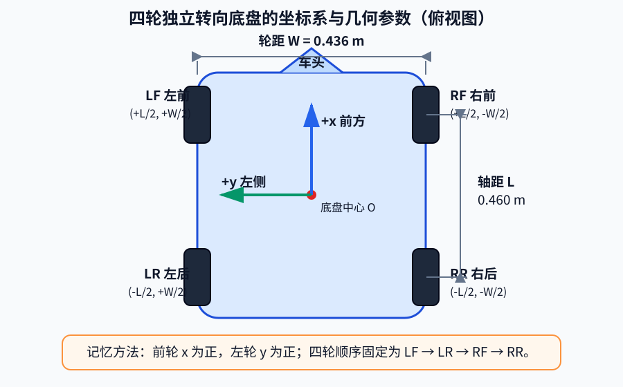
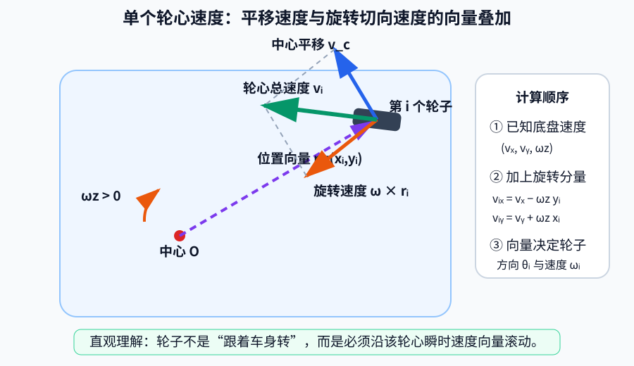
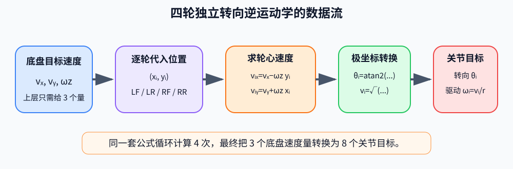
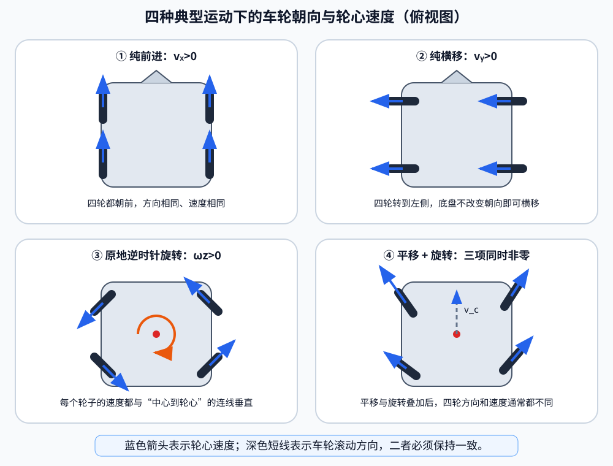

# 第四章 移动底盘运动学与控制

本章围绕 G2 机器人的移动底盘展开，从最基础的位姿、速度和坐标系开始，逐步讲解 G2 四轮独立转向底盘的结构、正逆运动学、关键控制算法和 Isaac Sim 代码实现，最后在场景中完成速度控制和二维航点控制实验。

本章代码位于 `code/code_chapter4`，使用的机器人模型是 `assets/robot/G2_omnipicker/robot.usda`，仿真环境是 `assets/background/room/room_1/background.usda`。

为了方便初学者建立清晰的知识结构，全文只分为六个部分。前四部分集中讲概念、结构、数学原理和关键算法，不穿插源代码；第五部分再把前面的内容整合成代码；第六部分负责运行和结果分析。

---

## 第一部分 移动底盘控制基础

### 1.1 从机器人位姿到速度控制

移动底盘可以理解为移动机器人的“腿”。后续无论是自主导航、环境巡检、移动抓取，还是执行大模型生成的任务，机器人都必须先具备稳定移动和准确停车的能力。

在平面环境中，可以使用二维位姿描述机器人状态：

$$
\mathbf{p}=[x,\ y,\ \psi]^{T}
$$

上标 $T$ 表示转置，因此方括号中的三个分量按列向量理解。

其中：

- $x$、 $y$ 表示机器人在世界坐标系中的位置，单位为米；
- $\psi$ 表示机器人绕竖直轴的朝向角，也称为航向角或 `yaw`，单位为弧度。

位姿回答的是“机器人在哪里、朝向哪里”，而速度描述的是“机器人接下来怎样运动”。平面底盘速度通常写成：

$$
\mathbf{v}=[v_x,\ v_y,\ \omega_z]^{T}
$$

三个速度分量的含义如下：

| 分量 | 单位 | 正方向 | 含义 |
|---|---:|---|---|
| $v_x$ | m/s | 机器人前方 | 前后移动速度 |
| $v_y$ | m/s | 机器人左方 | 左右横移速度 |
| $\omega_z$ | rad/s | 逆时针 | 绕底盘中心旋转的角速度 |

因此：

- $v_x>0$、 $v_y=0$、 $\omega_z=0$ 表示向前移动；
- $v_x=0$、 $v_y>0$、 $\omega_z=0$ 表示向左横移；
- $v_x=0$、 $v_y=0$、 $\omega_z>0$ 表示逆时针原地旋转；
- 三个分量同时不为零时，机器人会一边斜向平移，一边旋转。

$v_x$ 和 $v_y$ 是同一个二维线速度向量的两个分量，合速度大小为：

$$
v=\sqrt{v_x^2+v_y^2}
$$

例如， $v_x=0.7\text{ m/s}$、 $v_y=0.7\text{ m/s}$ 时，合速度约为 $0.99\text{ m/s}$，而不是 $0.7\text{ m/s}$。因此底盘限速时要限制二维合速度，不能只分别截断两个分量。

角度和角速度通常使用弧度：

$$
\pi\text{ rad}=180^\circ,\qquad
\frac{\pi}{2}\text{ rad}=90^\circ
$$

需要特别区分底盘角速度 $\omega_z$ 和车轮自转角速度 $\omega_i$。前者表示整个机器人绕底盘中心转得多快，后者表示某个驱动轮绕自身轴线转得多快。两者单位相同，但物理意义不同。

### 1.2 世界坐标系与底盘坐标系

机器人控制中最容易出现的问题之一，是没有区分世界坐标系和机器人自身坐标系。

世界坐标系固定在仿真场景中，不会随着机器人运动。房间中的航点、物体位置和机器人全局位姿都使用世界坐标系描述。

底盘坐标系固定在机器人身上，会跟随机器人一起平移和旋转。本章统一采用右手坐标系：

- 底盘 $x$ 轴指向机器人前方；
- 底盘 $y$ 轴指向机器人左方；
- 底盘 $z$ 轴指向机器人上方；
- 绕 $z$ 轴的正方向为从上向下看逆时针。

底盘速度 $(v_x,v_y,\omega_z)$ 在机器人自身坐标系中表达。例如，机器人已经相对世界坐标系旋转了 $90^\circ$，此时继续给出正的 $v_x$，机器人会沿自己的前方移动，而不是固定沿世界坐标系的 $x$ 正方向移动。

这一点在航点控制中尤其重要。航点位置位于世界坐标系，而底盘速度位于机器人坐标系，所以不能直接把世界坐标误差当作 $v_x$ 和 $v_y$，必须先做坐标变换。

### 1.3 常见底盘与本章控制目标

常见移动底盘主要包括差速底盘、麦克纳姆轮底盘和四轮独立转向底盘。

差速底盘通过左右轮速差完成转向，一般只能直接控制前后速度和旋转速度，不能直接横移。机器人要移动到侧面时，通常需要先转向再前进。

麦克纳姆轮底盘利用轮缘上的斜向滚子产生横向分力，可以直接实现前后、左右和旋转运动，但运动效果容易受到滚子接触、地面摩擦和负载变化影响。

G2 使用四轮独立转向底盘，也称为 Swerve Drive。四个轮组都能独立改变朝向和驱动速度，因此可以直接控制完整的 $(v_x,v_y,\omega_z)$，实现前进、横移、斜向运动、原地旋转以及平移与旋转的组合运动。

本章要建立的完整控制链是：

**动作或目标位姿 → 底盘速度 → 四个轮子状态 → 八个底盘关节 → 轮地接触 → G2 实际运动。**

本章不会通过直接修改世界位姿让机器人瞬移，也不会调用 Isaac Sim 已经封装好的底盘控制器。运动学和控制逻辑由本章代码自行实现，Isaac Sim 只负责关节执行和物理仿真。

---

## 第二部分 G2 机器人底盘结构

### 2.1 四轮独立转向结构与几何参数

G2 模型包含移动底盘、升降机构、机械臂和其他关节，当前整个 articulation 共有 46 个自由度。本章只使用其中与移动底盘直接相关的 8 个主动关节。


底盘包含四个轮组，并统一按以下顺序处理：

1. 左前轮 LF；
2. 左后轮 LR；
3. 右前轮 RF；
4. 右后轮 RR。

统一顺序非常重要。轮子位置、转向关节、驱动关节和运动学计算必须一一对应，否则机器人可能出现错误横移、异常旋转或四个轮子互相对抗。

底盘运动学需要三个基本几何参数：

| 参数 | 符号 | 数值 | 含义 |
|---|---:|---:|---|
| 轮子半径 | $r$ | 0.070 m | 轮子中心到轮缘的距离 |
| 轴距 | $L$ | 0.460 m | 前后轮中心之间的距离 |
| 轮距 | $W$ | 0.436 m | 左右轮中心之间的距离 |

底盘坐标系原点位于四轮几何中心。半轴距和半轮距分别为：

$$
\frac{L}{2}=0.230\text{ m},\qquad
\frac{W}{2}=0.218\text{ m}
$$

四个轮子在底盘坐标系中的位置为：

| 轮子 | $x_i$ | $y_i$ |
|---|---:|---:|
| 左前 LF | $+0.230$ m | $+0.218$ m |
| 左后 LR | $-0.230$ m | $+0.218$ m |
| 右前 RF | $+0.230$ m | $-0.218$ m |
| 右后 RR | $-0.230$ m | $-0.218$ m |

这里规定前方 $x$ 为正、后方为负，左侧 $y$ 为正、右侧为负。



*图示说明：从俯视角度看，车头方向为 $+x$，机器人左侧为 $+y$。四个轮子的坐标符号由它们相对底盘中心的位置直接确定。*

轮子位置在纯平移时影响不明显，但在旋转运动中非常重要。底盘绕中心旋转时，每个轮子都要沿自己的圆周切线方向运动。轮子离底盘中心越远，在相同底盘角速度下所需的轮心线速度越大。因此，轮径、轴距或轮距填写错误，会直接影响旋转速度、组合运动轨迹和里程计精度。

### 2.2 转向关节与驱动关节

每个 G2 轮组包含两个主动自由度。

转向关节控制轮子的朝向。在 Isaac Sim 中，它接收位置目标，单位为弧度。转向角决定轮子速度向量指向哪里。

驱动关节控制轮子绕自身轴线旋转。在 Isaac Sim 中，它接收速度目标，单位为弧度每秒。驱动轮速决定轮心速度的大小和正反方向。

四个转向关节为：

| 轮组 | 转向关节名称 |
|---|---|
| 左前 | `idx111_chassis_lwheel_front_joint1` |
| 左后 | `idx121_chassis_lwheel_rear_joint1` |
| 右前 | `idx131_chassis_rwheel_front_joint1` |
| 右后 | `idx141_chassis_rwheel_rear_joint1` |

四个驱动关节为：

| 轮组 | 驱动关节名称 |
|---|---|
| 左前 | `idx112_chassis_lwheel_front_joint2` |
| 左后 | `idx122_chassis_lwheel_rear_joint2` |
| 右前 | `idx132_chassis_rwheel_front_joint2` |
| 右后 | `idx142_chassis_rwheel_rear_joint2` |

当前模型加载后，转向关节索引为 22、23、24、25，驱动关节索引为 26、27、28、29。不过程序不直接写死索引，而是根据关节名称动态查找。这样即使 USD 模型调整了自由度顺序，只要关节名称不变，控制器仍然能够找到正确关节；如果关节缺失，程序会立即给出明确错误。

### 2.3 从关节目标到机器人运动

一个轮子的实际轮心速度由转向角和驱动速度共同决定：

- 转向角决定速度向量方向；
- 驱动轮速决定速度向量大小和正负方向。

例如，轮子朝向前方并正向转动，轮心速度向前；轮子仍朝向前方但反向转动，轮心速度向后。轮子朝向左侧并正向转动，轮心速度向左。

因此，底盘控制不能只计算四个轮速，还必须同时计算四个转向角。

本章在 Isaac Sim 中向四个转向关节发送位置目标，向四个驱动关节发送速度目标。随后由 Isaac Sim 计算关节响应、轮地接触和摩擦力，接触力再推动整个 G2 移动。机器人世界位姿不会被控制程序直接修改。

这种实现方式比直接设置世界坐标更接近真实机器人，也能真实反映转向延迟、加速过程、轮地摩擦和停车误差，为后续的移动抓取、SLAM 和导航提供可靠基础。

---

## 第三部分 四轮独立转向运动学原理

### 3.1 逆运动学：从底盘速度求轮子状态

上层希望使用容易理解的底盘速度：

$$
(v_x,v_y,\omega_z)
$$

但四个轮组真正需要的是：

$$
(\theta_i,\omega_i),\qquad i=1,2,3,4
$$

其中：

- $\theta_i$ 是第 $i$ 个轮子的转向角；
- $\omega_i$ 是第 $i$ 个轮子的自转角速度。

把底盘速度转换为四个轮子状态的过程称为逆运动学。

把 G2 底盘看作平面刚体。轮心速度由两部分叠加而成：

- 底盘中心平移产生的速度；
- 底盘绕中心旋转产生的切向速度。

底盘中心的平移速度为：

$$
\mathbf{v}_c=[v_x,\ v_y]^{T}
$$

第 $i$ 个轮子相对底盘中心的位置为：

$$
\mathbf{r}_i=[x_i,\ y_i]^{T}
$$

底盘角速度为：

$$
\boldsymbol{\omega}=[0,\ 0,\ \omega_z]^{T}
$$

旋转在轮心处产生的速度为叉乘：

$$
\mathbf{v}_{rotation,i}=\boldsymbol{\omega}\times\mathbf{r}_i
=[-\omega_z y_i,\ \omega_z x_i]^{T}
$$

轮心总速度等于平移速度和旋转速度之和：

$$
\mathbf{v}_i=\mathbf{v}_c+\mathbf{v}_{rotation,i}
$$



*图示说明：蓝色向量是底盘中心平移带来的速度，橙色向量是绕底盘中心旋转带来的切向速度，绿色向量是二者相加后该轮真正需要实现的轮心速度。车轮的转向角应与绿色向量方向一致。*

因此得到逆运动学最核心的两个公式：

$$
\boxed{v_{ix}=v_x-\omega_z y_i}
$$

$$
\boxed{v_{iy}=v_y+\omega_z x_i}
$$

轮子应沿轮心速度向量方向滚动，因此转向角为：

$$
\boxed{\theta_i=\mathrm{atan2}(v_{iy},v_{ix})}
$$

轮心线速度大小为：

$$
v_i=\sqrt{v_{ix}^2+v_{iy}^2}
$$

轮缘线速度与车轮自转角速度满足 $v_i=r\omega_i$，所以：

$$
\boxed{
\omega_i=\frac{\sqrt{v_{ix}^2+v_{iy}^2}}{r}
}
$$

这四个公式完成了从底盘速度到每个轮子转向角和驱动轮速的转换。



*图示说明：上层只给出 3 个底盘速度分量；运动学模块对四个轮子分别计算，最终生成 4 个转向角和 4 个驱动轮速，共 8 个关节目标。*

### 3.2 基本运动与组合运动

在代入具体数值之前，可以先通过下面的俯视图建立直觉。图中的深色短线表示车轮的滚动方向，蓝色箭头表示对应轮心的速度方向和相对大小。



观察时只需抓住一个原则：**每个车轮都必须转到自身轮心速度向量的方向，再通过驱动轮速实现该向量的大小。** 纯平移时四个向量相同；只要存在旋转分量，四个轮心的速度向量就会因位置不同而产生差异。

#### 纯前进

设：

$$
v_x=0.4\text{ m/s},\qquad v_y=0,
\qquad\omega_z=0
$$

因为没有旋转，对四个轮子都有 $v_{ix}=0.4$、 $v_{iy}=0$。所以四个轮子的转向角都为零。

轮子半径为 $0.070\text{ m}$，驱动角速度为：

$$
\omega_i=\frac{0.4}{0.070}\approx5.714\text{ rad/s}
$$

四个轮子全部朝前并以相同速度正向转动，底盘向前移动。

#### 纯横移

设：

$$
v_x=0,
\qquad v_y=0.35\text{ m/s},
\qquad\omega_z=0
$$

四个轮子都有 $v_{ix}=0$、 $v_{iy}=0.35$，所以转向角都为 $\pi/2$，驱动角速度为：

$$
\omega_i=\frac{0.35}{0.070}=5.0\text{ rad/s}
$$

四个轮子先朝向左侧，再正向转动，底盘直接向左横移。

#### 原地旋转

设：

$$
v_x=0,
\qquad v_y=0,
\qquad\omega_z=0.65\text{ rad/s}
$$

以左前轮为例，其位置为 $(0.230,0.218)$，因此：

$$
v_{LF,x}=-0.65\times0.218=-0.1417\text{ m/s}
$$

$$
v_{LF,y}=0.65\times0.230=0.1495\text{ m/s}
$$

轮心线速度大小约为：

$$
\sqrt{(-0.1417)^2+0.1495^2}\approx0.206\text{ m/s}
$$

对应驱动轮角速度约为：

$$
\frac{0.206}{0.070}\approx2.94\text{ rad/s}
$$

其他三个轮子的速度大小接近，但方向不同。四个轮子分别沿绕底盘中心圆周的切线方向滚动，于是 G2 绕中心原地旋转。

#### 平移与旋转同时发生

当 $v_x$、 $v_y$ 和 $\omega_z$ 同时不为零时，每个轮子都要把底盘平移速度和自身位置产生的旋转速度叠加起来。因此四个轮子的方向和速度通常都不同。

这也是四轮独立转向底盘比差速底盘更灵活的原因：每个轮组都可以独立满足自己的目标速度向量，从而共同实现复杂底盘运动。

### 3.3 正运动学与轮速里程计

逆运动学完成“底盘速度到轮子状态”的转换，正运动学则完成相反过程：根据四个轮子的转向角和驱动轮速估算底盘速度。

已知第 $i$ 个轮子的转向角 $\theta_i$ 和自转角速度 $\omega_i$，先恢复轮心线速度：

$$
v_i=r\omega_i
$$

再投影到底盘坐标系：

$$
v_{ix}=r\omega_i\cos\theta_i
$$

$$
v_{iy}=r\omega_i\sin\theta_i
$$

对于对称布置的四轮底盘，可以使用四个轮子的速度共同估算底盘角速度：

$$
\boxed{
\omega_z=
\frac{
\sum_i(-y_i v_{ix}+x_i v_{iy})
}{
\sum_i(x_i^2+y_i^2)
}
}
$$

得到 $\omega_z$ 后，由逆运动学关系反推出底盘中心平移速度：

$$
v_x=v_{ix}+\omega_z y_i
$$

$$
v_y=v_{iy}-\omega_z x_i
$$

四个轮子都会给出一组底盘中心速度估计，对这些结果取平均即可得到最终的 $v_x$ 和 $v_y$。

正运动学可用于检查实际轮子状态、估算底盘速度以及实现基础轮速里程计。

正运动学得到的速度位于底盘坐标系。若要估算机器人在世界坐标系中的位置，需要根据当前航向角 $\psi$ 进行坐标变换：

$$
v_x^{world}=\cos\psi\,v_x-\sin\psi\,v_y
$$

$$
v_y^{world}=\sin\psi\,v_x+\cos\psi\,v_y
$$

然后使用物理时间步长 $\Delta t$ 进行积分：

$$
x_{k+1}=x_k+v_x^{world}\Delta t
$$

$$
y_{k+1}=y_k+v_y^{world}\Delta t
$$

$$
\psi_{k+1}=normalize(\psi_k+\omega_z\Delta t)
$$

轮速里程计适合理解运动学和短时间估计，但会受到轮胎打滑、轮径误差、地面不平和关节测量误差影响，误差会随时间累积。真实导航系统还需要融合 IMU、视觉或激光雷达定位结果。

---

## 第四部分 控制算法与工程设计

### 4.1 从底盘速度到关节目标的关键控制流程

本章底盘控制的核心不是某个单独函数，而是一条连续计算链：

1. 上层给出目标底盘速度 $(v_x,v_y,\omega_z)$；
2. 读取四个轮子的当前转向角；
3. 使用逆运动学计算四个轮心速度；
4. 根据轮心速度计算四个目标转向角和驱动轮速；
5. 为每个轮子选择转向距离更短的等价状态；
6. 在车轮速度超限时对四个轮速统一缩放；
7. 向四个转向关节发送角度目标；
8. 向四个驱动关节发送速度目标；
9. 推进一步物理仿真，并在下一周期重新计算。

这个流程以固定物理频率持续运行。本章默认物理频率为 $120\text{ Hz}$，即每秒进行 120 次控制计算和物理更新。

其中真正决定 G2 怎样运动的关键算法有两个：

- 四轮独立转向逆运动学；
- 二维目标位姿反馈控制。

逆运动学负责把速度变成轮子状态，位姿反馈控制负责根据当前位置和目标位置实时生成底盘速度。转向优化和轮速统一缩放则保证逆运动学结果更适合实际执行。

### 4.2 转向最短路径与轮速统一缩放

逆运动学根据轮心速度得到目标转向角，但轮子朝向某个方向并正向转动，与朝向相反方向并反向转动，可以产生相同的轮心速度。

例如：

- 转向角为 $0$、驱动轮速为 $+5\text{ rad/s}$；
- 转向角为 $\pi$、驱动轮速为 $-5\text{ rad/s}$。

两种状态都能产生向前的轮心速度。

因此，控制器需要根据轮子当前角度选择最近的等价解。设目标角度为 $\theta_d$，当前角度为 $\theta_c$，先将角度差归一化到 $[-\pi,\pi)$：

$$
\Delta\theta=normalize(\theta_d-\theta_c)
$$

如果 $|\Delta\theta|\leq\pi/2$，直接转到目标方向；如果 $|\Delta\theta|>\pi/2$，则将目标方向翻转 $180^\circ$，同时把驱动轮速取反。

这个算法可以减少转向等待时间和轮胎原地摩擦。例如，轮子当前朝前，底盘突然要求后退时，轮子不必先旋转 $180^\circ$，可以保持接近当前方向并直接反向转动。

组合运动还可能让某个驱动轮速度超过允许上限。本章不单独截断某一个轮子，而是使用统一比例缩放。

设四个轮子中的最大绝对速度为 $\omega_{largest}$，最大允许速度为 $\omega_{wheel,max}$，则：

$$
s=\frac{\omega_{wheel,max}}{\omega_{largest}}
$$

所有轮速同时乘以 $s$：

$$
\omega_i'=s\omega_i
$$

统一缩放会降低整体速度，但能保持四个轮速之间的比例，使实际底盘运动方向尽量不偏离目标。

当目标轮心速度接近零时，零速度向量本身没有方向。本章让驱动轮速度变为零，同时保持当前转向角，避免机器人停车后四个转向轮仍然无意义地摆动。

### 4.3 二维目标位姿反馈控制

直接给出 $(v_x,v_y,\omega_z)$ 适合遥控或演示基本运动。如果希望机器人自动到达某个位置，则需要根据当前位姿与目标位姿之间的误差实时计算速度。

当前位姿为：

$$
(x,y,\psi)
$$

目标位姿为：

$$
(x_t,y_t,\psi_t)
$$

世界坐标系中的位置误差为：

$$
e_x^{world}=x_t-x
$$

$$
e_y^{world}=y_t-y
$$

距离误差和航向误差为：

$$
e_d=\sqrt{(e_x^{world})^2+(e_y^{world})^2}
$$

$$
e_\psi=normalize(\psi_t-\psi)
$$

由于底盘速度在机器人自身坐标系中表达，需要把世界坐标误差转换到底盘坐标系：

$$
e_x^{body}=\cos\psi\,e_x^{world}+\sin\psi\,e_y^{world}
$$

$$
e_y^{body}=-\sin\psi\,e_x^{world}+\cos\psi\,e_y^{world}
$$

然后使用直观的比例控制：

$$
v_x=K_p e_x^{body}
$$

$$
v_y=K_p e_y^{body}
$$

$$
\omega_z=K_\psi e_\psi
$$

本章默认位置比例增益 $K_p=1.2$，航向比例增益 $K_\psi=2.0$。误差大时输出速度较大，接近目标时输出速度自然减小。

机器人同时满足位置和航向要求时，才认为到达目标：

$$
e_d\leq0.04\text{ m}
$$

$$
|e_\psi|\leq0.05\text{ rad}
$$

如果位置已经满足要求而航向仍有误差，控制器停止平移，只继续调整朝向。

这种控制方式会不断执行“读取当前位姿、计算误差、生成速度、执行运动、再次读取位姿”，因此属于闭环控制。它能修正实际运动误差，但不包含路径搜索和障碍物规避，不等同于完整导航算法。

### 4.4 工程约束与使用注意事项

运动学和位姿反馈决定机器人应当怎样运动，而速度限制、加速度限制和超时停车属于保证控制稳定与安全的工程措施，应当与关键控制算法区分开来。

#### 底盘速度限制

本章默认最大线速度为 $0.70\text{ m/s}$，最大角速度为 $1.20\text{ rad/s}$。

线速度按照二维合速度统一缩放，保持原始移动方向；角速度限制在正负最大值之间。这样可以防止上层给出过大的速度命令。

#### 加速度限制

速度不能在一个物理周期内从零瞬间跳到最大值。设最大线加速度为 $a_{max}$，单次允许的最大线速度变化为：

$$
\Delta v_{max}=a_{max}\Delta t
$$

本章默认 $a_{max}=0.80\text{ m/s}^2$。二维速度变化量整体限幅，避免斜向加速时合加速度超限。

角速度也使用相同思想逐渐接近目标值。本章默认最大角加速度为 $1.80\text{ rad/s}^2$。

加速度限制主要用于减少启动和停车冲击，使轮地接触更稳定。

#### 指令超时停车

在真实机器人中，速度命令可能来自网络或上位机。如果通信中断而机器人一直保持最后一条非零命令，会产生安全风险。

本章记录距离上次速度命令经过的时间，超过 $0.50\text{ s}$ 没有收到新命令时，将目标速度设为零，并在加速度限制作用下减速停车。

因此，上层控制程序应周期性发送速度命令，而不是只发送一次后永久等待。

#### 停车时的轮子方向

普通停车只需要把四个驱动轮速度设为零，默认保持当前转向角。只有在明确需要轮子回正时，才向转向关节发送零角度目标。

#### 控制器适用边界

本章位姿控制器只负责向目标收敛，不会检查路径中是否存在障碍物。航点必须放在可通行区域。地图、定位、路径规划和局部避障将在后续 SLAM 与导航章节中加入。

---

## 第五部分 代码实现

### 5.1 文件组织与统一配置

本章代码采用“运动学、控制器、仿真环境和演示程序分离”的结构：

```text
code/code_chapter4/
├── __init__.py
├── README.md
├── config.py
├── kinematics.py
├── base_controller.py
├── simulation.py
├── demo_velocity_control.py
└── demo_waypoint_control.py
```

各文件职责如下：

| 文件 | 主要职责 |
|---|---|
| `config.py` | 模型路径、场景路径、关节名称、几何尺寸和控制参数 |
| `kinematics.py` | 底盘数据结构、角度归一化、正逆运动学和轮速里程计 |
| `base_controller.py` | 关节查找、底盘控制、工程约束和位姿反馈控制 |
| `simulation.py` | 启动 Isaac Sim、加载 room_1 和 G2、读取位姿、推进仿真 |
| `demo_velocity_control.py` | 演示直接控制 $v_x$、 $v_y$、 $\omega_z$ |
| `demo_waypoint_control.py` | 演示多个二维目标位姿闭环控制 |

建议按照 `config.py`、`kinematics.py`、`base_controller.py`、两个演示程序、`simulation.py` 的顺序阅读。

`config.py` 首先集中保存模型路径和 Prim 路径：

```python
PROJECT_ROOT = Path(__file__).resolve().parents[2]

ROBOT_USD = PROJECT_ROOT / "assets/robot/G2_omnipicker/robot.usda"
ROOM_USD = PROJECT_ROOT / "assets/background/room/room_1/background.usda"

ROBOT_PRIM_PATH = "/genie"
ROOM_PRIM_PATH = "/World"
```

四个轮组始终按左前、左后、右前、右后排列：

```python
STEERING_JOINT_NAMES = (
    "idx111_chassis_lwheel_front_joint1",
    "idx121_chassis_lwheel_rear_joint1",
    "idx131_chassis_rwheel_front_joint1",
    "idx141_chassis_rwheel_rear_joint1",
)

DRIVE_JOINT_NAMES = (
    "idx112_chassis_lwheel_front_joint2",
    "idx122_chassis_lwheel_rear_joint2",
    "idx132_chassis_rwheel_front_joint2",
    "idx142_chassis_rwheel_rear_joint2",
)
```

几何参数和轮子位置统一由 `RobotGeometry` 管理：

```python
@dataclass(frozen=True)
class RobotGeometry:
    wheel_radius: float = 0.070
    wheel_base: float = 0.460
    track_width: float = 0.436

    @property
    def wheel_positions(self):
        half_length = self.wheel_base / 2.0
        half_width = self.track_width / 2.0

        return (
            (+half_length, +half_width),
            (-half_length, +half_width),
            (+half_length, -half_width),
            (-half_length, -half_width),
        )
```

控制器的工程参数集中放在 `ControlLimits` 中：

```python
@dataclass(frozen=True)
class ControlLimits:
    max_linear_speed: float = 0.70
    max_angular_speed: float = 1.20
    max_wheel_speed: float = 18.0
    max_linear_acceleration: float = 0.80
    max_angular_acceleration: float = 1.80
    command_timeout: float = 0.50
```

仿真频率、渲染频率、是否无窗口运行和机器人初始位姿由 `SimulationConfig` 管理：

```python
@dataclass(frozen=True)
class SimulationConfig:
    physics_hz: int = 120
    rendering_hz: int = 60
    headless: bool = False
    renderer: str = "RaytracedLighting"
    warmup_steps: int = 120
    robot_position = (0.0, 0.0, -0.01)
    robot_orientation = (1.0, 0.0, 0.0, 0.0)

    @property
    def physics_dt(self):
        return 1.0 / self.physics_hz
```

### 5.2 运动学代码实现

`kinematics.py` 使用三个简单数据类表示底盘速度、车轮状态和二维位姿：

```python
@dataclass(frozen=True)
class ChassisVelocity:
    vx: float = 0.0
    vy: float = 0.0
    wz: float = 0.0


@dataclass(frozen=True)
class WheelState:
    steering_angle: float
    wheel_speed: float


@dataclass
class Pose2D:
    x: float = 0.0
    y: float = 0.0
    yaw: float = 0.0
```

角度归一化到 $[-\pi,\pi)$：

```python
def normalize_angle(angle: float) -> float:
    return (angle + math.pi) % (2.0 * math.pi) - math.pi
```

逆运动学集中在 `SwerveKinematics.inverse()`。它遍历四个轮子，根据轮子位置计算轮心速度，再得到转向角和驱动轮速：

```python
def inverse(
    self,
    velocity,
    current_angles=None,
    max_wheel_speed=None,
):
    states = []

    for index, (wheel_x, wheel_y) in enumerate(self.wheel_positions):
        wheel_vx = velocity.vx - velocity.wz * wheel_y
        wheel_vy = velocity.vy + velocity.wz * wheel_x
        linear_speed = math.hypot(wheel_vx, wheel_vy)

        if linear_speed < 1e-8:
            hold_angle = (
                0.0
                if current_angles is None
                else float(current_angles[index])
            )
            states.append(WheelState(hold_angle, 0.0))
            continue

        desired_angle = math.atan2(wheel_vy, wheel_vx)
        wheel_speed = linear_speed / self.wheel_radius

        if current_angles is not None:
            desired_angle, wheel_speed = self._nearest_equivalent_state(
                desired_angle,
                wheel_speed,
                float(current_angles[index]),
            )

        states.append(WheelState(desired_angle, wheel_speed))

    return self._desaturate(states, max_wheel_speed)
```

代码变量与数学量的对应关系如下：

| 数学量 | 代码变量 |
|---|---|
| $x_i$ | `wheel_x` |
| $y_i$ | `wheel_y` |
| $v_{ix}$ | `wheel_vx` |
| $v_{iy}$ | `wheel_vy` |
| $\theta_i$ | `desired_angle` |
| $\omega_i$ | `wheel_speed` |

转向最短路径和轮速反向在一个辅助函数中完成：

```python
@staticmethod
def _nearest_equivalent_state(
    desired_angle,
    wheel_speed,
    current_angle,
):
    delta = normalize_angle(desired_angle - current_angle)

    if abs(delta) > math.pi / 2.0:
        delta = normalize_angle(delta + math.pi)
        wheel_speed = -wheel_speed

    return current_angle + delta, wheel_speed
```

轮速超限时，对四个轮速统一缩放：

```python
@staticmethod
def _desaturate(states, max_wheel_speed):
    if max_wheel_speed is None:
        return states

    largest = max(abs(state.wheel_speed) for state in states)

    if largest <= max_wheel_speed:
        return states

    scale = max_wheel_speed / largest

    return [
        WheelState(
            state.steering_angle,
            state.wheel_speed * scale,
        )
        for state in states
    ]
```

正运动学先把轮子角速度和转向角还原为轮心二维速度，再估算底盘角速度和线速度：

```python
def forward(self, wheel_states):
    wheel_vectors = []
    rotation_numerator = 0.0
    rotation_denominator = 0.0

    for state, (wheel_x, wheel_y) in zip(
        wheel_states,
        self.wheel_positions,
    ):
        linear_speed = state.wheel_speed * self.wheel_radius
        wheel_vx = linear_speed * math.cos(state.steering_angle)
        wheel_vy = linear_speed * math.sin(state.steering_angle)

        wheel_vectors.append((wheel_vx, wheel_vy))
        rotation_numerator += -wheel_y * wheel_vx + wheel_x * wheel_vy
        rotation_denominator += wheel_x * wheel_x + wheel_y * wheel_y

    wz = rotation_numerator / rotation_denominator
    count = len(wheel_vectors)

    vx = sum(
        wheel_vx + wz * wheel_y
        for (wheel_vx, _), (_, wheel_y)
        in zip(wheel_vectors, self.wheel_positions)
    ) / count

    vy = sum(
        wheel_vy - wz * wheel_x
        for (_, wheel_vy), (wheel_x, _)
        in zip(wheel_vectors, self.wheel_positions)
    ) / count

    return ChassisVelocity(vx, vy, wz)
```

`SwerveOdometry` 再把正运动学速度转换到世界坐标系并积分：

```python
def update(self, wheel_states, dt):
    velocity = self.kinematics.forward(wheel_states)

    cos_yaw = math.cos(self.pose.yaw)
    sin_yaw = math.sin(self.pose.yaw)

    world_vx = cos_yaw * velocity.vx - sin_yaw * velocity.vy
    world_vy = sin_yaw * velocity.vx + cos_yaw * velocity.vy

    self.pose.x += world_vx * dt
    self.pose.y += world_vy * dt
    self.pose.yaw = normalize_angle(
        self.pose.yaw + velocity.wz * dt
    )

    return Pose2D(self.pose.x, self.pose.y, self.pose.yaw)
```

### 5.3 底盘控制与位姿反馈代码实现

`G2BaseController` 初始化时根据名称查找底盘关节：

```python
def _find_joint_indices(all_names, required_names):
    name_to_index = {
        name: index
        for index, name in enumerate(all_names)
    }

    missing = [
        name
        for name in required_names
        if name not in name_to_index
    ]

    if missing:
        raise RuntimeError(
            "G2 USD 中缺少底盘关节："
            + ", ".join(missing)
        )

    return [name_to_index[name] for name in required_names]
```

```python
self.steering_indices = _find_joint_indices(
    articulation.dof_names,
    STEERING_JOINT_NAMES,
)

self.drive_indices = _find_joint_indices(
    articulation.dof_names,
    DRIVE_JOINT_NAMES,
)
```

`set_velocity()` 接收上层速度并执行基本速度限制：

```python
def set_velocity(self, vx, vy, wz):
    command = ChassisVelocity(float(vx), float(vy), float(wz))
    command = _limit_linear_speed(
        command,
        self.limits.max_linear_speed,
    )

    command = ChassisVelocity(
        command.vx,
        command.vy,
        max(
            -self.limits.max_angular_speed,
            min(self.limits.max_angular_speed, command.wz),
        ),
    )

    self._requested = command
    self._time_since_command = 0.0
```

真正的周期控制位于 `update()`。它把工程约束、逆运动学和关节写入连接起来：

```python
def update(self, dt):
    if dt <= 0.0:
        raise ValueError("dt 必须大于 0")

    self._time_since_command += dt

    desired = self._requested
    if self._time_since_command > self.limits.command_timeout:
        desired = ChassisVelocity()

    self._applied = self._apply_acceleration_limit(desired, dt)
    current_angles = self._read_steering_angles()

    wheel_states = self.kinematics.inverse(
        self._applied,
        current_angles=current_angles,
        max_wheel_speed=self.limits.max_wheel_speed,
    )

    self._write_wheel_states(wheel_states)
    return wheel_states
```

二维线速度变化量采用整体限幅，角速度逐步靠近目标值：

```python
delta_vx = desired.vx - self._applied.vx
delta_vy = desired.vy - self._applied.vy

delta_length = math.hypot(delta_vx, delta_vy)
max_linear_change = self.limits.max_linear_acceleration * dt

if delta_length > max_linear_change and delta_length > 1e-12:
    scale = max_linear_change / delta_length
    delta_vx *= scale
    delta_vy *= scale
```

计算出四个轮子状态后，向转向关节发送位置目标，向驱动关节发送速度目标：

```python
steering_targets = np.array(
    [state.steering_angle for state in wheel_states],
    dtype=np.float64,
)

drive_targets = np.array(
    [state.wheel_speed for state in wheel_states],
    dtype=np.float64,
)

self.articulation.apply_action(
    ArticulationAction(
        joint_positions=steering_targets,
        joint_indices=self.steering_indices,
    )
)

self.articulation.apply_action(
    ArticulationAction(
        joint_velocities=drive_targets,
        joint_indices=self.drive_indices,
    )
)
```

读取实际转向角和驱动轮速后，可以调用正运动学估算当前底盘速度：

```python
def measured_chassis_velocity(self):
    return self.kinematics.forward(
        self.measured_wheel_states()
    )
```

位姿反馈控制器先计算世界坐标误差，再转换到底盘坐标系：

```python
error_world_x = target.x - current.x
error_world_y = target.y - current.y

distance_error = math.hypot(error_world_x, error_world_y)
yaw_error = normalize_angle(target.yaw - current.yaw)

cos_yaw = math.cos(current.yaw)
sin_yaw = math.sin(current.yaw)

error_body_x = (
    cos_yaw * error_world_x
    + sin_yaw * error_world_y
)

error_body_y = (
    -sin_yaw * error_world_x
    + cos_yaw * error_world_y
)
```

然后使用比例控制生成底盘速度：

```python
vx = self.position_gain * error_body_x
vy = self.position_gain * error_body_y
wz = self.yaw_gain * yaw_error
```

当位置误差和角度误差都进入容差范围时，返回零速度并标记目标已到达。

### 5.4 仿真环境与两个演示程序

`simulation.py` 负责启动 Isaac Sim。必须先创建 `SimulationApp`，然后再导入大部分 Isaac Sim 模块：

```python
from isaacsim import SimulationApp

self.app = SimulationApp(
    {
        "headless": config.headless,
        "disable_viewport_updates": config.headless,
        "renderer": config.renderer,
        "limit_cpu_threads": 16,
    }
)
```

随后创建物理世界并加载 room_1：

```python
self.world = World(
    stage_units_in_meters=1.0,
    physics_dt=self.config.physics_dt,
    rendering_dt=1.0 / self.config.rendering_hz,
)

add_reference_to_stage(str(ROOM_USD), ROOM_PRIM_PATH)
self.world.scene.add_default_ground_plane()
```

再加载 G2，设置初始位姿，并在场景预热后创建 articulation：

```python
add_reference_to_stage(str(ROBOT_USD), ROBOT_PRIM_PATH)

SingleXFormPrim(
    prim_path=ROBOT_PRIM_PATH,
    position=np.array(self.config.robot_position, dtype=np.float64),
    orientation=np.array(self.config.robot_orientation, dtype=np.float64),
)

self.world.play()

for _ in range(self.config.warmup_steps):
    self.world.step(render=not self.config.headless)

self.robot = SingleArticulation(
    prim_path=ROBOT_PRIM_PATH,
    name="G2_chapter4",
)

self.world.scene.add(self.robot)
self.robot.initialize()
```

读取 G2 世界位姿时，保留位置的 $x$、 $y$ 分量，并把四元数转换为航向角：

```python
position, quaternion = self.robot.get_world_pose()

return Pose2D(
    x=float(position[0]),
    y=float(position[1]),
    yaw=self._quaternion_to_yaw(quaternion),
)
```

速度控制示例定义了五段动作：

```python
MOTION_SEQUENCE = (
    ("前进",       0.40,  0.00,  0.00, 2.5),
    ("向左横移",   0.00,  0.35,  0.00, 2.5),
    ("原地左转",   0.00,  0.00,  0.65, 3.0),
    ("斜向并旋转", 0.30, -0.18, -0.35, 3.5),
    ("平滑停车",   0.00,  0.00,  0.00, 1.5),
)
```

每个物理周期持续发送速度、更新控制器并推进仿真：

```python
for _ in range(steps):
    if not simulation.is_running():
        return

    controller.set_velocity(vx, vy, wz)
    controller.update(sim_config.physics_dt)
    simulation.step()
```

航点控制示例定义四个目标位姿：

```python
WAYPOINTS = (
    Pose2D(1.0, 0.0, 0.0),
    Pose2D(1.0, 1.0, math.pi / 2.0),
    Pose2D(0.0, 1.0, math.pi),
    Pose2D(0.0, 0.0, 0.0),
)
```

每个物理周期读取当前位姿、计算反馈速度并交给底盘控制器：

```python
current = simulation.get_pose2d()
result = pose_controller.compute(current, target)

if result.reached:
    base.stop()
    break

command = result.command
base.set_velocity(command.vx, command.vy, command.wz)
base.update(sim_config.physics_dt)
simulation.step()
```

至此，代码形成完整调用关系：

```text
动作序列或目标航点
        ↓
底盘速度 ChassisVelocity
        ↓
G2BaseController
        ↓
SwerveKinematics.inverse
        ↓
四个 WheelState
        ↓
ArticulationAction
        ↓
G2 转向关节与驱动关节
        ↓
Isaac Sim 物理运动
```

---

## 第六部分 运行与结果展示

### 6.1 运行两个示例

进入本地项目根目录（即包含 `code`、`chapter4` 和 `chapter5` 的目录）。下面的 `/path/to/project-root` 是路径占位符，请替换为自己电脑上的实际路径：

```bash
cd /path/to/project-root
```

仿真程序必须使用 Isaac Sim 自带的 Python 环境，不要直接使用普通系统 Python。下列 `/path/to/isaac-sim/python.sh` 是路径占位符，请替换为自己电脑上 Isaac Sim 的实际安装路径。

带图形界面运行速度控制示例：

```bash
/path/to/isaac-sim/python.sh \
    code/code_chapter4/demo_velocity_control.py
```

无图形界面运行：

```bash
/path/to/isaac-sim/python.sh \
    code/code_chapter4/demo_velocity_control.py \
    --headless
```

运行二维航点控制示例：

```bash
/path/to/isaac-sim/python.sh \
    code/code_chapter4/demo_waypoint_control.py
```

无图形界面运行：

```bash
/path/to/isaac-sim/python.sh \
    code/code_chapter4/demo_waypoint_control.py \
    --headless
```

如果需要增加每个航点的最大控制时间：

```bash
/path/to/isaac-sim/python.sh \
    code/code_chapter4/demo_waypoint_control.py \
    --timeout 30
```

### 6.2 速度控制结果

程序启动后会加载 `room_1/background.usda`，注册包含 46 个自由度的 G2 articulation，并找到四个转向关节和四个驱动关节。

速度示例依次执行：

1. 以 $0.40\text{ m/s}$ 向前移动 2.5 秒；
2. 以 $0.35\text{ m/s}$ 向左横移 2.5 秒；
3. 以 $0.65\text{ rad/s}$ 原地左转 3 秒；
4. 以 $(0.30,-0.18,-0.35)$ 完成斜向平移和顺时针旋转；
5. 将目标速度设为零并平滑停车。

典型终端输出如下：

```text
[G2Simulation] room_1 场景已加载
[G2Simulation] G2 已加载：46 个自由度
[G2BaseController] 底盘关节检查通过
  转向关节索引: [22, 23, 24, 25]
  驱动关节索引: [26, 27, 28, 29]

=== 第四章示例 1：底盘速度控制 ===
坐标：vx 向前，vy 向左，wz 逆时针为正

[动作] 前进         vx=+0.40 m/s, vy=+0.00 m/s, wz=+0.00 rad/s
[动作] 向左横移     vx=+0.00 m/s, vy=+0.35 m/s, wz=+0.00 rad/s
[动作] 原地左转     vx=+0.00 m/s, vy=+0.00 m/s, wz=+0.65 rad/s
[动作] 斜向并旋转   vx=+0.30 m/s, vy=-0.18 m/s, wz=-0.35 rad/s
[动作] 平滑停车     vx=+0.00 m/s, vy=+0.00 m/s, wz=+0.00 rad/s
```

本项目的一次实际无窗口运行结果为：

```text
[完成] 最终仿真位姿：x=2.110 m, y=1.495 m, yaw=0.440 rad
[完成] 轮速正运动学估计：vx=-0.006, vy=0.003, wz=0.001
```

停车后正运动学估计的三个速度分量都接近零，说明四个驱动轮已经基本停止。

最终位置不能简单地按照每段目标速度乘以持续时间后直接相加，因为：

- 启动和停车受到加速度限制；
- 切换运动方向时转向轮需要调整角度；
- 速度在机器人自身坐标系中表达；
- 组合运动过程中机器人航向持续变化；
- 轮地摩擦和物理接触会产生小幅误差。

不同设备上的最后几位数可能略有差异，但动作方向和整体轨迹应保持一致。

### 6.3 航点控制结果

航点示例控制 G2 依次到达：

| 航点 | 目标位置 | 目标航向 |
|---|---|---:|
| 1 | $(1.0,0.0)$ | $0$ |
| 2 | $(1.0,1.0)$ | $\pi/2$ |
| 3 | $(0.0,1.0)$ | $\pi$ |
| 4 | $(0.0,0.0)$ | $0$ |

这些目标组成一个约 $1\text{ m}\times1\text{ m}$ 的方形闭环轨迹。控制器每个周期读取当前位置和航向，计算世界坐标误差，将误差转换到底盘坐标系，再生成新的 $(v_x,v_y,\omega_z)$。

一次实际运行中的到达信息如下：

```text
[航点 1/4] x=1.00, y=0.00, yaw=0.00
[到达] 位置误差=0.040 m, 角度误差=-0.000 rad

[航点 2/4] x=1.00, y=1.00, yaw=1.57
[到达] 位置误差=0.040 m, 角度误差=0.016 rad

[航点 3/4] x=0.00, y=1.00, yaw=3.14
[到达] 位置误差=0.039 m, 角度误差=0.038 rad

[航点 4/4] x=0.00, y=0.00, yaw=0.00
[到达] 位置误差=0.039 m, 角度误差=-0.049 rad
```

最终结果为：

```text
[完成] 所有航点已到达，最终位姿：x=0.033, y=-0.021, yaw=0.049
```

最终位置距离原点约为：

$$
\sqrt{0.033^2+(-0.021)^2}\approx0.039\text{ m}
$$

它满足 $0.04\text{ m}$ 的位置容差；最终航向误差 $0.049\text{ rad}$ 也满足 $0.05\text{ rad}$ 的航向容差。因此程序正确判断四个航点全部到达。

速度示例验证了 G2 的前进、横移、旋转和组合运动能力；航点示例则进一步验证了世界坐标误差转换、位姿比例控制和底盘闭环执行能力。

### 6.4 注意事项与本章总结

如果机器人完全不动，应首先检查是否使用 `/path/to/isaac-sim/python.sh` 启动、G2 是否成功加载、底盘关节是否正确找到，以及控制循环中是否依次调用了速度设置、控制更新和物理步进。

如果机器人只运动一下就停车，通常是因为速度命令只发送了一次，随后触发了 $0.50\text{ s}$ 的命令超时保护。速度控制程序需要在控制循环中周期性发送命令。

如果横移或旋转方向相反，应先检查坐标约定和 USD 关节轴方向。本章规定 $v_y>0$ 向机器人左侧移动， $\omega_z>0$ 从上向下看逆时针旋转。

如果启动或停车过于突然，可以降低最大线加速度和最大角加速度；如果航点长时间无法到达，应检查航点是否位于障碍物中、速度和增益是否过小，以及单个航点允许时间是否足够。

当前 `room_1/background.usda` 引用了一个仓库中不存在的桌子资源：

```text
assets/objects/benchmark/table/benchmark_table_019/Aligned.usda
```

Isaac Sim 可能输出资源无法打开的警告。它只会导致对应桌子不显示，不影响 room_1 其他场景内容、物理地面和 G2 底盘控制。

本章最终建立了两层可复用能力：

- 底层将 $(v_x,v_y,\omega_z)$ 转换为四个转向角和四个驱动轮速；
- 上层根据当前位姿与目标位姿的误差生成底盘速度。

最核心的四轮独立转向逆运动学公式为：

$$
\boxed{v_{ix}=v_x-\omega_z y_i}
$$

$$
\boxed{v_{iy}=v_y+\omega_z x_i}
$$

$$
\boxed{\theta_i=\mathrm{atan2}(v_{iy},v_{ix})}
$$

$$
\boxed{\omega_i=\frac{\sqrt{v_{ix}^2+v_{iy}^2}}{r}}
$$

未来无论速度命令来自键盘遥控、轨迹规划、视觉跟踪、Nav2 还是大模型决策，都可以继续复用本章的底盘速度接口控制 G2 移动。

