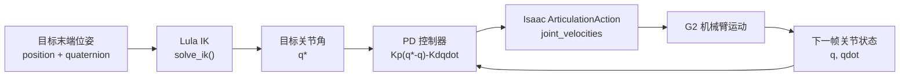
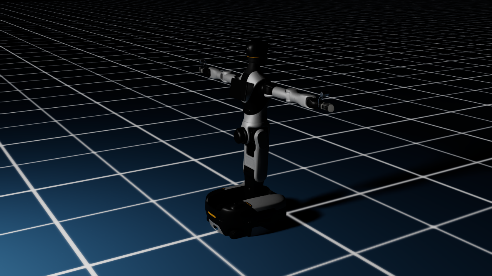
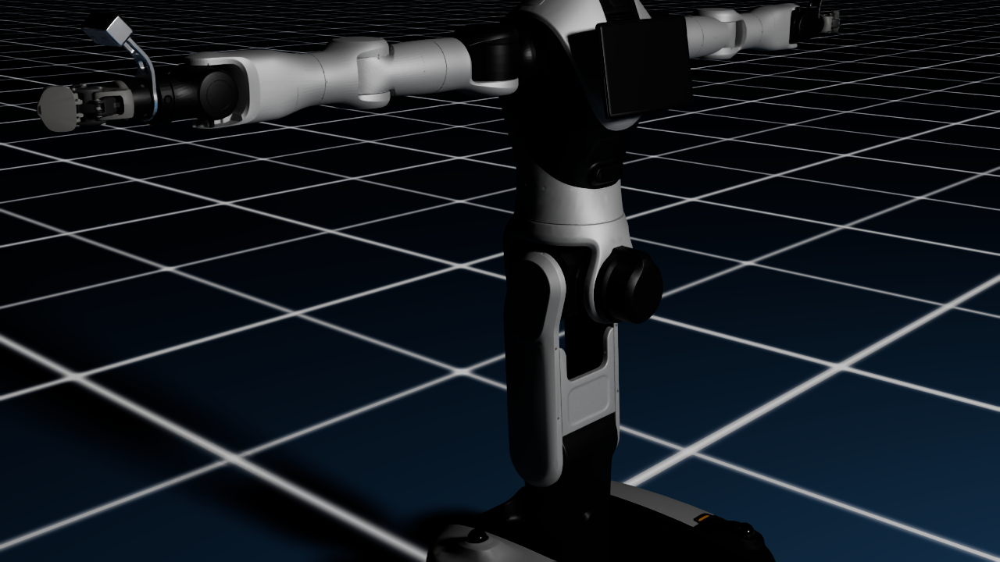
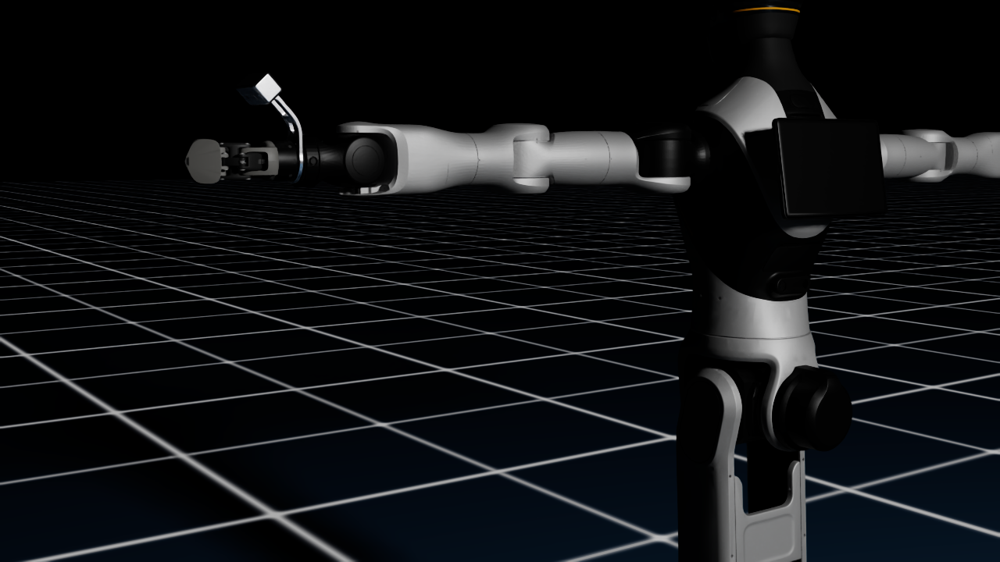

# 第五章 机械臂运动学与关节控制

> [!CAUTION]
> ⚠️ Alpha 内测版本警告：本章使用仓库中的 G2 早期示例代码讲解机械臂 FK/IK 与关节 PD 控制，接口后续可能会继续整理。如果大家在复刻时遇到接口变化，可以优先查看 `code_pre_alpha/g2_robot` 下的最新实现。

学完这一章后，大家可以把“末端执行器要到哪里”翻译成“每个关节应该转到多少”，再用一个简单的 PD 控制器把关节平滑推向目标角度。本章围绕 G2 双臂展开，重点不是从零手写一个工业级 IK 求解器，而是理解机械臂运动学的数学结构，并学会调用仓库中已经准备好的 Lula IK、Ruckig 轨迹和关节控制代码。

本章会完成四件事：

1. 建立 G2 机械臂的坐标系、关节空间和末端位姿表示。
2. 从齐次变换角度理解正运动学（FK）。
3. 从误差迭代角度理解逆运动学（IK），并对应到现有 Lula 求解流程。
4. 补充一个关节空间 PD 控制器，用 IK 输出的关节角作为控制目标。

## 1. 本章代码位置

本章主要对应以下代码：

| 文件 | 作用 |
| --- | --- |
| `code_pre_alpha/g2_robot/core/constants.py` | G2 左右臂 7 个关节名、躯干/头部固定姿态、轮组参数等常量 |
| `code_pre_alpha/g2_robot/core/sim_setup.py` | 设置躯干姿态，初始化左右臂 Lula IK、夹爪和 Ruckig 轨迹器 |
| `code_pre_alpha/g2_robot/controllers/arm.py` | 机械臂直接关节控制、IK 求解、轨迹执行和抓取状态机 |
| `code_pre_alpha/g2_robot/controllers/trajectory.py` | 基于 Ruckig 的关节空间平滑轨迹生成 |
| `code_pre_alpha/g2_robot/controllers/joint_pd.py` | 本章新增的关节空间 PD 速度控制器 |
| `code_pre_alpha/g2_robot/examples/test_pick.py` | 使用右臂 IK、轨迹和夹爪完成一次抓取演示 |

现有 G2 示例依赖 Isaac Sim、Genie Sim 代码仓库和 Genie Sim Assets 资产仓库。Hello Robotics 当前仓库只保留了教学代码，并没有内置完整的 G2 USD、URDF、mesh 和场景资产；如果直接运行示例，最常见的报错就是找不到 `robot/G2_omnipicker/robot_fix.usda` 或 Lula 的机器人描述文件。

运行示例前，需要准备两类外部资源：

| 环境变量 | 指向内容 | 推荐来源 |
| --- | --- | --- |
| `SIM_REPO_ROOT` | Genie Sim 代码目录，至少包含 `source/data_collection/config/robot_cfg/G2/` 和 `source/geniesim/app/robot_cfg/G2_omnipicker/` | `https://github.com/AgibotTech/genie_sim` |
| `SIM_ASSETS` | Genie Sim Assets 资产目录，至少包含 `robot/G2_omnipicker/` 和本章示例用到的 `background/room/room_1/` | `https://huggingface.co/datasets/agibot-world/GenieSimAssets` 或 ModelScope 同名资产集 |

准备好后，可以按下面的方式运行：

```bash
export SIM_REPO_ROOT=/path/to/genie_sim
export SIM_ASSETS=/path/to/GenieSimAssets
cd code_pre_alpha
python -m g2_robot.examples.test_pick
```

这里的 `/path/to/genie_sim` 和 `/path/to/GenieSimAssets` 需要替换成大家本机实际的资源路径。不要把个人机器上的绝对路径提交到仓库里。

如果只想下载本章需要的最小资产，可以优先拉取 `robot/G2_omnipicker/**` 和 `background/room/room_1/**`。全量 Genie Sim Assets 包含大量物体和场景，体积会更大，建议放在共享数据目录或外置数据盘中。

## 2. G2 机械臂的关节空间

G2 是一个带移动底盘、躯干、头部和双臂的复合机器人。本章只讨论单侧机械臂控制，但在 IK 求解前仍然要处理躯干和头部姿态，因为机械臂末端位姿是整条运动链共同决定的。

仓库中把右臂和左臂都定义成 7 自由度关节链：

```python
RIGHT_ARM_JOINT_NAMES = [
    "idx61_arm_r_joint1", "idx62_arm_r_joint2", "idx63_arm_r_joint3",
    "idx64_arm_r_joint4", "idx65_arm_r_joint5", "idx66_arm_r_joint6",
    "idx67_arm_r_joint7",
]

LEFT_ARM_JOINT_NAMES = [
    "idx21_arm_l_joint1", "idx22_arm_l_joint2", "idx23_arm_l_joint3",
    "idx24_arm_l_joint4", "idx25_arm_l_joint5", "idx26_arm_l_joint6",
    "idx27_arm_l_joint7",
]
```

对单臂来说，关节变量可以写成：

$$
\mathbf{q} = [q_1, q_2, \cdots, q_7]^T
$$

末端执行器位姿一般写成：

$$
\mathbf{x} = [\mathbf{p}, \mathbf{R}]
$$

其中 $\mathbf{p}=[x,y,z]^T$ 是末端位置，$\mathbf{R}\in SO(3)$ 是末端姿态。在代码里，位置通常使用三维向量，姿态常用四元数表示。`test_pick.py` 中的 `GRASP_ORIENT = np.array([0.0, 1.0, 0.0, 0.0])` 就是一个 `wxyz` 顺序的四元数，表示夹爪朝下的抓取姿态。

## 3. 正运动学：从关节角到末端位姿

正运动学（Forward Kinematics, FK）回答的问题是：如果每个关节角 $\mathbf{q}$ 已知，末端执行器会出现在什么位置和姿态？

对串联机械臂来说，每个关节都可以写成一个坐标变换：

$$
{}^{i-1}\mathbf{T}_{i}(q_i)=
\begin{bmatrix}
{}^{i-1}\mathbf{R}_{i}(q_i) & {}^{i-1}\mathbf{p}_{i}(q_i) \\
\mathbf{0}^T & 1
\end{bmatrix}
$$

从基座到末端的总变换就是沿运动链逐级相乘：

$$
{}^{0}\mathbf{T}_{ee}(\mathbf{q}) =
{}^{0}\mathbf{T}_{1}(q_1)
{}^{1}\mathbf{T}_{2}(q_2)
\cdots
{}^{6}\mathbf{T}_{ee}(q_7)
$$

在 G2 项目里，大家不需要手动维护一张 DH 参数表。更稳妥的做法是把 URDF 作为运动学真值来源：URDF 中每个 joint 的 `origin`、`axis`、`parent` 和 `child` 决定了这条链的固定偏置与旋转轴，Lula/Isaac Sim 会据此构建运动学模型。这样做的好处是代码、仿真模型和可视化模型共享同一份结构描述，减少“文档里的连杆长度”和“仿真里的连杆长度”不一致的问题。

在现有代码中，FK 主要通过 Isaac Sim 的 `ArticulationKinematicsSolver` 间接获得。例如 `test_heart_only_ik.py` 中会调用：

```python
ee_pos, ee_quat = arm_ctrl.ik_solver["art"].compute_end_effector_pose()
```

这个调用背后的含义就是：读取当前 articulation 的关节状态，沿 URDF/Lula 定义的运动链计算末端 link 的世界位姿。对右臂来说，末端 link 使用 `gripper_r_center_link`；对左臂来说，末端 link 使用 `gripper_l_center_link`。

## 4. 逆运动学：从末端目标到关节角

逆运动学（Inverse Kinematics, IK）回答的问题正好相反：如果希望末端到达目标位姿 $\mathbf{x}^{*}$，应该选择怎样的关节角 $\mathbf{q}^{*}$？

一般数值 IK 会不断重复以下过程：

1. 用当前 $\mathbf{q}$ 做一次 FK，得到当前末端位姿 $\mathbf{x}$。
2. 计算目标位姿和当前位姿之间的误差 $\Delta \mathbf{x}$。
3. 用雅可比矩阵 $\mathbf{J}(\mathbf{q})$ 建立微分关系：

$$
\Delta \mathbf{x} \approx \mathbf{J}(\mathbf{q}) \Delta \mathbf{q}
$$

4. 解出一个关节增量 $\Delta \mathbf{q}$，例如使用阻尼最小二乘：

$$
\Delta \mathbf{q} =
\mathbf{J}^T
(\mathbf{J}\mathbf{J}^T + \lambda^2\mathbf{I})^{-1}
\Delta \mathbf{x}
$$

5. 更新关节角 $\mathbf{q} \leftarrow \mathbf{q} + \Delta \mathbf{q}$，直到位置和姿态误差低于阈值，或者迭代次数耗尽。

G2 代码没有在教程层手写这套迭代，而是调用 Isaac Sim 的 Lula 求解器。关键初始化过程在 `SimSetup._init_ik_solvers()`：

```python
right_lula = LulaKinematicsSolver(
    robot_description_path=right_desc,
    urdf_path=urdf_path,
)
right_solver = ArticulationKinematicsSolver(
    self.articulation, right_lula, "gripper_r_center_link"
)
```

这里有两个重要文件：

| 文件 | 含义 |
| --- | --- |
| `G2_omnipicker.urdf` | 机器人完整连杆、关节和几何结构 |
| `G2_omnipicker_fixed_right.yaml` / `G2_omnipicker_fixed_left.yaml` | Lula 的关节空间描述，指定哪些关节参与求解，哪些关节固定 |

G2 不是一条单纯的 7 轴机械臂，它还有躯干和头部。现有代码会先把躯干和头部设置到标准姿态，再把这些实际关节值写入临时 Lula YAML：

```python
for rule in lula_desc["cspace_to_urdf_rules"]:
    if rule["rule"] == "fixed" and rule["name"] in FIXED_JOINT_TARGETS:
        idx = next(i for i, d in enumerate(dof_names) if d == rule["name"])
        rule["value"] = float(current_joints[idx])
```

这一步非常关键。如果 Lula 以为躯干是一个姿态，而 Isaac Sim 里的 articulation 实际处在另一个姿态，末端位姿会出现系统性偏差，IK 可能表现为“目标看起来不远，但就是求不出来”。

## 5. 现有 IK 调用流程

`ArmController.solve_ik()` 封装了一个比较实用的 fallback 流程：

```python
actions, success = art_solver.compute_inverse_kinematics(
    target_pos, target_orient
)

if not success and target_orient is not None:
    actions, success = art_solver.compute_inverse_kinematics(target_pos)

if not success:
    actions, success = art_solver.compute_inverse_kinematics(
        target_pos, position_tolerance=0.05
    )
```

这段逻辑对应三层尝试：

| 尝试 | 约束 | 适用情况 |
| --- | --- | --- |
| 第一次 | 位置 + 姿态 | 抓取、插入、对齐等对末端朝向敏感的任务 |
| 第二次 | 只约束位置 | 姿态不那么重要，或者目标姿态导致不可达 |
| 第三次 | 放宽位置误差 | 目标接近工作空间边界，需要允许小范围偏差 |

`solve_ik()` 返回的是 7 个手臂关节目标值。后续可以直接下发，也可以交给 Ruckig 或 PD 控制器做平滑执行。真实项目里建议大家尽量先生成轨迹再执行，因为直接把关节位置跳到目标值会造成不自然的运动，甚至在物理仿真里引入很大的瞬时速度。

## 6. 关节 PD 控制

当 IK 已经给出目标关节角 $\mathbf{q}^{*}$ 后，控制层要解决的是：当前关节角 $\mathbf{q}$ 如何稳定地靠近目标？

最常用的入门控制律是 PID：

$$
\mathbf{u} =
\mathbf{K}_p(\mathbf{q}^{*}-\mathbf{q})
+ \mathbf{K}_i\int(\mathbf{q}^{*}-\mathbf{q})dt
- \mathbf{K}_d\dot{\mathbf{q}}
$$

本章先使用 PD，也就是把积分项去掉：

$$
\mathbf{u} =
\mathbf{K}_p(\mathbf{q}^{*}-\mathbf{q})
- \mathbf{K}_d\dot{\mathbf{q}}
$$

这里 $\mathbf{u}$ 可以理解为关节速度命令。比例项负责“离目标越远，推得越用力”，微分项负责“速度已经很大时，适当刹车”。积分项常用于消除长期稳态误差，但在仿真关节控制和入门抓取演示里，积分项容易带来超调和调参负担，所以先用 PD 就足够清楚。

本章新增的 `JointPDController` 位于：

```text
code_pre_alpha/g2_robot/controllers/joint_pd.py
```

核心计算只有一行：

```python
command = self.kp * (target - current_pos) - self.kd * current_vel
```

然后把速度限制在安全范围内，再通过 `ArticulationAction(joint_velocities=...)` 下发给 Isaac Sim。

## 7. 把 IK 和 PD 串起来

下面的示例展示了一个最小闭环：先用 Lula IK 解目标末端位置，再用 PD 控制器把右臂关节推向 IK 结果。

```python
from g2_robot.controllers.arm import ArmController
from g2_robot.controllers.joint_pd import JointPDController
from g2_robot.core.sim_setup import SimSetup

sim_setup = SimSetup(boot.world, art, config).setup_all()

right_arm = ArmController(
    articulation=art,
    arm="right",
    ik_solver=sim_setup.ik_solvers["right"],
)

target_pos = [-4.03, -0.032, 0.91]
target_orient = [0.0, 1.0, 0.0, 0.0]
target_joints, ok = right_arm.solve_ik(target_pos, target_orient)

if not ok:
    raise RuntimeError("IK failed for target pose")

pd = JointPDController(
    articulation=art,
    joint_indices=right_arm.joint_indices,
    kp=8.0,
    kd=1.2,
    max_velocity=1.5,
)

def physics_callback(step_size):
    if not pd.is_reached(target_joints):
        pd.step(target_joints)

boot.world.add_physics_callback("right_arm_ik_pd", callback_fn=physics_callback)
```

这段代码可以帮助大家理解完整数据流：



需要注意的是，PD 控制适合解释闭环控制思想，也适合做简单的关节目标跟踪。若目标是抓取、搬运或连续轨迹执行，现有 `RuckigTrajectory` 更适合作为默认执行器，因为它会显式约束速度、加速度和 jerk，让运动更平滑。

## 8. 抓取示例中的完整流程

`examples/test_pick.py` 已经把 G2 右臂的抓取流程串起来了：

1. 启动 Isaac Sim，加载 G2 USD 和房间场景。
2. 调用 `SimSetup.setup_all()`，设置躯干姿态并初始化右臂/左臂 IK。
3. 创建右臂 `ArmController`，传入右臂 IK、Ruckig 和夹爪。
4. 对预抓取点分别测试“位置 + 姿态 IK”和“只约束位置 IK”。
5. `PickController` 依次执行打开夹爪、移动到预抓取点、移动到抓取点、闭合夹爪、抬起物体。

其中预抓取、抓取和抬升目标这样定义：

```python
OBJECT_POS = np.array([-4.03, -0.032, 0.81])
PRE_GRASP_OFFSET = np.array([0.0, 0.0, 0.10])
GRASP_OFFSET = np.array([0.0, 0.0, 0.015])
LIFT_HEIGHT = 0.15
```

这是一种很常见的抓取任务拆解方式：不要直接冲向物体，而是先到物体上方的预抓取点，再沿接近方向下降，闭合夹爪后再抬升。这样可以减少碰撞和 IK 不稳定。

## 9. 调参建议与常见问题

如果 IK 经常失败，大家可以先检查三件事：

| 现象 | 优先检查项 |
| --- | --- |
| 目标看起来可达，但 IK 失败 | `SIM_REPO_ROOT` 是否正确，URDF 和 Lula YAML 是否来自同一套 G2 模型 |
| 末端位置整体偏移 | 躯干/头部固定关节是否在初始化 IK 前设置到 `FIXED_JOINT_TARGETS` |
| 加姿态约束失败，只给位置成功 | 目标四元数可能和机械臂腕部可达姿态冲突，可以先用 position-only IK 验证工作空间 |
| 关节抖动 | 降低 `kp` 或提高 `kd`，并减小 `max_velocity` |
| 运动太慢 | 小幅提高 `kp` 或 `max_velocity`，不要一次性改太大 |

PD 参数可以从保守值开始：

```text
kp = 6.0 ~ 10.0
kd = 0.8 ~ 1.5
max_velocity = 1.0 ~ 1.5
```

如果目标是展示“到达指定关节角”的基本效果，PD 就够用了。如果目标是连续抓取任务，建议优先使用 `ArmController.move_to_pose()` 内部的 Ruckig 轨迹，再用物理回调逐步执行每个 waypoint。

## 10. Isaac Sim 截图与视频素材

这一章非常适合配合 Isaac Sim 截图和短视频讲解。当前仓库已经提供了三张基础截图，均放在 `docs/chapter5/assets/` 下。它们可以先支撑“机器人加载、机械臂链路、末端执行器观察”三类讲解；后续如果继续跑完整抓取流程，再补充预抓取、闭合和抬升阶段的视频即可。



图 5-1 G2 在 Isaac Sim 中加载后的初始姿态。这个视角适合用来说明仿真世界、机器人基准位姿和双臂初始状态。



图 5-2 G2 右臂链路近景。观察这一视角时，可以把肩、肘、腕各关节和前面介绍的 7 自由度运动链对应起来。



图 5-3 G2 末端执行器近景。IK 的输出最终会通过关节控制改变这一区域的空间位置和姿态。

下面的视频是本章重新录制的抓取流程。它先把方块放在右臂前方的目标位置，G2 右臂从预备姿态移动到方块附近，闭合夹爪后，再参考 Genie Sim benchmark 中 `AttachObj` 的思路，将物体绑定到夹爪坐标系并执行抬升。这样可以清楚展示“接近物体、夹爪包住物体、物体随夹爪抬起”的过程。

<video controls muted preload="metadata" width="100%">
  <source src="./assets/g2_pick_sequence.mp4" type="video/mp4">
</video>

图 5-4 G2 右手抓取并抬升方块。视频由 `code_pre_alpha/g2_robot/examples/record_pick_sequence.py` 生成。

为了观察目标位置变化后的效果，脚本还支持通过 `--trial-index` 和 `--seed` 生成多个随机样例。下面三段视频的末端目标来自右臂初始姿态附近的小范围随机扰动，属于局部可达区域；抓住后的抬升采用关节空间小幅抬升，物体绑定方式仍沿用 `AttachObj` 风格。因此它们适合作为 IK/控制链路的 smoke test，不代表已经完成了严格的接触物理抓取评测。

<table>
  <tr>
    <td>
      <video controls muted preload="metadata" width="100%">
        <source src="./assets/g2_pick_random_1.mp4" type="video/mp4">
      </video>
      <p>图 5-5 随机目标 1：末端位置偏右上，观察右臂从预备姿态接近目标。</p>
    </td>
    <td>
      <video controls muted preload="metadata" width="100%">
        <source src="./assets/g2_pick_random_2.mp4" type="video/mp4">
      </video>
      <p>图 5-6 随机目标 2：末端伸得更远，观察同一控制流程在不同可达位置的表现。</p>
    </td>
    <td>
      <video controls muted preload="metadata" width="100%">
        <source src="./assets/g2_pick_random_3.mp4" type="video/mp4">
      </video>
      <p>图 5-7 随机目标 3：末端位置接近基准姿态，用来对比随机扰动前后的动作差异。</p>
    </td>
  </tr>
</table>

如果需要继续补齐完整演示，建议沿用下面的命名方式：

| 素材文件 | 建议内容 | 教学用途 |
| --- | --- | --- |
| `assets/g2_arm_initial_pose.png` | G2 加载完成后的初始姿态，视角覆盖躯干、双臂和夹爪 | 说明 IK 求解前的机器人基准状态 |
| `assets/g2_right_arm_links.png` | 右臂 7 个关节或主要 link 的近景 | 对应关节空间和运动链说明 |
| `assets/g2_gripper_closeup.png` | 末端执行器近景 | 说明末端 link 与夹爪控制对象 |
| `assets/g2_lula_ik_target.png` | 末端目标点、预抓取点和夹爪目标姿态 | 说明 IK 的输入是末端位姿 |
| `assets/g2_pick_pregrasp.png` | 右臂到达预抓取点 | 对应 `PRE_GRASP_OFFSET` |
| `assets/g2_pick_grasp.png` | 夹爪下降到抓取点并闭合 | 对应 `GRASP_OFFSET` 和夹爪控制 |
| `assets/g2_pick_lift.png` | 抓取后抬升物体 | 验证 IK + 轨迹执行形成完整动作 |
| `assets/g2_ik_pd_tracking.mp4` | IK 求解目标关节角后，PD 控制逐步跟踪目标 | 展示“目标位姿 → IK → PD 控制”的闭环过程 |
| `assets/g2_pick_sequence.mp4` | 右臂接近、夹爪闭合、AttachObj 风格绑定并抬升的流程视频 | 作为本章 smoke test 证据 |
| `assets/g2_pick_random_*.mp4` | 多个随机可达目标下的抓取流程视频 | 对比不同目标位置对 IK/关节控制效果的影响 |

截图时建议至少保留三个视角：全局视角、机械臂近景、夹爪近景。视频建议控制在 10 到 30 秒之间，能看清“预抓取、下降、闭合、抬升”四个阶段即可。导出后，大家可以在正文中用下面的方式嵌入：

```html
<video controls muted preload="metadata" width="100%">
  <source src="assets/g2_pick_sequence.mp4" type="video/mp4">
</video>
```

视频下方要注明它是 smoke test 还是最终演示。smoke test 只能说明加载、IK、轨迹和控制链路能跑通，不代表抓取策略已经覆盖所有物体、所有姿态和所有场景。

## 11. 本章小结

本章从运动学和控制两个层面拆解了 G2 机械臂：

- FK 负责从关节角计算末端位姿，本质是沿 URDF 运动链连续相乘。
- IK 负责从末端目标反求关节角，现有代码使用 Isaac Sim Lula 求解器，并提供姿态约束、位置约束和放宽误差三层 fallback。
- PD 控制负责把 IK 输出的目标关节角变成每一帧的关节速度命令，适合帮助大家理解闭环控制。
- 对完整抓取任务，推荐使用 IK 求解目标关节角，再用 Ruckig 或 PD 做平滑执行。

到这里，大家已经具备了机械臂“目标位姿 → IK → 关节目标 → 控制执行”的基本链路。下一章可以在此基础上把移动底盘和机械臂结合起来，完成“移动到桌前并抓取物体”的综合控制任务。
