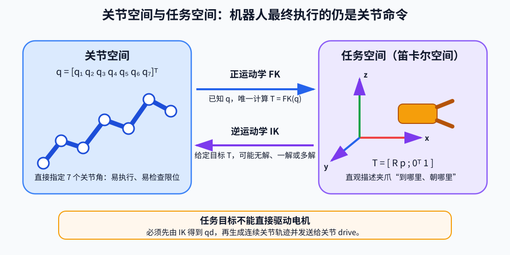
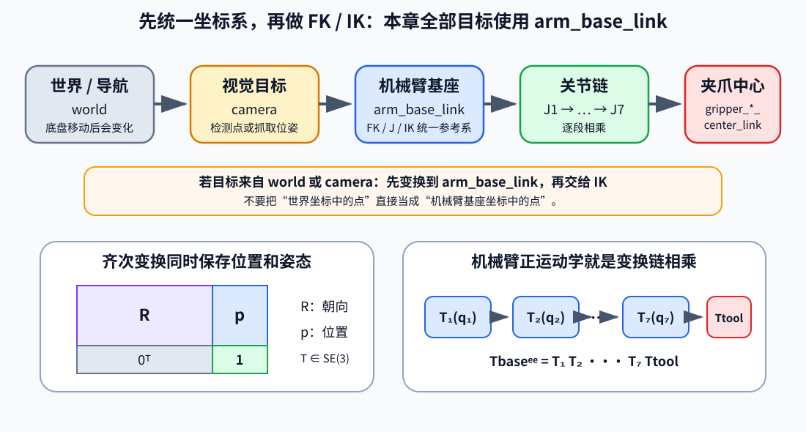
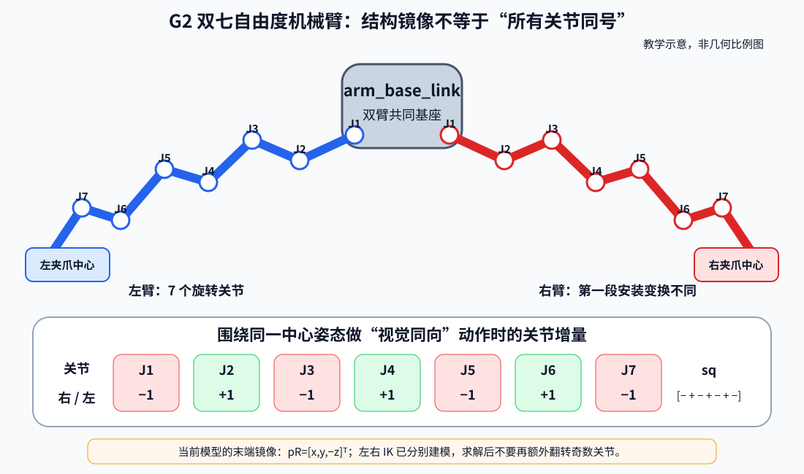
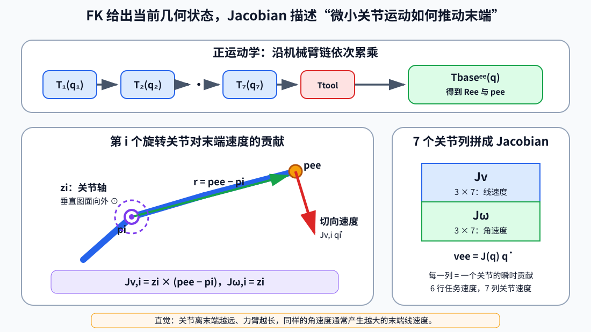
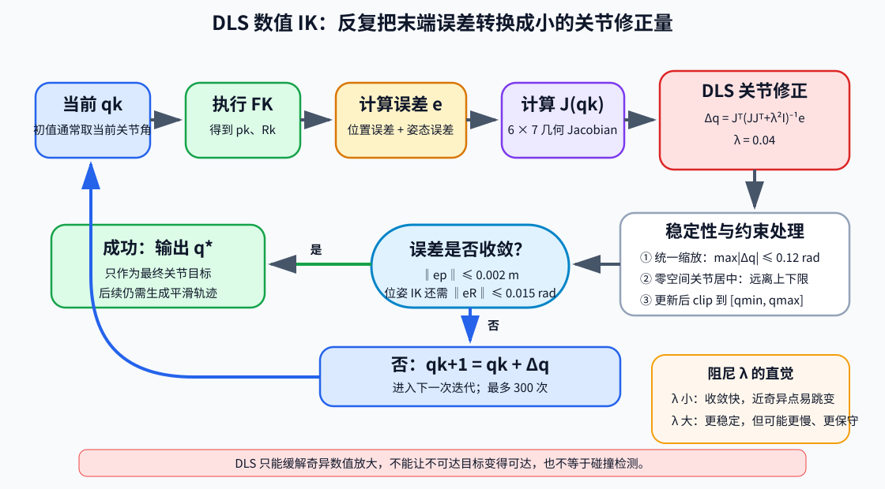
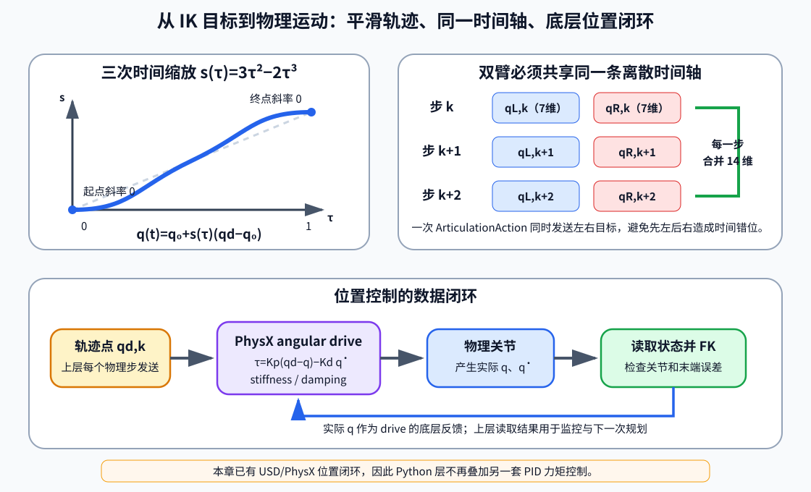

# 第五章 机械臂运动学与关节控制

本章围绕 G2 机器人的双七自由度机械臂展开，从最基础的关节、末端位姿和坐标系开始，逐步讲解 G2 机械臂的结构、正运动学、Jacobian、阻尼最小二乘逆运动学、关节轨迹和双臂同步控制，最后在 Isaac Sim 中完成关节控制、FK/IK 验证以及直接给定末端位置的控制实验。

本章代码位于 `code/code_chapter5`，使用的机器人模型是 `assets/robot/G2_omnipicker/robot.usda`，仿真环境是 `assets/background/room/room_1/background.usda`。

为了让初学者先理解原理、再阅读实现，全文只分为六个部分。前四部分集中讲概念、机器人结构、运动学和控制算法，不穿插源代码；第五部分再把前面的内容对应到代码；第六部分介绍运行方法、实验结果和常见问题。

---

## 第一部分 机械臂运动学与控制基础

### 1.1 从关节运动到末端运动

移动底盘主要改变机器人整体在环境中的位置，机械臂则负责把末端执行器移动到需要操作物体的位置。后续的定点抓取、视觉引导抓取、移动抓取以及视觉语言动作模型，最终都需要转换为机械臂可以执行的关节命令。

机械臂由多个连杆和关节串联组成。G2 的每条机械臂有 7 个旋转关节，因此一条机械臂的关节状态可以写成：

$$
\mathbf{q}= \begin{bmatrix} q_1&q_2&q_3&q_4&q_5&q_6&q_7 \end{bmatrix}^{T}
$$

其中 `q_i` 是第 `i` 个关节的转角，单位通常为弧度。对应的关节角速度为：

$$
\dot{\mathbf{q}}= \begin{bmatrix} \dot q_1&\dot q_2&\dot q_3&\dot q_4&\dot q_5&\dot q_6&\dot q_7 \end{bmatrix}^{T}
$$

机械臂控制通常从两个空间理解。

第一种是关节空间。控制器直接给出 7 个关节角，例如：

$$
\mathbf{q}_{d}= \begin{bmatrix} 0.3&-0.5&0.2&-1.2&0.1&0.4&-0.2 \end{bmatrix}^{T}
$$

关节空间控制容易实现，也容易检查关节限位，但用户很难只看这 7 个数就判断末端会到达哪里。

第二种是任务空间，也称笛卡尔空间。用户直接给出末端执行器的位置和朝向，例如让夹爪中心到达某个三维位置：

$$
\mathbf{p}_{d}= \begin{bmatrix} x_d\\ y_d\\ z_d \end{bmatrix}
$$

如果还要求夹爪朝向，则目标还要包含旋转矩阵 `R_d` 或四元数。任务空间目标更符合“把手移动到这里”的直觉，但机器人最终仍然只能驱动关节，因此必须通过逆运动学把末端目标转换成关节角。

两种空间之间的关系可以概括为：

```text
关节角 q  --正运动学 FK-->  末端位姿 T
末端位姿 T --逆运动学 IK-->  关节角 q
```

正运动学通常有唯一结果：给定完整关节角后，末端位姿可以直接计算。逆运动学可能没有解、只有一组解或存在多组解，因此通常比正运动学更困难。



*图 5-1：FK 把关节角映射为末端位姿，IK 把末端目标转换为机器人可执行的关节目标。*

### 1.2 位置、姿态和位姿

三维空间中的末端状态由位置和姿态共同组成。

位置描述末端在哪里：

$$
\mathbf{p}= \begin{bmatrix} x\\ y\\ z \end{bmatrix}
$$

姿态描述末端朝向哪里。本章内部主要使用旋转矩阵：

$$
\mathbf{R}\in SO(3)
$$

旋转矩阵满足：

$$
\mathbf{R}^{T}\mathbf{R}=\mathbf{I}, \qquad \det(\mathbf{R})=1
$$

位置和姿态合在一起称为位姿。为了让多段连杆变换可以直接相乘，机器人学通常使用 `4×4` 齐次变换矩阵：

$$
\mathbf{T}= \begin{bmatrix} \mathbf{R}&\mathbf{p}\\ \mathbf{0}^{T}&1 \end{bmatrix}
$$

其中左上角 `3×3` 部分是旋转矩阵，右上角 `3×1` 部分是位置向量。

如果已知坐标系 `B` 相对坐标系 `A` 的变换 `T_A^B`，以及坐标系 `C` 相对坐标系 `B` 的变换 `T_B^C`，那么坐标系 `C` 相对坐标系 `A` 的变换为：

$$
\mathbf{T}_{A}^{C} = \mathbf{T}_{A}^{B}\mathbf{T}_{B}^{C}
$$

机械臂正运动学正是按照这种方式，把基座到第一个关节、第一个关节到第二个关节，一直到末端执行器的变换依次相乘。

Isaac Sim 接口经常使用四元数表示姿态。本章统一采用：

$$
\mathbf{q}_{rotation}=[w,x,y,z]
$$

四元数适合接口传递，旋转矩阵适合进行矩阵运算。二者表达的是同一个姿态，不能把旋转四元数和机械臂关节向量 `q` 混为一谈。

如果实验只关心末端到达某个位置，不关心夹爪朝向，可以只给 `p_d`。这种情况称为位置式 IK。如果同时约束 `p_d` 和 `R_d`，则称为完整位姿 IK。

### 1.3 坐标系、弧度和完整控制流程

机械臂控制中最容易出现的错误不是公式本身，而是混用了不同坐标系。

本章所有 FK、Jacobian 和 IK 目标都统一使用 G2 的 `arm_base_link` 坐标系。末端执行器使用夹爪中心：

```text
左臂末端：gripper_l_center_link
右臂末端：gripper_r_center_link
```

因此，目标位置 `[x, y, z]` 表示末端相对 `arm_base_link` 的位置，而不是相对世界坐标系的位置。机器人底盘移动以后，`arm_base_link` 在世界中的位姿会变化，但机械臂内部的运动学仍然可以在这个局部坐标系中计算。

如果以后视觉系统给出的是相机坐标系目标，或者导航系统给出的是世界坐标系目标，必须先通过坐标变换把目标转换到 `arm_base_link`，再交给本章 IK 求解器。



*图 5-2：外部目标先转换到 `arm_base_link`；机械臂内部再通过逐段齐次变换得到夹爪中心位姿。*

机械臂角度在代码和 Isaac Sim 接口中统一使用弧度：

$$
180^\circ=\pi\text{ rad}
$$

常见换算为：

$$
30^\circ\approx0.524\text{ rad}, \qquad 90^\circ\approx1.571\text{ rad}
$$

日志为了方便观察，会把关节角转换成角度输出，但控制计算始终使用弧度。

从用户目标到机器人实际运动的完整流程为：

```text
用户输入关节角或末端目标
        ↓
检查数据形状、数值和关节限位
        ↓
若输入末端目标，则通过 IK 求目标关节角
        ↓
生成连续、首尾速度为零的关节轨迹
        ↓
每个物理步向 Isaac Sim 发送关节位置目标
        ↓
USD 中的关节 drive 执行位置闭环
        ↓
读取实际关节角并通过 FK 检查末端误差
```

这里要区分三个层次：

- FK/IK 解决“关节角与末端位姿如何转换”；
- 轨迹生成解决“怎样从当前关节角平滑走到目标关节角”；
- 关节 drive 解决“物理关节怎样跟踪每一个位置目标”。

只计算 IK 而不生成连续轨迹，机械臂可能突然跳到目标；只生成轨迹而不检查 IK，目标可能根本不可达。完整控制需要把这三个层次连接起来。

---

## 第二部分 G2 双机械臂结构

### 2.1 双七自由度机械臂与关节名称

G2 具有左右两条机械臂，每条机械臂包含 7 个旋转关节。两条机械臂一共包含 14 个主动关节自由度。

左臂关节名称为：

| 关节 | Isaac Sim / USD 自由度名称 |
|---|---|
| J1 | `idx21_arm_l_joint1` |
| J2 | `idx22_arm_l_joint2` |
| J3 | `idx23_arm_l_joint3` |
| J4 | `idx24_arm_l_joint4` |
| J5 | `idx25_arm_l_joint5` |
| J6 | `idx26_arm_l_joint6` |
| J7 | `idx27_arm_l_joint7` |

右臂关节名称为：

| 关节 | Isaac Sim / USD 自由度名称 |
|---|---|
| J1 | `idx61_arm_r_joint1` |
| J2 | `idx62_arm_r_joint2` |
| J3 | `idx63_arm_r_joint3` |
| J4 | `idx64_arm_r_joint4` |
| J5 | `idx65_arm_r_joint5` |
| J6 | `idx66_arm_r_joint6` |
| J7 | `idx67_arm_r_joint7` |

程序不会把关节索引写死，而是在模型加载后根据自由度名称动态查找索引。这样即使 USD 中的自由度排列发生变化，只要关节名称不变，代码仍然可以控制正确的关节。

7 自由度机械臂比完成一般三维位姿任务所需的 6 自由度多一个自由度，因此属于冗余机械臂。冗余自由度意味着末端保持在同一个位姿时，手臂内部仍然可能有不同姿态。例如，肘部可以在一定范围内抬高或降低，而夹爪位置保持近似不变。

冗余性可以用来：

- 远离关节上下限；
- 调整肘部姿态；
- 避开障碍物；
- 提高操作灵活性；
- 在完成末端任务的同时优化其他目标。

本章先使用零空间关节居中，让 IK 解尽量远离关节限位。碰撞规避和更复杂的冗余优化留到后续章节。

### 2.2 关节限位、HOME 姿态和机械臂链

每个关节都有物理角度范围。即使数学上的 IK 可以得到某个解，只要它超出关节限位，真实模型就不能执行。

G2 单臂关节限位如下：

| 关节 | 下限 | 上限 | 约合角度范围 |
|---|---:|---:|---:|
| J1 | -3.1067 rad | 3.1067 rad | -178° ～ 178° |
| J2 | -2.0944 rad | 2.0944 rad | -120° ～ 120° |
| J3 | -3.1067 rad | 3.1067 rad | -178° ～ 178° |
| J4 | -2.5307 rad | 1.0472 rad | -145° ～ 60° |
| J5 | -3.1067 rad | 3.1067 rad | -178° ～ 178° |
| J6 | -1.0472 rad | 1.0472 rad | -60° ～ 60° |
| J7 | -1.5708 rad | 1.5708 rad | -90° ～ 90° |

本章还设置了统一关节速度上限：

$$
\dot q_{max}=3.1416\text{ rad/s}
$$

为了避免一开始就靠近限位，实验使用一个适合教学的 HOME 姿态：

$$
\mathbf{q}_{home}= \begin{bmatrix} 0&-0.35&0&-1.10&0&0.35&0 \end{bmatrix}^{T}
$$

转换成角度约为：

$$
\begin{bmatrix} 0^\circ&-20.1^\circ&0^\circ&-63.0^\circ&0^\circ&20.1^\circ&0^\circ \end{bmatrix}^{T}
$$

这个姿态不是唯一的“正确初始姿态”，而是一个避开多数关节极限、便于观察后续动作的起始姿态。

机械臂运动学模型还需要知道相邻关节之间的固定几何关系。本章根据 G2 模型参数构建七段关节原点变换，并在最后加入 `arm_link7` 到夹爪中心的工具变换。末端工具长度使用实际仿真模型对应的 `0.23645 m`。

对于左臂和右臂，J2 到 J7 的内部链参数相同，主要区别在第一段安装变换：

- 左臂第一关节位于 `arm_base_link` 的一侧；
- 右臂第一关节位于另一侧，并带有绕 `x` 轴的 `π` 旋转；
- 这使左右机械臂形成镜像结构。

因此，不能只创建一个完全相同的运动学模型后同时用于左右臂。本章的 `G2ArmKinematics` 会根据 `arm="left"` 或 `arm="right"` 构造对应的第一段变换。

### 2.3 左右臂镜像关系

G2 双臂是镜像安装的。“两只机械臂同时运动”包含两个不同概念。

第一个概念是时间同步。左右臂在同一个物理步收到目标，同时开始、同时运动、同时结束。

第二个概念是视觉同向。左右臂对应关节在画面中表现为相同方向的动作。由于镜像安装，如果左右两侧所有关节都使用相同正增量，J1、J3、J5、J7 会表现为相反方向。

若左臂相对某个中心姿态的关节增量为：

$$
\Delta\mathbf{q}_{L}= \begin{bmatrix} \Delta q_1&\Delta q_2&\Delta q_3&\Delta q_4&\Delta q_5&\Delta q_6&\Delta q_7 \end{bmatrix}^{T}
$$

视觉同向的右臂增量应为：

$$
\Delta\mathbf{q}_{R}= \begin{bmatrix} -\Delta q_1&\Delta q_2&-\Delta q_3&\Delta q_4&-\Delta q_5&\Delta q_6&-\Delta q_7 \end{bmatrix}^{T}
$$

可以写成逐元素乘法：

$$
\boxed{ \Delta\mathbf{q}_{R} = \mathbf{s}_{q}\odot\Delta\mathbf{q}_{L} }
$$

其中：

$$
\mathbf{s}_{q}= \begin{bmatrix} -1&1&-1&1&-1&1&-1 \end{bmatrix}^{T}
$$

因此，围绕中心姿态 `q_c` 的镜像目标为：

$$
\mathbf{q}_{L,d}=\mathbf{q}_c+\Delta\mathbf{q}_{L}
$$

$$
\mathbf{q}_{R,d}=\mathbf{q}_c+\mathbf{s}_{q}\odot\Delta\mathbf{q}_{L}
$$

在本章统一使用的 `arm_base_link` 坐标系中，视觉同向的左右末端位置还满足一个与当前 G2 模型坐标约定有关的关系。若左臂目标为：

$$
\mathbf{p}_{L,d}= \begin{bmatrix} x&y&z \end{bmatrix}^{T}
$$

对应的右臂镜像目标为：

$$
\boxed{ \mathbf{p}_{R,d}= \begin{bmatrix} x&y&-z \end{bmatrix}^{T} }
$$

这里 `x`、`y` 保持不变，只有 `z` 反号。这个关系来自当前 G2 的 `arm_base_link` 轴方向和左右臂安装方式，不应直接套用到其他机器人。

需要特别注意：镜像关系用于构造双臂任务目标。IK 已经分别使用左右臂真实运动学模型求出了真实关节角，得到 IK 结果以后不能再把右臂奇数关节额外翻转一次，否则会重复镜像并得到错误动作。



*图 5-3：G2 左右臂的安装变换不同；构造视觉同向的关节动作时，奇数关节增量反号、偶数关节保持同号。*

正确顺序是：

```text
构造左右镜像目标
        ↓
左右臂分别执行 FK 或 IK
        ↓
得到两组真实关节角
        ↓
直接同步执行两组 IK 结果
```

---

## 第三部分 机械臂正运动学与 Jacobian

### 3.1 单个关节变换与整条机械臂变换

正运动学解决的问题是：已知 7 个关节角，计算夹爪中心相对机械臂基座的位置和姿态。

对于第 `i` 个旋转关节，可以把它的变换分为两部分：

1. 从上一连杆坐标系移动到该关节原点的固定变换；
2. 围绕该关节轴旋转 `q_i` 的可变变换。

固定变换记为 `T_origin,i`，关节旋转记为 `T_axis,i(q_i)`，那么第 `i` 段变换为：

$$
\mathbf{T}_{i}(q_i) = \mathbf{T}_{origin,i}\mathbf{T}_{axis,i}(q_i)
$$

URDF 中经常用 `xyz` 和 `rpy` 描述固定变换。若滚转、俯仰、偏航角分别为 `r, p, y`，本章采用 URDF 常用顺序：

$$
\mathbf{R}_{rpy} = \mathbf{R}_{z}(y)\mathbf{R}_{y}(p)\mathbf{R}_{x}(r)
$$

如果关节轴不是简单的 `x`、`y` 或 `z` 轴，可以使用 Rodrigues 公式计算绕任意单位轴 `a` 旋转角度 `q` 的旋转矩阵：

$$
\mathbf{R}(\mathbf{a},q) = \cos q\,\mathbf{I} +(1-\cos q)\mathbf{a}\mathbf{a}^{T} +\sin q\,[\mathbf{a}]_{\times}
$$

其中 `[a]_×` 是由旋转轴构成的反对称矩阵。

从 `arm_base_link` 开始，把 7 个关节变换和最后的工具变换依次相乘：

$$
\boxed{ \mathbf{T}_{base}^{ee}(\mathbf{q}) = \mathbf{T}_{1}(q_1) \mathbf{T}_{2}(q_2) \cdots \mathbf{T}_{7}(q_7) \mathbf{T}_{tool} }
$$

最终矩阵可以拆成：

$$
\mathbf{T}_{base}^{ee} = \begin{bmatrix} \mathbf{R}_{ee}&\mathbf{p}_{ee}\\ \mathbf{0}^{T}&1 \end{bmatrix}
$$

于是得到末端位置 `p_ee` 和末端姿态 `R_ee`。

正运动学不是在仿真中试着转动机械臂再读取结果，而是根据几何参数直接计算，因此可以在不启动 Isaac Sim 的情况下运行。仿真中的真实末端位姿主要用于核对自编模型是否正确。

### 3.2 几何 Jacobian 的含义和计算

正运动学描述有限关节角对应的末端位姿，Jacobian 描述关节发生微小变化时，末端会怎样变化。

机械臂末端线速度和角速度合在一起称为末端速度或 twist：

$$
\mathbf{v}_{ee}= \begin{bmatrix} \dot{\mathbf{p}}_{ee}\\ \boldsymbol{\omega}_{ee} \end{bmatrix}
$$

对于 7 自由度机械臂，几何 Jacobian 是一个 `6×7` 矩阵：

$$
\boxed{ \mathbf{v}_{ee} = \mathbf{J}(\mathbf{q})\dot{\mathbf{q}} }
$$

其中：

$$
\mathbf{J}= \begin{bmatrix} \mathbf{J}_{v}\\ \mathbf{J}_{\omega} \end{bmatrix}
$$

`J_v` 的三行描述关节速度对末端线速度的影响，`J_ω` 的三行描述关节速度对末端角速度的影响。

对于第 `i` 个旋转关节，设：

- `p_i` 为关节轴上一点在基座坐标系中的位置；
- `z_i` 为关节旋转轴在基座坐标系中的方向；
- `p_ee` 为末端位置。

那么该关节对应的 Jacobian 列为：

$$
\boxed{ \mathbf{J}_{v,i} = \mathbf{z}_i\times (\mathbf{p}_{ee}-\mathbf{p}_i) }
$$

$$
\boxed{ \mathbf{J}_{\omega,i}=\mathbf{z}_i }
$$

这个公式可以直观理解：旋转关节使末端绕关节轴做圆周运动。圆周切向速度方向由关节轴与“关节到末端”的位置向量叉乘得到。

计算 FK 时，程序已经依次得到了每个关节原点和关节轴，因此可以在同一次链式变换中保存这些量，再构造 Jacobian。



*图 5-4：FK 逐段累乘得到末端位姿；Jacobian 的每一列描述一个关节轴对末端线速度和角速度的瞬时贡献。*

Jacobian 有三个重要用途：

- 根据关节速度估算末端瞬时速度；
- 根据期望末端微小位移计算关节微小变化；
- 判断机械臂是否接近奇异姿态。

本章的数值 IK 正是不断使用 Jacobian，把当前末端误差转换成关节修正量。

### 3.3 位置误差、姿态误差和模型核对

位置误差可以直接相减：

$$
\mathbf{e}_{p} = \mathbf{p}_{d}-\mathbf{p}(\mathbf{q})
$$

其大小为：

$$
\|\mathbf{e}_{p}\|_2
$$

姿态不能直接把两个旋转矩阵逐元素相减。设目标旋转为 `R_d`，当前旋转为 `R_c`，从当前姿态转到目标姿态的相对旋转为：

$$
\mathbf{R}_{error} = \mathbf{R}_{d}\mathbf{R}_{c}^{T}
$$

再把相对旋转转换成轴角形式：

$$
\mathbf{e}_{R}=\theta\mathbf{u}
$$

其中 `u` 是单位旋转轴，`θ` 是需要旋转的角度。`e_R` 的方向表示应绕哪个方向旋转，长度表示还差多少弧度。

完整位姿误差可以组合为：

$$
\mathbf{e}= \begin{bmatrix} \mathbf{e}_{p}\\ w_R\mathbf{e}_{R} \end{bmatrix}
$$

其中 `w_R` 是姿态权重。位置单位是米，姿态单位是弧度，二者数值尺度不同，使用权重可以调节 IK 对位置和姿态的关注程度。本章默认：

$$
w_R=0.35
$$

如果只做位置控制，则只使用：

$$
\mathbf{e}=\mathbf{e}_p, \qquad \mathbf{J}=\mathbf{J}_v
$$

自编运动学模型必须与实际 USD 模型一致，否则 IK 在数学模型中显示成功，仿真中的夹爪却会到达错误位置。本章会在机械臂执行完动作后同时计算：

1. 自编 FK 得到的末端位姿；
2. Isaac Sim 从 USD Prim 读取的真实末端位姿；
3. 两者之间的位置和姿态差。

核对时，程序先读取 `arm_base_link` 和夹爪中心的世界变换，再计算相对变换：

$$
\mathbf{T}_{base}^{ee} = (\mathbf{T}_{world}^{base})^{-1} \mathbf{T}_{world}^{ee}
$$

如果自编 FK 与 USD 的误差很小，说明关节顺序、关节轴、固定变换和工具长度基本正确。

---

## 第四部分 逆运动学与关节控制算法

### 4.1 阻尼最小二乘逆运动学

逆运动学希望根据目标末端位姿求关节角：

$$
\mathbf{q}^{*} = \mathrm{IK}(\mathbf{p}_{d},\mathbf{R}_{d})
$$

对于结构复杂、带关节限位和冗余自由度的 7 自由度机械臂，直接推导完整解析解并不适合入门教学。本章采用阻尼最小二乘数值逆运动学，即 Damped Least Squares Inverse Kinematics，简称 DLS-IK。

DLS-IK 的核心思想可以概括为：从机械臂当前关节角出发，先用 FK 计算夹爪当前位姿，再计算当前位姿与目标位姿之间的误差，然后通过 Jacobian 把末端误差转换成一小步关节角修正。重复这个过程，直到夹爪足够接近目标。

#### 4.1.1 数值 IK 与解析 IK 的区别

解析 IK 是根据机械臂的特定几何结构推导封闭形式公式，输入目标位姿后直接计算关节角。解析法计算速度快，但推导依赖具体机械臂结构，加入关节限位、冗余优化或更换机器人以后，公式通常需要重新设计。

数值 IK 不要求提前写出完整解析解，而是把 IK 看成一个迭代逼近问题。设第 `k` 次迭代的关节角为：

$$
\mathbf{q}_{k} = \begin{bmatrix} q_{1,k}&q_{2,k}&\cdots&q_{7,k} \end{bmatrix}^{T}
$$

先通过正运动学计算当前末端位姿：

$$
\mathbf{T}_{k} = \mathrm{FK}(\mathbf{q}_{k})
$$

然后比较当前末端位姿与目标末端位姿。如果目标可达且迭代过程稳定，关节角序列将逐步趋近某个可行解：

$$
\mathbf{q}_{0} \rightarrow \mathbf{q}_{1} \rightarrow \cdots \rightarrow \mathbf{q}^{*}
$$

数值 IK 的结果会受到初始关节角影响。同一个末端目标可能从不同初值收敛到不同的肘部姿态，也可能因为目标不可达、初始值不合适或接近奇异姿态而无法收敛。本章默认使用机械臂当前关节角作为初始值，使求解结果倾向于靠近当前姿态。

#### 4.1.2 从末端误差到关节修正

沿用 3.3 节定义，当前末端位置为 `p(q_k)`，目标位置为 `p_d`，位置误差为：

$$
\mathbf{e}_{p} = \mathbf{p}_{d}-\mathbf{p}(\mathbf{q}_{k})
$$

例如：

$$
\mathbf{e}_{p} = \begin{bmatrix} 0.03\\ -0.01\\ 0.02 \end{bmatrix}\text{m}
$$

表示夹爪还需要沿三个坐标轴分别移动 `3 cm`、`-1 cm` 和 `2 cm`。如果同时约束姿态，还要加入轴角形式的姿态误差 `e_R`：

$$
\mathbf{e} = \begin{bmatrix} \mathbf{e}_{p}\\ w_R\mathbf{e}_{R} \end{bmatrix}
$$

本章姿态权重为 `w_R = 0.35`。如果只要求末端到达目标位置，则使用：

$$
\mathbf{e}=\mathbf{e}_p, \qquad \mathbf{J}=\mathbf{J}_v
$$

Jacobian 给出了当前姿态附近，关节微小变化和末端微小变化之间的一阶近似关系：

$$
\Delta\mathbf{x} \approx \mathbf{J}(\mathbf{q}_{k})\Delta\mathbf{q}
$$

因此，为了消除当前末端误差，希望找到一组关节修正量，使：

$$
\boxed{ \mathbf{J}(\mathbf{q}_{k})\Delta\mathbf{q} \approx \mathbf{e} }
$$

对于位置式 IK，`J` 是 `3×7` 矩阵；对于完整位姿 IK，`J` 是 `6×7` 矩阵。G2 单臂有 7 个关节，因此 Jacobian 不是可以直接求普通逆矩阵的方阵。

需要注意，这个关系只在当前关节姿态附近近似成立，所以不能期望一次计算就直接到达目标。数值 IK 每次只走一小步，然后在新的关节姿态下重新计算 FK、误差和 Jacobian。

#### 4.1.3 从最小二乘到阻尼最小二乘

最直接的方法是使用 Jacobian 伪逆：

$$
\Delta\mathbf{q} = \mathbf{J}^{\dagger}\mathbf{e}
$$

它对应于寻找一组关节变化，使 `JΔq` 尽量接近末端误差 `e`。但机械臂接近奇异姿态时，某些任务方向上的运动能力会变得很弱。普通伪逆为了消除这些方向上的少量末端误差，可能计算出非常大的关节变化，从而造成关节跳变、震荡或超出限位。

DLS 在末端误差目标之外，额外惩罚过大的关节变化。它求解下面的正则化最小二乘问题：

$$
\boxed{ \min_{\Delta\mathbf{q}} \left( \|\mathbf{J}\Delta\mathbf{q}-\mathbf{e}\|_2^2 + \lambda^2\|\Delta\mathbf{q}\|_2^2 \right) }
$$

其中第一项要求关节修正尽量实现期望末端移动，第二项要求本次关节修正不要过大。参数 `λ` 是阻尼系数，用于控制两者之间的折中。

该优化问题对应的 DLS 伪逆为：

$$
\boxed{ \mathbf{J}_{DLS}^{\dagger} = \mathbf{J}^{T} \left( \mathbf{J}\mathbf{J}^{T}+\lambda^2\mathbf{I} \right)^{-1} }
$$

于是主任务的关节修正量为：

$$
\boxed{ \Delta\mathbf{q}_{task} = \mathbf{J}_{DLS}^{\dagger}\mathbf{e} }
$$

本章默认阻尼系数为：

$$
\lambda=0.04
$$

阻尼越小，DLS 越接近普通伪逆。机械臂远离奇异点时通常收敛较快，但接近奇异点时更容易产生较大的关节步长。阻尼越大，关节修正越保守、数值稳定性越好，但求解速度可能变慢，也可能保留更大的末端误差。因此阻尼并不是越大越好，而是在收敛速度和稳定性之间进行折中。

#### 4.1.4 DLS 为什么能缓解奇异问题

可以通过 Jacobian 的奇异值理解阻尼的作用。普通伪逆在第 `i` 个奇异方向上的误差放大系数近似为：

$$
\frac{1}{\sigma_i}
$$

其中 `σ_i` 是 Jacobian 的第 `i` 个奇异值。机械臂接近奇异姿态时，某个 `σ_i` 会接近零，于是：

$$
\frac{1}{\sigma_i} \rightarrow \infty
$$

这意味着该方向上很小的末端误差也可能被放大成非常大的关节修正。

加入阻尼以后，对应的放大系数变为：

$$
\boxed{ \frac{\sigma_i}{\sigma_i^2+\lambda^2} }
$$

当 `σ_i` 接近零时：

$$
\frac{\sigma_i}{\sigma_i^2+\lambda^2} \rightarrow 0
$$

因此，DLS 不会无限放大机械臂难以实现的运动方向，而是选择更小、更保守的关节修正。它可以缓解奇异点附近的数值发散，但不能消除机械臂结构本身的奇异性，也不能让不可达目标变得可达。

#### 4.1.5 完整迭代过程与停止条件

从初始关节角 `q_0` 开始，一次 DLS-IK 迭代包含以下步骤：

1. 使用 FK 计算当前末端位置和姿态；
2. 计算当前位置误差，完整位姿 IK 还要计算姿态误差；
3. 计算当前关节姿态下的 Jacobian；
4. 使用 DLS 伪逆计算主任务关节修正量；
5. 加入 4.2 节介绍的零空间关节居中修正；
6. 限制单次最大关节步长并执行关节限位裁剪；
7. 更新关节角，再次计算末端误差；
8. 若误差足够小则返回成功，否则继续迭代。

关节角更新为：

$$
\mathbf{q}_{k+1} = \mathbf{q}_{k}+\Delta\mathbf{q}_{k}
$$

本章限制单次最大关节修正量为：

$$
\max_i|\Delta q_i| \le 0.12\text{ rad}
$$

如果某次计算得到的最大关节增量超过该值，就对整个 `Δq` 进行统一缩放，而不是分别裁剪每个分量。这样可以保留关节修正方向，只减小本次迭代的步长。

位置式 IK 的收敛条件为：

$$
\|\mathbf{e}_{p}\|_2 \le 0.002\text{ m}
$$

即末端位置误差不超过 `2 mm`。完整位姿 IK 还要求：

$$
\|\mathbf{e}_{R}\|_2 \le 0.015\text{ rad}
$$

如果达到最大 300 次迭代仍未满足条件，求解器返回 `success=False`，而不是把未收敛结果直接发送给机械臂。

#### 4.1.6 DLS-IK 在完整控制链中的位置

DLS-IK 只负责把末端目标转换成最终目标关节角：

```text
目标末端位姿
      ↓
DLS 数值 IK
      ↓
目标关节角 q*
```

它本身不是关节控制器，也不会直接产生平滑的物理运动。IK 成功以后，还要由 4.3 节的轨迹生成器把当前关节角和目标关节角连接成连续轨迹，再由 USD/PhysX 中的关节 drive 跟踪每个物理步的位置目标：

```text
目标关节角 q*
      ↓
关节轨迹生成
      ↓
连续位置目标 q(t)
      ↓
关节 drive 位置闭环
      ↓
机械臂实际运动
```

因此，DLS-IK 解决的是“关节角与末端位姿之间如何转换”，轨迹生成解决的是“如何平滑到达目标”，关节 drive 解决的是“物理关节如何跟踪每一个轨迹点”。三者不能相互替代。

DLS 可以提高奇异点附近的数值稳定性，但仍不包含自身碰撞检测、环境碰撞检测和全局路径规划。IK 返回成功只表示在当前运动学模型和误差阈值下找到了关节解，不代表从当前姿态到该目标的整段运动一定安全。

### 4.2 冗余自由度、零空间和关节限位

G2 单臂有 7 个关节，而完整末端位姿只有 6 个约束，因此 Jacobian 有 7 列、最多 6 个独立任务方向。多出的自由度形成 Jacobian 的零空间。

零空间中的关节变化满足：

$$
\mathbf{J}\Delta\mathbf{q}_{null}\approx\mathbf{0}
$$

这表示机械臂可以改变部分内部姿态，同时尽量不影响当前末端任务。

DLS 伪逆对应的零空间投影矩阵为：

$$
\mathbf{N} = \mathbf{I}-\mathbf{J}_{DLS}^{\dagger}\mathbf{J}
$$

关节上下限中心为：

$$
\mathbf{q}_{center} = \frac{\mathbf{q}_{min}+\mathbf{q}_{max}}{2}
$$

为了让关节远离限位，可以构造指向关节中心的修正方向，再投影到零空间：

$$
\Delta\mathbf{q}_{center} = k_c\mathbf{N}\mathbf{g}_{center}
$$

其中 `k_c` 是关节居中增益，本章默认 `0.03`。最终修正量为：

$$
\boxed{ \Delta\mathbf{q} = \mathbf{J}_{DLS}^{\dagger}\mathbf{e} + \Delta\mathbf{q}_{center} }
$$

更新以后还要执行关节限位裁剪：

$$
\mathbf{q} = \mathrm{clip} (\mathbf{q},\mathbf{q}_{min},\mathbf{q}_{max})
$$

零空间关节居中不能保证避开所有奇异姿态，也不能代替碰撞检测，但它比完全忽略冗余自由度更稳定，尤其适合展示 7 自由度机械臂为什么会出现多组 IK 解。

IK 的初始值也会影响最终结果。本章默认使用当前关节角作为初始值，使求解结果倾向于靠近机械臂当前姿态，通常可以减少突然翻肘或跨越较大关节角的情况。



*图 5-5：DLS IK 在 FK、误差、Jacobian 和关节修正之间循环，并同时处理步长、零空间居中和关节限位。*

### 4.3 关节轨迹、位置闭环与是否需要 PID

IK 只给出最终目标关节角，不应该在一个物理步内让关节直接从当前位置跳到目标。为了得到平滑运动，本章使用三次时间缩放。

设轨迹总时间为 `T`，归一化时间为：

$$
\tau=\frac{t}{T}, \qquad0\le\tau\le1
$$

三次时间缩放函数为：

$$
\boxed{ s(\tau)=3\tau^2-2\tau^3 }
$$

关节轨迹为：

$$
\boxed{ \mathbf{q}(t) = \mathbf{q}_0+s(\tau) (\mathbf{q}_d-\mathbf{q}_0) }
$$

该函数满足：

$$
s(0)=0, \quad s(1)=1, \quad \dot s(0)=0, \quad \dot s(1)=0
$$

因此机械臂从静止开始，在终点以零速度停止，比关节角线性跳变更平滑。

程序还根据关节角变化和速度上限自动检查最短持续时间。为了给物理关节留出跟踪余量，平均关节速度不超过模型速度上限的 60%。如果用户指定时间过短，程序会自动延长轨迹时间。

本章不在 Python 层额外实现 PID，原因是 G2 的 USD 关节已经配置了 PhysX angular drive，其中包含位置刚度和阻尼。其作用类似底层 PD 位置闭环：

$$
\tau =K_p(q_d-q)-K_d\dot q
$$

本章模型中的主要参数为：

```text
stiffness = 10000
damping   = 1000
```

上层代码发送连续位置目标，底层 drive 负责产生关节作用力并跟踪目标。如果在 Python 层再叠加一套 PID 力矩控制，会形成双重闭环，增加参数调节难度，也会掩盖本章 FK、IK 和轨迹生成的重点。

当课程进入机器人动力学、重力补偿、力矩控制或柔顺控制时，再自行实现 PID、计算力矩控制或阻抗控制更合适。

### 4.4 双臂同步控制与算法边界

双臂同步控制不能简单地先调用一次左臂控制，再调用一次右臂控制。即使两次调用间隔很短，也可能导致动作时间轴不完全一致。

本章为左右臂分别生成长度相同的轨迹：

$$
\mathbf{Q}_L= \{\mathbf{q}_{L,0},\ldots,\mathbf{q}_{L,N}\}
$$

$$
\mathbf{Q}_R= \{\mathbf{q}_{R,0},\ldots,\mathbf{q}_{R,N}\}
$$

每个物理步同时取出左右两个轨迹点，并在一个 `ArticulationAction` 中发送 14 个关节位置目标：

$$
\mathbf{q}_{both} = \begin{bmatrix} \mathbf{q}_{L}\\ \mathbf{q}_{R} \end{bmatrix}
$$

这样可以保证两条机械臂共享同一条时间轴。



*图 5-6：IK 结果先经过三次时间缩放；左右臂在每个物理步合并发送，底层 PhysX drive 完成关节位置闭环。*

对于人为设计的对称关节动作，先使用奇数关节反号关系构造右臂目标，再同步执行。

对于双臂 FK/IK 演示，先构造左右镜像关节姿态，分别通过左右 FK 得到真实末端目标，再让左右 IK 独立求解。

对于直接输入末端位置，两个目标都是 `arm_base_link` 下的绝对坐标。如果希望视觉同向，按 `[x, y, z] → [x, y, -z]` 构造右臂目标；如果确实希望两只手到达两个不对称位置，也可以分别输入任意可达目标。

本章算法仍有以下边界：

- IK 不包含机器人自身碰撞和环境碰撞检测；
- 关节轨迹只在关节空间插值，末端路径不一定是直线；
- 位置式 IK 不约束夹爪朝向，最终姿态可能与预想不同；
- 单个末端位姿可能存在多组关节解，结果受初始值影响；
- DLS 可以缓解奇异问题，但不能让不可达目标变得可达；
- 本章只控制机械臂，不控制夹爪开合，也不执行物体抓取。

这些内容将在第六章移动与抓取，以及后续视觉抓取章节中继续扩展。

---

## 第五部分 代码实现

### 5.1 文件组织与统一配置

本章代码继续采用“运动学、控制器、仿真环境和演示程序分离”的结构：

```text
code/code_chapter5/
├── __init__.py
├── README.md
├── config.py
├── kinematics.py
├── arm_controller.py
├── simulation.py
├── demo_joint_control.py
├── demo_fk_ik.py
└── demo_target_position.py
```

各文件职责如下：

| 文件 | 主要职责 |
|---|---|
| `config.py` | 模型路径、场景路径、关节名、关节限位、镜像符号和 IK 参数 |
| `kinematics.py` | 纯 NumPy 齐次变换、FK、Jacobian 和 DLS-IK |
| `arm_controller.py` | 单臂/双臂关节查找、限位、轨迹、同步控制和运动学调用 |
| `simulation.py` | 启动 Isaac Sim，加载 `room_1` 和 G2，推进仿真并读取末端位姿 |
| `demo_joint_control.py` | 单臂逐关节控制和双臂视觉同向关节控制 |
| `demo_fk_ik.py` | FK 生成目标、IK 反求关节角、执行并核对模型 |
| `demo_target_position.py` | 直接输入左右末端位置并进行位置式 IK 控制 |

推荐阅读顺序为：

```text
config.py
    ↓
kinematics.py
    ↓
arm_controller.py
    ↓
demo_joint_control.py
    ↓
demo_fk_ik.py
    ↓
demo_target_position.py
    ↓
simulation.py
```

`config.py` 首先集中保存模型路径、场景路径和末端 Prim：

```python
PROJECT_ROOT = Path(__file__).resolve().parents[2]
ROBOT_USD = PROJECT_ROOT / "assets/robot/G2_omnipicker/robot.usda"
ROOM_USD = PROJECT_ROOT / "assets/background/room/room_1/background.usda"

ROBOT_PRIM_PATH = "/genie"
ARM_BASE_PRIM_PATH = f"{ROBOT_PRIM_PATH}/arm_base_link"
END_EFFECTOR_PRIM_PATHS = {
    "left": f"{ROBOT_PRIM_PATH}/gripper_l_center_link",
    "right": f"{ROBOT_PRIM_PATH}/gripper_r_center_link",
}
```

左右机械臂关节名称通过固定规则生成：

```python
ARM_JOINT_NAMES = {
    "left": tuple(f"idx2{i}_arm_l_joint{i}" for i in range(1, 8)),
    "right": tuple(f"idx6{i}_arm_r_joint{i}" for i in range(1, 8)),
}
```

关节限位、速度上限和 HOME 姿态统一保存为 NumPy 数组：

```python
JOINT_LOWER_LIMITS = np.array(
    [-3.1067, -2.0944, -3.1067, -2.5307,
     -3.1067, -1.0472, -1.5708]
)
JOINT_UPPER_LIMITS = np.array(
    [3.1067, 2.0944, 3.1067, 1.0472,
     3.1067, 1.0472, 1.5708]
)
JOINT_VELOCITY_LIMITS = np.full(7, 3.1416)

HOME_JOINT_POSITIONS = np.array(
    [0.0, -0.35, 0.0, -1.10, 0.0, 0.35, 0.0]
)
```

双臂镜像关系也集中放在配置文件中：

```python
MIRRORED_JOINT_DELTA_SIGNS = np.array(
    [-1.0, 1.0, -1.0, 1.0, -1.0, 1.0, -1.0]
)

MIRRORED_END_EFFECTOR_POSITION_SIGNS = np.array(
    [1.0, 1.0, -1.0]
)
```

IK 参数统一由数据类保存：

```python
@dataclass(frozen=True)
class IKConfig:
    max_iterations: int = 300
    position_tolerance: float = 0.002
    orientation_tolerance: float = 0.015
    damping: float = 0.04
    max_joint_step: float = 0.12
    orientation_weight: float = 0.35
    joint_center_gain: float = 0.03
```

这些参数集中管理后，调节容差和阻尼时不需要修改 IK 主循环。

### 5.2 正运动学、Jacobian 与 IK 代码

`kinematics.py` 中先用两个数据类表示位姿和 IK 结果：

```python
@dataclass(frozen=True)
class Pose:
    position: np.ndarray
    rotation: np.ndarray

    @property
    def quaternion(self):
        return matrix_to_quaternion(self.rotation)


@dataclass(frozen=True)
class IKResult:
    joint_positions: np.ndarray
    success: bool
    iterations: int
    position_error: float
    orientation_error: float
```

齐次变换由平移 `xyz` 和欧拉角 `rpy` 构造：

```python
def transform(xyz=(0.0, 0.0, 0.0), rpy=(0.0, 0.0, 0.0)):
    roll, pitch, yaw = rpy
    result = np.eye(4, dtype=np.float64)
    result[:3, :3] = (
        rotation_z(yaw)
        @ rotation_y(pitch)
        @ rotation_x(roll)
    )
    result[:3, 3] = np.asarray(xyz, dtype=np.float64)
    return result
```

左右机械臂根据不同的第一段安装变换构建链：

```python
first_xyz = (
    (0.0, 0.0, 0.069)
    if arm == "left"
    else (0.0, 0.0, -0.069)
)
first_rpy = (
    (0.0, 0.0, 0.0)
    if arm == "left"
    else (math.pi, 0.0, 0.0)
)

self.joint_origins = (
    transform(first_xyz, first_rpy),
    transform((0.0, 0.0, 0.1745), (math.pi / 2.0, 0.0, 0.0)),
    transform((0.0, 0.0, 0.0), (-math.pi / 2.0, 0.0, 0.0)),
    transform((0.018, 0.0, 0.287), (math.pi / 2.0, 0.0, 0.0)),
    transform((-0.018, 0.0, 0.0), (-math.pi / 2.0, 0.0, 0.0)),
    transform((0.0, 0.0, 0.314), (math.pi / 2.0, 0.0, 0.0)),
    transform((0.0, 0.0, 0.0),
              (math.pi / 2.0, 0.0, math.pi / 2.0)),
)
```

链式计算一边得到末端变换，一边保存每个关节的位置和轴：

```python
def _chain(self, joint_positions):
    q = _as_vector(joint_positions, 7, "joint_positions")
    current = np.eye(4, dtype=np.float64)
    joint_points, joint_axes = [], []

    for origin, local_axis, angle in zip(
        self.joint_origins, self.joint_axes, q
    ):
        current = current @ origin
        joint_points.append(current[:3, 3].copy())
        joint_axes.append(current[:3, :3] @ local_axis)
        current = current @ axis_rotation(local_axis, float(angle))

    end_transform = current @ self.tool_transform
    return end_transform, joint_points, joint_axes
```

正运动学只需取出最终变换：

```python
def forward(self, joint_positions):
    end_transform, _, _ = self._chain(joint_positions)
    return Pose(
        end_transform[:3, 3].copy(),
        end_transform[:3, :3].copy(),
    )
```

Jacobian 使用保存的关节原点和轴：

```python
def jacobian(self, joint_positions):
    end_transform, joint_points, joint_axes = self._chain(joint_positions)
    end_position = end_transform[:3, 3]
    jacobian = np.zeros((6, 7), dtype=np.float64)

    for i, (point, axis) in enumerate(zip(joint_points, joint_axes)):
        jacobian[:3, i] = np.cross(axis, end_position - point)
        jacobian[3:, i] = axis

    return jacobian
```

DLS-IK 主循环先计算误差和 Jacobian：

```python
pose = self.forward(q)
position_delta = target_p - pose.position
full_jacobian = self.jacobian(q)

if target_r is None:
    error = position_delta
    jacobian = full_jacobian[:3]
else:
    rotation_delta = orientation_error(
        target_r, pose.rotation
    )
    error = np.concatenate(
        (position_delta,
         cfg.orientation_weight * rotation_delta)
    )
    jacobian = np.vstack(
        (full_jacobian[:3],
         cfg.orientation_weight * full_jacobian[3:])
    )
```

随后计算阻尼伪逆和关节修正量：

```python
task_size = jacobian.shape[0]
damped = (
    jacobian @ jacobian.T
    + (cfg.damping ** 2) * np.eye(task_size)
)
pseudo_inverse = (
    jacobian.T
    @ np.linalg.solve(damped, np.eye(task_size))
)
delta_q = pseudo_inverse @ error
```

关节居中项经过零空间投影后加入：

```python
normalized_center_error = (
    (center - q) / (half_range * half_range)
)
nullspace = np.eye(7) - pseudo_inverse @ jacobian
delta_q += cfg.joint_center_gain * (
    nullspace @ normalized_center_error
)
```

最后限制单次步长并裁剪关节范围：

```python
largest_step = float(np.max(np.abs(delta_q)))
if largest_step > cfg.max_joint_step:
    delta_q *= cfg.max_joint_step / largest_step

q = np.clip(
    q + delta_q,
    self.lower_limits,
    self.upper_limits,
)
```

循环在误差达到容差时返回成功结果；达到最大迭代次数仍未收敛时返回失败结果。

### 5.3 单臂、双臂关节控制代码

`G2ArmController` 初始化时，根据关节名称查找当前模型中的自由度索引：

```python
def _find_joint_indices(self):
    dof_names = list(self.articulation.dof_names)
    missing = [
        name for name in self.joint_names
        if name not in dof_names
    ]
    if missing:
        raise RuntimeError(
            f"G2 模型缺少机械臂关节：{missing}"
        )

    return np.array(
        [dof_names.index(name) for name in self.joint_names],
        dtype=np.int64,
    )
```

发送单臂关节位置目标前，先进行数据检查和关节限位：

```python
def command_positions(self, positions):
    target = self.clamp_positions(positions)
    self.articulation.apply_action(
        ArticulationAction(
            joint_positions=target,
            joint_indices=self.joint_indices,
        )
    )
    return target
```

三次时间缩放轨迹实现为：

```python
def make_trajectory(self, target_positions, duration, dt,
                    start_positions=None):
    start = (
        self.get_joint_positions()
        if start_positions is None
        else self._check_positions(start_positions)
    )
    target = self.clamp_positions(target_positions)

    minimum_duration = float(np.max(
        np.abs(target - start)
        / (0.6 * self.velocity_limits)
    ))
    duration = max(float(duration), minimum_duration)

    steps = max(2, int(np.ceil(duration / dt)))
    tau = np.linspace(0.0, 1.0, steps + 1)[1:]
    scale = 3.0 * tau**2 - 2.0 * tau**3

    return (
        start[None, :]
        + scale[:, None] * (target - start)[None, :]
    )
```

执行轨迹时，每个物理步发送一个关节目标并推进仿真：

```python
def move_to(self, target_positions, duration, dt, step_callback):
    trajectory = self.make_trajectory(
        target_positions, duration, dt
    )

    for waypoint in trajectory:
        self.command_positions(waypoint)
        step_callback()

    final_target = trajectory[-1]
    for _ in range(max(1, int(0.25 / dt))):
        self.command_positions(final_target)
        step_callback()

    return self.get_joint_positions()
```

双臂控制器把左右 7 个关节目标合并成 14 个关节目标，并在同一个 action 中发送：

```python
def command_positions(self, left_positions, right_positions):
    left_target = self.left.clamp_positions(left_positions)
    right_target = self.right.clamp_positions(right_positions)
    targets = np.concatenate((left_target, right_target))

    self.articulation.apply_action(
        ArticulationAction(
            joint_positions=targets,
            joint_indices=self.joint_indices,
        )
    )
```

视觉同向关节目标由中心姿态和左臂增量生成：

```python
def mirrored_targets(self, center_positions, left_offsets):
    center = self.left._check_positions(center_positions)
    offsets = self.left._check_positions(left_offsets)

    return {
        "left": self.left.clamp_positions(center + offsets),
        "right": self.right.clamp_positions(
            center
            + MIRRORED_JOINT_DELTA_SIGNS * offsets
        ),
    }
```

双臂逐关节演示依次让 J1 到 J7 运动。J1、J3、J5、J7 的右臂增量自动反号：

```python
for joint_id in range(7):
    offsets = np.zeros(7, dtype=np.float64)
    offsets[joint_id] = 0.30

    arms.move_mirrored(
        HOME_JOINT_POSITIONS,
        offsets,
        1.2,
        dt,
        sim.step,
    )

    arms.move_mirrored(
        HOME_JOINT_POSITIONS,
        np.zeros(7),
        1.0,
        dt,
        sim.step,
    )
```

这里 `move_mirrored()` 用于人工构造的视觉同向动作；一般的左右独立目标应使用 `move_to(left_target, right_target, ...)`。

### 5.4 FK/IK 与末端位置控制代码

`demo_fk_ik.py` 的单臂流程先用一个已知可达关节姿态做 FK，得到目标末端位姿：

```python
target_pose = arm.kinematics.forward(
    DEMO_TARGET_JOINT_POSITIONS
)
```

然后从 HOME 姿态出发，用自编 IK 反求关节角：

```python
target_rotation = (
    None if position_only else target_pose.rotation
)
result = arm.solve_ik(
    target_pose.position,
    target_rotation,
    HOME_JOINT_POSITIONS,
)
```

这种“已知关节角做 FK 得到目标，再用 IK 求回来”的实验非常适合检查算法，因为目标一定来自机械臂自身工作空间。IK 结果不一定与最初关节角完全相同，因为 7 自由度机械臂可能存在多组解，但它们对应的末端位姿应一致。

双臂 FK/IK 不能直接让左右两侧使用同一组演示关节角，否则镜像安装会让奇数关节在画面中反向。代码先生成镜像关节目标：

```python
target_joint_positions = arms.mirrored_targets(
    HOME_JOINT_POSITIONS,
    DEMO_TARGET_JOINT_POSITIONS
    - HOME_JOINT_POSITIONS,
)
```

再分别通过左右臂 FK 得到两个真实末端目标：

```python
target_poses = {
    side: getattr(arms, side).kinematics.forward(
        target_joint_positions[side]
    )
    for side in ("left", "right")
}
```

左右 IK 独立求解：

```python
results = arms.solve_ik(
    left_position=target_poses["left"].position,
    right_position=target_poses["right"].position,
    left_rotation=(
        None if position_only
        else target_poses["left"].rotation
    ),
    right_rotation=(
        None if position_only
        else target_poses["right"].rotation
    ),
)
```

两边都成功后再同步执行：

```python
arms.move_to(
    results["left"].joint_positions,
    results["right"].joint_positions,
    3.5,
    dt,
    sim.step,
)
```

`demo_target_position.py` 直接接受末端三维位置。默认左臂目标为：

```python
DEFAULT_LEFT_TARGET_POSITION = np.array(
    [0.50, 0.35, 0.45],
    dtype=np.float64,
)
```

右臂视觉同向目标根据末端镜像符号生成：

```python
DEFAULT_TARGET_POSITIONS = {
    "left": DEFAULT_LEFT_TARGET_POSITION.copy(),
    "right": (
        MIRRORED_END_EFFECTOR_POSITION_SIGNS
        * DEFAULT_LEFT_TARGET_POSITION
    ),
}
```

得到：

```text
left  = [0.50, 0.35,  0.45]
right = [0.50, 0.35, -0.45]
```

双臂位置 IK 分别求解，再同步执行：

```python
results = arms.solve_ik(
    targets["left"],
    targets["right"],
)

arms.move_to(
    results["left"].joint_positions,
    results["right"].joint_positions,
    duration,
    dt,
    sim.step,
)
```

如果用户输入的右臂位置不是左臂位置的视觉同向镜像，程序会给出提示，但仍然把它作为独立绝对目标执行。这样既保留了教学中的镜像动作，也支持两只机械臂执行不同任务。

`simulation.py` 启动 Isaac Sim 后加载 `room_1` 和 G2：

```python
self.world = World(
    stage_units_in_meters=1.0,
    physics_dt=self.config.physics_dt,
    rendering_dt=1.0 / self.config.rendering_hz,
)

add_reference_to_stage(str(ROOM_USD), ROOM_PRIM_PATH)
self.world.scene.add_default_ground_plane()
add_reference_to_stage(str(ROBOT_USD), ROBOT_PRIM_PATH)
```

读取末端相对基座位姿时，先获得两个 Prim 的世界变换，再计算相对变换：

```python
base_world = np.asarray(
    cache.GetLocalToWorldTransform(base_prim),
    dtype=np.float64,
).T
child_world = np.asarray(
    cache.GetLocalToWorldTransform(child_prim),
    dtype=np.float64,
).T

relative = np.linalg.inv(base_world) @ child_world
```

这样得到的结果与自编 FK 使用相同的 `arm_base_link` 坐标系，可以直接比较。

---

## 第六部分 运行与结果展示

### 6.1 运行三个机械臂示例

先进入本地项目根目录（即包含 `code`、`chapter4` 和 `chapter5` 的目录）。下面的 `/path/to/project-root` 是路径占位符，请替换为自己电脑上的实际路径：

```bash
cd /path/to/project-root
```

仿真程序必须使用 Isaac Sim 自带的 Python 环境。下列 `/path/to/isaac-sim/python.sh` 是路径占位符，请替换为自己电脑上 Isaac Sim 的实际安装路径。

单臂关节控制默认控制右臂：

```bash
/path/to/isaac-sim/python.sh \
code/code_chapter5/demo_joint_control.py
```

只控制左臂：

```bash
/path/to/isaac-sim/python.sh \
code/code_chapter5/demo_joint_control.py \
--arm left
```

双臂视觉同向关节控制：

```bash
/path/to/isaac-sim/python.sh \
code/code_chapter5/demo_joint_control.py \
--arm both
```

双臂完整位姿 FK/IK：

```bash
/path/to/isaac-sim/python.sh \
code/code_chapter5/demo_fk_ik.py \
--arm both
```

双臂只约束末端位置：

```bash
/path/to/isaac-sim/python.sh \
code/code_chapter5/demo_fk_ik.py \
--arm both \
--position-only
```

双臂直接到达默认末端位置：

```bash
/path/to/isaac-sim/python.sh \
code/code_chapter5/demo_target_position.py \
--arm both
```

分别指定左右臂视觉同向的末端位置：

```bash
/path/to/isaac-sim/python.sh \
code/code_chapter5/demo_target_position.py \
--arm both \
--left-x 0.50 --left-y 0.35 --left-z 0.45 \
--right-x 0.50 --right-y 0.35 --right-z -0.45
```

单独给右臂一个位置：

```bash
/path/to/isaac-sim/python.sh \
code/code_chapter5/demo_target_position.py \
--arm right \
--x 0.50 --y 0.35 --z -0.45
```

在没有图形界面或只想快速验证算法时，可以在任意命令末尾加入：

```text
--headless
```

有界面运行时，程序完成动作后会继续推进仿真，关闭 Isaac Sim 窗口即可退出。

### 6.2 关节控制实验结果

双臂关节控制会先让左右臂同时回到 HOME，然后依次演示 J1 到 J7。日志中的目标方向应为：

```text
J1：左 +17.2°，右 -17.2°
J2：左 +17.2°，右 +17.2°
J3：左 +17.2°，右 -17.2°
J4：左 +20.1°，右 +20.1°
J5：左 +17.2°，右 -17.2°
J6：左 +17.2°，右 +17.2°
J7：左 +17.2°，右 -17.2°
```

这说明 J1、J3、J5、J7 已按照左右镜像关系反号，J2、J4、J6 保持同号。

一次实际仿真验证得到的组合动作关节误差为：

```text
左臂误差（deg）：
[ 0.004, -0.007,  0.008, -0.007,  0.014,  0.003, -0.007]

右臂误差（deg）：
[-0.005, -0.007, -0.008, -0.006, -0.015,  0.003,  0.007]
```

最大误差约为 `0.015°`，说明三次关节轨迹和 USD 位置 drive 能够准确跟踪目标。

观察画面时应重点确认两件事：

- 左右臂是否同时开始、同时结束；
- 对应关节在机器人两侧是否表现为视觉同向。

如果时间同步但视觉方向相反，说明目标没有使用镜像符号；如果视觉方向正确但一边明显滞后，则需要检查两边轨迹长度和是否在同一个 action 中发送。

### 6.3 FK/IK 和末端位置实验结果


双臂完整位姿 FK/IK 会先构造镜像关节目标，再通过左右 FK 生成目标位姿。一次实际验证的 IK 结果为：

```text
左臂 IK 关节角（deg）：
[ 22.83, -32.03,  21.62, -77.38,  8.62, 28.90, -12.62]

右臂 IK 关节角（deg）：
[-22.83, -32.03, -21.62, -77.38, -8.62, 28.90,  12.62]
```

可以看到，IK 独立求解以后仍然得到正确的镜像关系：奇数关节反号，偶数关节同号。

完整位姿控制结果为：

```text
左臂末端位置误差：0.180 mm
左臂末端姿态误差：0.020°

右臂末端位置误差：0.179 mm
右臂末端姿态误差：0.020°
```

自编 FK 与 USD 模型核对结果为：

```text
左臂位置差：0.001 mm，姿态差：0.001°
右臂位置差：0.000 mm，姿态差：0.000°
```

这说明自编 FK 的关节顺序、关节轴、连杆变换和工具变换与实际 G2 USD 基本一致。

直接输入双臂末端位置时，默认目标为：

```text
left  = [0.50, 0.35,  0.45] m
right = [0.50, 0.35, -0.45] m
```

一次实际位置式 IK 的结果为：

```text
左臂关节角（deg）：
[ 17.52, -10.36,  15.66, -94.88, -2.37, 12.39, -7.23]

右臂关节角（deg）：
[-17.52, -10.36, -15.66, -94.88,  2.37, 12.39,  7.23]
```

最终末端位置为：

```text
left  = [0.4998, 0.3498,  0.4499] m
right = [0.4998, 0.3498, -0.4499] m
```

左右末端位置误差均约为 `0.322 mm`。

需要注意，位置式 IK 没有约束末端姿态，因此只需要检查位置误差。夹爪最后的朝向可能与完整位姿 IK 不同，这是算法目标不同造成的正常现象，并不表示 IK 出错。

### 6.4 常见问题与本章总结

如果机械臂完全不动，首先检查程序是否成功找到关节名称，以及 `ArticulationAction` 中的 `joint_indices` 是否对应机械臂关节。

如果左右臂同时使用正关节增量后方向相反，应检查镜像符号：

```text
[-1, 1, -1, 1, -1, 1, -1]
```

如果双臂 FK/IK 方向相反，不要在 IK 结果出来以后直接翻转右臂关节角。应先构造镜像目标，再让左右运动学模型分别进行 FK 和 IK。

如果直接给末端位置时双臂方向相反，应检查 `arm_base_link` 下的目标关系。视觉同向的正确关系为：

```text
left  = [x, y,  z]
right = [x, y, -z]
```

不是：

```text
right = [x, -y, -z]
```

如果 IK 返回 `success=False`，常见原因包括：

- 目标位置超出工作空间；
- 目标姿态与位置组合不可达；
- 初始姿态太接近关节限位或奇异位置；
- 阻尼过大导致收敛太慢；
- 最大迭代次数过少；
- 左右臂目标坐标系使用错误。

可以先尝试以下方法：

1. 只使用 `--position-only` 检查位置是否可达；
2. 把目标放到当前末端附近；
3. 从 HOME 姿态开始求解；
4. 检查目标是否确实位于 `arm_base_link` 坐标系；
5. 适当增加最大迭代次数，但不要忽略最终残差。

如果 IK 显示成功，但仿真中的末端位置明显不对，应重点检查自编 FK 与 USD 的模型核对结果。较大的模型差通常意味着连杆参数、工具长度、关节轴、关节顺序或末端 Prim 路径存在错误。

如果关节动作抖动或冲击明显，应检查是否绕过了三次轨迹直接发送最终目标，以及轨迹持续时间是否过短。当前代码会根据关节速度上限自动延长过短轨迹。

本章完成了从关节角到末端位姿、再从末端目标返回关节角的完整闭环：

```text
关节目标
    ↓
关节限位与三次轨迹
    ↓
Isaac Sim 位置 drive
    ↓
实际关节角
    ↓
自编 FK 与 USD 核对
```

以及：

```text
末端目标
    ↓
位置/姿态误差
    ↓
Jacobian
    ↓
DLS-IK 与零空间关节居中
    ↓
目标关节角
    ↓
单臂或双臂同步执行
```


