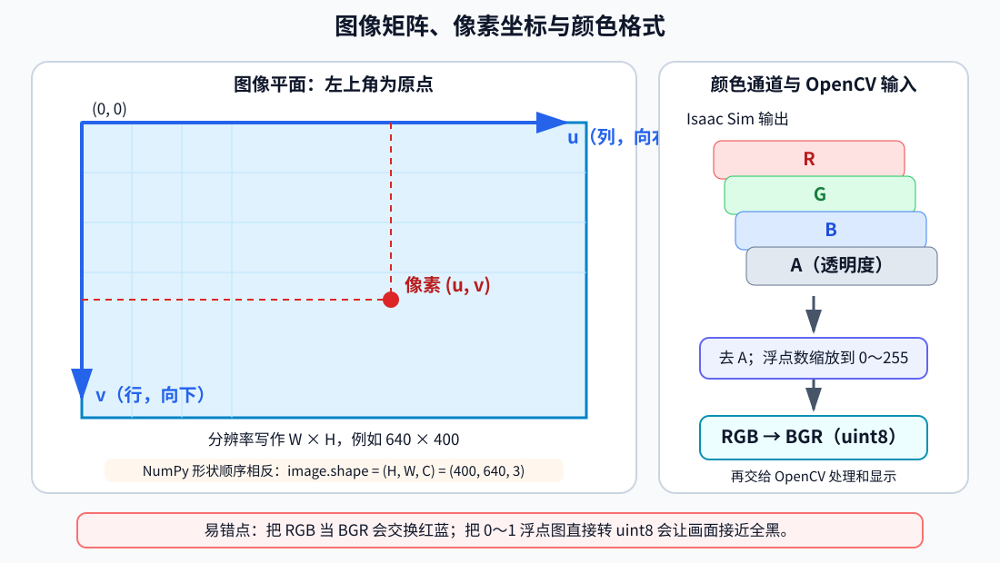
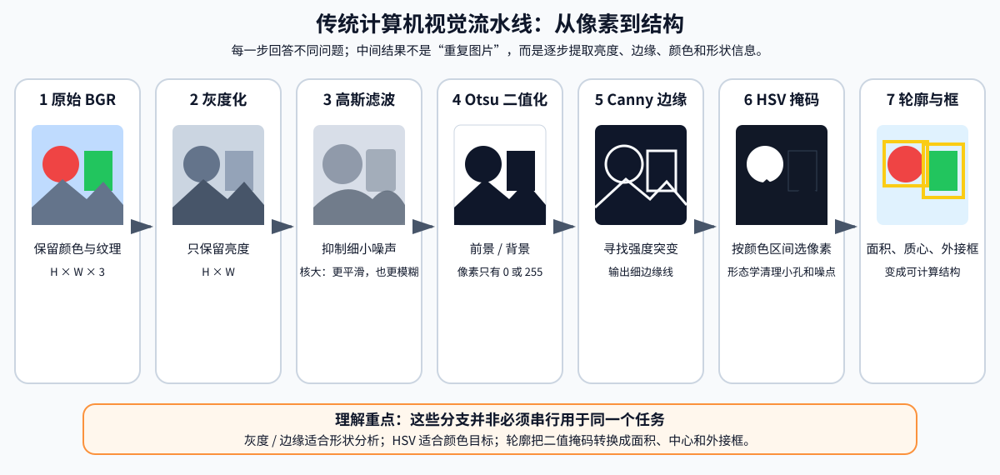
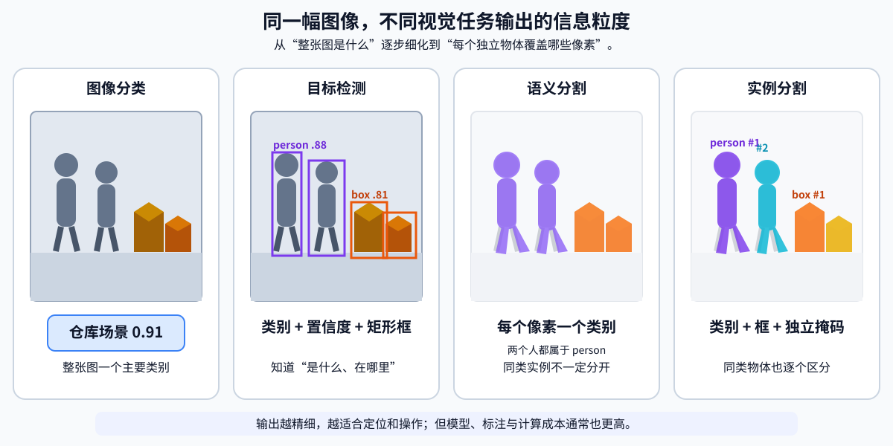
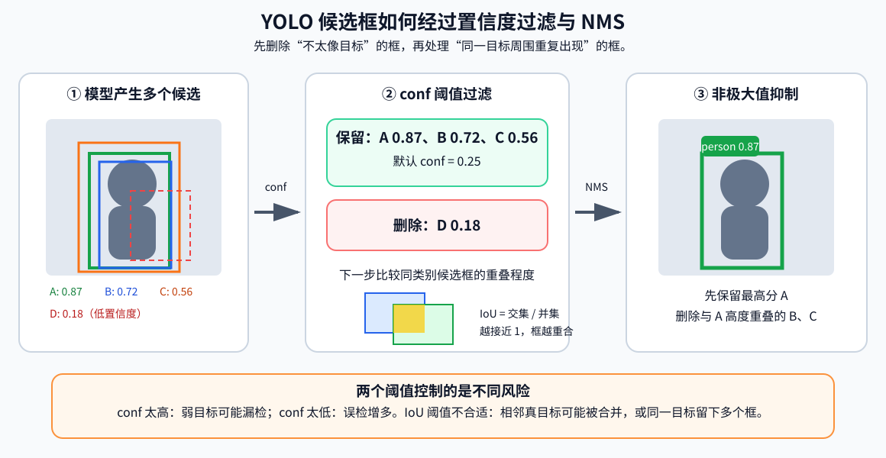
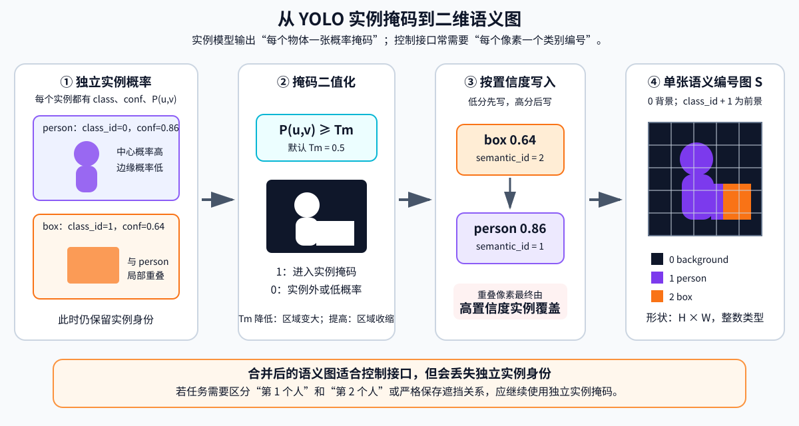

# 第七章 视觉感知算法

本章围绕 G2 机器人的二维视觉感知展开，从数字图像和传统计算机视觉的基本概念出发，逐步讲解 OpenCV 图像处理、YOLO 目标检测、HSV 颜色分割和 YOLO 实例分割，并最终在 Isaac Sim 中读取 G2 机载相机画面，完成“采集图像—处理图像—识别物体—生成逐像素语义图”的完整实验。

本章代码位于 `code/code_chapter7`，机器人模型为 `assets/robot/G2_omnipicker/robot.usda`。视觉示例默认使用 Isaac Sim 自带的仓库场景，也可以通过参数切换到第四章使用的本地 `room_1` 场景。

为了让初学者先建立完整的视觉知识框架，本章仍然采用六个部分。前四部分集中讲图像、传统 CV、YOLO 和图像分割原理，不穿插 Python 源代码；第五部分再结合 `code/code_chapter7` 统一讲解代码实现；第六部分给出环境准备、运行命令、结果分析和常见问题。

本章完成的主要任务如下：

1. 从 G2 头部或夹爪相机读取 RGB 图像；
2. 使用 OpenCV 完成灰度化、滤波、二值化、边缘检测、颜色提取和轮廓分析；
3. 使用 YOLO 检测图像中的物体，并得到类别、置信度和检测框；
4. 对比传统 HSV 分割和学习型分割方法；
5. 将 YOLO 实例掩码整理为后续控制程序可以直接使用的二维语义图。

---

## 第一部分 从机器人相机到数字图像

### 1.1 机器人为什么需要视觉感知

相机可以理解为机器人的“眼睛”，但相机本身只负责采集光线并生成图像。机器人真正需要的是从图像中提取与任务有关的信息，例如：

- 画面中有没有人、箱子、杯子或其他目标；
- 目标位于图像左侧、中间还是右侧；
- 目标在图像中占据了多大区域；
- 哪些像素属于目标，哪些像素属于背景；
- 机器人应该继续扫描、靠近目标，还是让机械臂开始抓取。

因此，视觉系统并不是简单地“显示相机画面”，而是要完成从像素到信息的转换：

**场景中的物体 → 相机成像 → 数字图像 → 视觉算法 → 检测框或分割掩码 → 任务决策**

在完整机器人系统中，视觉感知通常位于传感器和控制器之间。相机提供原始数据，视觉算法把原始数据转换成结构化结果，底盘、机械臂或任务规划模块再使用这些结果执行动作。

本章重点解决二维图像中的“看见”和“区分”问题，暂不解决目标距离、三维坐标和抓取位姿。这些内容还需要深度图、相机内参、坐标变换和点云处理。

### 1.2 图像矩阵、像素坐标与颜色格式

计算机中的彩色图像可以表示为一个三维数组：

$$
\mathbf{I}\in\mathbb{R}^{H\times W\times C}
$$

其中：

- $H$ 是图像高度，也就是像素行数；
- $W$ 是图像宽度，也就是像素列数；
- $C$ 是通道数；
- 彩色图像通常有 3 个通道，带透明度的图像通常有 4 个通道。

例如，一张分辨率为 $640\times400$ 的三通道图像，其数组形状通常为：

$$
(400,640,3)
$$

需要注意，图像分辨率习惯写成“宽 × 高”，而 NumPy 数组形状写成“高、宽、通道”。这两个顺序刚好相反，是视觉程序中非常常见的错误来源。

一个像素的位置通常写成 $(u,v)$：

- $u$ 向右增大，对应数组的列；
- $v$ 向下增大，对应数组的行；
- 图像左上角是 $(0,0)$。

这套图像坐标系与机器人坐标系不同。机器人坐标系一般使用 $x$、$y$、$z$ 描述空间位置，而图像坐标系只描述像素位于画面的哪一行、哪一列。仅凭一个二维像素点，通常不能直接得到物体在世界坐标系中的三维位置。

**RGB、RGBA、BGR 与数据类型**

彩色图像需要约定三个颜色通道的排列顺序。常见格式如下：

| 格式 | 通道顺序 | 常见来源 |
|---|---|---|
| RGB | 红、绿、蓝 | 相机接口、深度学习框架、Isaac Sim 图像 |
| RGBA | 红、绿、蓝、透明度 | 仿真渲染结果、带透明通道图像 |
| BGR | 蓝、绿、红 | OpenCV 默认格式 |

如果把 RGB 图像直接当成 BGR 图像显示，红色和蓝色会互换。算法仍然能够运行，但颜色分割、结果可视化和保存图片都会出现明显错误。因此，本章在相机采集后立即统一颜色格式：

**Isaac Sim RGB/RGBA → 去除透明通道 → 转为 `uint8` → RGB 转 BGR → OpenCV 处理**

图像数据类型也很重要。常见表示方式有：

- `uint8`：每个通道取值为 0～255；
- 浮点图像：每个通道可能取值为 0～1，也可能仍然是 0～255。

如果把 0～1 的浮点图像直接转换为 `uint8`，大量像素会变成 0 或 1，画面几乎全黑。正确做法是先判断数值范围，必要时乘以 255，再裁剪到 0～255。



*图 7-1　图像坐标、数组形状与颜色格式转换。像素坐标使用 $(u,v)$，NumPy 使用 $(H,W,C)$，Isaac Sim 图像进入 OpenCV 前还需要完成 RGBA/RGB、数据类型与 BGR 转换。*

### 1.3 G2 机载相机与本章数据流

`code/code_chapter7/config.py` 中配置了 G2 的 8 个机载相机，包括 6 个头部相机和 2 个夹爪相机。

| 参数名 | 相机位置 | USD Prim 路径 | 分辨率 |
|---|---|---|---:|
| `head_front` | 头部前向针孔相机 | `/genie/head_link3/head_front_Camera` | 640×400 |
| `head_left` | 头部左向针孔相机 | `/genie/head_link3/head_left_Camera` | 640×400 |
| `head_right` | 头部右向针孔相机 | `/genie/head_link3/head_right_Camera` | 640×400 |
| `head_back_fisheye` | 头部后向鱼眼相机 | `/genie/head_link3/head_back_fisheye` | 640×400 |
| `head_left_fisheye` | 头部左侧鱼眼相机 | `/genie/head_link3/head_left_fisheye` | 640×400 |
| `head_right_fisheye` | 头部右侧鱼眼相机 | `/genie/head_link3/head_right_fisheye` | 640×400 |
| `gripper_left` | 左夹爪相机 | `/genie/gripper_l_base_link/Left_Camera` | 1280×1056 |
| `gripper_right` | 右夹爪相机 | `/genie/gripper_r_base_link/Right_Camera` | 1280×1056 |

头部相机适合观察较大范围的环境，可用于巡检、搜索和导航辅助；夹爪相机距离操作区域更近，适合观察机械臂末端附近的物体，但分辨率更高也意味着单帧处理量更大。

本章程序的数据流为：

**Isaac Sim 场景 → G2 相机 → BGR 图像 → OpenCV 或 YOLO → 可视化结果 → 保存到 `outputs/chapter7`**

仿真物理循环和视觉推理的频率不必相同。例如，物理仿真可以以 120 Hz 推进，相机以 30 Hz 渲染，而 YOLO 每隔若干物理帧运行一次。这样可以避免较慢的神经网络推理阻塞整个仿真过程。

---

## 第二部分 OpenCV 与传统图像处理

### 2.1 传统计算机视觉解决什么问题

传统计算机视觉通常使用人工设计的规则处理图像，例如：

- 亮度大于某个阈值的像素属于前景；
- 色相位于某个区间的像素属于红色或蓝色物体；
- 灰度变化剧烈的位置可能是物体边缘；
- 连通边缘围成的区域可能对应一个物体轮廓。

这类方法不需要训练数据，计算量通常较小，处理过程也容易解释。对于颜色稳定、背景简单、规则明确的任务，传统方法仍然非常实用。例如，在光照稳定的工业场景中寻找红色标记，未必需要训练神经网络。

但传统方法也有明显局限：同一物体在不同光照、材质、视角和遮挡条件下会产生不同像素值；不同物体又可能具有相似颜色。因此，传统 CV 更擅长提取“颜色、亮度、边缘、形状”等低层特征，不擅长理解复杂物体的语义。

本章把常见操作组织成一条连续流水线：

**原图 → 灰度图 → 高斯滤波 → Otsu 二值化 → Canny 边缘 → HSV 颜色掩码 → 轮廓与外接框**

这条流水线的重点不是让每一步都识别出完整物体，而是理解图像如何从原始像素逐步变成更容易分析的结构。



*图 7-2　传统计算机视觉流水线。灰度、边缘和颜色掩码提取的是不同信息，轮廓分析再把像素区域整理为面积、质心和外接框等结构化结果。*

### 2.2 灰度化与高斯滤波

彩色图像每个像素有三个颜色分量，灰度图每个像素只保留一个亮度值。灰度化可以近似写成：

$$
Y=0.299R+0.587G+0.114B
$$

人眼对绿色更敏感，因此绿色分量的权重通常更大。灰度化后，图像从 $H\times W\times3$ 变为 $H\times W$，后续滤波、阈值处理和边缘检测所需的计算量更小。

灰度图适合分析明暗变化，但它会丢失颜色信息。例如，亮度相近的红色物体和绿色物体在灰度图中可能非常接近，因此颜色识别不能只依赖灰度图。

**高斯滤波：先抑制噪声，再寻找结构**

相机图像中可能存在传感器噪声、材质纹理、锯齿和渲染噪点。如果直接进行边缘检测，这些细小变化也可能被识别为边缘。

滤波的基本思想是：用像素邻域的加权结果替代当前像素。二维卷积可以表示为：

$$
I'(u,v)=\sum_{i=-k}^{k}\sum_{j=-k}^{k}K(i,j)I(u-i,v-j)
$$

其中 $K$ 是卷积核。高斯滤波让距离中心更近的像素拥有更大权重，因此能平滑局部噪声，同时比简单平均滤波更自然地保留整体结构。

滤波核越大，平滑效果越强，但物体细节和边缘也会变得模糊。本章默认使用 $5\times5$ 高斯核。卷积核尺寸必须是正奇数，这样才有明确的中心像素。

### 2.3 二值化与 Otsu 自动阈值

二值化把灰度图转换成只有 0 和 255 的图像。最基本的阈值规则为：

$$
B(u,v)=\begin{cases}255,& I(u,v)>T \\ 0,& I(u,v)\le T\end{cases}
$$

其中 $T$ 是阈值。二值化可以把图像粗略分成前景和背景，便于计算面积、连通区域和轮廓。

困难在于阈值应该取多少。固定阈值在一种光照下有效，换一个场景后可能完全失效。Otsu 方法根据灰度直方图自动寻找阈值，使两类像素之间的差异尽量大。它适合前景和背景亮度分布较明显的图像，但当画面光照不均匀或前景、背景灰度高度重叠时，效果会下降。

二值化结果并不等于语义分割。二值图只说明某个像素属于“0 类”还是“1 类”，但不一定知道这两类分别是什么物体。

### 2.4 Canny 边缘检测

边缘通常出现在灰度变化明显的位置，例如箱子边界、桌面边缘和物体轮廓。图像梯度描述像素值变化速度：

$$
G_x=\frac{\partial I}{\partial x},\qquad
G_y=\frac{\partial I}{\partial y}
$$

梯度幅值可写成：

$$
G=\sqrt{G_x^2+G_y^2}
$$

Canny 边缘检测通常包含以下步骤：

1. 平滑图像，减少噪声；
2. 计算水平和竖直方向梯度；
3. 使用非极大值抑制，把宽边缘压缩成较细的线；
4. 使用高、低两个阈值筛选边缘；
5. 保留与强边缘相连的弱边缘，删除孤立噪声。

本章默认低阈值为 80，高阈值为 160。阈值过低时会产生大量碎边缘；阈值过高时又会漏掉对比度较弱的物体边界。实际调参时，应同时观察边缘数量、边缘连续性和噪声水平。

### 2.5 HSV 颜色分割与形态学处理

BGR 或 RGB 同时混合了颜色和亮度，不便于直接用简单阈值描述“红色”“绿色”等概念。HSV 将颜色拆分为：

- $H$：Hue，色相，表示颜色类型；
- $S$：Saturation，饱和度，表示颜色鲜艳程度；
- $V$：Value，明度，表示亮暗程度。

在 OpenCV 中，8 位 HSV 图像的 $H$ 通常取 0～179，$S$ 和 $V$ 取 0～255。注意这里的色相范围不是常见的 0～360。

颜色分割的基本过程是：

1. 把 BGR 图像转换为 HSV；
2. 为目标颜色设置下界和上界；
3. 判断每个像素是否落在区间内；
4. 区间内设为 255，区间外设为 0，得到二值掩码。

红色在 HSV 色相圆环上跨越起点和终点，因此通常需要用两个区间共同表示，例如接近 0 的一段和接近 179 的一段。

本章 OpenCV 基础示例并不限定某一种颜色，而是提取饱和度较高的区域，用来直观展示颜色掩码。语义分割示例则分别设置红、绿、蓝、黄四类规则。

**形态学处理：清理掩码中的噪点和小孔**

颜色阈值或二值化产生的掩码常常包含零散白点、断裂区域和内部小孔。形态学操作使用一个小矩阵作为结构元素，对前景区域进行几何处理。

两个基础操作是：

- 腐蚀：缩小白色前景，可删除小噪点；
- 膨胀：扩大白色前景，可连接邻近区域并填补小缺口。

组合后得到：

- 开运算 = 先腐蚀、后膨胀，适合去除小白点；
- 闭运算 = 先膨胀、后腐蚀，适合填补小黑洞和连接断裂区域。

本章先执行开运算，再执行闭运算。这样既能减少孤立噪声，又能让目标区域更加完整。但结构元素过大时也可能删除小目标，或把相邻的两个目标粘连在一起。

### 2.6 轮廓分析与传统 CV 的边界

轮廓可以理解为二值图或边缘图中连续边界点的集合。得到轮廓后，可以进一步计算：

- 轮廓面积；
- 周长；
- 外接矩形；
- 最小外接圆；
- 形状近似；
- 区域中心。

本章从 Canny 边缘图中寻找外轮廓，并过滤面积小于默认阈值的轮廓，再绘制矩形框和面积。面积过滤可以减少细碎边缘带来的误报。

需要特别注意，传统轮廓框只表示“这里存在一个满足图像规则的区域”，并不能自动判断它是人、箱子还是杯子。要得到稳定的语义类别，需要使用分类器或目标检测模型。

**传统 CV 的适用边界**

传统方法的优势是透明、快速、无需训练。每一步为什么产生当前结果都比较容易解释，参数也可以直接修改。

它更适合：

- 光照和背景比较稳定；
- 目标颜色、形状与背景差异明显；
- 只需要检测标记、边缘或简单几何物体；
- 算力有限，需要快速运行。

它不擅长：

- 复杂自然场景；
- 同类物体外观差异较大；
- 遮挡、阴影和光照变化明显；
- 需要直接识别物体语义类别。

因此，本章先用 OpenCV 理解图像处理基础，再进入能够学习物体特征的 YOLO。

---

## 第三部分 YOLO 目标检测原理

### 3.1 分类、检测与分割的区别

视觉任务可以按照输出信息的精细程度分为多个层次：

| 任务 | 回答的问题 | 典型输出 |
|---|---|---|
| 图像分类 | 整张图主要是什么 | 一个类别和概率 |
| 目标检测 | 有什么，分别在哪里 | 多个类别、置信度和矩形框 |
| 语义分割 | 每个像素属于哪一类 | 一张类别编号图 |
| 实例分割 | 每个物体实例分别占哪些像素 | 每个实例的类别、框和掩码 |

一张图中同时存在两个人和三个箱子时，图像分类只能给出整张图的主要类别；目标检测可以给出五个检测框；语义分割可以标出所有“人”和“箱子”像素，但不一定区分两个不同的人；实例分割则会为每个独立物体生成单独掩码。

YOLO 检测示例解决“是什么、在哪里”，YOLO 分割示例进一步解决“这个物体具体覆盖了哪些像素”。



*图 7-3　同一场景下四类视觉任务的输出差异。检测提供矩形位置，语义分割给每个像素赋类别，实例分割还会区分同类别的不同物体。*

### 3.2 YOLO 为什么适合实时机器人视觉

YOLO 是一类单阶段目标检测方法。它不是先单独生成候选区域，再逐个分类，而是在一次前向推理中直接预测物体类别和位置，因此通常具有较好的速度，适合机器人在线感知。

从教学角度，可以把模型理解为三个连续模块：

1. 特征提取部分从图像中提取边缘、纹理、形状和高层语义；
2. 多尺度特征融合部分组合不同分辨率的信息，使模型同时关注大目标和小目标；
3. 检测头输出候选框、类别分数和相关置信信息，分割模型还会输出实例掩码。

神经网络学习的不是某个固定颜色区间，而是从大量训练图像中归纳物体外观。这使它比简单阈值更能适应纹理、视角和一定程度的光照变化，但模型能力取决于训练数据。预训练模型没有见过的专用零件、仿真物体或特殊机器人部件，可能无法正确识别。

### 3.3 检测结果、置信度与重复框抑制

本章把每个检测结果整理为四类信息：

| 字段 | 含义 |
|---|---|
| `xyxy` | 左上角和右下角像素坐标 $(x_1,y_1,x_2,y_2)$ |
| `confidence` | 当前预测的置信度 |
| `class_id` | 类别编号 |
| `class_name` | 可读类别名称 |

检测框宽度和高度为：

$$
w=x_2-x_1,\qquad h=y_2-y_1
$$

检测框中心为：

$$
u_c=\frac{x_1+x_2}{2},\qquad
v_c=\frac{y_1+y_2}{2}
$$

框中心可以用于构造最简单的视觉反馈。例如，若 $u_c$ 明显小于图像中心，目标位于画面左侧；若 $u_c$ 明显大于图像中心，目标位于画面右侧。机器人可以据此缓慢旋转，使目标逐渐移动到画面中心。

但是，检测框中心只是二维像素位置，不等于物体三维中心，也不能直接作为机械臂抓取点。

**置信度阈值**

模型通常会产生多个候选预测。置信度阈值 `conf` 用于过滤低置信度结果：

- 阈值降低：保留更多候选，漏检可能减少，但误检可能增加；
- 阈值提高：结果更谨慎，误检可能减少，但弱目标可能被漏掉。

本章默认 `conf=0.25`。这个数值不是所有场景的最优答案。实际应用中应根据目标类别、任务风险和验证数据调整。例如，安全监测任务可能更重视减少漏检，而抓取任务可能更重视减少错误目标。

**IoU 与重复框抑制**

同一个物体附近可能出现多个重叠候选框。交并比 IoU 用于衡量两个区域的重叠程度：

$$
\mathrm{IoU}(A,B)=\frac{|A\cap B|}{|A\cup B|}
$$

IoU 越接近 1，说明两个框越重合；越接近 0，说明重叠越少。

非极大值抑制的基本思想是：

1. 保留置信度最高的候选框；
2. 删除与它高度重叠的较低置信度框；
3. 对剩余候选重复以上过程。

本章通过 `iou` 参数控制相关阈值，默认值为 0.45。阈值过低时，靠得很近的两个真实目标可能被误认为重复；阈值过高时，同一个目标周围可能保留多个框。



*图 7-4　YOLO 后处理示意。`conf` 先过滤低可信候选，NMS 再依据 IoU 删除同一目标周围的重复框；二者控制的风险并不相同。*

### 3.4 输入尺寸、推理频率与实时性

YOLO 推理前通常会把图像缩放或填充到指定输入尺寸。本章使用 `imgsz` 控制推理尺寸，默认值为 640。

较大的输入尺寸通常能保留更多细节，对小目标可能更有利，但显存占用和推理时间也会增加。较小尺寸速度更快，但远处小目标可能变得难以识别。

机器人视觉还要处理“推理频率”问题。假设物理仿真以 120 Hz 运行，如果每个物理步都执行一次 YOLO，而单次推理需要几十毫秒，仿真会明显变慢。因此，本章使用 `process_every` 控制每隔多少物理帧处理一次图像：

$$
f_{\mathrm{infer}}\approx\frac{f_{\mathrm{physics}}}{N_{\mathrm{process}}}
$$

例如，物理频率为 120 Hz、每 6 帧处理一次时，理论触发频率约为 20 Hz。实际速度还会受到渲染、模型、GPU 和图像分辨率影响。

工程上应把“相机采集、神经网络推理、物理控制”看成不同节拍的模块，而不是强迫所有模块以完全相同频率运行。

### 3.5 如何判断检测效果

只观察一两张结果图容易产生误判。更可靠的检测评估通常关注：

- 真正例：真实目标被正确检测；
- 假正例：不存在的目标被错误检测；
- 假负例：真实目标没有被检测到。

精确率和召回率分别为：

$$
\mathrm{Precision}=\frac{TP}{TP+FP}
$$

$$
\mathrm{Recall}=\frac{TP}{TP+FN}
$$

精确率高表示预测出来的目标大多是真的，召回率高表示真实目标大多没有漏掉。实际系统需要根据任务平衡两者，而不是只追求检测数量。

本章重点是模型部署与结果使用，不展开数据集标注、训练、验证集和 mAP 计算。若预训练权重不能识别任务目标，后续应采集仿真或真实图像，制作专用数据集并训练或微调模型。

---
## 第四部分 图像分割与逐像素语义

### 4.1 为什么需要分割：从语义到实例

矩形检测框实现简单，但框内通常同时包含目标和背景。例如，一个人的检测框中可能包含两侧背景，机械臂抓取物体的检测框中也可能包含桌面。

当任务只需要判断目标大致方向时，检测框通常已经足够；当任务需要精确轮廓、可通行区域、抓取区域或像素级面积时，就需要图像分割。

分割结果通常是一张与原图等高、等宽的二维数组。数组中每个位置不再保存颜色，而是保存类别编号：

$$
S\in\mathbb{Z}^{H\times W}
$$

例如：

- `0` 表示背景；
- `1` 表示人；
- `2` 表示箱子；
- `3` 表示其他类别。

有了语义图，就可以通过“类别编号比较”快速取出某类像素，计算像素面积、质心、边界或与图像中心的相对位置。

**语义分割、实例分割与全景分割**

三类常见分割任务的区别如下：

| 类型 | 是否区分类别 | 是否区分同类实例 | 示例 |
|---|---|---|---|
| 语义分割 | 是 | 否 | 所有人像素都标为“人” |
| 实例分割 | 是 | 是 | 人 1 和人 2 分别拥有掩码 |
| 全景分割 | 是 | 对可数物体区分实例 | 同时描述天空、地面和每个独立物体 |

本章的 YOLO 分割权重首先输出实例分割结果，即每个检测目标都有自己的检测框、类别、置信度和掩码。随后，代码把这些实例掩码合并为一张语义图，便于后续控制模块使用。

这种转换会丢失实例编号。例如，两个 `person` 实例合并后都使用同一个语义类别编号。如果后续任务需要持续区分“左边的人”和“右边的人”，应保留实例掩码，并进一步加入多目标跟踪。

### 4.2 掩码概率与二值化阈值

分割模型输出的掩码通常不是直接的 0 或 1，而是 0～1 之间的浮点值，可以理解为每个像素属于当前实例的强度或置信程度。

本章使用 `mask_threshold` 把浮点掩码变成布尔区域：

$$
M(u,v)=\begin{cases}1,& P(u,v)\ge T_m \\ 0,& P(u,v)<T_m\end{cases}
$$

默认阈值 $T_m=0.5$。

- 阈值降低时，掩码区域通常变大，边缘较宽，但可能包含更多背景；
- 阈值提高时，掩码更保守，边缘可能收缩，细小区域可能消失。

`conf` 和 `mask_threshold` 解决的是不同问题：

- `conf` 决定是否保留整个检测实例；
- `mask_threshold` 决定已保留实例中的每个像素是否进入掩码。

### 4.3 从 YOLO 实例掩码到语义图

YOLO 类别编号通常从 0 开始，但本章希望语义图中的 0 固定表示背景。因此，语义编号采用：

```text
semantic_id = class_id + 1
```

对应关系为：

| 语义图数值 | 含义 |
|---:|---|
| 0 | 背景 |
| `class_id + 1` | YOLO 对应类别 |

当画面中没有任何检测结果时，程序返回一张全 0 语义图。这是正常的“当前无目标”状态，不应该被当作程序错误。

多个实例掩码可能发生重叠。本章先写入低置信度实例，再写入高置信度实例，因此重叠像素最终由高置信度实例覆盖。这种规则实现简单、结果确定，但不代表它在所有任务中都最合理。若任务需要严格保留遮挡关系，应直接使用独立实例掩码，而不是过早合并。



*图 7-5　从实例概率掩码生成语义编号图。概率经过 `mask_threshold` 二值化，再按置信度顺序写入类别编号；合并后便于控制程序使用，但不再保留独立实例身份。*

### 4.4 HSV 与 YOLO 分割对比

为了对比传统方法和学习型方法，本章还实现了 HSV 颜色语义分割。它为红、绿、蓝、黄四类分别设置颜色区间，对每个像素执行规则判断，再用开运算和闭运算清理掩码。

默认类别约定如下：

| 类别编号 | 类别名称 | 可视化颜色 |
|---:|---|---|
| 0 | background | 黑色 |
| 1 | red | 红色 |
| 2 | green | 绿色 |
| 3 | blue | 蓝色 |
| 4 | yellow | 黄色 |

HSV 分割与 YOLO 分割虽然最终都能输出二维类别图，但工作机制完全不同：

| 对比项 | HSV 颜色分割 | YOLO 分割 |
|---|---|---|
| 知识来源 | 人工设置颜色范围 | 从训练数据学习特征 |
| 是否需要权重 | 不需要 | 需要分割模型权重 |
| 可解释性 | 高 | 相对较低 |
| 计算量 | 较小 | 较大 |
| 适应复杂场景 | 较弱 | 通常更强 |
| 识别语义类别 | 只能识别预设颜色含义 | 可输出模型训练过的类别 |

如果任务是“找到红色标志”，HSV 可能更简单可靠；如果任务是“在复杂仓库中识别人和箱子”，学习型模型通常更合适。

### 4.5 语义图的可视化、计算与机器人接口

类别编号图不适合直接给人观察，因此需要为不同类别分配颜色，生成语义色彩图。为了同时看到目标轮廓和原始纹理，还可以把色彩图半透明叠加到原图：

$$
I_{\mathrm{blend}}=(1-\alpha)I_{\mathrm{original}}+\alpha I_{\mathrm{color}}
$$

其中 $\alpha$ 控制语义颜色的透明度。本章默认仅在前景像素处执行叠加，背景保持原图不变。

语义图不仅用于显示，还可以直接参与计算。例如，对目标类别 $c$ 构造布尔掩码：

$$
M_c(u,v)=[S(u,v)=c]
$$

目标像素面积为：

$$
A_c=\sum_{u,v}M_c(u,v)
$$

若目标像素坐标集合非空，其二维质心可以写成：

$$
\bar{u}=\frac{1}{A_c}\sum_{u,v}uM_c(u,v),\qquad
\bar{v}=\frac{1}{A_c}\sum_{u,v}vM_c(u,v)
$$

二维面积和质心可以用于目标筛选、画面居中和粗略接近控制。但像素面积还会受到距离、视角和遮挡影响，不能直接等同于真实物体面积。

**从二维分割到机器人动作还缺什么**

完成检测或分割后，机器人只是知道“目标在图像中哪里”。要让机械臂真正抓取目标，通常还需要：

1. 深度图或点云，用于获得目标距离；
2. 相机内参，把像素和深度反投影到相机三维坐标系；
3. 相机外参，把相机坐标转换到机器人基座或世界坐标系；
4. 目标姿态估计，确定抓取方向；
5. 机械臂 IK、轨迹规划和碰撞检测；
6. 闭环校正，应对目标运动和执行误差。

因此，本章输出是后续视觉控制的感知输入，而不是完整抓取系统。第九章可以把本章的二维视觉结果与机械臂控制结合起来，形成视觉引导任务。

---

## 第五部分 代码实现

### 5.1 文件组织与模块关系

本章代码采用“配置、仿真、相机、算法和演示程序分离”的结构：

```text
code/code_chapter7/
├── __init__.py
├── README.md
├── requirements.txt
├── config.py
├── simulation.py
├── camera.py
├── scan_controller.py
├── cv_utils.py
├── yolo_vision.py
├── segmentation.py
├── demo_common.py
├── demo_cv_basics.py
├── demo_yolo_detection.py
└── demo_semantic_segmentation.py
```

各文件职责如下：

| 文件 | 主要职责 |
|---|---|
| `config.py` | 项目路径、场景路径、相机 Prim、分辨率和推理参数 |
| `simulation.py` | 启动 Isaac Sim，加载场景与 G2，推进仿真并管理关闭流程 |
| `camera.py` | 创建 G2 相机，读取 RGB/RGBA 图像并转换为 BGR |
| `scan_controller.py` | 复用第四章底盘控制器，让机器人原地旋转扫描 |
| `cv_utils.py` | OpenCV 基础处理、教学拼图、窗口显示和图像保存 |
| `yolo_vision.py` | 加载 YOLO 权重，统一整理检测框和实例掩码 |
| `segmentation.py` | HSV 分割、YOLO 掩码语义化、着色、叠加和图例 |
| `demo_common.py` | 三个示例共用的命令行参数和运行时 |
| `demo_cv_basics.py` | OpenCV 基础流水线演示 |
| `demo_yolo_detection.py` | YOLO 目标检测演示 |
| `demo_semantic_segmentation.py` | YOLO 或 HSV 分割演示 |

建议按以下顺序阅读：

**`config.py` → `camera.py` → `cv_utils.py` → `yolo_vision.py` → `segmentation.py` → `demo_common.py` → 三个演示程序 → `simulation.py`**

算法模块本身不负责创建 Isaac Sim。三个 `demo_*.py` 通过统一运行时组合场景、机器人、相机、扫描控制和视觉算法，避免每个示例重复编写仿真初始化代码。

### 5.2 统一配置、场景与相机

`config.py` 使用当前文件位置计算项目根目录，并统一设置模型、场景和输出路径：

```python
PROJECT_ROOT = Path(__file__).resolve().parents[2]
ROBOT_USD = PROJECT_ROOT / "assets/robot/G2_omnipicker/robot.usda"
ROOM_USD = PROJECT_ROOT / "assets/background/room/room_1/background.usda"

DEFAULT_DETECTION_MODEL = PROJECT_ROOT / "yolo26s.pt"
DEFAULT_SEGMENTATION_MODEL = PROJECT_ROOT / "yolo26s-seg.pt"
DEFAULT_OUTPUT_DIR = PROJECT_ROOT / "outputs/chapter7"
```

每个相机由名称、Prim 路径和分辨率组成：

```python
@dataclass(frozen=True)
class CameraConfig:
    name: str
    prim_path: str
    resolution: tuple[int, int]
```

例如，默认头部前向相机为：

```python
"head_front": CameraConfig(
    name="head_front",
    prim_path="/genie/head_link3/head_front_Camera",
    resolution=(640, 400),
)
```

`SimulationConfig` 统一管理物理频率、渲染频率、场景和机器人初始位姿：

```python
@dataclass(frozen=True)
class SimulationConfig:
    physics_hz: int = 120
    rendering_hz: int = 30
    headless: bool = False
    renderer: str = "RaytracedLighting"
    warmup_steps: int = 120
    scene: str = "warehouse"
```

其中 `warehouse` 更适合观察丰富目标，`room` 与第四章本地场景一致。视觉任务即使使用无窗口模式，也必须继续执行渲染步，否则 RTX 相机可能无法产生新图像。

`G2RGBCamera` 根据配置创建 Isaac Sim 相机：

```python
self.sensor = Camera(
    prim_path=config.prim_path,
    name=f"chapter7_{config.name}_camera",
    frequency=frequency,
    resolution=config.resolution,
)
self.sensor.initialize()
self.sensor.add_rgb_to_frame()
```

采集时先读取 RGBA，再统一为 BGR：

```python
def capture_bgr(self) -> np.ndarray | None:
    rgb = self.capture_rgb()
    if rgb is None:
        return None
    return rgb_to_bgr(rgb)
```

颜色和数据类型转换的关键逻辑是：

```python
rgb = array[..., :3]
if np.issubdtype(rgb.dtype, np.floating):
    scale = 255.0 if float(np.nanmax(rgb)) <= 1.0 else 1.0
    rgb = np.clip(rgb * scale, 0.0, 255.0).astype(np.uint8)
return cv2.cvtColor(rgb, cv2.COLOR_RGB2BGR)
```

`wait_for_bgr()` 会在初始化后推进若干渲染步，直到取得第一帧。这样可以避免相机刚创建时返回空数据。

### 5.3 OpenCV 基础流水线

`CVResult` 把一次处理产生的多种结果保存在一起：

```python
@dataclass(frozen=True)
class CVResult:
    gray: np.ndarray
    blurred: np.ndarray
    edges: np.ndarray
    binary: np.ndarray
    color_mask: np.ndarray
    contours: np.ndarray
```

`BasicCVProcessor` 在创建时检查滤波核和 Canny 阈值：

```python
if blur_kernel <= 0 or blur_kernel % 2 == 0:
    raise ValueError("blur_kernel 必须是正奇数")
if not 0 <= canny_low < canny_high <= 255:
    raise ValueError("Canny 阈值应满足 0 <= low < high <= 255")
```

核心处理流程对应第二部分讲解的各个步骤：

```python
image = ensure_bgr_uint8(image_bgr)
gray = cv2.cvtColor(image, cv2.COLOR_BGR2GRAY)
blurred = cv2.GaussianBlur(gray, (self.blur_kernel, self.blur_kernel), 0)
edges = cv2.Canny(blurred, self.canny_low, self.canny_high)
_, binary = cv2.threshold(
    blurred, 0, 255, cv2.THRESH_BINARY + cv2.THRESH_OTSU
)
```

颜色掩码先转换 HSV，再提取高饱和度区域，并执行开、闭运算：

```python
hsv = cv2.cvtColor(image, cv2.COLOR_BGR2HSV)
color_mask = cv2.inRange(hsv, (0, 80, 40), (179, 255, 255))
kernel = np.ones((3, 3), dtype=np.uint8)
color_mask = cv2.morphologyEx(color_mask, cv2.MORPH_OPEN, kernel)
color_mask = cv2.morphologyEx(color_mask, cv2.MORPH_CLOSE, kernel)
```

轮廓提取只保留外轮廓，并使用面积阈值过滤小区域：

```python
contours, _ = cv2.findContours(
    edges, cv2.RETR_EXTERNAL, cv2.CHAIN_APPROX_SIMPLE
)
for contour in contours:
    area = cv2.contourArea(contour)
    if area < self.min_contour_area:
        continue
    x, y, width, height = cv2.boundingRect(contour)
    cv2.rectangle(
        contour_image,
        (x, y),
        (x + width, y + height),
        (0, 255, 0),
        2,
    )
```

`make_cv_panel()` 将原图、灰度图、高斯滤波、Otsu 二值图、Canny 边缘、HSV 掩码和轮廓图组成教学拼图，便于同时比较每一步的作用。

### 5.4 YOLO 检测与分割统一接口

`yolo_vision.py` 没有把 Ultralytics 的原始结果直接传遍整个程序，而是定义了更清晰的数据结构：

```python
@dataclass(frozen=True)
class Detection:
    xyxy: tuple[int, int, int, int]
    confidence: float
    class_id: int
    class_name: str


@dataclass(frozen=True)
class YOLOPrediction:
    image_shape: tuple[int, int]
    detections: tuple[Detection, ...]
    masks: np.ndarray | None = None
```

`masks` 的形状约定为 $(N,H,W)$，其中 $N$ 是实例数量。检测权重没有掩码时，该字段为 `None`；分割权重成功输出掩码时，`has_masks` 为真。

模型只在 `YOLOVision` 初始化时加载一次：

```python
from ultralytics import YOLO

self.model_path = path
self.model = YOLO(str(path))
```

不要在每一帧循环中重新创建模型，否则会反复读取权重、占用显存并严重降低速度。

单帧推理调用为：

```python
result = self.model.predict(
    source=image,
    conf=confidence,
    iou=iou,
    imgsz=image_size,
    verbose=False,
)[0]
```

程序随后把张量移动到 CPU，转换成 NumPy 数组，并把框坐标裁剪到图像范围内：

```python
xyxy = boxes.xyxy.detach().cpu().numpy()
scores = boxes.conf.detach().cpu().numpy()
class_ids = boxes.cls.detach().cpu().numpy().astype(int)
```

分割掩码如果与原图尺寸不同，会插值到原图的 $(H,W)$：

```python
if masks.shape[1:] != (height, width):
    masks = np.stack([
        cv2.resize(mask, (width, height), interpolation=cv2.INTER_LINEAR)
        for mask in masks
    ])
```

检测结果的可视化由 `draw_detections()` 完成。程序根据类别编号生成稳定颜色，并在原图上绘制检测框、类别名称和置信度。

### 5.5 HSV 分割与 YOLO 掩码语义化

HSV 分割使用 `ColorRule` 描述类别和一个或多个颜色范围：

```python
@dataclass(frozen=True)
class ColorRule:
    class_id: int
    name: str
    ranges: tuple[
        tuple[tuple[int, int, int], tuple[int, int, int]], ...
    ]
```

红色跨越 HSV 色相边界，因此使用两个区间：

```python
ColorRule(
    1,
    "red",
    (
        ((0, 100, 60), (10, 255, 255)),
        ((170, 100, 60), (179, 255, 255)),
    ),
)
```

预测时先创建全背景语义图，再逐类写入类别编号：

```python
hsv = cv2.cvtColor(image_bgr, cv2.COLOR_BGR2HSV)
semantic_map = np.zeros(image_bgr.shape[:2], dtype=np.int32)

for rule in self.rules:
    mask = np.zeros(image_bgr.shape[:2], dtype=np.uint8)
    for lower, upper in rule.ranges:
        mask = cv2.bitwise_or(
            mask,
            cv2.inRange(hsv, np.asarray(lower), np.asarray(upper)),
        )
    mask = cv2.morphologyEx(mask, cv2.MORPH_OPEN, self.kernel)
    mask = cv2.morphologyEx(mask, cv2.MORPH_CLOSE, self.kernel)
    semantic_map[mask > 0] = rule.class_id
```

YOLO 实例掩码转换语义图时，0 固定为背景：

```python
semantic_map = np.zeros(prediction.image_shape, dtype=np.int32)
class_names = {0: "background"}
```

没有检测到目标时直接返回全背景图；检测到目标但没有掩码时，说明误用了检测权重：

```python
if not prediction.detections:
    return semantic_map, class_names
if not prediction.has_masks:
    raise ValueError("当前 YOLO 权重没有输出掩码，请使用分割模型")
```

重叠区域按照置信度处理：

```python
scores = np.asarray([
    item.confidence for item in prediction.detections
])
for index in np.argsort(scores):
    detection = prediction.detections[int(index)]
    semantic_id = detection.class_id + 1
    semantic_map[
        prediction.masks[index] >= mask_threshold
    ] = semantic_id
    class_names[semantic_id] = detection.class_name
```

由于低置信度实例先写、高置信度实例后写，重叠像素最终属于高置信度实例。

### 5.6 三个演示程序如何组成完整流程

三个演示都使用 `G2VisionDemoRuntime`。它完成以下工作：

1. 根据命令行参数创建 `SimulationConfig`；
2. 启动 Isaac Sim 并加载场景、G2；
3. 创建指定机载相机；
4. 创建第四章的底盘控制器；
5. 等待相机第一帧；
6. 在每个循环中先更新扫描控制，再推进仿真。

共用参数包括：

| 参数 | 默认值 | 含义 |
|---|---:|---|
| `--scene` | `warehouse` | 选择仓库或本地房间场景 |
| `--camera` | `head_front` | 选择机载相机 |
| `--headless` | 关闭 | 无窗口运行 |
| `--max-frames` | 900 | 最大物理帧数 |
| `--process-every` | 基础示例为 4，YOLO 示例为 6 | 每隔多少物理帧处理一帧图像 |
| `--spin-speed` | 0.0 | 原地扫描角速度，单位 rad/s |
| `--physics-hz` | 120 | 物理仿真频率 |
| `--rendering-hz` | 30 | 渲染与相机频率 |

OpenCV 演示的核心循环是：

```python
runtime.step()
if frame % args.process_every:
    continue

image = runtime.camera.capture_bgr()
if image is None:
    continue
result = processor.process(image)
last_panel = make_cv_panel(image, result)
```

YOLO 检测演示在循环外创建模型，在循环内重复推理：

```python
model = YOLOVision(args.model)

prediction = model.predict(
    image,
    args.conf,
    args.iou,
    args.imgsz,
)
last_annotated = draw_detections(image, prediction)
```

分割演示通过 `--method` 在 HSV 和 YOLO 两种方法间切换：

```python
color_model = (
    HSVSemanticSegmenter()
    if args.method == "color"
    else None
)
yolo_model = (
    YOLOVision(args.model)
    if args.method == "yolo"
    else None
)
```

最终把原图、纯语义色彩图和叠加图横向拼接：

```python
color_map = colorize_semantic_map(semantic_map, class_colors)
overlay = overlay_semantic(
    image,
    semantic_map,
    class_colors=class_colors,
)
overlay = draw_legend(
    overlay,
    class_names,
    semantic_map,
    class_colors,
)
last_panel = cv2.hconcat((image, color_map, overlay))
```

三个示例都在 `finally` 中保存最后一次有效结果并关闭窗口、停止底盘、关闭 Isaac Sim。这样即使用户按键退出或中途发生异常，也尽量完成资源清理。

`scan_controller.py` 不重新实现四轮独立转向运动学，而是直接复用第四章的 `G2BaseController`、`SwerveKinematics` 和参数配置。扫描时只给出角速度：

```python
def update(self, dt: float, angular_speed: float = 0.0) -> None:
    self.base.set_velocity(vx=0.0, vy=0.0, wz=angular_speed)
    self.base.update(dt)
```

这使第七章与第四章形成清晰衔接：第四章负责“怎样让机器人真实转动”，第七章负责“机器人转动时怎样持续观察并处理相机画面”。

---
## 第六部分 运行、结果与实验分析

### 6.1 运行前准备

本章仿真程序必须使用 Isaac Sim 对应的 Python 环境。下列 `/path/to/isaac-sim/python.sh` 是占位符，请替换为实际安装路径。运行命令时应先进入仓库根目录，使 `code/code_chapter7`、`assets` 和模型权重路径都能正确解析。

运行仿真前还应确认代码所引用的本地资源已经准备完成：

| 资源 | 代码默认路径 | 是否必需 |
|---|---|---|
| G2 机器人模型 | `assets/robot/G2_omnipicker/robot.usda` | 所有三个示例都需要 |
| 本地房间场景 | `assets/background/room/room_1/background.usda` | 仅使用 `--scene room` 时需要 |
| 仓库场景 | Isaac Sim Assets 中的 `Simple_Warehouse/full_warehouse.usd` | 使用默认 `warehouse` 时需要 |

如果机器人 USD 缺失，程序会在启动 Isaac Sim 前直接报错；如果本地房间资源缺失，可改用仓库场景，但前提是本机已经安装 Isaac Sim Assets。

先检查基础依赖：

```bash
/path/to/isaac-sim/python.sh -c \
"import cv2, numpy, ultralytics; \
print('OpenCV:', cv2.__version__); \
print('NumPy:', numpy.__version__); \
print('Ultralytics import: OK')"
```

`requirements.txt` 中列出了本章额外使用的软件包：

```text
ultralytics>=8.4
opencv-python>=4.8
```

若 Isaac Sim Python 中缺少依赖，可在该环境中安装。若 `cv2` 已经能够正常导入，优先只补充缺失的软件包，避免无意覆盖 Isaac Sim 已有的 OpenCV 环境：

```bash
/path/to/isaac-sim/python.sh -m pip install \
-r code/code_chapter7/requirements.txt
```

不要只把依赖安装到系统 Python。系统 Python 能导入 `ultralytics`，不代表 Isaac Sim 的 Python 也能导入。

OpenCV 基础示例不需要 YOLO 权重。YOLO 检测和分割示例分别默认查找仓库根目录中的：

```text
yolo26s.pt

yolo26s-seg.pt
```

当前代码只配置权重路径，不会在程序中自动下载。如果仓库根目录没有这两个文件，需要先准备与代码兼容的检测权重和分割权重，或通过 `--model` 指定其他本地权重路径。

### 6.2 运行三个视觉示例

**OpenCV 基础示例**

在仓库根目录执行：

```bash
/path/to/isaac-sim/python.sh \
code/code_chapter7/demo_cv_basics.py
```

程序默认加载仓库场景、G2 和头部前向相机。显示窗口包含原图、灰度图、高斯滤波图、Otsu 二值图、Canny 边缘图、HSV 颜色掩码、轮廓图以及下一阶段输入参考图。


切换到本地 `room_1` 场景：

```bash
/path/to/isaac-sim/python.sh \
code/code_chapter7/demo_cv_basics.py \
--scene room
```

切换左夹爪相机，并让底盘缓慢旋转扫描：

```bash
/path/to/isaac-sim/python.sh \
code/code_chapter7/demo_cv_basics.py \
--camera gripper_left \
--spin-speed 0.25
```

调整 Canny 阈值：

```bash
/path/to/isaac-sim/python.sh \
code/code_chapter7/demo_cv_basics.py \
--canny-low 50 \
--canny-high 120
```

无窗口运行 180 个物理帧并保存最后一次有效结果：

```bash
/path/to/isaac-sim/python.sh \
code/code_chapter7/demo_cv_basics.py \
--headless \
--max-frames 180 \
--output outputs/chapter7/opencv_basics.jpg
```

正常情况下，退出时会看到类似输出：

```text
[OpenCV] 已保存：.../outputs/chapter7/opencv_basics.jpg
```

按 `q` 或 `Esc` 可以结束有窗口运行。即使窗口关闭，程序也会尝试保存最后一张有效教学拼图。

**YOLO 目标检测示例**

使用默认检测权重：

```bash
/path/to/isaac-sim/python.sh \
code/code_chapter7/demo_yolo_detection.py
```


显式指定模型和置信度：

```bash
/path/to/isaac-sim/python.sh \
code/code_chapter7/demo_yolo_detection.py \
--model yolo26s.pt \
--conf 0.25 \
--iou 0.45 \
--imgsz 640
```

降低推理频率并让机器人扫描：

```bash
/path/to/isaac-sim/python.sh \
code/code_chapter7/demo_yolo_detection.py \
--process-every 10 \
--spin-speed 0.20
```

程序会在终端持续输出当前处理帧、目标数量和类别名称，例如：

```text
[YOLO] frame=0060, count=3, classes=['person', 'box', 'box']
```

具体类别由权重和当前画面决定，因此实际结果可能不同。可视化图会绘制矩形框、类别名称和置信度，退出时默认保存到：

```text
outputs/chapter7/yolo_detection.jpg
```

如果画面没有检测到目标，`count=0` 是正常推理结果。程序不会因为空检测而退出。

**语义分割示例**

默认方法是 YOLO 分割：

```bash
/path/to/isaac-sim/python.sh \
code/code_chapter7/demo_semantic_segmentation.py
```


显式指定分割模型及参数：

```bash
/path/to/isaac-sim/python.sh \
code/code_chapter7/demo_semantic_segmentation.py \
--method yolo \
--model yolo26s-seg.pt \
--conf 0.25 \
--mask-threshold 0.50
```

运行 HSV 颜色分割对照实验：

```bash
/path/to/isaac-sim/python.sh \
code/code_chapter7/demo_semantic_segmentation.py \
--method color
```


分割窗口从左到右显示：

1. 相机原图；
2. 纯语义色彩图；
3. 带类别图例的半透明叠加图。

退出时默认保存到：

```text
outputs/chapter7/semantic_segmentation.jpg
```

YOLO 方法的终端输出会显示当前语义图中实际出现的类别。没有识别到任何物体时，语义图全为背景，类别列表为空，这同样是正常结果。

### 6.3 参数调节与结果分析

| 参数 | 主要影响 | 调大后的典型变化 | 调小后的典型变化 |
|---|---|---|---|
| `--conf` | 实例是否保留 | 更谨慎，可能漏检 | 保留更多目标，也可能误检 |
| `--iou` | 重叠预测处理 | 可能保留更多重叠框 | 抑制更积极，邻近目标可能被合并 |
| `--imgsz` | 网络输入尺寸 | 细节更多、速度更慢 | 速度更快、小目标更难检测 |
| `--mask-threshold` | 掩码像素范围 | 掩码更保守、更小 | 掩码更宽，可能包含背景 |
| `--process-every` | 推理间隔 | 推理更少、仿真更流畅 | 推理更频繁、计算压力更大 |
| `--spin-speed` | 底盘扫描角速度 | 覆盖更快，但可能出现运动模糊 | 扫描更稳定，但覆盖较慢 |
| `--camera` | 观察视角与分辨率 | 取决于相机选择 | 取决于相机选择 |

建议每次只修改一个参数，并保存结果进行对比。若同时修改置信度、输入尺寸和推理间隔，很难判断结果变化究竟由哪个参数引起。

**结果分析方法**

#### OpenCV 结果应该怎样看

灰度图应保留原图明暗结构，但不再包含颜色。高斯滤波图应比灰度图更平滑，细小纹理和噪声减少。Otsu 图应把部分区域分成黑白两类，但不一定与真实物体类别一致。

Canny 图中，高对比度边界应形成较连续的细线。如果几乎整张图都是边缘，说明阈值可能过低或场景纹理过多；如果几乎没有边缘，说明阈值可能过高或图像过于平滑。

HSV 掩码显示高饱和度区域。灰色墙面、白色地面等低饱和区域通常不会被选中，颜色鲜艳的物体更容易成为白色前景。

轮廓图只绘制面积足够大的外轮廓。如果框很多且杂乱，可以提高最小轮廓面积、增加滤波或调整边缘阈值；如果目标完全没有框，应检查边缘是否连续，以及面积阈值是否过高。

#### YOLO 检测结果应该怎样看

首先检查类别是否与物体一致，再观察检测框是否覆盖目标主体，最后观察置信度。高置信度不等于绝对正确，尤其是在仿真域和真实训练数据差异较大时。

同一目标出现多个框时，可检查 IoU 参数；远处小目标漏检时，可尝试提高输入尺寸、切换视角或让机器人靠近；大量错误类别可能说明预训练数据与当前任务目标不匹配，需要专用数据训练。

#### 分割结果应该怎样看

纯语义图应只有离散类别颜色，不应保留原图纹理。叠加图应同时显示目标轮廓和原始场景。

掩码边缘过宽时可提高 `mask-threshold`，掩码破碎或过小时可适当降低。若使用 HSV 方法，应重点检查颜色区间和光照；若使用 YOLO 方法，应重点检查权重类型、类别能力和置信度。

### 6.4 常见问题与排查方法

#### 1. 报错找不到 YOLO 模型

如果出现 `FileNotFoundError: 找不到 YOLO 模型`，先检查仓库根目录是否存在默认权重，或使用绝对路径指定：

```bash
--model /absolute/path/to/model.pt
```

检测示例需要检测权重，分割示例需要能够输出实例掩码的分割权重。文件名相似不代表任务类型相同。

#### 2. 分割时报“当前 YOLO 权重没有输出掩码”

这通常表示把检测权重传给了分割示例。检测权重只有框和类别，不包含 `result.masks`。请改用分割模型，例如代码默认配置的 `yolo26s-seg.pt`。

#### 3. 系统 Python 能导入，Isaac Sim 中不能导入

依赖安装到了错误的 Python 环境。应使用 Isaac Sim 的 `python.sh -m pip` 安装，并用同一个 `python.sh` 启动示例。

#### 4. 相机一直没有返回有效图像

依次检查：

1. `--camera` 参数是否为 `config.py` 中存在的名称；
2. 对应 Prim 路径是否与当前 G2 USD 一致；
3. 是否在相机初始化后继续执行 `render=True` 的仿真步；
4. 无窗口模式下是否仍然启用了 RTX 渲染；
5. 仿真预热步数是否足够。

程序在初始化阶段会等待第一帧，超过等待次数后会明确提示检查相机 Prim 路径。

#### 5. 仓库场景无法加载

默认 `warehouse` 依赖本机 Isaac Sim Assets。若提示找不到 Assets 根路径，可先切换本地场景：

```bash
--scene room
```

本地 `room_1` 能验证相机和算法流程，但场景中的可识别目标可能少于仓库。

#### 6. 画面颜色明显错误

重点检查 RGB 与 BGR 是否混用。Isaac Sim 图像进入 OpenCV 前必须执行 RGB 到 BGR 转换。如果使用 `cv2.cvtColor(..., cv2.COLOR_BGR2HSV)`，输入必须确实是 BGR。

#### 7. YOLO 推理太慢或仿真卡顿

可以按以下顺序优化：

1. 增大 `--process-every`；
2. 减小 `--imgsz`；
3. 使用头部 640×400 相机代替夹爪高分辨率相机；
4. 把 `--spin-speed` 暂时设为 0，先单独验证视觉；
5. 选择更轻量的兼容权重；
6. 检查模型是否实际运行在可用加速设备上。

本章代码采用“物理步持续运行、视觉按间隔处理”的方式，但推理仍在同一主循环中执行。更复杂的实时系统可进一步使用独立推理线程、进程或消息队列，并只保留最新帧，避免处理已经过时的图像。

#### 8. 机器人没有旋转扫描

`--spin-speed` 默认是 0，必须显式设置非零值。若设置后仍不转动，应先运行第四章底盘示例，确认关节名称、运动学和 `G2BaseController` 能正常工作，再检查第七章是否成功导入第四章控制模块。

当前仓库中的 `scan_controller.py` 使用 `from code.code_chapter4...`，但顶层 `code` 目录没有 `__init__.py`。如果启动时出现 ``ModuleNotFoundError: No module named 'code.code_chapter4'; 'code' is not a package``，说明程序在进入 Isaac Sim 前就遇到了 Python 包路径问题，而不是底盘或相机故障。更稳妥的修正方式是把 `PROJECT_ROOT / "code"` 加入 `sys.path`，再从 `code_chapter4` 包导入对应模块；本章教程只引用现有代码，没有直接修改这一导入实现。

#### 9. 无窗口模式没有显示图像

这是正常行为。`--headless` 会关闭 OpenCV 实时窗口，但程序仍会渲染相机并在退出时保存结果。应检查 `--output` 指定的文件或默认 `outputs/chapter7` 目录。

#### 10. 画面中有物体但检测结果为空

可能原因包括：

- 物体类别不在模型训练类别中；
- 物体太小、遮挡严重或视角特殊；
- 置信度阈值过高；
- 输入尺寸过小；
- 仿真材质和光照与训练数据差异较大；
- 相机朝向没有覆盖目标。

可先降低 `conf`、切换相机、旋转扫描并观察原图。如果始终无法识别专用物体，应考虑自定义数据训练，而不是无限调整阈值。

### 6.5 建议实验

#### 实验一：观察 OpenCV 参数的作用

保持场景和相机不变，分别运行以下三组 Canny 阈值：

| 组别 | 低阈值 | 高阈值 | 预期现象 |
|---|---:|---:|---|
| A | 30 | 80 | 边缘较多，噪声也可能较多 |
| B | 80 | 160 | 默认折中结果 |
| C | 150 | 220 | 只保留较强边缘，可能漏掉弱边界 |

对比保存图片，记录边缘数量、连续性和轮廓框变化。

#### 实验二：比较不同相机视角

依次选择 `head_front`、`head_left`、`gripper_left`，保持其他参数不变。比较：

- 视野范围；
- 目标在画面中的大小；
- 处理速度；
- 远处目标和近处目标的检测效果。

#### 实验三：比较 HSV 与 YOLO 分割

在同一场景中分别运行 `--method color` 和 `--method yolo`。观察：

- HSV 是否会把不同物体中相同颜色的区域归为一类；
- YOLO 是否能跨颜色识别同一语义类别；
- 光照变化对两种方法的影响；
- 两种方法的运行速度差异。

#### 实验四：研究置信度与漏检、误检

固定模型和场景，分别设置 `conf=0.10`、`0.25`、`0.50`。记录每种设置下的目标数量、明显误检和明显漏检。理解“阈值更高”并不等于“系统一定更好”。

#### 实验五：研究掩码阈值

固定一帧包含明显目标的图像，分别设置 `mask-threshold=0.30`、`0.50`、`0.70`。比较目标边界、细小结构和背景污染程度。

#### 实验六：构造简单视觉扫描策略

设置较小的 `spin-speed` 让机器人缓慢旋转，观察目标框中心如何随机器人朝向变化。进一步可以在代码中计算检测框中心与图像中心的水平误差：

$$
e_u=u_c-\frac{W}{2}
$$

当 $e_u$ 为负时目标在左侧，为正时目标在右侧。可以据此设计“目标居中后停车”的简单视觉反馈。实现时应设置角速度上限、死区和目标丢失策略，避免机器人持续抖动或无限旋转。

### 6.6 本章边界与总结

本章完成了从 G2 相机到二维视觉结果的完整链路：

**G2 相机采集 → RGB/RGBA 转 BGR → OpenCV 基础处理 → YOLO 目标检测 → HSV 或 YOLO 分割 → 语义图着色与保存**

需要掌握的核心结论包括：

1. 图像是按“高、宽、通道”组织的数字矩阵，像素坐标与机器人三维坐标不能混用；
2. Isaac Sim 常见 RGB/RGBA 图像进入 OpenCV 前要正确转换为 `uint8 BGR`；
3. 灰度、滤波、阈值、边缘、形态学和轮廓是传统 CV 的基本工具；
4. 传统 CV 依赖人工规则，YOLO 依赖训练数据，两者各有适用场景；
5. 目标检测输出类别、置信度和矩形框，实例分割进一步输出逐实例掩码；
6. 本章将 YOLO 类别编号加 1，使语义图中的 0 始终表示背景；
7. `conf`、`iou`、`imgsz`、`mask-threshold` 和 `process-every` 分别控制不同环节，不能混为一谈；
8. 视觉推理不必与物理仿真同频，合理降低推理频率能提高系统流畅性；
9. 二维检测和分割只能说明目标位于画面何处，不能直接给出世界坐标和抓取位姿。


