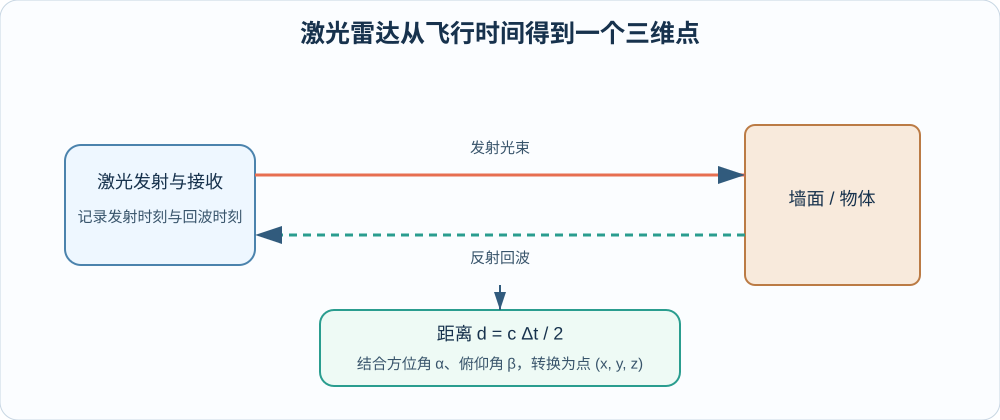
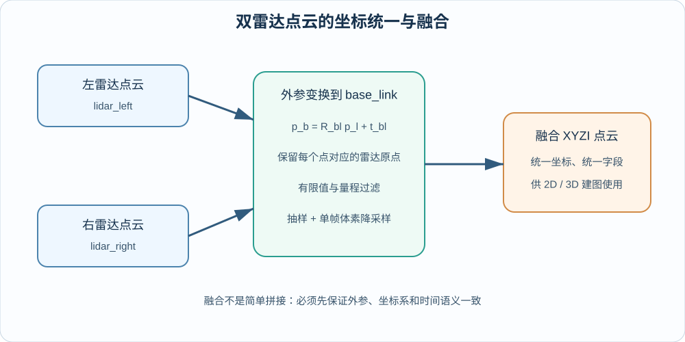
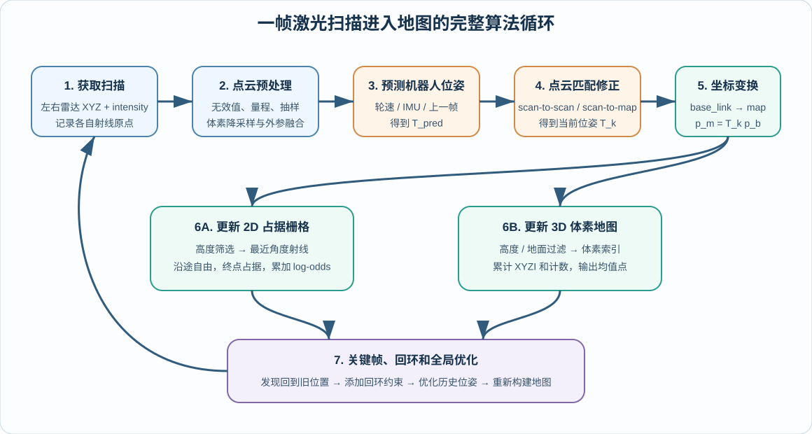
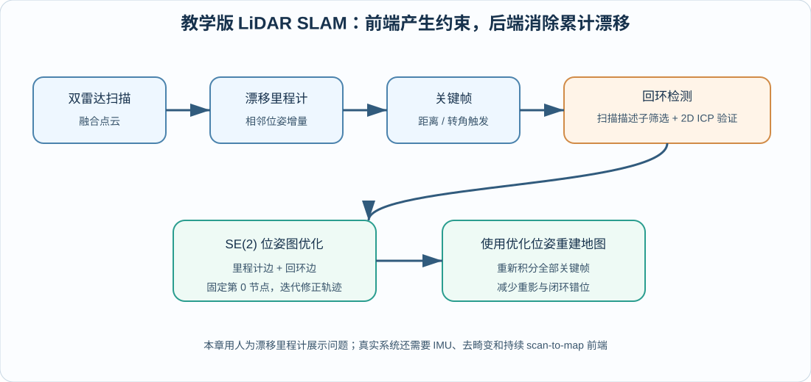
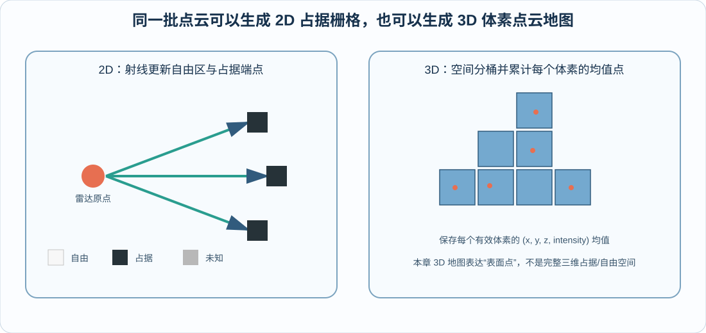

# 第八章 雷达点云建图

本章围绕 G2 机器人上的激光雷达、点云处理与地图构建展开，从“激光雷达如何测到一个点”开始，逐步讲解点云的字段与坐标系、双雷达外参变换和融合、二维占据栅格、三维体素地图，以及回环检测和位姿图优化。最后使用 `code/code_chapter8` 中的代码，在 Isaac Sim 的仓库场景里完成双雷达读取、2D 建图和 3D 建图实验。

本章代码位于 `code/code_chapter8`。代码默认使用 Isaac Sim 的 `Simple_Warehouse/full_warehouse.usd` 场景，并按照 `config.py` 中的路径加载 G2 模型，在 `base_link` 下动态添加两台 Ouster OS1 RTX LiDAR。运行前应确认本地 Isaac Sim、G2 USD 文件和 ROS2 Bridge 与配置一致。

为了让初学者先建立完整认识，全文仍采用六个部分。前四部分集中讲激光雷达、点云、SLAM、2D/3D 建图原理，不穿插 Python 源代码；第五部分再把原理对应到实际文件和关键实现；第六部分统一说明运行、结果、参数实验与故障排查。

> 本章代码是一套用于理解核心概念的教学实现。它包含双雷达点云、漂移里程计、回环检测、2D ICP 和 SE(2) 位姿图优化，但不等同于 FAST-LIO2、Cartographer、SLAM Toolbox 等完整工程系统。尤其是本章没有实现 LiDAR-IMU 紧耦合、逐点运动畸变补偿和持续的 scan-to-map 前端，这些边界会在后文明确说明。

---

## 第一部分 从激光测距到三维点云

### 1.1 机器人为什么需要激光雷达

相机把光线投影为二维图像，擅长提供颜色、纹理和语义；激光雷达主动向环境发射光束，再根据回波计算距离，擅长提供稳定的几何结构。对于移动机器人来说，激光雷达最直接回答的问题是：

- 障碍物离机器人多远；
- 墙面、货架和柱子位于什么方向；
- 前方是否存在可通行空间；
- 机器人移动后，两次扫描之间如何对齐；
- 多帧扫描能否累积成可供导航使用的地图。

与普通 RGB 相机相比，激光雷达通常不依赖环境纹理，对明暗变化也不那么敏感。例如，一面纯白墙在图像中可能几乎没有特征，但雷达仍然能够测出墙面距离。与此同时，激光雷达也有自己的局限：

- 黑色、透明、镜面或强反光材料可能产生弱回波、漏检或异常点；
- 雨、雾、粉尘会引入额外散射；
- 旋转式雷达的一帧点云并不是同一时刻采集完成的，机器人快速运动时会产生运动畸变；
- 雷达只提供几何和反射强度，不能直接告诉机器人“这是纸箱还是行人”；
- 多台雷达若外参或时间不同步，融合后会出现双层墙和重影。

因此，激光雷达不是“装上就能自动建图”的黑盒。完整流程至少包括：

```text
激光测距
  ↓
生成单帧点云
  ↓
数据解析与过滤
  ↓
坐标变换与多雷达融合
  ↓
估计机器人位姿
  ↓
把多帧点云放入统一地图坐标系
  ↓
生成 2D 或 3D 地图
  ↓
通过回环与后端优化减小长期漂移
```

### 1.2 激光雷达如何测出距离

常见激光雷达会发射一束激光，记录光从传感器出发、被物体反射并返回接收器所经历的时间差。若光速为 $c$，往返时间为 $\Delta t$，则物体距离近似为：

$$
d=\frac{c\Delta t}{2}
$$

分母中的 2 来自“去程加回程”。雷达测出的不仅是距离 $d$，还知道该束激光发射时的方位角 $\alpha$ 和俯仰角 $\beta$。在一种常见的球坐标定义下，可以把量测转换为传感器坐标系中的三维点：

$$
x=d\cos\beta\cos\alpha
$$

$$
y=d\cos\beta\sin\alpha
$$

$$
z=d\sin\beta
$$

于是，每发射并接收到一束有效激光，就得到一个三维点 $(x,y,z)$。大量激光束在水平和竖直方向上扫描后，就形成一帧点云。



*图 8-1：雷达通过往返时间计算距离，再结合方位角和俯仰角生成三维点。*

真实机械雷达、MEMS 雷达和仿真 RTX LiDAR 的底层实现不同，但从建图算法的角度看，它们最终都需要输出“某时刻、某坐标系下的一组空间量测”。本章使用 Isaac Sim 的 RTX LiDAR。RTX 传感器通过光线追踪模拟激光与场景几何、材质之间的交互，并由 `IsaacCreateRTXLidarScanBuffer` annotator 提供点云和强度数据。

### 1.3 扫描线、分辨率、频率与量程

理解雷达参数时，不能只看“最大距离”。以下指标会共同影响地图质量和计算量：

| 参数 | 含义 | 对建图的影响 |
|---|---|---|
| 水平视场角 | 雷达在水平方向能看到多大范围 | 视场越完整，匹配和回环通常越稳定 |
| 垂直视场角 | 雷达在竖直方向能覆盖多大范围 | 决定能否看到地面、货架上层和高处结构 |
| 通道数 | 同一水平角附近有多少条不同俯仰角的扫描线 | 通道越多，竖直结构越密，但数据量更大 |
| 水平角分辨率 | 相邻水平采样之间的角度间隔 | 分辨率越高，远处墙面越连续 |
| 扫描频率 | 每秒形成多少帧扫描 | 频率越高，动态响应越好，但计算压力更大 |
| 最小量程 | 能可靠测量的最近距离 | 过近点可能是传感器自身、机器人结构或异常回波 |
| 最大量程 | 能可靠测量的最远距离 | 过远点更稀疏，也更容易受噪声影响 |
| 强度 | 回波能量或反射强弱 | 可用于可视化、材料差异和部分定位特征，但不能直接当作颜色 |

本章 `LidarConfig` 默认选择：

```text
模型：OS1
配置：OS1_REV6_128ch10hz1024res
最小量程：0.25 m
最大量程：50.0 m
点抽样步长：2
单帧体素尺寸：0.10 m
```

其中“128ch”表示高线数扫描配置，“10hz”表示配置名称对应 10 Hz 级扫描，“1024res”表示每圈的水平采样规模。实际输出频率还会受到仿真渲染频率、读取间隔和 RTX 传感器配置影响。

**点云的数据组织。**

点云可以理解为“很多三维采样点的集合”。最基础的一帧点云可以写成：

$$
\mathcal{P}=\{\mathbf{p}_i\}_{i=1}^{N},\qquad
\mathbf{p}_i=[x_i,\ y_i,\ z_i]^{T}
$$

其中 $N$ 是点数。点云与规则图像不同：图像像素天然排成 $H\times W$ 的网格，而普通点云通常只是 $N\times 3$ 或 $N\times C$ 的数组，点与点之间没有固定的二维邻接关系。

工程中的点云经常还带有附加字段：

| 字段 | 含义 | 本章是否保留 |
|---|---|---|
| `x, y, z` | 点在当前坐标系中的三维坐标，单位通常为米 | 是 |
| `intensity` | 回波强度 | 是 |
| `ring` | 点来自哪条扫描线 | 否 |
| `timestamp` / `time` | 点在一帧内部的采样时刻 | 否 |
| `return_type` | 首回波、最强回波等 | 否 |
| `rgb` | 与相机融合后的颜色 | 否 |

本章统一使用 XYZI 点云：

$$
\mathbf{q}_i=[x_i,\ y_i,\ z_i,\ I_i]^{T}
$$

其中 $I_i$ 表示强度。代码不会对每帧强度做最大最小拉伸，只会把 `NaN` 和无穷值归零。这样可以避免同一物体因为每帧点云范围不同而在 RViz 中不断“闪烁”。

要特别注意：一个点的数值只有与 `frame_id` 一起解释才有意义。坐标为 $(1,0,0)$ 的点，在 `lidar_left` 下表示“左雷达前方 1 米”，在 `base_link` 下表示“机器人底盘原点前方 1 米”，在 `map` 下则表示“地图原点前方 1 米”。三者不能直接混用。

### 1.4 本章双雷达坐标系与数据流

本章把两台 RTX LiDAR 固定安装在 `/genie/base_link` 下：

| 雷达 | 坐标系 | 原始话题 | 相对 `base_link` 平移 |
|---|---|---|---|
| 左雷达 | `lidar_left` | `/lidar/left/points` | $(0.17,\ 0.21,\ 0.34)$ m |
| 右雷达 | `lidar_right` | `/lidar/right/points` | $(-0.23,\ -0.20,\ 0.34)$ m |

右雷达还绕 `base_link` 的 $z$ 轴旋转 $180^\circ$，使它的逐帧扫描方向与左雷达互补。两台雷达的原始数据首先位于各自坐标系中，不能直接把数组拼接后用于建图。

假设某个点在雷达坐标系中的坐标为 $\mathbf{p}_{l}$，雷达到 `base_link` 的旋转矩阵和平移向量分别为 $\mathbf{R}_{bl}$、 $\mathbf{t}_{bl}$，则点在底盘坐标系中的坐标为：

$$
\mathbf{p}_{b}=\mathbf{R}_{bl}\mathbf{p}_{l}+\mathbf{t}_{bl}
$$

完成外参变换后，两台雷达的点都位于 `base_link`，才可以合并为融合点云。机器人运动后，还需要使用机器人在地图中的位姿把点转换到 `map`：

$$
\mathbf{p}_{m}=\mathbf{R}_{mb}\mathbf{p}_{b}+\mathbf{t}_{mb}
$$

本章机器人只在平面运动，所以 $\mathbf{R}_{mb}$ 只包含 `yaw` 旋转，位姿写成：

$$
\mathbf{x}=[x,\ y,\psi]^{T}
$$



*图 8-2：左右雷达必须先经过各自外参变换，再在 `base_link` 中融合。*

除了点坐标，本章还为每个点保存对应雷达在 `base_link` 中的原点 `origin`。这个字段对 2D 占据栅格非常重要，因为算法需要知道一条激光射线“从哪里出发、在哪里击中障碍”。如果只保留终点而丢失雷达原点，就无法正确标记射线经过的自由空间。

---

## 第二部分 点云坐标变换、过滤与融合

### 2.1 原始点云为什么不能直接建图

传感器返回点云后，初学者常见的做法是直接把所有点累加到一个数组中。这样通常会很快得到一团模糊、重叠甚至不断扩张的数据。原因包括：

1. **坐标系不同**：左右雷达各自在自己的坐标系中测量；
2. **机器人在运动**：不同帧点云对应不同机器人位姿；
3. **存在无效点**：数据中可能有 `NaN`、无穷值或空数组；
4. **近距离自遮挡**：雷达可能看到机器人自身结构；
5. **远距离噪声**：量程边界附近的数据更不稳定；
6. **点数过多**：原始高线数雷达每帧点数很大，直接累积会迅速占满内存；
7. **动态物体**：移动的人或车辆不应该永久写入静态地图；
8. **外参误差**：一台雷达偏移几厘米，就可能让墙面变成两层；
9. **时间误差**：两台雷达或位姿的时间戳不一致，会把运动误差误认为空间结构。

因此，本章的单帧处理顺序是：

```text
兼容解析 RTX 输出字段
  ↓
整理为 XYZ + intensity
  ↓
删除 NaN / Inf
  ↓
最小与最大量程过滤
  ↓
按固定步长抽样
  ↓
单帧体素降采样
  ↓
从 lidar_* 变换到 base_link
  ↓
保留雷达原点并融合左右点云
```

### 2.2 数据解析与有效值过滤

不同 Isaac Sim 或 annotator 版本中，点云字段名称可能存在差异。本章的 `PointCloudProcessor` 会依次尝试：

```text
点坐标：data / pointCloudData / points / pointcloud
强度：intensity / intensities / intensitiesData
```

解析后的点坐标统一为 `N×3` 的 `float32` 数组，强度统一为长度为 $N$ 的一维数组。如果强度字段不存在，则使用 0 补齐；如果点和强度数量不同，则截取两者共同有效的长度。

随后删除所有包含非有限数的点：

$$
\mathrm{valid}_i=
\mathrm{finite}(x_i)\land
\mathrm{finite}(y_i)\land
\mathrm{finite}(z_i)\land
\mathrm{finite}(I_i)
$$

点到传感器原点的距离为：

$$
r_i=\sqrt{x_i^2+y_i^2+z_i^2}
$$

只有满足以下条件的点才会保留：

$$
r_{\min}\le r_i\le r_{\max}
$$

默认最小量程为 $0.25$ m，最大量程为 $50$ m。若地图中出现机器人自身点，可以适当增大 `min_range`；若远处噪声较多，可以减小 `max_range` 或使用 `max_range_margin` 留出量程余量。

### 2.3 固定步长抽样与体素降采样

高分辨率雷达的一帧点云可能包含大量相邻点，而建图不一定需要保留每个原始点。本章先使用 `point_stride` 做简单抽样。例如 `point_stride=2` 表示每隔一个点保留一个点。

固定步长抽样速度快，但它只依赖数组顺序，无法保证空间分布均匀。因此代码又进行一次体素降采样。设体素边长为 $s$，点 $\mathbf{p}=[x,y,z]^{T}$ 所属的体素索引为：

$$
\mathbf{k}=\left\lfloor\frac{\mathbf{p}}{s}\right\rfloor
$$

落入同一体素的多个点只保留一个代表点。本章的 `voxel_sample_indices` 选择最靠近体素中心的原始点，而不是直接取第一个点。这样可以减少点数，同时尽量保持几何分布均匀。

默认单帧体素尺寸为 `0.10 m`：

- 调小体素，例如 `0.05 m`，能保留更多细节，但处理更慢、地图更大；
- 调大体素，例如 `0.15 m`，运行更快，但细杆、边缘和小障碍可能消失；
- 体素尺寸不应只根据“画面好看”决定，还要结合场景尺度、导航安全距离和计算资源。

### 2.4 外参变换、传感器原点与融合

外参描述“传感器如何安装在机器人上”，通常包括旋转和平移。若外参准确且安装刚性固定，它在运行过程中不应随时间变化。

本章 `LidarMount` 使用四元数 `orientation_wxyz=(w,x,y,z)` 表示旋转，并使用三元组 `translation=(x,y,z)` 表示平移。点经过变换后位于 `base_link`：

$$
\mathbf{p}_{b}=\mathbf{R}(\mathbf{q})\mathbf{p}_{l}+\mathbf{t}
$$

雷达原点在自身坐标系中是 $[0,0,0]^T$，变换到 `base_link` 后就是安装平移 $\mathbf{t}$。因此，本章为该雷达产生的每个点重复保存同一个 `origin=\mathbf{t}`。左右雷达融合后，不同点仍保留各自的射线起点。

融合点云的本质是：

$$
\mathcal{P}_{fused}=\mathcal{T}_{left}(\mathcal{P}_{left})\cup
\mathcal{T}_{right}(\mathcal{P}_{right})
$$

这里的并集不是要求删除所有重复点，而是先确保两组点处于同一坐标系和同一数据格式，再连接为一帧 XYZI 点云。后续 2D 和 3D 地图还会分别进行角度筛选或地图体素聚合。

**如何判断点云预处理是否正确。**

在开始建图前，应先单独检查点云。推荐按以下顺序观察：

1. **只看左雷达**：墙面方向、地面高度和坐标轴是否符合预期；
2. **只看右雷达**：是否确实旋转了 $180^\circ$，扫描范围是否互补；
3. **同时看两台原始雷达**：TF 是否能把两个坐标系正确显示在 `map` 下；
4. **看融合点云**：同一墙面是否重合，是否出现固定间距的双层结构；
5. **移动机器人**：融合点云应跟随 `base_link` 运动，而地图点云应稳定留在 `map` 中；
6. **检查强度**：RViz 的强度通道应有变化，但不应因逐帧归一化而剧烈闪烁。

常见现象与原因如下：

| 现象 | 优先检查 |
|---|---|
| 两台雷达点云方向相反或镜像 | 四元数顺序、右雷达 $180^\circ$ 旋转、坐标轴约定 |
| 墙面固定出现两层 | 双雷达外参、模型安装位置、传感器原点 |
| 点云跟机器人一起移动，无法形成静态地图 | 是否从 `base_link` 转换到 `map`，机器人位姿是否更新 |
| 机器人周围有密集圆环 | `min_range` 太小，雷达看到了自身结构 |
| 远处出现大量散点 | `max_range` 过大、材质回波异常、体素太小 |
| RViz 原始点云不可见 | 原始话题、`frame_id`、静态 TF、QoS 和仿真时间 |

---
## 第三部分 建图与 LiDAR SLAM 的共同原理

### 3.1 建图不只是累加点云

如果机器人始终静止，把多帧点云放在同一个坐标系中并不困难。但机器人一旦移动，每帧点云都在新的机器人位姿下采集。为了把第 $k$ 帧点云放入地图，必须知道该时刻机器人在地图中的位姿 $\mathbf{T}_{mb}^{k}$：

$$
\mathbf{p}_{m}^{k}=\mathbf{T}_{mb}^{k}\mathbf{p}_{b}^{k}
$$

因此，建图问题至少包含两个相互依赖的任务：

- **定位**：估计机器人现在在哪里；
- **建图**：根据估计位姿，把当前量测加入地图。

这就是 SLAM 的基本含义：Simultaneous Localization and Mapping，即同时定位与建图。地图能够帮助定位，定位结果又决定点云应该放到地图中的什么位置。

如果位姿完全准确，建图主要是数据结构和融合问题；如果位姿存在误差，多帧点云就会逐渐错位。实际系统中常见的位姿来源包括：

- 轮速里程计；
- IMU 角速度和加速度；
- LiDAR 帧间或 scan-to-map 匹配；
- 相机视觉里程计；
- GNSS、UWB 或外部定位系统；
- 多传感器融合状态估计器。

本章为了突出漂移、回环和地图重建之间的关系，使用仿真轨迹增量构造一个“带系统误差的教学里程计”。它不是直接复制每帧真值位姿，但其增量来源于仿真参考轨迹。真实机器人接入时，应把它替换为第四章的轮速里程计、LiDAR 前端或 LiDAR-IMU 里程计。

### 3.2 激光雷达建图算法：一帧扫描如何进入地图

前面已经说明，激光雷达只负责回答“相对于雷达，哪些方向、多远的位置存在反射点”。它不会直接输出一张地图。所谓“根据激光雷达建图”，本质上是反复执行下面这个闭环：

1. 雷达采集当前扫描；
2. 估计采集这一帧时机器人的位姿；
3. 用该位姿把扫描变换到全局地图坐标系；
4. 按地图的数据结构更新自由空间、障碍物或三维表面；
5. 当发现回环时修正历史位姿，再重新融合历史扫描。



*图 8-3：从原始激光扫描到地图更新的完整循环。真正决定多帧点云能否重合的是位姿估计与匹配，而不是简单地保存更多点。*

下面沿着一帧扫描的处理顺序，把这个过程具体展开。

#### 第一步：获取扫描，同时保留“命中点”和“射线原点”

一帧 LiDAR 数据通常包含一组点：

$$
\mathcal{P}_{l}^{k}=\{\mathbf{p}_{l,1}^{k},\mathbf{p}_{l,2}^{k},\ldots,\mathbf{p}_{l,N}^{k}\}
$$

其中每个点至少包含 $(x,y,z)$，也可能包含反射强度 `intensity`、扫描线编号、相对时间等字段。这里的下标 $l$ 表示点仍在雷达坐标系中，上标 $k$ 表示第 $k$ 帧。

建 2D 占据栅格时，不能只保存命中点，还要知道每条激光从哪里发出。原因是：从雷达原点到命中点之间，激光能够通过，通常可以认为是自由空间；命中点附近则更可能是障碍物。因此，本章的 `PointCloud` 同时保存：

- `xyz`：激光命中点；
- `origin`：与每个命中点对应的雷达射线原点；
- `intensity`：反射强度。

双雷达系统中，左右雷达原点不同，不能在融合以后把所有射线都错误地当作从 `base_link` 原点发出，否则靠近机器人处的自由空间会被画错。

#### 第二步：预处理，并统一到 `base_link`

原始扫描中可能包含 `NaN`、无穷值、过近的自身反射、过远噪声和大量重复点。通常先执行：

- 删除无效坐标；
- 按 `min_range` 与 `max_range` 过滤量程；
- 必要时按固定间隔抽样；
- 使用体素降采样降低点数；
- 使用外参把每台雷达的点和射线原点都变换到 `base_link`；
- 合并左右雷达点云。

对左雷达中的一个点，外参变换为：

$$
\mathbf{p}_{b,i}=\mathbf{R}_{bl}\mathbf{p}_{l,i}+\mathbf{t}_{bl}
$$

射线原点必须使用同一个外参：

$$
\mathbf{o}_{b,i}=\mathbf{R}_{bl}\mathbf{o}_{l,i}+\mathbf{t}_{bl}
$$

经过这一步以后，一帧扫描描述的是“当前机器人周围的障碍物”，但它仍然跟着机器人运动，还不能直接成为全局地图。

#### 第三步：先预测机器人位姿

SLAM 前端一般不会每一帧都从完全未知的位置开始搜索，而是利用轮速、IMU、上一帧匹配结果或匀速模型给出预测位姿：

$$
\mathbf{T}_{pred}^{k}
=
\mathbf{T}_{k-1}\Delta\mathbf{T}_{odom}^{k}
$$

其中：

- $\mathbf{T}_{k-1}$ 是上一帧的估计位姿；
- $\Delta\mathbf{T}_{odom}^{k}$ 是里程计或惯性测量提供的相对运动；
- $\mathbf{T}_{pred}^{k}$ 是当前帧的初始位姿猜测。

预测位姿的作用是把当前扫描先放到地图的大致正确位置。只要初值足够接近，后续点云匹配就不需要在整张地图上盲目搜索。

#### 第四步：用激光点云匹配修正预测位姿

仅靠里程计长期积分一定会漂移，因此正式的 LiDAR SLAM 会比较当前扫描与历史扫描或局部地图，寻找使它们最一致的位姿修正量。常见形式有：

- **scan-to-scan**：当前帧与上一帧或相邻关键帧匹配；
- **scan-to-submap**：当前帧与最近若干关键帧组成的局部子地图匹配；
- **scan-to-map**：当前帧直接与已有地图匹配。

这个过程可以抽象成下面的优化问题：

$$
\underset{\Delta\mathbf{T}}{\min}
\sum_i
\rho\left(
 d\left(
 \mathbf{T}_{pred}^{k}\Delta\mathbf{T}\mathbf{p}_{b,i},
 \mathcal{M}_{k-1}
 \right)^2
\right)
$$

其中：

- $\mathcal{M}_{k-1}$ 是更新当前帧以前的局部地图；
- $d$ 表示变换后点到地图中对应平面、线或最近点的距离；
- $\rho$ 是降低离群点影响的鲁棒代价；
- $\Delta\mathbf{T}$ 是需要求解的小幅位姿修正。

求得最优修正 $\Delta\mathbf{T}^{*}$ 后，当前帧最终位姿为：

$$
\mathbf{T}_{k}
=
\mathbf{T}_{pred}^{k}\Delta\mathbf{T}^{*}
$$

不同算法的主要差异，就在于“与什么匹配”和“怎样定义距离”：

| 算法思路 | 匹配对象 | 误差直观含义 | 特点 |
|---|---|---|---|
| 点到点 ICP | 当前点与历史最近点 | 两个对应点之间的距离 | 直观，但对初值和点密度较敏感 |
| 点到线 ICP | 2D 激光点与地图线段 | 点到墙面线的垂直距离 | 常用于 2D 激光 SLAM |
| 点到平面 ICP | 3D 激光点与局部平面 | 点到墙面或地面平面的距离 | 3D 点云中约束更稳定 |
| NDT | 当前点与地图概率分布 | 点落入局部高概率区域的程度 | 地图表达平滑，适合较大范围匹配 |
| 相关性匹配 | 多个位姿候选与栅格地图 | 哪个位姿让更多激光端点落在障碍格 | 易理解，常用于 2D 粗匹配 |

这里必须区分“完整 SLAM 算法”和“本章教学代码”的边界：本章代码使用仿真参考轨迹增量构造带漂移的 `DriftedOdometry`，没有使用 ICP 连续估计每一帧位姿；代码中的 2D ICP 主要用于回环候选的几何验证。这样设计是为了用较少依赖突出“漂移—回环—位姿图优化—地图重建”主线。真实系统应在这里接入连续的 scan-to-map 前端、轮速与 LiDAR 融合，或 LiDAR-IMU 里程计。

#### 第五步：把当前帧从 `base_link` 变换到 `map`

得到当前位姿 $(x_k,y_k,\psi_k)$ 后，机器人坐标系中的点 $(x_b,y_b,z_b)$ 可以变换为地图坐标：

$$
x_m=\cos\psi_k\,x_b-\sin\psi_k\,y_b+x_k
$$

$$
y_m=\sin\psi_k\,x_b+\cos\psi_k\,y_b+y_k
$$

$$
z_m=z_b
$$

本章使用 `Pose2D(x, y, yaw)` 描述机器人轨迹，所以只估计平面平移与偏航角；3D 地图仍然保留激光点的 $z$。如果机器人会明显俯仰、侧倾或上下运动，则需要使用完整的 $SE(3)$ 位姿，把滚转角、俯仰角和三维平移也纳入估计。

同样的变换也要作用于射线原点。经过这一步，当前帧中的点才真正获得了固定在世界中的全局位置。

#### 第六步：按照地图类型融合当前观测

**更新 2D 占据栅格时**，对每条射线执行：

1. 按高度范围筛选可作为平面障碍物的点；
2. 将射线原点和命中点投影到二维平面；
3. 将世界坐标换算成起点栅格和终点栅格；
4. 用 Bresenham 算法枚举射线穿过的格子；
5. 中间格增加“自由”证据；
6. 终点格增加“占据”证据；
7. 使用 log-odds 累计多帧观测，而不是被单帧结果直接覆盖。

**更新 3D 体素地图时**，对每个通过高度与地面过滤的全局点执行：

1. 根据体素尺寸计算三维整数索引；
2. 找到该体素对应的哈希表条目；
3. 累计点坐标、反射强度和观测次数；
4. 导出地图时使用体素内的均值代表该局部表面。

因此，2D 地图不仅要记录“哪里有点”，还利用完整射线推断“哪里没有障碍”；本章的 3D 地图则主要保存“哪里观测到了表面”。二者输入可以相同，但逆传感器模型不同。

#### 第七步：关键帧、回环和地图重建

一帧数据写入地图并不代表建图结束。系统还会根据移动距离和转角选择关键帧，并保存关键帧点云、里程计位姿和优化位姿。当机器人重新到达旧区域时：

1. 扫描描述子产生回环候选；
2. ICP 检查两处点云是否真的能够对齐；
3. 接受的回环约束加入位姿图；
4. 后端同时调整多帧历史位姿；
5. 使用优化后的历史位姿清空并重建地图。

把整个算法压缩成一句话就是：

> **激光雷达建图 = 对每帧点云估计准确位姿 + 把点和射线按该位姿融合进地图 + 用回环修正长期累计误差。**

如果只有第一项扫描数据而没有可靠位姿，得到的只是多帧点的堆叠；如果只优化轨迹而不重新融合地图，历史墙面仍会留在错误位置。

### 3.3 一个具体例子：一个激光点如何写入 2D 和 3D 地图

下面用一个完整数值例子串起“测距点—外参—机器人位姿—栅格或体素”这条链路。为了便于计算，假设左雷达旋转外参为单位旋转，地图栅格以世界坐标 $(0,0)$ 为索引原点。

#### 1. 从距离和角度得到雷达坐标系中的点

假设左雷达测得：

- 距离 $d=4\ \mathrm{m}$；
- 方位角 $\alpha=30^{\circ}$；
- 俯仰角 $\beta=0^{\circ}$。

则雷达坐标系中的命中点为：

$$
x_l=4\cos 30^{\circ}=3.464\ \mathrm{m}
$$

$$
y_l=4\sin 30^{\circ}=2.000\ \mathrm{m}
$$

$$
z_l=0
$$

所以：

$$
\mathbf{p}_{l}=(3.464,\ 2.000,\ 0.000)
$$

#### 2. 使用雷达外参变换到 `base_link`

本章左雷达平移外参为：

$$
\mathbf{t}_{bl}=(0.17,\ 0.21,\ 0.34)\ \mathrm{m}
$$

在本例单位旋转的假设下：

$$
\mathbf{p}_{b}
=
\mathbf{p}_{l}+\mathbf{t}_{bl}
=
(3.634,\ 2.210,\ 0.340)
$$

雷达坐标系原点 $(0,0,0)$ 经过外参变换后，就是 `base_link` 中的射线原点：

$$
\mathbf{o}_{b}=(0.170,\ 0.210,\ 0.340)
$$

#### 3. 使用机器人位姿变换到 `map`

假设采集这一帧时，机器人位姿为：

$$
(x_k,y_k,\psi_k)=(5.0\ \mathrm{m},\ 2.0\ \mathrm{m},\ 90^{\circ})
$$

偏航角为 $90^{\circ}$ 时，机器人坐标系的 $x$ 轴转向地图坐标系的 $y$ 轴。代入坐标变换可得命中点：

$$
x_m=5.0-2.210=2.790\ \mathrm{m}
$$

$$
y_m=2.0+3.634=5.634\ \mathrm{m}
$$

$$
z_m=0.340\ \mathrm{m}
$$

因此全局命中点为：

$$
\mathbf{p}_{m}=(2.790,\ 5.634,\ 0.340)
$$

射线原点也要使用相同机器人位姿进行变换：

$$
\mathbf{o}_{m}=(4.790,\ 2.170,\ 0.340)
$$

注意，真正用于 2D 射线更新的起点不是机器人中心 $(5.0,2.0)$，而是左雷达在地图中的实际位置 $(4.790,2.170)$。

#### 4. 写入 2D 占据栅格

本章默认地图分辨率为：

$$
r=0.05\ \mathrm{m/cell}
$$

世界坐标到栅格索引的换算为：

$$
i=\left\lfloor\frac{x}{r}\right\rfloor,
\qquad
j=\left\lfloor\frac{y}{r}\right\rfloor
$$

于是射线起点对应：

$$
(i_o,j_o)
=
\left(
\left\lfloor\frac{4.790}{0.05}\right\rfloor,
\left\lfloor\frac{2.170}{0.05}\right\rfloor
\right)
=(95,43)
$$

命中终点对应：

$$
(i_p,j_p)
=
\left(
\left\lfloor\frac{2.790}{0.05}\right\rfloor,
\left\lfloor\frac{5.634}{0.05}\right\rfloor
\right)
=(55,112)
$$

接下来，Bresenham 算法从 $(95,43)$ 沿离散直线走到 $(55,112)$：

- 终点以前的格子被更新为自由；
- 最后一个格子 $(55,112)$ 被更新为占据。

本章默认自由概率为 $0.35$、占据概率为 $0.70$，换算成单次 log-odds 增量约为：

$$
\Delta L_{free}
=
\log\frac{0.35}{0.65}
\approx-0.619
$$

$$
\Delta L_{occ}
=
\log\frac{0.70}{0.30}
\approx0.847
$$

如果后续多帧再次看到同一堵墙，终点附近会不断累加正证据；射线稳定穿过的区域会不断累加负证据。偶然噪声通常只有少量观测，不容易推翻长期累积的结果。

#### 5. 写入 3D 体素地图

本章默认 3D 体素尺寸为：

$$
s=0.08\ \mathrm{m}
$$

体素索引按三个方向分别向下取整：

$$
(v_x,v_y,v_z)
=
\left(
\left\lfloor\frac{2.790}{0.08}\right\rfloor,
\left\lfloor\frac{5.634}{0.08}\right\rfloor,
\left\lfloor\frac{0.340}{0.08}\right\rfloor
\right)
=(34,70,4)
$$

程序在哈希表中找到键 `(34, 70, 4)`，累计该点的 $x$、$y$、$z$、`intensity` 和观测次数。后续点只要落入同一体素，就与已有统计量合并，导出 PLY 时取均值。因此同一小块墙面不会因为重复扫描而无限保存大量几乎相同的点。

#### 6. 为什么位姿估计是建图算法的核心

假设下一帧再次看到同一个真实墙面点：

- 若机器人位姿估计准确，第二帧点经过变换后仍落在 $(55,112)$ 附近，或落入体素 $(34,70,4)$ 附近，墙面会越来越稳定；
- 若机器人位置多估计了 $0.20\ \mathrm{m}$，在 $0.05\ \mathrm{m}$ 分辨率下就可能相差约 4 个栅格；
- 若航向角估计错误，距离机器人越远的点产生的横向错位越明显，墙面会形成扇形重影；
- 若这种误差持续累计，同一堵墙会变成厚墙、双层墙，闭环位置还会出现断裂。

因此，建图算法最重要的工作并不是“把激光点存起来”，而是：**在每次写地图之前，尽可能准确地估计这一帧激光点云的全局位姿。** 点云匹配解决短期位姿修正，回环与位姿图优化解决长期一致性，地图重建则把修正后的位姿真正反映到地图中。

### 3.4 为什么里程计一定会漂移

里程计通常通过累计相邻时刻的运动增量得到全局位姿。若第 $k-1$ 帧到第 $k$ 帧的相对运动为 $\Delta\mathbf{T}_{k-1,k}$，则：

$$
\mathbf{T}_{k}=\mathbf{T}_{k-1}\Delta\mathbf{T}_{k-1,k}
$$

每次增量都可能只有很小的误差，但误差会不断累积。例如：

- 车轮半径标定略有偏差，直行距离会按比例放大或缩小；
- 左右轮或横向运动模型不完全一致，轨迹会缓慢侧偏；
- 航向角每米只偏一点点，长距离后也会形成明显旋转误差；
- 点云匹配在长走廊中缺少横向约束，某些方向容易退化；
- IMU 零偏经过积分后会形成不断增长的位置和角度误差。

本章 `DriftedOdometry` 使用以下参数人为制造轻微误差：

| 参数 | 默认值 | 含义 |
|---|---:|---|
| `odom_linear_scale` | 1.012 | 前向增量放大约 1.2% |
| `odom_lateral_scale` | 0.994 | 横向增量缩小约 0.6% |
| `odom_yaw_scale` | 1.008 | 转角增量放大约 0.8% |
| `odom_yaw_bias_per_meter` | 0.002 | 每运动 1 m 增加少量航向偏差 |
| `odom_noise_std` | 0.0005 | 给三个增量分量加入小随机噪声 |

当机器人绕仓库行驶一圈重新回到起点时，漂移里程计的终点通常不会与起点完全重合。若直接使用这条轨迹累积地图，起点附近的墙面和货架就会出现错位。这也是“看起来每一帧都差不多正确，但整张地图无法闭合”的原因。

### 3.5 前端、后端与关键帧

工程上常把 SLAM 分为前端和后端：

- **前端**负责处理传感器数据，估计短时间运动，选择关键帧并构造约束；
- **后端**把多个位姿和约束放入统一优化问题，减小长期累计误差；
- **地图模块**使用优化后的位姿保存、更新或重建地图。

如果每一帧都作为优化节点，计算量会迅速增加，而且相邻帧变化很小，信息高度重复。因此常使用关键帧。关键帧不是“每隔固定时间取一帧”，而是机器人运动达到一定程度后才保存。

本章在满足任一条件时添加关键帧：

$$
\Delta d\ge 0.22\ \mathrm{m}
$$

或：

$$
|\Delta\psi|\ge 0.18\ \mathrm{rad}
$$

关键帧中保存：

- 关键帧编号；
- 原始漂移里程计位姿；
- 当前优化位姿；
- 该时刻的融合点云；
- 用于平面匹配的二维扫描点；
- 用于快速回环候选筛选的扫描描述子。

关键帧既减少了计算量，也使“轨迹节点—相邻约束—回环约束”的结构更清晰。

**回环候选：机器人是否回到了旧地方。**

回环检测用于回答：当前扫描是否来自以前到过的位置。如果答案是“是”，就可以建立一条跨越较长时间的约束，告诉优化器“这两个相距很多帧的节点在空间中其实很接近”。

本章采用两级回环判断：

1. 扫描描述子快速筛选候选；
2. 2D ICP 做几何验证。

首先，从融合点云中选择高度在约 $0.15$ m 到 $1.8$ m 之间的点，尽量保留墙、柱和货架等竖直结构，减少地面和高处点对平面回环的干扰。然后将二维平面分为 60 个角度区间，每个区间保存最近点距离，并归一化到最大 20 m。这样得到一个长度为 60 的扫描描述子。

若两个描述子分别为 $\mathbf{d}_a$ 和 $\mathbf{d}_b$，本章使用平均绝对差作为距离：

$$
D(\mathbf{d}_a,\mathbf{d}_b)=
\frac{1}{M}\sum_{j=1}^{M}|d_{a,j}-d_{b,j}|
$$

描述子相似只能说明“扫描轮廓看起来接近”，不能证明两个位置一定相同。对称仓库、重复货架和长走廊都可能产生相似描述。因此，候选还必须满足：

- 与当前关键帧至少间隔 `loop_min_keyframe_gap`；
- 当前优化位姿距离不超过 `loop_search_radius`；
- 描述子距离小于 `loop_descriptor_threshold`。

通过初筛后，再用 ICP 检查点云几何是否真正对齐。

### 3.6 ICP 如何对齐两帧点云

ICP 是 Iterative Closest Point，即迭代最近点。它试图寻找刚体变换，使源点云变换后与目标点云尽量重合。在二维情况下，待估计变换属于 $SE(2)$，包括平移 $(t_x,t_y)$ 和旋转 $\theta$。

设源点为 $\mathbf{p}_i$，其最近目标点为 $\mathbf{q}_i$，点到点 ICP 的目标可以写成：

$$
\min_{\mathbf{R},\mathbf{t}}
\sum_i\|\mathbf{R}\mathbf{p}_i+\mathbf{t}-\mathbf{q}_i\|^2
$$

本章 ICP 的基本步骤是：

1. 使用当前位姿关系作为初始变换；
2. 把源扫描变换到目标扫描附近；
3. 为每个源点寻找最近目标点；
4. 删除距离超过 `max_correspondence` 的匹配；
5. 使用 SVD 求当前匹配下的最佳二维刚体变换；
6. 把增量变换复合到当前估计；
7. 当平移和旋转增量足够小时停止。

最终返回两个重要质量指标：

- `rmse`：内点匹配距离的均方根误差；
- `inlier_ratio`：有效匹配点占源点数的比例。

本章只有在 `rmse` 足够小且 `inlier_ratio` 足够大时才接受回环。这样可以降低错误回环概率，但仍不能完全代替生产系统中的鲁棒核、语义验证、多帧一致性和人工安全检查。

### 3.7 位姿图优化与地图重建

位姿图把每个关键帧位姿看作节点，把相对位姿量测看作边：

- 相邻关键帧之间是里程计边；
- 回到旧位置后建立的是回环边。

设节点位姿为 $\mathbf{x}_i$、 $\mathbf{x}_j$，边量测为 $\mathbf{z}_{ij}$，根据当前节点估计得到的相对位姿为 $\hat{\mathbf{z}}_{ij}$，残差可概括为：

$$
\mathbf{e}_{ij}=\hat{\mathbf{z}}_{ij}-\mathbf{z}_{ij}
$$

后端优化希望所有边的加权残差尽量小：

$$
\min_{\mathbf{x}}
\sum_{(i,j)}\mathbf{e}_{ij}^{T}\mathbf{\Omega}_{ij}\mathbf{e}_{ij}
$$

其中 $\mathbf{\Omega}_{ij}$ 是信息矩阵，权重越大表示越相信该约束。本章给回环边设置了比普通里程计边更高的权重，并使用高斯—牛顿法迭代求解。

如果整张图同时平移或旋转，所有相对约束仍然成立，因此位姿图存在规范自由度。代码固定第 0 个节点，不允许它参与优化，从而确定整个地图的参考坐标系。



*图 8-4：里程计提供局部连续性，回环提供全局约束，后端优化后需要重新构建地图。*

后端修改了历史关键帧位姿后，已经写入地图的旧点不会自动移动。因此，本章检测到回环并完成优化后，会：

1. 清空当前 2D 或 3D 地图；
2. 遍历全部关键帧；
3. 使用每个关键帧的优化位姿重新转换点云；
4. 把点云重新积分到地图。

这一步称为地图重建。若只优化轨迹而不重建地图，RViz 中可能看到轨迹已经闭合，但墙面仍保留优化前的重影。

---

## 第四部分 2D 占据栅格与 3D 体素地图

### 4.1 同一批点云为什么能生成两种地图

二维地图关注“平面上哪里可以走”，三维地图关注“空间表面在哪里”。两者可以使用同一批融合点云，但信息选择和地图表达不同：

- 2D 建图会选择一定高度范围内的障碍点，再把三维射线投影到平面；
- 3D 建图会保留点的高度，并将空间划分为三维体素；
- 2D 地图显式更新自由空间与占据端点；
- 本章 3D 地图只保存被点命中的表面体素，不表达完整自由空间。



*图 8-5：2D 地图使用射线更新自由区和占据端点，3D 地图使用体素聚合空间表面点。*

### 4.2 2D 占据栅格的基本表示

二维占据栅格把地面划分为边长为 $r$ 的小方格。若世界坐标为 $(x,y)$，对应的栅格索引为：

$$
i=\left\lfloor\frac{x}{r}\right\rfloor,\qquad
j=\left\lfloor\frac{y}{r}\right\rfloor
$$

本章默认分辨率为 `0.05 m`，即每个栅格边长 5 cm。分辨率越小，地图越精细，但网格数量会按面积快速增加。例如同样是 $20\ \mathrm{m}\times20\ \mathrm{m}$ 的区域：

- `0.10 m` 分辨率约为 $200\times200$ 个栅格；
- `0.05 m` 分辨率约为 $400\times400$ 个栅格；
- `0.02 m` 分辨率约为 $1000\times1000$ 个栅格。

每个栅格通常有三种语义：

| 状态 | ROS `OccupancyGrid` 常用值 | PGM 显示 |
|---|---:|---|
| 未知 | -1 | 灰色 |
| 自由 | 0 | 白色 |
| 占据 | 100 | 黑色 |

“未知”不等于“自由”。未知区域只是传感器尚未可靠观测，导航时通常不能随意穿过。

**从 3D 点云选择 2D 障碍量测。**

本章首先将点云和雷达原点从 `base_link` 变换到 `map`，然后只保留高度在以下范围内的点：

$$
0.10\ \mathrm{m}\le z\le 3.0\ \mathrm{m}
$$

这样可以排除过低的地面点，同时保留墙、柱和货架等障碍结构。高度阈值需要根据传感器安装、场景地面高度和机器人可碰撞范围调整。

三维雷达在同一个水平方位角上可能有很多不同俯仰角的点。如果把它们全部投影到 2D，并对每个点都做射线追踪，会产生大量重复计算；更严重的是，较远点的自由射线可能穿过较近障碍，形成“穿墙”伪影。

因此，本章按“雷达原点 + 水平方位角区间”分组，每个角度区间只保留最近点。默认角分辨率为 $1^\circ$。这等价于把三维点云压缩为两台雷达各自的一组平面射线。

**逆传感器模型与 Bresenham 射线。**

一束有效激光从雷达原点出发，沿途没有提前碰到物体，最后在障碍表面返回。因此可以使用如下逆传感器模型：

- 射线经过的栅格更可能是自由空间；
- 射线终点所在栅格更可能被占据。

本章使用 Bresenham 算法找出起点栅格到终点栅格之间经过的所有离散网格。对 `ray[:-1]` 更新自由证据，对最后一个栅格更新占据证据。

但单次量测并不绝对可靠。若看到一次点就永久标记为占据，偶发噪声会留在地图中；若一条自由射线就立刻清空栅格，动态遮挡和漏检又会导致地图闪烁。因此需要概率式累计。

**log-odds 概率更新。**

设某栅格被占据的概率为 $p$，其 log-odds 表示为：

$$
l=\log\frac{p}{1-p}
$$

反向转换为概率：

$$
p=\frac{1}{1+e^{-l}}
$$

相比直接累加概率，log-odds 的优点是可以把多次观测转化为加法更新。本章默认：

- 自由观测概率 `free_probability=0.35`，对应负的 log-odds 增量；
- 占据观测概率 `occupied_probability=0.70`，对应正的 log-odds 增量；
- 每次更新后将 log-odds 限制在 $[-5,5]$，避免数值无限增长。

经过多次观测后：

- 概率大于等于 `0.65` 的栅格输出为占据；
- 概率小于等于 `0.25` 的栅格输出为自由；
- 中间区域保留连续概率或灰度；
- 从未被更新的栅格保持未知。

这种“证据累积”让稳定墙面逐渐变黑，让偶发噪声更难长期保留。

**PGM、YAML 与 ROS2 地图。**

本章 2D 建图会保存三个文件：

- `.pgm`：地图灰度图；
- `.yaml`：分辨率、原点、阈值等地图元数据；
- `.png`：便于普通图片工具查看的预览，如果本地有 Pillow 或 OpenCV。

YAML 中最关键的字段包括：

| 字段 | 含义 |
|---|---|
| `image` | 对应 PGM 文件名 |
| `resolution` | 每个像素代表多少米 |
| `origin` | 图像左下角在地图坐标系中的 $(x,y,yaw)$ |
| `negate` | 是否反转黑白含义 |
| `occupied_thresh` | 判为占据的概率阈值 |
| `free_thresh` | 判为自由的概率阈值 |

地图图像的数组通常从左上角开始，而 ROS 地图原点按左下角解释。本章在生成 PGM 时会翻转行索引，在生成 `OccupancyGrid` 时则保持 ROS 所需的从地图左下方开始的一维排列。这个细节若处理错误，地图会在 RViz 中上下颠倒。

### 4.3 3D 体素点云地图

三维地图不能使用二维栅格索引 $(i,j)$，而是把空间划分为立方体体素。设体素边长为 $s$，点所属体素为：

$$
\mathbf{k}=
\left\lfloor
\frac{[x,y,z]^{T}}{s}
\right\rfloor
$$

本章 `VoxelMap3D` 使用 Python 字典作为体素哈希表，只为实际被观测到的体素分配存储。每个体素累计：

- 所有点的 $x$ 坐标和；
- 所有点的 $y$ 坐标和；
- 所有点的 $z$ 坐标和；
- 所有点的强度和；
- 点的观测次数。

输出地图时，用累计和除以计数，得到该体素中的平均 XYZI 点：

$$
\bar{\mathbf{q}}_{k}=
\frac{1}{n_k}\sum_{i\in k}[x_i,y_i,z_i,I_i]^{T}
$$

相比保存全部原始点，体素均值地图有三个优点：

1. 相邻帧对同一墙面的重复量测被合并；
2. 地图点数与“被占据的体素数”更相关，而不是与运行时间线性增长；
3. 多次观测可以平均部分随机噪声和强度波动。

默认地图体素边长为 `0.08 m`，并进行以下高度处理：

- 只保留 $0.08$ m 到 $6.0$ m 的点；
- 删除接近 `ground_z=0.0` 且在 `ground_margin=0.06 m` 内的地面点；
- 最多保存 `800000` 个体素；
- 可通过 `min_observations` 过滤只出现少量次数的点。

最终保存标准 ASCII PLY 文件，字段为：

```text
x y z intensity
```

PLY 可以使用 CloudCompare、MeshLab、Open3D 或 PCL 工具查看。

### 4.4 2D 建图和 3D 建图如何选择

| 对比项 | 2D 占据栅格 | 3D 体素点云地图 |
|---|---|---|
| 主要问题 | 地面上哪里能走 | 空间表面在哪里 |
| 位姿维度 | 通常为 $(x,y,yaw)$ | 完整系统通常为 6DoF，本章仍为平面 3DoF |
| 高度信息 | 经过筛选后投影掉 | 保留 |
| 自由空间 | 通过射线显式更新 | 本章不显式保存 |
| 典型输出 | PGM + YAML、`OccupancyGrid` | PLY、`PointCloud2` |
| 典型用途 | Nav2、路径规划、平面避障 | 场景重建、三维测量、空间理解 |
| 数据量 | 较小 | 较大 |
| 对地面坡度 | 假设较强 | 能表达高度，但定位也要支持 6DoF 才完整 |

对于室内平整地面移动机器人，2D 地图通常足以支持导航；如果任务涉及斜坡、多层货架、机械臂抓取、三维避障或环境数字化，则需要 3D 地图。

本章 3D 示例需要准确理解一个边界：地图中的点是三维的，但机器人轨迹仍由 `Pose2D(x,y,yaw)` 描述。这适用于机器人在平整仓库地面运动的教学场景，不适用于无人机、楼梯、坡道或明显俯仰滚转运动。完整 3D SLAM 应估计 $SE(3)$ 位姿，并处理 $x,y,z,roll,pitch,yaw$ 六个自由度。

### 4.5 从教学代码走向真实系统还缺什么

本章已经覆盖点云建图的主要思想，但真实部署还必须考虑：

1. **时间同步**：LiDAR、IMU、轮速和控制时钟必须使用一致时间基准；
2. **逐点时间字段**：旋转式雷达一帧内每个点的采样时刻不同；
3. **运动畸变补偿**：使用 IMU 或连续位姿把每个点补偿到统一参考时刻；
4. **持续前端匹配**：每帧或每个子扫描都应通过 scan-to-scan、scan-to-map 或滤波器约束位姿，而不是主要依赖轮速；
5. **IMU 紧耦合**：高速运动、快速旋转和几何退化时，需要 IMU 提供短时运动约束；
6. **外参标定**：双雷达、LiDAR-IMU、LiDAR-base 的外参应离线或在线标定；
7. **动态点过滤**：行人、叉车和移动门不应永久写入静态地图；
8. **退化检测**：长走廊、空旷平面等场景中应监测哪些运动方向不可观；
9. **大地图管理**：生产系统需要局部地图、子地图、空间索引和地图裁剪；
10. **鲁棒回环**：应增加几何一致性、鲁棒核、多帧确认或语义辅助，避免错误闭环破坏整图。

FAST-LIO2 等系统的价值不仅在于“把点云累加起来”，而在于使用 IMU 预积分或前向传播、点云去畸变、迭代状态估计和增量空间索引，在实时条件下持续获得高精度位姿。本章代码适合先理解这些系统为什么需要前端、后端和地图数据结构，再进入完整 C++ 工程。

---
## 第五部分 代码实现

### 5.1 文件组织与模块关系

本章代码采用“配置、几何、传感器、点云、地图、SLAM、仿真、ROS2 和演示程序分离”的结构：

```text
code/code_chapter8/
├── __init__.py
├── README.md
├── config.py
├── geometry.py
├── pointcloud.py
├── lidar.py
├── mapping_3d.py
├── mapping_2d.py
├── slam.py
├── simulation.py
├── ros2_visualization.py
├── demo_common.py
├── demo_add_dual_lidar.py
├── demo_3d_mapping.py
├── demo_2d_mapping.py
├── run_demo.sh
├── run_rviz.sh
└── rviz/
    └── chapter8_mapping.rviz
```

各文件职责如下：

| 文件 | 主要职责 |
|---|---|
| `config.py` | G2 与仓库场景路径、双雷达外参、点云过滤、2D/3D 地图和 SLAM 参数 |
| `geometry.py` | `Pose2D`、角度归一化、位姿复合、相对位姿和坐标变换 |
| `pointcloud.py` | RTX 输出兼容解析、XYZI 数据结构、过滤、体素采样、外参变换和融合 |
| `lidar.py` | 在 `base_link` 下创建两台 RTX LiDAR，挂接 annotator 和原始 ROS2 writer |
| `mapping_3d.py` | 增量三维体素哈希地图与 PLY 保存 |
| `mapping_2d.py` | 高度筛选、角度射线压缩、Bresenham、log-odds 与 PGM/YAML 保存 |
| `slam.py` | 教学漂移里程计、关键帧、扫描描述子、2D ICP、回环和 SE(2) 位姿图 |
| `simulation.py` | 启动 Isaac Sim、加载仓库和 G2、生成闭环方形巡航轨迹 |
| `ros2_visualization.py` | 发布点云、地图、轨迹、`/clock` 配套数据和完整 TF 树 |
| `demo_common.py` | 2D/3D 示例共享的参数解析、运行循环、发布和保存逻辑 |
| `demo_add_dual_lidar.py` | 只添加双雷达并检查点云 |
| `demo_3d_mapping.py` | 启用三维体素地图 |
| `demo_2d_mapping.py` | 启用二维占据栅格 |
| `run_demo.sh` | 使用 Isaac Sim 自带 Python 与 ROS2 Bridge 启动示例 |
| `run_rviz.sh` | 使用仿真时间打开配套 RViz2 配置 |

推荐阅读顺序：

```text
config.py
  ↓
geometry.py
  ↓
pointcloud.py + lidar.py
  ↓
mapping_2d.py + mapping_3d.py
  ↓
slam.py
  ↓
simulation.py + demo_common.py
  ↓
三个 demo 文件与 ros2_visualization.py
```

### 5.2 统一配置与双雷达安装

`config.py` 首先根据当前文件位置计算仓库根目录，并集中保存机器人、场景和输出路径：

```python
PROJECT_ROOT = Path(__file__).resolve().parents[2]
ROBOT_USD = PROJECT_ROOT / "assets/robot/G2_omnipicker/robot_fix.usda"
ROBOT_PRIM_PATH = "/genie"
WAREHOUSE_ASSET = "/Isaac/Environments/Simple_Warehouse/full_warehouse.usd"
LIDAR_PARENT_PATH = "/genie/base_link"
OUTPUT_DIR = PROJECT_ROOT / "outputs/chapter8"
```

这意味着示例不依赖当前终端恰好位于某个子目录，但运行前必须确认：

- `ROBOT_USD` 指向实际存在的 G2 USD；
- Isaac Sim 资源服务器或本地安装中存在 `WAREHOUSE_ASSET`；
- 模型加载后的机器人 Prim 确实是 `/genie`；
- 模型中存在 `/genie/base_link`。

左右雷达安装参数集中写成 `LidarMount`：

```python
LEFT_LIDAR = LidarMount(
    name="chapter8_lidar_left",
    prim_path="/genie/base_link/chapter8_lidar_left",
    frame_id="lidar_left",
    topic="/lidar/left/points",
    translation=(0.17, 0.21, 0.34),
)

RIGHT_LIDAR = LidarMount(
    name="chapter8_lidar_right",
    prim_path="/genie/base_link/chapter8_lidar_right",
    frame_id="lidar_right",
    topic="/lidar/right/points",
    translation=(-0.23, -0.20, 0.34),
    orientation_wxyz=(0.0, 0.0, 0.0, 1.0),
)
```

调节雷达位置时只修改 `config.py`，不要同时在多个演示程序中复制外参。若换成真实机器人，最重要的不是让点云“看起来大致对”，而是使用标定结果替换这些数值。

`lidar.py` 中创建传感器的核心是：

```python
sensor = LidarRtx(
    prim_path=mount.prim_path,
    name=mount.name,
    config_file_name=config.model,
    variant=config.profile,
    translation=np.asarray(mount.translation),
    orientation=np.asarray(mount.orientation_wxyz),
)
sensor.initialize()
sensor.attach_annotator(
    "IsaacCreateRTXLidarScanBuffer",
    outputIntensity=True,
    enablePerFrameOutput=True,
)
```

必须先启动 `SimulationApp`，再导入和创建 `LidarRtx`。传感器初始化后还需要推进若干渲染帧，第一包点云才可能有效。`demo_common.py` 因此在正式循环前额外执行 12 个预热步。

### 5.3 点云数据结构与单帧处理

`PointCloud` 统一保存三组等长数组：

```python
@dataclass
class PointCloud:
    xyz: np.ndarray
    intensity: np.ndarray
    origin: np.ndarray
```

数据契约为：

| 成员 | 形状 | 坐标系 | 含义 |
|---|---|---|---|
| `xyz` | `N×3` | `base_link` | 点坐标 |
| `intensity` | `N` | 无坐标系 | 每个点的回波强度 |
| `origin` | `N×3` | `base_link` | 每个点对应雷达的射线起点 |

单帧处理的关键代码对应第二部分的流程：

```python
finite = np.isfinite(points).all(axis=1) & np.isfinite(intensity)
points, intensity = points[finite], intensity[finite]

distances = np.linalg.norm(points, axis=1)
valid = (distances >= min_range) & (distances <= effective_max)
points, intensity = points[valid], intensity[valid]

points, intensity = points[::point_stride], intensity[::point_stride]
selected = voxel_sample_indices(points, scan_voxel_size)
points, intensity = points[selected], intensity[selected]
```

外参变换使用四元数生成的旋转矩阵：

```python
rotation = quaternion_wxyz_to_matrix(mount.orientation_wxyz)
translation = np.asarray(mount.translation, dtype=np.float64)
points_base = points.astype(np.float64) @ rotation.T + translation
origins = np.repeat(translation.reshape(1, 3), points_base.shape[0], axis=0)
```

这里点以数组的“行向量”形式保存，所以实现写成 `points @ rotation.T`。它与数学中常见的列向量形式 $\mathbf{R}\mathbf{p}$ 等价，不能误删转置。

`DualRtxLidar.capture()` 逐台读取扫描、执行预处理，再连接两台雷达：

```python
for handle in self.handles:
    frame = handle.sensor.get_current_frame()
    scan = frame.get(SCAN_BUFFER_ANNOTATOR, {})
    clouds[handle.mount.name] = self.processor.process(scan, handle.mount)

return PointCloud.concatenate(list(clouds.values())), clouds
```

因此返回值同时包含：

- `fused`：用于建图和 `/lidar/fused` 的融合点云；
- `individual`：按雷达名称保存的单独点云，便于统计和调试。

### 5.4 二维占据栅格代码

`OccupancyGrid2D.integrate()` 首先把点和射线原点变换到地图坐标系：

```python
world_points = pose.transform_points(cloud.xyz)
world_origins = pose.transform_points(cloud.origin)
```

随后按高度过滤，并在每个雷达的每个水平方位角区间中只保留最近点。这样既减少射线数量，又避免远点射线穿过近处障碍。

每条射线使用 Bresenham 离散化：

```python
start = self.world_to_cell(world_origins[index, :2])
end = self.world_to_cell(world_points[index, :2])
ray = list(self.bresenham(start, end))

for cell in ray[:-1]:
    self._update(cell, self._free_delta)
self._update(ray[-1], self._occupied_delta)
```

log-odds 增量在初始化时计算：

```python
self._free_delta = logit(config.free_probability)
self._occupied_delta = logit(config.occupied_probability)
```

保存地图时，`to_arrays()` 动态统计已经更新过的栅格边界，并在四周增加少量 padding。它同时生成：

- 用于 PGM/PNG 的灰度图；
- 用于 ROS2 `OccupancyGrid` 的一维 `int8` 数据；
- 地图宽度、高度；
- 地图左下角原点。

**三维体素地图。**

`VoxelMap3D.integrate()` 首先使用关键帧优化位姿把点转换到地图坐标系：

```python
world_xyz = pose.transform_points(cloud.xyz)
```

再进行高度和地面过滤：

```python
valid = (world_xyz[:, 2] >= min_z) & (world_xyz[:, 2] <= max_z)
valid &= np.abs(world_xyz[:, 2] - ground_z) > ground_margin
```

点的体素索引为：

```python
voxel_ids = np.floor(world_xyz / voxel_size).astype(np.int64)
```

代码使用 `np.unique(..., return_inverse=True)` 在单帧内部先聚合相同体素，再把坐标和强度总和写入全局字典。这比逐点更新 Python 字典更高效。

地图输出时遍历体素字典，只输出观测次数不小于阈值的体素均值点。PLY 文件头明确包含：

```text
property float x
property float y
property float z
property float intensity
```

因此 RViz 和离线工具都可以按强度显示地图。

### 5.5 漂移、回环和位姿图代码

`DriftedOdometry` 先计算相邻仿真参考位姿的相对增量，再加入比例误差、航向偏差和随机噪声：

```python
delta = between(last_reference, reference_pose)
biased = Pose2D(
    x=delta.x * odom_linear_scale + noise_x,
    y=delta.y * odom_lateral_scale + noise_y,
    yaw=delta.yaw * odom_yaw_scale + distance * yaw_bias + noise_yaw,
)
self.pose = compose(self.pose, biased)
```

这里的 `reference_pose` 只用于生成教学数据和评估误差。算法对外使用的是累计后的 `self.pose`。

关键帧由距离或转角阈值触发：

```python
distance, yaw = pose_distance(last_keyframe.odom_pose, pose)
return distance >= keyframe_distance or yaw >= keyframe_yaw
```

回环候选先经过时间间隔、空间搜索半径和描述子距离筛选，再执行 ICP。只有满足以下两个条件才接受：

```python
rmse <= loop_icp_max_rmse
inlier_ratio >= loop_icp_min_inlier_ratio
```

一旦接受回环，代码向位姿图添加 `kind="loop"` 的约束，调用 `optimize()`，再通过 `MappingBackend.rebuild_maps()` 重新积分全部关键帧。

`MappingBackend` 把 SLAM、2D 地图和 3D 地图包装成统一接口：

```python
added, loop = backend.add_scan(fused_cloud, odom_pose)
```

返回的 `added` 表示当前扫描是否成为关键帧，`loop` 表示本次是否检测并接受回环。演示程序据此输出关键帧数量、回环数量和地图规模。

### 5.6 仿真运行循环

`demo_2d_mapping.py` 和 `demo_3d_mapping.py` 本身很短，只负责选择地图类型，完整流程都在 `demo_common.py` 中：

```text
创建 Isaac Sim 与仓库场景
  ↓
加载 G2，设置初始位姿
  ↓
创建双 RTX LiDAR
  ↓
创建 ROS2 发布器和 TF 树
  ↓
预热 RTX LiDAR
  ↓
按方形闭环轨迹推进仿真
  ↓
生成带漂移里程计
  ↓
定期读取、融合点云
  ↓
添加关键帧、回环优化、更新地图
  ↓
发布 RViz 数据
  ↓
退出时保存地图和轨迹
```

默认仿真参数为：

| 参数 | 默认值 | 含义 |
|---|---:|---|
| `--max-frames` | 1560 | 运行一圈并再次经过起点所需的总帧数 |
| `--map-every` | 4 | 每 4 帧处理一次双雷达点云 |
| `--publish-every` | 30 | 每 30 帧更新一次 RViz 地图 |
| `--scan-voxel` | 0.10 | 单帧体素降采样尺寸 |
| `--perfect-odometry` | 关闭 | 默认保留人为漂移 |
| `--disable-loop` | 关闭 | 默认启用回环与位姿图优化 |
| `--no-ros` | 关闭 | 默认尝试发布 ROS2 数据 |

将点云处理频率和 RViz 发布频率分开是重要的工程设计。地图不需要每个仿真帧都重新完整发布，否则会浪费大量序列化、DDS 传输和 RViz 渲染时间。

### 5.7 ROS2 话题与 TF 数据契约

本章 RViz 固定坐标系为 `map`。发布的数据如下：

| 话题 | 消息类型 | `frame_id` | 含义 |
|---|---|---|---|
| `/clock` | `rosgraph_msgs/Clock` | 无 | Isaac Sim 仿真时间 |
| `/lidar/left/points` | `sensor_msgs/PointCloud2` | `lidar_left` | 左雷达原始点云 |
| `/lidar/right/points` | `sensor_msgs/PointCloud2` | `lidar_right` | 右雷达原始点云 |
| `/lidar/fused` | `sensor_msgs/PointCloud2` | `base_link` | 外参变换后的双雷达融合 XYZI 点云 |
| `/map_cloud` | `sensor_msgs/PointCloud2` | `map` | 三维体素地图 |
| `/map` | `nav_msgs/OccupancyGrid` | `map` | 二维占据栅格 |
| `/trajectory/odom` | `nav_msgs/Path` | `map` | 优化前漂移轨迹 |
| `/trajectory/optimized` | `nav_msgs/Path` | `map` | 回环优化后的轨迹 |

TF 主链为：

```text
map
└── base_link
    ├── lidar_left
    ├── lidar_right
    └── G2 机器人各关节与连杆坐标系
```

`map -> base_link` 是动态 TF；`base_link -> lidar_left` 和 `base_link -> lidar_right` 是静态 TF。`ros2_visualization.py` 还会遍历 G2 USD 中的关节关系，尽可能发布完整机器人连杆树。

地图、轨迹等较低频数据使用可靠且 `TRANSIENT_LOCAL` 的 QoS，使后来启动的 RViz 也能收到最近一次地图。原始 RTX 点云由 Isaac Sim writer 发布，在 RViz 配置中使用 `Best Effort`，更适合高频传感器流。

---
## 第六部分 运行、结果与实验分析

### 6.1 运行前准备

本章完整示例依赖：

- Linux 环境；
- 可用的 NVIDIA Isaac Sim；
- Isaac Sim 自带 Python；
- G2 USD 模型及其依赖资源；
- 可选的 ROS2 Humble 和 RViz2；
- Isaac Sim ROS2 Bridge 与系统 ROS2 使用兼容的 DDS 配置。

所有命令都应从仓库根目录执行。首先确认脚本具有执行权限：

```bash
chmod +x code/code_chapter8/run_demo.sh
chmod +x code/code_chapter8/run_rviz.sh
```

`run_demo.sh` 默认假设 Isaac Sim 安装在：

```text
/home/robot/isaac-sim
```

如果实际路径不同，通过环境变量指定：

```bash
export ISAAC_SIM_ROOT=/path/to/isaac-sim
```

脚本会执行以下关键环境隔离：

- 清除可能指向系统 ROS Python 3.10 的 `PYTHONPATH`；
- 使用 Isaac Sim ROS2 Bridge 自带的 `rclpy` 和动态库；
- 避免当前 Conda 环境干扰 Isaac Sim Python；
- 把 ROS 日志放到 `outputs/chapter8/ros_logs`；
- 最终调用 `$ISAAC_SIM_ROOT/python.sh`。

这样做是因为系统 ROS Humble 常使用 Python 3.10，而某些 Isaac Sim 版本使用 Python 3.11。直接混合两套 `rclpy` 可能出现 `_rclpy_pybind11`、Python ABI 或动态库符号错误。

运行前还应检查 `code/code_chapter8/config.py` 中的：

```text
ROBOT_USD
ROBOT_PRIM_PATH
LIDAR_PARENT_PATH
WAREHOUSE_ASSET
```

如果 G2 文件名、Prim 路径或本地仓库结构不同，应先修改统一配置，而不是在报错后逐个修改演示程序。

### 6.2 实验分析

**示例一：只添加和检查双雷达**

第一次运行建议先不要建图，只检查雷达和点云：

```bash
code/code_chapter8/run_demo.sh \
    code/code_chapter8/demo_add_dual_lidar.py
```

非 headless 模式默认显示雷达扫描，也可以显式指定：

```bash
code/code_chapter8/run_demo.sh \
    code/code_chapter8/demo_add_dual_lidar.py \
    --show-lidar
```

如果只想运行较短时间：

```bash
code/code_chapter8/run_demo.sh \
    code/code_chapter8/demo_add_dual_lidar.py \
    --max-frames 300
```

控制台会周期性输出左右雷达点数、融合点数和最大强度，形式类似：

```text
双雷达已添加：/genie/base_link/chapter8_lidar_left 和 chapter8_lidar_right
[点云] frame=0000, chapter8_lidar_left=..., chapter8_lidar_right=..., fused=..., intensity_max=...
```

此时重点不是追求点数越多越好，而是确认：

- 两台雷达都有非零有效点；
- 融合点数约等于两台处理后点数之和；
- `intensity_max` 不是异常的 `NaN` 或无穷值；
- 左右雷达在场景中的安装位置和方向正确；
- RViz 中原始点云与静态 TF 对齐。

**示例二：3D XYZI 体素建图。**

运行三维建图：

```bash
code/code_chapter8/run_demo.sh \
    code/code_chapter8/demo_3d_mapping.py
```


无窗口运行：

```bash
code/code_chapter8/run_demo.sh \
    code/code_chapter8/demo_3d_mapping.py \
    --headless
```

如果不需要 ROS2，只生成离线地图文件：

```bash
code/code_chapter8/run_demo.sh \
    code/code_chapter8/demo_3d_mapping.py \
    --headless --no-ros
```

默认输出前缀为：

```text
outputs/chapter8/g2_dual_lidar_3d_map
```

运行结束后主要文件为：

```text
outputs/chapter8/g2_dual_lidar_3d_map.ply
outputs/chapter8/g2_dual_lidar_3d_map_trajectory.csv
```

PLY 中包含优化位姿下重建的 XYZI 体素地图；CSV 同时保存每个关键帧的漂移位姿和优化位姿：

```text
index,
odom_x, odom_y, odom_yaw,
optimized_x, optimized_y, optimized_yaw
```

控制台会定期输出：

```text
[建图] frame=..., keyframes=..., loops=..., map_size=..., scan_points=...
```

其中：

- `keyframes` 应随机器人运动逐渐增加；
- `loops` 在机器人再次接近旧区域并通过 ICP 验证后增加；
- `map_size` 对 3D 示例表示当前体素地图输出点数；
- `scan_points` 表示当前融合扫描点数。

**示例三：2D 占据栅格建图。**

运行二维建图：

```bash
code/code_chapter8/run_demo.sh \
    code/code_chapter8/demo_2d_mapping.py
```


调整单帧体素和总帧数：

```bash
code/code_chapter8/run_demo.sh \
    code/code_chapter8/demo_2d_mapping.py \
    --scan-voxel 0.14 \
    --max-frames 1560
```

默认输出前缀为：

```text
outputs/chapter8/g2_dual_lidar_2d_map
```

运行结束后可能生成：

```text
outputs/chapter8/g2_dual_lidar_2d_map.pgm
outputs/chapter8/g2_dual_lidar_2d_map.yaml
outputs/chapter8/g2_dual_lidar_2d_map.png
outputs/chapter8/g2_dual_lidar_2d_map_trajectory.csv
```

其中 PNG 只有在环境中可以导入 Pillow 或 OpenCV 时才会生成；PGM 和 YAML 是主要地图结果。后续第十章可将它们作为 Nav2 静态地图输入，但在真正导航前还应检查地图比例、原点、障碍完整性和机器人膨胀半径。

### 6.3 使用 RViz2 查看实时结果

终端 1 运行 2D 或 3D 示例。终端 2 从仓库根目录启动：

```bash
code/code_chapter8/run_rviz.sh
```

也可以手动启动：

```bash
source /opt/ros/humble/setup.bash
rviz2 \
    -d code/code_chapter8/rviz/chapter8_mapping.rviz \
    --ros-args -p use_sim_time:=true
```

配套 RViz 配置已包含：

| 显示项 | 话题 | 观察重点 |
|---|---|---|
| Left RTX LiDAR Scan | `/lidar/left/points` | 左雷达原始扫描和坐标方向 |
| Right RTX LiDAR Scan | `/lidar/right/points` | 右雷达原始扫描和 $180^\circ$ 安装方向 |
| Fused Dual LiDAR | `/lidar/fused` | 两台雷达是否在 `base_link` 中正确重合 |
| 3D XYZI Map | `/map_cloud` | 地图表面、强度、重影和闭环前后变化 |
| 2D Occupancy Map | `/map` | 自由、占据、未知区域是否合理 |
| Drifted Odometry | `/trajectory/odom` | 累计误差是否导致终点偏离起点 |
| Optimized Trajectory | `/trajectory/optimized` | 回环后轨迹是否更接近闭合 |
| TF | `/tf`、`/tf_static` | `map -> base_link -> lidar_*` 与机器人连杆树 |

Isaac Sim 与 RViz 必须使用一致的 `ROS_DOMAIN_ID`。RViz 还必须启用仿真时间，否则消息时间戳与 TF 查询时间可能不一致。

**ROS2 数据排查命令。**

如果 RViz 没有数据，按数据链逐层检查：

```bash
ros2 topic list
```

确认仿真时钟：

```bash
ros2 topic echo /clock --once
```

确认原始和融合点云频率：

```bash
ros2 topic hz /lidar/left/points
ros2 topic hz /lidar/right/points
ros2 topic hz /lidar/fused
```

确认地图：

```bash
ros2 topic echo /map --once
ros2 topic echo /map_cloud --once
```

确认 TF：

```bash
ros2 run tf2_ros tf2_echo map base_link
ros2 run tf2_ros tf2_echo base_link lidar_left
ros2 run tf2_ros tf2_echo base_link lidar_right
```

生成完整 TF 树：

```bash
ros2 run tf2_tools view_frames
```

排查时遵循“先源头、后处理、再地图”的顺序：

```text
/clock 是否存在
  ↓
左右原始点云是否存在
  ↓
静态 TF 是否存在
  ↓
融合点云是否存在
  ↓
map -> base_link 是否连续
  ↓
地图与轨迹是否发布
  ↓
RViz Fixed Frame 和 QoS 是否匹配
```

不要一开始就反复修改 RViz。若 `/lidar/fused` 本身没有数据，问题位于传感器、解析或融合；若话题有数据但 RViz 不显示，才重点检查 TF、时间和 QoS。

### 6.4 三组对照实验：看懂漂移和回环

为了真正理解 SLAM，不应只运行一次默认示例。建议使用不同输出前缀完成三组实验。

**实验 A：带漂移里程计，启用回环。**

```bash
code/code_chapter8/run_demo.sh \
    code/code_chapter8/demo_3d_mapping.py \
    --headless \
    --output outputs/chapter8/3d_with_loop
```

这是默认教学模式。预期看到原始轨迹逐渐偏移，检测到回环后优化轨迹更接近闭合，地图被重新构建。

**实验 B：带漂移里程计，关闭回环。**

```bash
code/code_chapter8/run_demo.sh \
    code/code_chapter8/demo_3d_mapping.py \
    --headless --disable-loop \
    --output outputs/chapter8/3d_without_loop
```

预期起点附近出现错位，漂移轨迹无法闭合。它说明局部增量即使每次误差很小，也不能保证长期全局一致。

**实验 C：理想里程计，关闭人为漂移。**

```bash
code/code_chapter8/run_demo.sh \
    code/code_chapter8/demo_3d_mapping.py \
    --headless --perfect-odometry \
    --output outputs/chapter8/3d_perfect_odom
```

该实验用于观察“若位姿足够准确，地图数据结构本身能达到什么效果”。如果理想里程计下仍然出现稳定双层墙，应优先检查外参和点云处理，而不是回环参数。

可对三个 CSV 计算终点与起点误差：

$$
e_p=\sqrt{(x_N-x_0)^2+(y_N-y_0)^2}
$$

$$
e_{\psi}=|\mathrm{wrap}(\psi_N-\psi_0)|
$$

还可以比较 PLY 中墙面厚度、重影数量、体素点数和运行时间。这样比只凭“看起来不错”更有说服力。

### 6.5 参数调节与常见问题

参数应根据现象分组调节，不要一次改很多项。

| 现象 | 相关参数 | 调节方向与代价 |
|---|---|---|
| 单帧点云过密、运行慢 | `point_stride`、`scan_voxel_size` | 增大可加速，但会损失细节 |
| 小障碍消失 | `scan_voxel_size`、`Map3DConfig.voxel_size` | 减小可保细节，但地图更大 |
| 机器人自身进入地图 | `min_range`、雷达安装高度 | 增大近距阈值或调整安装，但不能误删真实近障碍 |
| 远处散点多 | `max_range`、`max_range_margin` | 减小有效量程，提高稳定性 |
| 3D 地图地面太厚 | `ground_z`、`ground_margin` | 增大地面带宽会去除更多地面，也可能误删低矮障碍 |
| 2D 墙面断裂 | `angular_resolution_deg`、`max_hit_z`、关键帧阈值 | 减小角度间隔或提高关键帧密度，但计算量增加 |
| 2D 墙面过厚 | `resolution`、位姿误差、外参误差 | 先查位姿和外参，再考虑更细分辨率 |
| 地图中噪声点多 | `min_observations` | 提高阈值能去噪，但短时间可见物体可能消失 |
| 回环检测不到 | `loop_search_radius`、`loop_descriptor_threshold`、ICP 阈值 | 适度放宽，但会提高错误回环风险 |
| 错误回环 | 描述子阈值、ICP RMSE、内点率 | 收紧阈值，并增加更强几何验证 |
| 关键帧太多 | `keyframe_distance`、`keyframe_yaw` | 增大阈值可减负，但轨迹和地图更新更稀疏 |

推荐调参顺序：

1. 使用 `--perfect-odometry` 确认点云、外参和地图数据结构；
2. 调整单帧过滤和体素尺寸；
3. 检查 2D 高度与角度射线参数；
4. 恢复漂移里程计，观察无回环结果；
5. 最后调节回环候选和 ICP 阈值；
6. 每次只改一到两个参数，并使用不同输出前缀保存结果。

**常见问题与排查方法。**

**问题 1：找不到 `python.sh`。**

原因是 `ISAAC_SIM_ROOT` 与实际安装目录不同。设置：

```bash
export ISAAC_SIM_ROOT=/实际/isaac-sim/路径
```

再确认 `$ISAAC_SIM_ROOT/python.sh` 可执行。

**问题 2：找不到 G2 USD 或 `/genie/base_link`。**

检查 `config.py` 的 `ROBOT_USD`、`ROBOT_PRIM_PATH` 和 `LIDAR_PARENT_PATH`。模型文件存在不代表 Prim 路径一定相同，应在 Isaac Sim Stage 中确认。

**问题 3：第一包点云为空。**

RTX LiDAR 创建后需要渲染预热。不要删除示例中的预热循环；也可增加预热步数，并确认渲染仍在推进。

**问题 4：原始点云有数据，融合点云为空。**

检查 annotator 返回字段名、点数组形状、强度长度、量程阈值和 `scan_voxel_size`。过大的最小量程或错误单位可能过滤全部点。

**问题 5：左右点云不能重合。**

优先检查外参平移、四元数 `wxyz` 顺序和右雷达 $180^\circ$ 旋转。若误差随机器人运动变化，还要检查时间同步和动态 TF。

**问题 6：RViz 报 TF extrapolation 或地图跳动。**

检查 `/clock`、`use_sim_time`、消息时间戳和 TF 时间戳是否来自同一仿真时间。不要让部分节点使用墙钟、部分节点使用仿真时间。

**问题 7：2D 地图大面积被清空。**

可能是远点射线穿过近障碍。检查是否保持“每个雷达、每个角度只取最近点”，以及 `origin` 是否对应正确雷达。

**问题 8：3D 地图内存持续增大。**

增大 `voxel_size`，提高 `min_observations`，限制 `max_voxels`，或在大场景中改用局部地图和更高效的 C++ 空间索引。

**问题 9：回环后轨迹闭合但地图仍重影。**

确认回环后调用了 `rebuild_maps()`。历史地图使用旧位姿积分后，必须清空并按优化位姿重建。

**问题 10：运行时出现 `rclpy` Python 版本或动态库错误。**

优先通过 `run_demo.sh` 启动，不要在已经混入系统 ROS Python 路径的终端里直接调用 Isaac Sim Python。确认 ROS2 Bridge 目录与 `ROS_DISTRO` 一致。

### 6.6 建议扩展实验

完成基础示例后，可以继续做以下实验：

1. **单雷达与双雷达对比**：暂时只保留左雷达，比较遮挡区域、回环描述子和地图完整度；
2. **外参误差实验**：把右雷达横向平移故意增加 2 cm，观察双层墙如何出现；
3. **体素尺寸实验**：分别使用 0.05 m、0.10 m、0.20 m，比较点数、运行时间和细节；
4. **二维分辨率实验**：比较 0.02 m、0.05 m、0.10 m 栅格的地图尺寸和墙面连续性；
5. **回环阈值实验**：逐步放宽描述子和 ICP 阈值，记录从“漏检”到“误检”的变化；
6. **地面过滤实验**：改变 `ground_margin`，观察低矮障碍和地面点之间的取舍；
7. **动态障碍实验**：在仓库中加入移动物体，观察未做动态过滤时的拖影；
8. **真实里程计接入**：用第四章底盘正运动学输出替换教学漂移里程计；
9. **Nav2 衔接**：将二维 PGM/YAML 加载到地图服务器，检查原点、比例和障碍膨胀；
10. **完整 SLAM 前端衔接**：为点云增加逐点时间和 IMU，接入 FAST-LIO2 或其他正式系统，对比轨迹与地图质量。

### 6.7 本章总结

本章从一束激光的飞行时间出发，建立了从传感器量测到 2D/3D 地图的完整认识：

```text
RTX LiDAR 产生 XYZ + intensity
  ↓
删除无效点并进行量程过滤
  ↓
抽样和单帧体素降采样
  ↓
利用外参统一到 base_link
  ↓
融合左右雷达并保留各自射线原点
  ↓
里程计提供初始轨迹，关键帧保存扫描
  ↓
扫描描述子寻找候选，2D ICP 验证回环
  ↓
SE(2) 位姿图优化历史轨迹
  ↓
使用优化位姿重建地图
  ├── 2D：高度筛选 + 射线 + log-odds 占据栅格
  └── 3D：高度过滤 + 体素哈希 + XYZI 均值点
```

需要牢牢记住四点：

1. 点云坐标必须与 `frame_id`、外参和时间一起解释；
2. 建图质量首先取决于位姿质量，单纯累加点云不能解决漂移；
3. 2D 地图表达平面自由与占据，3D 点云地图表达空间表面，两者用途不同；
4. 回环优化修改历史位姿后，地图必须使用优化位姿重新构建。

完成本章后，读者应能够看懂激光雷达点云的数据契约，解释 2D 占据栅格和 3D 体素地图的生成过程，运行 G2 双雷达建图示例，并区分教学级建图流程与真实 LiDAR-IMU SLAM 系统之间的边界。

