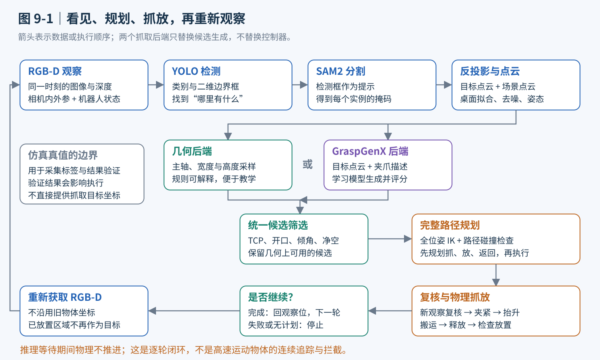
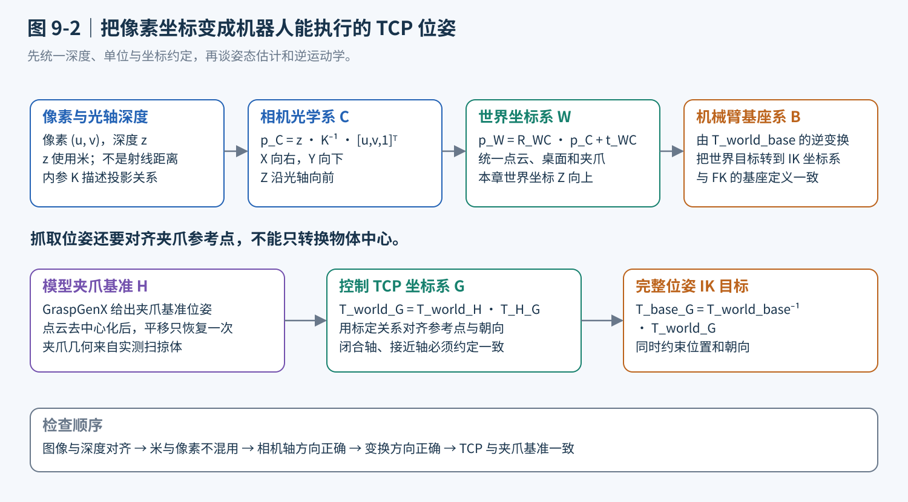
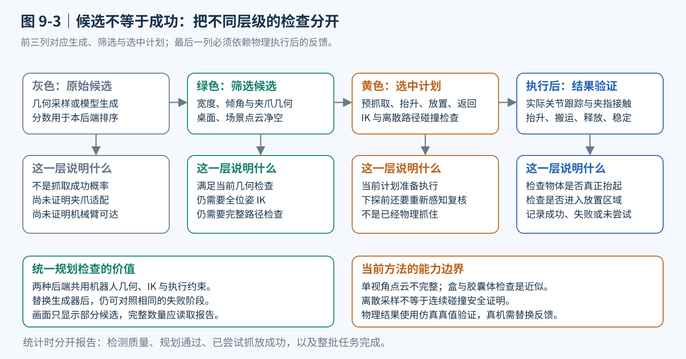
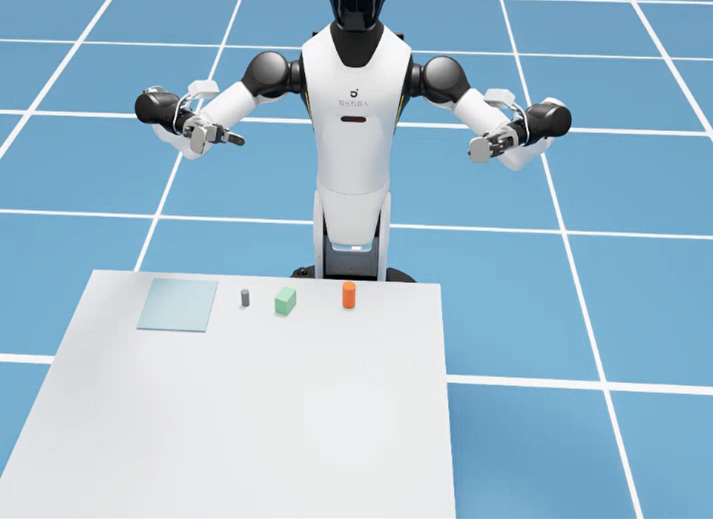
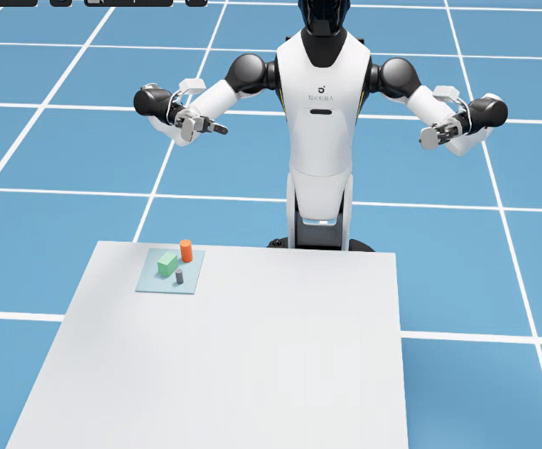
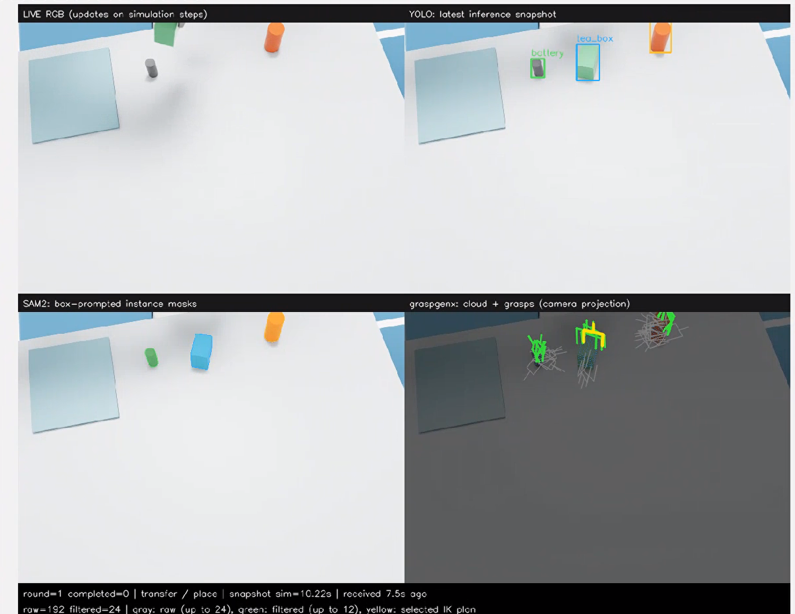
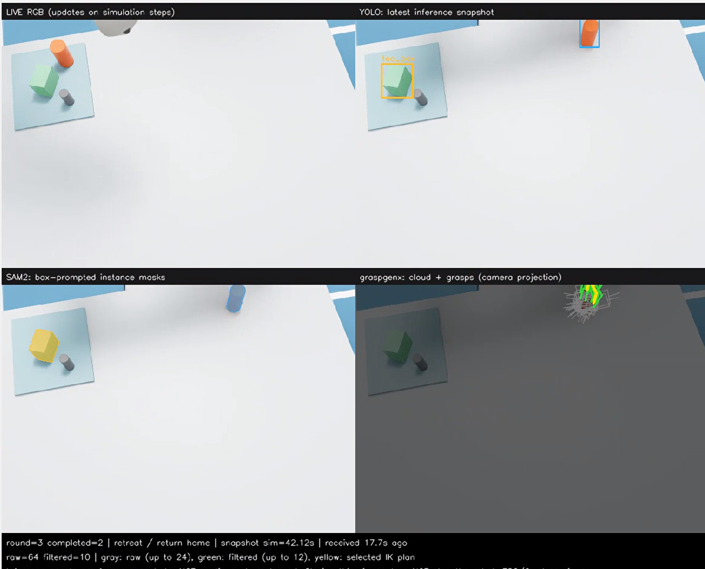

# 第九章 感知控制综合实践：视觉感知控制

第五章解决了“给定末端目标，机械臂怎样到达”的问题，第七章让机器人能够在图像中识别物体，第八章介绍了点云与空间理解。本章把这些能力连接起来，回答一个更具体的问题：**相机看见桌面上的苹果、肥皂和罐子之后，机器人怎样知道夹哪里、从哪个方向接近，并把它们逐个放进接收区？**

看见一个物体，不等于知道它在三维空间中的位置；知道位置，不等于知道夹爪应该朝向哪里；得到抓取姿态，也不等于机械臂能够无碰撞地执行。本章的重点不是把几个模型依次启动，而是弄清这些环节之间的数据关系，让每一步都有可以解释、检查和复现的输入与输出。

对应实践代码位于 `code/code_chapter9`。案例使用 Isaac Sim 中的 G2 Omnipicker，固定移动底盘，由右臂完成桌面小物体的抓取与放置。感知侧使用 YOLO 检测、SAM2 实例分割和 RGB-D 点云，抓取候选可以由传统几何方法或 GraspGenX 生成，执行侧沿用第五章的完整位姿逆运动学与关节控制。

开始之前，先明确五个边界：

1. **本章是模块化视觉引导抓取，不是 VLA 端到端动作策略。** YOLO、SAM2 和 GraspGenX 是学习模型，点云处理、几何估计、逆运动学和执行检查主要是显式算法。不能把整个系统都称为传统方法。
2. **当前“动态”体现为场景变化后的重新观察，而不是移动目标拦截。** 机械臂抓一个、放下、回位，再重新感知；推理和规划等待期间，主循环不推进物理时间。本章没有实现传送带抓取、速度预测或连续视觉伺服。
3. **物体姿态采用桌面支撑假设下的 2.5D 几何估计。** 这不是从单张图像恢复任意物体完整 CAD 六维姿态；夹爪目标本身仍是需要同时约束位置和朝向的六维位姿。
4. **在线抓取目标来自视觉，但整个实验不是完全不用仿真真值。** 真值用于训练标注、场景重置、机器人标定，以及抬升与放置结果验证；其中执行验证还决定状态机是否继续。它不用于直接提供待抓物体的目标坐标，不通过瞬移或强制附着制造成功。
5. **候选筛选和路径检查不构成真实机器人安全认证。** 单视角点云存在遮挡，碰撞模型有所简化，执行过程也没有持续更新所有障碍物。真实部署还需要标定、传感器反馈和独立安全措施。

正文前五部分集中讲原理、数据流和代码对应关系，不穿插可执行代码；第六部分统一给出源码下载、环境安装、权重准备、训练、测试与结果检查命令。

---

## 第一部分 从“看见物体”到“完成抓放”：先建立完整任务链

### 1.1 检测、分割、姿态和抓取，分别回答什么问题

设相机看到桌面上有一块肥皂。检测器首先给出“这是一块肥皂”和一个矩形框。这个框包含肥皂，也包含周围桌面。如果直接把框中所有深度反投影成点云，桌面点可能比物体点更多，计算出来的中心和方向就会被背景拉偏。

因此，需要分割模型进一步回答“哪些像素属于这一块肥皂”。掩码与同帧深度结合，才能得到较干净的物体点云。随后，几何估计回答物体大致位于哪里、长轴朝向哪里、有多高；抓取生成器则提出夹爪的位置、朝向和开口需求。

最后，运动控制还必须回答：当前关节状态能否到达这个位姿？接近、抬升和搬运的中间路径是否会碰到桌子、其他物体或另一只手臂？夹爪闭合后物体有没有真的被拿起来？

| 环节 | 输入 | 输出 | 不能替代的下一步 |
|---|---|---|---|
| YOLO 检测 | RGB 图像 | 类别、置信度、边界框 | 不能直接提供精确物体轮廓和米制距离 |
| SAM2 分割 | RGB 图像、检测框 | 实例掩码、掩码质量评分 | 不负责测量深度，也不独立决定物体类别 |
| RGB-D 反投影 | 掩码、深度、相机参数 | 物体和场景的三维点 | 不能自动消除遮挡或恢复不可见背面 |
| 几何姿态估计 | 物体点云、桌面平面 | 中心、主方向、尺寸、高度 | 物体坐标系不等于夹爪抓取坐标系 |
| 抓取候选生成 | 点云、夹爪描述 | 多组抓取位姿、开口需求与分数 | 高分候选不等于机器人可达 |
| IK 与路径检查 | 候选、机器人状态、场景 | 分阶段关节路径 | 规划可行不等于接触抓取必然成功 |
| 执行与验证 | 关节路径、仿真反馈 | 抓取、放置结果及停止原因 | 一次成功不代表所有布局都可靠 |

图 9-1 展示了本章真正需要连通的数据流。注意，几何方法与 GraspGenX 是抓取生成阶段的两条可选分支，并不是两套互不相关的抓取系统。



### 1.2 为什么先做固定底盘的桌面场景

第四章已经介绍底盘运动，但本章不同时加入导航。因为底盘一旦移动，相机与机器人相对目标的关系、工作空间和障碍物分布都会改变。对于第一次打通视觉与机械臂控制的学习者，先把这些变化固定住，更容易判断错误来自检测、坐标变换还是 IK。

本章保留两个重要的已知条件：**工作台大致位置**和**放置区域位置**。它们是任务先验，不是每件物体的真值。桌面平面仍要根据深度拟合，待抓物体的位置仍要从视觉获得。相机外参可以在仿真中直接读取；真实部署时，这一项必须换成经过验证的相机标定结果。

代码使用一台固定 RGB-D 相机，配置分辨率为 640×480，物理步频为 120 Hz、相机配置频率为 30 Hz。这些是仿真配置，不代表整条感知链路能够达到每秒 30 次推理。

### 1.3 本章可以摆放哪些物体

案例内置 15 类小物体。它们由程序生成网格、材质和刚体属性，尺寸专门限制在 G2 小夹爪和桌面工作空间适用的范围内。它们是教学代理模型，不是同名真实物品的精确扫描件。

| 组别 | 命令中的类别名称 | 适合观察的现象 |
|---|---|---|
| 水果和蔬菜 | `apple`、`orange`、`lemon`、`tomato`、`potato` | 近圆形物体朝向不明显；细长物体有较清楚的主轴 |
| 盒状物体 | `soap`、`sponge`、`tea_box`、`wood_block`、`eraser` | 长短轴、不同夹取宽度和较低物体的桌面净空 |
| 瓶罐与其他形状 | `can`、`bottle`、`cup`、`spool`、`battery` | 圆柱对称性、局部接触宽度、开口和非凸形状的困难 |

同一批最多放置六件，当前入口不允许同名物体重复。这是场景和数据关联设计的限制，不是 YOLO 天生只能识别六件物体。代码还会检查初始布局与桌边、放置区和其他物体的间距，避免一开始就把待抓物体放进“已完成区域”。

“海绵”“水果”等名称也不意味着启用了软体仿真：当前这些对象都是刚体。材质采用适合教学接触抓取的摩擦设置。不能据此宣称已经解决透明瓶、柔性包装、密集堆叠或真实水果受挤压变形的问题。

---

## 第二部分 把二维识别变成三维测量：检测、分割与 RGB-D 点云

### 2.1 YOLO 负责找目标，为什么本章还要训练自己的检测器

YOLO 可以理解为一个同时预测类别与边界框的检测网络。图像先经过多层特征提取，不同尺度的特征再进行融合，使网络既能识别整体外形，也能保留小物体的位置线索。检测头产生类别和框的预测，后处理根据置信度及重叠程度筛选结果。

对于两个框 $B_1$ 和 $B_2$，交并比定义为：

$$
\operatorname{IoU}(B_1,B_2)=\frac{|B_1\cap B_2|}{|B_1\cup B_2|}
$$

如果多个框都覆盖同一个物体，非极大值抑制会按评分和重叠关系去除重复结果。本章在调用检测器时设置 IoU 阈值为 0.45，默认置信度阈值为 0.18。这只是当前仿真模型使用的参数，不是所有机器人场景的通用最优值。

为什么不直接使用通用检测权重？因为训练于真实照片的模型未必认识程序生成的简化网格。一根红色圆柱既可能被判断为罐子，也可能被判断为杯子；粉色长方体也不必然被识别为肥皂。对本章固定的 15 类教学对象，训练一个小型专用检测器通常更容易检查和复现。

当前训练入口使用 YOLOv8n 预训练权重初始化，学习本章类别与外形之间的对应关系。损失可以概括为框定位、类别分类和边框分布回归几个部分的加权组合；具体检测网络与损失由固定版本的 Ultralytics 实现，本章没有重写检测器训练算法。

代码还保留 YOLO-World 分支，通过类别文本提示和 CLIP 支持开放词汇检测。它适合对比“文本描述是否足以识别这个物体”，但并不保证在本章简化模型上优于专用检测器。主程序的自动模式优先寻找本章训练权重，找不到才使用 YOLO-World。**因此，缺少专用权重时仍能启动，不代表运行的还是同一个检测模型。**

### 2.2 SAM2 怎样利用检测框找到实例轮廓

SAM2 是可提示的分割模型。对于本章的单帧用法，可以将其理解为三个配合工作的部分：图像编码器提取视觉特征，提示编码器表达“关注这个框中的对象”，掩码解码器结合两者输出候选掩码和质量评分。

本章先对整张 RGB 图像进行一次图像编码，再逐个将 YOLO 检测框送入 SAM2。在存在分割歧义时，模型可以返回多个候选掩码，程序选择内部质量评分最高的一个。这个分数是模型对分割质量的估计，不是机器人抓取成功概率。

仅选择最高分掩码还不够。本章随后依次执行：

1. 拒绝质量评分低于 0.60 的掩码。
2. 将掩码限制在检测框附近，防止明显扩散到邻近物体和背景。
3. 保留最大的连通区域，减少零散小块。
4. 拒绝过小或覆盖整幅图过大比例的掩码。
5. 根据掩码重叠关系去除重复实例。

在反投影物体点云之前，还会对掩码做一次小范围腐蚀。其目的不是让物体“变小”，而是尽量避开深度边界处容易混入的桌面或背景像素。但薄小物体也可能因此损失有效点，最终需要由点数阈值决定是否继续，而不能无条件相信处理后的掩码。

这里有两个容易忽略的实现细节。

**第一，RGB 与 BGR 不能混用。** 当前 Ultralytics 的数组输入按 BGR 处理，而 SAM2 接收 RGB。代码在检测入口转换通道顺序，传给 SAM2 时仍保留 RGB。图像形状正确但通道顺序错误，程序不一定报错，却可能明显影响颜色相关识别。

**第二，本章使用的是 SAM2 图像预测接口，不是视频跟踪接口。** 并没有在连续帧之间维持 SAM2 记忆状态，也没有通过它给物体建立永久跟踪 ID。后面的目标复核是重新检测、重新分割，再做简单的数据关联。

此外，当前输出中的检测框和终端“检测数量”，实际对应通过上述分割筛选后保留的实例，不是所有未经筛选的 YOLO 原始框。理解这一点，才能解释“模型曾经输出框，但最后结果中没有这个实例”的情况。

### 2.3 从像素到米：深度反投影与坐标变换

RGB 告诉我们颜色和外观，深度图告诉我们对应像素沿相机光轴方向的距离。两者必须来自对齐的同一观察，否则掩码选中的物体像素可能对应到另一时刻的背景深度。

设像素位置为 $(u,v)$，光轴深度为 $z$，相机内参为：

$$
K=\begin{bmatrix}
f_x&0&c_x\\
0&f_y&c_y\\
0&0&1
\end{bmatrix}
$$

则相机光学坐标系中的三维点为：

$$
\mathbf p_C=zK^{-1}\begin{bmatrix}u\\v\\1\end{bmatrix}
=\begin{bmatrix}(u-c_x)z/f_x\\(v-c_y)z/f_y\\z\end{bmatrix}
$$

其中焦距 $f_x,f_y$ 用像素表示，深度使用米，输出自然也是米。像素偏移不能直接当作末端位移，必须经过这个几何关系。

本章读取的是到图像平面的光轴深度，而不是从相机光心沿射线测量的欧氏距离。如果输入的是射线距离 $r$，应使用归一化射线方向计算 $\mathbf p_C=r\mathbf d/\|\mathbf d\|$，不能继续把 $r$ 当成光轴深度套用前式。混用两种深度定义会让离主点较远的三维位置产生系统性偏差。

下面统一三个坐标系：世界坐标系 $W$、相机光学坐标系 $C$、机械臂运动学基座坐标系 $B$。记 ${}^{W}T_C$ 表示把相机坐标转换到世界坐标的齐次变换，则：

$$
\begin{bmatrix}\mathbf p_W\\1\end{bmatrix}
={}^{W}T_C\begin{bmatrix}\mathbf p_C\\1\end{bmatrix},\qquad
{}^{B}T_G=({}^{W}T_B)^{-1}{}^{W}T_G
$$

这里 $G$ 是夹爪 TCP 坐标系，第二个式子表示将世界坐标中的抓取目标转换到 IK 使用的机械臂基座坐标。



相机光学坐标采用 X 向右、Y 向下、Z 向前；世界坐标采用 Z 向上。相机朝下观察桌面时，两个坐标系显然不能直接互换。代码显式使用光学坐标约定设置和读取相机姿态，并保存内参与外参，不靠交换几个数组分量“凑出”坐标。

在真实设备上，深度比例、RGB-D 对齐、镜头畸变处理、时间同步以及相机到基座外参都需要单独验证。仿真中能够直接读取外参，只是省去了实验标定步骤，并不意味着真实机器人不需要标定。

### 2.4 点云为什么要分成“场景”和“目标”两条支路

如果只保留目标点云，规划器看不见邻居和桌面；如果把整张图的点云都用于估计目标，物体几何又会被背景污染。因此，代码同时维护两类点云。

**场景点云**由整幅深度反投影得到，经过工作台区域裁剪，用于桌面拟合和碰撞检查。当前场景支路以隔点方式采样深度，再做约 3 mm 的体素降采样。在一个小立方体内用平均点代表多个点，既降低计算量，也避免某些表面因像素过密而占据过高权重。

**目标点云**由实例掩码筛选深度像素得到，经过降采样、离群点过滤和桌面分离，用于姿态估计与抓取生成。离群点处理根据邻域距离衡量点是否孤立，并使用中位数及中位绝对偏差减少少量飞点的影响。

桌面拟合使用 RANSAC。每次从候选点中抽取三个不共线点，得到平面假设：

$$
\mathbf n^\top\mathbf p+d=0,\qquad \|\mathbf n\|=1
$$

统计距离平面足够近的内点，保留支持最多的假设，再用 SVD 对内点进行精细拟合。已知桌高只用于限制搜索区域；如果有效点不足或平面不可靠，程序直接拒绝，而不是回退为“假装拟合成功”。本章要求桌面近水平，并统一法向朝上。

对于单位法向，$\mathbf n^\top\mathbf p+d$ 就是点到桌面的有符号距离。物体支路只保留明显高于桌面的点，避免把桌面当成物体底部。当前筛选阈值为 7 mm，实例至少需要 40 个有效点。这也解释了为什么非常薄、很小或严重遮挡的物体可能没有候选：系统选择拒绝不可靠测量，而不是补一个猜测位置。

**单视角点云仍然只是可见表面。** 体素化、去噪和 RANSAC 都不会凭空恢复杯子的背面、盒子的底面或被另一件物体挡住的区域。后续所有几何判断都必须保留这一不确定性。

---

## 第三部分 从物体几何到夹爪目标：两种抓取生成方法

### 3.1 2.5D 姿态估计：能知道什么，不能知道什么

对桌面上的长方形肥皂，我们主要关心它的中心、长轴方向、横向尺寸和高度。对于直立且支撑在近水平桌面上的物体，可以先在世界 XY 平面估计主方向，再结合桌面高度构造一个近似三维包围盒。这就是本章使用的 2.5D 姿态估计。

设平面投影后的点为 $\mathbf x_i=(x_i,y_i)^\top$，其协方差为：

$$
C=\frac{1}{N-1}\sum_{i=1}^{N}(\mathbf x_i-\bar{\mathbf x})(\mathbf x_i-\bar{\mathbf x})^\top
$$

对 $C$ 做特征分解，较大特征值对应的特征向量给出分布延伸最明显的方向，也就是 PCA 主轴。将点云旋转到这一方向后，代码用 1% 和 99% 分位数估计边界，降低极少数异常点对尺寸的影响；顶部取较高分位数，底部由拟合桌面提供，从而得到高度和近似中心。

这种方法的直观含义是：**先让尺子顺着物体摆放，再量它有多长、多宽、多高。** 它得到的是 PCA 对齐的近似包围盒，不是搜索所有方向得到的严格最小体积包围盒。

为什么需要“偏航是否可观测”的标志？如果物体投影接近圆形，两个特征值相近，主轴会很容易被少量噪声改变。球体和竖直圆柱通常没有唯一的几何偏航；正方形物块也可能存在多个等价方向。代码只有在两个特征值之比大于 1.35 时，才标记偏航较明显。

即使长轴清晰，也可能仍有 180° 对称歧义。因此，返回一个旋转矩阵并不表示已经识别出物体语义上的“正面”。对双指夹取来说，一些对称方向可能等价；对插接、拧盖等任务来说，这种姿态估计就远远不够。

这里必须区分两件事：

- **物体姿态**描述物体几何如何摆放，本章采用支撑先验和可见点云近似。
- **抓取位姿**描述夹爪应该放在哪里、朝向哪里。即使物体只估计了 2.5D 几何，夹爪仍要有明确的三维位置和三维朝向。

### 3.2 几何后端：围绕主轴采样，而不是按类别写死动作

当前几何后端不为苹果、肥皂、罐子分别写固定抓取坐标，而是使用同一套点云几何规则。

首先确定抓取坐标系：X 轴为夹爪闭合方向，Z 轴从掌部指向指尖，原点对应第五章控制的夹爪中心 TCP。对于俯抓，Z 轴指向桌面，因此接近桌面的方向约为桌面法向的反方向。

随后，以物体主轴为起点，每隔 30° 采样一个偏航方向，一圈共 12 个。对每个方向，将物体点云投影到夹爪闭合轴，估计夹取所需的开口：

$$
a_i=(\mathbf p_i-\mathbf c)^\top\mathbf x_G,\qquad
w=Q_{0.99}(a)-Q_{0.01}(a)+\delta
$$

其中 $\mathbf c$ 是估计中心，$\mathbf x_G$ 是候选闭合方向，$Q$ 表示分位数，$\delta$ 是开口余量，本章取 6 mm。这样，沿长轴闭合和沿短轴闭合会得到不同的宽度需求。

每个偏航方向再尝试两个接触高度，分别位于估计物体高度的 55% 和 72% 附近，并根据夹指相对 TCP 的实际范围修正桌面净空。因此，在高度条件允许时，每个物体最多得到 24 个几何候选。过低物体可能在生成阶段就被跳过，之后还要继续通过安全筛选。

候选分数偏好较小的开口和较深的夹持位置。但这个分数只是人工设计的排序启发式，**不是概率，也没有显式求解摩擦锥、对向接触或力闭合条件**。即使位姿几何上合理，碰撞形状、接触位置和摩擦仍可能导致物理抓取失败。

### 3.3 GraspGenX：让学习模型提出更多样的抓取候选

GraspGenX 是跨夹爪形态的抓取生成模型。与仅对一种固定夹爪学习抓取的方式不同，它把物体点云和夹爪描述作为条件，生成抓取位姿，并使用评分模型对候选进行评估。

可以用下面的条件关系理解它：

$$
\{(T_i,s_i)\}_{i=1}^{M}
=F_\theta(P,\mathcal G,\xi)
$$

其中 $P$ 为物体点云，$\mathcal G$ 为夹爪几何或运动相关描述，$\xi$ 表示采样噪声，$T_i$ 是抓取位姿，$s_i$ 是候选评分。它的输出是一组可能的抓法，不是一串直接驱动 G2 关节的角度。

扩散生成的直观理解是：从带有随机性的位姿表示开始，在物体形状和夹爪条件的引导下逐步去噪，得到更符合训练中抓取分布的候选。评分器再根据输入条件判断候选质量。**这个过程不是大语言模型的文字推理，也不是在运行时对当前物体重新训练。**

本章适配器调用上游扩散规划入口，请求采样 256 个抓取并保留前 64 个返回候选。之后还要估计接触区域的开口需求、转换 TCP 坐标并执行本章筛选，所以报告中的原始候选数量不一定等于 64；多个物体时也不是整场固定 64 个。

这里还有一个重要限制：虽然上游可以生成六维候选，本章执行侧只接受与俯抓方向夹角不超过 25° 的姿态。侧抓、倒抓等候选会被拒绝。不能看到模型支持六维抓取，就认为本章已经验证任意方向的机械臂动作。

### 3.4 为什么夹爪标定和 TCP 转换不能省略

同一个物体，对小夹爪和宽夹爪的可抓区域并不一样。只给 GraspGenX 一团点云而不告诉它夹爪的特点，或者直接冒用其他品牌的夹爪描述，都可能导致模型生成 G2 无法实现的候选。

本章在 Isaac 中测量 G2 夹指的几何与不同开合状态，保存最大开口、指厚、指深、相对 TCP 的范围，以及打开和半开时的简化扫掠区域。这里的“扫掠”可以理解为夹爪运动时指间能够作用到的空间。本章用盒状参数近似表达这些区域，并不是把完整高精度夹爪网格交给模型。

适配器显式检查发布权重使用的夹爪编码方式，只接受与当前简化扫掠体描述兼容的配置。如果换成还要求夹爪点云或 TSDF 的模型，不能用缺失信息的占位对象蒙混通过。

另一个常见错误是坐标原点不一致。上游返回的是模型使用的夹爪基准坐标，而第五章控制的是 G2 的夹爪中心 TCP。记模型基准为 $H$，控制 TCP 为 $G$，则应执行：

$$
{}^{W}T_G={}^{W}T_H\,{}^{H}T_G
$$

如果遗漏这个固定偏移，机器人可能方向正确，却把掌部或夹爪基座移动到了物体中心。代码先对输入点云减均值以满足上游接口，输出后再加回平移，最后右乘基准到 TCP 的固定变换。不能重复减均值、忘记加回，或把局部偏移直接当世界方向相加。 当前适配器假定模型基准轴与控制 TCP 轴已对齐，因此这一步的固定变换只写入标定平移。更换夹爪或坐标定义后，若两者还有旋转差异，就必须补全旋转部分，不能照搬这项假设。

开口宽度同样需要辨明来源：**当前适配器从候选局部接触高度附近的点云估计所需宽度，并不是直接把上游输出解释成 G2 电机角度。** 执行器仍按标定好的打开、闭合目标驱动夹爪，由物理接触约束闭合结果；没有将每个候选宽度转换成精密的力控或宽度伺服命令。

### 3.5 两种后端为什么必须经过同一层筛选

两条后端最终统一输出抓取位姿、宽度、分数、对象编号和来源。几何方法的分数与学习模型的分数含义不同，不应该跨后端直接比较数值高低；本章是在一次运行中选择一种后端，然后在该后端候选内部排序。

| 比较项 | 几何后端 | GraspGenX 后端 |
|---|---|---|
| 主要依据 | 主轴、投影宽度、接触高度和人工规则 | 点云与夹爪条件下的学习式生成、评分 |
| 额外抓取权重 | 不需要 | 需要生成器和评分器权重 |
| 可解释性 | 易追踪到几何量和阈值 | 可检查输入输出，但内部决策不如几何规则直观 |
| 主要限制 | 单视角几何近似，缺少显式接触力学验证 | 输入质量、训练分布、夹爪适配和候选可达性 |
| 本章后续处理 | 同一套候选筛选、IK、路径和控制 | 同一套候选筛选、IK、路径和控制 |
| 是否保证成功 | 否 | 否 |

统一筛选首先检查变换矩阵是否有效、开口是否在夹爪可用范围内、抓取方向是否符合俯抓限制。然后从抓取点向上方预抓取点沿接近方向采样，检查夹指和掌部的简化包围盒是否碰到可见场景点，并检查夹指关键角点与桌面的距离。

该阶段默认以最大开口进行保守夹爪检查，不等于已经模拟了完整闭合过程。它也没有检查整条机械臂路径，因此通过后只是“值得尝试规划”的候选。代码按实例轮转取候选，最多保留 24 个，防止一个不可达物体占满全部尝试预算。



---

## 第四部分 让候选真正变成动作：完整位姿 IK、路径与执行闭环

### 4.1 到达一个点还不够，必须同时到达正确朝向

假设夹爪中心到达了肥皂上方，但夹指方向沿着肥皂长边，所需开口超过夹爪能力，这仍然不是合格抓取。更危险的是，位置正确但掌部朝下，可能让夹爪背面先碰到物体。因此，本章对抓取目标求解完整位姿 IK，不在失败时偷偷退化为只控制位置。

设关节角为 $\mathbf q$，正运动学得到位置 $\mathbf p(\mathbf q)$ 和旋转 $R(\mathbf q)$。目标位置与朝向为 $\mathbf p^*,R^*$，任务误差写为：

$$
\mathbf e=\begin{bmatrix}
\mathbf p^*-\mathbf p(\mathbf q)\\
\alpha\,\operatorname{Log}\!\left(R^*R(\mathbf q)^\top\right)^\vee
\end{bmatrix}
$$

旋转误差是轴角意义下的三维向量，不是直接相减欧拉角；$\alpha$ 用于平衡位置和姿态误差。相应地，雅可比的旋转部分也采用相同权重，避免只缩放误差却没有同步缩放模型。

第五章的阻尼最小二乘更新可概括为：

$$
J^\#=J^\top(JJ^\top+\lambda^2I)^{-1},\qquad
\Delta\mathbf q=J^\#\mathbf e+\eta(I-J^\#J)\mathbf g(\mathbf q)
$$

其中阻尼 $\lambda$ 缓解奇异附近的数值问题；$\mathbf g$ 是让关节远离限位、靠近中间位置的小幅偏置。由于采用阻尼伪逆，后一个投影项是近似的零空间修正，并不保证严格不影响主任务，最终仍要以实际 FK 误差验收。

G2 右臂有七个关节，可能存在多个解。控制器从当前关节状态、回位状态等多个初值求解，优先选与当前状态接近的结果；同时限制单步角度变化并检查关节限位。求解器报告成功后，还会重新计算 FK，检查位置误差小于 4 mm、朝向误差小于 0.03 rad。仿真启动时也会对照机器人实际 TCP 检查运动学模型是否一致。

### 4.2 为什么抓取前就要规划好放置和返回

只规划“到物体上方”很容易造成半途无路可走：物体已经拿起，却无法保持安全姿态移到接收区。本章因此在执行前规划整条阶段链，而不是边走边临时拼接未经检查的动作。

流程包含：侧上方观察位、预抓取位、下探、抬升、搬运、释放、撤离和回位。侧上方观察位用于减少夹爪遮挡目标；到达后进行视觉复核，再移动到目标正上方并下探。预抓取距离默认 12 cm，抬升距离默认 16 cm，这些是当前桌面案例参数。

从当前状态到观察位、释放后回位，采用关节空间插值；下探、抬升、搬运等阶段采用固定朝向的笛卡尔直线段，对线上采样点逐个求 IK，并继续检查相邻关节段。如果相邻解突然跳到另一个 IK 分支，程序会拒绝该路径。

**这不是 MoveIt2 的全局运动规划，也没有实现 RRT 或任意障碍环境搜索。** 代码尝试有限个观察方向和分段路径，找不到安全方案就停止。与后续机械臂规划章节相比，本章更关注把视觉目标正确交给运动学和控制。

放置也不是高精度装配：代码在接收区几个备选点中，选择与当前可见占据点较远的位置，再保留一定高度释放，让物体落在低托盘中。它不是带接触力反馈的精密落座，也不应该用于易碎品真实投放。

### 4.3 碰撞检查必须包含夹爪、手臂和被拿起的物体

候选生成阶段只检查夹爪仍然不够。一个夹爪位姿可能完全不碰桌面，但通往它的肘部会扫过邻近物体。当前控制器增加了几层近似检查：

- **夹爪与场景：**用指部、掌部保守盒检查场景点，并检查桌面净空。
- **手臂与场景：**在连杆线段上采样，以距离阈值近似胶囊体检查。
- **左右臂之间：**检查右臂采样点与固定左臂的距离，跳过共同安装区域的特定近邻部分。
- **持物搬运：**从目标可见点与桌面支撑先验构造 TCP 局部包围盒，检查搬运中该盒与背景点、桌面的关系。
- **释放后返回：**给接收区加入保守占据范围，避免按理想落点假设直接穿过可能已经落下的物体。

为什么抬升后要从静态场景中移除目标点？因为原来的点云把目标记录在桌面位置。如果继续把它当静态障碍，规划器会把夹爪拿着的物体和旧位置重复计算。代码从背景中移除目标附近的观测点，并在搬运时将其表示为随 TCP 运动的持物包围盒。

这仍只是近似：没有完整网格级连续碰撞检测，没有覆盖所有机械臂自碰撞组合，也无法识别相机看不到的障碍。离散采样检查存在分辨率限制。正文中的“通过检查”应理解为**通过当前观测和近似模型的检查**，不能替换成“已经证明绝对安全”。

### 4.4 关节插值、实际反馈与接触抓取

规划得到的是一串关节路点，执行时不能瞬间跳到最后一个目标。第五章的轨迹接口使用平滑插值：

$$
s(\tau)=3\tau^2-2\tau^3,\qquad
\mathbf q(\tau)=\mathbf q_0+s(\tau)(\mathbf q_1-\mathbf q_0),\quad \tau\in[0,1]
$$

它让单段开始与结束时的插值速度为零，避免位置指令突变；但分段使用它并不等于全程速度最优或 jerk 连续。底层 articulation 驱动跟踪位置目标，物理引擎计算惯性、碰撞与接触。

控制器每步读取关节反馈，跟踪误差过大或出现非有限值就停止推进；每段结束后等待收敛，并对照实际 TCP 与计划 FK。这样可以发现“数学上求到解，但仿真驱动没有到位”的问题。

夹爪只驱动主关节，其他指节依靠模型中的联动约束运动。真正的抓取依赖夹指闭合产生接触，再随手臂抬升；执行时不会把物体坐标直接改到夹爪上，也不会创建一个强制固定关系伪装夹紧。

验证阶段记录抓取前的仿真物体位置，抬升后要求恰好有一件物体上升超过阈值，当前默认阈值为 4.5 cm。如果不满足，控制器尝试沿已规划的抬升路径退回并打开夹爪，随后停止，而不是带着未知状态横移。搬运途中也会检查是否仍有被抬起的物体，但不是每一步连续接触监测。

放置结果依据目标是否进入接收区、高度是否合理以及线速度是否足够小判断。**这些检查使用仿真真值，而且会影响执行是否继续。** 因此真实部署时，不仅要替换相机来源，还要用视觉、夹爪位置、电流、力或触觉等反馈替换这一验证机制。

### 4.5 连续抓取为什么不是“一次识别后按旧坐标抓到底”

抓走一件物体后，剩余物体的可见区域可能变大，邻居也可能因接触发生移动，接收区则增加了新障碍。所以每轮抓放结束后，机械臂回到利于观察的位置，重新获取 RGB-D，重新检测、分割、生成候选并规划。

已放置物体不是靠永久记住对象 ID 来排除。代码根据已知接收区范围，过滤中位位置落在该区域的目标点云。它是一条任务区域规则，而不是凭真值查询“这个对象是否已经抓过”。这也解释了为什么初始布局必须避开放置区。

在每轮真正下探前，还会进行一次新观察。程序用**相同类别与点云中位位置距离小于 1.5 cm**来判断原目标是否仍在附近。复核不通过就停止，不会自动追逐新位置。复核通过时也不重建整条路径，更没有严格检查目标朝向变化或所有新障碍变化。因此，它能拦截一部分明显目标变化，但不是完整的动态避障规划器。

当前对象 ID 只在一帧结果内部有意义，下一轮检测顺序可以变化；同类别近邻匹配也不等于稳定实例跟踪。这是本章限制同批次名称不重复的另一个原因。

---

## 第五部分 从算法理解到可复现教学：代码、数据与结果

### 5.1 按数据流阅读代码，而不是逐个文件死记

本章代码没有依赖其他章节的运行时导入。第五章的运动学与控制实现已整理进本章，G2 资产也位于本章目录。建议从主入口开始，沿“观察—候选—规划—执行”的方向阅读。

| 学习问题 | 主要文件与入口 | 应关注的数据 |
|---|---|---|
| 一轮抓放怎样组织 | `demo_grasp.py` | CLI、逐轮目录、复核、停止条件 |
| 场景和物体怎样生成 | `scene.py`、`config.py` | 类别、近水平桌面、任务区域、刚体假设 |
| 仿真怎样启动与标定 | `simulation.py` | 实际 TCP、夹爪几何、主关节驱动 |
| 图像怎样变成三维数据 | `camera.py`、`pointcloud.py` | RGB、光轴深度、内外参、坐标系 |
| 检测与分割怎样连接 | `perception.py` | 类别、框、实例掩码与筛选 |
| 感知流水线怎样汇总 | `worker.py` | 场景点云、目标点云、候选与报告 |
| 两种抓取后端怎样替换 | `grasp_planner.py`、`graspgenx_backend.py` | 统一抓取数据结构、TCP 和宽度 |
| 位姿怎样变成关节动作 | `kinematics.py`、`controller.py`、`arm_controller.py` | 完整位姿 IK、路径、反馈与状态机 |
| 不同环境怎样通信 | `worker_client.py` | 常驻进程、JSON 命令、NPZ 数组 |
| 窗口显示什么 | `viewer.py` | 实时 RGB、最近推理快照、阶段信息 |
| 数据和模型怎样准备 | `collect_dataset.py`、`train_detector.py`、`download_weights.py` | 标签、训练配置、权重来源与哈希 |
| 怎样进行离线实验复查 | `replay.py`、`replay_plan.py`、`viewer.py` | 重放感知、抓取候选和规划结果 |

两个 Conda 环境分别负责视觉和 GraspGenX，Isaac 使用其自带 Python。这样做不是因为所有模块不能共存，而是避免 Isaac 的依赖、视觉库和上游模型约束互相干扰。路径形式的 Conda 环境与按名称创建的环境本质相同，本章只是把解释器放在章节目录的 `.envs` 下，便于脚本定位。

主仿真通过常驻 worker 执行推理，数组保存在 NPZ，命令与状态使用 JSON。模型加载后可以跨轮次复用，不需要每抓一个物体重新加载全部权重。子进程会清理不适用的 Python、动态库和 Qt 路径，避免父进程环境污染。**多个进程用于依赖隔离，不代表已经实现连续异步运动控制：主循环等待推理返回时仍暂停推进物理时间。**

### 5.2 训练数据为什么只监督检测器

本章采集的是 RGB 图像与 YOLO 检测框标签。Isaac 语义标注给出哪些像素属于某个类别，再从这些像素求出边界框，将类别编号和归一化框中心、宽高写入标签。

设图像宽高为 $W,H$，框为 $(x_1,y_1,x_2,y_2)$，则标签中的几何量为：

$$
x_c=\frac{x_1+x_2}{2W},\quad y_c=\frac{y_1+y_2}{2H},\quad
w=\frac{x_2-x_1}{W},\quad h=\frac{y_2-y_1}{H}
$$

这里监督的是“哪里有什么”，没有给每个物体提供最优抓取位姿，也没有采集机械臂示教轨迹。因此，这套数据不能直接训练 GraspGenX 或一个 VLA 策略。

采集时会改变物体平面位置、偏航和相机观察位置。类别映射始终使用统一的 15 类顺序，所以分三组采集仍可汇总到一个数据目录；不能每组都重新从零编号，否则同一个类别编号会指向不同物体。

SAM2 使用预训练分割模型；GraspGenX 使用发布的生成器和评分器。只有 YOLO 从通用初始化权重继续训练。

### 5.3 怎样理解验证集、检测指标和历史成功记录

当前采集器每五张图划一张到验证集，其余进入训练集。三组各采集 200 张，共得到 600 张，其中训练 480 张、验证 120 张。训练时使用验证集选择最佳权重，并将最佳模型复制为本章默认检测器。

这是一种同场景分布下的留出验证：训练和验证共享程序模型、材质、背景和相似扰动范围。它并没有隔离全新物体资产、全新相机、真实照片或长期时序。要研究真实泛化，需要另建测试数据，而不是只增加同类截图数量。

检测 mAP50 表示在 IoU 阈值为 0.50 时对类别检测精度进行汇总；mAP50-95 还综合更严格的多个 IoU 阈值。指标高说明类别与框较准确，但不能直接说明深度正确、夹爪能夹住或搬运不会掉落。

本地历史模型使用过 570 张图、40 轮训练；这与本节建议重新采集的 600 张不同。不能把旧模型的指标复制成新训练结果。`VALIDATION.md` 还收集了多类物体的物理成功记录，但它们来自不同开发阶段和场景，并不是最终版本下的大规模成功率统计。

评价完整系统时，至少分开记录：检测和分割质量、候选生成与规划通过情况、实际抬升结果、最终放置结果。多物体任务还应记录整批是否完成。某轮没有候选而提前停止时，剩余物体是“未尝试”，不应全部计入“已经尝试但物理抓取失败”。

### 5.4 四宫格窗口是观察工具，不是新的控制回路

独立窗口依次显示当前 RGB、最近一次检测、最近一次分割，以及同帧点云和抓取投影。原始候选显示为灰色，经过统一筛选的候选显示为绿色，已经选中进入执行计划的抓取显示为黄色。

绿色不代表完成 IK，也不代表物理成功；黄色表示当前计划选中的抓取，仍要经过真实接触和结果验证。右下角是三维信息在相机图像上的二维投影，不是可交互旋转的完整三维点云窗口。为避免遮挡，窗口只展示部分候选，不能拿画面上的线条数量代替报告中的完整数量。

RGB 发布按墙钟时间节流，当前最多约每 0.12 秒发布一次，但需要仿真有新的步进。推理与规划暂停物理推进时，RGB 也不会继续看到真实的新运动。检测、分割和抓取面板在一次完整推理完成后更新，不是三个模型各自逐帧流式输出。

窗口只读结果，不参与规划。关闭它不会停止当前抓取任务，也不是急停。使用“无 Isaac 主窗口但保留感知窗口”的模式时，仍然需要可用桌面；真正无桌面机器应导出图片或使用离线报告。

---

## 第六部分 实践操作：从环境准备到逐物体抓放

前五部分解释算法，本部分集中放置可执行命令。**所有命令都在 `code_chapter9` 的根目录执行，不需要进入其中的 `code` 目录，也不要再次给输出路径添加 `code/code_chapter9` 前缀。** 本仓库的对应位置如下；如果你把章节单独放到了其他位置，只需要修改首次进入目录的命令。

**进入章节目录。** 后续命令都在这个目录执行，权重、数据和输出路径均相对于它。请将路径改成你实际保存章节的位置。

```bash
cd /home/robot/g2_robot/code/code_chapter9
```

下面没有要求先批量设置环境变量，也不要求先激活某个 Conda 环境。安装使用 Conda 创建环境，运行时直接选择对应解释器。命令前出现的环境变量只对该次命令及其子进程生效。

### 友情提醒！

**在6.1和6.2下载完第三方源码并创建好独立的环境文件夹后，weights模型权重文件，后续需要采集的数据文件以及微调后的模型文件都可以在huggingface的datawhale, hello-robotics-chapter9中进行下载。下载完成放入对应的文件夹之后，可以直接跳转到6.5节进行测试**

下载链接：https://huggingface.co/Datawhale/hello-robotics-chapter9/tree/main

### 6.1 准备运行基础，下载固定版本的第三方源码

本章按已有工程的验证组合说明：Linux、独立安装的 Isaac Sim 5.1、Python 3.11、PyTorch 2.7.1 + CUDA 12.8 轮子、Torchvision 0.22.1；已有物理测试使用 RTX 5090。这里的版本是**本章复现基线，不是要求安装“最新版本”**。其他显卡或 Isaac 版本需要自行核验驱动、传感器接口和资产兼容性，不能把本机记录视为全部平台认证。

Isaac Sim、NVIDIA 驱动和 Conda 是外部基础软件，不包含在章节文件夹中。下面假定 Isaac 位于 `/home/robot/isaac-sim`，Conda 位于 `$HOME/miniconda3`，并且已能独立启动 Isaac。若尚未安装，请先完成第一章的基础安装，再执行本章步骤；**不要通过向 Isaac 自带 Python 随意安装 PyTorch 来补齐视觉环境。**

第三方源码可以直接从官方仓库下载，但要区分**源码版本**和**模型权重版本**。本章适配的是下列固定提交，而不是日后不断变化的主分支。若教程包已带有这些目录，跳过对应的下载和检出命令，避免覆盖已有修改；若是缺少源码的新目录，执行：

**创建第三方源码目录。** 用于集中保存 SAM2、CLIP 和 GraspGenX 的源码；已有目录时不会清空其内容。

```bash
mkdir -p third_party
```

**下载 SAM2 源码。** 将分割模型的官方源码保存到 `third_party/sam2`。下载完成后，再执行下一条版本切换命令。

```bash
git clone https://github.com/facebookresearch/sam2.git third_party/sam2
```

**固定 SAM2 版本。** 将刚下载的 SAM2 切换到本章使用的提交，避免直接使用后续变化的主分支。

```bash
git -C third_party/sam2 checkout --detach 2b90b9f5ceec907a1c18123530e92e794ad901a4
```

**下载 CLIP 源码。** 将 YOLO-World 文本编码所需的源码保存到 `third_party/CLIP`，供视觉环境安装脚本使用。

```bash
git clone https://github.com/openai/CLIP.git third_party/CLIP
```

**固定 CLIP 版本。** 将 CLIP 切换到本章记录的提交；需要先完成上一条下载命令。

```bash
git -C third_party/CLIP checkout --detach d05afc436d78f1c48dc0dbf8e5980a9d471f35f6
```

**下载 GraspGenX 源码。** 将学习型抓取生成器的源码保存到 `third_party/GraspGenX`。仅使用几何后端时，可以跳过此项及下一条命令。

```bash
git clone https://github.com/NVlabs/GraspGenX.git third_party/GraspGenX
```

**固定 GraspGenX 版本。** 将抓取模型源码切换到本章适配的提交。这一步固定的是源码，模型权重将在后面单独下载。

```bash
git -C third_party/GraspGenX checkout --detach b9429097728cb1c430dd78b92edf17ba318aad03
```

仅学习几何后端时，不需要下载 GraspGenX 源码或安装其环境；SAM2 仍然需要。当前视觉安装脚本还会安装 CLIP，用于可选的 YOLO-World，因此按原脚本安装时也应准备 CLIP 目录。

### 6.2 创建隔离环境，下载权重

安装脚本只在本章创建两个 Conda prefix 环境。`.envs/vision` 不是另外一种环境管理器，而是 Conda 环境的磁盘位置；它和 `conda create -n 名称` 的主要区别在于通过路径定位。

**安装视觉环境。** 在 `.envs/vision` 中创建或复用 Conda 环境，安装 YOLO、SAM2、CLIP 和点云处理依赖；两个抓取后端都需要这一环境。

```bash
CONDA_EXE="$HOME/miniconda3/bin/conda" bash setup_env.sh vision
```

**安装 GraspGenX 推理环境。** 在 `.envs/graspgenx` 中创建或复用独立环境，安装学习型抓取推理依赖。仅运行几何后端时可以跳过。

```bash
CONDA_EXE="$HOME/miniconda3/bin/conda" bash setup_env.sh graspgenx
```

如果 Conda 不在这个位置，仅修改该次命令的 `CONDA_EXE`。脚本会复用已经存在的对应环境，因此已有环境且工作正常时可以直接跳过。两套环境的职责是：

| 解释器 | 执行内容 | 不应承担的任务 |
|---|---|---|
| Isaac 的 `python.sh` | 仿真、相机采集、机器人控制、数据采集 | 不用于安装本章的完整视觉依赖 |
| `.envs/vision/bin/python` | YOLO、SAM2、点云、几何后端、检测器训练、离线分析 | 不直接创建 Isaac 仿真 |
| `.envs/graspgenx/bin/python` | 官方 GraspGenX 模型推理 | 本章不提供它的从零训练流程 |

`requirements.txt` 固定了 Ultralytics 8.3.203、NumPy 1.26.4、SciPy 1.14.1、OpenCV 4.11.0.86 等依赖；GraspGenX 的依赖单列在 `requirements-graspgenx.txt`。SAM2 的可选 CUDA 后处理扩展不编译，掩码后处理由本章 OpenCV 代码完成。

**GraspGenX 这里是最小推理环境，不是完整上游训练环境。** 上游包元数据声明的 Torch/Torchvision 上限与本章的 cu128 组合不同，安装脚本以 `--no-deps` 配合显式推理依赖处理。本章记录中验证了所用发布模型的推理，但 `pip check` 仍可能报告这些版本差异和缺失的训练、渲染可选包。不要把它写成“所有上游依赖检查通过”，也不要为了消除警告直接在其他环境中升级或降级依赖。

环境安装完成后下载所需权重。已经带有完整权重的目录可以跳过此步骤，无需重复下载。

**下载视觉与抓取权重。** 下载基础视觉模型、CLIP 和 GraspGenX 的发布权重到 `weights/`。只使用几何后端时去掉 `--graspgenx`；本章专用的 `chapter9_yolo.pt` 需另行提供或训练生成。

```bash
PYTHONPATH= PYTHONNOUSERSITE=1 .envs/vision/bin/python download_weights.py --graspgenx
```

| 本地文件 | 来源与用途 | 约占用 |
|---|---|---|
| `weights/yolov8n.pt` | 通用检测初始化权重，用于本章 YOLO 训练 | 7 MB |
| `weights/yolov8s-worldv2.pt` | 可选的开放词汇检测器 | 26 MB |
| `weights/clip/ViT-B-32.pt` | YOLO-World 的文本编码 | 354 MB |
| `weights/sam2.1_hiera_small.pt` | SAM2.1 Hiera small 分割模型 | 184 MB |
| `weights/graspgenx/release/gen/epoch_736.pth` | 抓取生成器 | 1.21 GB |
| `weights/graspgenx/release/dis/epoch_1056.pth` | 抓取评分器 | 484 MB |
| `weights/graspgenx/release/gen/config.yaml`、`release/dis/config.yaml` | 与上述模型对应的网络配置 | 很小 |
| `weights/chapter9_yolo.pt` | 教程包提供或下一节训练生成的 15 类检测器 | 6 MB |

GraspGenX 使用固定模型快照 `7c834043c11a11417e31d6d5ea9355801e40a2c1`，下载来源及哈希由 `weights/manifest.json` 记录。源码与权重的固定版本共同构成本章的复现基线。

这里有两个容易混淆的地方：

- **下载脚本不会从官方服务器下载本章专用的 `chapter9_yolo.pt`。** 它不是官方通用模型，必须由教程包提供或通过下一节训练生成。如果清单保留了这个文件的记录而文件尚不存在，先完成训练，再重新校验；训练脚本会更新该条记录。
- **哈希校验是文件一致性检查，不是抓取能力测试，也不是独立的来源认证。** 下载脚本会登记本地文件的哈希。判断收到的文件是否被修改，还需要对照可信的原始发布清单；重新生成清单不能证明旧文件本来就正确。

本机已有记录中，两套环境合计约 15 GB，权重约 2.2 GB，另有源码、机器人资产、安装缓存和训练输出。新安装应留出明显多于这些数字的可用空间，不要只按权重大小准备磁盘。

### 6.3 采集训练数据

安装完成并下载所需权重后，直接采集用于检测器训练的数据。下面从三组物体采集新的教学数据，**共 600 张图，训练 480 张、验证 120 张**。统一写入 `data/tutorial_detection`，采集器会使用相同的 15 类映射。三条命令逐条执行，不要并行启动三个 Isaac 进程争用资源。

**采集第一组：水果和蔬菜。** 摆放苹果、橙子、柠檬、番茄和土豆，采集 200 张带检测框标签的图像，写入 `data/tutorial_detection`。使用 seed 921，并且不显示 Isaac 主窗口。

```bash
PYTHONPATH= PYTHONNOUSERSITE=1 OPENBLAS_NUM_THREADS=1 \
  /home/robot/isaac-sim/python.sh collect_dataset.py --headless \
  --objects apple,orange,lemon,tomato,potato \
  --samples 200 --seed 921 --output data/tutorial_detection
```

**采集第二组：盒状物体。** 上一组采集结束后，摆放肥皂、海绵、木块、茶盒和橡皮，使用 seed 922 再采集 200 张图，追加到同一数据目录。

```bash
PYTHONPATH= PYTHONNOUSERSITE=1 OPENBLAS_NUM_THREADS=1 \
  /home/robot/isaac-sim/python.sh collect_dataset.py --headless \
  --objects soap,sponge,wood_block,tea_box,eraser \
  --samples 200 --seed 922 --output data/tutorial_detection
```

**采集第三组：瓶罐与其他形状。** 第二组结束后，摆放罐子、瓶子、杯子、线轴和电池，使用 seed 923 再采集 200 张图。三组共同覆盖本章 15 类对象。

```bash
PYTHONPATH= PYTHONNOUSERSITE=1 OPENBLAS_NUM_THREADS=1 \
  /home/robot/isaac-sim/python.sh collect_dataset.py --headless \
  --objects can,bottle,cup,spool,battery \
  --samples 200 --seed 923 --output data/tutorial_detection
```

采集器会拒绝覆盖相同物体组合、相同 seed 对应的已有图片。重复实验可以整体改用新的数据目录，或使用新的 seed 追加采集；如果要严格复现上面的 600 张统计，应使用空目录。中途失败时也不要以为重新运行就会自动续采。

数据目录保留图片、标签和 `dataset.json`。用于 Ultralytics 的 `dataset.yaml` 由训练脚本生成，其中的数据根目录会转成当前机器的绝对路径。因此章节搬家后，应重新生成对应训练配置，而不是盲目沿用旧机器上的绝对路径。

### 6.4 训练 YOLO，并进行抓取实验

**这一步只训练 YOLO，不训练 SAM2 或 GraspGenX。** 若仅体验已有模型，可跳过采集和训练；若要学习完整流程，则使用上一节新采集的数据。

训练会把最佳结果复制到默认文件 `weights/chapter9_yolo.pt`。为避免丢失教程包原来的检测器，首次重训前可做一次备份；下面命令不会覆盖已经存在的备份。

**保留原有检测器备份。** 仅在原模型存在且备份尚不存在时复制一份，不覆盖已有备份。这是可选的重训前保护步骤，不会启动训练。

```bash
if [ -f weights/chapter9_yolo.pt ] && [ ! -f weights/chapter9_yolo.before_tutorial.pt ]; then
  cp weights/chapter9_yolo.pt weights/chapter9_yolo.before_tutorial.pt
fi
```

**训练本章 YOLO 检测器。** 使用前面采集的数据，在 GPU 0 上以 batch 16 训练最多 40 轮；`--overwrite` 允许用最佳模型替换 `weights/chapter9_yolo.pt`。SAM2 和 GraspGenX 不参与这次训练。

```bash
PYTHONPATH= PYTHONNOUSERSITE=1 .envs/vision/bin/python train_detector.py \
  --data data/tutorial_detection --epochs 40 --batch 16 --device 0 --overwrite
```

参数中的 `--overwrite` 表示明确允许替换默认检测器，不表示删除已有训练数据。脚本使用 640 像素输入、固定种子和 15 轮耐心值；`--epochs 40` 是最大训练轮数，可能提前停止。显存不足时先把 `--batch 16` 降到 8 或 4，不要同时改动检测器、分割器与抓取后端来掩盖问题。

训练目录位于 `outputs/detector_training/` 下，名称以 `chapter9` 开头；如果已有同名实验，Ultralytics 会创建带编号的新目录。具体最佳模型来源写入 `weights/detector_training.json`。应检查实际训练目录内的 `results.csv`、指标图和验证可视化，而不只看脚本最后打印“已保存”。

### 6.5 由感知到执行：单物体、多物体与独立窗口

以下命令显式指定本章检测器，避免缺少权重时自动切换为 YOLO-World，使不同实验的检测器保持一致。每个实验使用独立输出目录；重跑时建议换目录名，否则可能混入旧轮次文件。

先查看可用物体，并只运行感知：

**查看可选物体。** 在终端列出本章支持的 15 类物体名称、描述和尺寸，方便填写后续的 `--objects`；这条命令不执行感知或抓放任务。

```bash
bash run.sh --list-objects
```

**几何后端的感知实验：只生成抓取候选。** 场景放入苹果、肥皂和罐子，使用本章 YOLO 检测、SAM2 分割和 RGB-D 点云，再用传统几何方法生成并筛选抓取候选。`--perception-only` 表示不执行抓放，`--headless` 表示不显示 Isaac 主窗口；结果保存到 `outputs/tutorial_perception_geometry`。

```bash
bash run.sh --headless --perception-only \
  --detector yolo --weights weights/chapter9_yolo.pt \
  --backend geometry --objects apple,soap,can --seed 9 \
  --output outputs/tutorial_perception_geometry
```

**GraspGenX 后端的感知实验：只生成网络候选。** 场景只放一个罐子，前面的检测、分割和点云流程不变，改由 GraspGenX 生成候选并进行统一筛选。同样不执行抓放，也不开启感知显示窗口；结果保存到 `outputs/tutorial_perception_graspgenx`。需要已安装 GraspGenX 环境并下载对应权重。

```bash
bash run.sh --headless --perception-only \
  --detector yolo --weights weights/chapter9_yolo.pt \
  --backend graspgenx --objects can --seed 9 \
  --output outputs/tutorial_perception_graspgenx
```

此时应检查目标是否被正确分离、目标点云是否落在桌上、抓取候选是否符合夹爪尺度。**`--perception-only` 不执行抓取，也不证明完整路径已经通过 IK。** GraspGenX 环境、权重或适配接口有问题时应显式报错，不能把几何结果当作网络结果展示。

感知正常后，用同样的单物体场景分别测试两个后端，暂时不引入多物体干扰：

**几何后端的单物体抓放实验。** 对一个罐子运行完整视觉、几何抓取、IK、路径规划和物理抓放流程，最多执行一轮。通过规划后机械臂会实际运动，结果保存到 `outputs/tutorial_single_geometry`。

```bash
bash run.sh --headless \
  --detector yolo --weights weights/chapter9_yolo.pt \
  --backend geometry --objects can --max-picks 1 --seed 9 \
  --output outputs/tutorial_single_geometry
```

**GraspGenX 后端的单物体抓放实验。** 对同样的罐子场景改用网络生成抓取候选，其余规划和执行流程保持一致，最多执行一轮。结果保存到 `outputs/tutorial_single_graspgenx`，可与几何后端对照。

```bash
bash run.sh --headless \
  --detector yolo --weights weights/chapter9_yolo.pt \
  --backend graspgenx --objects can --max-picks 1 --seed 9 \
  --output outputs/tutorial_single_graspgenx
```

比较时不要只看候选分数，因为两种后端的分数含义不同。更有意义的是：可用候选数、规划淘汰原因、所选 TCP 朝向、是否真实抬升、是否最终进入放置区。

接着测试连续抓放。`--pick-all` 按本批物体数量安排最多相应轮次，每轮重新感知；它**不是无条件保证清空**，遇到无可用候选或执行失败仍会停止。它与 `--max-picks` 互斥，不要同时填写。

**几何后端的多物体连续抓放实验。** 对苹果、肥皂和罐子逐件抓取、放下、回到观察位并重新感知，再处理下一件。`--pick-all` 设置本批的抓取轮次上限，失败仍会停止；结果保存到 `outputs/tutorial_multi_geometry`。

```bash
bash run.sh --headless \
  --detector yolo --weights weights/chapter9_yolo.pt \
  --backend geometry --objects apple,soap,can --pick-all --seed 9 \
  --output outputs/tutorial_multi_geometry
```

**GraspGenX 后端的多物体连续抓放实验。** 对罐子、电池和茶盒执行逐轮感知与抓放，抓取候选由 GraspGenX 提供。结果保存到 `outputs/tutorial_multi_graspgenx`；这与上一条的物体组合不同，不应直接当作严格同场景性能对比。

```bash
bash run.sh --headless \
  --detector yolo --weights weights/chapter9_yolo.pt \
  --backend graspgenx --objects can,battery,tea_box --pick-all --seed 9 \
  --output outputs/tutorial_multi_graspgenx
```

后一条是多目标实验命令，并非保证三件都成功的承诺。历史上各类别有成功记录，也不能推出新组合、新检测器和新随机布局必然成功。完成三物体实验后，可以从 15 类列表中更换目标，每批不超过 6 个且名称不重复。不要直接把“批量加载更多模型”当成抓取性能提升。

有桌面时，去掉 `--headless` 并打开独立感知窗口。下面同时显示 Isaac 主窗口与四宫格；如果只想保留四宫格，可以加回 `--headless`，但仍需要可用图形桌面。

**打开仿真与独立感知窗口。** 实际执行 GraspGenX 多物体抓放，同时显示 Isaac 主窗口及检测、分割、点云和抓取结果四宫格。任务结束后保留窗口供观察，输出保存到 `outputs/tutorial_gui`；需要可用的图形桌面。

```bash
bash run.sh \
  --detector yolo --weights weights/chapter9_yolo.pt \
  --backend graspgenx --objects can,battery,tea_box --pick-all --seed 9 \
  --show-perception --keep-open --output outputs/tutorial_gui
```

`--keep-open` 会在任务结束后保留仿真供观察；`summary.json` 在退出清理时写入，因此应正常关闭程序后再检查最终汇总。不要在没有桌面时随意设置一个猜测的 `DISPLAY`，也不要把关闭四宫格当成急停。

实验结果如下图所示：


<div style="display: flex; justify-content: center; gap: 16px;">
  
  
</div>

<div style="display: flex; justify-content: center; gap: 16px;">
  
  
</div>


如果 Isaac 安装在其他位置，只对需要它的命令指定路径即可；采集命令则直接改成实际的 `python.sh` 路径。例如：

**使用自定义 Isaac 安装路径。** 仅当 Isaac 不在默认位置时使用：将 `/your/isaac-sim` 替换为实际目录，执行一次几何后端罐子抓放实验。该变量仅对本次启动生效。

```bash
ISAAC_SIM=/your/isaac-sim bash run.sh --headless \
  --detector yolo --weights weights/chapter9_yolo.pt \
  --backend geometry --objects can --max-picks 1 \
  --output outputs/tutorial_custom_isaac
```

### 6.6 读取报告，离线复查，并形成测试结论

主程序将每次完整运行保存为一个目录，每轮为 `pick_00`、`pick_01` 等。理解这些文件比只截一张成功图片更重要。

| 文件 | 用途 | 不能由它单独证明什么 |
|---|---|---|
| `run_config.json` | 后端、种子、对象、参数 | 参数正确不代表执行成功 |
| `calibration.json`、`robot_state.npz` | 实测夹爪几何与机器人状态 | 不证明感知无误 |
| `pick_XX/rgbd.npz` | 当轮原始图像、深度、内外参 | 不等于完整场景真值重建 |
| `pick_XX/perception.json`、`result.npz` | 实例、姿态、点云、抓取候选 | 有候选不等于有可行路径 |
| `pick_XX/planning.json` | 是否选到计划、各候选拒绝原因 | 计划通过不等于物理抓放成功 |
| `pick_XX/after.npz` | 执行后观察，成功走到保存步骤时生成 | 一张图不等于长期稳定性 |
| `summary.json` | 各轮执行记录与退出状态 | 要结合运行模式解释 |

训练和实验完成后，读取实际执行报告：

**读取单物体 GraspGenX 实验报告。** 格式化显示已经完成的 `tutorial_single_graspgenx` 实验汇总，查看实际执行状态与抓放结果；不会重新启动仿真。

```bash
PYTHONPATH= PYTHONNOUSERSITE=1 .envs/vision/bin/python -m json.tool \
  outputs/tutorial_single_graspgenx/summary.json
```

**读取多物体几何实验报告。** 显示已经完成的 `tutorial_multi_geometry` 实验汇总，查看各轮结果及停止原因；需要先完成对应的多物体实验。

```bash
PYTHONPATH= PYTHONNOUSERSITE=1 .envs/vision/bin/python -m json.tool \
  outputs/tutorial_multi_geometry/summary.json
```

`exit_status` 的约定是：0 为正常结束，1 为异常，2 为执行失败，3 为无可用候选或无可行计划。**正常结束还可能来自仅感知、仅标定或达到指定次数，必须结合 `records` 和运行参数判断是否真的完成抓放。** 外层 Isaac 启动脚本可能改变 shell 看到的非零退出码，最终以汇总、执行记录和日志共同判断，不能只依赖终端的 `$?`。

无图形桌面时，可以把已有运行导出为四宫格图片；不重新启动 Isaac，也不重新执行动作：

**导出实验四宫格图片。** 从单物体 GraspGenX 实验的 `pick_00` 读取保存结果，生成 `dashboard.png`。不启动仿真或图形窗口，适合无桌面机器查看实验输出。

```bash
PYTHONPATH= PYTHONNOUSERSITE=1 .envs/vision/bin/python viewer.py \
  --run outputs/tutorial_single_graspgenx --pick pick_00 \
  --save outputs/tutorial_single_graspgenx/dashboard.png
```

若怀疑感知或候选生成有问题，使用保存的 RGB-D 重新推理；若怀疑 IK 或碰撞检查有问题，则使用保存的机器人状态和点云重新规划：

**离线重放感知与抓取生成。** 读取单物体实验保存的 RGB-D，使用当前 YOLO、SAM2 和 GraspGenX 重新推理，将新结果写入 `outputs/tutorial_replay_graspgenx`。不执行机械臂运动，可用于分析同一观察下的候选生成结果。

```bash
PYTHONPATH= PYTHONNOUSERSITE=1 .envs/vision/bin/python replay.py \
  outputs/tutorial_single_graspgenx/pick_00/rgbd.npz \
  --detector yolo --weights weights/chapter9_yolo.pt --backend graspgenx \
  --output outputs/tutorial_replay_graspgenx
```

**离线重放路径规划。** 使用原实验 `pick_00` 保存的机器人状态、点云和候选重新计算 IK 与路径，终端显示规划结果或拒绝原因。不会重新执行感知，也不推进物理仿真。

```bash
PYTHONPATH= PYTHONNOUSERSITE=1 OPENBLAS_NUM_THREADS=1 \
  .envs/vision/bin/python replay_plan.py \
  outputs/tutorial_single_graspgenx --pick pick_00
```

离线感知重放使用当前权重，若权重改变，输出不必与历史运行相同；学习型抓取采样也可能产生差异。离线路径重放不推进物理仿真，所以它适合定位规划问题，不证明接触、抬升和放置必然成功。

形成课程测试结论时，建议逐条记录：代码与权重版本、对象组合、seed、后端、尝试数、抬升成功数、放置成功数、未尝试数以及失败阶段。在多个种子上对两个后端运行相同布局，比挑选各自最好的一张图更有比较意义。可以分别报告“已尝试动作的放置成功比例”与“整批任务全部完成的比例”，不要混用两个分母。

### 6.7 常见问题与教程目录的发布边界

| 现象 | 优先检查 | 不建议的处理 |
|---|---|---|
| 安装时找不到 `third_party/sam2` 等目录 | 源码是否已下载到正确目录、版本是否匹配 | 在系统 Python 中随意补装同名包 |
| `CUDA available: False` 或模型加载失败 | 当前解释器、驱动、轮子、权重完整性与显存 | 不看错误就修改控制器或降低安全阈值 |
| 几何后端能运行，GraspGenX 报错 | 独立环境、生成器与评分器配套配置、夹爪编码 | 静默回退几何后端并宣称网络成功 |
| 检测少、类别错 | 实际使用的检测权重、训练标签、验证预测图 | 用仿真物体坐标替换视觉结果 |
| 掩码看似正常但点云偏移 | RGB/深度对齐、单位、光轴深度、外参方向 | 直接修改目标世界坐标“对齐” |
| 目标点太少或没有候选 | 遮挡、掩码、桌面滤除、目标宽度与夹爪适配 | 只提高采样次数或取消碰撞筛选 |
| 候选很多却全部规划失败 | `planning.json` 中的 IK、间距和路径拒绝原因 | 把网络分数当作运动学可达性的保证 |
| 夹住后掉落、放置失败 | 抬升记录、接触状态、搬运路径与物体稳定性 | 使用固定关节把物体吸附到夹爪上冒充成功 |
| 感知窗口不出现 | 图形桌面与显示权限；无桌面时使用 `--save` | 随意猜测 `DISPLAY` 或循环启动窗口 |
| 校验清单中的文件不存在 | 是否漏发专用 YOLO 或只下载了部分后端权重 | 删除清单条目后声称全部模型验证通过 |


---

本章最重要的不是把 YOLO、SAM2、GraspGenX 三个名字串在一起，而是建立一条可以逐层解释和验证的数据链：**图像里的对象如何变成以米为单位的点云，点云如何约束夹爪位姿，位姿如何变成可达路径，路径又如何通过真实接触与结果检查形成下一轮观察。** 先用几何后端理解这些关系，再用 GraspGenX 替换候选生成器，就能看清学习模型提供了什么，也能看清传统几何、运动学与控制仍然承担哪些不可省略的工作。
